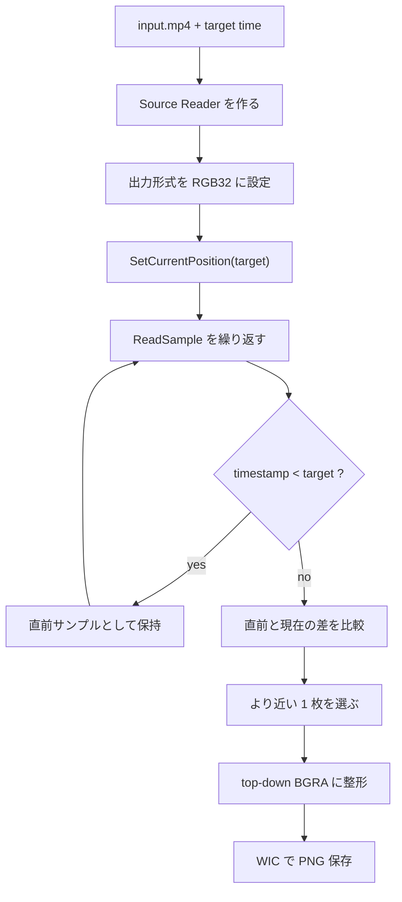

MP4 から「12.3 秒地点の 1 枚」を取りたい、という要件はかなり普通にあります。サムネイル生成、検査ログ、監視映像の代表フレーム、装置ログの証跡などです。

ただ、Media Foundation ではここが少しだけ素直ではありません。`SetCurrentPosition` のあとに `ReadSample` を 1 回呼べば終わりに見えるのですが、実際には key frame、timestamp、stride、画像の上下向き、`RGB32` の 4 バイト目などが絡みます。雑に進めると、時刻が少しズレる、画像が上下逆になる、PNG が妙に透明になる、という地味に嫌な事故が起きます。

Media Foundation の全体像そのものは、以前書いた [Media Foundation とは何か - COM と Windows メディア API の顔が見えてくる理由](https://comcomponent.com/blog/2026/03/09/002-media-foundation-why-it-feels-like-com/) も参考になります。今回はそこから一段降りて、**MP4 から 1 枚抜く** ところだけに絞ります。

この記事では、`IMFSourceReader` を使って、MP4 から **指定時刻に最も近い静止画を 1 枚取り出し、PNG として保存する** ところまでを、フルサンプル付きで整理します。コードはネイティブ C++ のデスクトップアプリ想定です。

## 目次

1. まず結論（ひとことで）
2. この記事の前提
3. まず見る整理表
   - 3.1. 処理の流れ
   - 3.2. 今回の判定ルール
   - 3.3. 処理イメージ
4. 先に押さえる落とし穴
   - 4.1. `SetCurrentPosition` は exact seek ではない
   - 4.2. `ReadSample` は成功でも `pSample == nullptr` があり得る
   - 4.3. `stride` と上下向きを雑に扱うと画像が崩れる
   - 4.4. `MFVideoFormat_RGB32` の 4 バイト目を alpha と決め打ちしない
5. 実装の流れ
   - 5.1. `Source Reader` を同期モードで作る
   - 5.2. seek のあとで timestamp を見ながら詰める
   - 5.3. sample から top-down BGRA へ整形する
   - 5.4. PNG 保存は WIC に任せる
6. フルサンプルコード
7. ビルド方法
8. 実務でのチェックリスト
9. まとめ
10. 参考資料

* * *

## 1. まず結論（ひとことで）

先に結論だけまとめると、こうです。

- MP4 から 1 枚抜くなら、今回は `Media Session` より `Source Reader` のほうが入口として素直です
- `IMFSourceReader::SetCurrentPosition` は exact seek を保証しません。通常は target の少し前、特に key frame 側へ寄るので、そのあと `ReadSample` を進めて目的時刻の前後を比較する必要があります
- `ReadSample` は成功しても `pSample == nullptr` のことがあります。`flags` と `pSample` の両方を見ます
- 出力メディアタイプを `MFVideoFormat_RGB32` に寄せると保存しやすいです
- ただし `RGB32` の 4 バイト目は alpha とは限らないので、そのまま PNG に書くと透明画像になることがあります。保存前に `0xFF` を入れて不透明にしておくのが安全です
- 行ごとの `stride` と top-down / bottom-up を雑に扱うと画像が崩れるので、バッファの取り出しはそこまで含めて整えます

要するに、`seek -> 1 回読む -> 保存` では少し雑で、`seek -> timestamp を見ながら前後比較 -> stride を意識してコピー -> PNG 保存` くらいまでやると、かなり安定します。

## 2. この記事の前提

今回は次の前提で進めます。

- 入力はローカルの MP4 ファイル
- 欲しいのは 1 枚の静止画
- 「指定時刻ぴったり」ではなく、「指定時刻に最も近いフレーム」を返す
- 実装は同期モードの `IMFSourceReader`
- 保存形式は WIC を使った PNG
- 外部ライブラリは使わず、Windows 標準 API だけで完結させる
- 途中で解像度が変わらない、一般的な MP4 を前提にする

再生、音声同期、シークバー、UI 連携までやるなら別の設計もありますが、**1 フレーム取りたい** という用途ならこれがかなり分かりやすいです。

## 3. まず見る整理表

### 3.1. 処理の流れ

| やること | 使う API | 役割 |
| --- | --- | --- |
| MP4 を開く | `MFCreateSourceReaderFromURL` | ファイルからメディアソースを作る |
| 動画だけ選ぶ | `SetStreamSelection` | 音声を読まないようにする |
| RGB32 に変換する | `SetCurrentMediaType` + `MF_SOURCE_READER_ENABLE_VIDEO_PROCESSING` | 保存しやすい uncompressed frame を得る |
| 指定時刻へ移動する | `SetCurrentPosition` | 100ns 単位で seek する |
| フレームを読む | `ReadSample` | デコード済みサンプルを 1 枚ずつ取得する |
| 直前 / 直後を比較する | sample timestamp | 指定時刻に最も近い 1 枚を決める |
| PNG へ保存する | WIC | 画像ファイルへ書き出す |

### 3.2. 今回の判定ルール

「指定時刻の静止画」と言っても、動画は連続量ではなく離散フレームです。なので、実装ではどのルールで 1 枚を選ぶかを先に決めたほうが楽です。

今回は次のルールにします。

- seek 後に `ReadSample` を進める
- `timestamp < target` の最後のサンプルを保持する
- `timestamp >= target` の最初のサンプルが来たら、直前サンプルと現在サンプルの差を比較する
- より target に近いほうを採用する

これで「target 以降の最初の 1 枚」ではなく、**target に最も近い 1 枚** を取りやすくなります。

### 3.3. 処理イメージ



## 4. 先に押さえる落とし穴

### 4.1. `SetCurrentPosition` は exact seek ではない

Microsoft Learn の [`IMFSourceReader::SetCurrentPosition`](https://learn.microsoft.com/en-us/windows/win32/api/mfreadwrite/nf-mfreadwrite-imfsourcereader-setcurrentposition) にもある通り、これは exact seeking を保証しません。動画では通常、指定位置の少し前、特に key frame 側へ寄ります。さらに、そのあと [`ReadSample`](https://learn.microsoft.com/en-us/windows/win32/api/mfreadwrite/nf-mfreadwrite-imfsourcereader-readsample) を進めて目的位置まで前進する前提です。

なので、次の実装はかなり危ういです。

- `SetCurrentPosition(target)`
- `ReadSample` を 1 回
- そのフレームを保存

GOP が長い動画では、これでかなり普通にズレます。ここはちょっとしたぬかるみです。

### 4.2. `ReadSample` は成功でも `pSample == nullptr` があり得る

`ReadSample` は `S_OK` でも `ppSample` が `NULL` のことがあります。終端なら `MF_SOURCE_READERF_ENDOFSTREAM`、ストリームギャップなら `MF_SOURCE_READERF_STREAMTICK` などの flag が返ります。

なので、`HRESULT` だけ見て `pSample` を即参照するのは危険です。**`HRESULT`, `flags`, `pSample` を 3 点セットで見る** くらいが安全です。

### 4.3. `stride` と上下向きを雑に扱うと画像が崩れる

画像バッファは `width * bytesPerPixel` で一直線に詰まっているとは限りません。行末に padding が入ることもありますし、RGB 系は bottom-up になることもあります。Microsoft Learn の [`Image Stride`](https://learn.microsoft.com/en-us/windows/win32/medfound/image-stride) と [`Uncompressed Video Buffers`](https://learn.microsoft.com/en-us/windows/win32/medfound/uncompressed-video-buffers) でも、この点はかなりはっきり書かれています。

特に大事なのは次の 2 点です。

- `IMF2DBuffer::Lock2D` は **scan line 0 の先頭ポインタ** と **実際の stride** を返す
- bottom-up 画像では stride が負になることがある

今回は Microsoft Learn の helper の考え方を取り込み、**最終的に top-down の連続 BGRA バッファ** に詰め直してから PNG に渡します。ここを先に整えておくと、保存側がかなり単純になります。

### 4.4. `MFVideoFormat_RGB32` の 4 バイト目を alpha と決め打ちしない

`MFVideoFormat_RGB32` は名前の空気に反して、PNG にそのまま渡せる「きれいな RGBA」ではありません。Windows の 32bit RGB は byte 0, 1, 2 が B, G, R で、byte 3 は alpha かもしれないし ignore かもしれません。`ARGB32` ではない点が大事です。

ここを `GUID_WICPixelFormat32bppBGRA` だと思ってそのまま保存すると、4 バイト目に 0 が入っていて画像が妙に透明になることがあります。今回は **保存前に alpha を `0xFF` で埋めて完全不透明にする** 方針にします。

## 5. 実装の流れ

### 5.1. `Source Reader` を同期モードで作る

今回は 1 枚だけ取れればよいので、非同期 callback ではなく同期 `ReadSample` にします。同期モードでは `ReadSample` が次の sample まで block しますが、単発の静止画抽出なら実装がかなり素直です。

Reader 作成時には次をやります。

- `MF_SOURCE_READER_ENABLE_VIDEO_PROCESSING = TRUE`
- すべての stream をいったん off
- `MF_SOURCE_READER_FIRST_VIDEO_STREAM` だけ on
- 出力 type を `MFMediaType_Video` / `MFVideoFormat_RGB32` に設定

これで、後段は「RGB32 のフレームを受け取る」前提で書きやすくなります。

### 5.2. seek のあとで timestamp を見ながら詰める

`SetCurrentPosition` のあと、いきなり保存しません。`ReadSample` で sample を読みながら、target より前の最後の 1 枚と、target をまたいだ最初の 1 枚を比較します。

この一手間で、seek の粗さをかなり吸収できます。

### 5.3. sample から top-down BGRA へ整形する

取り出した sample はそのまま PNG に書かず、いったん top-down の BGRA バッファに詰め直します。

- `ConvertToContiguousBuffer` で 1 本の buffer にする
- `BufferLock` helper で scan line 0 と actual stride を得る
- 行ごとに top-down buffer へコピーする
- alpha を `0xFF` にする

これで保存側は「ただの 32bpp BGRA 画像」として扱えます。

### 5.4. PNG 保存は WIC に任せる

保存は WIC の `IWICBitmapEncoder` / `IWICBitmapFrameEncode` を使います。Media Foundation でフレームを取り、WIC で画像化する、という分担です。ここは Windows の標準 API だけで完結します。

## 6. フルサンプルコード

ここでは、そのままコンソールアプリとしてビルドできる 1 ファイル完結のサンプルを載せます。

使い方は次の形です。

```text
ExtractFrameFromMp4.exe input.mp4 12.345 output.png
```

- 2 引数目は秒です
- 返すのは「指定秒に最も近いフレーム」です
- duration の外側を指定したらエラーにしています

### `ExtractFrameFromMp4.cpp`

```cpp
#define NOMINMAX
#include <windows.h>
#include <mfapi.h>
#include <mfidl.h>
#include <mfreadwrite.h>
#include <mferror.h>
#include <mfobjects.h>
#include <propvarutil.h>
#include <wincodec.h>

#include <cerrno>
#include <cstdio>
#include <cstdlib>
#include <cwchar>
#include <cmath>
#include <cstring>
#include <limits>
#include <vector>

#pragma comment(lib, "mfplat.lib")
#pragma comment(lib, "mfreadwrite.lib")
#pragma comment(lib, "mfuuid.lib")
#pragma comment(lib, "ole32.lib")
#pragma comment(lib, "propsys.lib")
#pragma comment(lib, "windowscodecs.lib")

template <class T>
void SafeRelease(T** pp)
{
    if (pp != nullptr && *pp != nullptr)
    {
        (*pp)->Release();
        *pp = nullptr;
    }
}

class MediaFoundationScope
{
public:
    MediaFoundationScope() : m_comInitialized(false), m_mfStarted(false)
    {
    }

    HRESULT Initialize()
    {
        HRESULT hr = CoInitializeEx(nullptr, COINIT_MULTITHREADED);
        if (hr == RPC_E_CHANGED_MODE)
        {
            return hr;
        }

        if (SUCCEEDED(hr))
        {
            m_comInitialized = true;
        }

        hr = MFStartup(MF_VERSION);
        if (FAILED(hr))
        {
            if (m_comInitialized)
            {
                CoUninitialize();
                m_comInitialized = false;
            }
            return hr;
        }

        m_mfStarted = true;
        return S_OK;
    }

    ~MediaFoundationScope()
    {
        if (m_mfStarted)
        {
            MFShutdown();
        }

        if (m_comInitialized)
        {
            CoUninitialize();
        }
    }

private:
    bool m_comInitialized;
    bool m_mfStarted;
};

HRESULT GetPresentationDuration(IMFSourceReader* pReader, LONGLONG* phnsDuration)
{
    if (pReader == nullptr || phnsDuration == nullptr)
    {
        return E_POINTER;
    }

    PROPVARIANT var;
    PropVariantInit(&var);

    HRESULT hr = pReader->GetPresentationAttribute(
        MF_SOURCE_READER_MEDIASOURCE,
        MF_PD_DURATION,
        &var);

    if (SUCCEEDED(hr))
    {
        hr = PropVariantToInt64(var, phnsDuration);
    }

    PropVariantClear(&var);
    return hr;
}

HRESULT GetDefaultStride(IMFMediaType* pType, LONG* plStride)
{
    if (pType == nullptr || plStride == nullptr)
    {
        return E_POINTER;
    }

    LONG lStride = 0;
    HRESULT hr = pType->GetUINT32(
        MF_MT_DEFAULT_STRIDE,
        reinterpret_cast<UINT32*>(&lStride));

    if (FAILED(hr))
    {
        GUID subtype = GUID_NULL;
        UINT32 width = 0;
        UINT32 height = 0;

        hr = pType->GetGUID(MF_MT_SUBTYPE, &subtype);
        if (FAILED(hr))
        {
            return hr;
        }

        hr = MFGetAttributeSize(pType, MF_MT_FRAME_SIZE, &width, &height);
        if (FAILED(hr))
        {
            return hr;
        }

        hr = MFGetStrideForBitmapInfoHeader(subtype.Data1, width, &lStride);
        if (FAILED(hr))
        {
            return hr;
        }

        (void)pType->SetUINT32(MF_MT_DEFAULT_STRIDE, static_cast<UINT32>(lStride));
    }

    *plStride = lStride;
    return S_OK;
}

class BufferLock
{
public:
    explicit BufferLock(IMFMediaBuffer* pBuffer)
        : m_pBuffer(pBuffer),
          m_p2DBuffer(nullptr),
          m_locked(false)
    {
        if (m_pBuffer != nullptr)
        {
            m_pBuffer->AddRef();
            (void)m_pBuffer->QueryInterface(IID_PPV_ARGS(&m_p2DBuffer));
        }
    }

    ~BufferLock()
    {
        UnlockBuffer();
        SafeRelease(&m_p2DBuffer);
        SafeRelease(&m_pBuffer);
    }

    HRESULT LockBuffer(
        LONG defaultStride,
        DWORD heightInPixels,
        BYTE** ppScanLine0,
        LONG* plStride)
    {
        if (ppScanLine0 == nullptr || plStride == nullptr)
        {
            return E_POINTER;
        }

        *ppScanLine0 = nullptr;
        *plStride = 0;

        HRESULT hr = S_OK;

        if (m_p2DBuffer != nullptr)
        {
            hr = m_p2DBuffer->Lock2D(ppScanLine0, plStride);
        }
        else
        {
            BYTE* pData = nullptr;
            hr = m_pBuffer->Lock(&pData, nullptr, nullptr);
            if (SUCCEEDED(hr))
            {
                *plStride = defaultStride;

                if (defaultStride < 0)
                {
                    const size_t strideAbs = static_cast<size_t>(-defaultStride);
                    *ppScanLine0 = pData + strideAbs * (heightInPixels - 1);
                }
                else
                {
                    *ppScanLine0 = pData;
                }
            }
        }

        m_locked = SUCCEEDED(hr);
        return hr;
    }

    void UnlockBuffer()
    {
        if (!m_locked)
        {
            return;
        }

        if (m_p2DBuffer != nullptr)
        {
            (void)m_p2DBuffer->Unlock2D();
        }
        else if (m_pBuffer != nullptr)
        {
            (void)m_pBuffer->Unlock();
        }

        m_locked = false;
    }

private:
    IMFMediaBuffer* m_pBuffer;
    IMF2DBuffer* m_p2DBuffer;
    bool m_locked;
};

HRESULT CreateConfiguredSourceReader(PCWSTR inputPath, IMFSourceReader** ppReader)
{
    if (inputPath == nullptr || ppReader == nullptr)
    {
        return E_POINTER;
    }

    *ppReader = nullptr;

    IMFAttributes* pAttributes = nullptr;
    IMFSourceReader* pReader = nullptr;
    IMFMediaType* pRequestedType = nullptr;

    HRESULT hr = MFCreateAttributes(&pAttributes, 1);
    if (FAILED(hr))
    {
        goto done;
    }

    hr = pAttributes->SetUINT32(MF_SOURCE_READER_ENABLE_VIDEO_PROCESSING, TRUE);
    if (FAILED(hr))
    {
        goto done;
    }

    hr = MFCreateSourceReaderFromURL(inputPath, pAttributes, &pReader);
    if (FAILED(hr))
    {
        goto done;
    }

    hr = pReader->SetStreamSelection(MF_SOURCE_READER_ALL_STREAMS, FALSE);
    if (FAILED(hr))
    {
        goto done;
    }

    hr = pReader->SetStreamSelection(MF_SOURCE_READER_FIRST_VIDEO_STREAM, TRUE);
    if (FAILED(hr))
    {
        goto done;
    }

    hr = MFCreateMediaType(&pRequestedType);
    if (FAILED(hr))
    {
        goto done;
    }

    hr = pRequestedType->SetGUID(MF_MT_MAJOR_TYPE, MFMediaType_Video);
    if (FAILED(hr))
    {
        goto done;
    }

    hr = pRequestedType->SetGUID(MF_MT_SUBTYPE, MFVideoFormat_RGB32);
    if (FAILED(hr))
    {
        goto done;
    }

    hr = pReader->SetCurrentMediaType(
        MF_SOURCE_READER_FIRST_VIDEO_STREAM,
        nullptr,
        pRequestedType);
    if (FAILED(hr))
    {
        goto done;
    }

    *ppReader = pReader;
    pReader = nullptr;

done:
    SafeRelease(&pRequestedType);
    SafeRelease(&pReader);
    SafeRelease(&pAttributes);
    return hr;
}

HRESULT SeekSourceReader(IMFSourceReader* pReader, LONGLONG targetHns)
{
    if (pReader == nullptr)
    {
        return E_POINTER;
    }

    PROPVARIANT var;
    PropVariantInit(&var);

    HRESULT hr = InitPropVariantFromInt64(targetHns, &var);
    if (SUCCEEDED(hr))
    {
        hr = pReader->SetCurrentPosition(GUID_NULL, var);
    }

    PropVariantClear(&var);
    return hr;
}

HRESULT ReadNearestVideoSample(
    IMFSourceReader* pReader,
    LONGLONG targetHns,
    IMFSample** ppSample,
    LONGLONG* pChosenTimestampHns)
{
    if (pReader == nullptr || ppSample == nullptr)
    {
        return E_POINTER;
    }

    *ppSample = nullptr;
    if (pChosenTimestampHns != nullptr)
    {
        *pChosenTimestampHns = 0;
    }

    IMFSample* pBefore = nullptr;
    LONGLONG beforeTimestamp = 0;
    bool hasBefore = false;

    HRESULT hr = S_OK;

    for (;;)
    {
        IMFSample* pCurrent = nullptr;
        DWORD flags = 0;
        LONGLONG currentTimestamp = 0;

        hr = pReader->ReadSample(
            MF_SOURCE_READER_FIRST_VIDEO_STREAM,
            0,
            nullptr,
            &flags,
            &currentTimestamp,
            &pCurrent);

        if (FAILED(hr))
        {
            SafeRelease(&pCurrent);
            break;
        }

        if ((flags & MF_SOURCE_READERF_ENDOFSTREAM) != 0)
        {
            SafeRelease(&pCurrent);

            if (hasBefore)
            {
                *ppSample = pBefore;
                pBefore = nullptr;

                if (pChosenTimestampHns != nullptr)
                {
                    *pChosenTimestampHns = beforeTimestamp;
                }

                hr = S_OK;
            }
            else
            {
                hr = MF_E_END_OF_STREAM;
            }
            break;
        }

        if ((flags & MF_SOURCE_READERF_STREAMTICK) != 0)
        {
            SafeRelease(&pCurrent);
            continue;
        }

        if (pCurrent == nullptr)
        {
            continue;
        }

        if (currentTimestamp < targetHns)
        {
            SafeRelease(&pBefore);
            pBefore = pCurrent;
            pCurrent = nullptr;
            beforeTimestamp = currentTimestamp;
            hasBefore = true;
            continue;
        }

        if (hasBefore)
        {
            const LONGLONG diffBefore = targetHns - beforeTimestamp;
            const LONGLONG diffCurrent = currentTimestamp - targetHns;

            if (diffBefore <= diffCurrent)
            {
                *ppSample = pBefore;
                pBefore = nullptr;

                if (pChosenTimestampHns != nullptr)
                {
                    *pChosenTimestampHns = beforeTimestamp;
                }

                SafeRelease(&pCurrent);
            }
            else
            {
                *ppSample = pCurrent;
                pCurrent = nullptr;

                if (pChosenTimestampHns != nullptr)
                {
                    *pChosenTimestampHns = currentTimestamp;
                }
            }
        }
        else
        {
            *ppSample = pCurrent;
            pCurrent = nullptr;

            if (pChosenTimestampHns != nullptr)
            {
                *pChosenTimestampHns = currentTimestamp;
            }
        }

        hr = S_OK;
        break;
    }

    SafeRelease(&pBefore);
    return hr;
}

HRESULT CopySampleToTopDownBgra(
    IMFSample* pSample,
    IMFMediaType* pCurrentType,
    std::vector<BYTE>& pixels,
    UINT32* pWidth,
    UINT32* pHeight,
    UINT32* pStride)
{
    if (pSample == nullptr || pCurrentType == nullptr ||
        pWidth == nullptr || pHeight == nullptr || pStride == nullptr)
    {
        return E_POINTER;
    }

    *pWidth = 0;
    *pHeight = 0;
    *pStride = 0;

    IMFMediaBuffer* pBuffer = nullptr;
    BYTE* pScanLine0 = nullptr;

    GUID subtype = GUID_NULL;
    UINT32 width = 0;
    UINT32 height = 0;
    LONG defaultStride = 0;
    LONG actualStride = 0;

    HRESULT hr = pCurrentType->GetGUID(MF_MT_SUBTYPE, &subtype);
    if (FAILED(hr))
    {
        goto done;
    }

    if (!IsEqualGUID(subtype, MFVideoFormat_RGB32))
    {
        hr = MF_E_INVALIDMEDIATYPE;
        goto done;
    }

    hr = MFGetAttributeSize(pCurrentType, MF_MT_FRAME_SIZE, &width, &height);
    if (FAILED(hr))
    {
        goto done;
    }

    if (width == 0 || height == 0)
    {
        hr = E_UNEXPECTED;
        goto done;
    }

    hr = GetDefaultStride(pCurrentType, &defaultStride);
    if (FAILED(hr))
    {
        goto done;
    }

    hr = pSample->ConvertToContiguousBuffer(&pBuffer);
    if (FAILED(hr))
    {
        goto done;
    }

    {
        BufferLock lock(pBuffer);

        hr = lock.LockBuffer(defaultStride, height, &pScanLine0, &actualStride);
        if (FAILED(hr))
        {
            goto done;
        }

        if (width > (std::numeric_limits<UINT32>::max() / 4))
        {
            hr = E_INVALIDARG;
            goto done;
        }

        const UINT32 destStride = width * 4;
        const LONG actualStrideAbs = (actualStride < 0) ? -actualStride : actualStride;
        if (actualStrideAbs < static_cast<LONG>(destStride))
        {
            hr = E_UNEXPECTED;
            goto done;
        }

        pixels.resize(static_cast<size_t>(destStride) * height);

        BYTE* pDestRow = pixels.data();
        BYTE* pSrcRow = pScanLine0;

        for (UINT32 y = 0; y < height; ++y)
        {
            std::memcpy(pDestRow, pSrcRow, destStride);

            // MFVideoFormat_RGB32 の 4 byte 目は alpha と限らないので、
            // PNG 保存前に不透明へ固定する。
            for (UINT32 x = 0; x < width; ++x)
            {
                pDestRow[static_cast<size_t>(x) * 4 + 3] = 0xFF;
            }

            pDestRow += destStride;
            pSrcRow += actualStride;
        }

        *pWidth = width;
        *pHeight = height;
        *pStride = destStride;
    }

    hr = S_OK;

done:
    SafeRelease(&pBuffer);
    return hr;
}

HRESULT SaveBgraToPng(
    PCWSTR outputPath,
    const BYTE* pixels,
    UINT32 width,
    UINT32 height,
    UINT32 stride)
{
    if (outputPath == nullptr || pixels == nullptr)
    {
        return E_POINTER;
    }

    if (width == 0 || height == 0 || stride < width * 4)
    {
        return E_INVALIDARG;
    }

    const size_t bufferSizeSizeT = static_cast<size_t>(stride) * height;
    if (bufferSizeSizeT > static_cast<size_t>(std::numeric_limits<UINT>::max()))
    {
        return E_INVALIDARG;
    }

    const UINT bufferSize = static_cast<UINT>(bufferSizeSizeT);

    IWICImagingFactory* pFactory = nullptr;
    IWICStream* pStream = nullptr;
    IWICBitmapEncoder* pEncoder = nullptr;
    IWICBitmapFrameEncode* pFrame = nullptr;
    IPropertyBag2* pProps = nullptr;

    HRESULT hr = CoCreateInstance(
        CLSID_WICImagingFactory,
        nullptr,
        CLSCTX_INPROC_SERVER,
        IID_PPV_ARGS(&pFactory));
    if (FAILED(hr))
    {
        goto done;
    }

    hr = pFactory->CreateStream(&pStream);
    if (FAILED(hr))
    {
        goto done;
    }

    hr = pStream->InitializeFromFilename(outputPath, GENERIC_WRITE);
    if (FAILED(hr))
    {
        goto done;
    }

    hr = pFactory->CreateEncoder(GUID_ContainerFormatPng, nullptr, &pEncoder);
    if (FAILED(hr))
    {
        goto done;
    }

    hr = pEncoder->Initialize(pStream, WICBitmapEncoderNoCache);
    if (FAILED(hr))
    {
        goto done;
    }

    hr = pEncoder->CreateNewFrame(&pFrame, &pProps);
    if (FAILED(hr))
    {
        goto done;
    }

    hr = pFrame->Initialize(pProps);
    if (FAILED(hr))
    {
        goto done;
    }

    hr = pFrame->SetSize(width, height);
    if (FAILED(hr))
    {
        goto done;
    }

    WICPixelFormatGUID pixelFormat = GUID_WICPixelFormat32bppBGRA;
    hr = pFrame->SetPixelFormat(&pixelFormat);
    if (FAILED(hr))
    {
        goto done;
    }

    if (!IsEqualGUID(pixelFormat, GUID_WICPixelFormat32bppBGRA))
    {
        hr = WINCODEC_ERR_UNSUPPORTEDPIXELFORMAT;
        goto done;
    }

    hr = pFrame->WritePixels(
        height,
        stride,
        bufferSize,
        const_cast<BYTE*>(pixels));
    if (FAILED(hr))
    {
        goto done;
    }

    hr = pFrame->Commit();
    if (FAILED(hr))
    {
        goto done;
    }

    hr = pEncoder->Commit();

done:
    SafeRelease(&pProps);
    SafeRelease(&pFrame);
    SafeRelease(&pEncoder);
    SafeRelease(&pStream);
    SafeRelease(&pFactory);
    return hr;
}

HRESULT ExtractFrameFromMp4ToPng(
    PCWSTR inputPath,
    LONGLONG targetHns,
    PCWSTR outputPath,
    LONGLONG* pActualTimestampHns)
{
    if (inputPath == nullptr || outputPath == nullptr)
    {
        return E_POINTER;
    }

    if (targetHns < 0)
    {
        return E_INVALIDARG;
    }

    MediaFoundationScope mf;
    HRESULT hr = mf.Initialize();
    if (FAILED(hr))
    {
        return hr;
    }

    IMFSourceReader* pReader = nullptr;
    IMFMediaType* pCurrentType = nullptr;
    IMFSample* pChosenSample = nullptr;

    LONGLONG durationHns = 0;
    UINT32 width = 0;
    UINT32 height = 0;
    UINT32 stride = 0;
    std::vector<BYTE> pixels;

    hr = CreateConfiguredSourceReader(inputPath, &pReader);
    if (FAILED(hr))
    {
        goto done;
    }

    hr = pReader->GetCurrentMediaType(
        MF_SOURCE_READER_FIRST_VIDEO_STREAM,
        &pCurrentType);
    if (FAILED(hr))
    {
        goto done;
    }

    hr = GetPresentationDuration(pReader, &durationHns);
    if (FAILED(hr))
    {
        goto done;
    }

    if (targetHns >= durationHns)
    {
        hr = E_INVALIDARG;
        goto done;
    }

    hr = SeekSourceReader(pReader, targetHns);
    if (FAILED(hr))
    {
        goto done;
    }

    hr = ReadNearestVideoSample(
        pReader,
        targetHns,
        &pChosenSample,
        pActualTimestampHns);
    if (FAILED(hr))
    {
        goto done;
    }

    hr = CopySampleToTopDownBgra(
        pChosenSample,
        pCurrentType,
        pixels,
        &width,
        &height,
        &stride);
    if (FAILED(hr))
    {
        goto done;
    }

    hr = SaveBgraToPng(outputPath, pixels.data(), width, height, stride);

done:
    SafeRelease(&pChosenSample);
    SafeRelease(&pCurrentType);
    SafeRelease(&pReader);
    return hr;
}

bool TryParseSeconds(PCWSTR text, LONGLONG* phns)
{
    if (text == nullptr || phns == nullptr)
    {
        return false;
    }

    wchar_t* end = nullptr;
    errno = 0;

    const double seconds = std::wcstod(text, &end);
    if (end == text || *end != L'\0' || errno != 0)
    {
        return false;
    }

    if (!std::isfinite(seconds) || seconds < 0.0)
    {
        return false;
    }

    const long double hns =
        static_cast<long double>(seconds) * 10000000.0L;

    if (hns < 0.0L ||
        hns > static_cast<long double>(std::numeric_limits<LONGLONG>::max()))
    {
        return false;
    }

    *phns = static_cast<LONGLONG>(std::llround(hns));
    return true;
}

double HnsToSeconds(LONGLONG hns)
{
    return static_cast<double>(hns) / 10000000.0;
}

void PrintUsage()
{
    std::fwprintf(stderr, L"Usage:\n");
    std::fwprintf(stderr, L"  ExtractFrameFromMp4.exe <input.mp4> <seconds> <output.png>\n");
    std::fwprintf(stderr, L"\nExample:\n");
    std::fwprintf(stderr, L"  ExtractFrameFromMp4.exe input.mp4 12.345 output.png\n");
}

int wmain(int argc, wchar_t* argv[])
{
    if (argc != 4)
    {
        PrintUsage();
        return 1;
    }

    LONGLONG targetHns = 0;
    if (!TryParseSeconds(argv[2], &targetHns))
    {
        std::fwprintf(stderr, L"Invalid seconds: %ls\n", argv[2]);
        return 1;
    }

    LONGLONG actualHns = 0;
    HRESULT hr = ExtractFrameFromMp4ToPng(
        argv[1],
        targetHns,
        argv[3],
        &actualHns);

    if (FAILED(hr))
    {
        std::fwprintf(stderr, L"Failed. HRESULT = 0x%08lX\n", static_cast<unsigned long>(hr));
        return 1;
    }

    std::wprintf(L"Saved: %ls\n", argv[3]);
    std::wprintf(L"Requested: %.3f sec\n", HnsToSeconds(targetHns));
    std::wprintf(L"Actual: %.3f sec\n", HnsToSeconds(actualHns));
    return 0;
}
```

このサンプルで大事なのは次の 3 箇所です。

1. `CreateConfiguredSourceReader`
   - 動画 stream だけを選び、出力を `RGB32` に固定しています。
2. `ReadNearestVideoSample`
   - seek 後の前後比較で、指定時刻により近い 1 枚を選んでいます。
3. `CopySampleToTopDownBgra`
   - `stride` と上下向きを吸収し、保存しやすい top-down BGRA に詰め直しています。

なお、今回は分かりやすさ優先で `ConvertToContiguousBuffer` を使っています。**1 枚だけ抜く** 用途ならこれで十分実用的です。1 本の動画から大量に連続抽出するなら、`GetBufferByIndex` と `IMF2DBuffer` を直接使ってコピー回数を減らす余地があります。

## 7. ビルド方法

Visual Studio の空の C++ コンソールアプリにこのファイルを追加すれば動きます。`#pragma comment(lib, ...)` を入れてあるので、追加のリンカー設定は基本的に不要です。

- 文字コードは Unicode
- 実行構成は x64 推奨
- Windows 10 / 11 のデスクトップアプリ前提

実行例は次のとおりです。

```text
ExtractFrameFromMp4.exe C:\work\input.mp4 12.345 C:\work\frame.png
```

成功すると、保存先のパスと、要求時刻 / 実際に採用した frame の timestamp を表示します。

## 8. 実務でのチェックリスト

| 項目 | 見ること | 見落とすと起きやすいこと |
| --- | --- | --- |
| seek 精度 | `SetCurrentPosition` の直後 1 回で決めない | 指定時刻よりかなり前の frame を保存する |
| sample の NULL | `HRESULT`, `flags`, `pSample` を全部見る | 終端や stream tick で null dereference する |
| stride | actual stride と上下向きを吸収する | 画像が崩れる、上下逆になる |
| RGB32 の 4 byte 目 | alpha を `0xFF` にする | 透明 PNG になる |
| 時刻範囲 | `0 <= target < duration` を守る | 終端付近で意図しない挙動になる |
| 連続抽出 | Reader を作り直さず seek を繰り返す | 無駄に遅い |
| copy 回数 | 大量処理では `ConvertToContiguousBuffer` のコストを意識する | CPU とメモリ帯域を余計に使う |
| フォーマット変化 | 途中で解像度が変わる特殊動画は別設計にする | 幅・高さ前提が壊れる |

## 9. まとめ

Media Foundation で MP4 から指定時刻の静止画を取り出すときは、`SetCurrentPosition` と `ReadSample` だけ見ていると少し足りません。実際には、

- seek は exact ではない
- frame は timestamp を見て前後比較したほうがよい
- `ReadSample` 成功でも sample が無いことがある
- `stride` と画像の向きを吸収してから保存する
- `RGB32` の 4 バイト目は alpha と決め打ちしない

このあたりまで押さえておくと、かなり事故りにくくなります。

今回のサンプルは、**1 枚をちゃんと抜く** ことに絞った最小構成としてはかなり使いやすいはずです。サムネイル生成、監視映像の代表 frame 保存、検査ログの証跡出力あたりには、そのまま持ち込みやすい構成です。

## 10. 参考資料

- Microsoft Learn: [Using the Source Reader to Process Media Data](https://learn.microsoft.com/en-us/windows/win32/medfound/processing-media-data-with-the-source-reader)
- Microsoft Learn: [`IMFSourceReader::SetCurrentPosition`](https://learn.microsoft.com/en-us/windows/win32/api/mfreadwrite/nf-mfreadwrite-imfsourcereader-setcurrentposition)
- Microsoft Learn: [`IMFSourceReader::ReadSample`](https://learn.microsoft.com/en-us/windows/win32/api/mfreadwrite/nf-mfreadwrite-imfsourcereader-readsample)
- Microsoft Learn: [`IMFSourceReader::SetCurrentMediaType`](https://learn.microsoft.com/en-us/windows/win32/api/mfreadwrite/nf-mfreadwrite-imfsourcereader-setcurrentmediatype)
- Microsoft Learn: [`IMF2DBuffer`](https://learn.microsoft.com/en-us/windows/win32/api/mfobjects/nn-mfobjects-imf2dbuffer)
- Microsoft Learn: [Uncompressed Video Buffers](https://learn.microsoft.com/en-us/windows/win32/medfound/uncompressed-video-buffers)
- Microsoft Learn: [Image Stride](https://learn.microsoft.com/en-us/windows/win32/medfound/image-stride)
- Microsoft Learn: [MF_MT_FRAME_SIZE attribute](https://learn.microsoft.com/en-us/windows/win32/medfound/mf-mt-frame-size-attribute)
- Microsoft Learn: [Native pixel formats overview (WIC)](https://learn.microsoft.com/en-us/windows/win32/wic/-wic-codec-native-pixel-formats)
- Microsoft Learn: [Uncompressed RGB Video Subtypes](https://learn.microsoft.com/en-us/windows/win32/directshow/uncompressed-rgb-video-subtypes)

コード中の `GetDefaultStride` / `BufferLock` は、Microsoft Learn の helper code の考え方をベースに、今回の用途向けに整理したものです。
