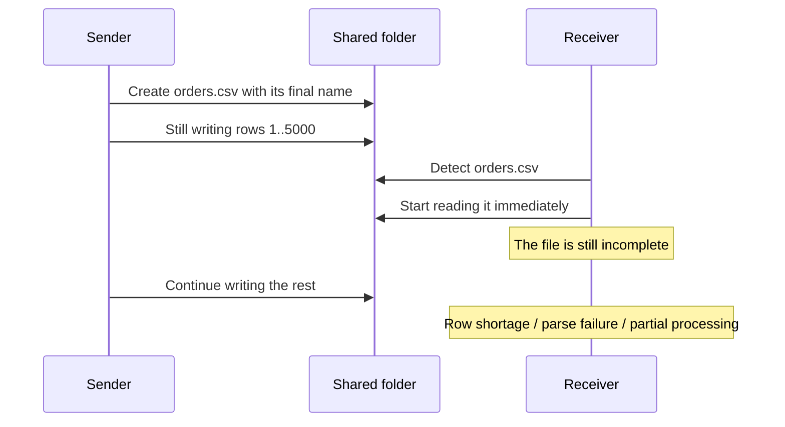
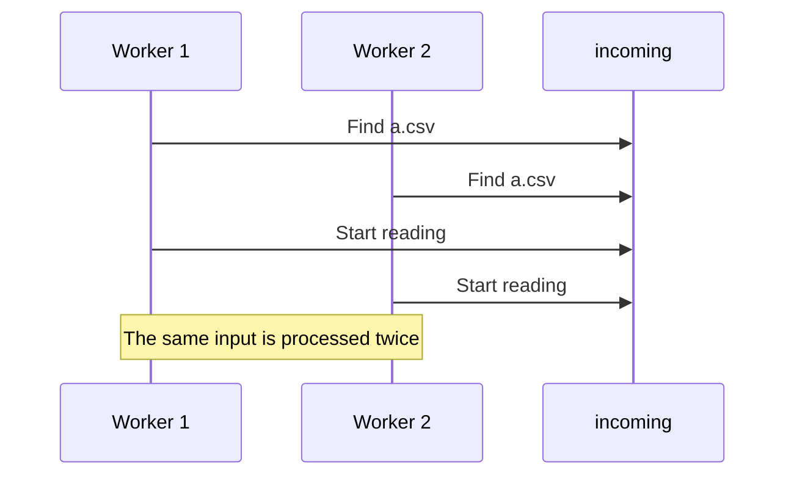
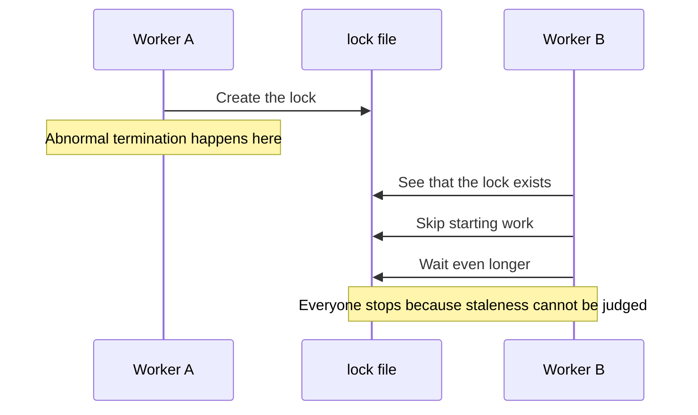
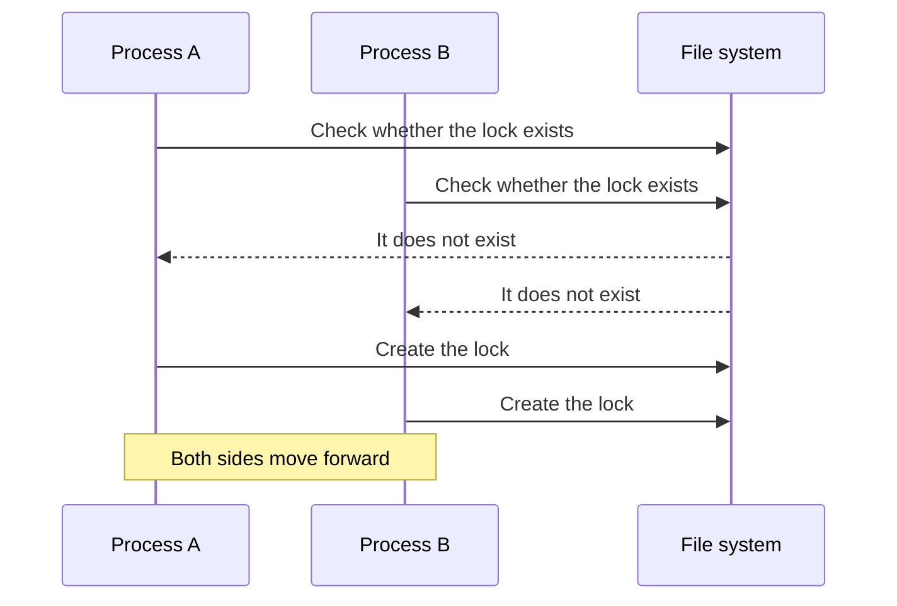
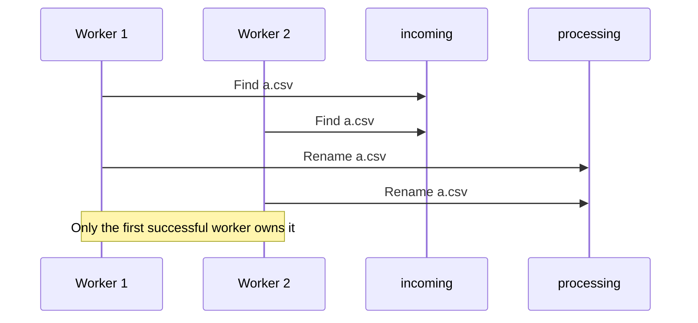
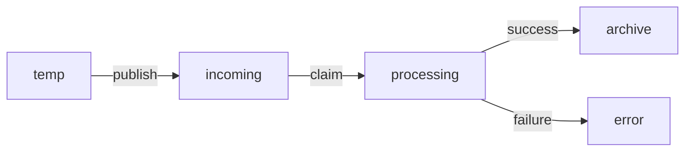
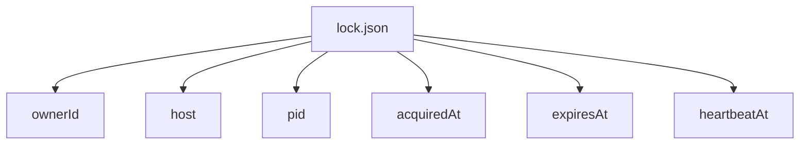
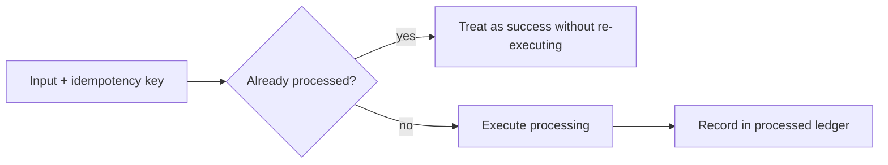

# Safe File Integration Locking - Best Practices for File Locks, Atomic Claims, and Idempotent Processing

Concurrency control becomes a real problem almost immediately in shared-folder workflows, overnight batch jobs, and multi-process file integration.
The usual questions are whether a file lock alone is enough, how to stop multiple workers from picking the same file, and how to avoid reading a file that is still being written.

This article organizes file-integration concurrency control around file locks, atomic claims, `temp -> rename`, and idempotency.

## Contents

1. [Short version](#1-short-version)
2. [Conflict patterns that happen in file integration](#2-conflict-patterns-that-happen-in-file-integration)
   * 2.1. [Reading a file that is still being written](#21-reading-a-file-that-is-still-being-written)
   * 2.2. [Two workers pick the same file at the same time](#22-two-workers-pick-the-same-file-at-the-same-time)
   * 2.3. [Everyone stops because of a stale lock](#23-everyone-stops-because-of-a-stale-lock)
3. [Anti-patterns](#3-anti-patterns)
   * 3.1. [Two-step `Exists -> Create` checking](#31-two-step-exists---create-checking)
   * 3.2. [Writing directly to the final filename](#32-writing-directly-to-the-final-filename)
   * 3.3. [Treating "the file size stopped changing" as completion](#33-treating-the-file-size-stopped-changing-as-completion)
   * 3.4. [Letting everyone update a shared file](#34-letting-everyone-update-a-shared-file)
   * 3.5. [Thinking a lock API is universal](#35-thinking-a-lock-api-is-universal)
4. [Best practices](#4-best-practices)
   * 4.1. [Publish with `temp -> close -> rename / replace`](#41-publish-with-temp---close---rename--replace)
   * 4.2. [Use `done` / manifest files to declare completeness](#42-use-done--manifest-files-to-declare-completeness)
   * 4.3. [Let the receiver take the claim atomically](#43-let-the-receiver-take-the-claim-atomically)
   * 4.4. [If you rely on lock files, make them lease-based](#44-if-you-rely-on-lock-files-make-them-lease-based)
   * 4.5. [Assume idempotency](#45-assume-idempotency)
5. [Pseudocode excerpts](#5-pseudocode-excerpts)
6. [Rough rule-of-thumb guide](#6-rough-rule-of-thumb-guide)
7. [Summary](#7-summary)
8. [References](#8-references)

* * *

File integration is a domain where the code itself is often less fragile than **the handover agreement**.
Things pass unit tests but occasionally fail only in production shared folders or overnight batch runs.
That is very normal.

In many cases, the real problem is not the file I/O API itself but the fact that these three things are vague:

* when the file is safe to read
* who owns the right to process it
* how recovery works when something fails

So this article treats file-integration concurrency control not as "just locking," but as a handover protocol.

## 1. Short version

* The most important rule is to make sure that **when the final filename becomes visible, the file is already safe to read**
* Express states such as *being written*, *published*, *processing*, and *processed* through names or directories
* If multiple workers exist, take an **atomic claim** before processing
* Use lock files and OS locks as helpers, but treat **idempotency** as the final safety net

In other words, the heart of file integration is not just "locking."  
It is really **the handover protocol**.

## 2. Conflict patterns that happen in file integration

### 2.1. Reading a file that is still being written

If the sender writes directly to the final filename, this failure appears immediately.
With JSON, the closing brace may still be missing. With CSV, the row count may be incomplete. With ZIP, the file may simply be broken.



### 2.2. Two workers pick the same file at the same time

If the flow is "list files, check whether one is unprocessed, then open it," two workers can easily grab the same input.
That is how double counting and duplicate sending begin.



### 2.3. Everyone stops because of a stale lock

A design that only "drops a lock file" gets stuck very easily after abnormal termination.
If you cannot tell who owns the lock, whether it is still alive, or how long it remains valid, the next worker may wait forever.



## 3. Anti-patterns

### 3.1. Two-step `Exists -> Create` checking

The problem here is that **checking** and **claiming** are two different operations.
Another process can slip in between them, so this is not real exclusion.



```csharp
if (!File.Exists(lockPath))
{
    File.WriteAllText(lockPath, Environment.ProcessId.ToString());
    ProcessFile();
}
```

What you really need is a single atomic operation for "create only if absent."
In .NET, that usually means a `FileMode.CreateNew`-style approach. On POSIX, `O_CREAT | O_EXCL` is the same idea.

### 3.2. Writing directly to the final filename

If the receiver interprets "this filename is visible" as "this file is ready to read," then writing directly to the final name is already a mistake.
Do not make **visible** and **safe to read** mean the same thing.


### 3.3. Treating "the file size stopped changing" as completion

This looks convenient, but it is fragile.
Network copies, sender pauses, buffering, and retries all make it unreliable.

```csharp
if (currentLength == lastLength && stableSeconds >= 10)
{
    return Ready;
}
```

Completion decided by **guessing** will hurt you on shared folders and large files.
It is much more stable to declare completion explicitly through a manifest or done file.

### 3.4. Letting everyone update a shared file

A shared `status.csv` or `counter.json` that everybody reads and writes usually ends in "last writer wins."
Once file integration starts acting like a mini-database, this becomes painful quickly.

### 3.5. Thinking a lock API is universal

Lock APIs matter, but they only work well when **all participants play by the same agreement**.
In heterogeneous system integration, it is safer not to overestimate them.

Examples:

* Linux `flock` is advisory, so software that ignores the rule can still write
* Windows byte-range locks are ignored by memory-mapped file access
* In other words, do not ask OS locks alone to carry completion signaling and ownership design

## 4. Best practices

### 4.1. Publish with `temp -> close -> rename / replace`

This is the standard path.
Keep the file hidden under a temporary name while it is being built, close it, and only then switch it to the final name.
The receiver watches only the final name.


Important points:

* temp and final should be in the **same directory**, or at least on the same volume / file system
* on Windows / .NET, `File.Replace` is often worth considering
* make "final filename is visible" mean "the contents are already complete"

### 4.2. Use `done` / manifest files to declare completeness

It is often much more stable to declare not only the payload itself, but also **what exactly is complete** in a separate file.
This is especially useful in heterogeneous system integration.

Useful manifest fields often include:

* target filename
* size
* hash
* record count
* integration ID / idempotency key
* creation timestamp

The order matters too.
If you publish the `done` file before the payload is actually complete, that is not a completion signal. It is an accident announcement.

### 4.3. Let the receiver take the claim atomically

If multiple workers watch the same `incoming` directory, a simple pattern is: **rename it into your own processing area before reading**.
Only the worker whose rename succeeds owns the right to process the file.



It also helps operationally to split directories clearly:



### 4.4. If you rely on lock files, make them lease-based

If you use lock files, do not make them empty markers.
Make them contain ownership and expiry information.



Important points:

* create them atomically
* use missing heartbeat updates as one staleness signal
* in principle, only the creator should remove the lock
* assume lock leakage can happen and define the recovery path up front

### 4.5. Assume idempotency

Exclusion matters, but in real operation you rarely eliminate double delivery or retries completely.
In the end, it helps a lot if the system is designed so that **processing the same input again does not break anything**.



## 5. Pseudocode excerpts

### 5.1. A typical broken pattern

```csharp
var lockPath = finalPath + ".lock";

if (!File.Exists(lockPath))
{
    File.WriteAllText(lockPath, "");
    using var writer = OpenForWrite(finalPath); // writes directly to final name
    WritePayload(writer);

    File.Delete(lockPath);
}
```

Problems:

* `Exists` and `WriteAllText` are separate operations
* `finalPath` becomes visible while writing is still in progress
* the lock remains behind after abnormal termination

### 5.2. A healthier direction

```csharp
var tempPath = MakeTempPathSameDirectory(finalPath);
WritePayload(tempPath);
FlushAndClose(tempPath);

PublishByRenameOrReplace(tempPath, finalPath); // same FS / same volume
PublishDoneFile(finalPath + ".done", new
{
    FileName = Path.GetFileName(finalPath),
    Size = GetFileSize(finalPath),
    Hash = ComputeHash(finalPath),
    IdempotencyKey = integrationId
});
```

```csharp
if (!TryClaimBundleByRename(baseName, incomingDir, processingDir))
{
    return; // another worker already took it
}

var manifest = ReadDoneFile(Path.Combine(processingDir, baseName + ".done"));
VerifyPayload(Path.Combine(processingDir, baseName), manifest);

if (AlreadyProcessed(manifest.IdempotencyKey))
{
    MoveBundle(processingDir, archiveDir, baseName);
    return;
}

Process(Path.Combine(processingDir, baseName));
RecordProcessed(manifest.IdempotencyKey);
MoveBundle(processingDir, archiveDir, baseName);
```

The implementation details matter, but **the order matters more**.
Do not mix "write," "publish," "take ownership," and "record completion."

## 6. Rough rule-of-thumb guide

* single writer / single reader / same host -> `temp -> rename` alone already gets you far
* multiple consumers -> add a claim rename from `incoming` to `processing`
* heterogeneous systems, NAS, shared folders -> add manifest / done and idempotency as well
* multiple writers updating the same logical state -> do not force the problem into files; consider a database or queue
* OS locks are useful inside one controlled application family, but they do not replace the handover protocol itself

That last point is also a retreat criterion.
Some problems are simply unpleasant when forced into file-based integration.

## 7. Summary

The real heart of exclusion here is:

* file-integration concurrency control is not mainly about calling a lock function; it is about defining state transitions
* representing *being written*, *published*, *processing*, and *processed* through names and directories reduces accidents a lot

Designs to avoid:

* `Exists -> Create`
* writing directly to the final filename
* guessing completion from stable file size
* everybody updating the same shared file
* asking lock APIs alone to carry the whole protocol

Practical countermeasures that work well:

* `temp -> close -> rename / replace`
* explicit completeness through `done` / manifest files
* ownership through claim rename
* lease rules and idempotency for recovery

The core trick is not to make **"readable"** and **"safe to read"** mean the same thing.
That single separation eliminates a surprising number of problems that otherwise show up only in the middle of the night.

## 8. References

* [LockFileEx function (Win32)](https://learn.microsoft.com/en-us/windows/win32/api/fileapi/nf-fileapi-lockfileex)
* [Locking and Unlocking Byte Ranges in Files (Win32)](https://learn.microsoft.com/en-us/windows/win32/fileio/locking-and-unlocking-byte-ranges-in-files)
* [Moving and Replacing Files (Win32)](https://learn.microsoft.com/en-us/windows/win32/fileio/moving-and-replacing-files)
* [File.Replace Method (.NET)](https://learn.microsoft.com/en-us/dotnet/api/system.io.file.replace)
* [rename - POSIX](https://pubs.opengroup.org/onlinepubs/9799919799/functions/rename.html)
* [open - POSIX (`O_CREAT | O_EXCL`)](https://pubs.opengroup.org/onlinepubs/9799919799/functions/open.html)
* [flock(2) - Linux manual page](https://man7.org/linux/man-pages/man2/flock.2.html)
* [open(2) - Linux manual page](https://man7.org/linux/man-pages/man2/open.2.html)
