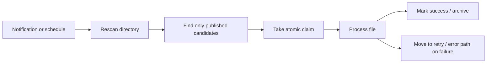

# Safe File Integration Locking - Best Practices for File Locks, Atomic Claims, and Idempotent Processing

Concurrency control becomes a real problem almost immediately in shared-folder workflows, overnight batch jobs, and multi-process file integration.
The usual questions are whether a file lock alone is enough, how to stop multiple workers from picking the same file, and how to avoid reading a file that is still being written.

The key point is that this is really a **handover protocol design problem**, not just a matter of calling a lock API.

## Contents

1. [Short version](#1-short-version)
2. [Typical conflict patterns](#2-typical-conflict-patterns)
3. [Anti-patterns](#3-anti-patterns)
4. [Best practices](#4-best-practices)
5. [A practical shape for the receiver](#5-a-practical-shape-for-the-receiver)
6. [Summary](#6-summary)

---

## 1. Short version

- The most important rule is to make sure that **when the final filename becomes visible, the file is already safe to read**
- Express states such as *being written*, *published*, *claimed*, and *processed* clearly through names or directories
- If multiple workers exist, take an **atomic claim** before processing
- Use lock files and OS locks as helpers, but treat **idempotency** as the final safety net

In file integration, locking is only part of the story.  
The real design work is defining when ownership moves from the sender to the receiver.

## 2. Typical conflict patterns

### Reading a file that is still being written

This happens when the sender writes directly to the final filename.

### Two workers claim the same file

If both workers first check and then open, they can race and process the same input twice.

### Stale lock files stop everyone

If the design only says "create a lock file," a crash can leave the system in a state where no one knows whether the lock is still valid.

## 3. Anti-patterns

- `Exists -> Create`
- writing directly to the final filename
- treating "the size stopped changing" as completion
- updating one shared state file from multiple processes
- assuming OS locks solve the whole problem

None of these are stable substitutes for an explicit handover protocol.

## 4. Best practices

### Publish through `temp -> close -> rename / replace`

This is the standard pattern.

1. Write to a unique temporary name
2. Flush and close it
3. Rename or replace it into the final name on the same volume

That lets the receiver interpret the final name as "safe to read."

### Use a `done` marker or manifest when completeness matters

Instead of guessing whether a multi-file transfer is complete, make completion explicit.

### Take atomic claims on the receiver side

The receiver should not only *see* a candidate file. It should *reserve* it before processing.

### If you use lock files, make them lease-based

A lock file without owner identity or expiration is a dead end.

### Assume idempotency

Even well-designed file integration still sees retries, replays, and ambiguous recovery cases.

## 5. A practical shape for the receiver

This structure works well because it does not treat visibility, ownership, and successful processing as the same event.

## 6. Summary

Safe file integration is less about "who locked what" and more about **how ownership is published, claimed, and retried**.

If you design that protocol explicitly, shared-folder integration becomes far less mysterious.  
If you skip that design and rely on ad-hoc locks, the system usually looks fine only until the first real operational incident.
