ファイル連携の排他制御は、共有フォルダや夜間バッチ、別プロセス連携でほぼ必ず問題になります。
特に検索で多いのは、ファイルロックだけで十分なのか、複数ワーカーが同じファイルを拾わない方法は何か、途中書き込みのファイルをどう避けるか、といった悩みです。

この記事では、ファイル連携の排他制御を、ファイルロック、原子的 claim、`temp -> rename`、idempotency を軸に整理します。

## 目次

1. まず結論（ひとことで）
2. ファイル連携で起きる競合パターン（図）
   * 2.1. 書き込み途中のファイルを読んでしまう
   * 2.2. 複数ワーカーが同じファイルを同時に拾う
   * 2.3. stale lock で全員が止まる
3. アンチパターン
   * 3.1. `Exists -> Create` の二段階チェック
   * 3.2. 最終ファイル名へ直接書く
   * 3.3. ファイルサイズが止まったら完了扱い
   * 3.4. 共有ファイルをみんなで更新する
   * 3.5. ロックAPIを万能と思う
4. ベストプラクティス
   * 4.1. `temp -> close -> rename / replace` で公開する
   * 4.2. `done` / manifest で完全性を明示する
   * 4.3. 受信側は claim を原子的に取る
   * 4.4. lock file に頼るなら lease にする
   * 4.5. idempotency を前提にする
5. 擬似コード（抜粋）
6. ざっくり使い分け
7. まとめ
8. 参考資料

* * *

ファイル連携は、コードそのものより「受け渡しの約束」のほうが壊れやすい分野です。
単体試験では通るのに、本番の共有フォルダや夜間バッチでだけたまに壊れる。しかも再現しづらい。わりと普通にあります。

原因の多くは、ファイルI/OのAPIそのものより、次の3つが曖昧なことです。

* いつ読んでよいのか
* 誰が処理権を持つのか
* 失敗したときにどう回復するのか

この記事では、ファイル連携の排他制御を OS ロックの話だけで終わらせず、受け渡しプロトコルとして整理します。

## 1. まず結論（ひとことで）

* ファイル連携で一番大事なのは、最終ファイル名が見えた時点で「もう読んでよい」状態を作ること
* 生成中 / 公開済み / 処理中 / 処理済み を、ファイル名やディレクトリで分けて表現すること
* 複数ワーカーがいるなら、読む前に claim を原子的に取ること
* lock file や OS ロックは補助として使い、最後は idempotency で受け止めること

要するに、ファイル連携では 排他制御 というより 受け渡しプロトコル の設計が本体です。
ロック関数を1つ呼べば終わり、とはなりません。

## 2. ファイル連携で起きる競合パターン（図）

### 2.1. 書き込み途中のファイルを読んでしまう

最終ファイル名に直接書き始めると、この事故が起きます。
JSON なら閉じ括弧がなく、CSV なら行数が足りず、ZIP なら普通に壊れます。

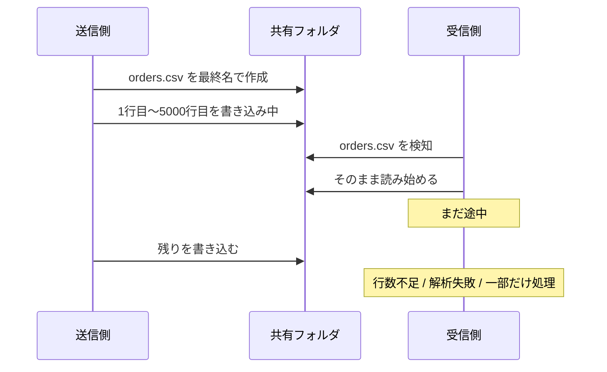

### 2.2. 複数ワーカーが同じファイルを同時に拾う

「一覧を見て、未処理なら開く」という流れだと、同じファイルを2つのワーカーが掴めます。
二重計上や二重送信の始まりです。

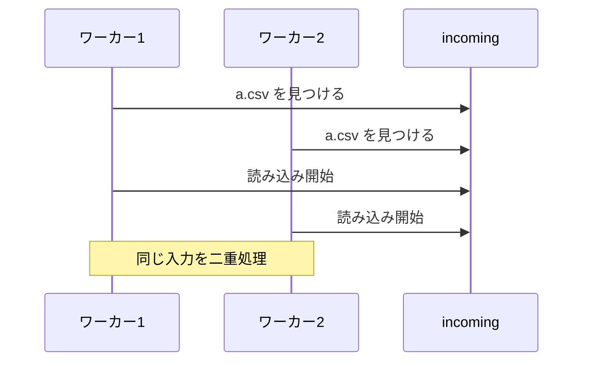

### 2.3. stale lock で全員が止まる

lock file を置くだけの設計は、異常終了時に詰まりやすいです。
誰の lock か、まだ生きているのか、いつまで有効かが分からないと、後続が永遠に待つことになります。

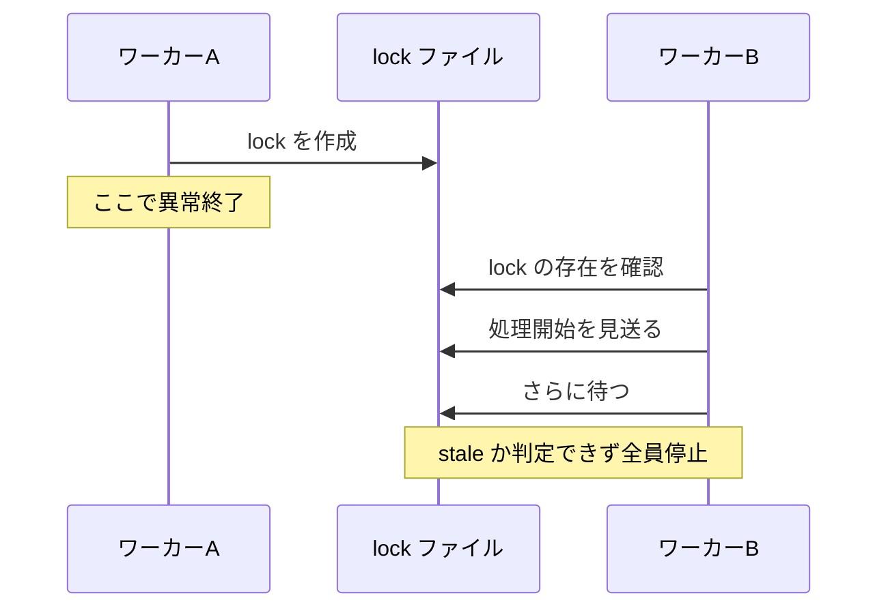

## 3. アンチパターン

### 3.1. `Exists -> Create` の二段階チェック

これは、「確認」と「確保」が別操作 になっているのが問題です。
間に他プロセスが割り込めるので、排他になりません。

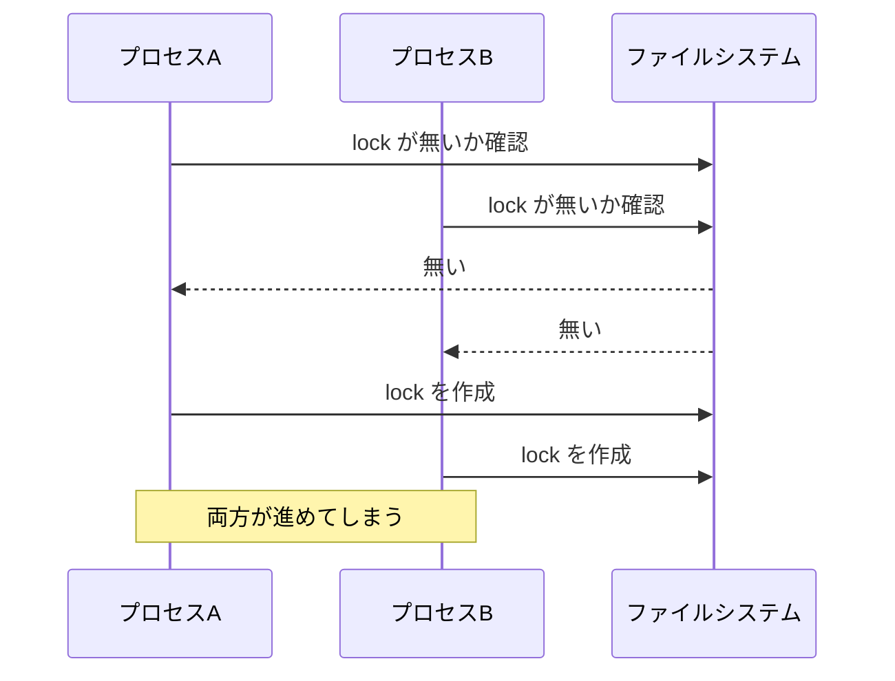

典型的な悪い例は、こういう形です。

```csharp
if (!File.Exists(lockPath))
{
    File.WriteAllText(lockPath, Environment.ProcessId.ToString());
    ProcessFile();
}
```

必要なのは、「無ければ作る」を 1操作にすること です。
`.NET` なら `FileMode.CreateNew` 系、POSIX 系なら `O_CREAT | O_EXCL` のような原子的作成を使います。

### 3.2. 最終ファイル名へ直接書く

受信側が「その名前が見えたら読んでよい」と解釈しているなら、最終ファイル名に直接書き始めた時点で負けです。
見えること と 読んでよいこと を同じにしないのが基本です。


```csharp
using var writer = OpenForWrite(finalPath); // ここで finalPath が見えてしまう
foreach (var row in rows)
{
    writer.WriteLine(row);
}
```

このやり方は、2.1 の事故を自分から呼び込みます。

### 3.3. ファイルサイズが止まったら完了扱い

これは便利そうに見えますが、かなり危ういです。
ネットワーク越しのコピー、送信側の一時停止、バッファリング、リトライで普通に揺れます。

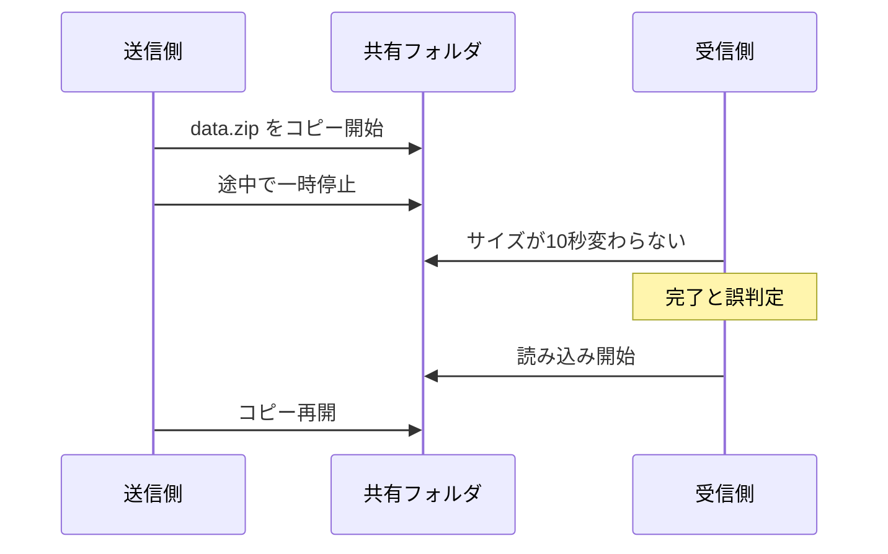

```csharp
if (currentLength == lastLength && stableSeconds >= 10)
{
    return Ready;
}
```

完了を 推測 で決めると、共有フォルダや大きなファイルで足をすくわれます。
完了は manifest や done file で 明示 した方が安定します。

### 3.4. 共有ファイルをみんなで更新する

1つの `status.csv` や `counter.json` をみんなで読んで更新する設計は、だいたい最後に書いた人が勝ちます。
ファイル連携を簡易DBとして使い始めると、ここで苦しくなります。

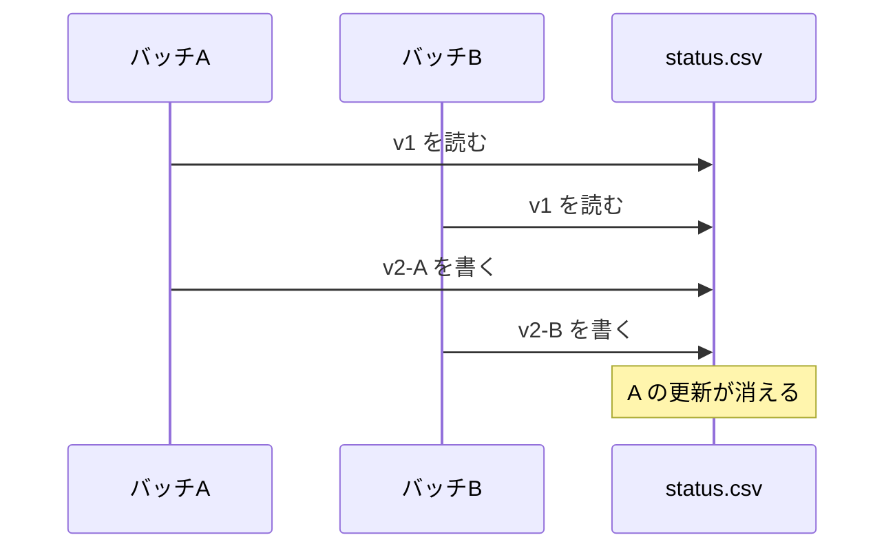

append-only に逃げる案もありますが、ファイルシステムや配置形態で意味が揺れます。
共有更新が必要なら、ここはファイル連携で無理をしない方がよいです。

### 3.5. ロックAPIを万能と思う

ロックAPIは重要ですが、全参加者が同じ約束で動く ときだけ効きます。
異種システム連携では、ここを過信しない方が安全です。

補足:

* Linux の `flock` は advisory lock なので、約束を無視する相手は普通に書けます
* Windows の byte-range lock は、メモリマップファイルでは無視されます
* つまり、OS ロック 単体で完了通知や所有権の設計まで背負わせない方がよいです

## 4. ベストプラクティス

### 4.1. `temp -> close -> rename / replace` で公開する

王道です。
生成中のファイルは temp 名に閉じ込め、close したあとで final 名に切り替えます。
受信側は final 名だけを見るようにします。


ポイント:

* temp と final は 同じディレクトリ、少なくとも同じボリューム / ファイルシステム に置く
* Windows / .NET なら `File.Replace` 系を検討できる
* final 名が見えた時点で、内容は完成済み という約束にする

`temp` を別ドライブに置くと、rename が単なるコピー相当になったり、`Replace` が失敗したりします。
この前提は地味ですが、とても大事です。

### 4.2. `done` / manifest で完全性を明示する

データ本体だけでなく、「何が完成したか」を別ファイルで明示すると、受信側が安定します。
特に異種システム連携では有効です。

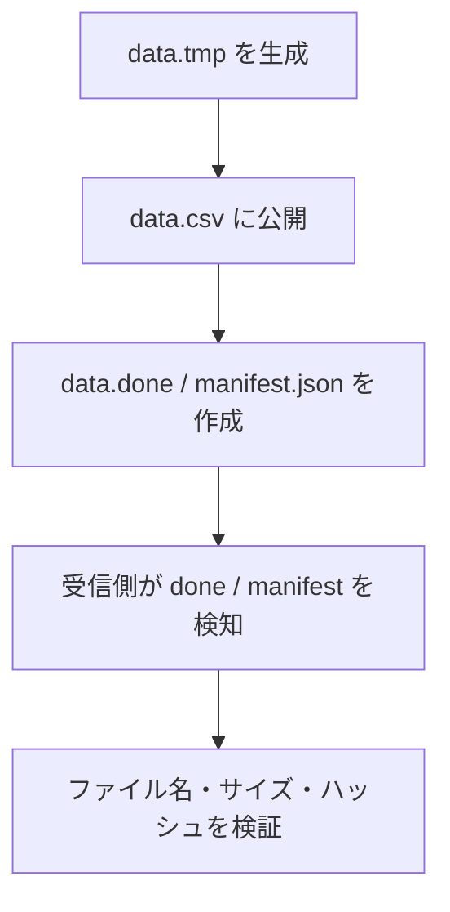

manifest に入れておくとよい項目は、たとえば次のようなものです。

* 対象ファイル名
* サイズ
* ハッシュ
* レコード数
* 連携ID / idempotency key
* 生成時刻

順序も大事です。
本体の公開より先に `done` を置くと、それは完了通知ではなく 事故予告 になります。

### 4.3. 受信側は claim を原子的に取る

複数ワーカーが同じ `incoming` を見るなら、「読む前に自分のものへ移す」のが分かりやすいです。
`incoming` から `processing/<worker>/` への rename が成功したワーカーだけが処理します。

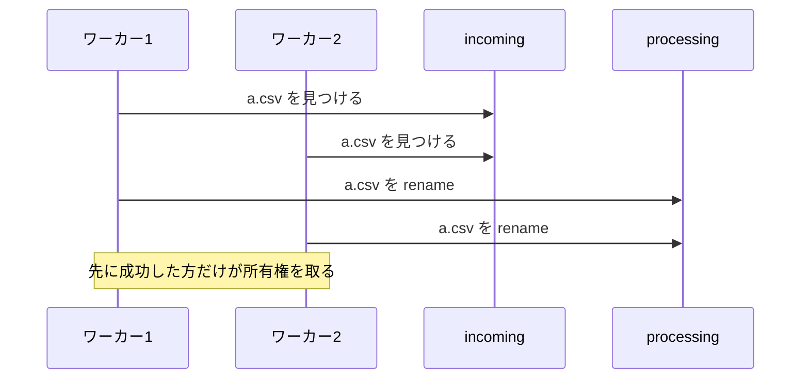

運用上は、ディレクトリも分けておくと追跡しやすいです。

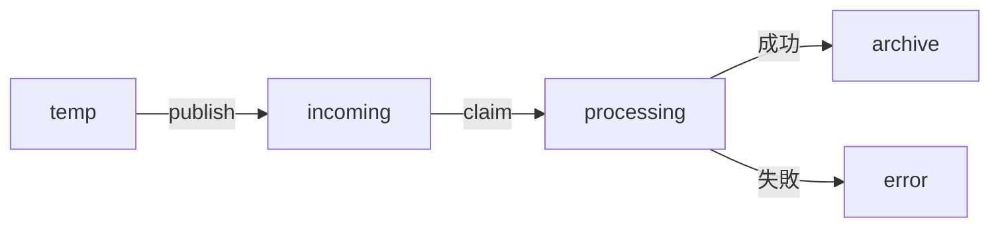

claim 用の rename も、同じファイルシステム上で行うのが前提です。

### 4.4. lock file に頼るなら lease にする

lock file を使うなら、単なる空ファイルではなく 有効期限付きの所有情報 にします。
誰が取ったのか分からない lock は、後で必ず揉めます。

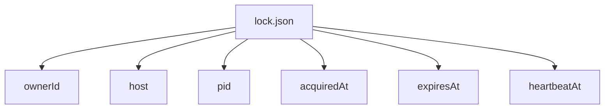

ポイント:

* 作成は原子的に行う
* 更新停止を stale 判定の材料にする
* 削除は 原則として作成者だけ が行う
* 解除漏れを前提に、回復手順を決めておく

lock file はあくまで 協調のための札 です。
これ1枚で完全な整合性まで保証しようとすると、だいたい厳しくなります。

### 4.5. idempotency を前提にする

排他制御は大事ですが、実運用では「たまに二重で来る」「途中で再実行する」をゼロにはできません。
最後は、同じ入力をもう一度食べても壊れない 設計が効きます。

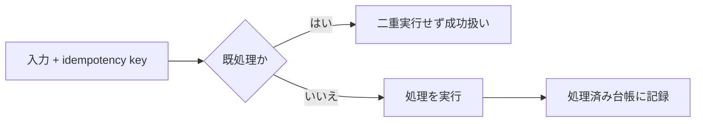

たとえば、受信ファイルごとに連携IDを持たせ、処理済み台帳に記録します。
排他が一度破れても、結果が二重計上されない形にしておくと運用がかなり楽です。

## 5. 擬似コード（抜粋）

### 5.1. 典型的な失敗パターン

```csharp
var lockPath = finalPath + ".lock";

if (!File.Exists(lockPath))
{
    File.WriteAllText(lockPath, "");
    using var writer = OpenForWrite(finalPath); // 最終名に直接書く
    WritePayload(writer);

    File.Delete(lockPath);
}
```

問題点は3つあります。

* `Exists` と `WriteAllText` が別操作
* `finalPath` が書き込み途中から見えてしまう
* 異常終了時に `lock` が残る

### 5.2. 正しい方向の例（雑に書くとこう）

```csharp
var tempPath = MakeTempPathSameDirectory(finalPath);
WritePayload(tempPath);
FlushAndClose(tempPath);

PublishByRenameOrReplace(tempPath, finalPath); // 同一FS / 同一volume 前提
PublishDoneFile(finalPath + ".done", new
{
    FileName = Path.GetFileName(finalPath),
    Size = GetFileSize(finalPath),
    Hash = ComputeHash(finalPath),
    IdempotencyKey = integrationId
});
```

```csharp
if (!TryClaimBundleByRename(baseName, incomingDir, processingDir))
{
    return; // 他ワーカーが先に取得
}

var manifest = ReadDoneFile(Path.Combine(processingDir, baseName + ".done"));
VerifyPayload(Path.Combine(processingDir, baseName), manifest);

if (AlreadyProcessed(manifest.IdempotencyKey))
{
    MoveBundle(processingDir, archiveDir, baseName);
    return;
}

Process(Path.Combine(processingDir, baseName));
RecordProcessed(manifest.IdempotencyKey);
MoveBundle(processingDir, archiveDir, baseName);
```

このあたりは 実装の細部より順序 が大事です。
「書く」「公開する」「所有権を取る」「処理済みを記録する」を混ぜない方が壊れにくくなります。

## 6. ざっくり使い分け

* 単一 writer / 単一 reader / 同一ホストなら、まずは `temp -> rename` だけでもかなり安定する
* 複数 consumer がいるなら、`incoming -> processing` の claim rename を入れる
* 異種システム連携、NAS、共有フォルダなら、manifest / done と idempotency まで入れた方が安全
* 複数 writer が同じ論理状態を更新したいなら、ファイル連携で頑張りすぎず DB やキューも検討する
* OS ロックは、同一アプリ群・同一前提の中では有効だが、受け渡しプロトコルの代わりにはならない

最後の1項目は撤退判断でもあります。
ファイルでやるとつらい問題は、本当にあります。

## 7. まとめ

排他制御の本体:

* ファイル連携の排他制御は、ロック関数を呼ぶこと ではなく、状態遷移を決めること
* 生成中 / 公開済み / 処理中 / 処理済み を名前やディレクトリで表現すると事故が減る

避けたい設計:

* `Exists -> Create`
* 最終ファイル名への直接書き込み
* サイズ安定待ち
* 共有ファイルをみんなで更新
* ロックAPIだけに全部を背負わせること

実務で効く対策:

* `temp -> close -> rename / replace`
* `done` / manifest で完全性を明示
* claim rename で所有権を取る
* lease と idempotency で失敗に備える

つまり、ファイル連携では「読めること」と「読んでよいこと」を同じにしないのがコツです。
ここを分けるだけで、夜中にだけ出るタイプの事故がかなり減ります。

## 8. 参考資料

* [LockFileEx function (Win32)](https://learn.microsoft.com/en-us/windows/win32/api/fileapi/nf-fileapi-lockfileex)
* [Locking and Unlocking Byte Ranges in Files (Win32)](https://learn.microsoft.com/ja-jp/windows/win32/fileio/locking-and-unlocking-byte-ranges-in-files)
* [Moving and Replacing Files (Win32)](https://learn.microsoft.com/en-us/windows/win32/fileio/moving-and-replacing-files)
* [File.Replace Method (.NET)](https://learn.microsoft.com/en-us/dotnet/api/system.io.file.replace)
* [rename — POSIX](https://pubs.opengroup.org/onlinepubs/9799919799/functions/rename.html)
* [open — POSIX (`O_CREAT | O_EXCL`)](https://pubs.opengroup.org/onlinepubs/9799919799/functions/open.html)
* [flock(2) — Linux manual page](https://man7.org/linux/man-pages/man2/flock.2.html)
* [open(2) — Linux manual page](https://man7.org/linux/man-pages/man2/open.2.html)
