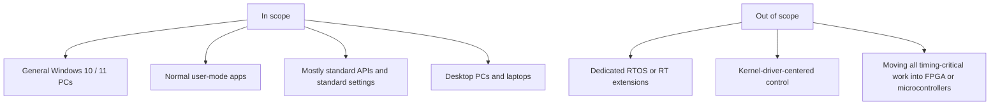
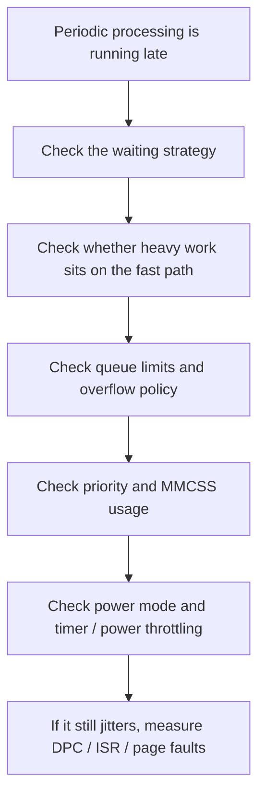
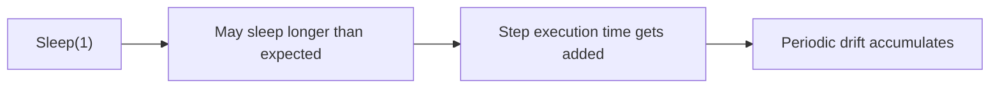
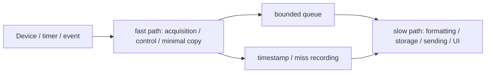
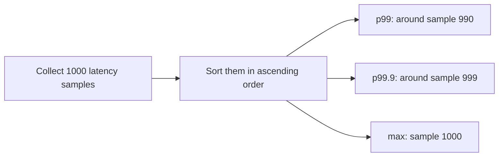

# A Practical Guide to Soft Real-Time on Windows - A Checklist for Reducing Latency

This article is about **ordinary Windows 10 / 11**, not a special real-time extension.
The target is the usual **user-mode application** running on a desktop PC or laptop.

The goal here is not hard real-time guarantees.
Even on ordinary Windows, if you align design, waiting strategy, priority, power settings, and measurement, you can get to a **very practical soft real-time** level.

Rather than listing every possible item, this article is organized so that you can quickly see **what to review first**.
If you start with the checklist in section 4, the main review points become clear quite quickly.

## Contents

1. [Short version](#1-short-version)
2. [What "ordinary Windows" means in this article](#2-what-ordinary-windows-means-in-this-article)
   - [2.1. What is in scope](#21-what-is-in-scope)
   - [2.2. What is out of scope](#22-what-is-out-of-scope)
3. [What soft real-time means on Windows](#3-what-soft-real-time-means-on-windows)
   - [3.1. What we are trying to achieve](#31-what-we-are-trying-to-achieve)
   - [3.2. Terms used in this article](#32-terms-used-in-this-article)
   - [3.3. Where things start getting difficult](#33-where-things-start-getting-difficult)
4. [The first checklist to review](#4-the-first-checklist-to-review)
   - [4.1. Overall picture](#41-overall-picture)
   - [4.2. Do not let periodic loops depend on `Sleep`](#42-do-not-let-periodic-loops-depend-on-sleep)
   - [4.3. Split fast path and slow path](#43-split-fast-path-and-slow-path)
   - [4.4. Make queues bounded and decide what happens on overflow](#44-make-queues-bounded-and-decide-what-happens-on-overflow)
   - [4.5. Do not put heavy work on the fast path](#45-do-not-put-heavy-work-on-the-fast-path)
   - [4.6. Raise priority only for the threads that need it](#46-raise-priority-only-for-the-threads-that-need-it)
   - [4.7. Look at timers, CPU placement, and power settings together](#47-look-at-timers-cpu-placement-and-power-settings-together)
   - [4.8. Make lateness visible](#48-make-lateness-visible)
5. [Checklist for power and OS settings](#5-checklist-for-power-and-os-settings)
6. [Measurement and evaluation](#6-measurement-and-evaluation)
   - [6.1. What to record](#61-what-to-record)
   - [6.2. What p99 / p99.9 / max mean](#62-what-p99--p999--max-mean)
   - [6.3. What tools to use](#63-what-tools-to-use)
   - [6.4. Test conditions](#64-test-conditions)
7. [Rough rule-of-thumb guide](#7-rough-rule-of-thumb-guide)
8. [Summary](#8-summary)
9. [References](#9-references)

* * *

## 1. Short version

- **On ordinary Windows, the goal is not hard real-time guarantees, but smaller latency and jitter and fewer missed deadlines**
- The first thing to review is not the exact priority number but **what you put inside the periodic thread**
- Split work that must pass every cycle into a **fast path**, and move storage, communication, and UI work into a **slow path**
- On the fast path, avoid `Sleep`-driven waiting, blocking I/O, per-iteration allocation, and unbounded queues
- For continuous audio or video streams, **MMCSS** is often the first thing to consider
- In real operation, **AC power, power mode, timer resolution, power throttling, and background load** all matter
- Evaluation should look not only at averages but also at **p99 / p99.9 / max / missed deadlines / queue depth / DPC / ISR / page faults**

In practice, the usual review order is:

1. stop depending on `Sleep` for the periodic loop
2. split fast path and slow path
3. make queues bounded and define the overflow policy
4. remove I/O, allocation, and heavy locks from the fast path
5. use priority changes or MMCSS only where truly needed
6. align ordinary Windows power settings and measurement

## 2. What "ordinary Windows" means in this article

Here, "ordinary Windows" means **general Windows 10 / 11 PCs**.
The focus is on how far you can stabilize things using standard Windows APIs and settings, without special RT extensions or a dedicated RTOS.



### 2.1. What is in scope

Examples include:

- user-mode C++ / C# apps on Windows 10 / 11
- software that needs to be "hard to delay," such as audio, video, measurement, device control, or periodic processing
- general desktop PCs, workstations, and laptops

### 2.2. What is out of scope

This article does not center on:

- hard real-time guarantees
- dedicated RTOS or commercial real-time extensions
- designs where kernel drivers are the main actor
- architectures that move all timing-critical parts into firmware, FPGA, or separate controllers

Those options do become necessary for stricter requirements.
But before going there, it is still valuable to stack up **reproducible improvements on ordinary Windows**.

## 3. What soft real-time means on Windows

### 3.1. What we are trying to achieve

On ordinary Windows, the target state is something like this:

- low latency in normal operation
- small jitter
- resilience even when occasional latency spikes happen
- visible observation of how often deadlines are missed

Soft real-time here does not mean "never late."  
It means **hard to delay, observable when delayed, and robust even when delayed**.

### 3.2. Terms used in this article

| Term | Meaning |
| --- | --- |
| latency | processing starts or finishes later than intended |
| jitter | variation in interval or execution time; not running at the same timing every cycle |
| deadline miss | processing fails to complete by the required deadline |

### 3.3. Where things start getting difficult

Ordinary Windows user-mode apps become much harder when you want things like:

- zero deadline misses guaranteed
- sub-millisecond stability for long periods
- heavy GUI, networking, storage, and high-frequency periodic work all living together
- strict timing while still prioritizing battery life and power saving
- no tolerance for spikes caused by drivers or devices

At that point, ordinary Windows alone starts getting stretched.
Then it may be time to move only the truly timing-critical parts into firmware, a dedicated controller, FPGA, or another RT environment.

## 4. The first checklist to review

This section is here so you can quickly see **what to watch first**.

### 4.1. Overall picture

| Review item | First action | Typical bad pattern |
| --- | --- | --- |
| waiting strategy | run against absolute deadlines; prefer event-driven waiting or high-resolution waitable timers | periodic loops built on `Sleep(1)` |
| work separation | split fast path and slow path | putting storage, sending, or UI into the fast path |
| queue design | make queues bounded and define the overflow policy | hiding delay behind an unbounded queue |
| fast-path contents | remove allocation, heavy logging, blocking I/O, and heavy locks | `new` / `malloc` / sync I/O / per-cycle string building |
| priority | raise only the threads that need it; consider MMCSS for audio / video | jumping straight to `REALTIME_PRIORITY_CLASS` |
| OS / power | check AC power, power mode, timer resolution, and power throttling | measuring under battery / power-saving mode |
| measurement | record lateness, execution time, miss count, and queue depth | looking only at averages |



### 4.2. Do not let periodic loops depend on `Sleep`

This is usually the first place to inspect.
`Sleep(1)` does not mean "wait exactly 1 ms." It means **wait at least 1 ms**.
Once you add the execution time of the step itself, drift accumulates naturally.



Periodic work is usually more stable when driven by **absolute deadlines instead of relative waiting**.

```cpp
int64_t next = QpcNow() + periodTicks;

while (running)
{
    WaitUntil(next - wakeMarginTicks);   // event / waitable timer
    while (QpcNow() < next)
    {
        CpuRelax();                      // short final spin only
    }

    int64_t started = QpcNow();
    FastStep();                          // no blocking, no alloc, no heavy lock
    int64_t finished = QpcNow();

    RecordTiming(next, started, finished);

    next += periodTicks;

    while (finished > next)
    {
        ++missedDeadlines;
        next += periodTicks;
    }
}
```

### 4.3. Split fast path and slow path

The most effective architectural improvement is usually to separate **what is timing-critical** from **what can tolerate a little delay**.

- fast path  
  work that runs every cycle and should finish quickly
- slow path  
  storage, communication, formatting, aggregation, UI, and similar work



On the fast path, try to limit yourself to things like:

- data acquisition
- control-value calculation
- minimal copying
- timestamping
- queue insertion
- miss / overrun recording

That separation is the foundation for practical soft real-time on ordinary Windows.

### 4.4. Make queues bounded and decide what happens on overflow

It is easy to think "if the system falls behind, just queue more."
But unbounded queues often only **hide the delay**.

You want to decide up front:

- the queue limit
- the overflow policy
- how overflow is recorded

If only the latest value matters, dropping old data may be correct.
If loss is unacceptable, it is often better to raise an error than to quietly drift further and further behind.

### 4.5. Do not put heavy work on the fast path

Things you generally want to keep off the fast path:

- file writes
- network sends
- database writes
- heavy logging
- per-iteration `new` / `malloc` / `List<T>.Add`
- per-iteration string concatenation and `ToString()`
- heavy locks
- anything likely to trigger first-touch page faults

The basic idea is simple: **do not bring "possibly slow" work into the fast path**.

### 4.6. Raise priority only for the threads that need it

The basic rule is **do not raise everything**.
Start with only the thread that is genuinely timing-critical.

For continuous audio or video streams, **MMCSS** is often the natural first option.
It follows Windows' intended scheduling model better than simply pushing everything toward higher priority.

`REALTIME_PRIORITY_CLASS` is not the first switch to flip.
It can help in some dedicated systems, but the side effects are large enough that it should be reserved for cases where you have already measured carefully on the target machine.

### 4.7. Look at timers, CPU placement, and power settings together

On ordinary Windows, code changes alone are not always enough.
Waiting strategy, CPU placement, and power settings should be looked at as one set.

Things worth checking:

- use `QueryPerformanceCounter` / `Stopwatch` for elapsed-time measurement
- use device events or high-resolution waitable timers where possible
- if you use `timeBeginPeriod`, keep it limited to the required period only
- do not decide on hard CPU affinity before measuring
- check AC power, power mode, and process power throttling

### 4.8. Make lateness visible

The last important point is: **do not hide lateness**.
It is often much easier to debug deadline problems when you count and record them instead of treating them as invisible noise.

At minimum, these are useful:

- scheduled start time
- actual start time
- actual finish time
- lateness
- execution time
- missed deadline count
- consecutive missed deadline count
- queue depth
- drop count

If spikes still remain, widen the investigation.
On ordinary Windows, **DPC / ISR, drivers, page faults, heat, and clock changes** can all contribute.

## 5. Checklist for power and OS settings

The settings that help most are usually still inside ordinary Windows itself.
It is usually more reproducible to check them in this order:

1. **Run on AC power**
   - measuring under battery mode rarely gives stable results
2. **Check the Windows power mode**
   - for production and measurement, a mode closer to **Best performance** is usually easier to reason about
3. **If needed, prepare a dedicated power plan**
   - balanced for daily use, dedicated plan for production or measurement is a practical split
4. **Review minimum and maximum processor state**
   - for dedicated machines and measurement, trying 100% / 100% under AC can be worthwhile
5. **Check process power throttling / EcoQoS**
   - power-saving settings can directly affect short waits and execution speed
6. **Reduce unnecessary background load**
   - cloud sync, updates, heavy browsers, resident monitors, indexing, and similar tasks do matter
7. **Test while minimized or not visible**
   - timer-resolution behavior can differ when an app is not visible
8. **Look at BIOS / UEFI last**
   - C-state or vendor-specific eco / quiet settings can matter, but they are much more machine-specific

## 6. Measurement and evaluation

### 6.1. What to record

At minimum, it helps to record:

- scheduled cycle time
- actual start time
- actual end time
- lateness
- execution time
- missed deadline count
- consecutive missed deadline count
- queue depth
- drop count
- DPC / ISR spikes
- page faults
- temperature / clock changes

The reason is simple: on ordinary Windows, one common failure shape is **"fast on average, but occasionally very late."**

### 6.2. What p99 / p99.9 / max mean

- **average**  
  shows the center of the distribution, but often hides rare bad spikes
- **p99**  
  the point below which **99% of samples** fall
- **p99.9**  
  the point below which **99.9% of samples** fall
- **max**  
  the single worst sample



In practice, p99 / p99.9 / max often match user experience much better than average alone.

### 6.3. What tools to use

- **in-app measurement**
  - first record period, lateness, execution time, and queue depth yourself
- **ETW / WPR / WPA**
  - inspect CPU usage, context switches, DPC / ISR, and page faults
- **LatencyMon**
  - get a first sense of whether drivers are involved
- **temperature / clock monitoring**
  - inspect thermal throttling and clock fluctuation

### 6.4. Test conditions

Quiet development-machine testing is not enough.
At minimum, it helps to compare:

- before warm-up
- after warm-up
- long continuous operation
- UI in front
- UI minimized / close to hidden
- AC power
- battery power
- under network or disk load

## 7. Rough rule-of-thumb guide

- **10 to 20 ms class, and some jitter is acceptable**
  - fast / slow separation, bounded queues, normal to slightly elevated priority, and event-driven waiting are often enough

- **1 to 5 ms class, and you want to hit deadlines continuously**
  - look at allocation-free fast paths, dedicated threads, MMCSS or careful priority tuning, high-resolution waitable timers, AC power, and performance-oriented power settings together

- **getting close to sub-millisecond timing, and you do not want misses even under long-run high load**
  - ordinary Windows user-mode alone starts getting strained; moving the critical portion elsewhere becomes worth serious consideration

- **you want GUI, logging, communication, and database activity all in the same place**
  - avoid letting one loop carry everything; separating responsibilities is usually more stable

## 8. Summary

When aiming for soft real-time on ordinary Windows, the first things to inspect are:

1. whether the periodic loop depends on `Sleep`
2. whether fast path and slow path are separated
3. whether queues are bounded and overflow policy is defined
4. whether the fast path contains I/O, allocation, or heavy locks
5. whether priority or MMCSS is used only for the threads that really need it
6. whether power settings and measurement are aligned on ordinary Windows

On ordinary Windows, priority alone rarely stabilizes the system.
You usually need the design, the waiting strategy, the power settings, and the measurement setup to line up together.

The good news is that with that order of thought, ordinary Windows can still reach a very practical soft real-time level.

## 9. References

- [Multimedia Class Scheduler Service](https://learn.microsoft.com/en-us/windows/win32/procthread/multimedia-class-scheduler-service)
- [AvSetMmThreadCharacteristicsW function](https://learn.microsoft.com/en-us/windows/win32/api/avrt/nf-avrt-avsetmmthreadcharacteristicsw)
- [SetThreadPriority function](https://learn.microsoft.com/en-us/windows/win32/api/processthreadsapi/nf-processthreadsapi-setthreadpriority)
- [SetPriorityClass function](https://learn.microsoft.com/en-us/windows/win32/api/processthreadsapi/nf-processthreadsapi-setpriorityclass)
- [timeBeginPeriod function](https://learn.microsoft.com/en-us/windows/win32/api/timeapi/nf-timeapi-timebeginperiod)
- [CreateWaitableTimerExW function](https://learn.microsoft.com/en-us/windows/win32/api/synchapi/nf-synchapi-createwaitabletimerexw)
- [Acquiring high-resolution time stamps](https://learn.microsoft.com/en-us/windows/win32/sysinfo/acquiring-high-resolution-time-stamps)
- [GetSystemTimePreciseAsFileTime function](https://learn.microsoft.com/en-us/windows/win32/api/sysinfoapi/nf-sysinfoapi-getsystemtimepreciseasfiletime)
- [SetProcessInformation function](https://learn.microsoft.com/en-us/windows/win32/api/processthreadsapi/nf-processthreadsapi-setprocessinformation)
- [VirtualLock function](https://learn.microsoft.com/en-us/windows/win32/api/memoryapi/nf-memoryapi-virtuallock)
- [CPU Sets](https://learn.microsoft.com/en-us/windows/win32/procthread/cpu-sets)
- [SetThreadIdealProcessor function](https://learn.microsoft.com/en-us/windows/win32/api/processthreadsapi/nf-processthreadsapi-setthreadidealprocessor)
- [SetThreadAffinityMask function](https://learn.microsoft.com/en-us/windows/win32/api/winbase/nf-winbase-setthreadaffinitymask)
- [Processor power management options](https://learn.microsoft.com/en-us/windows-hardware/customize/power-settings/configure-processor-power-management-options)
- [Change the power mode for your Windows PC](https://support.microsoft.com/en-us/windows/change-the-power-mode-for-your-windows-pc-c2aff038-22c9-f46d-5ca0-78696fdf2de8)
- [CPU Analysis (WPA / WPT)](https://learn.microsoft.com/en-us/windows-hardware/test/wpt/cpu-analysis)
- [Stopwatch Class](https://learn.microsoft.com/en-us/dotnet/api/system.diagnostics.stopwatch)
