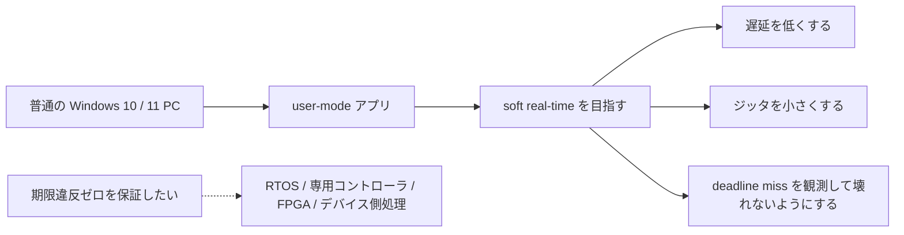
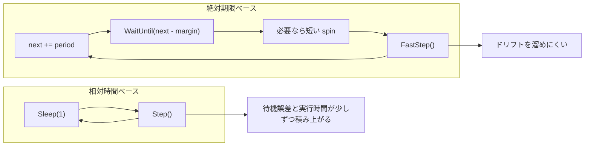
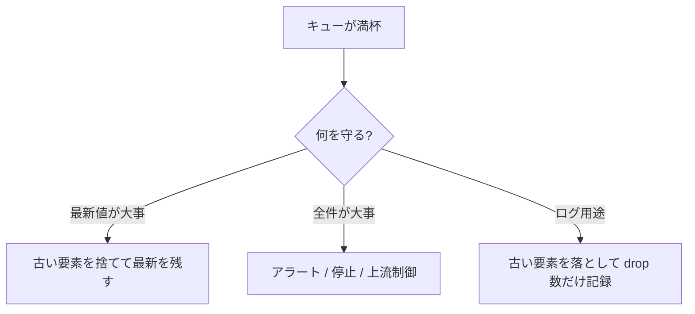
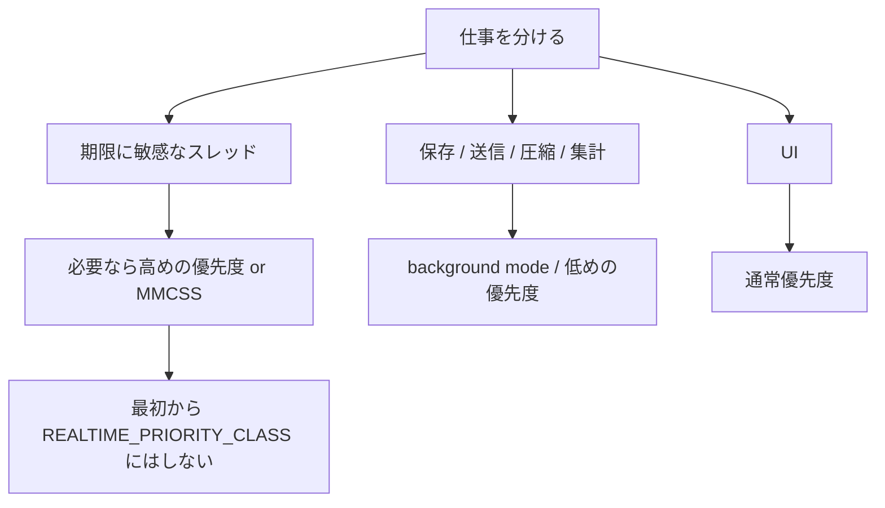
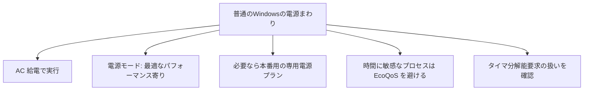
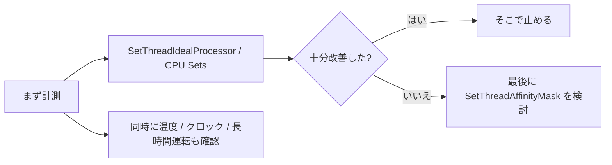
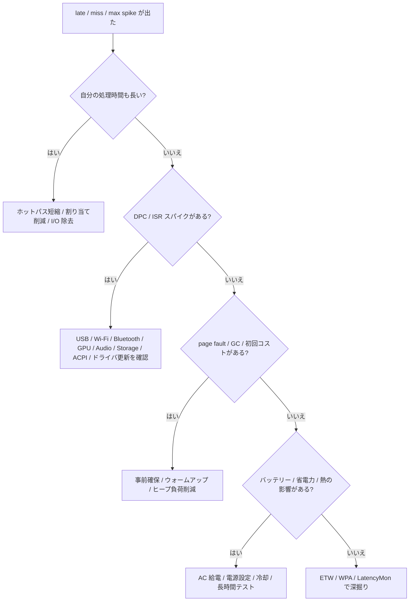
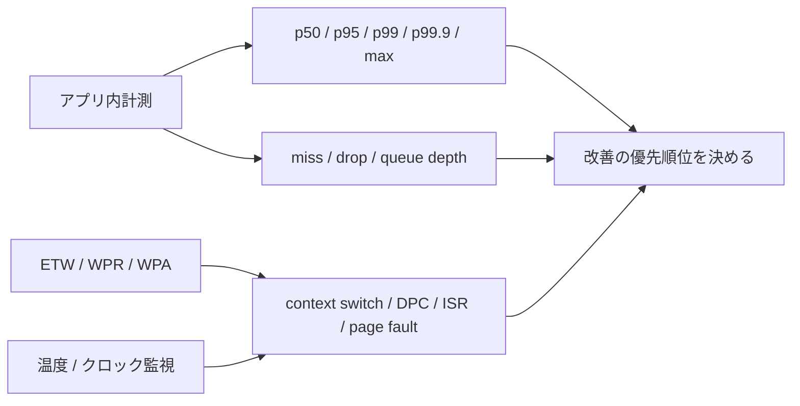

Windows で周期処理、音声処理、映像処理、計測、装置制御のような「遅れると困る」処理を作ると、
「Windows では厳しいのでは」という印象を持たれがちです。

これは半分正しく、半分は違います。
Windows は hard real-time OS ではありませんが、**設計、実装、計測、運用** をきちんと詰めると、**soft real-time** としてかなり実用的な状態まで持っていけます。

この記事で扱うのは、**特別な RTOS 拡張や独自のカーネルドライバ、専用コントローラを前提にしない、普通の Windows 10 / 11** です。
つまり、**普段のデスクトップ / ノート PC 上の user-mode アプリで、どこまで遅延とジッタを詰められるか** を実務寄りに整理します。

音声、映像、周期制御、データ取得では細部は違いますが、問題になりやすい場所はかなり共通しています。
今回はその共通部分を、**チェックリストで見やすく** まとめます。

## 目次

1. まず結論（ひとことで）
2. 普通のWindowsで「ソフトリアルタイム」とは何か
   - 2.1. この記事でいう「普通のWindows」
   - 2.2. 何ができて、どこから難しくなるか
   - 2.3. 用語を先にひとこと
3. 遅延とジッタの主な原因
   - 3.1. スケジューラと優先度
   - 3.2. DPC / ISR とドライバ
   - 3.3. ページフォルトとメモリ
   - 3.4. タイマ分解能と電源管理
   - 3.5. コア移動と熱
4. 普通のWindowsで遅れを減らす実践チェックリスト
   - 4.1. 周期ループと待機方法
   - 4.2. fast path / slow path と固定長キュー
   - 4.3. 優先度 / MMCSS / background mode
   - 4.4. メモリ / GC / 初回コスト
   - 4.5. 電源設定 / EcoQoS / timer resolution
   - 4.6. CPU 配置 / コア移動 / 熱
   - 4.7. ドライバ / DPC / ISR / 外乱の切り分け
5. 計測と評価
   - 5.1. 何を記録するか
   - 5.2. p99 / p99.9 / max の見方
   - 5.3. 何で見るか
   - 5.4. テストの作法
6. ざっくり使い分け
7. まとめ
8. 参考資料

* * *

## 1. まず結論（ひとことで）

- **普通のWindowsで目指すのは、hard real-time の保証ではなく、soft real-time として「遅れにくく、遅れても壊れにくい」構成** です。
- 一番効果が大きいのは、**ホットパスを短く・固定長に・非ブロッキングにすること** です。
- fast path（取得 / 制御）と slow path（保存 / 通信 / UI）を分け、間は **固定長キュー** でつなぎます。
- 周期ループは `Sleep(1)` 任せではなく、**絶対期限** で回します。
- 音声や映像のような連続ストリームでは、まず **MMCSS** を検討します。
- 時間計測は **QueryPerformanceCounter（QPC）**、.NET なら **`Stopwatch`** を使います。
- 待機は **デバイスイベント** か **高精度 waitable timer（待機可能タイマ）** を優先します。
- `timeBeginPeriod` は必要な間だけ使います。常時有効にする前提で設計しません。
- 実運用では **AC 給電 / 電源モード / EcoQoS の扱い / バックグラウンド負荷の整理** が効きます。
- 評価は平均値だけでなく、**p99（100回測って遅い方 1 回が見え始める境目） / p99.9 / max / miss 回数 / DPC / ISR / page fault / queue 深さ** で見ます。

要するに、普通の Windows では **優先度を上げることより、遅れる理由を設計で減らすこと** のほうが効きます。
優先度や電源設定は重要ですが、それだけで安定性は作れません。

## 2. 普通のWindowsで「ソフトリアルタイム」とは何か

### 2.1. この記事でいう「普通のWindows」

ここでいう **普通の Windows** は、だいたい次を前提にしています。

- Windows 10 / 11 の一般的なデスクトップ / ノート PC
- 独自の RTOS 拡張なし
- 独自のカーネルモードドライバ開発なし
- ふつうの user-mode アプリ
- 一般的な Windows API と設定で調整する

つまり、**「専用機を 1 台丸ごとリアルタイム制御用に作り込む」話ではなく、「普通の Windows PC 上でどこまで現実的に詰められるか」** という話です。



### 2.2. 何ができて、どこから難しくなるか

普通の Windows でも、たとえば次のような処理なら、かなり現実的に「遅れにくい」状態を作れます。

- 数ミリ秒〜数十ミリ秒の周期処理
- 音声 / 映像のバッファ駆動
- センサー取得と制御ループ
- ソフト PLC 風の一定周期処理
- UI とは別スレッドで動く低遅延パイプライン

ただし、ここでいう「できる」は、**たまの遅延スパイクを完全にゼロにできる** という意味ではありません。
狙うのは、次の状態です。

- 通常時の遅延を低くする
- ジッタを小さくする
- たまに期限を外しても壊れない
- 外した事実を観測できる

逆に、次のような要求になると、普通の Windows の user-mode だけで満たすのはかなり厳しくなります。

- 期限違反ゼロを保証したい
- 数百マイクロ秒以下を長時間安定して守りたい
- 重い GUI、ネットワーク、ストレージと同居したい
- バッテリー駆動や省電力優先のままやりたい
- ドライバやデバイス由来のスパイクも許されない

このあたりは、**本当に時間に厳しい部分だけをデバイス側ファームウェア、専用コントローラ、FPGA、RTOS へ寄せる** ことも考えたほうが安全です。

### 2.3. 用語を先にひとこと

この記事で出てくる用語を、先にざっくり整理しておきます。

| 用語 | ひとことでいうと | 実務での見方 |
| --- | --- | --- |
| soft real-time | たまの遅れはあり得るが、遅れを小さくし、遅れても壊れないようにする考え方 | 普通の Windows でまず狙うのはこれ |
| hard real-time | 期限違反ゼロを保証したい世界 | 普通の Windows の user-mode 単独で狙う対象ではない |
| ジッタ | 周期や応答時間の揺れ | 平均が良くてもジッタが大きいと実運用では不安定 |
| deadline miss | 予定時刻までに処理が終わらないこと | 隠さず、数えて、ログに出す |
| p99 / p99.9 | 遅い側のしっぽを見る指標 | p99 は「100回中、遅い方 1 回が見え始める境目」 |
| DPC / ISR | ドライバや割り込み周辺のカーネル側処理 | 長いと user-mode スレッドは待たされる |
| MMCSS | 音声 / 映像など時間に敏感な処理へ CPU を配分する Windows の仕組み | バッファを切らしたくない処理で有力 |
| QPC | `QueryPerformanceCounter` のこと | 経過時間計測の基本。壁時計ではなく高精度カウンタ |

## 3. 遅延とジッタの主な原因

普通の Windows で周期処理が遅れる理由は、だいたい次のどれかです。


### 3.1. スケジューラと優先度

Windows のスレッドは優先度で実行順が決まります。
同じ優先度ならラウンドロビンで回り、より高い優先度のスレッドが実行可能になると、低い優先度のスレッドは押しのけられます。

つまり、周期スレッドを真面目に書いても、

- 別スレッド
- 別プロセス
- OS の内部処理
- セキュリティ製品
- デバイス補助処理
- バックグラウンド同期

が先に走ることは普通にあります。

### 3.2. DPC / ISR とドライバ

ここはかなり重要です。
アプリ側の優先度を整えても、**DPC（Deferred Procedure Call）や ISR（Interrupt Service Routine）** が長いと、その間は user-mode のスレッドは実行できません。

原因になりやすいのは、たとえば次です。

- USB
- Wi-Fi / Bluetooth
- ストレージ
- オーディオ
- GPU
- ACPI / 電源まわり

アプリのコードが悪くなくても、ドライバやハードウェア都合で止められることがあります。
ここは「アプリの優先度をもっと上げれば勝てるだろう」と考えると、だいたい痛い目を見ます。

### 3.3. ページフォルトとメモリ

ホットパスで page fault（必要なページがメモリになく、取りに行くこと）が起きると、遅延が一気に大きくなります。

特に避けたいのは次です。

- 初回アクセスでのページコミット
- 遅延ロード
- メモリマップトファイルのページイン
- 必要以上の動的確保
- 大きなオブジェクトや断片化したヒープ

周期処理の本体では、**必要なメモリを先に確保して、起動時に一度触っておく** くらいでちょうどよいです。

### 3.4. タイマ分解能と電源管理

「1ms ごとに動かしたいから `Sleep(1)`」は、ほとんどの場合うまくいきません。
Windows の待機精度は、タイマ分解能、スケジューリング、電源状態の影響を受けます。

さらに、タイマ分解能を上げる設定は、**待機精度を少し改善できる一方で、消費電力やシステム全体の挙動に副作用がある** ことも押さえる必要があります。

### 3.5. コア移動と熱

スレッドがコア間を移動すると、キャッシュの温まり直しが発生します。
これ自体は OS がうまく処理することも多いですが、負荷が高い環境では揺れの原因になります。

さらに、長時間回すと熱も無視できません。
**サーマルスロットリングが入ると、それまで安定していた周期が崩れる** ことがあります。

## 4. 普通のWindowsで遅れを減らす実践チェックリスト

ここからが実務パートです。
前の節で見た原因に対して、**普通の Windows で何を確認し、何を避け、何を先に決めるべきか** をチェックリスト形式でまとめます。

### 4.1. 周期ループと待機方法

まず典型的なアンチパターンはこれです。

```cpp
while (running)
{
    Sleep(1);
    Step();
}
```

これは「1ms 周期」ではなく、**だいたい 1ms 以上待ってから、その上に `Step()` の実行時間を足す** ループです。
しかも待機オーバーシュートがそのまま累積します。



**チェックリスト**

- [ ] `Sleep(1)` を周期ループの土台にしていない
- [ ] 周期は `next += period` の **絶対期限** で回している
- [ ] 待機は **デバイスイベント** か **waitable timer（待機可能タイマ）** を優先している
- [ ] 最後の微調整だけ、ごく短い busy-spin（空回し待機）に限定している
- [ ] `timeBeginPeriod` は必要な間だけ使い、終わったら戻している
- [ ] 最小化 / 非表示 / 見えない状態でも挙動を確認している

周期ループは、相対時間ではなく **絶対期限** で回したほうが安定します。

```cpp
int64_t next = QpcNow() + periodTicks;

while (running)
{
    WaitUntil(next - wakeMarginTicks);

    while (QpcNow() < next)
    {
        CpuRelax(); // 最後だけ短く spin
    }

    int64_t started = QpcNow();
    FastStep();
    int64_t finished = QpcNow();

    RecordTiming(next, started, finished);

    next += periodTicks;

    while (finished > next)
    {
        ++missedDeadlines;
        next += periodTicks;
    }
}
```

### 4.2. fast path / slow path と固定長キュー

構成の基本はこれです。
**fast path には「期限に敏感な仕事」だけを置き、それ以外は slow path へ追い出す** のが基本です。


fast path でやるのは、たとえば次だけです。

- データ取得
- 制御値計算
- 必要最小限のコピー
- タイムスタンプ
- キュー投入
- miss / overrun の記録

それ以外は slow path に落とします。

**チェックリスト**

- [ ] ホットパスでファイル書き込み、ネットワーク送信、DB 書き込みをしていない
- [ ] ホットパスで重いログ出力、`Flush`、同期 RPC をしていない
- [ ] fast path / slow path をスレッドや責務で明確に分けている
- [ ] キューは **固定長** にしている
- [ ] キューが溢れたときの方針を先に決めている
- [ ] miss 回数、drop 数、queue depth を観測している
- [ ] UI 更新やログ集約は低い周期へ分離している

キューが満杯になったときは、方針を曖昧にしないほうが安全です。



### 4.3. 優先度 / MMCSS / background mode

優先度の基本は、**全部を上げない** ことです。
普通の Windows では、「大事なスレッドだけを上げ、後ろ仕事はちゃんと下げる」ほうがうまくいきます。
background mode は、CPU だけでなく I/O などの資源も低優先度寄りに扱うための仕組みです。



**チェックリスト**

- [ ] 全スレッドを高優先度にしていない
- [ ] 本当に時間が厳しいスレッドだけを上げている
- [ ] 保存、送信、圧縮、同期などの後ろ仕事は background mode に落としている
- [ ] 音声、映像、キャプチャ、再生など連続バッファ処理では MMCSS を検討している
- [ ] プロセス全体より、まず **スレッド単位** で考えている
- [ ] `REALTIME_PRIORITY_CLASS` は、必要性が明確になるまで使わない

MMCSS（Multimedia Class Scheduler Service）は、**音声 / 映像のような「一定時間内にバッファを埋めたい」処理** で特に有効です。
単純に高優先度スレッドを常時回すより、Windows の設計に沿っています。

コードの雰囲気はこんな感じです。

```cpp
DWORD taskIndex = 0;
HANDLE avrt = AvSetMmThreadCharacteristicsW(L"Pro Audio", &taskIndex);
if (!avrt)
{
    throw std::runtime_error("AvSetMmThreadCharacteristicsW failed");
}

// 時間に敏感なループを回す

if (!AvRevertMmThreadCharacteristics(avrt))
{
    throw std::runtime_error("AvRevertMmThreadCharacteristics failed");
}
```

### 4.4. メモリ / GC / 初回コスト

ホットパスで毎回 `new` / `malloc` / `List<T>.Add` / 文字列連結 / LINQ を使うと、
いつか回収や再配置の都合が表に出ます。

GC（ガベージコレクション）が悪いわけではありません。
ただ、**割り当ての多いコードを書けば、その影響はジッタとして表面化します。**


**チェックリスト**

- [ ] ホットパスで毎回メモリ確保 / 解放をしていない
- [ ] 必要なバッファを起動時に事前確保している
- [ ] 起動時に一度触ってページを温めている
- [ ] 初回 JIT、初回 DLL 読み込み、初回 I/O を本計測に混ぜていない
- [ ] ループ中に巨大な構造や可変長ログを育てていない
- [ ] `VirtualLock` を使うとしても、ごく小さいクリティカル領域だけにしている

**.NET 側のチェック**

- [ ] 時刻計測に `Stopwatch` / `Stopwatch.GetTimestamp()` を使っている
- [ ] ホットパスで LINQ、文字列連結、`ToString()`、巨大ログ生成をしていない
- [ ] `async/await` を hot path に持ち込んでいない
- [ ] ウォームアップ前と後を分けて評価している

### 4.5. 電源設定 / EcoQoS / timer resolution

ここは地味ですが効きます。
コードを詰めても、上位の電源制御が強く効いていると結果は安定しません。



**チェックリスト**

- [ ] 本番評価はまず **AC 給電** で行っている
- [ ] `[設定] > [システム] > [電源 & バッテリー] > [電源モード]` を **最適なパフォーマンス** 寄りにしている
- [ ] battery saver / 省エネ優先モードを実行中に使っていない
- [ ] ベンダー独自ユーティリティの静音 / eco / battery 優先モードを確認している
- [ ] 時間に敏感なプロセスを不用意に EcoQoS（省電力寄りの QoS）にしていない
- [ ] `IGNORE_TIMER_RESOLUTION` が時間に敏感なプロセス側で有効になっていない
- [ ] 最小化 / 非表示時にタイマ分解能要求の効きが変わらないか確認している
- [ ] 普段使い用と、本番 / 計測 / デモ用の電源設定を分けている

`timeBeginPeriod` は整理して使えば役に立ちますが、**万能薬ではありません。**

- 必要な直前に呼ぶ
- 終わったら `timeEndPeriod` で戻す
- Windows 10 version 2004 以降は、昔のような完全なグローバル挙動ではない
- Windows 11 では、ウィンドウを持つプロセスが完全に隠れる / 最小化される / 見えない / 聞こえない状態だと、高い分解能が保証されないことがある
- 分解能を上げても **QPC の精度が上がるわけではない**

電源や QoS の影響が疑わしいなら、`SetProcessInformation` で power throttling の状態を確認します。

```cpp
PROCESS_POWER_THROTTLING_STATE state{};
state.Version = PROCESS_POWER_THROTTLING_CURRENT_VERSION;
state.ControlMask =
    PROCESS_POWER_THROTTLING_EXECUTION_SPEED |
    PROCESS_POWER_THROTTLING_IGNORE_TIMER_RESOLUTION;
state.StateMask = 0; // HighQoS（性能優先寄り） + タイマ分解能要求を尊重

if (!SetProcessInformation(
        GetCurrentProcess(),
        ProcessPowerThrottling,
        &state,
        sizeof(state)))
{
    throw std::runtime_error("SetProcessInformation failed");
}
```

### 4.6. CPU 配置 / コア移動 / 熱

CPU 配置は、いきなり **特定コアへ固定（hard affinity / CPU pinning）** するより、**「なるべくこのコア群で動いてほしい」という soft affinity に近い指定** から始めるほうがうまくいくことが多いです。



**チェックリスト**

- [ ] まず計測してから CPU 配置をいじっている
- [ ] いきなり特定コアへ固定していない
- [ ] まず `SetThreadIdealProcessor` や CPU Sets を試している
- [ ] `SetThreadAffinityMask` は最後の手段として扱っている
- [ ] 長時間運転で温度、クロック、サーマルスロットリングを確認している
- [ ] ノート PC の静音モードや低騒音モードを確認している

順番としては、だいたい次が安全です。

1. まず計測する
2. 必要なら ideal processor / CPU Sets
3. それでも改善が必要なら特定コア固定

特定コア固定は効きそうに見えますが、**OS の逃げ道を減らす** ので、安易に使うと逆に融通が利かなくなることがあります。

### 4.7. ドライバ / DPC / ISR / 外乱の切り分け

「たまに max だけ爆発する」「平均は良いのに p99.9 が悪い」というときは、
アプリのコード以外の外乱も疑ったほうがよいです。



**チェックリスト**

- [ ] Wi-Fi / Bluetooth / USB / ストレージ / GPU / オーディオまわりのドライバを確認している
- [ ] 不要なクラウド同期、インデックス作成、自動更新を止めて比較している
- [ ] 最小化したら崩れるか、画面を消したら崩れるかも試している
- [ ] LatencyMon や ETW で DPC / ISR の傾向を見ている
- [ ] 「自分の処理が重い」のか「外から止められている」のかを分けて見ている

## 5. 計測と評価

### 5.1. 何を記録するか

最低限、次は取りたいです。

- 周期予定時刻
- 実開始時刻
- 実終了時刻
- lateness（予定開始に対してどれだけ遅れて始まったか）
- 実行時間
- missed deadline 数
- 連続 missed deadline 数
- queue depth
- drop 数
- CPU 使用率
- コア別の偏り
- DPC / ISR スパイク
- page fault
- 温度 / クロック変動

平均だけ見ても、本質はつかみにくいです。
本番で困るのは、たまに出る大きな遅延スパイクです。

### 5.2. p99 / p99.9 / max の見方

p99 などの指標は、**遅い側のしっぽを見るためのもの** です。
平均だけだと、たまに出る大きな遅延が隠れます。

| 指標 | 意味 | 10,000 回測ったときのイメージ |
| --- | --- | --- |
| 平均 | 全体のならし値 | スパイクが埋もれやすい |
| p50 | 真ん中の値 | ふだんの体感に近い |
| p95 | 遅い方 5% が見え始める境目 | 遅い 500 回を除いた境目 |
| p99 | 遅い方 1% が見え始める境目 | 遅い 100 回を除いた境目 |
| p99.9 | 遅い方 0.1% が見え始める境目 | 遅い 10 回を除いた境目 |
| max | 最悪値 | いちばん遅かった 1 回 |

たとえば、

- 平均: 0.8ms
- p99: 1.2ms
- p99.9: 3.5ms
- max: 28ms

なら、**普段は速いが、たまに大きなスパイクがある** ということです。
普通の Windows では、だいたいこの **p99 から max のしっぽ** に本当の問題が出ます。

### 5.3. 何で見るか

道具としては、だいたい次です。

- **アプリ内計測**
  まず自前で `period / lateness / execution time / queue depth / drop` を取る
- **ETW / WPR / WPA**
  CPU、context switch、DPC / ISR、page fault を掘る
- **LatencyMon**
  ドライバ起因の揺れのあたりを付ける
- **温度 / クロック監視**
  熱の影響を見る



WPA まで行くと少し骨が折れますが、
**DPC / ISR が原因なのか、単に自分の処理が重いのか** を分けるにはかなり有効です。

### 5.4. テストの作法

テストは、静かなベンチだけでは足りません。
少なくとも次を分けて見ます。

- 起動直後のウォームアップ前
- ウォームアップ後
- 長時間連続運転
- UI 前面
- UI 最小化 / 非表示に近い状態
- AC 給電
- バッテリー駆動
- ネットワークやディスクに負荷がある状態

ベンチ環境だけで評価すると、実運用で出る問題を見落としやすくなります。
**普通の Windows は「使われ方」に挙動が引っ張られやすい** ので、実際に使う条件へ寄せて確認するのが大事です。

## 6. ざっくり使い分け

- **10〜20ms 級で、たまの揺れは吸収できる**
  → fast / slow 分離、固定長キュー、通常優先度〜やや高め、イベント駆動で十分なことが多い

- **1〜5ms 級で、継続的に間に合わせたい**
  → ホットパスの無割り当て化、専用スレッド、MMCSS または慎重な優先度調整、高精度 waitable timer（待機可能タイマ）、AC 給電、最適なパフォーマンス寄りの電源設定

- **1ms 未満に近づき、しかも長時間・高負荷でも外したくない**
  → 普通の Windows の user-mode 単独ではかなり厳しい。クリティカル部分を別の場所へ逃がす設計を考える

- **GUI / ログ / 通信 / DB と全部同居**
  → 「全部 1 プロセス 1 ループ」で抱え込まず、責務を分離する。後段の都合が前段の期限を壊しやすいため

## 7. まとめ

押さえておきたい前提は、次の 2 つです。

- **普通の Windows で目指すのは hard real-time の保証ではなく、soft real-time として遅延とジッタを小さくし、期限違反が起きても壊れない構成にすること**
- **一番効果が大きいのは、優先度調整よりホットパスの整理**

実装で効くことは、次の通りです。

- fast path / slow path を分ける
- 固定長キューと、あふれたときの方針を先に決める
- QPC で測り、event / waitable timer（待機可能タイマ）で待つ
- ホットパスでは割り当て、ブロッキング I/O、重いロックを避ける

運用で効くことは、次の通りです。

- AC 給電で動かす
- 本番用の電源設定を分ける
- 不要なバックグラウンド負荷を減らす
- p99 / p99.9 / max と miss 回数で評価する

要するに、普通の Windows でのソフトリアルタイムは、優先度設定だけで決まるものではありません。
**設計、実装、電源設定、計測、運用を分けて詰めると、かなり安定したシステムにできます。**

## 8. 参考資料

- [Multimedia Class Scheduler Service](https://learn.microsoft.com/en-us/windows/win32/procthread/multimedia-class-scheduler-service)
- [AvSetMmThreadCharacteristicsW function](https://learn.microsoft.com/en-us/windows/win32/api/avrt/nf-avrt-avsetmmthreadcharacteristicsw)
- [SetThreadPriority function](https://learn.microsoft.com/en-us/windows/win32/api/processthreadsapi/nf-processthreadsapi-setthreadpriority)
- [SetPriorityClass function](https://learn.microsoft.com/en-us/windows/win32/api/processthreadsapi/nf-processthreadsapi-setpriorityclass)
- [timeBeginPeriod function](https://learn.microsoft.com/en-us/windows/win32/api/timeapi/nf-timeapi-timebeginperiod)
- [CreateWaitableTimerExW function](https://learn.microsoft.com/en-us/windows/win32/api/synchapi/nf-synchapi-createwaitabletimerexw)
- [Acquiring high-resolution time stamps](https://learn.microsoft.com/en-us/windows/win32/sysinfo/acquiring-high-resolution-time-stamps)
- [QueryPerformanceCounter function](https://learn.microsoft.com/en-us/windows/win32/api/profileapi/nf-profileapi-queryperformancecounter)
- [GetSystemTimePreciseAsFileTime function](https://learn.microsoft.com/en-us/windows/win32/api/sysinfoapi/nf-sysinfoapi-getsystemtimepreciseasfiletime)
- [SetProcessInformation function](https://learn.microsoft.com/en-us/windows/win32/api/processthreadsapi/nf-processthreadsapi-setprocessinformation)
- [VirtualLock function](https://learn.microsoft.com/en-us/windows/win32/api/memoryapi/nf-memoryapi-virtuallock)
- [CPU Sets](https://learn.microsoft.com/en-us/windows/win32/procthread/cpu-sets)
- [SetThreadIdealProcessor function](https://learn.microsoft.com/en-us/windows/win32/api/processthreadsapi/nf-processthreadsapi-setthreadidealprocessor)
- [SetThreadAffinityMask function](https://learn.microsoft.com/en-us/windows/win32/api/winbase/nf-winbase-setthreadaffinitymask)
- [Processor power management options](https://learn.microsoft.com/en-us/windows-hardware/customize/power-settings/configure-processor-power-management-options)
- [Change the power mode for your Windows PC](https://support.microsoft.com/en-us/windows/change-the-power-mode-for-your-windows-pc-c2aff038-22c9-f46d-5ca0-78696fdf2de8)
- [Power settings in Windows 11](https://support.microsoft.com/en-us/windows/power-settings-in-windows-11-0d6a2b6b-2e87-4611-9980-ac9ea2175734)
- [CPU Analysis (WPA / WPT)](https://learn.microsoft.com/en-us/windows-hardware/test/wpt/cpu-analysis)
