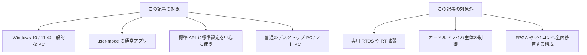
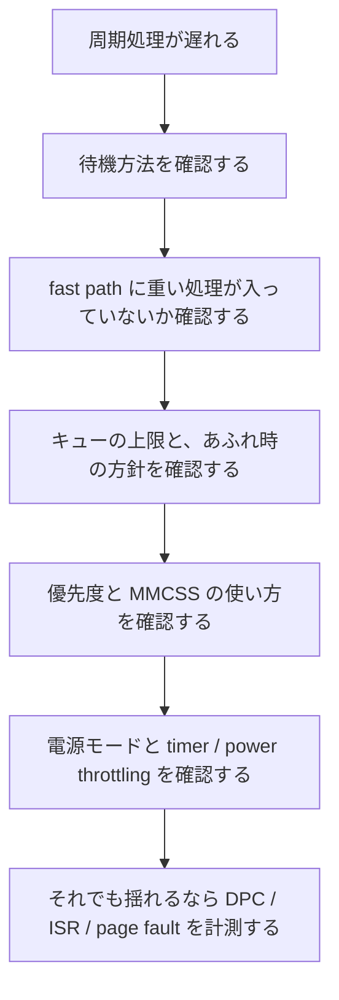
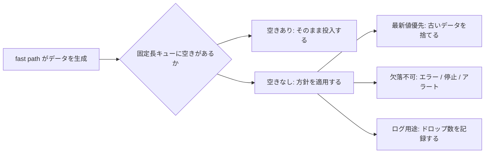

この記事で扱うのは、特別なリアルタイム拡張を入れた Windows ではなく、**普通の Windows 10 / 11** です。
対象は、一般的なデスクトップ PC やノート PC の上で動く **user-mode の通常アプリ** です。

ここで目指すのは、hard real-time の保証ではありません。
普通の Windows でも、設計、待機方法、優先度、電源設定、計測を揃えると、**soft real-time としてかなり実用的な状態** まで持っていけます。

今回は、項目を網羅的に並べるより、**何を見直せばよいかをすぐ把握できる構成** にしました。
最初に 4 節のチェックリストを見ると、見直す場所がだいたい分かります。

## 目次

1. まず結論（ひとことで）
2. この記事でいう「普通のWindows」とは何か
   - 2.1. 対象にする範囲
   - 2.2. 対象外にするもの
3. Windows でのソフトリアルタイムとは何か
   - 3.1. 目標にするもの
   - 3.2. この記事で使う言葉
   - 3.3. どこから難しくなるか
4. まず見るチェックリスト
   - 4.1. 全体像
   - 4.2. 周期ループは `Sleep` 任せにしない
   - 4.3. fast path と slow path を分ける
   - 4.4. キューは固定長にして、あふれたときの方針を決める
   - 4.5. fast path に重い処理を入れない
   - 4.6. 優先度は必要なスレッドだけ上げる
   - 4.7. タイマ、CPU、電源設定をセットで見る
   - 4.8. 遅れを見えるようにする
5. 電源設定・OS 設定のチェックリスト
6. 計測と評価
   - 6.1. 何を記録するか
   - 6.2. p99 / p99.9 / max とは何か
   - 6.3. 何で見るか
   - 6.4. テスト条件
7. ざっくり使い分け
8. まとめ
9. 参考資料

* * *

## 1. まず結論（ひとことで）

- **普通の Windows で目指すのは、hard real-time の保証ではなく、遅延とジッタを小さくし、deadline miss を減らすこと**
- まず見直すべきなのは、優先度の値より、**周期スレッドの中に何を入れているか**
- 毎周期必ず通る時間に厳しい処理を **fast path**、保存・通信・UI のように少し遅れてもよい処理を **slow path** として分ける
- fast path では、`Sleep` 任せの待機、ブロッキング I/O、毎回の確保・解放、無制限キューを避ける
- 音声や映像のような連続ストリームでは、まず **MMCSS** を検討する
- 実運用では、**AC 給電、電源モード、timer resolution、power throttling、バックグラウンド負荷** が効く
- 評価は平均値だけでなく、**p99 / p99.9 / max / miss 回数 / queue 深さ / DPC / ISR / page fault** で見る

実務での順番としては、だいたい次です。

1. 周期ループを `Sleep` 任せから外す
2. fast path と slow path を分ける
3. キューを固定長にして、あふれたときの方針を決める
4. fast path から I/O、割り当て、重いロックを外す
5. 必要なスレッドだけ優先度や MMCSS を使う
6. 普通の Windows の電源設定と計測を揃える

「普通の Windows で、どこを直せば遅れにくくなるか」を把握したいなら、この順番で見るのが分かりやすいです。

## 2. この記事でいう「普通のWindows」とは何か

ここでいう「普通の Windows」は、**Windows 10 / 11 の一般的な PC** を指します。
特別なリアルタイム拡張や専用 OS は使わず、Windows が標準で持っている API と設定の範囲で、どこまで安定化できるかを見る、という立場です。



### 2.1. 対象にする範囲

対象にするのは、たとえば次のようなものです。

- Windows 10 / 11 上で動く C++ / C# の user-mode アプリ
- 音声、映像、計測、装置制御、周期処理のように「遅れにくさ」が必要なソフトウェア
- 一般的なデスクトップ PC、ワークステーション、ノート PC

つまり、「普通に配備できる Windows アプリとして、どこまで粘れるか」を扱います。

### 2.2. 対象外にするもの

一方で、この記事の中心からは外すものもあります。

- hard real-time の保証
- 専用 RTOS やリアルタイム拡張製品の導入
- カーネルドライバや独自ドライバを主役にする設計
- FPGA、マイコン、専用コントローラに時間に厳しい部分を全面移管する構成

要件が厳しくなれば、こうした選択も必要になります。
ただ、最初からそこへ行く前に、**普通の Windows で再現しやすい改善** を積み上げる価値はかなりあります。

## 3. Windows でのソフトリアルタイムとは何か

### 3.1. 目標にするもの

普通の Windows で狙うのは、次のような状態です。

- 通常時の遅延を低くする
- ジッタを小さくする
- たまの遅延スパイクがあっても壊れにくくする
- 期限に間に合わなかった回数を観測できるようにする

ここでいう soft real-time は、「絶対に遅れない」ではなく、**遅れにくく、遅れても分かり、遅れても壊れにくい** を目指す考え方です。

### 3.2. この記事で使う言葉

最初に、この 3 つだけ押さえておくと読みやすくなります。

| 言葉 | 意味 |
| --- | --- |
| 遅延 | 予定より処理が遅れて始まる、または終わること |
| ジッタ | 周期や処理時間のばらつき。毎回同じ間隔で動かないこと |
| deadline miss | 決めていた期限までに処理が終わらないこと |

たとえば、1ms ごとに動かしたい処理が 1.8ms 後に始まったなら、その 0.8ms 分が遅延です。
それが毎回 1.0ms ではなく 0.9ms、1.3ms、2.1ms のように揺れるなら、それがジッタです。

### 3.3. どこから難しくなるか

普通の Windows の user-mode アプリだけで厳しくなってくるのは、たとえば次のような要求です。

- 期限違反ゼロを保証したい
- 数百マイクロ秒以下を長時間安定して守りたい
- 重い GUI、通信、ストレージと高頻度周期処理を全部同居させたい
- バッテリー駆動や省電力優先のまま厳しい周期を守りたい
- ドライバやデバイス由来のスパイクも許されない

このあたりになると、普通の Windows 単独では厳しくなります。
その場合は、**本当に時間に厳しい部分だけをファームウェア、専用コントローラ、FPGA、別の RTOS へ寄せる** ことも考えたほうがよいです。

## 4. まず見るチェックリスト

この節は、**「何を気を付ければよいか」を先に把握するための節** です。
まずは次の表だけ見れば、見直す場所のあたりは付きます。

### 4.1. 全体像

| 確認する項目 | まずやること | 典型的な NG |
| --- | --- | --- |
| 待機方法 | 絶対期限で回す。イベント駆動や高精度 waitable timer を使う | `Sleep(1)` ベースの周期ループ |
| 処理の分離 | fast path と slow path を分ける | fast path に保存、送信、UI を入れる |
| キュー | 固定長にして、あふれたときの方針を決める | 無制限キューで先送りする |
| fast path の中身 | 割り当て、重いログ、ブロッキング I/O、重いロックを外す | `new` / `malloc` / 同期 I/O / 毎回の文字列生成 |
| 優先度 | 必要なスレッドだけ上げる。音声・映像は MMCSS を検討する | いきなり `REALTIME_PRIORITY_CLASS` |
| OS / 電源 | AC 給電、電源モード、timer resolution、power throttling を確認する | バッテリー駆動や省電力モードのまま評価する |
| 計測 | lateness、実行時間、miss 回数、queue 深さを取る | 平均値だけを見る |



以下、各項目を順番に見ていきます。

### 4.2. 周期ループは `Sleep` 任せにしない

まず最初に確認したいのはここです。
`Sleep(1)` は「1ms きっかり待つ」ではなく、**少なくとも 1ms 以上待つ** です。
そこに `Step()` の実行時間も足されるので、周期のずれがそのまま積み上がります。


周期処理は、**相対時間でなく絶対期限** で回したほうが安定します。
考え方は次のような形です。

```cpp
int64_t next = QpcNow() + periodTicks;

while (running)
{
    WaitUntil(next - wakeMarginTicks);   // event / waitable timer
    while (QpcNow() < next)
    {
        CpuRelax();                      // 最後だけ短く spin
    }

    int64_t started = QpcNow();
    FastStep();                          // no blocking, no alloc, no heavy lock
    int64_t finished = QpcNow();

    RecordTiming(next, started, finished);

    next += periodTicks;

    while (finished > next)
    {
        ++missedDeadlines;
        next += periodTicks;
    }
}
```

ポイントは 2 つです。

- 毎回 `next = now + period` にしない
- 遅れたときにどうするかを先に決めておく

普通の Windows で安定させたいなら、ここはかなり効きます。

### 4.3. fast path と slow path を分ける

構成として一番効果が大きいのは、**時間に厳しい処理と、少し遅れてもよい処理を分けること** です。

- fast path
  毎周期必ず通る、短く終わってほしい処理
- slow path
  保存、通信、整形、集計、UI など、少し遅れても許される処理


fast path でやるのは、次のようなものだけに絞ります。

- データ取得
- 制御値計算
- 最小限のコピー
- タイムスタンプ
- キュー投入
- miss や overrun の記録

これ以外は slow path に送ったほうが安定します。
普通の Windows でソフトリアルタイムを狙うなら、**まずこの分離が土台** です。

### 4.4. キューは固定長にして、あふれたときの方針を決める

「遅れたらキューに積めばよい」と考えると、問題を先送りしやすくなります。
無制限キューは、一見安全そうですが、実際には **遅延を見えにくくするだけ** になりがちです。



先に決めておきたいのは、次の 3 つです。

- キューの上限
- あふれたときの方針
- あふれた事実をどう記録するか

たとえば、最新値だけ意味があるなら古いものを捨てるほうが自然です。
一方で、欠落が許されないなら、静かに遅らせるより、エラーとして扱ったほうが後で困りません。

### 4.5. fast path に重い処理を入れない

fast path で避けたいものは、かなりはっきりしています。

- ファイル書き込み
- ネットワーク送信
- DB 書き込み
- 重いログ出力
- 毎回の `new` / `malloc` / `List<T>.Add`
- 毎回の文字列連結や `ToString()`
- 重いロック
- 初回アクセスでのページフォルトを呼びやすい処理

まとめると、**遅くなるかもしれない処理を fast path に持ち込まない** ということです。

特に注意したいのは次の 3 つです。

1. **割り当てと解放**
   fast path では、バッファを先に確保して再利用するほうが安定します。

2. **ブロッキング I/O**
   開発機ではたまたま速く見えても、本番では揺れやすいです。

3. **ページフォルト**
   起動時に必要なメモリへ一度触れておく、というだけでも差が出ます。

必要なら `VirtualLock` を使う場面もありますが、これは補助的な手段です。
まずは、fast path 自体を軽くして、必要なメモリを先に用意するほうが先です。

### 4.6. 優先度は必要なスレッドだけ上げる

優先度の基本は、**全部を上げない** ことです。
まずは本当に時間に厳しいスレッドだけを対象にします。

考え方としては、だいたい次です。

- UI や通常ワーカーは普通の優先度
- fast path のスレッドだけを必要に応じて上げる
- 保存、送信、ログ集約のような後ろ仕事は background mode を検討する
- プロセス全体より、まずスレッド単位で考える

音声や映像のような連続ストリームでは、まず **MMCSS** を検討するのが自然です。
MMCSS は、マルチメディア向けに Windows が用意しているスケジューリング機能です。
単純に高優先度へ寄せるより、Windows の流儀に沿っています。

一方で、`REALTIME_PRIORITY_CLASS` は最初に入れる設定ではありません。
効果が出ることはありますが、副作用も大きいので、**専用機で十分に挙動を確認した上で、本当に必要なときだけ** 検討したほうが安全です。

### 4.7. タイマ、CPU、電源設定をセットで見る

普通の Windows では、コードだけ直しても足りないことがあります。
待機方法、CPU の置き方、電源設定はセットで見たほうが分かりやすいです。

確認したい点は次です。

- 経過時間の計測は `QueryPerformanceCounter` / `Stopwatch` を使っているか
- 待機はデバイスイベント、または高精度 waitable timer を使えるか
- `timeBeginPeriod` を使うなら、必要な間だけにしているか
- CPU 固定が必要かどうかを、計測してから判断しているか
- AC 給電、電源モード、process power throttling を確認しているか

CPU については、いきなり hard affinity で固定するより、まず `SetThreadIdealProcessor` や CPU Sets のような **緩い指定** から始めるほうが扱いやすいことが多いです。
固定すると、かえって OS の逃げ道を減らすことがあります。

### 4.8. 遅れを見えるようにする

最後に大事なのは、**遅れたことを隠さない** ことです。
周期違反は、例外として捨てるより、数えて記録したほうが後で原因を詰めやすくなります。

最低限、次は持っておくと役に立ちます。

- 予定開始時刻
- 実開始時刻
- 実終了時刻
- lateness
- 実行時間
- missed deadline 回数
- 連続 missed deadline 回数
- queue 深さ
- ドロップ数

それでも大きなスパイクが消えないなら、アプリの外側も疑います。
普通の Windows では、**DPC / ISR、ドライバ、page fault、熱、クロック変動** で揺れることがあります。
この段階になったら、ETW / WPR / WPA や LatencyMon で切り分けると、原因が見えやすくなります。

## 5. 電源設定・OS 設定のチェックリスト

普通の Windows で効きやすい設定は、まず Windows 標準の範囲にあります。
最初から BIOS / UEFI へ行くより、次の順で見るほうが再現しやすいです。


チェックリストとしては次のようになります。

1. **AC 給電で動かす**
   バッテリー駆動のまま詰めても、結果が安定しにくいです。

2. **[設定] > [システム] > [電源 & バッテリー] の電源モードを確認する**
   本番や計測では、**[最適なパフォーマンス]** 寄りを使ったほうが素直です。

3. **必要なら専用の電源プランを用意する**
   普段使いはバランス、本番や計測だけ専用プラン、という分け方が実務では扱いやすいです。

4. **最小のプロセッサの状態 / 最大のプロセッサの状態を確認する**
   専用機や計測時なら、AC 時のみ 100% / 100% を試す価値があります。
   ただし、熱、消費電力、ファン騒音は増えます。

5. **process power throttling / EcoQoS を確認する**
   省電力寄りの設定が入っていると、短い待機や実行速度に影響することがあります。

6. **不要なバックグラウンド負荷を減らす**
   クラウド同期、自動アップデート、重いブラウザ、常駐監視、インデックス作成などは普通に影響します。

7. **最小化時や非表示時も試す**
   Windows 11 では、見えない状態のアプリで timer resolution の挙動が変わることがあります。

8. **BIOS / UEFI は最後に見る**
   C-state やベンダー独自の静音 / Eco 設定が効くことはありますが、機種依存が強いです。
   Windows 側で詰めてから触ったほうが分かりやすいです。

## 6. 計測と評価

### 6.1. 何を記録するか

最低限、次は記録しておきたいです。

- 周期予定時刻
- 実開始時刻
- 実終了時刻
- lateness
- 実行時間
- missed deadline 数
- 連続 missed deadline 数
- queue 深さ
- ドロップ数
- DPC / ISR スパイク
- page fault
- 温度 / クロック変動

平均値だけでは、本番で困る種類の遅延が見えにくいです。
普通の Windows で問題になるのは、**平均的には速いが、ときどき大きく遅れる** という形だからです。

### 6.2. p99 / p99.9 / max とは何か

このあたりの言葉は、最初に意味を押さえておくと分かりやすいです。

- **平均**
  全体の真ん中の傾向を見る指標です。
  ただし、たまに出る大きな遅延は埋もれやすいです。

- **p99**
  全サンプルの **99% がこの値以下** になる境目の値です。
  1000 回測ったなら、**遅いほう 10 回を除いた上限に近い値** と考えると分かりやすいです。

- **p99.9**
  全サンプルの **99.9% がこの値以下** になる境目です。
  1000 回測ったなら、**遅いほう 1 回を除いた上限に近い値** です。

- **max**
  一番悪かった 1 回の値です。


実務では、平均だけでなく **p99 / p99.9 / max** を見たほうが、体感に近くなります。
「普段は大丈夫だが、ときどき引っかかる」を数字として見るには、この見方が便利です。

注意点として、p99.9 を見るならサンプル数も必要です。
10Hz の処理で 1000 サンプルを集めるだけでも 100 秒かかります。
サンプルが少ないまま p99.9 を見ると、たまたまの 1 回に強く引っ張られます。

### 6.3. 何で見るか

道具としては、だいたい次です。

- **アプリ内計測**
  まず自前で、period、lateness、execution time、queue depth を取る

- **ETW / WPR / WPA**
  CPU、context switch、DPC / ISR、page fault を見る

- **LatencyMon**
  ドライバ起因の揺れのあたりを付ける

- **温度 / クロック監視**
  熱やサーマルスロットリングの影響を見る

まずはアプリ内計測で、自分の処理が重いのか、外から止められているのかを切り分けます。
そのうえで ETW / WPR / WPA を使うと、DPC / ISR や page fault の影響を追いやすくなります。

### 6.4. テスト条件

テストは、静かな開発機だけでは足りません。
少なくとも次は分けて見たいです。

- 起動直後のウォームアップ前
- ウォームアップ後
- 長時間連続運転
- UI 前面
- UI 最小化 / 非表示に近い状態
- AC 給電
- バッテリー駆動
- ネットワークやディスクに負荷がある状態

実運用に近い条件で見ておかないと、後で「開発機では大丈夫だった」が起きやすくなります。

## 7. ざっくり使い分け

普通の Windows での現実的な目安としては、だいたい次のように考えると整理しやすいです。

- **10〜20ms 級で、たまの揺れは吸収できる**
  fast / slow 分離、固定長キュー、通常優先度〜やや高め、イベント駆動で十分なことが多いです。

- **1〜5ms 級で、継続的に間に合わせたい**
  fast path の無割り当て化、専用スレッド、MMCSS または慎重な優先度調整、高精度 waitable timer、AC 給電、最適なパフォーマンス寄りの電源設定を合わせて見ます。

- **1ms 未満に近づき、しかも長時間・高負荷でも外したくない**
  普通の Windows の user-mode アプリ単独では厳しくなってきます。
  クリティカルな部分を別の場所へ逃がす設計を考えたほうがよいです。

- **GUI、ログ、通信、DB と全部同居させたい**
  1 プロセス 1 ループで抱え込まず、責務を分離したほうが安定します。
  後段の都合が前段の期限を壊しやすくなるためです。

## 8. まとめ

普通の Windows でソフトリアルタイムを狙うとき、まず見るべきなのは次です。

1. 周期ループが `Sleep` 任せになっていないか
2. fast path と slow path が分かれているか
3. キューが固定長で、あふれたときの方針が決まっているか
4. fast path に I/O、割り当て、重いロックが入っていないか
5. 優先度や MMCSS を必要なスレッドだけに使っているか
6. 普通の Windows の電源設定と計測を揃えているか

普通の Windows では、優先度だけで安定することはあまりありません。
設計、待機方法、電源設定、計測を揃えてはじめて、遅れにくい形になります。

逆にいうと、この順番で整理すると、普通の Windows でも soft real-time としてかなり実用的なところまで持っていけます。

## 9. 参考資料

- [Multimedia Class Scheduler Service](https://learn.microsoft.com/en-us/windows/win32/procthread/multimedia-class-scheduler-service)
- [AvSetMmThreadCharacteristicsW function](https://learn.microsoft.com/en-us/windows/win32/api/avrt/nf-avrt-avsetmmthreadcharacteristicsw)
- [SetThreadPriority function](https://learn.microsoft.com/en-us/windows/win32/api/processthreadsapi/nf-processthreadsapi-setthreadpriority)
- [SetPriorityClass function](https://learn.microsoft.com/en-us/windows/win32/api/processthreadsapi/nf-processthreadsapi-setpriorityclass)
- [timeBeginPeriod function](https://learn.microsoft.com/en-us/windows/win32/api/timeapi/nf-timeapi-timebeginperiod)
- [CreateWaitableTimerExW function](https://learn.microsoft.com/en-us/windows/win32/api/synchapi/nf-synchapi-createwaitabletimerexw)
- [Acquiring high-resolution time stamps](https://learn.microsoft.com/en-us/windows/win32/sysinfo/acquiring-high-resolution-time-stamps)
- [GetSystemTimePreciseAsFileTime function](https://learn.microsoft.com/en-us/windows/win32/api/sysinfoapi/nf-sysinfoapi-getsystemtimepreciseasfiletime)
- [SetProcessInformation function](https://learn.microsoft.com/en-us/windows/win32/api/processthreadsapi/nf-processthreadsapi-setprocessinformation)
- [VirtualLock function](https://learn.microsoft.com/en-us/windows/win32/api/memoryapi/nf-memoryapi-virtuallock)
- [CPU Sets](https://learn.microsoft.com/en-us/windows/win32/procthread/cpu-sets)
- [SetThreadIdealProcessor function](https://learn.microsoft.com/en-us/windows/win32/api/processthreadsapi/nf-processthreadsapi-setthreadidealprocessor)
- [SetThreadAffinityMask function](https://learn.microsoft.com/en-us/windows/win32/api/winbase/nf-winbase-setthreadaffinitymask)
- [Processor power management options](https://learn.microsoft.com/en-us/windows-hardware/customize/power-settings/configure-processor-power-management-options)
- [Windows PCの電源モードを変更する](https://support.microsoft.com/ja-jp/windows/windows-pc%E3%81%AE%E9%9B%BB%E6%BA%90%E3%83%A2%E3%83%BC%E3%83%89%E3%82%92%E5%A4%89%E6%9B%B4%E3%81%99%E3%82%8B-c2aff038-22c9-f46d-5ca0-78696fdf2de8)
- [CPU の分析 (WPA / WPT)](https://learn.microsoft.com/ja-jp/windows-hardware/test/wpt/cpu-analysis)
- [Stopwatch Class](https://learn.microsoft.com/en-us/dotnet/api/system.diagnostics.stopwatch)
