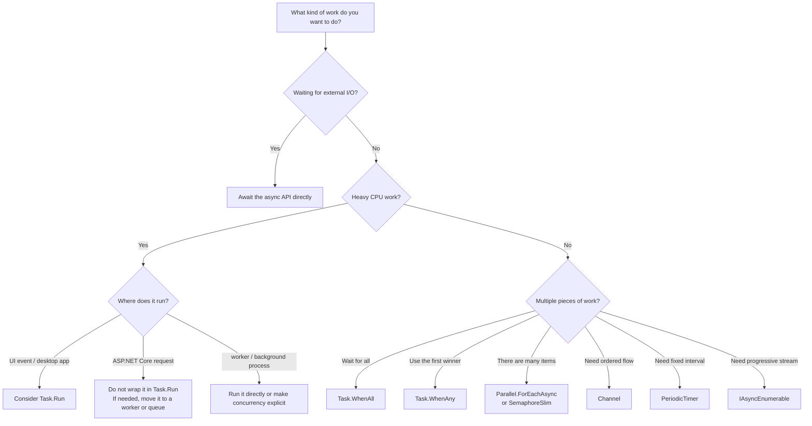
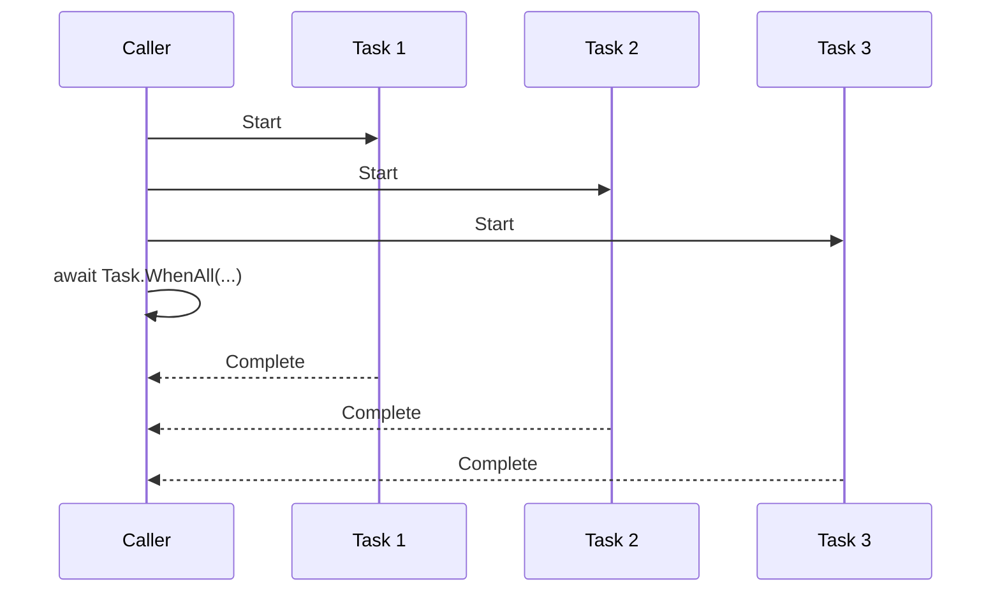
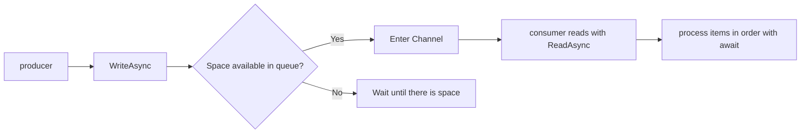
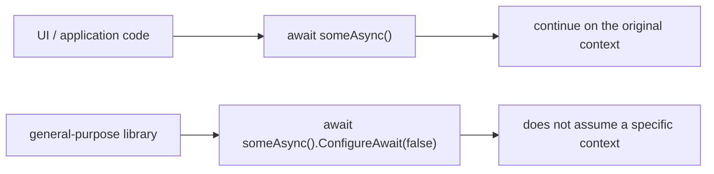

C# `async` / `await` is something we use all the time, but in real projects the confusing part is usually not the syntax itself.  
What makes people hesitate is **which style to choose in which situation**.

The questions that come up again and again are things like:

- when to use `Task.Run`
- where to put `ConfigureAwait(false)`
- whether fire-and-forget is ever acceptable

Common mistakes in practice tend to look like this:

- wrapping I/O-bound work in `Task.Run`
- awaiting independent work serially one item at a time
- adding fire-and-forget casually and then losing track of exceptions and shutdown timing
- applying `ConfigureAwait(false)` everywhere in the same way
- choosing `ValueTask` only because it sounds lighter

It is usually easier to organize these choices by **first identifying the kind of work you are dealing with** rather than memorizing isolated rules.

This article assumes mostly **general C# / .NET application development on .NET 6 and later** and organizes async / await decisions in a practical order.

Typical target scenarios include:

- desktop applications such as WinForms and WPF
- ASP.NET Core web apps and APIs
- workers and background services
- console applications
- reusable class libraries

## Contents

1. [Short version](#1-short-version)
2. [Terms used in this article](#2-terms-used-in-this-article)
   - [2.1. The first distinction to make](#21-the-first-distinction-to-make)
   - [2.2. Other terms that appear frequently](#22-other-terms-that-appear-frequently)
3. [The first decision table](#3-the-first-decision-table)
   - [3.1. Overall picture](#31-overall-picture)
   - [3.2. If it is I/O-bound, await the async API directly](#32-if-it-is-io-bound-await-the-async-api-directly)
   - [3.3. If CPU load is heavy, decide carefully where `Task.Run` belongs](#33-if-cpu-load-is-heavy-decide-carefully-where-taskrun-belongs)
   - [3.4. If multiple operations are independent, use `Task.WhenAll`](#34-if-multiple-operations-are-independent-use-taskwhenall)
   - [3.5. If you want the first one that finishes, use `Task.WhenAny`](#35-if-you-want-the-first-one-that-finishes-use-taskwhenany)
   - [3.6. If there are many items and you want a concurrency limit, use `Parallel.ForEachAsync` or `SemaphoreSlim`](#36-if-there-are-many-items-and-you-want-a-concurrency-limit-use-parallelforeachasync-or-semaphoreslim)
   - [3.7. If you want an ordered flow, use `Channel<T>`](#37-if-you-want-an-ordered-flow-use-channelt)
   - [3.8. If you want fixed-interval processing, use `PeriodicTimer`](#38-if-you-want-fixed-interval-processing-use-periodictimer)
   - [3.9. If data arrives progressively, use `IAsyncEnumerable<T>`](#39-if-data-arrives-progressively-use-iasyncenumerablet)
   - [3.10. If you want asynchronous disposal, use `await using`](#310-if-you-want-asynchronous-disposal-use-await-using)
   - [3.11. If you need mutual exclusion across await points, use `SemaphoreSlim`](#311-if-you-need-mutual-exclusion-across-await-points-use-semaphoreslim)
   - [3.12. Write `await` differently in UI code, app code, and library code](#312-write-await-differently-in-ui-code-app-code-and-library-code)
4. [Basic rules for writing async code](#4-basic-rules-for-writing-async-code)
   - [4.1. Default to `Task` / `Task<T>` for return types](#41-default-to-task--taskt-for-return-types)
   - [4.2. Use `async void` only for event handlers](#42-use-async-void-only-for-event-handlers)
   - [4.3. Accept `CancellationToken` and pass it downstream](#43-accept-cancellationtoken-and-pass-it-downstream)
   - [4.4. Keep an async API async all the way through](#44-keep-an-async-api-async-all-the-way-through)
   - [4.5. Materialize task sequences with `ToArray` / `ToList`](#45-materialize-task-sequences-with-toarray--tolist)
5. [Common anti-patterns](#5-common-anti-patterns)
6. [Checklist for code review](#6-checklist-for-code-review)
7. [Rough rule-of-thumb guide](#7-rough-rule-of-thumb-guide)
8. [Summary](#8-summary)
9. [References](#9-references)

* * *

## 1. Short version

- `async` / `await` is **a way to avoid blocking a thread while waiting**, not a mechanism that automatically makes everything faster or moves everything to another thread
- First separate whether the work is **I/O-bound** or **CPU-bound**
- If it is I/O-bound, the basic choice is to **await the async API directly**
- If it is CPU-bound, think about **where that computation should run**. In UI code, `Task.Run` can help, but in ASP.NET Core request handling, wrapping work in `Task.Run` and immediately awaiting it is usually not the right move
- For multiple independent operations, consider **`Task.WhenAll` before serial awaits**
- If there are many items, do not throw everything into `Task.WhenAll`; define a **concurrency limit**
- Fire-and-forget looks easy but is hard to manage. If you truly want to separate the work from the caller's lifetime, it is usually more stable to send it to a managed place such as a `Channel` or a hosted service
- Default to **`Task` / `Task<T>`** for return types. Choose `ValueTask` only after measurement shows a real need
- `ConfigureAwait(false)` is powerful in **general-purpose library code**, but in UI and application-side code, normal `await` is usually the right default
- Use **`async void` only for event handlers**

In other words, the most important thing around `async` / `await` is not to default to:

**"just use `Task.Run`," "just use fire-and-forget," or "just use `ValueTask`."**

Things become much easier to reason about once you ask:

1. what is this work actually waiting for?
2. who owns the lifetime of this work?
3. where is concurrency limited?

## 2. Terms used in this article

### 2.1. The first distinction to make

Separating these two ideas first removes a lot of confusion:

| Term | Meaning in this article |
| --- | --- |
| I/O-bound | work that mainly waits for **external completion**, such as HTTP, a database, a file, or a socket |
| CPU-bound | work that mainly spends time on **the computation itself**, such as compression, image processing, hashing, or heavy transformations |

`async` / `await` is especially effective for I/O waits because the thread can be returned to other work while the operation is pending.

CPU-bound work is different. It is not about waiting; it is about where the computation should run and how much concurrency you want.

### 2.2. Other terms that appear frequently

| Term | Meaning in this article |
| --- | --- |
| blocking | occupying a thread while waiting for completion |
| fire-and-forget | starting work without waiting for the caller to observe completion |
| `SynchronizationContext` | a mechanism used by UI models and similar environments to return to the original execution context |
| backpressure | preventing overload by forcing writers to wait when the consumer side cannot keep up |

One especially important point is that **asynchrony and parallelism are different things**.

- asynchrony: how you wait
- parallelism: how many things you run at the same time

If those two ideas get mixed together, people start reaching for `Task.Run` everywhere. That is often the first wrong turn.

## 3. The first decision table

### 3.1. Overall picture

Starting with this table usually gives you the right direction quickly:

| Situation | First tool to consider | What to watch |
| --- | --- | --- |
| HTTP / DB / file waits | await the async API directly | do not wrap it in `Task.Run` |
| heavy computation that must not freeze the UI | `Task.Run` | move CPU work off the UI thread |
| ASP.NET Core request handling | plain `await` | do not immediately await `Task.Run` |
| a few independent async operations | `Task.WhenAll` | start them all first, then wait together |
| only the first completed result matters | `Task.WhenAny` | think about cancellation and exception observation for the remaining tasks |
| many items with a limit | `Parallel.ForEachAsync` / `SemaphoreSlim` | make concurrency explicit |
| ordered background processing | `Channel<T>` | think about bounded queues and backpressure |
| periodic async processing | `PeriodicTimer` | remember one timer, one consumer |
| progressively arriving results | `IAsyncEnumerable<T>` / `await foreach` | process without waiting for all results |
| asynchronous cleanup | `await using` | use `IAsyncDisposable` |
| mutual exclusion across `await` points | `SemaphoreSlim.WaitAsync` | always release in `try/finally` |
| general-purpose library code | consider `ConfigureAwait(false)` | avoid depending on UI / app-specific context |



### 3.2. If it is I/O-bound, await the async API directly

This is the most basic pattern.

For HTTP, databases, file reads, and similar operations, first check whether there is already an async API.  
If there is, the default choice is to await it directly.

```csharp
public async Task<string> LoadTextAsync(string path, CancellationToken cancellationToken)
{
    return await File.ReadAllTextAsync(path, cancellationToken);
}
```

What you usually want to avoid is wrapping already-async I/O inside `Task.Run`.

```csharp
// Usually a poor choice
public async Task<string> LoadTextAsync(string path, CancellationToken cancellationToken)
{
    return await Task.Run(() => File.ReadAllTextAsync(path, cancellationToken), cancellationToken);
}
```

That mostly just bounces I/O onto another thread and makes the structure harder to reason about without much benefit.

### 3.3. If CPU load is heavy, decide carefully where `Task.Run` belongs

`Task.Run` is useful when you want to **move CPU work away from the current thread**.

```csharp
public Task<byte[]> HashManyTimesAsync(byte[] data, int repeat, CancellationToken cancellationToken)
{
    return Task.Run(() =>
    {
        cancellationToken.ThrowIfCancellationRequested();

        using var sha256 = System.Security.Cryptography.SHA256.Create();
        byte[] current = data;

        for (int i = 0; i < repeat; i++)
        {
            cancellationToken.ThrowIfCancellationRequested();
            current = sha256.ComputeHash(current);
        }

        return current;
    }, cancellationToken);
}
```

But the important question is **where it is being called**.

- WinForms / WPF UI code: there are real cases where `Task.Run` helps
- ASP.NET Core request handling: immediately awaiting `Task.Run` is usually a poor default
- worker / background processing: either run it where it is or explicitly design the concurrency level

ASP.NET Core request handling already runs on the ThreadPool.  
Adding one more `Task.Run` layer and awaiting it immediately often just adds scheduling overhead.

So in ASP.NET Core, this rule of thumb is easier to work with:

- plain `await` for I/O waits
- run short CPU work directly
- if the work is long or should outlive the request, move it to a queue or hosted service

Also note that if only a synchronous API exists and the caller is a UI app, using `Task.Run` for UI responsiveness can still make sense.  
But that is not asynchronous I/O. It is simply using another thread to avoid freezing the UI. On the server side, that escape hatch usually does not scale well.

### 3.4. If multiple operations are independent, use `Task.WhenAll`

It is very common to see code like this:

```csharp
// Independent work, but awaited serially
string a = await _httpClient.GetStringAsync(urlA, cancellationToken);
string b = await _httpClient.GetStringAsync(urlB, cancellationToken);
string c = await _httpClient.GetStringAsync(urlC, cancellationToken);
```

If those operations are truly independent, it is more natural to **start them all first and then wait once**.

```csharp
public async Task<string[]> DownloadAllAsync(IEnumerable<string> urls, CancellationToken cancellationToken)
{
    Task<string>[] tasks = urls
        .Select(url => _httpClient.GetStringAsync(url, cancellationToken))
        .ToArray();

    return await Task.WhenAll(tasks);
}
```

The important detail here is `ToArray()`.  
Because LINQ uses deferred execution, simply calling `Select` does not necessarily mean the tasks have started yet.  
`ToArray()` or `ToList()` materializes the sequence so they all begin at that point.



This pattern fits when:

- the item count is small or moderate
- you want to wait for all results together
- running all of them at once is acceptable

If the item count is large, it is usually safer to add a concurrency limit as in the next section.

### 3.5. If you want the first one that finishes, use `Task.WhenAny`

If you want to use whichever mirror or endpoint responds first, `Task.WhenAny` is easy to read.

```csharp
public async Task<byte[]> DownloadFromFirstMirrorAsync(
    IReadOnlyList<string> urls,
    CancellationToken cancellationToken)
{
    using var cts = CancellationTokenSource.CreateLinkedTokenSource(cancellationToken);

    Task<byte[]>[] tasks = urls
        .Select(url => _httpClient.GetByteArrayAsync(url, cts.Token))
        .ToArray();

    Task<byte[]> winner = await Task.WhenAny(tasks);
    cts.Cancel();

    try
    {
        return await winner;
    }
    finally
    {
        try
        {
            await Task.WhenAll(tasks);
        }
        catch
        {
            // Observe cancellation or failure from the non-winning tasks
        }
    }
}
```

The key thing to remember is that `WhenAny` **returns one winner, and nothing more**.  
The remaining tasks keep running unless you decide what to do with them.

So you need to decide:

- should the remaining work be canceled?
- should exceptions still be observed?

`Task.WhenAny` is useful, but it adds more design obligations than `WhenAll`.  
It is best used only when you truly care about the first completed result.

### 3.6. If there are many items and you want a concurrency limit, use `Parallel.ForEachAsync` or `SemaphoreSlim`

`Task.WhenAll` starts all created tasks at once.  
So if there are many items, HTTP connections, DB connections, memory usage, or load on external services can all spike at once.

In those situations, it is more stable to decide **how many things may run at the same time**.

`Parallel.ForEachAsync` makes that intent easy to read.

```csharp
public async Task DownloadAndSaveAsync(IEnumerable<string> urls, CancellationToken cancellationToken)
{
    var options = new ParallelOptions
    {
        MaxDegreeOfParallelism = 8,
        CancellationToken = cancellationToken
    };

    await Parallel.ForEachAsync(
        urls.Select((url, index) => (url, index)),
        options,
        async (item, token) =>
        {
            string html = await _httpClient.GetStringAsync(item.url, token);
            string path = Path.Combine("cache", $"{item.index}.html");
            await File.WriteAllTextAsync(path, html, token);
        });
}
```

If you need more custom control, `SemaphoreSlim` is also practical.

### 3.7. If you want an ordered flow, use `Channel<T>`

Sometimes you want to separate work from the caller even though it does not need to finish immediately: email delivery, log shipping, webhook follow-up processing, file conversion, and so on.

If you handle that with raw fire-and-forget `Task.Run`, all of these become vague:

- where are exceptions observed?
- do we wait during shutdown?
- what happens when input volume increases?

This type of work is usually easier to manage when you **put it into a queue and let a dedicated consumer process it in order**.



```csharp
public sealed class BackgroundTaskQueue
{
    private readonly Channel<Func<CancellationToken, ValueTask>> _queue =
        Channel.CreateBounded<Func<CancellationToken, ValueTask>>(
            new BoundedChannelOptions(100)
            {
                FullMode = BoundedChannelFullMode.Wait
            });

    public ValueTask EnqueueAsync(
        Func<CancellationToken, ValueTask> workItem,
        CancellationToken cancellationToken = default)
    {
        ArgumentNullException.ThrowIfNull(workItem);
        return _queue.Writer.WriteAsync(workItem, cancellationToken);
    }

    public ValueTask<Func<CancellationToken, ValueTask>> DequeueAsync(CancellationToken cancellationToken)
        => _queue.Reader.ReadAsync(cancellationToken);
}
```

### 3.8. If you want fixed-interval processing, use `PeriodicTimer`

For fixed-interval asynchronous work, `PeriodicTimer` is very readable.

```csharp
public async Task RunPeriodicAsync(CancellationToken cancellationToken)
{
    using var timer = new PeriodicTimer(TimeSpan.FromSeconds(10));

    while (await timer.WaitForNextTickAsync(cancellationToken))
    {
        await RefreshCacheAsync(cancellationToken);
    }
}
```

One important caution is that `PeriodicTimer` assumes **you are not issuing multiple concurrent `WaitForNextTickAsync` calls on the same timer**.

### 3.9. If data arrives progressively, use `IAsyncEnumerable<T>`

Sometimes it is better to process data **as it arrives** than to collect everything into a `List<T>` and return all at once.

```csharp
public async Task ProcessUsersAsync(CancellationToken cancellationToken)
{
    await foreach (User user in _userRepository.StreamUsersAsync(cancellationToken))
    {
        await ProcessUserAsync(user, cancellationToken);
    }
}
```

This fits when you want to process items one by one, avoid buffering everything in memory, and avoid waiting for all results before starting.

### 3.10. If you want asynchronous disposal, use `await using`

If a type needs asynchronous work during disposal, use `await using`.

```csharp
public async Task WriteFileAsync(string path, byte[] data, CancellationToken cancellationToken)
{
    await using var stream = new FileStream(
        path,
        FileMode.Create,
        FileAccess.Write,
        FileShare.None,
        bufferSize: 81920,
        useAsync: true);

    await stream.WriteAsync(data, cancellationToken);
}
```

### 3.11. If you need mutual exclusion across await points, use `SemaphoreSlim`

```csharp
public sealed class CacheRefresher
{
    private readonly SemaphoreSlim _gate = new(1, 1);

    public async Task RefreshAsync(CancellationToken cancellationToken)
    {
        await _gate.WaitAsync(cancellationToken);
        try
        {
            await RefreshCoreAsync(cancellationToken);
        }
        finally
        {
            _gate.Release();
        }
    }

    private static Task RefreshCoreAsync(CancellationToken cancellationToken)
        => Task.Delay(TimeSpan.FromSeconds(1), cancellationToken);
}
```

Enter with `WaitAsync`, and always `Release` in `finally`.

### 3.12. Write `await` differently in UI code, app code, and library code

`ConfigureAwait(false)` is not something to add everywhere by default.



- **UI / application code**: normal `await` is usually the right default
- **ASP.NET Core application code**: normal `await` is usually enough
- **general-purpose library code**: if it does not depend on a UI or app model, `ConfigureAwait(false)` is often a strong option

## 4. Basic rules for writing async code

### 4.1. Default to `Task` / `Task<T>` for return types

| Return type | Practical default meaning |
| --- | --- |
| `Task` | the standard choice for async methods with no result |
| `Task<T>` | the standard choice for async methods that return a value |
| `ValueTask` / `ValueTask<T>` | choose only after measurement shows a real need |

`ValueTask` is not automatically better than `Task`.  
It is a struct, so it has copy cost and usage constraints, and it is basically designed to be awaited once.

```csharp
public Task SaveAsync(CancellationToken cancellationToken)
{
    return Task.CompletedTask;
}

public Task<int> CountAsync(CancellationToken cancellationToken)
{
    return Task.FromResult(_count);
}
```

If there is no real asynchronous work inside, returning `Task.CompletedTask` or `Task.FromResult(...)` is usually cleaner than adding `async` for no reason.

### 4.2. Use `async void` only for event handlers

As a rule, avoid `async void` outside event handlers.

- the caller cannot await it
- completion cannot be tracked
- exception handling becomes harder
- testing becomes harder

```csharp
private async void SaveButton_Click(object? sender, EventArgs e)
{
    try
    {
        await SaveAsync(_saveCancellation.Token);
        _statusLabel.Text = "Saved.";
    }
    catch (OperationCanceledException)
    {
        _statusLabel.Text = "Canceled.";
    }
    catch (Exception ex)
    {
        MessageBox.Show(this, ex.Message, "Save Error");
    }
}
```

### 4.3. Accept `CancellationToken` and pass it downstream

```csharp
public async Task<string> DownloadTextAsync(string url, CancellationToken cancellationToken)
{
    using HttpResponseMessage response = await _httpClient.GetAsync(url, cancellationToken);
    response.EnsureSuccessStatusCode();
    return await response.Content.ReadAsStringAsync(cancellationToken);
}
```

A common mistake is accepting a token at the top level but not passing it downstream.

- if you only want to limit **how long you wait**, use `WaitAsync`
- if you want to stop **the underlying operation itself**, use `CancellationTokenSource.CancelAfter` and propagate the token

### 4.4. Keep an async API async all the way through

| Tempting style | Better replacement |
| --- | --- |
| `Task.Result` / `Task.Wait()` | `await` |
| `Task.WaitAll()` | `await Task.WhenAll(...)` |
| `Task.WaitAny()` | `await Task.WhenAny(...)` |
| `Thread.Sleep(...)` | `await Task.Delay(...)` |

Especially in UI code and ASP.NET Core, mixing in synchronous waiting makes the resulting stalls much harder to reason about.

### 4.5. Materialize task sequences with `ToArray` / `ToList`

```csharp
Task<User>[] tasks = userIds
    .Select(id => _userRepository.GetAsync(id, cancellationToken))
    .ToArray();

User[] users = await Task.WhenAll(tasks);
```

Because LINQ uses deferred execution, materializing with `ToArray()` or `ToList()` is usually the safer choice.

## 5. Common anti-patterns

| Anti-pattern | Why it hurts | First replacement |
| --- | --- | --- |
| `Task.Run(async () => await IoAsync())` | needlessly bounces I/O onto another thread | `await IoAsync()` |
| `Task.Result` / `Wait()` | blocks threads and causes stalls easily | `await` |
| mixing `Thread.Sleep()` into async flow | occupies a thread even while waiting | `Task.Delay()` |
| using `async void` for ordinary methods | cannot be awaited, hard to manage exceptions | `Task` / `Task<T>` |
| serial awaits where `Task.WhenAll` fits | unnecessary slowness | start all tasks first, then `WhenAll` |
| throwing huge item counts into `WhenAll` | load spikes | `Parallel.ForEachAsync` / `SemaphoreSlim` |
| trying to cross `await` with `lock` | wrong tool for the job | `SemaphoreSlim.WaitAsync` |
| raw fire-and-forget with `Task.Run` | vague exception, shutdown, and limit handling | `Channel<T>` / `BackgroundService` |
| mechanically adding `ConfigureAwait(false)` to UI code | UI updates after `await` become fragile | plain `await` |
| defaulting to `ValueTask` everywhere | often more complexity than benefit | start with `Task` |

The three especially common ones are:

1. I/O wrapped in `Task.Run`
2. serial awaits for work that is really independent
3. fire-and-forget with no lifetime owner

## 6. Checklist for code review

- can the author explain in words whether the work is **I/O-bound** or **CPU-bound**?
- are `Task.Result` / `Task.Wait()` / `Thread.Sleep()` still present?
- is I/O being wrapped in `Task.Run`?
- are independent operations being awaited serially for no reason?
- on the other hand, is a large item count being sent into unbounded `WhenAll`?
- if the method accepts `CancellationToken`, is it actually passed downstream?
- is `async void` used anywhere other than event handlers?
- if fire-and-forget exists, who owns exception handling, shutdown, and limits?
- if `SemaphoreSlim` is used, is `Release` inside `finally`?
- if `ValueTask` is used, is there a measured reason?
- does the use or non-use of `ConfigureAwait(false)` match the kind of code?

## 7. Rough rule-of-thumb guide

| What you want to do | First choice |
| --- | --- |
| one HTTP / DB / file I/O operation | await the async API directly |
| heavy computation that must not freeze the UI | `Task.Run` |
| a few independent async operations | `Task.WhenAll` |
| only the first result matters | `Task.WhenAny` |
| many items with bounded concurrency | `Parallel.ForEachAsync` / `SemaphoreSlim` |
| ordered background processing | `Channel<T>` |
| fixed-interval processing | `PeriodicTimer` |
| progressive stream processing | `IAsyncEnumerable<T>` / `await foreach` |
| mutual exclusion across `await` points | `SemaphoreSlim` |
| general-purpose library code | consider `ConfigureAwait(false)` |
| unsure about return type | start with `Task` / `Task<T>` |

## 8. Summary

Best practices for `async` / `await` are less about memorizing many tiny tricks and more about **choosing shapes that match the kind of work**.

1. separate I/O waits from CPU work
2. if it is I/O, await the async API directly
3. if it is CPU work, decide where it should run
4. if multiple operations exist, choose between `WhenAll`, `WhenAny`, and bounded concurrency
5. if the work should outlive the caller, use a managed queue instead of raw fire-and-forget
6. align return types, cancellation, exceptions, mutual exclusion, and context handling

By contrast, things become much clearer if you separate:

- I/O as I/O
- CPU as CPU
- background work as background work with an owned lifetime

## 9. References

- [Asynchronous programming scenarios - C#](https://learn.microsoft.com/en-us/dotnet/csharp/asynchronous-programming/async-scenarios)
- [Asynchronous programming with async and await](https://learn.microsoft.com/en-us/dotnet/csharp/asynchronous-programming/)
- [Task-based Asynchronous Pattern (TAP) in .NET](https://learn.microsoft.com/en-us/dotnet/standard/asynchronous-programming-patterns/task-based-asynchronous-pattern-tap)
- [ConfigureAwait FAQ](https://devblogs.microsoft.com/dotnet/configureawait-faq/)
- [Parallel.ForEachAsync Method](https://learn.microsoft.com/en-us/dotnet/api/system.threading.tasks.parallel.foreachasync)
- [Task.WaitAsync Method](https://learn.microsoft.com/en-us/dotnet/api/system.threading.tasks.task.waitasync)
- [System.Threading.Channels library](https://learn.microsoft.com/en-us/dotnet/core/extensions/channels)
- [Create a Queue Service](https://learn.microsoft.com/en-us/dotnet/core/extensions/queue-service)
- [Background tasks with hosted services in ASP.NET Core](https://learn.microsoft.com/en-us/aspnet/core/fundamentals/host/hosted-services)
- [Generate and consume async streams](https://learn.microsoft.com/en-us/dotnet/csharp/asynchronous-programming/generate-consume-asynchronous-stream)
- [Implement a DisposeAsync method](https://learn.microsoft.com/en-us/dotnet/standard/garbage-collection/implementing-disposeasync)
- [ValueTask Struct](https://learn.microsoft.com/en-us/dotnet/api/system.threading.tasks.valuetask)
- [CA2012: Use ValueTasks correctly](https://learn.microsoft.com/en-us/dotnet/fundamentals/code-analysis/quality-rules/ca2012)
