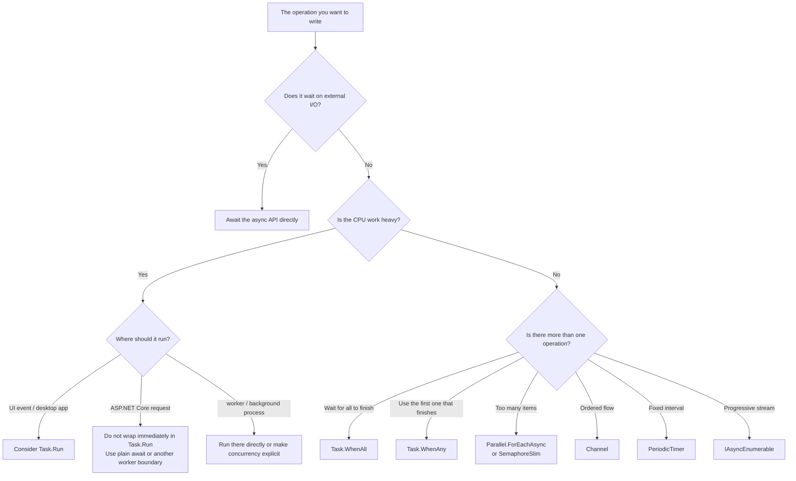

C# `async` / `await` is something we use all the time, but in real projects the confusing part is usually not the syntax itself.  
What makes people hesitate is **which style to choose in which situation**.

The questions that come up again and again are things like:

- when to use `Task.Run`
- where to put `ConfigureAwait(false)`
- whether fire-and-forget is ever acceptable

Common mistakes in practice tend to look like this:

- wrapping I/O-bound work in `Task.Run`
- awaiting independent work serially one item at a time
- adding fire-and-forget casually and then losing track of exceptions and shutdown timing
- applying `ConfigureAwait(false)` everywhere in the same way
- choosing `ValueTask` only because it sounds lighter

It is usually easier to organize these choices by **first identifying the kind of work you are dealing with** rather than memorizing isolated rules.

This article assumes mostly **general C# / .NET application development on .NET 6 and later** and organizes async / await decisions in a practical order.

Typical target scenarios include:

- desktop applications such as WinForms and WPF
- ASP.NET Core web apps and APIs
- workers and background services
- console applications
- reusable class libraries

## Contents

1. [Short version](#1-short-version)
2. [Terms used in this article](#2-terms-used-in-this-article)
   - [2.1. The first distinction to make](#21-the-first-distinction-to-make)
   - [2.2. Other terms that appear frequently](#22-other-terms-that-appear-frequently)
3. [The first decision table](#3-the-first-decision-table)
   - [3.1. Overall picture](#31-overall-picture)
   - [3.2. If it is I/O-bound, await the async API directly](#32-if-it-is-io-bound-await-the-async-api-directly)
   - [3.3. If CPU load is heavy, decide carefully where Task.Run belongs](#33-if-cpu-load-is-heavy-decide-carefully-where-taskrun-belongs)
   - [3.4. If multiple operations are independent, use Task.WhenAll](#34-if-multiple-operations-are-independent-use-taskwhenall)
   - [3.5. If you want the first one that finishes, use Task.WhenAny](#35-if-you-want-the-first-one-that-finishes-use-taskwhenany)
   - [3.6. If there are many items and you want a concurrency limit, use Parallel.ForEachAsync or SemaphoreSlim](#36-if-there-are-many-items-and-you-want-a-concurrency-limit-use-parallelforeachasync-or-semaphoreslim)
   - [3.7. If you want an ordered flow, use Channel&lt;T&gt;](#37-if-you-want-an-ordered-flow-use-channelt)
   - [3.8. If you want fixed-interval processing, use PeriodicTimer](#38-if-you-want-fixed-interval-processing-use-periodictimer)
   - [3.9. If data arrives progressively, use IAsyncEnumerable&lt;T&gt;](#39-if-data-arrives-progressively-use-iasyncenumerablet)
   - [3.10. If you want asynchronous disposal, use await using](#310-if-you-want-asynchronous-disposal-use-await-using)
   - [3.11. If you need mutual exclusion across await points, use SemaphoreSlim](#311-if-you-need-mutual-exclusion-across-await-points-use-semaphoreslim)
   - [3.12. Write await differently in UI code, app code, and library code](#312-write-await-differently-in-ui-code-app-code-and-library-code)
4. [Basic rules for writing async code](#4-basic-rules-for-writing-async-code)
   - [4.1. Default to Task / Task&lt;T&gt; for return types](#41-default-to-task--taskt-for-return-types)
   - [4.2. Use async void only for event handlers](#42-use-async-void-only-for-event-handlers)
   - [4.3. Accept CancellationToken and pass it downstream](#43-accept-cancellationtoken-and-pass-it-downstream)
   - [4.4. Keep an async API async all the way through](#44-keep-an-async-api-async-all-the-way-through)
   - [4.5. Materialize task sequences with ToArray / ToList](#45-materialize-task-sequences-with-toarray--tolist)
5. [Common anti-patterns](#5-common-anti-patterns)
6. [Checklist for code review](#6-checklist-for-code-review)
7. [Rough rule-of-thumb guide](#7-rough-rule-of-thumb-guide)
8. [Summary](#8-summary)
9. [References](#9-references)

* * *

## 1. Short version

- `async` / `await` is a way to **avoid blocking a thread while waiting**. It is not a mechanism that automatically makes everything faster or silently moves work to another thread.
- The first distinction to make is whether the work is **I/O-bound** or **CPU-bound**
- If it is I/O-bound, the default is to **await the async API directly**
- If it is CPU-bound, decide **where that computation should run**. `Task.Run` can be useful in UI code, but in ASP.NET Core request handling, wrapping work in `Task.Run` and immediately awaiting it is usually the wrong default
- If you have multiple independent operations, consider **`Task.WhenAll`** before writing a serial chain of awaits
- If there are many operations, do not launch them all without limit. Decide an explicit **concurrency cap**
- Fire-and-forget looks simple, but its lifetime is hard to manage. If the work truly needs to outlive the caller, it is often better to push it into a managed place such as `Channel` or `HostedService`
- Default to **`Task` / `Task<T>`** for return values. Choose `ValueTask` only after measurement shows a real need
- `ConfigureAwait(false)` is useful in **general-purpose library code**, but in UI and application-side code, a normal `await` is often the right starting point
- Do not use `async void` outside **event handlers**

The most important thing is to avoid the reflexes of:

- "just use `Task.Run`"
- "just fire and forget"
- "just use `ValueTask`"

Instead, start by asking:

1. what is the operation actually waiting for?
2. who owns the lifetime of that operation?
3. where is concurrency controlled?

That already removes a lot of confusion.

## 2. Terms used in this article

### 2.1. The first distinction to make

Start by separating these two:

| Term | Meaning here |
| --- | --- |
| I/O-bound | work centered on waiting for an external thing to complete, such as HTTP, a database, a file, or a socket |
| CPU-bound | work centered on the CPU calculation itself, such as compression, image processing, hashing, or heavy conversion |

`async` / `await` is especially effective for I/O waits because the thread can be returned to other work while the external operation is still in progress.

CPU-bound work is different. The CPU is actually doing the work, so the design questions are mainly **which thread should run it** and **how much parallelism is acceptable**.

### 2.2. Other terms that appear frequently

| Term | Meaning here |
| --- | --- |
| blocking | continuing to occupy the thread while waiting for completion |
| fire-and-forget | starting work without waiting for it to complete |
| `SynchronizationContext` | the mechanism that lets code resume in the original environment, such as a UI context |
| backpressure | intentionally slowing down the producer so the system does not accept more work than it can handle |

One especially important point is that **asynchrony and parallelism are different things**.

- asynchrony is about how you wait
- parallelism is about how much work proceeds at the same time

If you mix these together mentally, `Task.Run` starts to look useful everywhere, and that is where many mistakes begin.

## 3. The first decision table

### 3.1. Overall picture

Start with this table. It covers most day-to-day situations.

| Situation | First thing to use | What to check |
| --- | --- | --- |
| waiting on HTTP / DB / file work | await the async API directly | do not wrap it in `Task.Run` |
| heavy CPU work without freezing a UI | `Task.Run` | move the computation off the UI thread |
| ASP.NET Core request handling | plain `await` | do not immediately wrap in `Task.Run` |
| a few independent async operations | `Task.WhenAll` | start them first, then await together |
| you need the first one that completes | `Task.WhenAny` | think about cancellation and exception cleanup for the rest |
| many operations with a concurrency limit | `Parallel.ForEachAsync` / `SemaphoreSlim` | make the limit explicit |
| ordered background flow | `Channel<T>` | design for bounded queues and backpressure |
| periodic async work | `PeriodicTimer` | keep one consumer per timer |
| progressive async results | `IAsyncEnumerable<T>` / `await foreach` | process before the whole set is complete |
| asynchronous disposal | `await using` | use `IAsyncDisposable` |
| mutual exclusion across await points | `SemaphoreSlim.WaitAsync` | always release in `finally` |
| general library code | consider `ConfigureAwait(false)` | avoid dependence on a UI or app-specific context |



### 3.2. If it is I/O-bound, await the async API directly

This is the basic pattern.

For HTTP, databases, files, and similar work, first look for an async API and then **await it directly**.

```csharp
public async Task<string> LoadTextAsync(string path, CancellationToken cancellationToken)
{
    return await File.ReadAllTextAsync(path, cancellationToken);
}
```

What you usually want to avoid here is wrapping already-async I/O in `Task.Run`.

```csharp
// Bad example
public async Task<string> LoadTextAsync(string path, CancellationToken cancellationToken)
{
    return await Task.Run(() => File.ReadAllTextAsync(path, cancellationToken), cancellationToken);
}
```

That only pushes the wait through another layer and makes the code harder to reason about without giving you a real benefit.

The basic rule is:

- for I/O-bound work, `Task.Run` is usually unnecessary
- first look for the async API
- if you receive a token, pass it downstream

### 3.3. If CPU load is heavy, decide carefully where Task.Run belongs

`Task.Run` is useful when you want to **move CPU-bound computation off the current thread**.

For example, if a UI event handler performs heavy CPU work directly, the UI freezes. In that kind of situation, `Task.Run` is a natural fit.

```csharp
public Task<byte[]> HashManyTimesAsync(byte[] data, int repeat, CancellationToken cancellationToken)
{
    return Task.Run(() =>
    {
        cancellationToken.ThrowIfCancellationRequested();

        using var sha256 = System.Security.Cryptography.SHA256.Create();
        byte[] current = data;

        for (int i = 0; i < repeat; i++)
        {
            cancellationToken.ThrowIfCancellationRequested();
            current = sha256.ComputeHash(current);
        }

        return current;
    }, cancellationToken);
}
```

What matters is **where** the CPU work belongs.

- In WinForms / WPF UI code, `Task.Run` can be very useful
- In ASP.NET Core request handling, immediately wrapping work in `Task.Run` and awaiting it is usually not the right default
- In worker or background code, it is often more important to design concurrency explicitly than to hide the problem behind `Task.Run`

### 3.4. If multiple operations are independent, use Task.WhenAll

If independent operations can proceed in parallel, waiting for them serially is often wasteful.

```csharp
public async Task<string[]> DownloadAllAsync(IEnumerable<string> urls, CancellationToken cancellationToken)
{
    Task<string>[] tasks = urls
        .Select(url => _httpClient.GetStringAsync(url, cancellationToken))
        .ToArray();

    return await Task.WhenAll(tasks);
}
```

The point is to **start them first**, then await the combined completion.

### 3.5. If you want the first one that finishes, use Task.WhenAny

Use `Task.WhenAny` when you want whichever result arrives first.  
But remember that the remaining tasks still exist. You need a strategy for:

- cancelling them if appropriate
- observing their exceptions
- not leaking unnecessary work

### 3.6. If there are many items and you want a concurrency limit, use Parallel.ForEachAsync or SemaphoreSlim

If the item count is large, launching everything at once with `Task.WhenAll` is often the wrong move.

What matters then is the **concurrency limit**.

- `Parallel.ForEachAsync` is convenient when you want bounded parallel processing
- `SemaphoreSlim` is useful when you want explicit control over throttling

### 3.7. If you want an ordered flow, use Channel<T>

If the core problem is not "do things in parallel" but "feed work through in order and under control," `Channel<T>` is often a better fit.

This is especially useful for:

- managed fire-and-forget alternatives
- queue-based background processing
- backpressure
- clear ownership of lifetime

### 3.8. If you want fixed-interval processing, use PeriodicTimer

If you want periodic async work, `PeriodicTimer` often gives the clearest code.

The main benefit is not timing precision.  
The benefit is that the flow reads naturally as:

- wait
- process
- wait again

### 3.9. If data arrives progressively, use IAsyncEnumerable<T>

If results arrive one by one over time, `IAsyncEnumerable<T>` lets you consume them progressively instead of waiting for the whole set to complete.

### 3.10. If you want asynchronous disposal, use await using

If cleanup itself is asynchronous, use `await using` with `IAsyncDisposable`.

### 3.11. If you need mutual exclusion across await points, use SemaphoreSlim

Ordinary `lock` cannot cross `await`.
When the critical region spans await points, `SemaphoreSlim.WaitAsync` is the typical tool.

### 3.12. Write await differently in UI code, app code, and library code

This is where many teams benefit from making a distinction:

- UI code often starts with plain `await`
- application code often still starts with plain `await`
- reusable general-purpose library code is where `ConfigureAwait(false)` becomes particularly attractive

## 4. Basic rules for writing async code

### 4.1. Default to Task / Task<T> for return types

Default to `Task` or `Task<T>`.
Use `ValueTask` only when measurement and call patterns justify the extra complexity.

### 4.2. Use async void only for event handlers

Outside event handlers, `async void` makes completion and exception handling much harder.

### 4.3. Accept CancellationToken and pass it downstream

If the caller can cancel, accept a token and pass it through rather than swallowing the cancellation boundary.

### 4.4. Keep an async API async all the way through

Do not build an async chain and then collapse it into `.Result` or `.Wait()` at the edge unless you absolutely have no alternative.

### 4.5. Materialize task sequences with ToArray / ToList

If LINQ builds a task sequence for `Task.WhenAll`, materialize it explicitly.  
That makes the execution boundary much easier to understand and review.

## 5. Common anti-patterns

- wrapping async I/O in `Task.Run`
- serially awaiting independent operations
- starting fire-and-forget work with no lifetime owner
- using `ConfigureAwait(false)` everywhere by reflex
- choosing `ValueTask` just because it sounds cheap

## 6. Checklist for code review

When reviewing async code, these questions are usually worth asking:

1. is this operation I/O-bound or CPU-bound?
2. who owns its lifetime?
3. is concurrency bounded explicitly?
4. are cancellation and exceptions visible?
5. is the current use of `Task.Run`, `WhenAll`, `Channel`, or `ConfigureAwait(false)` actually aligned with the problem?

## 7. Rough rule-of-thumb guide

- if it waits on external I/O, await the async API directly
- if it is heavy CPU work in UI code, consider `Task.Run`
- if several things are independent, consider `Task.WhenAll`
- if there are too many items, bound concurrency explicitly
- if the work needs managed lifetime, use a queue or service boundary

## 8. Summary

The most important part of async / await design is not memorizing a keyword rule.  
It is understanding:

1. what the operation is actually waiting for
2. who owns the lifetime
3. where concurrency is controlled

Once those are clear, `Task.Run`, `Task.WhenAll`, `ConfigureAwait(false)`, and the rest become much easier to choose correctly.

## 9. References

- [Task.Run](https://learn.microsoft.com/en-us/dotnet/api/system.threading.tasks.task.run)
- [Task.WhenAll](https://learn.microsoft.com/en-us/dotnet/api/system.threading.tasks.task.whenall)
- [Task.WhenAny](https://learn.microsoft.com/en-us/dotnet/api/system.threading.tasks.task.whenany)
- [Parallel.ForEachAsync](https://learn.microsoft.com/en-us/dotnet/api/system.threading.tasks.parallel.foreachasync)
- [Channel<T>](https://learn.microsoft.com/en-us/dotnet/core/extensions/channels)
