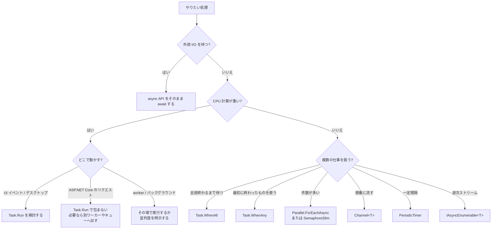
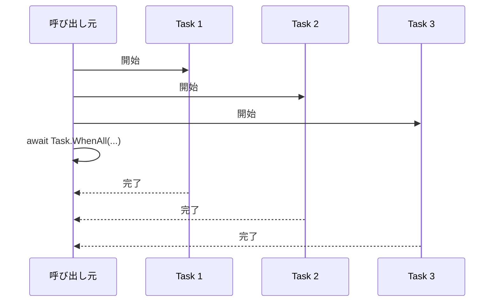
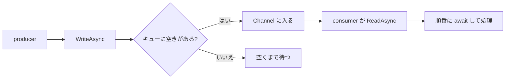
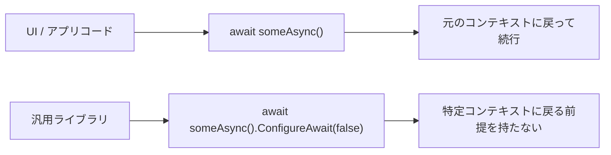

C# の `async` / `await` は日常的に使いますが、実務で迷いやすいのは構文そのものより、**どの場面でどの書き方を選ぶべきか** です。
特に検索で多いのは、`Task.Run` をいつ使うか、`ConfigureAwait(false)` をどこに付けるか、`fire-and-forget` を許してよいか、といった判断の悩みです。

- I/O 待ちなのに `Task.Run` で包んでしまう
- 独立した処理なのに 1 件ずつ直列に `await` してしまう
- `fire-and-forget` を安易に入れて例外や終了タイミングを見失う
- `ConfigureAwait(false)` をどこでも同じように付けてしまう
- `ValueTask` を「軽そうだから」という理由だけで選んでしまう

このあたりは、個別に覚えるより、**まず処理の種類を見分ける** ほうが整理しやすいです。

この記事では、主に **.NET 6 以降の一般的な C# / .NET アプリ開発** を前提に、
`async` / `await` まわりの書き方を **判断しやすい順番** で整理します。

対象は、たとえば次のようなものです。

- WinForms / WPF などのデスクトップアプリ
- ASP.NET Core の Web アプリ / API
- worker / バックグラウンドサービス
- コンソールアプリ
- 再利用可能なクラスライブラリ

## 目次

1. まず結論（ひとことで）
2. この記事で使う言葉
   - 2.1. まず区別したい言葉
   - 2.2. よく出てくる言葉
3. まず見る判断表
   - 3.1. 全体像
   - 3.2. I/O 待ちなら、async API をそのまま await する
   - 3.3. CPU 負荷が重いなら、Task.Run を使う場所を選ぶ
   - 3.4. 独立した複数処理なら、Task.WhenAll
   - 3.5. 最初に終わったものを使うなら、Task.WhenAny
   - 3.6. 件数が多く、並列数を制限したいなら、Parallel.ForEachAsync か SemaphoreSlim
   - 3.7. 順番に流したいなら、Channel&lt;T&gt;
   - 3.8. 一定間隔で回したいなら、PeriodicTimer
   - 3.9. 逐次的に届くデータなら、IAsyncEnumerable&lt;T&gt;
   - 3.10. 非同期で破棄したいなら、await using
   - 3.11. await をまたぐ排他なら、SemaphoreSlim
   - 3.12. UI / アプリコード / ライブラリで await の書き方を分ける
4. 書き方の基本ルール
   - 4.1. 返り値はまず Task / Task&lt;T&gt;
   - 4.2. async void はイベントハンドラだけ
   - 4.3. CancellationToken を受けて、下流へ渡す
   - 4.4. 非同期 API は最後まで非同期でつなぐ
   - 4.5. LINQ でタスクを作るときは ToArray / ToList で確定する
5. よくあるアンチパターン
6. レビュー時のチェックリスト
7. ざっくり使い分け
8. まとめ
9. 参考資料

* * *

## 1. まず結論（ひとことで）

- `async` / `await` は **待機中にスレッドを塞がないための書き方** であって、何でも自動で高速化したり、勝手に別スレッド化したりする仕組みではない
- まずはその処理が **I/O 待ち** なのか **CPU 計算** なのかを分ける
- I/O 待ちなら、**async API をそのまま await** するのが基本
- CPU 計算なら、**どこでその計算を動かすべきか** を考える。 UI なら `Task.Run` が役立つことがあるが、ASP.NET Core のリクエスト処理では `Task.Run` をすぐ await する書き方は基本的に避ける
- 独立した複数処理は、**直列に await するより `Task.WhenAll`** を先に検討する
- 件数が多いときは、`Task.WhenAll` で全部同時に投げるのではなく、**並列数の上限** を決める
- `fire-and-forget` は簡単に見えて管理が難しい。**本当に呼び出し元と寿命を切り離すなら、Channel や HostedService などの管理された場所へ出す** ほうが安定する
- 返り値は **まず `Task` / `Task<T>`**。 `ValueTask` は計測して必要性が見えてから選ぶ
- `ConfigureAwait(false)` は **汎用ライブラリコード** では有力だが、UI やアプリ側コードではまず普通の `await` でよい
- `async void` は **イベントハンドラ以外では使わない**

要するに、`async` / `await` まわりで一番大事なのは、  
**「とりあえず Task.Run」「とりあえず fire-and-forget」「とりあえず ValueTask」** にしないことです。

まずは、

1. その処理は何を待っているのか
2. 誰がその処理の寿命を持つのか
3. 同時実行数をどこで制御するのか

この 3 つを見ると、かなり整理しやすくなります。

## 2. この記事で使う言葉

### 2.1. まず区別したい言葉

最初にこの 2 つを分けると、かなり混乱しにくくなります。

| 言葉 | ここでの意味 |
| --- | --- |
| I/O-bound | HTTP、DB、ファイル、ソケットなど、**外部の完了待ち** が中心の処理 |
| CPU-bound | 圧縮、画像処理、ハッシュ計算、重い変換など、**CPU 計算そのもの** が中心の処理 |

`async` / `await` が特に効くのは、I/O 待ちです。  
待っている間にスレッドを他の仕事へ返せるからです。

一方で、CPU 計算は「待ち」ではなく「実際に計算している時間」です。  
ここでは、**どのスレッドで動かすか** や **並列数をどう決めるか** が主題になります。

### 2.2. よく出てくる言葉

| 言葉 | ここでの意味 |
| --- | --- |
| ブロッキング | 完了を待つ間、そのスレッドを占有し続けること |
| `fire-and-forget` | 呼び出し元が完了を待たない起動方法 |
| `SynchronizationContext` | UI などで「元の実行場所へ戻る」ための仕組み |
| backpressure | 流し込みが速すぎるときに、書き込み側を待たせて増えすぎを防ぐ仕組み |

特に大事なのは、**非同期と並列は別物** という点です。

- 非同期: 待ち方の話
- 並列: 同時に進める話

この 2 つが混ざると、`Task.Run` をどこでも使いたくなります。  
ここが最初の分かれ道です。

## 3. まず見る判断表

### 3.1. 全体像

まずはこの表から見ると、だいたいの方針が決まります。

| 状況 | まず使うもの | 見るポイント |
| --- | --- | --- |
| HTTP / DB / ファイルなどの待ち | async API をそのまま `await` | `Task.Run` で包まない |
| UI を止めたくない重い計算 | `Task.Run` | CPU 計算を UI スレッドから外す |
| ASP.NET Core のリクエスト処理 | plain `await` | `Task.Run` をすぐ await しない |
| 独立した少数の非同期処理 | `Task.WhenAll` | 先に全部開始してからまとめて待つ |
| 最初に終わったものだけ使う | `Task.WhenAny` | 残りのキャンセルや例外回収を考える |
| 件数が多く、上限を付けたい | `Parallel.ForEachAsync` / `SemaphoreSlim` | 並列数を明示する |
| 順番に流したいバックグラウンド処理 | `Channel<T>` | 境界付きキューと backpressure を考える |
| 一定間隔の非同期処理 | `PeriodicTimer` | 1 タイマー 1 コンシューマを守る |
| 結果を少しずつ処理したい | `IAsyncEnumerable<T>` / `await foreach` | 全件完了を待たずに進める |
| 非同期破棄が必要 | `await using` | `IAsyncDisposable` を使う |
| await をまたぐ排他 | `SemaphoreSlim.WaitAsync` | `try/finally` で必ず `Release` |
| 汎用ライブラリコード | `ConfigureAwait(false)` を検討 | UI / アプリ固有コンテキストに依存しない |



以下、各パターンを順番に見ていきます。

### 3.2. I/O 待ちなら、async API をそのまま await する

一番基本になるパターンです。

たとえば、HTTP、DB、ファイル読み書きなどは、まず **async 版 API があるか** を見ます。  
あるなら、それをそのまま `await` するのが基本です。

```csharp
public async Task<string> LoadTextAsync(string path, CancellationToken cancellationToken)
{
    return await File.ReadAllTextAsync(path, cancellationToken);
}
```

このとき避けたいのは、すでに async な I/O を `Task.Run` で包むことです。

```csharp
// 良くない例
public async Task<string> LoadTextAsync(string path, CancellationToken cancellationToken)
{
    return await Task.Run(() => File.ReadAllTextAsync(path, cancellationToken), cancellationToken);
}
```

これは、I/O 待ちを別スレッドへ投げ直しているだけで、整理しづらくなるわりに得がありません。

- I/O 待ちなら `Task.Run` はいらない
- まず async API を探す
- token を受けたら、そのまま下流へ渡す

ここはかなり王道です。

### 3.3. CPU 負荷が重いなら、Task.Run を使う場所を選ぶ

`Task.Run` が効くのは、**CPU 計算を今のスレッドから外したいとき** です。

たとえば UI イベントハンドラで重い計算をそのまま回すと、画面が止まります。  
こういうときは `Task.Run` が素直です。

```csharp
public Task<byte[]> HashManyTimesAsync(byte[] data, int repeat, CancellationToken cancellationToken)
{
    return Task.Run(() =>
    {
        cancellationToken.ThrowIfCancellationRequested();

        using var sha256 = System.Security.Cryptography.SHA256.Create();
        byte[] current = data;

        for (int i = 0; i < repeat; i++)
        {
            cancellationToken.ThrowIfCancellationRequested();
            current = sha256.ComputeHash(current);
        }

        return current;
    }, cancellationToken);
}
```

ただし、ここで大事なのは **どこで呼んでいるか** です。

- WinForms / WPF などの UI: `Task.Run` が有効な場面がある
- ASP.NET Core のリクエスト処理: `Task.Run` をすぐ `await` する書き方は基本的に避ける
- worker / バックグラウンド処理: その場で処理するか、並列度を設計する

ASP.NET Core のリクエスト処理は、もともと ThreadPool 上で動いています。  
そこに `Task.Run` を 1 枚挟んで直後に `await` しても、余計なスケジューリングが増えるだけになりやすいです。

なので、ASP.NET Core では次のように考えるほうが整理しやすいです。

- I/O 待ちなら plain `await`
- 短い CPU 処理なら、その場で実行
- 長い処理やリクエスト寿命から切り離したい処理なら、キューや HostedService に出す

なお、**sync 版しかない API** を UI から呼ぶ場合、UI 応答性のために `Task.Run` を使うことはあります。  
ただしこれは「非同期 I/O」ではなく、**スレッド 1 本を占有して回避している** だけです。  
ASP.NET Core のようなサーバー側では、この逃がし方は基本的に伸びにくいです。

### 3.4. 独立した複数処理なら、Task.WhenAll

独立した非同期処理が複数あるのに、こんなふうに 1 件ずつ待つコードはよく出てきます。

```csharp
// 独立しているのに直列になっている例
string a = await _httpClient.GetStringAsync(urlA, cancellationToken);
string b = await _httpClient.GetStringAsync(urlB, cancellationToken);
string c = await _httpClient.GetStringAsync(urlC, cancellationToken);
```

これらが互いに依存していないなら、**先に全部開始して、最後にまとめて待つ** ほうが素直です。

```csharp
public async Task<string[]> DownloadAllAsync(IEnumerable<string> urls, CancellationToken cancellationToken)
{
    Task<string>[] tasks = urls
        .Select(url => _httpClient.GetStringAsync(url, cancellationToken))
        .ToArray();

    return await Task.WhenAll(tasks);
}
```

ポイントは `ToArray()` です。  
LINQ は**遅延実行**なので、`Select` しただけでは、まだ列挙されていないことがあります。  
`ToArray()` や `ToList()` でいったん確定しておくと、全部のタスクがその時点で開始されます。



このパターンが向いているのは、

- 件数が少ない、または中程度
- 全件をまとめて待ちたい
- 上限なしで同時に走らせても問題ない

という場合です。

件数が多いなら、次の 3.6 のように **並列数の上限** を付けたほうが安全です。

### 3.5. 最初に終わったものを使うなら、Task.WhenAny

たとえば、複数のミラー先のうち最初に応答したものを使いたい、という場面では `Task.WhenAny` が分かりやすいです。

```csharp
public async Task<byte[]> DownloadFromFirstMirrorAsync(
    IReadOnlyList<string> urls,
    CancellationToken cancellationToken)
{
    using var cts = CancellationTokenSource.CreateLinkedTokenSource(cancellationToken);

    Task<byte[]>[] tasks = urls
        .Select(url => _httpClient.GetByteArrayAsync(url, cts.Token))
        .ToArray();

    Task<byte[]> winner = await Task.WhenAny(tasks);
    cts.Cancel();

    try
    {
        return await winner;
    }
    finally
    {
        try
        {
            await Task.WhenAll(tasks);
        }
        catch
        {
            // 勝者以外のキャンセルや失敗を回収する
        }
    }
}
```

ここで気を付けたいのは、`WhenAny` は **勝者を 1 つ返すだけ** という点です。  
残りの処理は、何もしなければそのまま動き続けます。

なので、

- 残りはキャンセルしたいのか
- 例外は観測しておきたいのか

を先に決めておく必要があります。

`Task.WhenAny` は便利ですが、`WhenAll` より少し設計が増えます。  
「最初の 1 つだけでよい」場合にだけ選ぶと分かりやすいです。

### 3.6. 件数が多く、並列数を制限したいなら、Parallel.ForEachAsync か SemaphoreSlim

`Task.WhenAll` は、作ったタスクを全部同時に走らせます。  
なので、対象件数が多いと、HTTP 接続、DB 接続、メモリ使用量、外部サービスへの負荷が一気に増えます。

こういうときは、**同時に何件まで動かすか** を決めたほうが安定します。

`Parallel.ForEachAsync` は、その意図がかなり読みやすいです。

```csharp
public async Task DownloadAndSaveAsync(IEnumerable<string> urls, CancellationToken cancellationToken)
{
    var options = new ParallelOptions
    {
        MaxDegreeOfParallelism = 8,
        CancellationToken = cancellationToken
    };

    await Parallel.ForEachAsync(
        urls.Select((url, index) => (url, index)),
        options,
        async (item, token) =>
        {
            string html = await _httpClient.GetStringAsync(item.url, token);
            string path = Path.Combine("cache", $"{item.index}.html");
            await File.WriteAllTextAsync(path, html, token);
        });
}
```

このパターンが向いているのは、

- 件数が多い
- 各項目の処理は独立している
- ただし全件一斉は避けたい

という場合です。

一方で、もっと自由に制御したいなら `SemaphoreSlim` を使う方法もあります。  
たとえば「特定の外部 API には同時に 4 件まで」みたいな制御です。

つまり、

- **数件なら `Task.WhenAll`**
- **大量件数なら `Parallel.ForEachAsync` や `SemaphoreSlim`**

と考えると整理しやすいです。

### 3.7. 順番に流したいなら、Channel&lt;T&gt;

「今すぐ終わらなくてよいが、確実に処理したい」仕事を、呼び出し元から切り離したくなることがあります。  
メール送信、ログの転送、Webhook の後処理、ファイル変換などです。

こういうときに `Task.Run` を投げっぱなしにすると、

- 例外をどこで見るのか
- 終了時に待つのか
- 件数が増えたときにどこまで受けるのか

が曖昧になります。

この種の仕事は、**キューに積んで、専用のコンシューマが順番に処理する** ほうが管理しやすいです。



`Channel<T>` は、producer / consumer の形をかなり素直に書けます。

```csharp
public sealed class BackgroundTaskQueue
{
    private readonly Channel<Func<CancellationToken, ValueTask>> _queue =
        Channel.CreateBounded<Func<CancellationToken, ValueTask>>(
            new BoundedChannelOptions(100)
            {
                FullMode = BoundedChannelFullMode.Wait
            });

    public ValueTask EnqueueAsync(
        Func<CancellationToken, ValueTask> workItem,
        CancellationToken cancellationToken = default)
    {
        ArgumentNullException.ThrowIfNull(workItem);
        return _queue.Writer.WriteAsync(workItem, cancellationToken);
    }

    public ValueTask<Func<CancellationToken, ValueTask>> DequeueAsync(CancellationToken cancellationToken)
        => _queue.Reader.ReadAsync(cancellationToken);
}
```

この例での `BoundedChannelFullMode.Wait` は、**キューが満杯なら書き込み側を待たせる** という設定です。  
これが backpressure です。

ASP.NET Core なら、こうしたキューを `BackgroundService` と組み合わせて消費する形が分かりやすいです。  
「本当の fire-and-forget」より、こちらのほうが例外、停止、並列数、上限を扱いやすくなります。

### 3.8. 一定間隔で回したいなら、PeriodicTimer

一定間隔の非同期処理なら、`PeriodicTimer` はかなり読みやすいです。

```csharp
public async Task RunPeriodicAsync(CancellationToken cancellationToken)
{
    using var timer = new PeriodicTimer(TimeSpan.FromSeconds(10));

    while (await timer.WaitForNextTickAsync(cancellationToken))
    {
        await RefreshCacheAsync(cancellationToken);
    }
}
```

この書き方のよいところは、

- コールバック型の Timer より流れが追いやすい
- `await` ベースで書ける
- 停止時に `CancellationToken` を素直に使える

という点です。

注意点として、`PeriodicTimer` は **1 つのタイマーに対して、同時に複数の `WaitForNextTickAsync` を飛ばさない** 前提で使います。  
また、処理時間が周期より長ければ、その遅れは設計として扱う必要があります。  
タイマーが勝手に並列化して追いついてくれるわけではありません。

### 3.9. 逐次的に届くデータなら、IAsyncEnumerable&lt;T&gt;

全件を `List<T>` にためてから返すより、**届いたものから順に処理したい** 場面があります。

- ページングされた API を順に読む
- ファイルの行を少しずつ読む
- ストリーミング結果をそのまま流す

こういうときは `IAsyncEnumerable<T>` と `await foreach` が自然です。

```csharp
public async Task ProcessUsersAsync(CancellationToken cancellationToken)
{
    await foreach (User user in _userRepository.StreamUsersAsync(cancellationToken))
    {
        await ProcessUserAsync(user, cancellationToken);
    }
}
```

この形が向いているのは、

- 全件そろうまで待ちたくない
- 1 件ずつ処理していきたい
- メモリに全部ためたくない

という場合です。

戻り値を `Task<List<T>>` にするか `IAsyncEnumerable<T>` にするかは、  
**結果を全部そろえてから使うのか、届いた順に使うのか** で決めると分かりやすいです。

### 3.10. 非同期で破棄したいなら、await using

破棄時にフラッシュや通信終了などの非同期処理が必要な型は、`IAsyncDisposable` を実装します。  
その場合は `using` ではなく `await using` を使います。

```csharp
public async Task WriteFileAsync(string path, byte[] data, CancellationToken cancellationToken)
{
    await using var stream = new FileStream(
        path,
        FileMode.Create,
        FileAccess.Write,
        FileShare.None,
        bufferSize: 81920,
        useAsync: true);

    await stream.WriteAsync(data, cancellationToken);
}
```

ポイントは、

- `IAsyncDisposable` なら `await using`
- 「開く」は同期でも、「閉じる」が非同期ということは普通にある

ということです。

「書き込みは async にしたのに、最後の破棄だけ同期」というずれを避けたいときに効きます。

### 3.11. await をまたぐ排他なら、SemaphoreSlim

`await` をまたぐコードでは、`lock` の代わりに `SemaphoreSlim` を使う場面があります。

```csharp
public sealed class CacheRefresher
{
    private readonly SemaphoreSlim _gate = new(1, 1);

    public async Task RefreshAsync(CancellationToken cancellationToken)
    {
        await _gate.WaitAsync(cancellationToken);
        try
        {
            await RefreshCoreAsync(cancellationToken);
        }
        finally
        {
            _gate.Release();
        }
    }

    private static Task RefreshCoreAsync(CancellationToken cancellationToken)
        => Task.Delay(TimeSpan.FromSeconds(1), cancellationToken);
}
```

大事なのは、

- `WaitAsync` で入る
- `Release` は `finally` で必ず呼ぶ

という 2 点です。

「同時に 1 件だけ入れたい」「外部 API 呼び出しを同時に 3 件までにしたい」  
という場面では、`SemaphoreSlim` はかなり実用的です。

### 3.12. UI / アプリコード / ライブラリで await の書き方を分ける

`ConfigureAwait(false)` は、いつでも付ければよい、というものではありません。

まずざっくり分けるなら、次のように考えると整理しやすいです。



- **UI / アプリコード**
  - まず普通の `await` でよいです
  - await 後に UI 更新やアプリ側コンテキスト依存の処理をするなら、`ConfigureAwait(false)` は付けないほうが自然です
- **ASP.NET Core のアプリコード**
  - 通常は普通の `await` で十分です
  - `ConfigureAwait(false)` を全体の作法として無理に徹底しなくてもよいです
- **汎用ライブラリコード**
  - UI やアプリモデルに依存しないなら、`ConfigureAwait(false)` は有力です

つまり、

- **アプリ側コードは plain `await`**
- **汎用ライブラリは `ConfigureAwait(false)` を検討**

と考えると、実務ではかなり整理しやすいです。

## 4. 書き方の基本ルール

### 4.1. 返り値はまず Task / Task&lt;T&gt;

async メソッドの返り値は、まず次のように考えるとよいです。

| 返り値 | まずの考え方 |
| --- | --- |
| `Task` | 戻り値なしの async メソッドの基本 |
| `Task<T>` | 値を返す async メソッドの基本 |
| `ValueTask` / `ValueTask<T>` | 計測して必要性が見えてから選ぶ |

`ValueTask` は便利そうに見えますが、**常に `Task` よりよいわけではありません**。  
構造体なのでコピーコストがあり、使い方にも制約があります。

特に大事なのは、**`ValueTask` は基本的に 1 回だけ await する前提** という点です。  
安易にローカル変数へ保持して何度も待つような書き方には向きません。

なので、日常的なアプリコードでは、まず `Task` / `Task<T>` で十分です。

また、**メソッド名には `Async` サフィックス** を付けるほうが分かりやすいです。

```csharp
public Task SaveAsync(CancellationToken cancellationToken)
{
    return Task.CompletedTask;
}

public Task<int> CountAsync(CancellationToken cancellationToken)
{
    return Task.FromResult(_count);
}
```

上のように、`await` する処理がないなら、無理に `async` を付けずに `Task.CompletedTask` や `Task.FromResult` を返すほうが素直です。

### 4.2. async void はイベントハンドラだけ

`async void` は、イベントハンドラ以外では避けるのが基本です。

理由はシンプルで、

- 呼び出し元が await できない
- 完了を待てない
- 例外処理が難しくなる
- テストしづらい

からです。

イベントハンドラだけは `void` が必要なので、そこでだけ使います。

```csharp
private async void SaveButton_Click(object? sender, EventArgs e)
{
    try
    {
        await SaveAsync(_saveCancellation.Token);
        _statusLabel.Text = "保存しました。";
    }
    catch (OperationCanceledException)
    {
        _statusLabel.Text = "キャンセルしました。";
    }
    catch (Exception ex)
    {
        MessageBox.Show(this, ex.Message, "保存エラー");
    }
}
```

イベントハンドラでは、**中で例外を握って UI 側へ返す** ところまで自分で書く、という意識が大事です。

### 4.3. CancellationToken を受けて、下流へ渡す

キャンセル可能な操作なら、`CancellationToken` を受けて、そのまま下流へ渡します。

```csharp
public async Task<string> DownloadTextAsync(string url, CancellationToken cancellationToken)
{
    using HttpResponseMessage response = await _httpClient.GetAsync(url, cancellationToken);
    response.EnsureSuccessStatusCode();
    return await response.Content.ReadAsStringAsync(cancellationToken);
}
```

ここでよくあるのは、上位では token を受けているのに、下流へ渡していないパターンです。  
これだと「キャンセルできるように見えて、途中で止まらない」コードになりがちです。

また、**タイムアウト** も「待機だけに上限を付けたい」のか、「実処理自体も止めたい」のかで意味が変わります。

- 待機だけに上限を付けたい: `WaitAsync`
- 実処理自体も止めたい: `CancellationTokenSource.CancelAfter` と token の伝播

この違いは、後から不具合になりやすいので最初に決めておくと安定します。

### 4.4. 非同期 API は最後まで非同期でつなぐ

`async` / `await` を使うなら、できるだけ **最後まで非同期でつなぐ** ほうが素直です。

置き換えの目安は次のとおりです。

| したくなる書き方 | 置き換え先 |
| --- | --- |
| `Task.Result` / `Task.Wait()` | `await` |
| `Task.WaitAll()` | `await Task.WhenAll(...)` |
| `Task.WaitAny()` | `await Task.WhenAny(...)` |
| `Thread.Sleep(...)` | `await Task.Delay(...)` |

特に UI や ASP.NET Core では、**同期的に待つ書き方** が混ざると、詰まり方が読みにくくなります。

今の C# では `async Task Main()` も使えるので、コンソールアプリでも無理に同期化する理由はかなり減っています。

### 4.5. LINQ でタスクを作るときは ToArray / ToList で確定する

`Task.WhenAll` や `Task.WhenAny` と LINQ を組み合わせるときは、  
`ToArray()` か `ToList()` でいったん確定するほうが安全です。

```csharp
Task<User>[] tasks = userIds
    .Select(id => _userRepository.GetAsync(id, cancellationToken))
    .ToArray();

User[] users = await Task.WhenAll(tasks);
```

理由は、LINQ が遅延実行だからです。  
「もう全部始まっているつもり」で読んでいたら、実はまだ列挙されていない、というのは地味に危険です。

- 全件まとめて待つなら `ToArray()`
- 途中で削除・入れ替えしたいなら `ToList()`

と覚えておくと使い分けやすいです。

## 5. よくあるアンチパターン

| アンチパターン | 何がつらいか | まずの置き換え |
| --- | --- | --- |
| `Task.Run(async () => await IoAsync())` | I/O 待ちを無駄に投げ直している | `await IoAsync()` |
| `Task.Result` / `Wait()` | スレッドを塞ぐ。詰まりやすい | `await` |
| `Thread.Sleep()` を async フローに混ぜる | 待機中もスレッドを占有する | `Task.Delay()` |
| `async void` を普通のメソッドで使う | 待てない、例外管理しづらい | `Task` / `Task<T>` |
| `Task.WhenAll` すべき場面で直列 await | 不必要に遅くなる | 先に全部開始して `WhenAll` |
| 大量件数を `WhenAll` で一気に投げる | 負荷が跳ねる | `Parallel.ForEachAsync` / `SemaphoreSlim` |
| `lock` で await をまたごうとする | 目的に合わない | `SemaphoreSlim.WaitAsync` |
| `fire-and-forget` を素の `Task.Run` で済ませる | 例外・停止・上限の管理が曖昧 | `Channel<T>` / `BackgroundService` |
| `ConfigureAwait(false)` を UI コードへ機械的に付ける | await 後の UI 更新が壊れやすい | plain `await` |
| `ValueTask` を標準にする | 複雑さのわりに得が出ないことが多い | まず `Task` |

この表の中で、特に実務でよく見かけるのは次の 3 つです。

1. I/O なのに `Task.Run`
2. 本当は独立なのに直列 await
3. fire-and-forget の寿命管理がない

この 3 つを直すだけでも、コードの見通しはかなり改善します。

## 6. レビュー時のチェックリスト

async / await まわりのコードレビューでは、次を順番に見ると分かりやすいです。

- その処理は **I/O-bound** か **CPU-bound** かを、最初に言葉で説明できるか
- `Task.Result` / `Task.Wait()` / `Thread.Sleep()` が残っていないか
- I/O 待ちを `Task.Run` で包んでいないか
- 独立した処理を、不要に直列 await していないか
- 逆に、大量件数を無制限に `WhenAll` していないか
- `CancellationToken` を受けているなら、下流へちゃんと渡しているか
- `async void` がイベントハンドラ以外にないか
- `fire-and-forget` を入れているなら、例外・停止・上限を誰が管理するか決まっているか
- `SemaphoreSlim` を使っているなら、`Release` が `finally` に入っているか
- `ValueTask` を使っているなら、計測上の理由があるか、1 回 await 前提になっているか
- `ConfigureAwait(false)` の有無が、そのコードの種類と合っているか
  - UI / アプリコードなら plain `await`
  - 汎用ライブラリなら `ConfigureAwait(false)` を検討

このチェックリストは、チームでレビュー観点をそろえるのにも使いやすいです。

## 7. ざっくり使い分け

| やりたいこと | まず選ぶもの |
| --- | --- |
| 1 件の HTTP / DB / ファイル I/O | async API をそのまま `await` |
| UI を止めたくない重い計算 | `Task.Run` |
| 独立した少数の非同期処理 | `Task.WhenAll` |
| 最初の 1 件だけ欲しい | `Task.WhenAny` |
| 大量件数を上限付きで回したい | `Parallel.ForEachAsync` / `SemaphoreSlim` |
| 順番付きのバックグラウンド処理 | `Channel<T>` |
| 一定間隔で回したい | `PeriodicTimer` |
| 逐次ストリームを処理したい | `IAsyncEnumerable<T>` / `await foreach` |
| await をまたぐ排他 | `SemaphoreSlim` |
| 汎用ライブラリ | `ConfigureAwait(false)` を検討 |
| 返り値の型で迷う | まず `Task` / `Task<T>` |

## 8. まとめ

`async` / `await` のベストプラクティスは、細かいテクニックを何個も覚えるというより、  
**処理の種類に合わせて型を選ぶ** という整理のほうが実務では効きます。

まず見る順番としては、だいたい次です。

1. I/O 待ちか CPU 計算かを分ける
2. I/O なら async API をそのまま `await` する
3. CPU 計算なら、どこで動かすべきかを決める
4. 複数処理なら `WhenAll` / `WhenAny` / 並列数制限を選ぶ
5. リクエスト寿命から外すなら、素の fire-and-forget ではなくキュー化する
6. 返り値、キャンセル、例外、排他、コンテキストの扱いをそろえる

`async` / `await` は、書き方そのものは簡潔です。  
ただ、雑に使うと方針が見えにくくなります。

逆に、

- I/O は I/O として扱う
- CPU は CPU として扱う
- 背景処理は背景処理として寿命を管理する

この 3 つを分けるだけで、かなり読みやすくなります。

## 9. 参考資料

- [Asynchronous programming scenarios - C#](https://learn.microsoft.com/en-us/dotnet/csharp/asynchronous-programming/async-scenarios)
- [Asynchronous programming with async and await](https://learn.microsoft.com/en-us/dotnet/csharp/asynchronous-programming/)
- [Task-based Asynchronous Pattern (TAP) in .NET](https://learn.microsoft.com/en-us/dotnet/standard/asynchronous-programming-patterns/task-based-asynchronous-pattern-tap)
- [ConfigureAwait FAQ](https://devblogs.microsoft.com/dotnet/configureawait-faq/)
- [Parallel.ForEachAsync Method](https://learn.microsoft.com/en-us/dotnet/api/system.threading.tasks.parallel.foreachasync)
- [Task.WaitAsync Method](https://learn.microsoft.com/en-us/dotnet/api/system.threading.tasks.task.waitasync)
- [System.Threading.Channels library](https://learn.microsoft.com/en-us/dotnet/core/extensions/channels)
- [Create a Queue Service](https://learn.microsoft.com/en-us/dotnet/core/extensions/queue-service)
- [Background tasks with hosted services in ASP.NET Core](https://learn.microsoft.com/en-us/aspnet/core/fundamentals/host/hosted-services)
- [Generate and consume async streams](https://learn.microsoft.com/en-us/dotnet/csharp/asynchronous-programming/generate-consume-asynchronous-stream)
- [Implement a DisposeAsync method](https://learn.microsoft.com/en-us/dotnet/standard/garbage-collection/implementing-disposeasync)
- [ValueTask Struct](https://learn.microsoft.com/en-us/dotnet/api/system.threading.tasks.valuetask)
- [CA2012: Use ValueTasks correctly](https://learn.microsoft.com/en-us/dotnet/fundamentals/code-analysis/quality-rules/ca2012)
