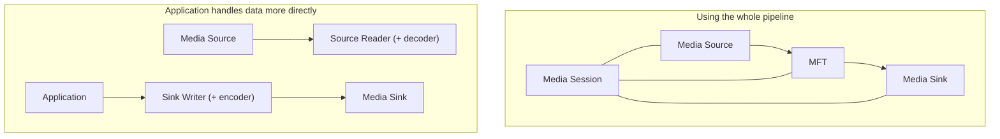
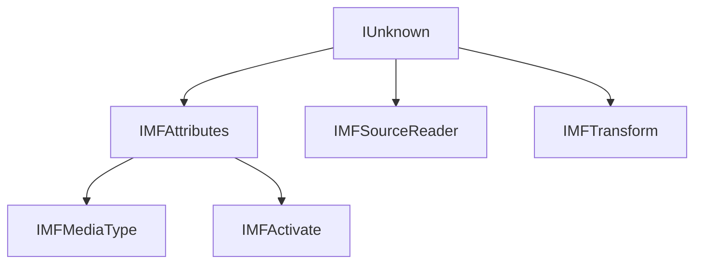
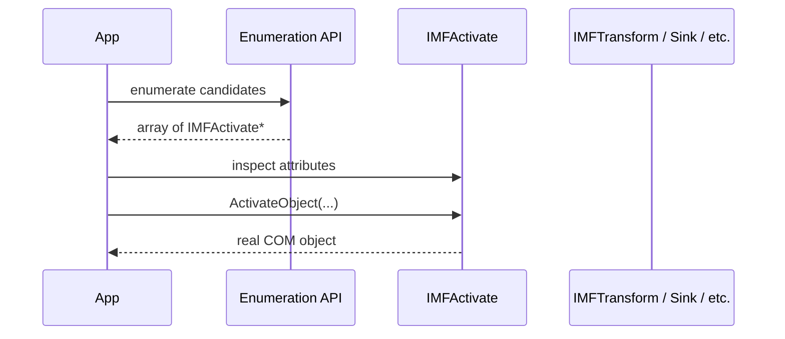
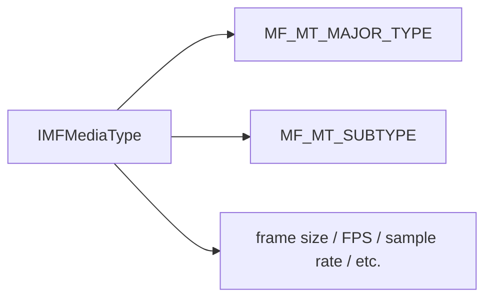
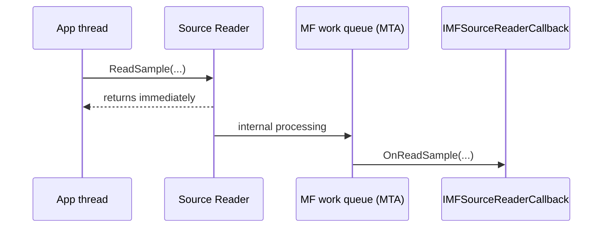
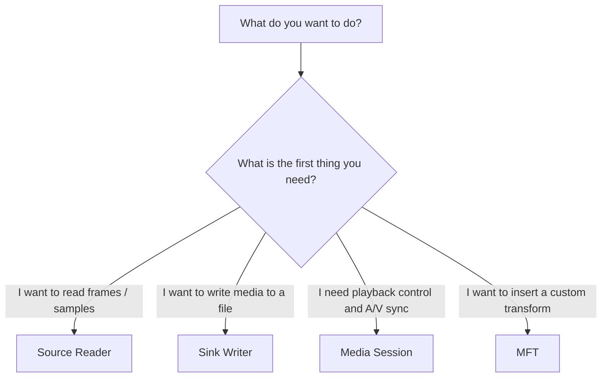

When you first start touching Media Foundation, it often feels like this:

> "I thought I was using a Windows video / audio API, but suddenly I am drowning in COM."

That reaction is natural.
Once `CoInitializeEx`, `MFStartup`, `IMFSourceReader`, `IMFMediaType`, `IMFTransform`, `IMFActivate`, `HRESULT`, and GUID-heavy configuration all show up at once, the whole thing starts to feel much more like Win32 / COM than a simple media library.

This article does not try to cover the entire Media Foundation API like a dictionary.
Instead, it organizes three practical questions first:

- why COM concepts naturally appear when you use Media Foundation
- where the COM flavor becomes especially strong
- where to enter first among Source Reader / Sink Writer / Media Session / MFT

The code examples are C++-based, but the way of thinking is almost the same even when you reach Media Foundation from .NET through a wrapper.

## Contents

1. [Short version](#1-short-version)
2. [The first orientation table](#2-the-first-orientation-table)
   - [2.1. What to touch first depending on your goal](#21-what-to-touch-first-depending-on-your-goal)
   - [2.2. Where the COM face appears](#22-where-the-com-face-appears)
   - [2.3. Terms worth understanding first](#23-terms-worth-understanding-first)
3. [The overall shape of Media Foundation](#3-the-overall-shape-of-media-foundation)
4. [The places where Media Foundation starts looking like COM](#4-the-places-where-media-foundation-starts-looking-like-com)
   - [4.1. `CoInitializeEx` and `MFStartup` appear next to each other at initialization](#41-coinitializeex-and-mfstartup-appear-next-to-each-other-at-initialization)
   - [4.2. Object boundaries are mostly interface-based](#42-object-boundaries-are-mostly-interface-based)
   - [4.3. Activation objects appear](#43-activation-objects-appear)
   - [4.4. Configuration and media type information revolve around `IMFAttributes` and GUIDs](#44-configuration-and-media-type-information-revolve-around-imfattributes-and-guids)
   - [4.5. Async, callbacks, and threading are also handled in a COM-like way](#45-async-callbacks-and-threading-are-also-handled-in-a-com-like-way)
   - [4.6. But Media Foundation is not "just COM"](#46-but-media-foundation-is-not-just-com)
5. [Rough rule-of-thumb usage](#5-rough-rule-of-thumb-usage)
   - [5.1. Start with Source Reader when you want to pull samples](#51-start-with-source-reader-when-you-want-to-pull-samples)
   - [5.2. Use Sink Writer when you want to write files](#52-use-sink-writer-when-you-want-to-write-files)
   - [5.3. Use Media Session when playback and synchronization matter](#53-use-media-session-when-playback-and-synchronization-matter)
   - [5.4. Use MFT when you need to insert your own components](#54-use-mft-when-you-need-to-insert-your-own-components)
6. [A practical checklist](#6-a-practical-checklist)
7. [Code excerpts](#7-code-excerpts)
   - [7.1. Initialization](#71-initialization)
   - [7.2. Creating a Source Reader in synchronous mode](#72-creating-a-source-reader-in-synchronous-mode)
   - [7.3. Creating a Source Reader in asynchronous mode](#73-creating-a-source-reader-in-asynchronous-mode)
   - [7.4. Enumerating and activating MFTs with `MFTEnumEx`](#74-enumerating-and-activating-mfts-with-mftenumex)
8. [Summary](#8-summary)
9. [References](#9-references)

* * *

## 1. Short version

- Media Foundation is a platform for handling audio and video. The whole API surface is **not** simply pure COM.
- But the boundaries between source / transform / sink / activation / attributes / callbacks are expressed through COM interfaces, so once you use it, `IUnknown`, `HRESULT`, GUIDs, and apartment/threading discussions naturally appear.
- It is usually easiest to start with Source Reader / Sink Writer first, move to Media Session when you need playback control, and move into MFT when you need your own transform component.

In other words, **Media Foundation is a media-processing platform whose boundaries are deeply shaped by COM**.

Once you understand that first, it becomes much easier to see why the API suddenly starts wearing a COM face.

## 2. The first orientation table

### 2.1. What to touch first depending on your goal

This first table makes it easier to choose an entry point.

| What you want to do | First thing to touch | How strong the COM feel is | Notes |
| --- | --- | --- | --- |
| Pull frames / samples from a file or camera | Source Reader | Medium | It can also take care of decoder loading when needed |
| Write generated audio / video to a file | Sink Writer | Medium | It can manage encoders and media sinks together |
| Handle playback, pause, seek, A/V sync, and quality control | Media Session | High | You need to understand topology and session concepts |
| Insert your own transform or codec-like processing component | MFT | High | The core interface becomes `IMFTransform` |
| Enumerate candidates first and instantiate only the one you need | `IMFActivate` | High | The thing you get back may not be the real object yet |

### 2.2. Where the COM face appears

| Place | What shows up | What to understand first |
| --- | --- | --- |
| Initialization | `CoInitializeEx`, `MFStartup` | COM initialization and Media Foundation initialization are separate |
| Object creation / transfer | `IMFSourceReader`, `IMFMediaType`, `IMFTransform` | Most things are interface pointers plus `HRESULT` |
| Configuration | `IMFAttributes`, GUIDs | Settings and media type information are represented as key/value data plus GUIDs |
| Enumeration / delayed instantiation | `IMFActivate`, `ActivateObject` | Enumeration results are not always the final object |
| Async flow | `IMFSourceReaderCallback`, work queues | You need to think about callbacks and apartments |
| Playback control | topology, Media Session | The flow of the whole pipeline is a Media Foundation-specific concept |

### 2.3. Terms worth understanding first

| Term | Meaning here |
| --- | --- |
| Media Source | The entry point where media data enters the pipeline. This can be a file, network source, capture device, and so on |
| MFT | Media Foundation Transform. The common model for decoders, encoders, and video/audio processing blocks |
| Media Sink | The destination for media data, such as playback, output, or file writing |
| Media Session | The component that manages the pipeline as a whole, especially playback and synchronization |
| Topology | A graph that describes how source / transform / sink nodes are connected |
| Activation Object | A helper object used to instantiate the real object later. In Media Foundation this is usually represented by `IMFActivate` |
| Attributes | A key/value store based on GUID keys. Media Foundation uses this everywhere |

If you keep these terms in mind first, the documentation becomes much easier to read.

## 3. The overall shape of Media Foundation

At a high level, Media Foundation is about a **media pipeline**.
COM matters, but it is often easier to understand the overall shape first.



There are roughly two ways to use Media Foundation:

- **Use the pipeline as a whole**
  - connect source / transform / sink and let Media Session manage data flow and A/V synchronization
- **Handle the data more directly in the application**
  - pull data from a source with Source Reader and push it toward an output with Sink Writer

The latter is often easier when you want to process frames or samples yourself.
The former is the more natural path if you want the platform to handle playback and synchronization.

The important point is that **Media Foundation is a media-processing platform, not simply a bag of COM objects you poke directly**.

But once you start looking at the boundaries between those components, the COM face becomes much stronger.
That is the next section.

## 4. The places where Media Foundation starts looking like COM

### 4.1. `CoInitializeEx` and `MFStartup` appear next to each other at initialization

This is one of the first things that feels strange.

Before you can "just open a file" or "just pull data from a camera," you see both `CoInitializeEx` and `MFStartup`.

- `CoInitializeEx` initializes COM
- `MFStartup` initializes the Media Foundation platform

So **COM initialization alone is not enough**.
That is often the first moment where it becomes obvious that this is not merely "a video API" but a platform with a significant COM-based contract underneath.

In practical code, it helps to decide these things early:

- which thread will use Media Foundation
- whether that thread will be STA or MTA
- who owns `MFStartup` / `MFShutdown` and `CoInitializeEx` / `CoUninitialize`

If you keep that vague, callback and UI-integration problems become much harder to understand later.

### 4.2. Object boundaries are mostly interface-based

Once you start reading Media Foundation APIs, many return values and out parameters are COM interfaces:

- `IMFSourceReader`
- `IMFMediaType`
- `IMFTransform`
- `IMFActivate`
- `IMFSample`
- `IMFMediaBuffer`

What matters here is that **not only the media data itself, but also type descriptions and configuration objects are represented as interfaces**.

For example:

- `IMFTransform` represents an MFT
- `IMFAttributes` is a key/value store
- `IMFMediaType` is essentially a media-format description built on top of `IMFAttributes`

So even something that looks like "configuration data" is still shaped as a COM interface.
That is why `IUnknown`, `QueryInterface`, `AddRef` / `Release`, and `HRESULT` naturally enter the picture.



At this point it becomes much easier to say:

> "Media Foundation is a media API, but its boundaries are very COM-shaped."

### 4.3. Activation objects appear

One of the places where the COM flavor becomes especially visible is the activation-object model.

`IMFActivate` is a helper object used to create the real object later.
The easiest mental model is that it feels somewhat like a COM class factory.

This shows up in places where enumeration APIs do **not** immediately return a directly usable transform or sink object.
Instead, they first return an array of `IMFActivate*`.
Then you inspect the candidate, and only later call `ActivateObject` to create the real instance.



This structure fits well with how Media Foundation wants to:

- discover interchangeable building blocks
- inspect them
- and instantiate only what is actually needed

Since activation objects can also carry attributes, the flow naturally becomes:

- inspect candidate metadata
- possibly configure it
- instantiate later

That is a very COM-like shape.

### 4.4. Configuration and media type information revolve around `IMFAttributes` and GUIDs

Another moment when Media Foundation suddenly feels "very COM" is when settings turn into a forest of GUIDs.
The center of that forest is `IMFAttributes`.

`IMFAttributes` is a GUID-keyed key/value store, and Media Foundation uses it constantly.

The especially important thing is `IMFMediaType`.
`IMFMediaType` inherits from `IMFAttributes` and stores media-format information as attributes.

Typical examples include:

- major type (audio or video)
- subtype (`H.264`, `AAC`, `RGB32`, `PCM`, and so on)
- frame size
- frame rate
- sample rate
- channel count



It is easy to experience this as "the forest of GUIDs."
But the underlying design is actually straightforward:

- use an attribute store to hold configuration
- represent media types through the same attribute-store model
- negotiate formats between source / transform / sink by reading and matching those attributes

So the real point is:

> **Media Foundation uses COM-like interfaces and GUIDs to represent configuration and media-type metadata.**

### 4.5. Async, callbacks, and threading are also handled in a COM-like way

Another place that is easy to underestimate in practice is asynchronous behavior and thread model.

For example, Source Reader is synchronous by default.
In synchronous mode, `ReadSample` blocks.
Depending on the file, network, or device, that blocking time can become very visible.

If you want asynchronous mode, you create the Source Reader with a callback.
That means:

- implement an `IMFSourceReaderCallback`
- put that object into the `MF_SOURCE_READER_ASYNC_CALLBACK` attribute
- then create the Source Reader

There is also a threading point that matters a lot:
Media Foundation asynchronous processing uses a work queue, and **the Media Foundation work-queue threads are MTA**.

That means it is often simpler to keep the application side in MTA as well.



The practical points are:

- do not touch STA UI objects directly inside the callback
- make the callback implementation thread-safe
- if UI updates are needed, return only the result to the UI thread
- decide early which threads are expected to receive Media Foundation callbacks

Media Foundation does not magically absorb your STA assumptions for you.
So in many applications it is simpler to:

> keep Media Foundation worker code on the MTA side, and build an explicit bridge back to the UI.

### 4.6. But Media Foundation is not "just COM"

At this point, it is easy to think:

> "So Media Foundation is basically COM."

That is not quite right.

Media Foundation has concepts that go beyond generic COM:

- `MFStartup` / `MFShutdown`
- Media Session
- topology
- topology loader
- presentation clock
- Source Reader / Sink Writer

These are not merely COM concepts. They are **Media Foundation's own platform-level model for handling media pipelines**.

For example, in Media Session, the application can provide a partial topology, and the topology loader can resolve it into a full topology by supplying the transforms that are needed.
That is not just "COM in general." It is Media Foundation behaving as a media-processing platform.


So the easiest way to understand it is as a two-layer picture:

- Media Foundation uses COM to express component contracts
- on top of that, it acts as a media-processing platform with its own pipeline concepts

That framing makes the API much easier to digest.

## 5. Rough rule-of-thumb usage

This first branching is enough surprisingly often:



### 5.1. Start with Source Reader when you want to pull samples

Source Reader is a very approachable entry point when you want to pull media data out of a file or device.

Good fits include:

- extracting frames from a video file
- decoding audio samples
- pulling frames from a camera
- feeding Media Foundation sources into your own processing pipeline

Source Reader can take care of decoder loading when needed.
But it does **not** manage presentation clocks, A/V synchronization, or actual playback for you.

It is easiest to think of it as:

> an entry point for **reading data**, not an entry point for full playback.

### 5.2. Use Sink Writer when you want to write files

Sink Writer is the output-side counterpart.

Good fits include:

- writing generated frames into a video file
- encoding audio samples
- converting one format into another and storing the result

Sink Writer can also bring encoders and media sinks into the flow when necessary.

### 5.3. Use Media Session when playback and synchronization matter

If your real goal is not just "pull samples" but "play media properly," then Media Session is usually the right center.

It is a good fit when you need:

- play / pause / seek
- audio/video synchronization
- quality control across the pipeline
- topology-based connection of sources / transforms / sinks

At this level, you are much closer to **Media Foundation itself** than to the simpler Source Reader / Sink Writer helpers.

### 5.4. Use MFT when you need to insert your own components

MFT is the common transform model in Media Foundation.

You enter this world when you want to:

- build your own decoder or encoder
- insert a custom audio / video processing block
- enumerate and choose transform components yourself
- control the pipeline more explicitly than the automatic route

The MFT world brings `IMFTransform`, `IMFActivate`, media-type negotiation, and sample / buffer management much closer to the surface.
That is why it is usually clearer not to start there first unless you genuinely need it.

## 6. A practical checklist

| Item | What to decide / inspect | What tends to go wrong if you skip it |
| --- | --- | --- |
| initialization ownership | decide where `CoInitializeEx` and `MFStartup` are called and where their shutdown counterparts live | missing initialization, confusing shutdown order |
| apartment model | decide upfront whether the relevant threads are STA or MTA | callback confusion, UI collisions |
| Source Reader mode | decide synchronous vs asynchronous mode at creation time | unexpected blocking or impossible late-mode changes |
| media-type negotiation | explicitly enumerate and choose actual output formats | `MF_E_INVALIDMEDIATYPE`, unexpected format mismatches |
| object lifetime | make `Release`, `Unlock`, and shutdown responsibility explicit | leaks, stuck buffers, shutdown inconsistencies |
| activation object handling | distinguish between a real object and an `IMFActivate` wrapper | failing because you assumed the candidate was already the final object |
| topology understanding | know whether you are looking at a partial topology or a resolved full topology | getting stuck while expecting auto-connection to happen magically |
| error checking | inspect `HRESULT`, stream flags, and events consistently | partial failures get missed |
| UI integration | do not let callbacks touch the UI directly; marshal the result back explicitly | hangs, races, and confusing cross-thread failures |

The three priorities that matter most are:

1. **choose the right entry API first**
2. **decide the apartment model before everything grows around it**
3. **do not treat media-type negotiation casually**

## 7. Code excerpts

These are not meant to be complete samples.  
They are short enough to show where Media Foundation starts feeling like COM.

### 7.1. Initialization

```cpp
template <class T>
void SafeRelease(T** pp)
{
    if (pp != nullptr && *pp != nullptr)
    {
        (*pp)->Release();
        *pp = nullptr;
    }
}

HRESULT InitializeMediaFoundationForCurrentThread()
{
    HRESULT hr = CoInitializeEx(nullptr, COINIT_MULTITHREADED);
    if (FAILED(hr))
    {
        return hr;
    }

    hr = MFStartup(MF_VERSION);
    if (FAILED(hr))
    {
        CoUninitialize();
        return hr;
    }

    return S_OK;
}

void UninitializeMediaFoundationForCurrentThread()
{
    MFShutdown();
    CoUninitialize();
}
```

This is one of the first points where the COM shape becomes visible:

- `CoInitializeEx`
- `MFStartup`

If some other layer already owns COM initialization, that is fine too.
The important thing is to make the responsibility explicit.

### 7.2. Creating a Source Reader in synchronous mode

```cpp
HRESULT ReadOneVideoSample(PCWSTR path)
{
    IMFSourceReader* pReader = nullptr;
    IMFMediaType* pType = nullptr;
    IMFSample* pSample = nullptr;

    HRESULT hr = MFCreateSourceReaderFromURL(path, nullptr, &pReader);
    if (FAILED(hr)) goto done;

    hr = MFCreateMediaType(&pType);
    if (FAILED(hr)) goto done;

    hr = pType->SetGUID(MF_MT_MAJOR_TYPE, MFMediaType_Video);
    if (FAILED(hr)) goto done;

    hr = pType->SetGUID(MF_MT_SUBTYPE, MFVideoFormat_RGB32);
    if (FAILED(hr)) goto done;

    hr = pReader->SetCurrentMediaType(
        MF_SOURCE_READER_FIRST_VIDEO_STREAM,
        nullptr,
        pType);
    if (FAILED(hr)) goto done;

    DWORD streamFlags = 0;
    LONGLONG timestamp = 0;

    hr = pReader->ReadSample(
        MF_SOURCE_READER_FIRST_VIDEO_STREAM,
        0,
        nullptr,
        &streamFlags,
        &timestamp,
        &pSample);
    if (FAILED(hr)) goto done;

    // Process IMFMediaBuffer extracted from pSample here

done:
    SafeRelease(&pSample);
    SafeRelease(&pType);
    SafeRelease(&pReader);
    return hr;
}
```

What this example makes visible is:

- the reader and media type are COM interfaces
- configuration is GUID-based
- results are carried through `HRESULT`
- synchronous mode means `ReadSample` blocks

Even "I just want one frame" already looks very COM-shaped at the Media Foundation boundary.

### 7.3. Creating a Source Reader in asynchronous mode

```cpp
HRESULT CreateSourceReaderAsync(
    PCWSTR path,
    IMFSourceReaderCallback* pCallback,
    IMFSourceReader** ppReader)
{
    IMFAttributes* pAttributes = nullptr;

    HRESULT hr = MFCreateAttributes(&pAttributes, 1);
    if (FAILED(hr))
    {
        return hr;
    }

    hr = pAttributes->SetUnknown(MF_SOURCE_READER_ASYNC_CALLBACK, pCallback);
    if (SUCCEEDED(hr))
    {
        hr = MFCreateSourceReaderFromURL(path, pAttributes, ppReader);
    }

    SafeRelease(&pAttributes);
    return hr;
}
```

Here, asynchronous mode is selected by placing the callback into the attribute set before creating the reader.

That means:

- the callback itself is a COM interface
- async mode is configured through `IMFAttributes`
- the mode is decided at creation time

In practice, it is important that the `IMFSourceReaderCallback` implementation be thread-safe and not directly grab UI objects.

### 7.4. Enumerating and activating MFTs with `MFTEnumEx`

```cpp
HRESULT FindH264Decoder(IMFTransform** ppTransform)
{
    *ppTransform = nullptr;

    IMFActivate** ppActivate = nullptr;
    UINT32 count = 0;

    MFT_REGISTER_TYPE_INFO inputType = {};
    inputType.guidMajorType = MFMediaType_Video;
    inputType.guidSubtype = MFVideoFormat_H264;

    HRESULT hr = MFTEnumEx(
        MFT_CATEGORY_VIDEO_DECODER,
        MFT_ENUM_FLAG_SYNCMFT | MFT_ENUM_FLAG_LOCALMFT,
        &inputType,
        nullptr,
        &ppActivate,
        &count);
    if (FAILED(hr) || count == 0)
    {
        return FAILED(hr) ? hr : MF_E_TOPO_CODEC_NOT_FOUND;
    }

    hr = ppActivate[0]->ActivateObject(IID_PPV_ARGS(ppTransform));

    for (UINT32 i = 0; i < count; ++i)
    {
        SafeRelease(&ppActivate[i]);
    }
    CoTaskMemFree(ppActivate);

    return hr;
}
```

What matters here is that enumeration does not necessarily hand you the final transform directly.
You may get activation objects first, inspect them, and only then instantiate the actual transform.

That is a very characteristic part of Media Foundation's COM-shaped design.

## 8. Summary

Media Foundation is not "just COM," but it absolutely uses COM to define many of its most important boundaries.

If you understand:

- why `CoInitializeEx` and `MFStartup` sit side by side
- why so many core objects are interface-based
- why activation objects, GUID attributes, callbacks, and apartment concerns appear naturally

then the API becomes much easier to read.

The simplest practical rule is:

- start with Source Reader / Sink Writer if you can
- move to Media Session when playback orchestration matters
- move into MFT only when your real problem is custom transform integration

That keeps the amount of conceptual baggage much more manageable.

## 9. References

* [Media Foundation documentation](https://learn.microsoft.com/en-us/windows/win32/medfound/media-foundation-start-page)
* [Source Reader](https://learn.microsoft.com/en-us/windows/win32/medfound/source-reader)
* [Sink Writer](https://learn.microsoft.com/en-us/windows/win32/medfound/sink-writer)
* [Media Session](https://learn.microsoft.com/en-us/windows/win32/medfound/media-session)
* [MFTEnumEx](https://learn.microsoft.com/en-us/windows/win32/api/mfapi/nf-mfapi-mftenumex)
