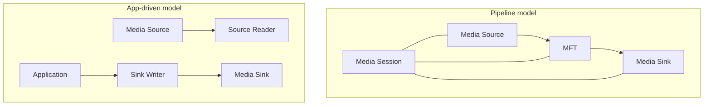

# What Media Foundation Is - Why Windows Media APIs So Often Feel Like COM

Once you start working with Media Foundation, it often feels as if you were supposed to be using a media API but somehow ended up in COM territory instead.
`CoInitializeEx`, `HRESULT`, `IMFSourceReader`, `IMFTransform`, `IMFActivate`, and GUID-heavy attributes all show up quickly.

## Contents

1. [Short version](#1-short-version)
2. [A quick orientation table](#2-a-quick-orientation-table)
3. [The overall shape of Media Foundation](#3-the-overall-shape-of-media-foundation)
4. [Where Media Foundation looks like COM](#4-where-media-foundation-looks-like-com)
5. [Which entry point to use first](#5-which-entry-point-to-use-first)
6. [Summary](#6-summary)

---

## 1. Short version

- Media Foundation is a **media-processing platform**, not "just COM with media objects"
- But the boundaries between sources, transforms, sinks, activation objects, attributes, and callbacks are all expressed through COM interfaces
- That is why `IUnknown`, `HRESULT`, GUIDs, apartments, and callbacks naturally appear in everyday Media Foundation work
- For practical onboarding, it is usually easiest to begin with **Source Reader** or **Sink Writer**

In short: **Media Foundation is a media platform whose boundary surfaces are deeply COM-shaped**.

## 2. A quick orientation table

| What you want to do | First thing to look at | COM intensity |
| --- | --- | --- |
| Read samples from a file or camera | Source Reader | Medium |
| Write generated media to a file | Sink Writer | Medium |
| Handle playback, seeking, A/V sync, and topology management | Media Session | High |
| Insert your own transform or codec-like component | MFT / `IMFTransform` | High |

## 3. The overall shape of Media Foundation

At a high level, Media Foundation is about a **media pipeline**.

The first model is for playback orchestration.  
The second is for applications that want direct access to frames or samples.

## 4. Where Media Foundation looks like COM

- initialization appears next to COM initialization through `CoInitializeEx`
- important objects are exposed as interfaces such as `IMFSourceReader`, `IMFMediaType`, and `IMFTransform`
- enumeration often returns `IMFActivate` rather than the final object
- configuration is heavily expressed through `IMFAttributes` and GUID keys
- asynchronous readers and callbacks make apartment and threading questions relevant

That is why Media Foundation often feels less like a "simple media API" and more like a platform built from COM-shaped parts.

## 5. Which entry point to use first

- Start with **Source Reader** if you need to read frames or samples
- Use **Sink Writer** if you need to write output media
- Move to **Media Session** when playback orchestration and synchronization matter
- Use **MFT** only when you truly need a custom transform or codec-like component

## 6. Summary

Media Foundation feels like COM because many of its most important boundaries really are COM interfaces.  
That does not mean "Media Foundation equals COM," but it does mean you should expect COM vocabulary whenever you work with object creation, configuration, callbacks, or thread-affine behavior.
