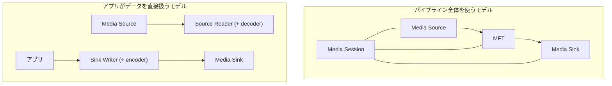
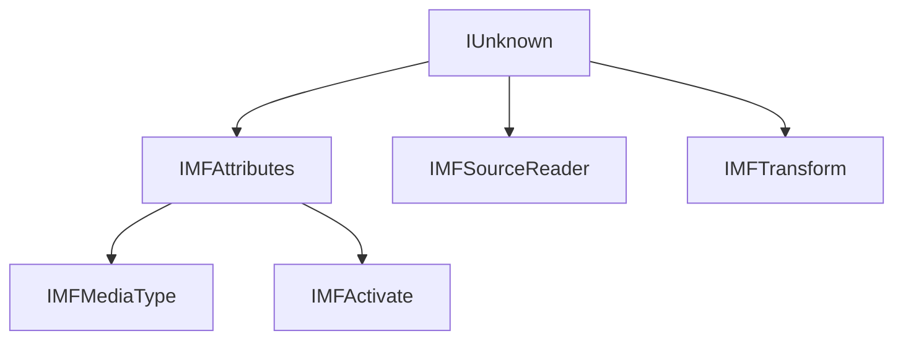
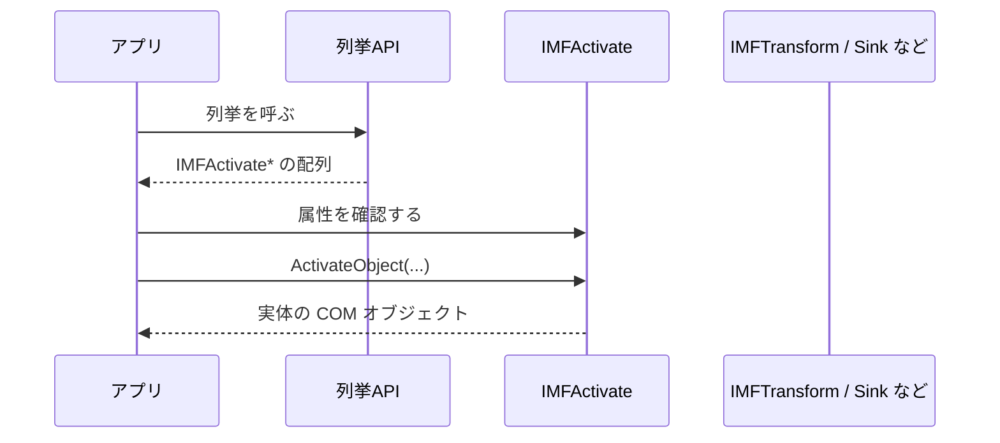
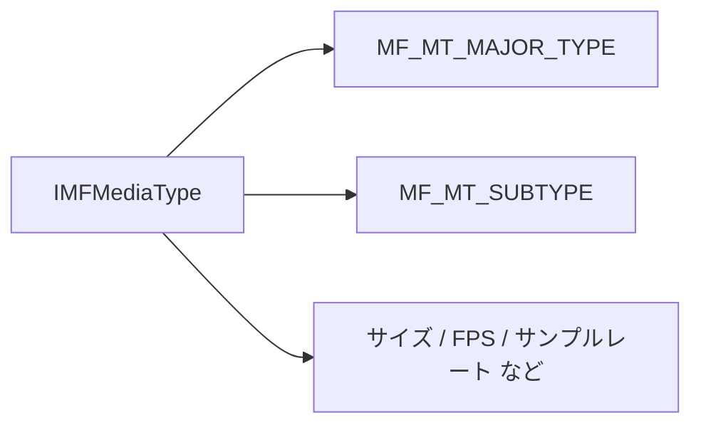
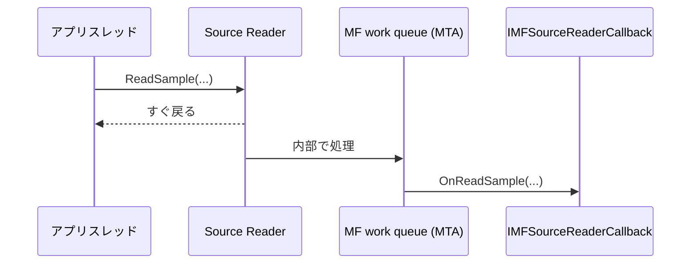
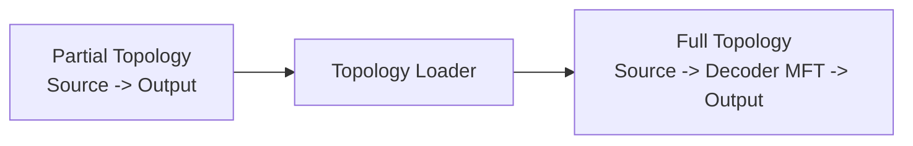
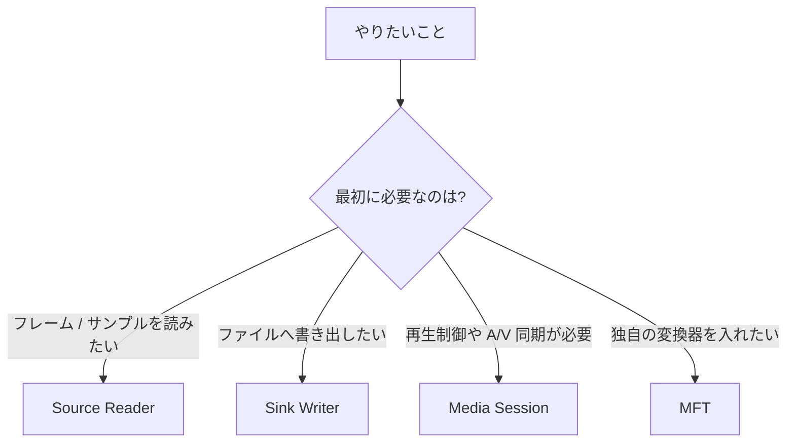

Media Foundation を触り始めると、「Windows の動画や音声 API を使っているはずなのに、急に COM の話が増えた」と感じやすいです。
特に `CoInitializeEx`、`HRESULT`、`IMFSourceReader`、`IMFTransform` あたりがまとまって出てきて、Media Foundation とは何かが見えにくくなりがちです。

`CoInitializeEx`、`MFStartup`、`IMFSourceReader`、`IMFMediaType`、`IMFTransform`、`IMFActivate`、`HRESULT`、GUID などが一気に出てきて、空気が急に Win32 / COM っぽくなります。

この記事では、Media Foundation 全体を辞書のように網羅するのではなく、次の 3 つを先に整理します。

- なぜ Media Foundation を使っていると COM の話が自然に出てくるのか
- どこで COM の色が濃くなるのか
- 最初は Source Reader / Sink Writer / Media Session / MFT のどこから触ればよいのか

コード例は C++ ベースですが、考え方自体は .NET などからラッパー越しに触る場合でもほぼ同じです。

## 目次

1. まず結論（ひとことで）
2. まず見る整理表
   - 2.1. 何をしたいときに何を触るか
   - 2.2. どこで COM の顔になるか
   - 2.3. 先に意味だけ押さえる言葉
3. Media Foundation の全体像（図）
4. Media Foundation が COM の顔になる地点
   - 4.1. 初期化で `CoInitializeEx` と `MFStartup` が並ぶ
   - 4.2. オブジェクトの受け渡しがインターフェース中心
   - 4.3. Activation Object が出てくる
   - 4.4. 設定や型情報が `IMFAttributes` と GUID 中心
   - 4.5. 非同期・コールバック・スレッドの扱いも COM 的
   - 4.6. ただし Media Foundation = COM ではない
5. ざっくり使い分け
   - 5.1. まずは Source Reader から入るケース
   - 5.2. ファイルへ書き出すなら Sink Writer
   - 5.3. 再生と同期まで扱うなら Media Session
   - 5.4. 独自部品を差し込むなら MFT
6. 実務でのチェックリスト
7. コード抜粋
   - 7.1. 初期化
   - 7.2. Source Reader を同期モードで作る
   - 7.3. Source Reader を非同期モードで作る
   - 7.4. `MFTEnumEx` で MFT を列挙して実体化する
8. まとめ
9. 参考資料

* * *

## 1. まず結論（ひとことで）

- Media Foundation は、動画や音声を扱うためのプラットフォームであって、API 全体がそのまま純粋な COM というわけではありません
- ただし、source / transform / sink / activation / attributes / callback の境界は COM インターフェースで表されるため、使っていると `IUnknown`、`HRESULT`、GUID、apartment の話が自然に出てきます
- 最初は Source Reader / Sink Writer から入り、再生制御が必要になったら Media Session、独自変換器が必要になったら MFT に進むと整理しやすいです

要するに、**Media Foundation はメディア処理のプラットフォームで、その境界面に COM が深く入っている** ということです。

ここを先に押さえると、「なぜ急に COM の顔になるのか」がかなり見やすくなります。

## 2. まず見る整理表

### 2.1. 何をしたいときに何を触るか

最初にこの表を見ると、入口を選びやすくなります。

| やりたいこと | まず触るもの | COM の濃さ | 補足 |
| --- | --- | --- | --- |
| ファイルやカメラからフレーム / サンプルを取りたい | Source Reader | 中 | 必要なら decoder も面倒を見てくれる |
| 生成した音声 / 映像をファイルへ書き出したい | Sink Writer | 中 | 必要なら encoder と media sink をまとめて扱える |
| 再生、停止、シーク、A/V 同期、品質制御まで扱いたい | Media Session | 高 | topology と session の理解が必要 |
| 独自の変換器や codec 的な部品を差し込みたい | MFT | 高 | `IMFTransform` を中心に考える |
| 列挙した候補を見てから、必要なものだけ実体化したい | `IMFActivate` | 高 | 返ってくるのが本体ではなく activation object のことがある |

### 2.2. どこで COM の顔になるか

| 地点 | 何が出てくるか | まず理解したいこと |
| --- | --- | --- |
| 初期化 | `CoInitializeEx`, `MFStartup` | COM 初期化と Media Foundation 初期化は別 |
| オブジェクト生成・受け渡し | `IMFSourceReader`, `IMFMediaType`, `IMFTransform` | 多くがインターフェースポインタ + `HRESULT` |
| 設定 | `IMFAttributes`, GUID | 設定値や型情報が key/value + GUID で表現される |
| 列挙・遅延生成 | `IMFActivate`, `ActivateObject` | 列挙結果がそのまま本体ではないことがある |
| 非同期 | `IMFSourceReaderCallback`, work queue | callback と apartment を意識する必要がある |
| 再生制御 | topology, Media Session | パイプライン全体の流れは Media Foundation 固有の概念 |

### 2.3. 先に意味だけ押さえる言葉

| 用語 | ここでの意味 |
| --- | --- |
| Media Source | メディアデータをパイプラインへ入れる入口。ファイル、ネットワーク、キャプチャデバイスなど |
| MFT | Media Foundation Transform。デコーダー、エンコーダー、映像変換器などの共通モデル |
| Media Sink | メディアデータの行き先。画面表示、音声出力、ファイル書き出しなど |
| Media Session | パイプライン全体の流れを管理する仕組み。再生や同期を担当する |
| Topology | source / transform / sink をどうつなぐかを表す接続図 |
| Activation Object | 本体を後で作るためのヘルパーオブジェクト。`IMFActivate` で表される |
| Attributes | GUID をキーにした key/value ストア。Media Foundation 全体で多用される |

このあたりを先に言葉として持っておくと、ドキュメントを読んだときの引っかかりがかなり減ります。

## 3. Media Foundation の全体像（図）

Media Foundation は、大きく見ると **メディアパイプラインの話** です。
COM の話は大事ですが、まず先に全体像を見たほうが整理しやすいです。



Media Foundation には、大まかに次の 2 つの使い方があります。

- **パイプライン全体を使うモデル**
  - source / transform / sink をつなぎ、Media Session がデータフローや A/V 同期を管理します
- **アプリがデータを直接扱うモデル**
  - Source Reader で source からデータを取り出し、Sink Writer で sink へ流し込みます

後者のほうが、フレームやサンプルを自前で処理したい場面では入りやすいです。
一方で、再生や同期まで含めてプラットフォームに任せたいなら前者が本筋です。

ここで大事なのは、**Media Foundation の正体はメディア処理のプラットフォームであって、COM オブジェクトの寄せ集めを直接触る感覚とは少し違う** ということです。

ただし、その部品同士の境界を見始めると、急に COM の顔が濃くなります。次でそこを整理します。

## 4. Media Foundation が COM の顔になる地点

### 4.1. 初期化で `CoInitializeEx` と `MFStartup` が並ぶ

最初に多くの人が違和感を持つのがここです。

ファイルを開きたい、カメラから取りたい、という話の前に、まず `CoInitializeEx` と `MFStartup` が出てきます。

- `CoInitializeEx` は COM ライブラリの初期化です
- `MFStartup` は Media Foundation プラットフォームの初期化です

つまり、**COM 初期化だけでは足りず、Media Foundation 側の初期化も必要** です。
ここで「これはただの動画 API ではなく、下に COM ベースの契約がかなり入っているのだな」と分かってきます。

実務では、この時点で次を決めておくと後が楽です。

- どのスレッドが Media Foundation を使うのか
- そのスレッドを STA にするのか MTA にするのか
- `MFStartup` / `MFShutdown` と `CoInitializeEx` / `CoUninitialize` の責務をどこが持つのか

この設計を曖昧にしたまま進むと、あとで callback や UI 連携のところで分かりにくくなります。

### 4.2. オブジェクトの受け渡しがインターフェース中心

Media Foundation の API を読んでいくと、戻り値や out 引数の多くが COM インターフェースです。

- `IMFSourceReader`
- `IMFMediaType`
- `IMFTransform`
- `IMFActivate`
- `IMFSample`
- `IMFMediaBuffer`

ここで大事なのは、**データの本体だけでなく、型情報や設定オブジェクトまでインターフェースで表される** ことです。

たとえば、

- `IMFTransform` は MFT を表すインターフェースです
- `IMFAttributes` は key/value ストアです
- `IMFMediaType` は `IMFAttributes` を継承した「メディア形式の説明」です

つまり、media type のような「設定データっぽいもの」まで COM インターフェースで持っています。
ここで `IUnknown`、`QueryInterface`、`AddRef` / `Release`、`HRESULT` の文脈が自然に入ってきます。



ここまでくると、「Media Foundation はメディア API だけれど、境界の表し方はかなり COM だな」と見えてきます。

### 4.3. Activation Object が出てくる

Media Foundation の COM っぽさが特に出るのが activation object です。

`IMFActivate` は、あとで本体を作るためのヘルパーオブジェクトです。感覚としては、COM の class factory に近いものとして見ると分かりやすいです。

これが出てくる場面では、列挙 API の返り値が「そのまま使える本体」ではなく、まず `IMFActivate*` の配列になっていることがあります。
そして、必要なものだけ `ActivateObject` で実体化します。



この形は、Media Foundation が **差し替え可能な部品を後から見つけて組み合わせる設計** になっていることと相性がよいです。

また、activation object 自体が attributes を持てるので、「まず候補の属性を見る」「必要なら設定する」「あとで実体化する」という流れになりやすいです。ここもかなり COM 的です。

### 4.4. 設定や型情報が `IMFAttributes` と GUID 中心

Media Foundation を触っていると、設定が急に GUID だらけに見える地点があります。
その中心が `IMFAttributes` です。

`IMFAttributes` は、GUID をキーにした key/value ストアです。これが Media Foundation 全体で非常によく使われます。

特に大事なのが `IMFMediaType` です。
`IMFMediaType` は `IMFAttributes` を継承していて、メディア形式の情報を属性として持ちます。

たとえば次のような情報です。

- major type（音声か映像か）
- subtype（H.264、AAC、RGB32、PCM など）
- フレームサイズ
- フレームレート
- サンプルレート
- チャンネル数



ここを「GUID の森」と感じやすいのですが、実際にはやっていることはかなり素直です。

- 属性ストアを使って設定を持つ
- media type も属性ストアとして表す
- source / transform / sink の間で、その属性を見ながら形式をすり合わせる

要するに、**設定と型情報の表現に COM 的なインターフェースと GUID が使われている** ということです。

### 4.5. 非同期・コールバック・スレッドの扱いも COM 的

Media Foundation の実務で見落としやすいのが、非同期処理とスレッドモデルです。

たとえば Source Reader は、既定では同期モードです。同期モードでは `ReadSample` がブロックします。
ファイルやネットワーク、デバイスの状態によっては、その待ちが目に見える時間になることもあります。

非同期モードにしたい場合は、Source Reader 作成時に callback を渡します。
`IMFSourceReaderCallback` を実装したオブジェクトを用意し、`MF_SOURCE_READER_ASYNC_CALLBACK` 属性に設定してから作成する流れです。

さらにやや重要なのが apartment です。
Media Foundation の非同期処理は work queue を使い、**work queue のスレッドは MTA** です。
そのため、アプリケーション側も MTA で扱うと実装が単純になります。



ここで大事なのは次の点です。

- UI スレッドの STA オブジェクトを、そのまま callback 側で触らない
- callback 実装は スレッドセーフ にする
- UI 更新が必要なら、結果だけ UI スレッドへ戻す
- 「Media Foundation の callback はどのスレッドから来るか」を最初に固定して考える

Media Foundation は STA オブジェクトの事情を勝手に吸収してくれるわけではありません。
そのため、**Media Foundation を使うワーカーは MTA に寄せ、UI とは明示的に橋を渡す** ほうが整理しやすいです。

### 4.6. ただし Media Foundation = COM ではない

ここまで読むと、「結局 Media Foundation は COM そのものなのでは」と思いやすいです。
でも、そこは少し違います。

Media Foundation には、COM の一般論では済まない、プラットフォーム固有の概念があります。

- `MFStartup` / `MFShutdown`
- Media Session
- topology
- topology loader
- presentation clock
- Source Reader / Sink Writer

このあたりは、**メディアパイプラインをどう流すか** という Media Foundation 自身の役割です。

たとえば Media Session では、アプリケーションが partial topology を渡すと、topology loader が必要な transform を補って full topology に解決する流れがあります。
これは COM の一般的な話というより、Media Foundation がメディア処理プラットフォームとして持っている機能です。



つまり、Media Foundation は **COM を使って部品の契約を表しつつ、その上でメディア処理プラットフォームとして動く** ものです。

この 2 段構えで見ると、かなり理解しやすくなります。

## 5. ざっくり使い分け

最初の入口を決めるときは、次の図で十分なことが多いです。



### 5.1. まずは Source Reader から入るケース

Source Reader は、ファイルやデバイスからデータを取り出したいときの入口としてかなり使いやすいです。

向いているのは、たとえば次のようなケースです。

- 動画ファイルからフレームを取りたい
- 音声ファイルをデコードしてサンプルを取りたい
- カメラからフレームを取りたい
- Media Foundation の source を、自前の処理パイプラインへつなぎたい

Source Reader は、必要に応じて decoder を読み込み、アプリケーションへデータを渡してくれます。
一方で、プレゼンテーションクロックの管理や A/V 同期、画面描画そのものまでは面倒を見ません。

つまり、**「再生する」のではなく「データを取る」ための入口** として考えると分かりやすいです。

### 5.2. ファイルへ書き出すなら Sink Writer

Sink Writer は、音声や映像をファイルへ書き出したいときの入口です。

向いているのは、たとえば次のようなケースです。

- 生成したフレームを動画ファイルへ保存したい
- 音声サンプルをエンコードして書き出したい
- 読み出したデータを別形式へ変換して保存したい

Sink Writer は、必要に応じて encoder を見つけて読み込み、media sink へのデータフローを管理します。
Source Reader と組み合わせることも多いですが、両者は独立した部品なので、必ずセットで使う必要はありません。

### 5.3. 再生と同期まで扱うなら Media Session

「ファイルから取りたい」ではなく、**きちんと再生したい** なら、Media Session を中心に考えたほうが素直です。

Media Session が向いているのは、たとえば次のようなケースです。

- 再生 / 停止 / シークを扱いたい
- 音声と映像の同期をプラットフォーム側に任せたい
- 品質制御やフォーマット変更を含めてパイプラインを扱いたい
- topology を使って source / transform / sink の流れを組みたい

このレイヤーに入ると、Source Reader / Sink Writer よりも「Media Foundation 本体」に近づきます。
そのぶん、topology や session event など、Media Foundation 固有の概念も増えます。

### 5.4. 独自部品を差し込むなら MFT

MFT は、Media Foundation の transform の共通モデルです。

ここへ入るのは、たとえば次のような場面です。

- 独自のデコーダーやエンコーダーを作りたい
- 映像処理や音声処理の部品を、パイプラインへ差し込みたい
- codec や変換器を列挙して、自前で選びたい
- 既定の自動解決より深く制御したい

MFT の世界では、`IMFTransform`、`IMFActivate`、media type negotiation、サンプル / バッファ管理など、COM 的な契約がかなり前面に出ます。
そのため、**最初の入口としていきなり MFT へ入るより、まず Source Reader / Sink Writer / Media Session のどれが本当に必要かを先に見たほうが分かりやすい** です。

## 6. 実務でのチェックリスト

最後に、実務で最初に見ておきたい点を 1 枚にまとめます。

| 項目 | 見ておくこと | 見落とすと起きやすいこと |
| --- | --- | --- |
| 初期化責務 | `CoInitializeEx` と `MFStartup` をどこで呼ぶか、終了処理をどこで持つか決める | 初期化漏れ、終了順序の混乱 |
| apartment | MF を触るスレッドを STA / MTA のどちらにするか先に決める | callback まわりの混乱、UI との衝突 |
| Source Reader のモード | 同期か非同期かを作成時に決める | `ReadSample` が想定外にブロックする、後から切り替えられない |
| media type negotiation | 出力形式を列挙し、実際に使う形式を明示する | `MF_E_INVALIDMEDIATYPE`、期待と違う形式が来る |
| オブジェクト寿命 | `Release`、`Unlock`、`ShutdownObject` の責務を明確にする | メモリリーク、バッファ保持、終了時の不整合 |
| activation object | 列挙結果が本体なのか `IMFActivate` なのかを区別する | `QueryInterface` できると思って失敗する |
| topology | partial topology と full topology のどちらを扱っているかを把握する | 「自動でつながるはず」と思って詰まる |
| エラー確認 | `HRESULT`、stream flags、event を毎回見る | 一部だけ失敗しているのに見逃す |
| UI 連携 | callback から直接 UI を触らず、結果だけ UI スレッドへ戻す | ハング、競合、分かりにくい不具合 |

特に優先度が高いのは次の 3 つです。

1. **最初の入口 API を間違えないこと**
   - まずは Source Reader / Sink Writer / Media Session のどれが本当に必要かを分ける
2. **apartment を先に決めること**
   - STA の UI と Media Foundation の work queue を混ぜるなら、橋の渡し方を最初に決める
3. **media type negotiation を雑にしないこと**
   - 「たぶんこの形式だろう」で進めると、あとでかなり分かりにくくなります

## 7. コード抜粋

ここでは、完全なサンプルではなく、**どこで COM の顔になるのかが分かる程度の抜粋** だけ載せます。

### 7.1. 初期化

```cpp
template <class T>
void SafeRelease(T** pp)
{
    if (pp != nullptr && *pp != nullptr)
    {
        (*pp)->Release();
        *pp = nullptr;
    }
}

HRESULT InitializeMediaFoundationForCurrentThread()
{
    HRESULT hr = CoInitializeEx(nullptr, COINIT_MULTITHREADED);
    if (FAILED(hr))
    {
        return hr;
    }

    hr = MFStartup(MF_VERSION);
    if (FAILED(hr))
    {
        CoUninitialize();
        return hr;
    }

    return S_OK;
}

void UninitializeMediaFoundationForCurrentThread()
{
    MFShutdown();
    CoUninitialize();
}
```

ここでは `CoInitializeEx` と `MFStartup` が並んでいます。
これが、Media Foundation を触っていて急に COM の空気が濃くなる最初の地点です。

実装では、別の層がすでに COM 初期化を担当していることもあります。その場合も、**どこが責務を持つかを先に固定する** ほうが安全です。

### 7.2. Source Reader を同期モードで作る

```cpp
HRESULT ReadOneVideoSample(PCWSTR path)
{
    IMFSourceReader* pReader = nullptr;
    IMFMediaType* pType = nullptr;
    IMFSample* pSample = nullptr;

    HRESULT hr = MFCreateSourceReaderFromURL(path, nullptr, &pReader);
    if (FAILED(hr)) goto done;

    hr = MFCreateMediaType(&pType);
    if (FAILED(hr)) goto done;

    hr = pType->SetGUID(MF_MT_MAJOR_TYPE, MFMediaType_Video);
    if (FAILED(hr)) goto done;

    hr = pType->SetGUID(MF_MT_SUBTYPE, MFVideoFormat_RGB32);
    if (FAILED(hr)) goto done;

    hr = pReader->SetCurrentMediaType(
        MF_SOURCE_READER_FIRST_VIDEO_STREAM,
        nullptr,
        pType);
    if (FAILED(hr)) goto done;

    DWORD streamFlags = 0;
    LONGLONG timestamp = 0;

    hr = pReader->ReadSample(
        MF_SOURCE_READER_FIRST_VIDEO_STREAM,
        0,
        nullptr,
        &streamFlags,
        &timestamp,
        &pSample);
    if (FAILED(hr)) goto done;

    // pSample から IMFMediaBuffer を取り出して処理する

done:
    SafeRelease(&pSample);
    SafeRelease(&pType);
    SafeRelease(&pReader);
    return hr;
}
```

ここで見えてくるのは次の点です。

- reader も media type も COM インターフェース
- 設定は GUID ベース
- 戻り値は `HRESULT`
- 同期モードでは `ReadSample` がブロックする

「ただ 1 フレーム読みたい」だけでも、Media Foundation の境界ではかなり COM 的な顔になります。

### 7.3. Source Reader を非同期モードで作る

```cpp
HRESULT CreateSourceReaderAsync(
    PCWSTR path,
    IMFSourceReaderCallback* pCallback,
    IMFSourceReader** ppReader)
{
    IMFAttributes* pAttributes = nullptr;

    HRESULT hr = MFCreateAttributes(&pAttributes, 1);
    if (FAILED(hr))
    {
        return hr;
    }

    hr = pAttributes->SetUnknown(MF_SOURCE_READER_ASYNC_CALLBACK, pCallback);
    if (SUCCEEDED(hr))
    {
        hr = MFCreateSourceReaderFromURL(path, pAttributes, ppReader);
    }

    SafeRelease(&pAttributes);
    return hr;
}
```

ここでは、非同期モードにするために callback を属性へ入れてから reader を作っています。

つまり、

- callback 自体が COM インターフェース
- 非同期設定が `IMFAttributes` 経由
- モードは作成時に決まる

という形です。

実務では、`IMFSourceReaderCallback` 実装を スレッドセーフ にし、UI オブジェクトを直接持ち込まないようにするのが大事です。

### 7.4. `MFTEnumEx` で MFT を列挙して実体化する

```cpp
HRESULT FindH264Decoder(IMFTransform** ppTransform)
{
    *ppTransform = nullptr;

    IMFActivate** ppActivate = nullptr;
    UINT32 count = 0;

    MFT_REGISTER_TYPE_INFO inputType = {};
    inputType.guidMajorType = MFMediaType_Video;
    inputType.guidSubtype = MFVideoFormat_H264;

    HRESULT hr = MFTEnumEx(
        MFT_CATEGORY_VIDEO_DECODER,
        MFT_ENUM_FLAG_SYNCMFT | MFT_ENUM_FLAG_LOCALMFT,
        &inputType,
        nullptr,
        &ppActivate,
        &count);
    if (FAILED(hr))
    {
        return hr;
    }

    if (count == 0)
    {
        CoTaskMemFree(ppActivate);
        return MF_E_TOPO_CODEC_NOT_FOUND;
    }

    hr = ppActivate[0]->ActivateObject(
        __uuidof(IMFTransform),
        reinterpret_cast<void**>(ppTransform));

    for (UINT32 i = 0; i < count; ++i)
    {
        ppActivate[i]->Release();
    }
    CoTaskMemFree(ppActivate);

    return hr;
}
```

ここでは、列挙結果が最初から `IMFTransform*` ではなく、`IMFActivate**` で返ってきます。
そして `ActivateObject` を呼んで、ようやく実体の `IMFTransform` を取ります。

この流れが、Media Foundation の「急に COM の顔になる」感じをかなりよく表しています。

## 8. まとめ

Media Foundation を触っていて急に COM の話が増えるのは、偶然ではありません。

- Media Foundation はメディア処理のプラットフォームである
- その source / transform / sink / activation / callback などの境界は COM インターフェースで表される
- そのため、`IUnknown`、`HRESULT`、GUID、apartment、callback の話が自然に出てくる
- ただし、Media Foundation の本体は Media Session や topology を持つメディアパイプラインであって、単なる COM の焼き直しではない

実務では、まず次の順で考えるとかなり整理しやすいです。

1. そもそも Source Reader / Sink Writer / Media Session / MFT のどれが必要かを分ける
2. apartment と callback の方針を先に決める
3. media type negotiation とオブジェクト寿命を丁寧に扱う

最初から全部を理解しようとしなくても大丈夫です。
まずは **「Media Foundation はメディア処理プラットフォームで、COM はその境界面に深く入っている」** と見ておくと、ドキュメントもコードもかなり追いやすくなります。

## 9. 参考資料

- [Media Foundation and COM - Microsoft Learn](https://learn.microsoft.com/en-us/windows/win32/medfound/media-foundation-and-com)
- [Overview of the Media Foundation Architecture - Microsoft Learn](https://learn.microsoft.com/en-us/windows/win32/medfound/overview-of-the-media-foundation-architecture)
- [Initializing Media Foundation - Microsoft Learn](https://learn.microsoft.com/en-us/windows/win32/medfound/initializing-media-foundation)
- [Source Reader - Microsoft Learn](https://learn.microsoft.com/en-us/windows/win32/medfound/source-reader)
- [Using the Source Reader to Process Media Data - Microsoft Learn](https://learn.microsoft.com/en-us/windows/win32/medfound/processing-media-data-with-the-source-reader)
- [Using the Source Reader in Asynchronous Mode - Microsoft Learn](https://learn.microsoft.com/en-us/windows/win32/medfound/using-the-source-reader-in-asynchronous-mode)
- [Sink Writer - Microsoft Learn](https://learn.microsoft.com/en-us/windows/win32/medfound/sink-writer)
- [Activation Objects - Microsoft Learn](https://learn.microsoft.com/en-us/windows/win32/medfound/activation-objects)
- [About Topologies - Microsoft Learn](https://learn.microsoft.com/en-us/windows/win32/medfound/about-topologies)
- [IMFAttributes interface - Microsoft Learn](https://learn.microsoft.com/en-us/windows/win32/api/mfobjects/nn-mfobjects-imfattributes)
- [IMFMediaType interface - Microsoft Learn](https://learn.microsoft.com/en-us/windows/win32/api/mfobjects/nn-mfobjects-imfmediatype)
- [IMFTransform interface - Microsoft Learn](https://learn.microsoft.com/en-us/windows/win32/api/mftransform/nn-mftransform-imftransform)
- [MFTEnumEx function - Microsoft Learn](https://learn.microsoft.com/en-us/windows/win32/api/mfapi/nf-mfapi-mftenumex)
- [COMのSTA/MTAでハングを避けるための基礎知識 | KomuraSoft Blog](https://comcomponent.com/blog/2026/01/31/000-sta-mta-com-relationship/)
- [C++のネイティブDLLをC#から使うとき、C++/CLIでラッパーを作ったほうがよい理由 | KomuraSoft Blog](https://comcomponent.com/blog/2026/03/07/000-cpp-cli-wrapper-for-native-dlls/)
