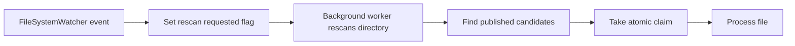

# Using FileSystemWatcher Safely - Lost Events, Duplicate Notifications, and Reliable Completion Detection

`FileSystemWatcher` is the obvious first choice when you want to monitor file changes on Windows from .NET.  
But if you treat `Created` or `Changed` as a completion signal, you will quickly run into lost events, duplicate notifications, or half-written files being processed as if they were complete.

## Contents

1. [Short version](#1-short-version)
2. [Common misunderstandings](#2-common-misunderstandings)
3. [Anti-patterns](#3-anti-patterns)
4. [Best practices](#4-best-practices)
5. [A safer processing model](#5-a-safer-processing-model)
6. [Summary](#6-summary)

---

## 1. Short version

- `FileSystemWatcher` events are **signs of change**, not proof of completion
- `Created`, `Changed`, and `Renamed` may arrive multiple times, in surprising order, or be lost during overflow
- Event handlers should stay light and usually only request a rescan
- Completion should be expressed explicitly through patterns such as `temp -> close -> rename` or `done` / manifest files
- If multiple workers exist, the receiver must take an **atomic claim** before processing
- Increasing `InternalBufferSize` helps only a little; robust recovery still depends on **full rescan + idempotency**

## 2. Common misunderstandings

- treating `Created` as a completion event
- trusting the count and order of `Changed`
- assuming overflow only loses "one event"

The safer mental model is that **notifications are hints, not truth**.

## 3. Anti-patterns

- doing real processing inside the event handler
- rebuilding "true state" only from the event stream
- treating "no more changes for 10 seconds" as completion
- assuming `InternalBufferSize` solves the design
- logging `Error` and ignoring recovery

## 4. Best practices

### Fold all notifications into "rescan requested"

### Make completion explicit on the sender side

The receiver becomes much simpler if the sender publishes only complete files.

### Use atomic claims on the receiver side

Do not just *see* a file and assume it is yours. Reserve it first.

### Perform full rescan on startup, overflow, and reconnect

A watcher helps you react quickly, but the rescan is what restores correctness.

### Assume idempotency

A safe receiver must survive duplicate work requests, rescans, and ambiguous recovery paths.

## 5. A safer processing model

The safer pattern is:

1. use `FileSystemWatcher` only to request work
2. let a worker rescan the directory
3. consider only files that satisfy your explicit completion rule
4. atomically claim one file
5. process it
6. archive it or move it to an error path

## 6. Summary

`FileSystemWatcher` is useful, but it is not a transaction log.  
If you use it as a *hint* and pair it with rescans, atomic claims, and idempotent receivers, it becomes a reliable part of a file-integration design.
