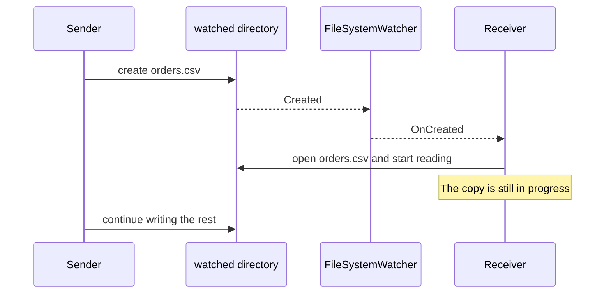
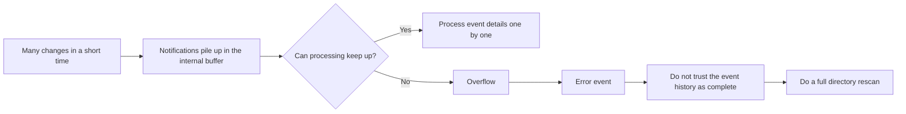
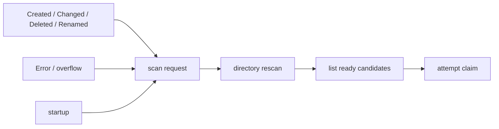
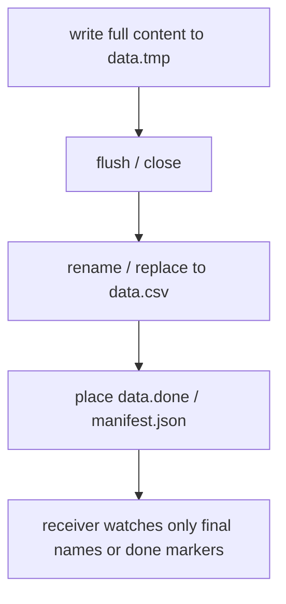
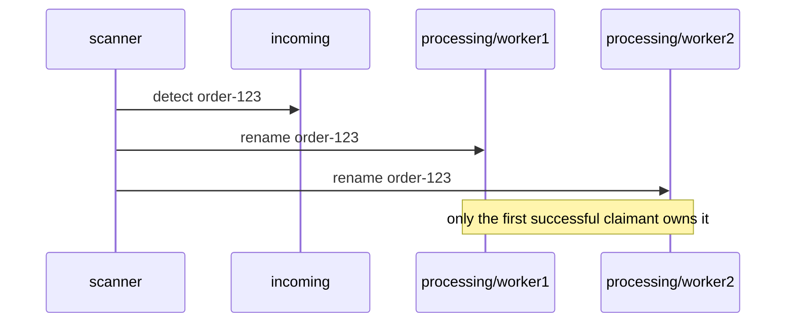

`FileSystemWatcher` is one of the first APIs people reach for when monitoring file changes on Windows from .NET.
But if you use `Created` or `Changed` as if they were a direct completion signal, it is very easy to run into lost events, duplicate notifications, and the classic problem of reading a file while it is still half-written.

This article organizes how to use `FileSystemWatcher` safely, mainly in the context of file-based integration on Windows with .NET.
It also connects to the thinking in [Safe File Integration Locking - Best Practices for File Locks, Atomic Claims, and Idempotent Processing](https://comcomponent.com/blog/2026/03/07/001-file-integration-locking-best-practices-komurasoft-style/).

`FileSystemWatcher` is useful.
It can give you events for create, change, delete, and rename.
But if you mistake those events for "truth" or "completion," trouble arrives very easily.

For example:

- `Created` may fire before a file copy is finished
- `Changed` may come more than once
- a burst of changes can overflow the internal buffer and lose event detail

So the core design idea is this:

- notification is a trigger
- the truth is a directory rescan
- ownership comes from an atomic claim
- the final safety net is idempotency

This article organizes the common traps around `FileSystemWatcher` from that point of view.

## Contents

1. [Short version](#1-short-version)
2. [Common misunderstanding patterns when using `FileSystemWatcher`](#2-common-misunderstanding-patterns-when-using-filesystemwatcher)
   - [2.1. Treating `Created` as a completion signal](#21-treating-created-as-a-completion-signal)
   - [2.2. Trusting the count and order of `Changed`](#22-trusting-the-count-and-order-of-changed)
   - [2.3. Losing changes because the internal buffer overflows](#23-losing-changes-because-the-internal-buffer-overflows)
3. [Anti-patterns](#3-anti-patterns)
   - [3.1. Doing the real work directly inside the event handler](#31-doing-the-real-work-directly-inside-the-event-handler)
   - [3.2. Trying to reconstruct truth from the event stream itself](#32-trying-to-reconstruct-truth-from-the-event-stream-itself)
   - [3.3. Treating "no more `Changed`" as completion](#33-treating-no-more-changed-as-completion)
   - [3.4. Thinking the problem is solved just by increasing `InternalBufferSize`](#34-thinking-the-problem-is-solved-just-by-increasing-internalbuffersize)
   - [3.5. Logging `Error` and then ignoring it](#35-logging-error-and-then-ignoring-it)
4. [Best practices](#4-best-practices)
   - [4.1. Fold all notifications into a "rescan request"](#41-fold-all-notifications-into-a-rescan-request)
   - [4.2. Make completion explicit on the sender side](#42-make-completion-explicit-on-the-sender-side)
   - [4.3. Take atomic claims on the receiver side](#43-take-atomic-claims-on-the-receiver-side)
   - [4.4. Do full rescans on startup, overflow, and reconnection](#44-do-full-rescans-on-startup-overflow-and-reconnection)
   - [4.5. Assume idempotency from the start](#45-assume-idempotency-from-the-start)
5. [Pseudo-code excerpts](#5-pseudo-code-excerpts)
   - [5.1. A typical failure pattern](#51-a-typical-failure-pattern)
   - [5.2. A healthier direction (roughly)](#52-a-healthier-direction-roughly)
6. [Rough rule-of-thumb guide](#6-rough-rule-of-thumb-guide)
7. [Summary](#7-summary)
8. [References](#8-references)

* * *

## 1. Short version

- `FileSystemWatcher` events are **not completion notifications**. They are only signs that something changed.
- `Created`, `Changed`, and `Renamed` can be duplicated, can arrive in surprising orders, and can be partially lost during overflow
- It is more stable if event handlers avoid heavy work and only request a rescan
- Completion should be made **explicit** with sender-side patterns such as `temp -> close -> rename / replace` or `done` / manifest files
- If there are multiple workers, you need an **atomic claim** before reading
- `InternalBufferSize` tuning is only a support measure. In the end, full rescans and idempotency matter more

In other words, the safest way to treat `FileSystemWatcher` is **not as a source of truth**, but as a source of "something happened, go look again."

## 2. Common misunderstanding patterns when using `FileSystemWatcher`

### 2.1. Treating `Created` as a completion signal

This is the clearest trap.
When a file is copied or transferred, `Created` can fire the moment the file name becomes visible, even though the content is still being written.



`Created` may mean "the name is visible," but it does **not** mean "the file is ready to read."

### 2.2. Trusting the count and order of `Changed`

`Changed` is not guaranteed to fire exactly once.
Even a normal save operation can appear as several events.
Antivirus or indexing software can also generate extra activity that you see as more changes.

So assumptions like:

- "`Changed` once means complete"
- "`Renamed` means nothing else will touch it"

are very fragile.

### 2.3. Losing changes because the internal buffer overflows

`FileSystemWatcher` uses an internal buffer.
When many changes happen in a short burst, that buffer can overflow and you lose per-event detail.



The important point is that this is not just "one lost event."
Once overflow happens, the integrity of the event stream itself becomes questionable.

## 3. Anti-patterns

### 3.1. Doing the real work directly inside the event handler

This makes the event responsible for completion judgment and ownership at the same time.

```csharp
watcher.Created += (_, e) =>
{
    using var stream = File.OpenRead(e.FullPath);
    Import(stream); // the file may still be incomplete
};

watcher.Error += (_, e) =>
{
    Console.WriteLine(e.GetException()); // only logs
};
```

The two problems here are:

- the file may not be complete yet
- there is no recovery path when overflow or watcher failure occurs

### 3.2. Trying to reconstruct truth from the event stream itself

A design like "add to a dictionary on `Created`, update it on `Changed`, remove it on `Deleted`, replace keys on `Renamed`" looks neat at first.
But once duplicates, reordering, overflow, and outside interference appear, the state model quickly becomes unreliable.

In file-based integration, what matters is not recreating a perfect event history.
What matters is correctly finding the items that are safe to process **right now**.

### 3.3. Treating "no more `Changed`" as completion

This has the same smell as "if the file size stops moving, it must be done."
It is still a guess.

```csharp
if (lastChangedAt + TimeSpan.FromSeconds(10) < DateTime.UtcNow)
{
    return Ready;
}
```

This gets into trouble when:

- a large file copy pauses temporarily
- the sender writes in multiple phases
- network share behavior delays notifications
- another process changes attributes or timestamps afterward

Completion is much stronger when it is **explicit** instead of guessed.

### 3.4. Thinking the problem is solved just by increasing `InternalBufferSize`

Tuning `InternalBufferSize` matters, but it is not the core of the design.

- the default is `8192` bytes
- it cannot be smaller than `4096`
- it cannot exceed `64 KB`
- it consumes non-paged memory

So even if you raise it to `64 KB`, a big enough burst can still overflow it.
And it does absolutely nothing to solve the "completion signal vs change hint" problem.

Before raising it, it is often more valuable to:

- narrow your `Filter` / `Filters`
- minimize `NotifyFilter`
- avoid turning `IncludeSubdirectories` on casually
- keep event handlers light
- build in full rescans and idempotency

### 3.5. Logging `Error` and then ignoring it

`Error` is not the kind of event you should shrug off.
It is where overflow and watcher-level trouble show up.

```csharp
watcher.Error += (_, e) =>
{
    _logger.LogError(e.GetException(), "watcher error");
    // If it ends here, you detected trouble but never recovered
};
```

At minimum, you usually need:

- a full rescan request
- watcher recreation if the underlying watch is no longer trustworthy
- idempotent behavior so repeated processing is safe

## 4. Best practices

### 4.1. Fold all notifications into a "rescan request"

It is usually easier not to connect `Created`, `Changed`, `Deleted`, `Renamed`, and `Error` directly to separate business behavior.
Instead, fold them all into one kind of signal:

> "go look again"



Practical implementation points:

- event handlers usually do nothing more than set `dirty = true` and signal
- put the actual scanning in one worker
- if events burst, coalesce them for 100-300 ms and scan once
- if another notification arrives during a scan, run one more scan afterward

That way, whether five events or fifty events arrive, the final behavior stays:

> scan the real directory state and find the ready items

### 4.2. Make completion explicit on the sender side

If you control the sending side as well, it is much better to improve the publish protocol than to invent completion heuristics on the `FileSystemWatcher` side.

The standard approach is still:

- write the complete content to a temp name
- close it
- rename / replace it into the final name on the same filesystem
- optionally place a `done` / manifest file last



This is very effective.
`FileSystemWatcher` should be thought of as a way to detect **already-explicit completion earlier**, not as a tool for inventing completion rules on its own.

### 4.3. Take atomic claims on the receiver side

Even if a rescan finds a ready candidate, going straight to "open and process it" allows multiple workers to take the same file.
So the receiver should take an atomic claim first.



As in the previous file-integration article, an `incoming -> processing/<worker>/` rename is a very clear claim pattern.
It is especially nice when the payload and metadata are grouped as a bundle directory:

```text
incoming/
  order-123/
    payload.csv
    manifest.json
```

Then the whole bundle can be claimed in one rename.

### 4.4. Do full rescans on startup, overflow, and reconnection

This is extremely important.

- files that already existed before startup will not generate fresh events
- after overflow, the event history is no longer trustworthy
- in network-share or disconnect/reconnect scenarios, "something happened while watching was broken" should be assumed

So full rescans should happen at least:

- on startup
- when `Error` occurs
- after recreating the watcher
- optionally at a periodic safety interval

The design idea is:

> the watcher gives hints about change  
> the rescan restores correctness

### 4.5. Assume idempotency from the start

If you use `FileSystemWatcher` safely, the same logical item may be discovered more than once.
That is not a bug. It is the design becoming robust.

Typical measures include:

- putting an `IdempotencyKey` in the manifest
- suppressing side effects if the item was already processed
- checking against archived state / DB records / sent markers
- treating full rescans as "it is safe to look again"

Trying to force exactly-once behavior only from the event stream is usually painful.
At-least-once plus idempotency is much more practical.

## 5. Pseudo-code excerpts

### 5.1. A typical failure pattern

```csharp
using var watcher = new FileSystemWatcher(incomingDir)
{
    Filter = "*.csv",
    IncludeSubdirectories = false,
    EnableRaisingEvents = true,
    InternalBufferSize = 64 * 1024
};

watcher.Created += (_, e) =>
{
    // Incorrectly treating Created as completion
    ProcessFile(e.FullPath);
};

watcher.Changed += (_, e) =>
{
    // Another change event? Just process again
    ProcessFile(e.FullPath);
};

watcher.Error += (_, e) =>
{
    Console.WriteLine(e.GetException());
    // No recovery
};
```

This has four clear problems:

- the event stream is directly tied to business processing
- there is no real completion rule
- overflow does not trigger a full rescan
- there is no safety against repeated processing

### 5.2. A healthier direction (roughly)

```csharp
private readonly SemaphoreSlim _scanSignal = new(0, int.MaxValue);
private int _scanRequested = 0;
private int _fullRescanRequested = 0;

void OnAnyChange(object? sender, FileSystemEventArgs e)
{
    RequestScan(full: false);
}

void OnRenamed(object? sender, RenamedEventArgs e)
{
    RequestScan(full: false);
}

void OnError(object? sender, ErrorEventArgs e)
{
    Log(e.GetException());
    RequestScan(full: true);
}

void RequestScan(bool full)
{
    if (full)
    {
        Interlocked.Exchange(ref _fullRescanRequested, 1);
    }

    if (Interlocked.Exchange(ref _scanRequested, 1) == 0)
    {
        _scanSignal.Release();
    }
}

async Task ScannerLoopAsync(CancellationToken cancellationToken)
{
    RequestScan(full: true); // startup scan

    while (!cancellationToken.IsCancellationRequested)
    {
        await _scanSignal.WaitAsync(cancellationToken);

        await Task.Delay(TimeSpan.FromMilliseconds(200), cancellationToken); // coalesce bursts

        Interlocked.Exchange(ref _scanRequested, 0);
        bool full = Interlocked.Exchange(ref _fullRescanRequested, 0) == 1;

        foreach (var bundle in EnumerateReadyBundles(incomingDir, full))
        {
            var claimedPath = Path.Combine(processingDir, bundle.Name);

            if (!TryClaimByRename(bundle.Path, claimedPath))
            {
                continue; // another worker claimed it first
            }

            var manifest = ReadManifest(Path.Combine(claimedPath, "manifest.json"));

            if (AlreadyProcessed(manifest.IdempotencyKey))
            {
                MoveToArchive(claimedPath, archiveDir);
                continue;
            }

            ProcessBundle(claimedPath);
            RecordProcessed(manifest.IdempotencyKey);
            MoveToArchive(claimedPath, archiveDir);
        }

        if (Volatile.Read(ref _scanRequested) == 1)
        {
            _scanSignal.Release(); // do not lose a notification that arrived during scanning
        }
    }
}
```

The important thing in this example is not the API detail, but the flow:

- fold notifications into scan requests
- scan the real filesystem state
- claim atomically
- check idempotency
- process, record, and archive

The watcher event itself is only a trigger.

## 6. Rough rule-of-thumb guide

- **Single receiver, sender side under your control**  
  Start with `temp -> close -> rename` and a startup scan. That already stabilizes a lot.

- **Multiple receiver workers**  
  Add an atomic claim rename such as `incoming -> processing`.

- **High-frequency notification bursts**  
  Narrow `Filter`, `NotifyFilter`, and `IncludeSubdirectories`, and keep handlers extremely light. Tune `InternalBufferSize` only after that.

- **Overflow is unacceptable**  
  Design around full rescans, and if even that is not enough, do not bet everything on `FileSystemWatcher` alone. On Windows, the USN change journal may become relevant.

- **You cannot control how the sender publishes files**  
  Before inventing heuristics, see whether you can negotiate a better publish protocol. If not, lower the guarantee level and design the receiver to survive repeated observation safely.

## 7. Summary

`FileSystemWatcher` is not a transaction log.
It is a useful notification mechanism, but it becomes robust only when paired with:

- rescans
- explicit completion rules
- atomic claims
- idempotency

If you treat it as "the truth," you will usually get hurt.
If you treat it as "a hint to go check the real filesystem state again," it becomes a much stronger building block.

## 8. References

* [FileSystemWatcher Class](https://learn.microsoft.com/en-us/dotnet/api/system.io.filesystemwatcher)
* [Create, rename, and replace file patterns on Windows](https://learn.microsoft.com/en-us/windows/win32/fileio/file-management-functions)
