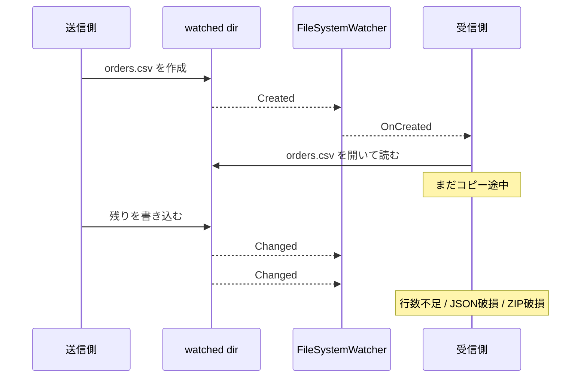
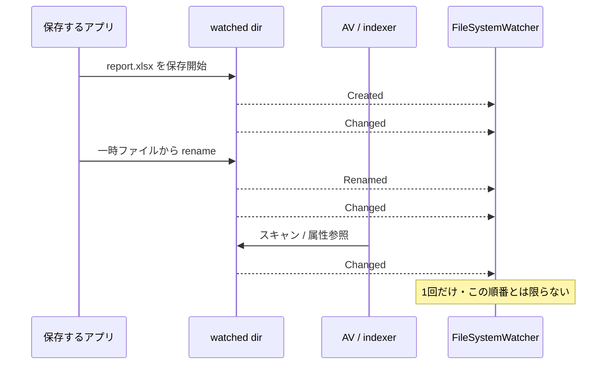
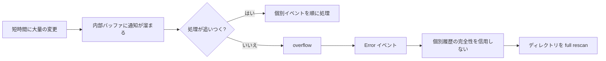
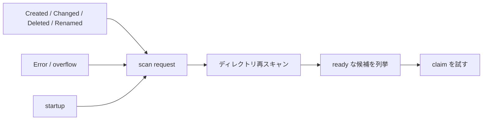
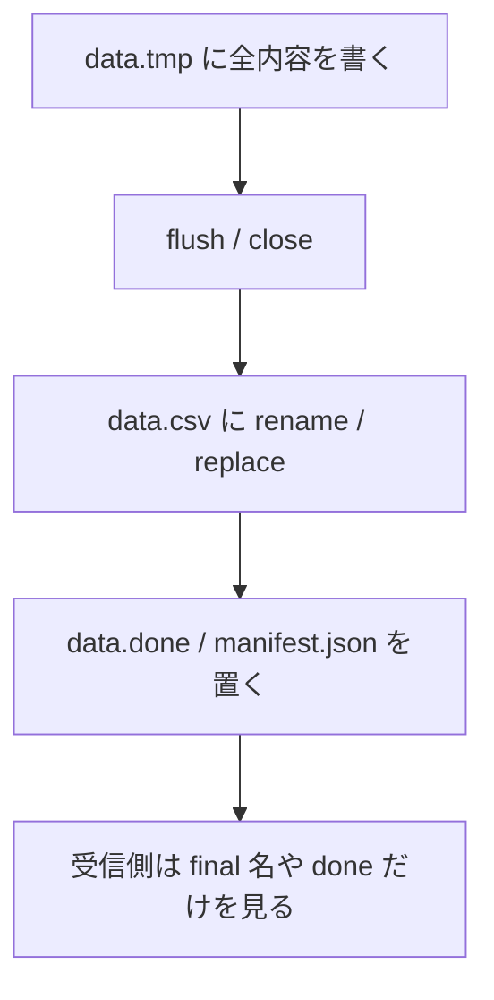
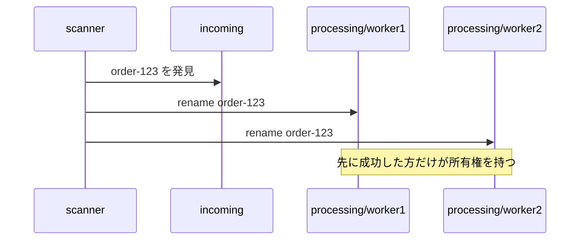

`FileSystemWatcher` は、Windows 上の .NET でファイル変更を監視するときにまず候補になる API です。
ただし、`Created` や `Changed` をそのまま完了通知だと思って使うと、取りこぼし、重複通知、途中ファイルの誤読でかなり普通に事故ります。

この記事では、`FileSystemWatcher` の使い方と注意点を、主に Windows 上の .NET によるファイル連携を前提に整理します。
あわせて、前提となる排他制御の考え方は [ファイル連携の排他制御の基礎知識 - ファイルロックと原子的 claim のベストプラクティス](https://comcomponent.com/blog/2026/03/07/001-file-integration-locking-best-practices-合同会社小村ソフト-style/) も参照できる形にしています。

`FileSystemWatcher` は便利です。ファイルやディレクトリの作成、変更、削除、名前変更をイベントで受け取れます。
ただし、ここでイベントを「完了通知」だと思うと、かなり普通に事故ります。

たとえば、ファイルのコピー中に `Created` が先に飛ぶことがあります。`Changed` は 1 回とは限りません。短時間に変更が集中すると内部バッファがあふれて、個別の変更を取りこぼすこともあります。

なので、設計の芯はこうです。

- 通知はきっかけ
- 真実はディレクトリ再スキャン
- 所有権は原子的な claim
- 最後は idempotency で受け止める

この記事では、この考え方で `FileSystemWatcher` をファイル連携に組み込むときのはまりどころを整理します。

## 目次

1. まず結論（ひとことで）
2. `FileSystemWatcher` で起きる勘違いパターン（図）
   - 2.1. `Created` を完了通知だと思う
   - 2.2. `Changed` の回数と順序を信じる
   - 2.3. 内部バッファあふれで変更を失う
3. アンチパターン
   - 3.1. イベントハンドラの中でそのまま処理する
   - 3.2. イベント列から真実の状態を復元しようとする
   - 3.3. `Changed` が止まったら完了扱い
   - 3.4. `InternalBufferSize` を上げれば解決したと思う
   - 3.5. `Error` をログだけ出して無視する
4. ベストプラクティス
   - 4.1. 通知は「再スキャン要求」に畳む
   - 4.2. 完了条件は送信側で明示する
   - 4.3. 受信側は claim を原子的に取る
   - 4.4. startup / overflow / 再接続時は full rescan する
   - 4.5. idempotency を前提にする
5. 擬似コード（抜粋）
   - 5.1. 典型的な失敗パターン
   - 5.2. 正しい方向の例（雑に書くとこう）
6. ざっくり使い分け
7. まとめ
8. 参考資料

* * *

## 1. まず結論（ひとことで）

- `FileSystemWatcher` のイベントは、完了通知 ではなく 変化の気配 です
- `Created` / `Changed` / `Renamed` は、重複したり、想像と違う順序で来たり、overflow 時には取りこぼしたりします
- イベントハンドラでは重い処理をせず、再スキャン要求を積む だけにした方が安定します
- 完了判定は `temp -> close -> rename / replace` や `done` / manifest で 明示 するのが基本です
- 複数ワーカーがいるなら、読む前に claim を原子的に取る 必要があります
- `InternalBufferSize` の調整は補助です。最後は full rescan と idempotency が効きます

要するに、`FileSystemWatcher` を「真実の履歴ストリーム」として扱わないことです。
通知はあくまで、「そろそろ見に行け」の合図に留めた方が壊れにくくなります。

## 2. `FileSystemWatcher` の使い方で起きやすい勘違いパターン（図）

### 2.1. `Created` を完了通知だと思う

これがいちばん分かりやすい地雷です。
コピーや転送では、ファイルが 作られた瞬間 に `Created` が飛び、そのあとに 1 回以上の `Changed` が続くことがあります。



`Created` は「名前が見えた」を表しても、「もう読んでよい」を保証しません。
ここを同じ意味にすると、前回の記事の 2.1 を別ルートで踏むことになります。

### 2.2. `Changed` の回数と順序を信じる

`Changed` は 1 回だけ来るとは限りません。
移動や保存のような普通の操作でも、複数のイベントに分かれて見えることがあります。さらに、ウイルス対策ソフトやインデクサが触った分まで拾うこともあります。



「`Changed` が 1 回来たら完了」「`Renamed` の次はもう触られない」という期待は、だいぶ危ういです。

補足:

- ファイル rename で `Changed` が飛ぶことがあります
- `RenamedEventArgs.Name` は、OS 側で old/new の対応が取れないと `null` になりえます
- hidden file も無視されません。隠し temp 名だから見えないだろう、は通りません
- 監視しているディレクトリそのものを rename しても、その変更は通知されません

### 2.3. 内部バッファあふれで変更を失う

`FileSystemWatcher` には内部バッファがあります。
短時間に変更が集中すると、ここがあふれて個別通知を取りこぼします。



ここで大事なのは、「overflow が起きたら 1 件だけ失う」とは限らないことです。
個別イベント列の完全性そのものが怪しくなるので、素直に全体を見直したほうがよいです。

## 3. アンチパターン

### 3.1. イベントハンドラの中でそのまま処理する

これは、完了判定と所有権取得をイベントに背負わせすぎです。

```csharp
watcher.Created += (_, e) =>
{
    using var stream = File.OpenRead(e.FullPath);
    Import(stream); // まだコピー中かもしれない
};

watcher.Error += (_, e) =>
{
    Console.WriteLine(e.GetException()); // 出すだけ
};
```

問題は 2 つあります。

- `Created` の時点では内容が未完成かもしれない
- 失敗や overflow の回復が無い

イベントハンドラは、再スキャン要求を立ててすぐ返す くらいがちょうどよいです。
ここで重い I/O や DB 更新まで始めると、バースト時に自分で自分の首を絞めます。

### 3.2. イベント列から真実の状態を復元しようとする

「`Created` で辞書に追加、`Changed` で更新、`Deleted` で削除、`Renamed` でキー差し替え」という設計は、一見きれいです。
ただ、重複、分割、overflow、外乱が入ると、だんだん辻褄が怪しくなります。

```csharp
switch (e.ChangeType)
{
    case WatcherChangeTypes.Created:
        state[e.FullPath] = Pending;
        break;
    case WatcherChangeTypes.Changed:
        state[e.FullPath] = Modified;
        break;
    case WatcherChangeTypes.Deleted:
        state.Remove(e.FullPath);
        break;
}
```

この方向で頑張るより、その都度 ディスク上の現物 を再確認した方が強いです。
ファイル連携で重要なのは、イベント履歴の再現 ではなく、今この瞬間に処理してよい対象を正しく見つけること です。

### 3.3. `Changed` が止まったら完了扱い

前回の「ファイルサイズが止まったら完了」と同じ匂いのする設計です。
便利そうですが、推測で完了を決めています。

```csharp
if (lastChangedAt + TimeSpan.FromSeconds(10) < DateTime.UtcNow)
{
    return Ready;
}
```

これで困るのは、たとえば次のようなケースです。

- 大きいファイルのコピーが途中で一時停止する
- 送信側アプリが複数段階で保存する
- ネットワーク共有で通知が遅れて見える
- 外部プロセスがあとから属性や時刻を書き換える

完了は 推測 ではなく 明示 した方が安定します。

### 3.4. `InternalBufferSize` を上げれば解決したと思う

`InternalBufferSize` の調整は大事ですが、これは設計の本体ではありません。

- 既定値は `8192` バイト
- `4096` バイト未満にはできず、`64 KB` を超えることもできない
- バッファは non-paged memory を使うので、増やせば増やすほど気軽とは言えない

つまり、`64 KB` まで上げても、通知バーストがそれを超えたら終わりです。
しかも、完了通知かどうかの問題は 1 ミリも解決しません。

先にやるべきなのは、たとえば次です。

- `Filter` / `Filters` で監視対象を絞る
- `NotifyFilter` を必要最小限にする
- `IncludeSubdirectories` をむやみに `true` にしない
- イベントハンドラを軽くする
- full rescan と idempotency を入れる

### 3.5. `Error` をログだけ出して無視する

`Error` は「たまに出るけど気にしない」種類の通知ではありません。
buffer overflow や、監視継続に失敗した状況がここに出ます。

```csharp
watcher.Error += (_, e) =>
{
    _logger.LogError(e.GetException(), "watcher error");
    // ここで終わると、取りこぼしに気づいたのに回復しない
};
```

少なくとも必要なのは、次です。

- full rescan を要求する
- 監視継続が怪しいなら watcher の再生成も検討する
- 取りこぼし前提で idempotent に再処理できるようにする

## 4. ベストプラクティス

### 4.1. 通知は「再スキャン要求」に畳む

`Created` / `Changed` / `Deleted` / `Renamed` / `Error` を、それぞれ別々の業務処理に直結させない方が整理しやすいです。
まずは全部「見に行け」という 1 種類の信号に畳みます。



実装上のポイント:

- イベントハンドラでは `dirty = true` にして signal を出す程度にする
- 走査は 1 本の worker に寄せる
- バースト時は 100〜300ms ほどまとめてから 1 回走査する
- 走査中に追加通知が来たら、終わったあとにもう 1 回走査する

こうすると、イベントが 5 回来ても 50 回来ても、最終的にやることは「現物を見て ready なものを探す」に統一できます。

### 4.2. 完了条件は送信側で明示する

自分が送信側も握れるなら、`FileSystemWatcher` 側で完了判定を頑張るより、公開プロトコルを直した方が効きます。

王道は、やはりこれです。

- `temp` 名に全内容を書く
- `close` する
- 同一ファイルシステム上で `rename / replace` する
- 必要なら `done` / manifest を最後に置く



前回の記事と同じですが、ここが本当に効きます。
`FileSystemWatcher` は完了を発明する道具ではなく、明示された完了を早めに見つける道具 と考えると整理しやすいです。

### 4.3. 受信側は claim を原子的に取る

再スキャンで ready な候補が見つかっても、そのまま読みに行くと複数ワーカーが同時に掴めます。
なので、処理前に claim を原子的に取ります。



前回の記事でも触れた通り、`incoming -> processing/<worker>/` の rename が分かりやすいです。
特に 本体 + manifest + 補助ファイル を 1 つのディレクトリにまとめておくと、bundle 単位で claim できるので楽です。

```text
incoming/
  order-123/
    payload.csv
    manifest.json
```

これなら、bundle directory を 1 回 rename するだけで所有権を取れます。

### 4.4. startup / overflow / 再接続時は full rescan する

これはかなり大事です。

- アプリ起動前から置かれていたファイルは、イベントでは拾えません
- overflow が起きたら、個別イベント列は信用しにくくなります
- ネットワーク共有や一時切断が絡むと、「その間の何か」が抜ける前提で見た方が安全です

なので、少なくとも次のタイミングでは full rescan を入れた方がよいです。

- 起動時
- `Error` 受信時
- watcher を作り直した直後
- 定期的な保険として一定間隔ごと

ここでの思想は、「watcher は差分のヒント、再スキャンは整合性の回復」です。

### 4.5. idempotency を前提にする

`FileSystemWatcher` を使うと、同じ対象を複数回見に行くことになります。
これはバグではなく、設計として受け入れた方が安定します。

たとえば次のようにします。

- manifest に `IdempotencyKey` を入れる
- すでに処理済みなら副作用を再実行しない
- archive 済み / DB 記録済み / 送信済み を照合できるようにする
- full rescan しても「同じものをもう一度安全に見る」だけにする

exactly-once をイベントだけで作ろうとすると、だいぶ苦しくなります。
at-least-once を受け入れて、最後を idempotency で締めた方が実務では強いです。

## 5. 擬似コード（抜粋）

### 5.1. 典型的な失敗パターン

```csharp
using var watcher = new FileSystemWatcher(incomingDir)
{
    Filter = "*.csv",
    IncludeSubdirectories = false,
    EnableRaisingEvents = true,
    InternalBufferSize = 64 * 1024
};

watcher.Created += (_, e) =>
{
    // Created = 完了通知、と思い込んでいる
    ProcessFile(e.FullPath);
};

watcher.Changed += (_, e) =>
{
    // 何度も来るので、とりあえずもう一回処理
    ProcessFile(e.FullPath);
};

watcher.Error += (_, e) =>
{
    Console.WriteLine(e.GetException());
    // 回復しない
};
```

問題点は 4 つあります。

- `Created` / `Changed` をそのまま業務処理に結びつけている
- 完了判定が無い
- overflow 時に full rescan しない
- 同じファイルを何回処理しても止める仕組みが無い

### 5.2. 正しい方向の例（雑に書くとこう）

```csharp
private readonly SemaphoreSlim _scanSignal = new(0, int.MaxValue);
private int _scanRequested = 0;
private int _fullRescanRequested = 0;

void OnAnyChange(object? sender, FileSystemEventArgs e)
{
    RequestScan(full: false);
}

void OnRenamed(object? sender, RenamedEventArgs e)
{
    RequestScan(full: false);
}

void OnError(object? sender, ErrorEventArgs e)
{
    Log(e.GetException());
    RequestScan(full: true);
}

void RequestScan(bool full)
{
    if (full)
    {
        Interlocked.Exchange(ref _fullRescanRequested, 1);
    }

    if (Interlocked.Exchange(ref _scanRequested, 1) == 0)
    {
        _scanSignal.Release();
    }
}

async Task ScannerLoopAsync(CancellationToken cancellationToken)
{
    RequestScan(full: true); // startup scan

    while (!cancellationToken.IsCancellationRequested)
    {
        await _scanSignal.WaitAsync(cancellationToken);

        // 通知バーストを少しまとめる
        await Task.Delay(TimeSpan.FromMilliseconds(200), cancellationToken);

        Interlocked.Exchange(ref _scanRequested, 0);
        bool full = Interlocked.Exchange(ref _fullRescanRequested, 0) == 1;

        foreach (var bundle in EnumerateReadyBundles(incomingDir, full))
        {
            var claimedPath = Path.Combine(processingDir, bundle.Name);

            if (!TryClaimByRename(bundle.Path, claimedPath))
            {
                continue; // 他ワーカーが先に取得
            }

            var manifest = ReadManifest(Path.Combine(claimedPath, "manifest.json"));

            if (AlreadyProcessed(manifest.IdempotencyKey))
            {
                MoveToArchive(claimedPath, archiveDir);
                continue;
            }

            ProcessBundle(claimedPath);
            RecordProcessed(manifest.IdempotencyKey);
            MoveToArchive(claimedPath, archiveDir);
        }

        if (Volatile.Read(ref _scanRequested) == 1)
        {
            _scanSignal.Release(); // 走査中に来た通知を取りこぼさない
        }
    }
}
```

この例で大事なのは、細かい API ではなく流れです。

- 通知は scan request に畳む
- 走査で ready を見つける
- claim を取る
- idempotency を確認する
- 処理して記録し、archive に動かす

`FileSystemWatcher` のイベントは、ここでは trigger でしかありません。

## 6. ざっくり使い分け

- 単一受信ワーカー / 自分で送信側も直せる  
  まずは `temp -> close -> rename` と startup scan。これだけでもかなり安定します。

- 複数受信ワーカーがいる  
  上に加えて `incoming -> processing` の claim rename を入れた方がよいです。

- 高頻度で通知が多い  
  `Filter` / `NotifyFilter` / `IncludeSubdirectories` を絞り、イベントハンドラを極小化します。`InternalBufferSize` の調整はそのあとです。

- overflow して困る / 取りこぼしが許されない  
  full rescan を前提にし、それでも厳しいなら `FileSystemWatcher` 単体に賭けない方がよいです。Windows 限定なら USN change journal も選択肢になります。

- 相手システムの書き方を制御できない  
  完了条件を推測で補うより、公開プロトコルを交渉できないかを先に考えた方が安全です。無理なら、保証水準を下げた上で idempotent に受ける設計に寄せます。

最後の 2 項目は、わりと大事な撤退判断です。
`FileSystemWatcher` は便利ですが、万能の真実検出器ではありません。

## 7. まとめ

押さえたい点は次です。

排他制御と完了判定の本体:

- `FileSystemWatcher` は 完了通知の代わり ではない
- 真実はイベント列ではなく、いまディスク上に見えている状態
- 完了は `temp -> close -> rename / replace` や `done` / manifest で明示する
- 所有権は claim を原子的に取って決める

避けたい設計:

- `Created` で即処理
- `Changed` の回数や順序を信じる
- `Changed` が止まったら完了扱い
- `InternalBufferSize` だけで安心する
- `Error` を見たのに回復しない

実務で効く対策:

- 通知は再スキャン要求に畳む
- startup / overflow / 再接続で full rescan
- claim rename で所有権を取る
- idempotency で重複と再走査を受け止める

つまり、`FileSystemWatcher` では「イベントを受けたこと」と「処理してよいこと」を同じにしないのがコツです。
ここを分けるだけで、たまにだけ壊れるタイプの監視処理がかなり減ります。

## 8. 参考資料

- [関連記事: ファイル連携の排他制御の基礎知識 - ファイルロックと原子的 claim のベストプラクティス](https://comcomponent.com/blog/2026/03/07/001-file-integration-locking-best-practices-合同会社小村ソフト-style/)
- [FileSystemWatcher Class (System.IO)](https://learn.microsoft.com/en-us/dotnet/api/system.io.filesystemwatcher?view=net-10.0)
- [System.IO.FileSystemWatcher class - .NET](https://learn.microsoft.com/en-us/dotnet/fundamentals/runtime-libraries/system-io-filesystemwatcher)
- [FileSystemWatcher.InternalBufferSize Property (System.IO)](https://learn.microsoft.com/en-us/dotnet/api/system.io.filesystemwatcher.internalbuffersize?view=net-10.0)
- [FileSystemWatcher.Error Event (System.IO)](https://learn.microsoft.com/en-us/dotnet/api/system.io.filesystemwatcher.error?view=net-10.0)
- [FileSystemWatcher.Created Event (System.IO)](https://learn.microsoft.com/en-us/dotnet/api/system.io.filesystemwatcher.created?view=net-10.0)
- [FileSystemWatcher.Changed Event (System.IO)](https://learn.microsoft.com/en-us/dotnet/api/system.io.filesystemwatcher.changed?view=net-10.0)
- [FileSystemWatcher.Renamed Event (System.IO)](https://learn.microsoft.com/en-us/dotnet/api/system.io.filesystemwatcher.renamed?view=net-10.0)
- [Change Journals - Win32 apps](https://learn.microsoft.com/en-us/windows/win32/fileio/change-journals)
