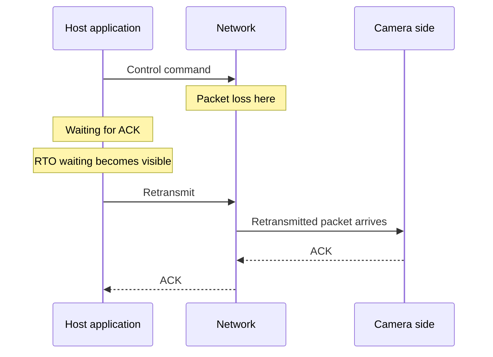

# When Industrial Camera TCP Traffic Stops for Several Seconds - Retransmissions, RTO, and RFC1323 Timestamps

In industrial camera systems and equipment control, the most painful failures are often the ones where the average is fine but communication **occasionally freezes for several seconds**.

In the case discussed here, the real problem was not an application pause at all.  
It was **TCP retransmission waiting caused by packet loss**.  
Enabling the TCP timestamps option described historically as RFC 1323 helped reduce the visible wait in this system.

## Contents

1. [Short version](#1-short-version)
2. [How the symptom looked](#2-how-the-symptom-looked)
3. [What was actually happening](#3-what-was-actually-happening)
4. [What we checked in the investigation](#4-what-we-checked-in-the-investigation)
5. [Why timestamps helped](#5-why-timestamps-helped)
6. [What we actually changed](#6-what-we-actually-changed)
7. [Summary](#7-summary)

---

## 1. Short version

- A rare multi-second pause in TCP traffic can be **retransmission waiting after packet loss**, not an application stall
- If packet capture shows retransmissions and the pause duration matches RTO-style waiting, that is a strong clue
- TCP timestamps help with RTT measurement and remove ambiguity around retransmitted segments
- This does **not** magically remove packet loss itself; physical links, switches, drivers, and device behavior still matter

## 2. How the symptom looked

The difficult part was that the application did not look fully dead:

- the process was still alive
- CPU usage was not pinned
- the UI was not obviously frozen
- only the request / response communication to the camera occasionally paused for several seconds

## 3. What was actually happening

From the application's point of view, it looked like a several-second stop.  
From TCP's point of view, it was simply waiting for the retransmission timer.

## 4. What we checked in the investigation

- exclude obvious in-process causes such as UI stalls, CPU spikes, and GC pressure
- capture packets and confirm retransmissions during the pause window
- inspect SYN / SYN-ACK to verify whether timestamps are actually negotiated

The practical lesson is simple: when the problem lives on the wire, application logs alone are not enough.

## 5. Why timestamps helped

The timestamps option mainly supports:

- RTTM (round-trip time measurement)
- PAWS (protection against wrapped sequence numbers)

In this case the important part was RTT measurement.  
With timestamps, ACKs carry enough information to identify which transmission is being acknowledged more precisely, which can help the stack avoid holding on to stale conservative RTO estimates for longer than necessary.

## 6. What we actually changed

1. enable TCP timestamps on the relevant side
2. confirm `TSopt` in SYN / SYN-ACK on packet capture
3. compare the pause pattern before and after the change

If that still does not help, the next places to inspect are the physical link, intermediate switches, NIC settings, drivers, and buffering behavior.

## 7. Summary

Rare multi-second communication stalls are often easier to understand once you stop looking only at application logs and start looking at packets.

If the pause is really a TCP retransmission wait, you want to prove that first.  
Only then can you decide whether the next step is timestamps, physical-network investigation, buffering changes, or application-level redesign.
