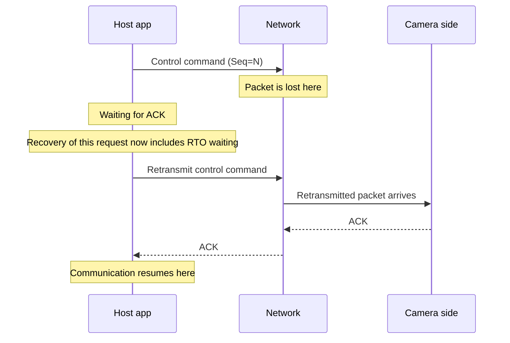
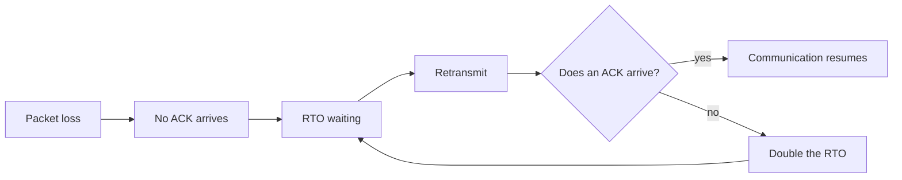
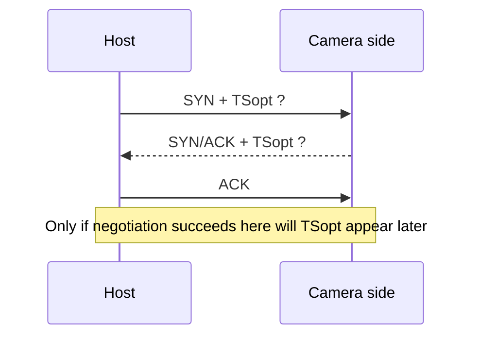
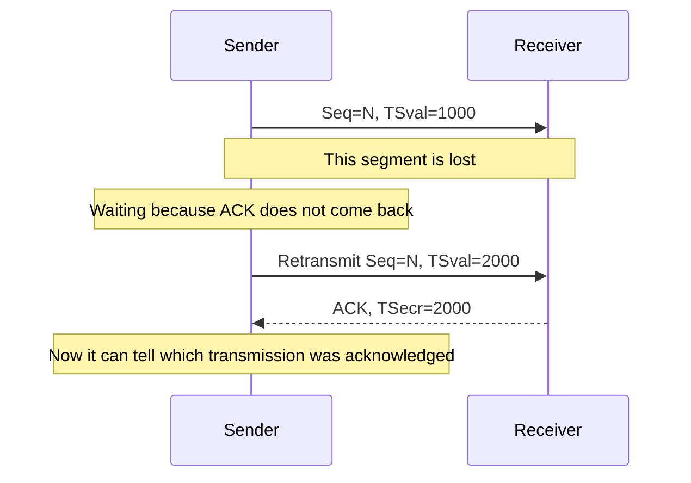

# When Industrial Camera TCP Traffic Stops for Several Seconds - How to Narrow Down Retransmission Waits with RFC1323 Timestamps

In industrial camera systems and equipment-control communication, the most painful failures are often the ones where the average is fast but **it occasionally stops for several seconds**.
The reproduction rate is low, so UI, threads, GC, the camera SDK, the NIC, and the switch all start to look a little suspicious at the same time.

The case here was a rare several-second pause in TCP communication between a host application and an industrial camera.
After investigation, the real cause was not that the application stopped.  
It was **TCP retransmission waiting caused by packet loss**.
And in this environment, enabling the RFC1323-style timestamp option (organized today under RFC 7323) helped reduce that visible wait.

Specific product names, topology, and exact numbers are generalized here, but the reasoning is directly reusable in real work.

## Contents

1. [Short version](#1-short-version)
2. [How the symptom looked](#2-how-the-symptom-looked)
   - [2.1. The app stays alive, but only the response pauses for several seconds](#21-the-app-stays-alive-but-only-the-response-pauses-for-several-seconds)
   - [2.2. Because it is low-frequency, logs alone hide it](#22-because-it-is-low-frequency-logs-alone-hide-it)
3. [What was actually happening](#3-what-was-actually-happening)
   - [3.1. Packet loss led into retransmission waiting](#31-packet-loss-led-into-retransmission-waiting)
   - [3.2. The multi-second pauses matched the shape of RTO waiting](#32-the-multi-second-pauses-matched-the-shape-of-rto-waiting)
4. [What we checked in the investigation](#4-what-we-checked-in-the-investigation)
   - [4.1. First remove in-process causes](#41-first-remove-in-process-causes)
   - [4.2. Confirm retransmissions through packet capture](#42-confirm-retransmissions-through-packet-capture)
   - [4.3. Inspect the negotiated TCP options](#43-inspect-the-negotiated-tcp-options)
5. [Why RFC1323 timestamps helped](#5-why-rfc1323-timestamps-helped)
   - [5.1. Timestamps exist for RTTM and PAWS](#51-timestamps-exist-for-rttm-and-paws)
   - [5.2. They remove RTT ambiguity during retransmission](#52-they-remove-rtt-ambiguity-during-retransmission)
   - [5.3. Why they reduced the wait in this case](#53-why-they-reduced-the-wait-in-this-case)
6. [What we actually changed](#6-what-we-actually-changed)
   - [6.1. Enable timestamps](#61-enable-timestamps)
   - [6.2. Confirm TSopt in SYN / SYN-ACK](#62-confirm-tsopt-in-syn--syn-ack)
   - [6.3. Where to look if that still does not help](#63-where-to-look-if-that-still-does-not-help)
7. [What to inspect in Wireshark](#7-what-to-inspect-in-wireshark)
8. [Rough rule-of-thumb guide](#8-rough-rule-of-thumb-guide)
9. [Summary](#9-summary)
10. [References](#10-references)

* * *

## 1. Short version

- A rare multi-second pause in TCP communication may be **retransmission waiting after packet loss**, not an application stall
- If packet capture shows `Retransmission` together with large time gaps, and the pause duration matches the shape of RTO waiting, that is a strong clue
- The TCP timestamps option exists for RTT measurement and PAWS, and it also removes RTT ambiguity around retransmitted segments
- In this case, enabling RFC1323-style timestamps reduced the time during which RTO estimation remained too conservative, so the visible several-second waits became much smaller
- But this is **not magic that removes packet loss itself**. Physical links, NICs, switches, intermediate devices, drivers, and buffering design still need separate review

In short, if the true cause of "it occasionally stops for several seconds" is time spent waiting inside TCP, application-level retries alone miss the center of the problem.
It is usually faster to look at the wire first and confirm whether the pause is really retransmission waiting.

## 2. How the symptom looked

### 2.1. The app stays alive, but only the response pauses for several seconds

The first confusing part was that the whole application did not look dead.

- the UI was not completely frozen
- the process had not crashed
- CPU usage was not pinned
- but responses to camera-control commands **occasionally** disappeared for several seconds

That makes the symptom hard to distinguish from application deadlocks or infinite loops.
In equipment control, even one several-second pause feels like a line stop, so the average being good does not help much in the field.

### 2.2. Because it is low-frequency, logs alone hide it

This type of failure is especially annoying because it is infrequent.
It may happen once an hour, once half a day, or only when conditions line up.

When you rely only on logs, things often look like this:

- the application log shows "sent" and then "nothing came back"
- the receiver side looks like "nothing arrived"
- unrelated events happening in the same time window make the blame scatter

When that happens, trying to reconstruct the causal chain only from app logs turns into a swamp very quickly.
Dropping one layer lower into the communication itself is often much faster.

## 3. What was actually happening

### 3.1. Packet loss led into retransmission waiting

The basic story was simple.
A packet was lost somewhere in the path, the sender waited for an ACK, none arrived, so it waited for RTO expiry and retransmitted.



From the application's point of view, it looked like "the app stopped for several seconds."
From TCP's point of view, it was simply "still waiting because the ACK has not arrived yet."

This request / response control channel exchanged small messages and did not have a large amount of in-flight unacknowledged data.
So instead of collecting enough duplicate ACKs to trigger fast retransmit, it was easier for **RTO waiting** to become the visible problem.

### 3.2. The multi-second pauses matched the shape of RTO waiting

TCP retransmission waiting is conservative.
RFC 6298 sets the initial RTO baseline at 1 second, rounds smaller results up to that minimum, and doubles the wait after timeouts.



So even if you would prefer a few hundred milliseconds, poor conditions can make the visible wait look like 1 second, then 2, then 4.
The pattern in this case matched that shape very closely.

## 4. What we checked in the investigation

### 4.1. First remove in-process causes

Before deciding it was TCP, the typical in-process suspects were removed first.

| What we checked | Why | Conclusion in this case |
| --- | --- | --- |
| UI thread / worker threads | to rule out deadlocks and mutual waits | not the main cause |
| CPU usage | to rule out pure high-load delay | CPU was not pinned during the pauses |
| GC / memory pressure | to rule out stop-the-world pauses | the pause pattern did not fit |
| camera SDK calls | to rule out internal SDK waiting | the wire-level delay did not match |
| packet capture | to confirm retransmissions on the wire | this is where the real cause became visible |

The important point is not to decide the culprit only from app-log timestamps.
In equipment-control apps, an upper-layer wait may simply be reflecting a lower-layer wait.

### 4.2. Confirm retransmissions through packet capture

Packet capture showed `TCP Retransmission` during the pause windows, and just before that, the expected ACK had not returned.

Useful things to inspect:

- whether the same `Seq` value is retransmitted
- whether the delay before retransmission matches the visible pause
- whether the shape looks like RTO expiry rather than duplicate ACK / fast retransmit
- whether the same `tcp.stream` is involved each time

Once those line up, "the application stopped" becomes much less likely than "TCP was waiting to retransmit."

### 4.3. Inspect the negotiated TCP options

The next thing to inspect was the SYN / SYN-ACK handshake.
Timestamps are negotiated during the three-way handshake, so if TSopt is not present there, that connection is not using them.



This is one of those cases where the fact on the wire matters more than the settings screen.

## 5. Why RFC1323 timestamps helped

In real projects, people still often say "RFC1323 timestamps," although the current organization is RFC 7323.
This article keeps the familiar name, but the subject is the TCP timestamps option itself.

### 5.1. Timestamps exist for RTTM and PAWS

The timestamps option mainly exists for:

- RTTM (Round-Trip Time Measurement)
- PAWS (Protect Against Wrapped Sequences)

In this case, the relevant part was RTTM.
The sender's `TSval` is echoed back in ACKs through `TSecr`, making RTT measurement more precise.

### 5.2. They remove RTT ambiguity during retransmission

Once retransmission happens, timestamps help remove the ambiguity of "did this ACK correspond to the original transmission or the retransmitted one?"
That is exactly the sort of ambiguity Karn's algorithm cares about.

RFC 6298 says RTT samples should not be taken from retransmitted segments because the ACK is ambiguous.
With timestamps, that ambiguity can be reduced because the returned `TSecr` identifies which transmitted `TSval` was actually acknowledged.



That was the core of the improvement in this case.

### 5.3. Why they reduced the wait in this case

Here, packet loss happened occasionally, and each event made RTT / RTO estimation tend to stay conservative longer than ideal.
With timestamps enabled, it became easier to refresh RTT estimation even around retransmission-related situations, reducing the time during which RTO stayed outdated and inflated.

In other words, the change was not "make TCP magically fast."  
It was **reduce the time TCP keeps waiting more conservatively than necessary**.

There are still important cautions:

- this depends partly on the TCP stack implementation
- timestamps alone do not remove the packet loss itself
- if the physical layer or intermediate devices are bad, the root cause is elsewhere
- SACK, NIC drivers, offload settings, and switch behavior still matter separately

But when the condition is "loss is not zero, and what really hurts is the multi-second wait," this option can help in a very direct way.

## 6. What we actually changed

### 6.1. Enable timestamps

The practical change was to make sure both sides of the connection could negotiate the timestamps option.
On Windows, this often appears in documentation or settings as part of the RFC 1323 option set.

Still, in practice, "enabled in a setting" matters less than "TSopt is visibly present in SYN / SYN-ACK."

### 6.2. Confirm TSopt in SYN / SYN-ACK

After enabling it, these three things were confirmed:

- does the problematic connection's SYN carry TSopt?
- does the SYN/ACK also return TSopt?
- do later data segments and ACKs continue to carry timestamp fields?

Only after that can you honestly say "timestamps are actually in use on this connection."

### 6.3. Where to look if that still does not help

If timestamps are enabled but the pause is still bad, the next suspects are often:

- the actual packet-loss rate is still high
- a middlebox is stripping or damaging TCP options
- NIC / driver / offload settings have a separate problem
- the application design hangs too much on one synchronous request so one wait looks like a full stop
- the real cause is not TCP at all but camera-side processing stalls or queue backpressure inside the device

A practical order is:

1. first confirm retransmission waiting on the wire
2. then inspect whether TSopt is actually negotiated
3. then compare before / after behavior with timestamps enabled
4. if it still remains, investigate the loss source and the application design separately

## 7. What to inspect in Wireshark

Useful display filters include:

```text
tcp.stream eq <target stream>
tcp.analysis.retransmission
tcp.analysis.fast_retransmission
tcp.analysis.lost_segment
tcp.options.timestamp.tsval
tcp.options.timestamp.tsecr
```

Practical tips:

- narrow to the relevant connection with `tcp.stream`
- show `Time delta from previous displayed packet` so the pause duration is visible directly
- confirm whether `Retransmission` appears at the problematic moment
- confirm TSopt negotiation in the SYN / SYN-ACK
- inspect whether ACKs carry `TSecr`

When correlating application logs and packet captures, also be careful about time-base differences between the two.

## 8. Rough rule-of-thumb guide

| Symptom | First suspicion | First action |
| --- | --- | --- |
| rare several-second pause | TCP RTO waiting | confirm retransmissions and time gaps in packet capture |
| pause happens at almost the same timing every time | in-process wait, device-side processing, fixed timeout | inspect threads, SDK calls, and device logs |
| gets worse only under load | CPU, GC, queueing | inspect CPU, interrupts, memory, and queue depth |
| many connections degrade at once | physical layer, switch, intermediate devices | inspect NIC stats, cables, ports, and infrastructure logs |
| settings were changed but nothing improved | timestamps are not actually negotiated | re-check SYN / SYN-ACK |

That last line happens a lot.
A changed setting and the fact on the wire are not the same thing.

## 9. Summary

Important points in this case:

- "it occasionally stops for several seconds" may be TCP retransmission waiting rather than an application stall
- if the pause duration matches RTO waiting and retransmissions are visible, that is a very strong lead
- the TCP timestamps option exists for RTTM and PAWS and helps remove RTT ambiguity during retransmission
- in this case, RFC1323-style timestamps reduced the period during which RTO remained too conservative

Approaches to avoid:

- deciding the culprit only from app logs
- changing OS settings without checking actual packets
- assuming timestamps will also remove the cause of packet loss

Approaches that work well:

- look at the wire first
- confirm the shape of retransmission waiting
- confirm TSopt negotiation
- even after that, investigate the loss source and the app design separately

In this kind of defect, "make it faster" is not the first task.  
The first task is to identify **where the system is actually waiting**.

## 10. References

- [RFC 1323 - TCP Extensions for High Performance](https://datatracker.ietf.org/doc/html/rfc1323)
- [RFC 7323 - TCP Extensions for High Performance](https://datatracker.ietf.org/doc/html/rfc7323)
- [RFC 5681 - TCP Congestion Control](https://datatracker.ietf.org/doc/html/rfc5681)
- [RFC 6298 - Computing TCP's Retransmission Timer](https://datatracker.ietf.org/doc/html/rfc6298)
- [Description of Windows TCP features - Microsoft Learn](https://learn.microsoft.com/en-us/troubleshoot/windows-server/networking/description-tcp-features)
