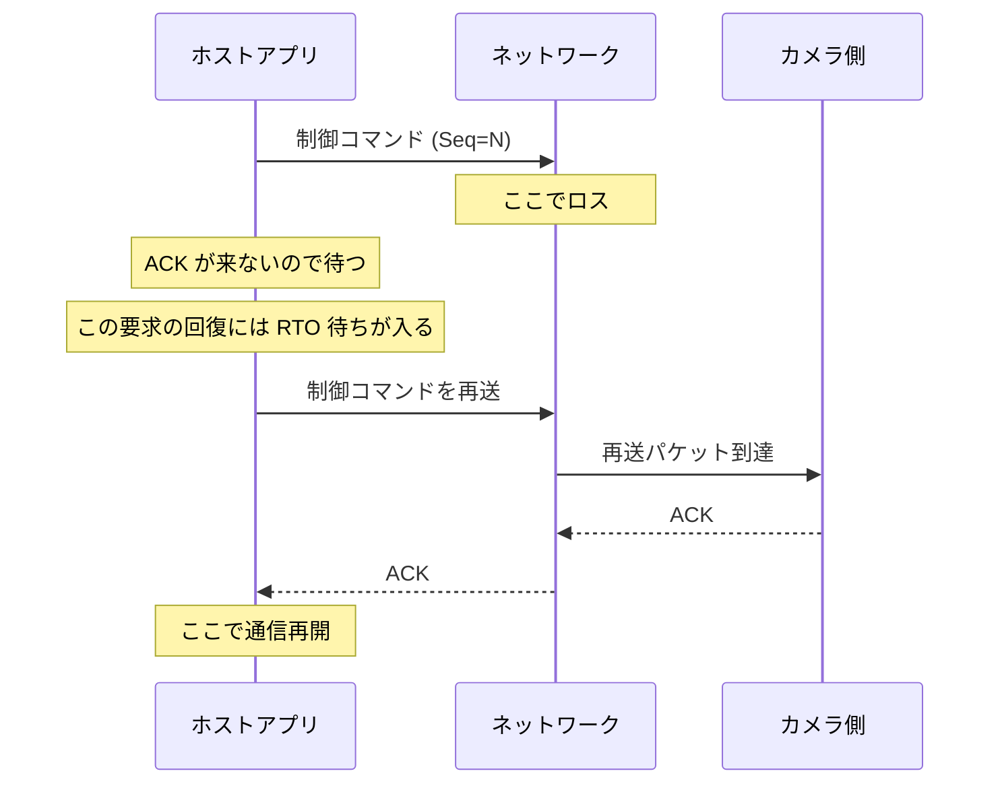
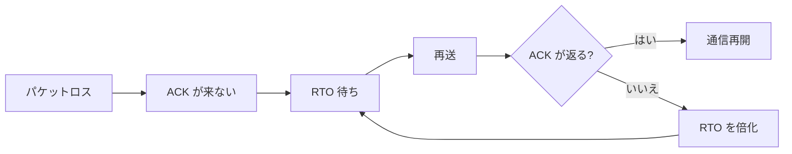
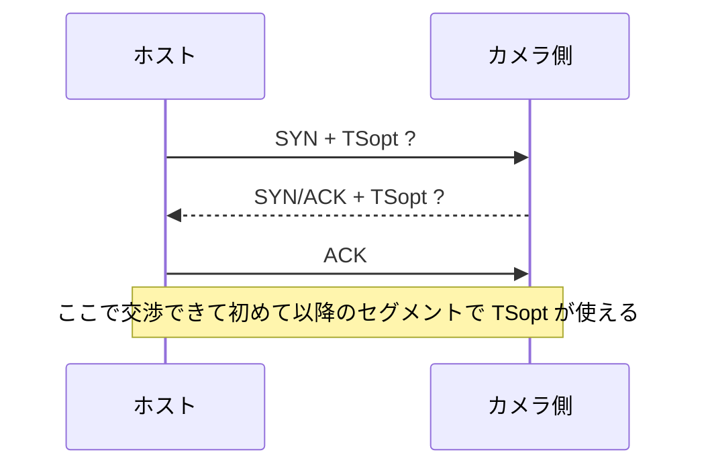
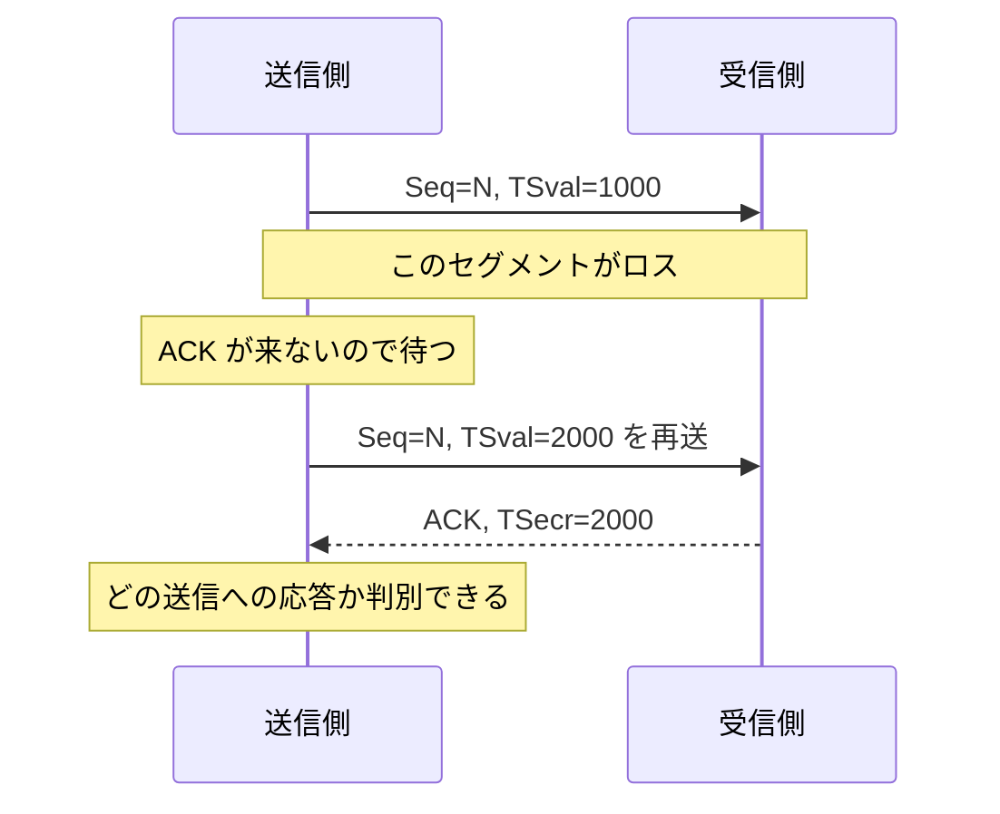

産業用カメラや装置制御の通信では、平均では速いのに **たまに数秒止まる** という現象がいちばん厄介です。再現率が低く、普段は何も起きないので、UI、スレッド、GC、カメラ SDK、NIC、スイッチ、全部が少しずつ怪しく見えてきます。

今回扱うのは、産業用カメラを制御するアプリとホストの TCP 通信で、まれに数秒間だけ通信が止まる事象です。調べてみると、正体はアプリの停止ではなく、**パケットロスに起因する TCP の再送待ち** でした。さらに、RFC1323 系のタイムスタンプ機能（現在の整理では RFC 7323）を有効にすることで、この系では待ち時間を最小限に寄せられました。

装置名や構成、数値は一般化していますが、考え方はそのまま実務で使えます。

## 目次

1. まず結論（ひとことで）
2. 症状の見え方
   - 2.1. アプリは生きているのに応答だけ数秒止まる
   - 2.2. 低頻度なのでログだけだと見えにくい
3. 何が起きていたか（図）
   - 3.1. パケットロスから再送待ちに入る
   - 3.2. 秒単位停止と RTO の形が合っていた
4. 調査で見たポイント
   - 4.1. まずアプリ内の停止要因を外す
   - 4.2. パケットキャプチャで再送を確認する
   - 4.3. 交渉されている TCP オプションを見る
5. RFC1323 タイムスタンプが効く理由
   - 5.1. タイムスタンプは RTTM と PAWS のため
   - 5.2. 再送時の RTT 測定の曖昧さを外せる
   - 5.3. この事例で待機時間を詰められた理由
6. 実際にやった対策
   - 6.1. タイムスタンプを有効化する
   - 6.2. SYN / SYN-ACK で TSopt を確認する
   - 6.3. それでも効かないときに見る場所
7. Wireshark で見るポイント
8. ざっくり使い分け
9. まとめ
10. 参考資料

* * *

## 1. まず結論（ひとことで）

- まれに数秒止まる TCP 通信は、アプリ停止ではなく **パケットロス後の再送待ち** が正体のことがあります
- パケットキャプチャで `Retransmission` と大きな時間差が見え、停止時間が RTO の待ち方と噛み合うなら、かなり怪しいです
- TCP timestamps option は RTT 測定と PAWS のための仕組みで、再送時の RTT 測定の曖昧さも外せます
- この事例では、RFC1323 系のタイムスタンプ機能を有効にすることで、RTO 推定が古く保守的なまま残る時間を減らし、秒単位の停止を最小限に寄せられました
- ただし、これは **ロスそのものを消す魔法** ではありません。物理層、NIC、スイッチ、中間機器、ドライバ、バッファ設計の見直しは別に必要です

要するに、「たまに数秒止まる」の正体が TCP の中の待ち時間なら、アプリのリトライだけ頑張っても芯を外します。まず wire を見て、再送待ちかどうかを確定させたほうが早いです。

## 2. 症状の見え方

### 2.1. アプリは生きているのに応答だけ数秒止まる

最初にややこしいのは、アプリ全体が固まっているようには見えないことです。

- UI は完全には死んでいない
- プロセスも落ちていない
- CPU も貼り付いていない
- ただし、カメラ制御コマンドの応答だけが **たまに** 数秒抜ける

こういう症状は、アプリ内の deadlock や無限ループとも見分けがつきにくいです。しかも装置制御では、1 回の数秒停止がそのままライン停止の印象になります。平均値がきれいでも、現場の体感はだいぶ悪いです。

### 2.2. 低頻度なのでログだけだと見えにくい

このタイプの不具合が面倒なのは、発生頻度が低いことです。1 時間に 1 回、半日に 1 回、条件が重なったときだけ、みたいな振る舞いをします。

ログだけで追うと、次のようなことが起きます。

- アプリログ上は「送信した」「返ってこない」で止まる
- 受信側ログは「何も来ていない」に見える
- たまたま同じ時間帯に別のイベントも起きて、犯人が散る

こういうとき、アプリログだけで因果関係を復元しようとすると、わりと普通に沼ります。通信層まで一段下りたほうが早いです。

## 3. 何が起きていたか（図）

### 3.1. パケットロスから再送待ちに入る

今回の筋はシンプルです。途中のどこかでパケットが落ち、送信側が ACK を待ち、来ないので RTO を待ってから再送していました。



アプリから見ると「数秒止まった」ように見えますが、TCP 的には「まだ ACK が来ていないので、再送タイマの満了を待っていた」というだけです。地味ですが、こういう止まり方は普通にあります。

今回の制御通信は、小さな request/response が多く、1 回のやり取りで大量の未 ACK データが飛んでいませんでした。そのため duplicate ACK を十分に集めて fast retransmit に乗るより先に、**RTO 待ち** が表に出やすい構成でした。

### 3.2. 秒単位停止と RTO の形が合っていた

TCP の再送待ちは、実装差はあるものの、保守的な待ち方をします。RFC 6298 では、初期 RTO は 1 秒が基準で、計算結果がそれより小さければ 1 秒に切り上げ、タイムアウトが起きたら倍化します。



なので、数百ミリ秒で終わってほしい局面でも、条件が悪いと 1 秒、2 秒、4 秒のような待ち方に見えることがあります。今回の「まれに数秒止まる」は、この形とかなり素直に噛み合っていました。

## 4. 調査で見たポイント

### 4.1. まずアプリ内の停止要因を外す

いきなり TCP と決め打ちせず、先にアプリ側の典型要因を外しました。

| 確認したもの | 見た理由 | 今回の結論 |
| --- | --- | --- |
| UI スレッド / ワーカースレッド | ハングや相互待ちの確認 | 主因ではなかった |
| CPU 使用率 | 高負荷による処理遅延の確認 | 停止時も張り付きではなかった |
| GC / メモリ圧迫 | 一時停止の確認 | 停止時間の形が合わなかった |
| カメラ SDK 呼び出し | SDK 内待機の確認 | wire 上の遅延と一致しなかった |
| パケットキャプチャ | 通信層の再送確認 | ここで原因の筋が見えた |

ここで大事なのは、アプリログの時刻だけで犯人を決めないことです。装置制御アプリでは、上位の待機は下位の待機をただ映していることがあります。

### 4.2. パケットキャプチャで再送を確認する

パケットキャプチャを取ると、停止している時間帯で `TCP Retransmission` が見え、さらにその直前に ACK が返ってきていないことが分かりました。

見るべき点は、たとえば次です。

- 同じ `Seq` の再送が出ているか
- 再送までの時間差が停止時間と一致するか
- `Dup ACK` や `Fast Retransmission` ではなく、RTO 満了待ちに見えるか
- 問題の接続が毎回同じ `tcp.stream` に出るか

ここが合うと、「アプリが止まっている」のではなく、「TCP が再送待ちをしている」がかなり濃くなります。

### 4.3. 交渉されている TCP オプションを見る

次に見たのが、接続開始時の SYN / SYN-ACK です。タイムスタンプは TCP 接続の 3-way handshake で交渉されるので、ここに TSopt が出ていなければ、その接続では使われません。



ここを見ないまま OS 設定だけ触ると、「有効にしたはずなのに効いていない」という、これまた地味な事故になります。設定値より wire の事実のほうが強いです。

## 5. RFC1323 タイムスタンプが効く理由

実務では「RFC1323 のタイムスタンプ」という呼び方がまだ残っていますが、現行の整理は RFC 7323 です。この記事では慣用に合わせて RFC1323 と書きつつ、意味としては TCP timestamps option を指します。

### 5.1. タイムスタンプは RTTM と PAWS のため

TCP の timestamps option は、主に次の 2 つのために使われます。

- RTTM（Round-Trip Time Measurement）
- PAWS（Protect Against Wrapped Sequences）

ここで今回効いたのは RTTM 側です。送信したセグメントの `TSval` を、相手が ACK の `TSecr` で返すことで、送信側は RTT をより細かく、より正確に測りやすくなります。

### 5.2. 再送時の RTT 測定の曖昧さを外せる

再送が入ると、タイムスタンプなしでは「この ACK は最初の送信に対するものか、再送に対するものか」が曖昧になります。これがいわゆる Karn のアルゴリズムが気にしている点です。

RFC 6298 では、再送されたセグメントでは RTT サンプルを取ってはいけない、とされています。理由は、どの送信に対する ACK か分からないからです。ただし、timestamps option があると、この曖昧さを外せます。ACK に入ってくる `TSecr` を見れば、どの `TSval` を持ったセグメントが届いたかを識別できるからです。



ここが、今回の改善の芯です。

### 5.3. この事例で待機時間を詰められた理由

この事例では、パケットロスがときどき発生し、そのたびに RTT / RTO の推定が保守的に寄りやすい状態でした。タイムスタンプを有効にすると、再送を含む場面でも RTT の見積もりを更新しやすくなり、RTO 推定が古いまま膨らみ続ける時間を抑えられます。

言い換えると、今回やったのは TCP を速くする魔法ではなく、**TCP が必要以上に長く様子見し続ける時間を減らすこと** です。

もちろん、RFC 7323 も「RTT サンプルが増えれば何でもきれいに解決する」とは言っていません。RTO の最適化に効く度合いは限定的な面もあります。ただ、**再送時の曖昧さを外せる** という点は、今回のような系で素直に効くことがあります。

注意点もあります。

- これは TCP stack の実装に依存する部分があります
- タイムスタンプだけでパケットロス自体は消えません
- 物理層や中間機器が悪ければ、根本原因は別にあります
- SACK や NIC ドライバ、オフロード設定、スイッチ側の問題も別で見たほうがよいです

ただ、今回のように「ロスはゼロではない」「でも本当に痛いのは秒単位の待ち」という系では、かなり効くことがあります。

## 6. 実際にやった対策

### 6.1. タイムスタンプを有効化する

対策としては、接続両端で timestamps option が交渉できる状態にしました。Windows 系では RFC 1323 オプションとして扱われることがあり、OS 設定やネットワーク設定の影響を受けます。

ただし、実務では「設定画面で有効になっている」より、「SYN / SYN-ACK の実パケットに TSopt が乗っている」のほうが大事です。ここは本当にそうです。

### 6.2. SYN / SYN-ACK で TSopt を確認する

有効化後は、次の 3 点を確認しました。

- 問題の接続の SYN に TSopt があるか
- SYN/ACK 側も TSopt を返しているか
- 以降のデータセグメントと ACK にも TSopt が継続して載っているか

ここが確認できて初めて、「その接続で timestamps が実際に使われている」と言えます。

### 6.3. それでも効かないときに見る場所

タイムスタンプを有効にしても、次のような場合は改善が鈍いことがあります。

- ロス率そのものが高い
- 中間機器が TCP option を壊す、落とす、変形する
- NIC / ドライバ / オフロード周りに別の問題がある
- アプリが 1 本の同期呼び出しに全体をぶら下げていて、1 回の待ちがそのまま全停止に見える
- 実際には TCP ではなく、カメラ側の処理停止や装置内キュー詰まりが主因

なので、対策の順番としては、次が分かりやすいです。

1. まず wire で再送待ちを確認する
2. TSopt の交渉有無を見る
3. timestamps を有効にして改善差分を見る
4. まだ残るなら、ロス源とアプリ設計を別々に詰める

## 7. Wireshark で見るポイント

切り分けで使いやすい表示フィルタは、たとえば次です。

```text
tcp.stream eq <対象ストリーム>
tcp.analysis.retransmission
tcp.analysis.fast_retransmission
tcp.analysis.lost_segment
tcp.options.timestamp.tsval
tcp.options.timestamp.tsecr
```

見方のコツは次です。

- `tcp.stream` で対象接続だけに絞る
- `Time delta from previous displayed packet` を出して、止まっている秒数をそのまま見る
- 問題の瞬間に `Retransmission` が出ているか確認する
- 接続開始時の SYN / SYN-ACK で TSopt が交渉されているか確認する
- ACK の `TSecr` が返っているかを見る

ログとパケットを付き合わせるときは、アプリ時刻とキャプチャ時刻の基準差にも注意が必要です。ここがずれると、別件を犯人扱いしがちです。

## 8. ざっくり使い分け

| 症状 | まず疑うもの | 最初にやること |
| --- | --- | --- |
| 数秒単位でたまに止まる | TCP の RTO 待ち | 再送と時間差をパケットで確認 |
| 毎回ほぼ同じタイミングで止まる | アプリ内待機、装置側処理、固定タイムアウト | スレッド、SDK 呼び出し、装置ログを見る |
| 高負荷時だけ悪化する | CPU、GC、キュー詰まり | CPU、割り込み、メモリ、キュー長を見る |
| 広範囲の接続で一斉に悪い | 物理層、スイッチ、中間機器 | NIC、ケーブル、ポート統計、中間機器ログを見る |
| 設定変更したのに変わらない | TCP option が交渉されていない | SYN / SYN-ACK を再確認する |

最後の行は本当に多いです。設定をいじった満足感と、wire 上で使われている事実は、別ものです。

## 9. まとめ

今回のポイント:

- 「たまに数秒止まる」は、アプリ停止ではなく TCP の再送待ちのことがある
- 停止時間が RTO の待ち方と合い、`Retransmission` が見えるなら、かなり筋がよい
- TCP timestamps option は RTTM と PAWS の仕組みで、再送時の RTT 測定の曖昧さを外せる
- この事例では、RFC1323 系タイムスタンプを有効にすることで、RTO が過度に保守化したまま残る時間を抑えられた

避けたい進め方:

- アプリログだけで通信停止の犯人を決める
- OS 設定だけ見て、実パケットを見ない
- タイムスタンプを有効にすればロス原因まで消えると思う

実務で効く進め方:

- まず wire を見る
- 再送と待ち時間の形を確認する
- TSopt の交渉を確認する
- 改善後も、ロス源とアプリ設計は別で詰める

つまり、この手の不具合は「速くする」より「どこで待っているかを当てる」ほうが先です。そこを外さないだけで、調査はかなり短くなります。

## 10. 参考資料

- [RFC 1323 - TCP Extensions for High Performance](https://datatracker.ietf.org/doc/html/rfc1323)
- [RFC 7323 - TCP Extensions for High Performance](https://datatracker.ietf.org/doc/html/rfc7323)
- [RFC 5681 - TCP Congestion Control](https://datatracker.ietf.org/doc/html/rfc5681)
- [RFC 6298 - Computing TCP's Retransmission Timer](https://datatracker.ietf.org/doc/html/rfc6298)
- [Description of Windows TCP features - Windows Server | Microsoft Learn](https://learn.microsoft.com/en-us/troubleshoot/windows-server/networking/description-tcp-features)
