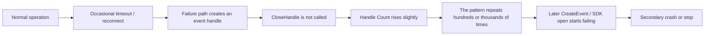
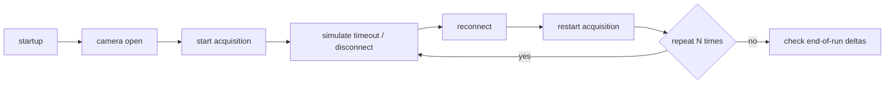

When a Windows application suddenly crashes only after running for a long time, it is very common to suspect a memory leak first.  
But in practice, the main culprit is sometimes a **handle leak**, and what finally appears weeks later is only the secondary failure.

The example here is a Windows application that controlled an industrial camera and suddenly crashed after about one month of continuous operation.
After narrowing it down, the real cause turned out to be **a handle leak on a failure path around camera reconnect logic**.

In this first part, I will organize what a handle leak means, how this case was narrowed down, and what logs are worth adding to prevent the same kind of investigation pain later.
The second part, [When an Industrial Camera Control App Suddenly Crashes After a Month (Part 2) - What Application Verifier Is and How to Build Failure-Path Test Infrastructure](https://comcomponent.com/blog/2026/03/11/003-application-verifier-abnormal-test-foundation-part2/), covers the failure-path testing side.

Some proper names and a few log items are generalized, but the underlying thinking applies very broadly to Windows-based device-control applications.

## Contents

1. [Short version](#1-short-version)
2. [What a handle leak means here](#2-what-a-handle-leak-means-here)
   - [2.1. What "handle" means in this context](#21-what-handle-means-in-this-context)
   - [2.2. Why it often appears only after long-running operation](#22-why-it-often-appears-only-after-long-running-operation)
   - [2.3. How it differs from a memory leak](#23-how-it-differs-from-a-memory-leak)
3. [Case study: the industrial camera control app that crashed after one month](#3-case-study-the-industrial-camera-control-app-that-crashed-after-one-month)
   - [3.1. What the symptoms looked like](#31-what-the-symptoms-looked-like)
   - [3.2. The first metrics we looked at](#32-the-first-metrics-we-looked-at)
   - [3.3. The actual leaking point](#33-the-actual-leaking-point)
4. [How we narrowed it down](#4-how-we-narrowed-it-down)
   - [4.1. Compress the reproduction instead of waiting another month](#41-compress-the-reproduction-instead-of-waiting-another-month)
   - [4.2. Look at the slope of `Handle Count`](#42-look-at-the-slope-of-handle-count)
   - [4.3. Compare `create/open` against `close/dispose`](#43-compare-createopen-against-closedispose)
   - [4.4. Search for where the handle leaked, not just where the crash happened](#44-search-for-where-the-handle-leaked-not-just-where-the-crash-happened)
5. [What logs are needed for recurrence prevention](#5-what-logs-are-needed-for-recurrence-prevention)
   - [5.1. The minimum set worth keeping](#51-the-minimum-set-worth-keeping)
   - [5.2. The logs we actually strengthened](#52-the-logs-we-actually-strengthened)
   - [5.3. How fine the log granularity should be](#53-how-fine-the-log-granularity-should-be)
6. [Rough rule-of-thumb guide](#6-rough-rule-of-thumb-guide)
7. [Summary](#7-summary)
8. [References](#8-references)

* * *

## 1. Short version

- In control applications that fail only after long-running operation, always look at `Handle Count` in addition to `Private Bytes`
- Handle leaks tend to hide on timeout / reconnect / partial-failure / early-return paths rather than on the normal path
- The line where the app finally crashes is often **not** the line that originally leaked the resource
- The most important logs are operation context, process-level `Handle Count`, resource open / close symmetry, and Win32 / HRESULT / SDK error details
- Instead of waiting another month for reproduction, shorten the path by hammering connect / disconnect / reconnect / failure scenarios in a loop
- Application Verifier, discussed in the second part, is very effective, but **your own logs that reveal lifetime symmetry are the foundation**

In short, the right first move in this kind of case is not to stare at "it crashed after a long time."  
The right move is to make **resource growth and failure-path behavior observable**.

Handle leaks often appear wearing the face of a later secondary failure.
If you only read the final exception, it is very easy to walk in the wrong direction.

## 2. What a handle leak means here

### 2.1. What "handle" means in this context

Here, a handle means a Windows process-level identifier used to refer to OS-managed resources.
Typical examples include:

| Category | Examples |
| --- | --- |
| kernel objects | event, mutex, semaphore, thread, process, waitable timer |
| I/O-related resources | file, pipe, socket, device opens |
| especially common in device-control apps | SDK-internal events, callback registration objects, acquisition-thread-related handles |

What often causes trouble in control applications is **creating a resource temporarily for a particular operation and forgetting to close it on a mid-failure path**.

For example:

- create an event every time reconnect begins
- callback registration or acquisition startup fails partway through
- the success path closes it, but the failure path does not
- short tests mostly run the success path, so the leak is missed

This kind of bug hides very naturally.

### 2.2. Why it often appears only after long-running operation

A handle leak does not necessarily fail spectacularly on the first occurrence.  
The dangerous pattern is usually **a tiny slope**: one resource leaked per uncommon failure.



If one reconnect leaks only one handle, nothing may happen for days.
But in a 24/7 control application, timeout, reconnect, and reinitialization edges repeat over and over.
That is how a leak can surface only weeks later.

What matters is that **the handle leak itself may not be the exact line of the final crash**.
Typical later failure shapes include:

- API calls that create a new handle start failing
- the SDK fails to initialize internal resources and returns only a generic error
- the error path is thin, and code later dereferences an invalid result
- timeouts increase until a watchdog or upper-level control path terminates the app

So the final crash point is often only the last victim.

### 2.3. How it differs from a memory leak

Long-run failures make people suspect memory leaks first, and that is natural.
But handle leaks should often be investigated on a different axis.

| Viewpoint | Memory leak | Handle leak |
| --- | --- | --- |
| First metric to watch | `Private Bytes`, `Commit`, `Working Set` | `Handle Count` |
| Typical symptom | memory pressure, paging, slowdown, OOM | `Create*` / `Open*` / SDK initialization failure, secondary failures |
| Where it tends to hide | retained references, caches, forgotten release | asymmetry between `create/open` and `close/dispose` |
| Typical trend | memory grows steadily | `Handle Count` rises and does not return |

So when dealing with long-running failures, looking only at memory is often like driving with one eye closed.
At minimum, `Handle Count` and `Thread Count` should be checked together.

## 3. Case study: the industrial camera control app that crashed after one month

### 3.1. What the symptoms looked like

The pattern looked simple:

- a Windows application controlling an industrial camera ran 24/7
- it behaved normally most of the time
- after roughly one month, it suddenly crashed
- after restart, it ran normally again for a while

The first difficulty is simply that **the time-to-failure is long**.
Waiting a month for each reproduction attempt is a very poor debugging strategy.

It was also messy that the exact crash location was not identical every time.
Sometimes it failed right after reconnect started, sometimes when acquisition restarted, sometimes after an SDK call failed.

That made all of these look suspicious at first:

- instability in the camera SDK
- transient transport or device-disconnect problems
- a memory leak
- a thread race
- an initialization failure not fully logged

In other words, there were too many plausible suspects.

### 3.2. The first metrics we looked at

The first helpful move was to look at process-level resource trends.
What we observed looked roughly like this:

| Metric | Observed direction | What it suggested |
| --- | --- | --- |
| `Handle Count` | increased little by little after reconnect or timeout and did not return | suspect a handle leak |
| `Private Bytes` | moved around, but did not show a strong monotonic slope | heap was not obviously the main culprit |
| `Thread Count` | mostly flat | thread leak was less likely |
| Crash location | varied somewhat | likely a secondary effect, not the original source |

That already narrowed the search a lot.
It was more natural to think:

> "something is leaking gradually, and the one-month crash is just the day the bill finally came due."

### 3.3. The actual leaking point

The real cause turned out to be **an event handle created on a camera reconnect initialization path and not closed when initialization failed partway through**.

In simplified form, the pattern looked like this:


In code shape, the leak was essentially:

```text
handle = CreateEvent(...)

if (!RegisterCallback(handle))
{
    return Error;   // CloseHandle(handle) is missing
}

if (!StartAcquisition())
{
    return Error;   // close is missing here too
}

CloseHandle(handle)
```

This also explains why short tests miss it so easily:

- normal start -> normal stop closes the handle
- the failure occurs only during reconnect
- there is no stress test that forces that failure path repeatedly
- in production, the leak accumulates slowly over weeks

So the structure was:

> **normal paths look fine, abnormal paths leak very naturally**

The fix itself was not glamorous.
It was mostly about:

- moving `create/open` and `close/dispose` responsibility closer together
- guaranteeing release through `finally`, destructors, or session-object lifetime
- making ownership before and after callback registration explicit
- expressing "who closes this" in actual code structure instead of vague comments

## 4. How we narrowed it down

### 4.1. Compress the reproduction instead of waiting another month

Waiting a month every time is simply the wrong shape of debugging for this problem.
The right move is to **run the suspicious lifetime edges over and over in a short loop**.

The kind of loop that helps looks like this:



The point is to spend time on the **lifetime edges**, not on the "everything is healthy" interval.

Practical scenarios that help are things like:

- repeat `open -> start -> stop -> close`
- trigger timeouts intentionally and force reconnect
- fail immediately after callback registration
- interrupt disconnect, reconnect, or shutdown paths

You do not need to perfectly reproduce one month of real life.
You need to **hammer the suspicious lifetime edge thousands of times**.

### 4.2. Look at the slope of `Handle Count`

Absolute values alone are not always enough.
The more important question is whether the count returns after the operation that should have restored it, and how much it rises per cycle.

A practical order is:

1. decide a baseline after warm-up
2. record `Handle Count` after reconnect / start-stop / close operations
3. look at the delta per cycle
4. also look at the accumulated slope across many cycles

A simple view is:

```text
leakSlope =
    (currentHandleCount - baselineHandleCount)
    / reconnectCount
```

Whether an absolute value like 2000 is "large" depends on the application.
But if reconnect increases `Handle Count` by roughly +1 each time and it never returns, that is very suspicious.

It also helps a lot to log these together:

- `Handle Count`
- `Private Bytes`
- `Thread Count`
- `ReconnectCount`
- the current phase

That makes it much easier to tell whether the growing thing is handles, memory, threads, or something else.

### 4.3. Compare `create/open` against `close/dispose`

Even if process-wide `Handle Count` looks suspicious, that still does not tell you where the leak actually lives.
The next step is to make **resource lifetime visible as pairs**.

For example, logs shaped like this:

```text
CameraSession session=421 cameraId=CAM01 phase=ReconnectStart reason=FrameTimeout handleCount=1824 privateBytesMB=418

CameraResource session=421 resourceId=evt-884 kind=Event name=FrameReady action=Create osHandle=0x00000ABC handleCount=1825

CameraResource session=421 resourceId=evt-884 kind=Event name=FrameReady action=Close osHandle=0x00000ABC handleCount=1824
```

The key is not to rely on `osHandle` alone.
Windows handle values can be reused later, so it is much easier to track the story if logs also carry:

- `sessionId`
- `resourceId`
- `kind`
- `action` (`Create/Open/Register/Close/Dispose/Unregister`)
- `osHandle`
- `phase`

That makes it much easier to spot a one-winged sequence where **Create exists but Close does not**.

### 4.4. Search for where the handle leaked, not just where the crash happened

This is a very important mindset shift.

Handle leaks often look like this:

- the line that crashes: `CreateEvent` fails
- the real leak: a `CloseHandle` was missing on some earlier failure path for days or weeks

So the last API failure is often only the **exit point of damage**, not the **entry point of the bug**.

A much more reliable investigation order is:

1. identify which kind of resource is increasing steadily
2. identify after which operation boundary it does not return
3. look for broken create/open vs close/dispose symmetry
4. only then read the final crash site

That order keeps you out of a lot of dead ends.

## 5. What logs are needed for recurrence prevention

### 5.1. The minimum set worth keeping

What helped in this case was not simply "more logs."
It was **more of the right logs**, arranged so that the root cause could be reconstructed later.

At minimum, these are worth keeping:

| Category | Minimum useful fields | Why |
| --- | --- | --- |
| operation context | `cameraId`, `sessionId`, `operationId`, `reconnectCount`, `phase` | to tie failures back to the operation that produced them |
| process resources | `handleCount`, `privateBytes`, `workingSet`, `threadCount` | to see what is really increasing |
| resource lifetime | `action`, `resourceId`, `kind`, `osHandle`, `owner` | to compare `create/open` with `close/dispose` |
| external-call result | `win32Error`, `HRESULT`, `sdkError`, `timeoutMs` | to classify failure types later |
| state transitions | `OpenStart`, `OpenDone`, `ReconnectStart`, `ReconnectDone`, `ShutdownStart`, etc. | to know which phase failed |
| execution environment | `pid`, `tid`, `buildVersion`, `machineName` | to match logs with dumps, symbols, and deployment artifacts |

That is not "everything."
But without at least this shape, you often end up with logs that preserve only the fact that "it crashed."

### 5.2. The logs we actually strengthened

In this case, the logs were strengthened in four directions:

1. **periodic heartbeat**
   - every 1 to 5 minutes: `Handle Count`, `Private Bytes`, `Thread Count`, `ReconnectCount`

2. **camera-session boundary logs**
   - `OpenStart`
   - `CallbackRegistered`
   - `AcquisitionStart`
   - `TimeoutDetected`
   - `ReconnectStart`
   - `ReconnectDone`
   - `CloseStart`
   - `CloseDone`

3. **resource lifecycle logs**
   - `Create/Open/Register` and `Close/Dispose/Unregister` for events, threads, files, timers, and SDK registration tokens

4. **normalized error reporting**
   - not just exception text, but also `win32Error`, `HRESULT`, `sdkError`, and `phase`

One very important point is to **not change the shape of the log format only in failure cases**.
If the schema changes between success and failure, later aggregation gets much harder.

### 5.3. How fine the log granularity should be

The common mistake here is "log everything at INFO."
That usually produces a wall of logs that is painful to read later.

A more practical split is:

- **periodic monitoring**
  - `Handle Count`, `Private Bytes`, `Thread Count`, `ReconnectCount`
- **operation boundaries**
  - session-level start / done / fail
- **resource boundaries**
  - `create/open/register` and `close/dispose/unregister`
- **failure details**
  - error codes, stack traces, dump triggers

You usually do **not** need frame-by-frame detail.
What matters much more in long-running failure investigations is being able to see:

> who opened this resource, and who closed it?

## 6. Rough rule-of-thumb guide

- **If the app crashes only after days or weeks**  
  start with heartbeat-style tracking of `Handle Count`, `Private Bytes`, and `Thread Count`

- **If retry / reconnect / shutdown is involved**  
  build a harness that hammers exactly those boundaries

- **If native SDKs / P/Invoke / Win32 are heavily involved**  
  the Application Verifier setup in part 2 is worth applying

- **If the app has a GUI too**  
  check `GDI Objects` and `USER Objects` alongside `Handle Count`

- **If the final exception explains nothing**  
  structured logs around operations, sessions, and resource lifetime will often help more than one more stack trace

In this kind of debugging, the decisive factor is often less the brilliance of the analysis and more whether the system was built so that it could actually be observed.

## 7. Summary

The main points are these.

How to read the symptom:

- if a control application fails only after long-running operation, look at `Handle Count` as well as memory
- handle leaks tend to hide on abnormal paths rather than on the normal path
- the final crash site is often only the exit point of a much older leak

What helps recurrence prevention:

- move `create/open` and `close/dispose` responsibilities closer together
- log with session / operation context
- record both process-level resource trends and resource-lifetime symmetry

What helps testing:

- do not wait a month; hammer timeout / reconnect / shutdown loops quickly
- test not only that the app survives, but also that it remains explainable when it fails
- use Application Verifier in the second part to force resource-failure conditions to appear earlier

In control applications, it is important not only that the normal path works.
It is equally important that when the app breaks, **you can explain what happened**.

That is exactly the kind of failure where handle leaks matter so much.

## 8. References

- [GetProcessHandleCount](https://learn.microsoft.com/ja-jp/windows/win32/api/processthreadsapi/nf-processthreadsapi-getprocesshandlecount)
- [Process.HandleCount](https://learn.microsoft.com/ja-jp/dotnet/api/system.diagnostics.process.handlecount?view=net-8.0)
- [Part 2: What Application Verifier Is and How to Build Failure-Path Test Infrastructure](https://comcomponent.com/blog/2026/03/11/003-application-verifier-abnormal-test-foundation-part2/)
