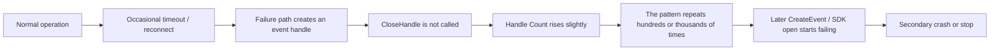
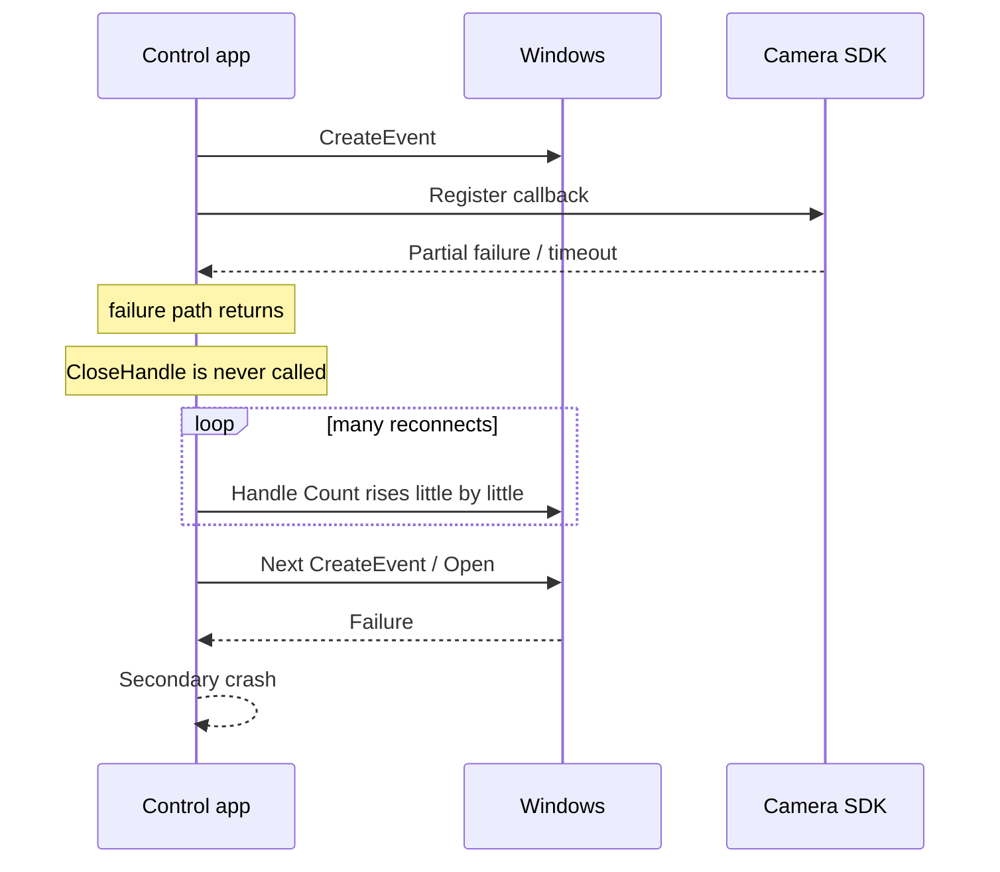
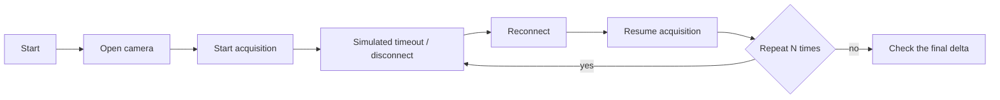

When a Windows application suddenly crashes only after running for a long time, it is very common to suspect a memory leak first.  
But in practice, the main culprit is sometimes a **handle leak**, and what finally appears weeks later is only the secondary failure.

The case here is a Windows application that controlled an industrial camera and suddenly crashed after about one month of continuous operation. After narrowing it down, the real cause turned out to be **a handle leak on a failure path around camera reconnect logic**.

In this first part, I will organize what a handle leak means, how this case was narrowed down, and what logs are worth adding to prevent the same investigation pain later.  
The second part, [When an Industrial Camera Control App Suddenly Crashes After a Month (Part 2) - What Application Verifier Is and How to Build Failure-Path Test Infrastructure](/en/blog/2026/03/11/003-application-verifier-abnormal-test-foundation-part2/), covers the failure-path testing side.

Some proper names and a few log items are generalized, but the underlying thinking applies very broadly to Windows-based device-control applications.

## Contents

1. [Short version](#1-short-version)
2. [What a handle leak means here](#2-what-a-handle-leak-means-here)
   - [2.1. What "handle" means in this context](#21-what-handle-means-in-this-context)
   - [2.2. Why it often appears only after long-running operation](#22-why-it-often-appears-only-after-long-running-operation)
   - [2.3. How it differs from a memory leak](#23-how-it-differs-from-a-memory-leak)
3. [Case study: the industrial camera control app that crashed after one month](#3-case-study-the-industrial-camera-control-app-that-crashed-after-one-month)
   - [3.1. What the symptoms looked like](#31-what-the-symptoms-looked-like)
   - [3.2. The first metrics we looked at](#32-the-first-metrics-we-looked-at)
   - [3.3. The actual leaking point](#33-the-actual-leaking-point)
4. [How we narrowed it down](#4-how-we-narrowed-it-down)
   - [4.1. Compress the reproduction instead of waiting another month](#41-compress-the-reproduction-instead-of-waiting-another-month)
   - [4.2. Look at the slope of `Handle Count`](#42-look-at-the-slope-of-handle-count)
   - [4.3. Compare `create/open` against `close/dispose`](#43-compare-createopen-against-closedispose)
   - [4.4. Search for where the handle leaked, not just where the crash happened](#44-search-for-where-the-handle-leaked-not-just-where-the-crash-happened)
5. [What logs are needed for recurrence prevention](#5-what-logs-are-needed-for-recurrence-prevention)
   - [5.1. The minimum set worth keeping](#51-the-minimum-set-worth-keeping)
   - [5.2. The logs we actually strengthened](#52-the-logs-we-actually-strengthened)
   - [5.3. How fine the log granularity should be](#53-how-fine-the-log-granularity-should-be)
6. [Rough rule-of-thumb guide](#6-rough-rule-of-thumb-guide)
7. [Summary](#7-summary)
8. [References](#8-references)
9. [Author GitHub](#author-github)

* * *

## 1. Short version

- In control applications that fail only after long-running operation, always look at `Handle Count` in addition to `Private Bytes`
- Handle leaks tend to hide on timeout / reconnect / partial-failure / early-return paths rather than on the normal path
- The line where the app finally crashes is often not the line that originally leaked the resource
- The most important logs are operation / session context, process-level `Handle Count`, resource open / close symmetry, and Win32 / HRESULT / SDK error details
- Instead of waiting another month for reproduction, shorten the path by hammering connect / disconnect / reconnect / failure scenarios in a loop
- Application Verifier, discussed in the second part, is very effective, but **your own logs that reveal lifetime symmetry are the foundation**

In short, the right first move in this kind of case is not to stare at "it crashed after a long time."  
The right move is to make **resource growth and failure-path behavior observable**.

Handle leaks often appear wearing the face of a later secondary failure.  
If you only read the final exception, it is very easy to walk in the wrong direction.

## 2. What a handle leak means here

### 2.1. What "handle" means in this context

Here, a handle means a Windows process-level identifier used to refer to OS-managed resources.  
Typical examples include:

| Category | Examples |
| --- | --- |
| kernel objects | event, mutex, semaphore, thread, process, waitable timer |
| I/O-related resources | file, pipe, socket, device opens |
| especially common in device-control apps | SDK-internal events, callback registration objects, acquisition-thread-related handles |

What often causes trouble in control applications is **creating a resource temporarily for a particular operation and forgetting to close it on a mid-failure path**.

For example:

- create one event every time reconnect starts
- callback registration or acquisition startup fails partway through
- the success path closes it, but the failure path does not
- short tests mostly run the success path, so the leak is missed

This type of bug hides very naturally in both code review and real operation.

### 2.2. Why it often appears only after long-running operation

A handle leak does not necessarily fail spectacularly on the first occurrence.  
The dangerous pattern is usually **a tiny slope**: one resource leaked per failure.



If one reconnect leaks only one handle, nothing may happen for days.  
But in a 24/7 control application, timeout, reinitialization, and reconnect edges repeat over and over.  
That is how a leak can surface only weeks later.

What matters is that **the handle leak itself may not be the exact line of the final crash**.  
Typical later failure shapes include:

- API calls that create a new event / file / thread start failing
- the SDK fails to initialize internal resources and returns only a generic failure code
- the error path is thin, and later code trips on a `null` or invalid handle
- timeouts increase until a watchdog or upper-level control path kills the app

So the final crash point is often only the last victim, not the first offender.

### 2.3. How it differs from a memory leak

Long-run failures make people suspect memory leaks first, and that is natural.  
But handle leaks should often be investigated on a different axis.

| Viewpoint | Memory leak | Handle leak |
| --- | --- | --- |
| First metric to watch | `Private Bytes`, `Commit`, `Working Set` | `Handle Count` |
| Typical symptom | memory pressure, paging, slowdown, OOM | `Create*` / `Open*` / SDK initialization failure, secondary failures |
| Where it tends to hide | retained references, caches, forgotten release | asymmetry between `create/open` and `close/dispose` |
| Typical trend | memory grows steadily | `Handle Count` rises and does not return |

So when dealing with long-running failures, looking only at memory is often like driving with one eye closed.  
At minimum, `Handle Count` and `Thread Count` should be checked together.

## 3. Case study: the industrial camera control app that crashed after one month

### 3.1. What the symptoms looked like

The outward symptoms were simple:

- a Windows application controlling an industrial camera runs 24/7
- under normal conditions it works fine
- after about one month, one day it suddenly crashes
- after restarting, it works again for a while

The first problem is simply that **the time to failure is too long**.  
Waiting one month for each reproduction cycle is brutal as an investigation strategy.

What made it more annoying was that the crash location was not exactly the same every time.  
Sometimes it happened right after reconnect started, sometimes when acquisition started, and sometimes after an SDK call failed.

With that appearance, all of these look plausible at first:

- instability in the camera SDK
- temporary device or communication failures
- a memory leak
- some thread-related race
- an initialization failure that never made it into the logs

In other words, there were simply **too many vaguely suspicious things**.

### 3.2. The first metrics we looked at

So the first move was to look at how process-level resources were growing.  
In this case, the observations pointed roughly in this direction:

| Metric | Observed trend | Reading |
| --- | --- | --- |
| `Handle Count` | rose slightly after reconnects or timeouts and did not come back | suspect a handle leak |
| `Private Bytes` | moved up and down, but did not show a strong monotonic slope | heap memory might not be the main culprit |
| `Thread Count` | mostly flat | a thread leak looked less likely |
| crash location | varied slightly each time | a secondary failure looked likely |

At that point the search space narrowed a lot.  
It felt more natural to read the case not as "it crashes after one month," but as **"something leaks little by little during operation, and that is why it crashes a month later."**

### 3.3. The actual leaking point

The final cause was **a missing close for an event handle created on an initialization-failure path during camera reconnect**.

In simplified form, the flow looked like this:



Conceptually, the code looked like this kind of leak:

```text
handle = CreateEvent(...)

if (!RegisterCallback(handle))
{
    return Error;   // CloseHandle(handle) is missing
}

if (!StartAcquisition())
{
    return Error;   // close is also missing here
}

...
CloseHandle(handle)
```

The reason short tests miss this is also fairly easy to see:

- on normal startup -> normal shutdown, the handle is closed
- the failure occurs only during reconnect
- there is no test that repeatedly drives that failure path at high volume
- in production, the leak accumulates slowly over weeks

So the structure was: **invisible if you only look at the normal path, but a very ordinary leak on the abnormal path**.

The fix itself was not flashy:

- bring `create/open` and `close/dispose` responsibilities closer together
- make sure resources are always released even on partial failure, for example by using `finally`, a destructor, or a session object
- make ownership explicit before and after callback registration or acquisition startup
- express "who closes this" as code responsibility rather than a comment

This is not a special trick so much as lifetime design embedded into the code.

## 4. How we narrowed it down

### 4.1. Compress the reproduction instead of waiting another month

In this kind of investigation, waiting a month each time is simply a bad strategy.  
What you want to do is **drive the suspicious edge path many times in a short time**.

In this case, reproduction was compressed with loops like this:



The point is to spend time on **lifetime edges**, not on normal "it is capturing frames correctly" time.

Scenarios like these help:

- run `open -> start -> stop -> close` at high volume
- intentionally inject timeouts and force reconnects
- fail immediately after callback registration
- include disconnect interruption, reconnect interruption, and shutdown races

You do not need to perfectly replay a full month of production.  
It is usually much more effective to **step on the lifetime edge you suspect thousands of times**.

### 4.2. Look at the slope of `Handle Count`

In handle-leak investigations, absolute values alone can be misleading.  
What matters is **whether the count comes back after an operation that should release resources**, and **how much it grows per repeated cycle**.

A practical sequence is:

1. decide a baseline after warm-up
2. record `Handle Count` after reconnect / start-stop / close
3. inspect the delta per cycle
4. also inspect the slope across several cycles

For example:

```text
leakSlope =
    (currentHandleCount - baselineHandleCount)
    / reconnectCount
```

Whether an absolute value like 2000 is high or low depends on the application.  
But if **one reconnect adds about +1 and it never comes back**, that is very suspicious.

It also helps not to look at `Handle Count` alone.  
At minimum, record it together with:

- `Handle Count`
- `Private Bytes`
- `Thread Count`
- `ReconnectCount`
- the current phase

That quickly tells you whether memory is growing, threads are growing, or reconnects are returning with resources still unbalanced.

### 4.3. Compare `create/open` against `close/dispose`

Even when process-wide `Handle Count` looks suspicious, that alone does not tell you the leak site.  
The next thing you need is **logging that shows resource lifetime as matching pairs**.

For example, structured logs like this:

```text
CameraSession session=421 cameraId=CAM01 phase=ReconnectStart reason=FrameTimeout handleCount=1824 privateBytesMB=418

CameraResource session=421 resourceId=evt-884 kind=Event name=FrameReady action=Create osHandle=0x00000ABC handleCount=1825

CameraResource session=421 resourceId=evt-884 kind=Event name=FrameReady action=Close osHandle=0x00000ABC handleCount=1824
```

The important point is not to rely only on `osHandle`.  
Windows handle values can be reused later, so in logs it is much easier to follow the story if you include at least:

- `sessionId`
- `resourceId`
- `kind`
- `action(Create/Open/Register/Close/Dispose/Unregister)`
- `osHandle`
- `phase`

That makes it much easier to find one-wing flows where **Create exists but Close does not**.

### 4.4. Search for where the handle leaked, not just where the crash happened

This point is very important.

Handle leaks often look like this:

- crash line: `CreateEvent` failed
- real leak: `CloseHandle` had been missing on a failure path for days

In other words, the API that finally crashes is often **the exit point of the damage**, not **the entry point of the cause**.

So the order of investigation is usually better like this:

1. see which resource keeps growing
2. see at which operation boundary it fails to return
3. find the place where the `create/open` and `close/dispose` pair is broken
4. only then read the final crash site

That order makes it much less likely that you get lost.

## 5. What logs are needed for recurrence prevention

### 5.1. The minimum set worth keeping

What helped in this investigation was not "just add more logs."  
It was **adding more of the information that would later let us reach the cause**.

At minimum, it helps to keep the following:

| Category | Minimum fields worth keeping | Why |
| --- | --- | --- |
| operation context | `cameraId`, `sessionId`, `operationId`, `reconnectCount`, `phase` | to connect an event to the exact operation and retry cycle |
| process resources | `handleCount`, `privateBytes`, `workingSet`, `threadCount` | to split what is actually growing |
| resource lifecycle | `action`, `resourceId`, `kind`, `osHandle`, `owner` | to follow `create/open` against `close/dispose` |
| external call results | `win32Error`, `HRESULT`, `sdkError`, `timeoutMs` | to compare failure types later |
| state transitions | `OpenStart`, `OpenDone`, `ReconnectStart`, `ReconnectDone`, `ShutdownStart`, etc. | to know which phase collapsed |
| runtime environment | `pid`, `tid`, `buildVersion`, `machineName` | to match dumps, symbols, and deployment artifacts |

That is not everything.  
But without at least this much, the logs easily degenerate into "we only know that it crashed."

### 5.2. The logs we actually strengthened

In this case, the logging was strengthened in four directions:

1. **periodic heartbeat**
   - emit `Handle Count` / `Private Bytes` / `Thread Count` / `ReconnectCount` every 1 to 5 minutes

2. **camera-session boundary logs**
   - `OpenStart`
   - `CallbackRegistered`
   - `AcquisitionStart`
   - `TimeoutDetected`
   - `ReconnectStart`
   - `ReconnectDone`
   - `CloseStart`
   - `CloseDone`

3. **resource lifecycle logs**
   - `Create/Open/Register` and `Close/Dispose/Unregister` for events, threads, files, timers, and SDK registration tokens

4. **error normalization**
   - instead of ending with only the exception message, emit `win32Error`, `HRESULT`, `sdkError`, and `phase` together

One important point is to **keep the log shape consistent between success and failure**.  
If abnormal cases switch to a totally different format, later aggregation becomes harder.

### 5.3. How fine the log granularity should be

The tempting mistake is to "just log everything at INFO."  
But if you do that, you later end up reading a wall of noise.

A realistic split is usually:

- **periodic monitoring**
  - `Handle Count`, `Private Bytes`, `Thread Count`, `ReconnectCount`
- **operation boundaries**
  - session start / done / fail
- **resource boundaries**
  - `create/open/register` and `close/dispose/unregister`
- **abnormal-case detail**
  - error codes, stack traces, dump-trigger conditions

Detailed per-frame logs are usually unnecessary.  
For long-running failures, logs that make it readable **which responsibility opened a resource and which responsibility closed it** are much more valuable.

## 6. Rough rule-of-thumb guide

- **Crashes happen only after days or weeks**
  - first add a heartbeat for `Handle Count` / `Private Bytes` / `Thread Count`

- **The system has retry / reconnect / shutdown paths**
  - build a harness that drives only those boundaries at high volume

- **The app uses a lot of native SDK, P/Invoke, or Win32**
  - the Application Verifier techniques in part 2 are especially worth using

- **The app also includes a GUI**
  - in addition to `Handle Count`, also look at `GDI Objects` and `USER Objects`

- **The final exception tells you almost nothing**
  - it is usually faster to improve structured logs for operation / session / resource lifecycle first

That last point matters a lot.  
In defect investigation, the deciding factor is often not the analysis technique itself but **whether the system was made observable in the first place**.

## 7. Summary

The important points to keep are these.

How to read the symptoms:

- if the app crashes only after long-running operation, look at `Handle Count` as well as memory
- handle leaks tend to hide on abnormal failure paths rather than on the normal path
- the crash site is often not the leak site but only the exit point of the secondary damage

Design changes that help prevent recurrence:

- bring `create/open` and `close/dispose` responsibilities closer together
- keep context-rich logs by session / operation
- record both process-level resource metrics and per-resource lifecycle events

Test strategy that helps:

- do not wait for month-scale reproduction; drive timeout / reconnect / shutdown in a short loop
- do not make "it does not break" the only acceptance criterion; also require that "when it breaks, we can trace it"
- in part 2, use Application Verifier to surface hard-to-trigger failures like resource exhaustion and handle anomalies earlier

In control applications, it is important that the normal path works.  
But in long-running operation it is also very important to know **what happened when it broke**.

Handle leaks are exactly the kind of bug where that difference pays off.  
Instead of looking only at the crash instant, look at growth, boundaries, and lifetime symmetry. That makes them much easier to trace.

Part 2: [When an Industrial Camera Control App Suddenly Crashes After a Month (Part 2) - What Application Verifier Is and How to Build Failure-Path Test Infrastructure](/en/blog/2026/03/11/003-application-verifier-abnormal-test-foundation-part2/)

## 8. References

- [GetProcessHandleCount function](https://learn.microsoft.com/en-us/windows/win32/api/processthreadsapi/nf-processthreadsapi-getprocesshandlecount)
- [Process.HandleCount Property](https://learn.microsoft.com/en-us/dotnet/api/system.diagnostics.process.handlecount?view=net-8.0)
- [Part 2: What Application Verifier Is and How to Build Failure-Path Test Infrastructure](/en/blog/2026/03/11/003-application-verifier-abnormal-test-foundation-part2/)

## Author GitHub

The author of this article, Go Komura, uses the GitHub account [gomurin0428](https://github.com/gomurin0428).

On GitHub, he publishes [COM_BLAS](https://github.com/gomurin0428/COM_BLAS) and [COM_BigDecimal](https://github.com/gomurin0428/COM_BigDecimal).

[← Back to the blog index](/en/blog/)

[Contact us](https://docs.google.com/forms/d/e/1FAIpQLSdQz2lqorHFF3fpJtfZv3Ohm5gHG7uyPtm7p_ydGwasc7Xi_g/viewform?usp=dialog)
