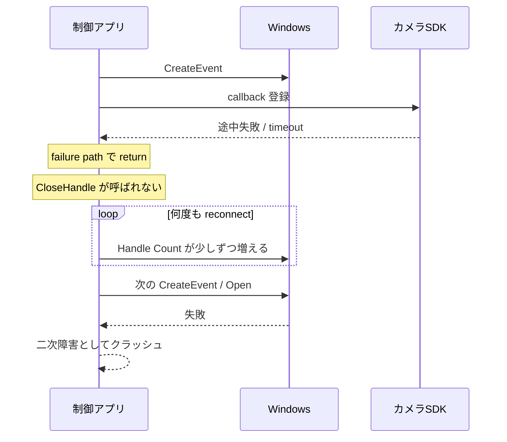
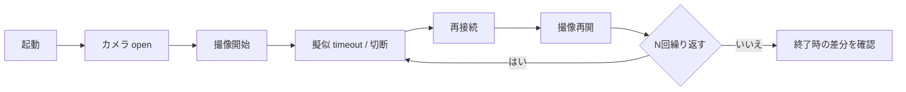

Windows の制御アプリで厄介なのは、起動直後や数時間の試験では平気なのに、数週間たってから急に壊れるタイプの不具合です。  
最初はメモリリークを疑いたくなりますが、実際には **ハンドルリーク** が主犯だった、ということもかなりあります。

今回紹介するのは、産業用カメラを制御している Windows アプリが、約 1 か月の連続稼働後に突然落ちる事象を調査した事例です。切り分けを進めた結果、原因は **カメラ再接続まわりの失敗経路で起きていたハンドルリーク** でした。

前編では、ハンドルリークとは何か、この事象をどう切り分けたか、再発防止のためにどんなログを残すべきかを整理します。  
後編では、[産業用カメラ制御アプリが1か月後に突然落ちるとき（後編） - Application Verifierで異常系テスト基盤を作る](https://comcomponent.com/blog/2026/03/11/003-application-verifier-abnormal-test-foundation-part2/) として、異常系テスト基盤の話をします。

固有名詞や一部のログ項目は伏せていますが、考え方そのものは Windows の装置制御アプリ全般でかなり共通です。

## 目次

1. まず結論（ひとことで）
2. ハンドルリークとは何か
   - 2.1. ここでいう「ハンドル」
   - 2.2. なぜ長時間運転でだけ表面化しやすいのか
   - 2.3. メモリリークとの違い
3. 事例: 産業用カメラ制御アプリが 1 か月後に突然落ちる
   - 3.1. 起きていた症状
   - 3.2. 最初に見た指標
   - 3.3. 真因だった漏れ箇所
4. どう切り分けたか
   - 4.1. 月単位の再現を待たずに時間短縮する
   - 4.2. `Handle Count` の傾きで見る
   - 4.3. `create/open` と `close/dispose` の対応を見る
   - 4.4. ハンドルリークは「落ちた場所」ではなく「漏らした場所」を探す
5. 再発防止のために必要なログ
   - 5.1. まず残すべき最小セット
   - 5.2. 実際に強化したログ
   - 5.3. どの粒度で取るか
6. ざっくり使い分け
7. まとめ
8. 参考資料

* * *

## 1. まず結論（ひとことで）

- 長時間運転後にだけ落ちる制御アプリでは、`Private Bytes` だけでなく `Handle Count` も必ず見る
- ハンドルリークは、通常系ではなく `timeout` / `reconnect` / 途中失敗 / early return の経路に潜みやすい
- 実際に落ちる行は、漏らした場所ではなく、後から新しいハンドルを作れなくなった場所であることが多い
- まず必要なログは、`operation/session` の文脈、process の `handle count`、resource の `open/close` 対応、Win32 / HRESULT / SDK エラー
- 月単位の再現を待つより、接続・切断・再接続・失敗経路を短いループで何千回も回した方が早い
- 後編で触れる Application Verifier はかなり有効ですが、その前に **自前のログで lifetime の崩れを追えるようにしておく** のが土台です

要するに、こういう案件で先にやるべきなのは、  
**「長期間のあとで落ちた」ことを眺めることではなく、資源の増え方と失敗経路を観測できる形にすること** です。

ハンドルリークは、見つかったときにはすでに二次障害の顔をしていることが多いです。  
そのため、落ちた瞬間の例外だけ見ていると、だいぶ見当違いな方向へ歩きがちです。

## 2. ハンドルリークとは何か

### 2.1. ここでいう「ハンドル」

ここでいうハンドルは、Windows のプロセスが OS の資源を参照するための識別子です。  
たとえば、次のようなものが対象になります。

| 分類 | 例 |
| --- | --- |
| カーネルオブジェクト | event, mutex, semaphore, thread, process, waitable timer |
| I/O 系 | file, pipe, socket, device への open |
| 装置制御でよく出るもの | カメラ SDK の内部 event、callback 登録に紐づく待機オブジェクト、撮像スレッド関連ハンドル |

制御アプリで特に問題になりやすいのは、**「ある操作のために一時的に開いた資源を、途中失敗の経路で閉じ忘れる」** パターンです。

たとえば、次のような流れです。

- 再接続のたびに event を 1 個作る
- callback 登録や撮像開始が途中で失敗する
- success path では close されるが、failure path では close されない
- 普段の短いテストでは成功経路ばかり通るので見逃す

このタイプは、コードレビューでも実運用でも、かなり普通に潜ります。

### 2.2. なぜ長時間運転でだけ表面化しやすいのか

ハンドルリークは、1 回で派手に壊れるとは限りません。  
むしろ厄介なのは、**1 回の失敗で 1 個だけ漏れる** ような、小さい傾きの漏れです。


1 回の reconnect で 1 個しか漏れないなら、数分では何も起きません。  
ただ、24/7 で動いている装置制御アプリでは、timeout、再初期化、切断復旧のような境界条件が何度も起きます。  
その結果、数週間後にだけ表面化する、という妙な見え方になります。

ここで大事なのは、**ハンドルリークそのものがクラッシュ行になるとは限らない** ことです。  
多いのは次のような壊れ方です。

- 新しい event / file / thread を作る API が失敗する
- SDK が内部で必要な資源を作れず、一般的な失敗コードだけ返す
- 失敗後のエラーハンドリングが薄く、`null` / invalid handle を踏んで落ちる
- timeout が増えて、結果として watchdog や上位制御に kill される

つまり、クラッシュ地点は「最後の被害者」であって、「最初の犯人」とは限りません。

### 2.3. メモリリークとの違い

長時間運転後の不具合では、まずメモリリークを疑いたくなります。  
もちろんそれ自体は自然ですが、ハンドルリークは別の軸で見たほうが早いことがあります。

| 観点 | メモリリーク | ハンドルリーク |
| --- | --- | --- |
| まず見る指標 | `Private Bytes`, `Commit`, `Working Set` | `Handle Count` |
| 典型症状 | メモリ逼迫、paging、遅くなる、OOM | `Create*` / `Open*` / SDK 内部初期化失敗、二次障害 |
| 潜みやすい場所 | キャッシュ、参照保持、解放忘れ | `create/open` と `close/dispose` の非対称 |
| 見え方 | メモリがじわじわ増える | handle count がじわじわ増えて戻らない |

なので、長時間運転の切り分けでは **「メモリだけを見る」だと片目で運転している状態** になりやすいです。  
少なくとも `Handle Count` と `Thread Count` は一緒に見た方がかなり整理しやすくなります。

## 3. 事例: 産業用カメラ制御アプリが 1 か月後に突然落ちる

### 3.1. 起きていた症状

事象はシンプルでした。

- 産業用カメラを制御する Windows アプリが 24/7 で動いている
- 通常時は普通に動く
- 約 1 か月ほどたつと、ある日いきなりアプリが落ちる
- 再起動すると、またしばらくは動く

最初に困るのは、**「落ちるまでが長い」** ことです。  
1 回ごとの再現に 1 か月待つのは、調査としてかなり厳しいです。

さらに厄介だったのは、落ちる場所が毎回ぴったり同じではなかったことです。  
あるときは再接続開始直後、あるときは撮像開始時、あるときは SDK 呼び出しの失敗後でした。

この見え方だと、最初は次のどれも疑えます。

- カメラ SDK 側の不安定さ
- 通信やデバイス切断起因の一時障害
- メモリリーク
- スレッドまわりの race
- ログに出ていない初期化失敗

つまり、**「なんとなく怪しいもの」が多すぎる** 状態でした。

### 3.2. 最初に見た指標

そこで最初にやったのは、process 全体の資源の増え方を見ることでした。  
今回の事例では、観測結果はだいたい次のような方向でした。

| 指標 | 観測された傾向 | 読み |
| --- | --- | --- |
| `Handle Count` | reconnect や timeout 後に少しずつ増え、戻らない | ハンドルリークを疑う |
| `Private Bytes` | 増減はあるが、単調増加の傾きは弱い | 主犯が heap とは限らない |
| `Thread Count` | ほぼ横ばい | thread leak の可能性は低い |
| 落ちる場所 | 毎回少し違う | 二次障害の可能性が高い |

この時点で、視線はかなり絞れました。  
**「1 か月後に落ちる」のではなく、「途中で何かを少しずつ漏らしていて、その結果 1 か月後に落ちる」** と見たほうが自然だったからです。

### 3.3. 真因だった漏れ箇所

最終的に原因だったのは、**カメラ再接続時の初期化失敗経路で作成した event handle の close 漏れ** でした。

流れを簡略化すると、だいたい次のような形です。



コードのイメージとしては、こういう漏れです。

```text
handle = CreateEvent(...)

if (!RegisterCallback(handle))
{
    return Error;   // CloseHandle(handle) が抜けている
}

if (!StartAcquisition())
{
    return Error;   // ここでも close が抜ける
}

...
CloseHandle(handle)
```

短いテストで見逃しやすい理由も、かなり分かりやすいです。

- 正常起動 -> 正常終了では close される
- 失敗するのは reconnect の途中だけ
- その failure path を大量に踏むテストが無い
- 本番では数週間かけて少しずつ蓄積する

つまり、**「通常系だけ見ていると見えないが、異常系では普通に漏れる」** という構造でした。

修正方針は派手ではありません。

- `create/open` と `close/dispose` の責務を近づける
- 途中失敗でも必ず解放されるように `finally` / destructor / session object 側へ寄せる
- callback 登録や撮像開始の前後で ownership を明確にする
- 「誰が閉じるか」を comments ではなくコードの責務で表す

ここは、特別なテクニックというより、資源寿命をコードに埋め込む整理です。

## 4. どう切り分けたか

### 4.1. 月単位の再現を待たずに時間短縮する

こういう調査で、1 か月を毎回待つのは筋が悪いです。  
やるべきなのは、**怪しい経路を短時間に何度も通すこと** です。

今回の事例では、次のようなループを回して再現を圧縮しました。



ポイントは、**通常の「撮れている」時間ではなく、境界の寿命操作に時間を使う** ことです。

具体的には、次のようなシナリオが効きます。

- `open -> start -> stop -> close` を大量に回す
- timeout を意図的に発生させて reconnect を回す
- callback 登録直後に失敗させる
- 切断中断、再接続中断、shutdown 競合を入れる

1 か月分の実運用を完璧に再現する必要はありません。  
むしろ、**疑っている lifetime edge を何千回も踏む** ほうが、原因にはずっと近いです。

### 4.2. `Handle Count` の傾きで見る

ハンドルリーク調査では、絶対値だけ見ても分かりにくいことがあります。  
大事なのは、**戻るべき操作のあとに戻っているか** と、**何回の操作で何個増えるか** です。

見方としては、だいたい次の順が分かりやすいです。

1. ウォームアップ後の baseline を決める
2. reconnect / start-stop / close 後に `Handle Count` を記録する
3. 1 サイクルごとの差分を見る
4. 何サイクルかまとめた傾きも見る

たとえば、こういう見方です。

```text
leakSlope =
    (currentHandleCount - baselineHandleCount)
    / reconnectCount
```

絶対値 2000 が多いか少ないかは、アプリ次第でぶれます。  
ただ、**reconnect 1 回につき +1 で戻らない** なら、それはかなり怪しいです。

ここでのコツは、`Handle Count` 単独で見るのではなく、最低でも次を併記することです。

- `Handle Count`
- `Private Bytes`
- `Thread Count`
- `ReconnectCount`
- 今どの phase か

これで、「メモリが増えているのか」「スレッドが増えているのか」「再接続のたびに資源が戻っていないのか」がかなり早く分かります。

### 4.3. `create/open` と `close/dispose` の対応を見る

process 全体の `Handle Count` が怪しいと分かっても、それだけでは漏れ箇所までは行けません。  
次に必要なのは、**資源のライフサイクルを対にして見るログ** です。

たとえば、次のような structured log です。

```text
CameraSession session=421 cameraId=CAM01 phase=ReconnectStart reason=FrameTimeout handleCount=1824 privateBytesMB=418

CameraResource session=421 resourceId=evt-884 kind=Event name=FrameReady action=Create osHandle=0x00000ABC handleCount=1825

CameraResource session=421 resourceId=evt-884 kind=Event name=FrameReady action=Close osHandle=0x00000ABC handleCount=1824
```

ここで大事なのは、`osHandle` だけに頼らないことです。  
Windows のハンドル値は後で再利用されることがあるので、ログ上では少なくとも次を持たせた方が追いやすいです。

- `sessionId`
- `resourceId`
- `kind`
- `action(Create/Open/Register/Close/Dispose/Unregister)`
- `osHandle`
- `phase`

こうしておくと、**Create はあるのに Close が無い**、という片肺の流れが見つけやすくなります。

### 4.4. ハンドルリークは「落ちた場所」ではなく「漏らした場所」を探す

ここはかなり重要です。

ハンドルリークは、よく次のように見えます。

- 落ちた行: `CreateEvent` 失敗
- 本当の漏れ: 数日前から failure path で `CloseHandle` が抜けていた

つまり、最後に落ちた API は **被害の出口** であって、**原因の入口** とは限りません。

なので、調査の順番としては、

1. どの資源が増え続けているかを見る
2. どの操作境界で戻っていないかを見る
3. `create/open` と `close/dispose` の対が崩れている箇所を探す
4. 最後にクラッシュ地点を読む

この順の方が、だいぶ迷子になりにくいです。

## 5. 再発防止のために必要なログ

### 5.1. まず残すべき最小セット

今回の調査で効いたのは、単にログ量を増やすことではありません。  
**「あとで原因にたどり着ける情報」を整理して増やすこと** でした。

最低限、次は残しておきたいです。

| 分類 | 最低限ほしい項目 | 理由 |
| --- | --- | --- |
| 操作文脈 | `cameraId`, `sessionId`, `operationId`, `reconnectCount`, `phase` | どの操作の何回目で起きたかを結びつけるため |
| process 資源 | `handleCount`, `privateBytes`, `workingSet`, `threadCount` | 何が増えているのかをまず切り分けるため |
| resource lifecycle | `action`, `resourceId`, `kind`, `osHandle`, `owner` | `create/open` と `close/dispose` の対を追うため |
| 外部呼び出し結果 | `win32Error`, `HRESULT`, `sdkError`, `timeoutMs` | 失敗の種類を後で比較するため |
| 状態遷移 | `OpenStart`, `OpenDone`, `ReconnectStart`, `ReconnectDone`, `ShutdownStart` など | どの phase の途中で崩れたかを知るため |
| 実行環境 | `pid`, `tid`, `buildVersion`, `machineName` | dump / symbol / 配布物との対応を取るため |

これで十分、とは言いません。  
ただ、少なくともこれが無いと、**「落ちた」という事実しか残らないログ** になりやすいです。

### 5.2. 実際に強化したログ

この事例では、ログを次の方向で強化しました。

1. **定期 heartbeat**
   - 1〜5 分おきに `Handle Count` / `Private Bytes` / `Thread Count` / `ReconnectCount` を出す

2. **カメラ session 単位の境界ログ**
   - `OpenStart`
   - `CallbackRegistered`
   - `AcquisitionStart`
   - `TimeoutDetected`
   - `ReconnectStart`
   - `ReconnectDone`
   - `CloseStart`
   - `CloseDone`

3. **資源ライフサイクルログ**
   - event / thread / file / timer / SDK registration token の `Create/Open/Register` と `Close/Dispose/Unregister`

4. **エラーの正規化**
   - 例外 message だけで終わらせず、`win32Error`, `HRESULT`, `sdkError`, `phase` を同時に出す

重要なのは、**成功時と失敗時でログの型を変えない** ことです。  
異常時だけ別形式になると、あとで集計しづらくなります。

### 5.3. どの粒度で取るか

ここでやりがちなのが、「とりあえず全部 INFO で吐く」です。  
ただ、それをやると、あとで読むときにログの壁ができます。これはだいぶしんどいです。

粒度としては、だいたい次の分け方が現実的です。

- **定期監視**
  - `Handle Count`, `Private Bytes`, `Thread Count`, `ReconnectCount`
- **操作境界**
  - session の start / done / fail
- **資源境界**
  - `create/open/register` と `close/dispose/unregister`
- **異常時詳細**
  - error code、stack、dump 採取トリガ

毎フレームの詳細ログは、通常は不要です。  
むしろ、**「どの責務が開いて、どの責務が閉じたか」** が読めるログのほうが、長時間不具合には効きます。

## 6. ざっくり使い分け

- **数日〜数週間後にだけ落ちる**
  - まず `Handle Count` / `Private Bytes` / `Thread Count` の heartbeat を入れる

- **retry / reconnect / shutdown がある**
  - その境界だけを大量に回す harness を先に作る

- **native SDK / P/Invoke / Win32 を多く使う**
  - 後編の Application Verifier を当てる価値が高いです

- **GUI も同居している**
  - `Handle Count` に加えて `GDI Objects` / `USER Objects` も見た方がよいです

- **落ちた瞬間の例外だけでは何も分からない**
  - operation / session / resource lifecycle の structured log を先に整えた方が早いです

最後の 1 項目は、かなり大事です。  
不具合調査では、解析技術そのものより、**観測できる形にしてあるか** が勝負を決めることがよくあります。

## 7. まとめ

押さえたい点は次です。

症状の読み方:

- 長時間運転後にだけ落ちるなら、メモリだけでなく `Handle Count` も見る
- ハンドルリークは、通常系ではなく異常系の failure path に潜みやすい
- クラッシュ地点は、漏らした地点ではなく二次障害の出口であることが多い

再発防止で効く設計:

- `create/open` と `close/dispose` の責務を近づける
- session / operation 単位で文脈を持ったログを残す
- process 資源と resource lifecycle を両方記録する

テストで効く進め方:

- 月単位の再現を待たず、timeout / reconnect / shutdown を短いループで回す
- 「壊れないこと」だけでなく、「壊れたときに追えること」を合格条件にする
- 後編では Application Verifier を使って、メモリ不足やハンドル異常のような出にくい壊れ方を前倒しで表面化させます

制御アプリでは、正常系が通ることも大事ですが、  
**壊れたときに「何が起きたか分かる」こと** が長期運用ではかなり効きます。

ハンドルリークは、まさにその差が効くタイプの不具合です。  
起きた瞬間にだけ見るのではなく、増え方、境界、責務の対で見るようにすると、かなり追いやすくなります。

後編: [産業用カメラ制御アプリが1か月後に突然落ちるとき（後編） - Application Verifierで異常系テスト基盤を作る](https://comcomponent.com/blog/2026/03/11/003-application-verifier-abnormal-test-foundation-part2/)

## 8. 参考資料

- [GetProcessHandleCount 関数 (processthreadsapi.h)](https://learn.microsoft.com/ja-jp/windows/win32/api/processthreadsapi/nf-processthreadsapi-getprocesshandlecount)
- [Process.HandleCount プロパティ (System.Diagnostics)](https://learn.microsoft.com/ja-jp/dotnet/api/system.diagnostics.process.handlecount?view=net-8.0)
- [後編: 産業用カメラ制御アプリが1か月後に突然落ちるとき（後編） - Application Verifierで異常系テスト基盤を作る](https://comcomponent.com/blog/2026/03/11/003-application-verifier-abnormal-test-foundation-part2/)

## Author GitHub

この記事の著者 Go Komura の GitHub アカウントは [gomurin0428](https://github.com/gomurin0428) です。

GitHub では [COM_BLAS](https://github.com/gomurin0428/COM_BLAS) と [COM_BigDecimal](https://github.com/gomurin0428/COM_BigDecimal) を公開しています。

[← ブログ一覧に戻る](https://comcomponent.com/blog/)

[この記事のテーマで相談する](https://docs.google.com/forms/d/e/1FAIpQLSfywSpD36AGXdQ70iNTNUgmZl6aFa7fTUT-PcyS9DY185pejw/viewform?entry.592359752=%E6%8A%80%E8%A1%93%E7%9B%B8%E8%AB%87&usp=pp_url) [とにかく相談する](https://docs.google.com/forms/d/e/1FAIpQLSfywSpD36AGXdQ70iNTNUgmZl6aFa7fTUT-PcyS9DY185pejw/viewform?entry.592359752=%E6%8A%80%E8%A1%93%E7%9B%B8%E8%AB%87&usp=pp_url)
