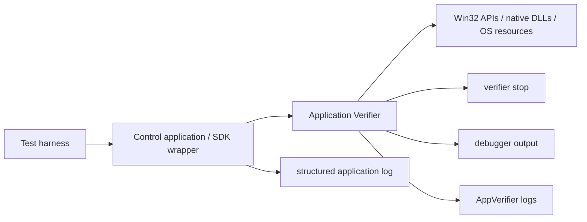
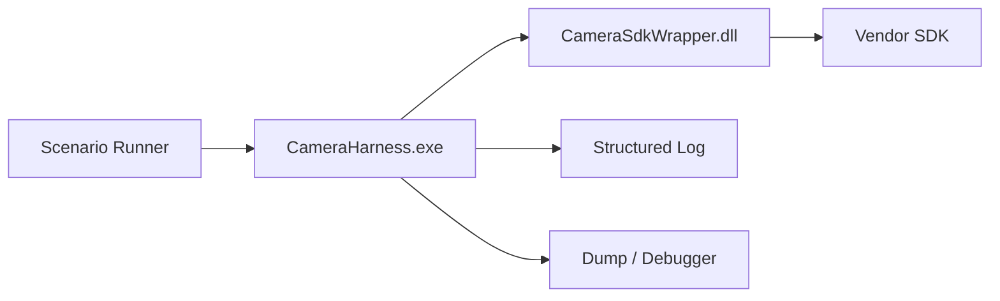

Application Verifier is a very strong tool when you want to surface strange behavior around Windows native code or Win32 boundaries earlier than normal testing would.
It is especially useful when you want to test things such as handle misuse, heap corruption, and failure paths under low-resource conditions.

In the first part, [When an Industrial Camera Control App Suddenly Crashes After a Month (Part 1) - How to Find a Handle Leak and Design Logging for Long-Running Operation](https://comcomponent.com/blog/2026/03/11/002-handle-leak-industrial-camera-long-run-crash-part1/), I organized a case where the root cause of a long-run crash turned out to be a handle leak.
But strengthening logs alone is only half the story.
What you really want is to know, **in advance**, whether if a future bug causes a memory leak, handle leak, partial failure, or cleanup omission, you will still be able to see clearly what happened.

That is where **Application Verifier** comes in.
It can apply runtime checks and fault injection to Windows native / Win32-boundary behavior.
One especially useful trait in real projects is that it lets you trigger memory-shortage-like or resource-shortage-like failure paths **without actually exhausting the whole machine**.

This second part organizes what Application Verifier is, what it can do, and how to use it to build a practical failure-path test foundation in the context of an industrial camera control application.

## Contents

1. [Short version](#1-short-version)
2. [What Application Verifier is](#2-what-application-verifier-is)
   - [2.1. The one-sentence description](#21-the-one-sentence-description)
   - [2.2. Where it is effective](#22-where-it-is-effective)
   - [2.3. Why it is useful in practice](#23-why-it-is-useful-in-practice)
3. [What Application Verifier can do](#3-what-application-verifier-can-do)
   - [3.1. Basics: Handles / Heaps / Locks / Memory / TLS and more](#31-basics-handles--heaps--locks--memory--tls-and-more)
   - [3.2. Low Resource Simulation: surface memory and resource failures earlier](#32-low-resource-simulation-surface-memory-and-resource-failures-earlier)
   - [3.3. Page Heap and the debugger](#33-page-heap-and-the-debugger)
   - [3.4. `!avrf` / `!htrace` / logs](#34-avrf--htrace--logs)
4. [Why we introduced it in this case](#4-why-we-introduced-it-in-this-case)
   - [4.1. The goal was not only "find one bug"](#41-the-goal-was-not-only-find-one-bug)
   - [4.2. Triggering memory-shortage-like conditions](#42-triggering-memory-shortage-like-conditions)
   - [4.3. Confirming that handle problems were actually traceable](#43-confirming-that-handle-problems-were-actually-traceable)
5. [How to trigger memory or resource shortage-like behavior](#5-how-to-trigger-memory-or-resource-shortage-like-behavior)
   - [5.1. The basic idea of Low Resource Simulation](#51-the-basic-idea-of-low-resource-simulation)
   - [5.2. What kinds of failures can be injected](#52-what-kinds-of-failures-can-be-injected)
   - [5.3. How to aim it in practice](#53-how-to-aim-it-in-practice)
6. [How to inspect handle-related problems](#6-how-to-inspect-handle-related-problems)
   - [6.1. The `Handles` check](#61-the-handles-check)
   - [6.2. Using `!htrace` to inspect open / close stacks](#62-using-htrace-to-inspect-open--close-stacks)
   - [6.3. How to combine it with your own logs](#63-how-to-combine-it-with-your-own-logs)
7. [How to build failure-path test infrastructure](#7-how-to-build-failure-path-test-infrastructure)
   - [7.1. Push execution into a harness EXE](#71-push-execution-into-a-harness-exe)
   - [7.2. Split the test menu by purpose](#72-split-the-test-menu-by-purpose)
   - [7.3. What to collect](#73-what-to-collect)
   - [7.4. What the pass criteria should be](#74-what-the-pass-criteria-should-be)
   - [7.5. Things to keep in mind](#75-things-to-keep-in-mind)
8. [Rough rule-of-thumb guide](#8-rough-rule-of-thumb-guide)
9. [Summary](#9-summary)
10. [References](#10-references)

* * *

## 1. Short version

- Application Verifier is a tool that makes it easier to catch misuse around **native / unmanaged / Win32 boundaries** at runtime
- Its value is not only "finding bugs," but also **forcing failure paths that normally stay hidden**
- `Handles` can catch invalid handle usage, `Heaps` can help surface heap corruption, and `Low Resource Simulation` can inject memory-shortage-like or resource-shortage-like failures
- It is not ideal to rely on Application Verifier alone for long-lived EXE leak analysis; combining it with your own `Handle Count` monitoring and resource-lifetime logs is far more practical
- In a failure-path test foundation, it is much easier to read results if you run **normal verifier runs** and **fault-injection runs** separately
- Even when the thing you want to test is a DLL, the target you enable in Application Verifier is usually the **test EXE that actually loads it**

In short, Application Verifier is a tool for dragging out the nasty native / Win32 bugs that otherwise stay half-hidden.
In the kind of world where device-control software mixes native SDKs, P/Invoke, and Win32 APIs, it is an especially good fit.

## 2. What Application Verifier is

### 2.1. The one-sentence description

Application Verifier is a **runtime validation tool for Windows user-mode applications**.
It observes how an application uses OS APIs and resources while it is actually running, and can both detect suspicious behavior and intentionally inject failures.

Unlike static analysis or ordinary unit tests, it shows what happens **on the actual execution path**.
That is exactly why it is so useful for failure-path testing.



### 2.2. Where it is effective

It is especially effective in situations like these:

- the application calls into native DLLs or device SDKs
- it crosses P/Invoke or COM boundaries
- it uses handles, heaps, locks, or virtual memory heavily, directly or indirectly
- normal-path tests rarely fail, but failure-path lifetime handling looks suspicious
- the first visible symptom is not a crash, but occasional strange failures

On the other hand, Application Verifier is **not** the right main tool for chasing purely managed object-graph leaks.
So even in a C# application, it becomes much more valuable when native SDKs or Win32 boundaries are substantial.

### 2.3. Why it is useful in practice

The practical benefits are mainly these:

1. **It can stop native-boundary misuse earlier**
   - invalid handle
   - heap corruption
   - lock misuse
   - virtual memory API misuse

2. **It can force failure paths that are usually hard to trigger**
   - allocation-like failures
   - file / event creation failures
   - low-resource behavior without actually collapsing the whole machine

3. **It works well with debugger tooling**
   - `!avrf`
   - `!htrace`
   - `!heap -p -a`
   - verifier stop information

In device-control applications, the hardest part is often not "there is a bug."
The hardest part is **"we cannot clearly see what happened when the abnormal path ran."**
Application Verifier helps a lot with that.

## 3. What Application Verifier can do

### 3.1. Basics: Handles / Heaps / Locks / Memory / TLS and more

The core test set in Application Verifier is usually the `Basics` area.
That includes the kinds of checks you actually want in many native-boundary applications.

| Layer | What it checks | How it helps in this context |
| --- | --- | --- |
| `Handles` | invalid handle usage | catches use-after-close and bad-handle paths |
| `Heaps` | heap corruption | helps surface corruption or use-after-free near native SDK boundaries |
| `Leak` | unfreed resources at DLL unload | useful especially in short-lived harness scenarios |
| `Locks` / `SRWLock` | lock misuse | useful around reconnect and shutdown races |
| `Memory` | misuse of APIs such as `VirtualAlloc` | useful for large buffers or mapped-memory behavior |
| `TLS` | thread-local-storage misuse | useful in native code with tricky thread assumptions |
| `Threadpool` | thread-pool worker and API correctness | useful when callbacks and async-native work are involved |

The core strength here is not "read a crash after the fact."
The strength is that **suspicious usage can stop closer to the place where it actually happens**.

### 3.2. Low Resource Simulation: surface memory and resource failures earlier

This is one of the most practically useful parts.
You can trigger behavior that looks like memory shortage or resource shortage **without really exhausting the whole development machine**.

The basic idea is fault injection:

- choose certain resource-creation or allocation APIs
- force them to fail with a chosen probability

That makes it much easier to test error paths that would otherwise almost never run.

Typical examples include:

- `HeapAlloc`
- `VirtualAlloc`
- `CreateFile`
- `CreateEvent`
- `MapViewOfFile`
- OLE / COM allocations such as `SysAllocString`

### 3.3. Page Heap and the debugger

If the suspicion is heap corruption, `Heaps` plus page heap is especially strong.
Full page heap can make corruption stop **much closer to the moment it happens**, thanks to guard-page behavior.

But it is also heavy.
So it is usually better used for:

- focused reproduction
- debugger-attached scenarios
- narrow investigation once suspicion has already become localized

A practical progression is often:

1. use `Basics` broadly first
2. if heap corruption becomes likely, move to full page heap
3. if that is too heavy, dial back
4. keep long-duration production-like runs focused more on counters and your own logs

### 3.4. `!avrf` / `!htrace` / logs

Application Verifier does not stop at "a verifier stop happened."
Debugger extensions and logs make it much easier to understand what happened.

- `!avrf`
  - inspect current verifier configuration and verifier-stop state
- `!htrace`
  - inspect handle open / close / misuse history
- `!heap -p -a`
  - inspect heap blocks when page heap is involved
- AppVerifier logs
  - retain stop information

When `Handles` is enabled, handle tracing becomes especially useful because it becomes much easier to ask:

> where was this handle opened, and where was it closed?

## 4. Why we introduced it in this case

### 4.1. The goal was not only "find one bug"

The goal in this case was not just:

> "find exactly one bug using AppVerifier"

The deeper goal was to confirm things like:

- if another future failure path leaks memory or a handle, can we still understand what happened?
- can we follow it all the way through with debugger information?
- can we avoid ending up in the state of "something failed, but we do not know why"?

So Application Verifier was used not only as a **detector**, but also as a way of **testing the observability foundation itself**.

### 4.2. Triggering memory-shortage-like conditions

Actually exhausting memory on a development machine is annoying.
And once the whole machine becomes unstable, the test itself fills with noise.

So instead, Low Resource Simulation was used to **intentionally step on the kinds of failure paths that would happen under memory or resource shortage**.

That makes questions like these much easier to answer:

- if `CreateEvent` fails, do the logs still preserve `cameraId` and `phase`?
- after partial initialization fails, does cleanup still run?
- if `VirtualAlloc` fails, does a retry path behave correctly?
- if `CreateFile` fails on a save path, does the handle count return?

The point here is not merely "make the app fail."
The point is:

> can we still explain the way it fails?

### 4.3. Confirming that handle problems were actually traceable

As discussed in part 1, handle problems often have a large gap between where the app finally dies and where the original leak happened.

So we specifically wanted to confirm:

- when an invalid-handle stop appears, can `!htrace` follow the open / close history?
- can that history be linked to our own `resourceId` / `sessionId` / `phase` logs?
- after fault scenarios, does `Handle Count` return?
- when the harness uses a short-lived process, do leaks become easier to compare?

That is how the discussion moves from:

> "a bug happened"

to:

> "the lifetime contract broke in this specific responsibility"

## 5. How to trigger memory or resource shortage-like behavior

### 5.1. The basic idea of Low Resource Simulation

Low Resource Simulation is basically **fault injection**.
It does not attempt to perfectly recreate a truly low-resource machine.
Instead, it intentionally introduces representative API failures that tend to happen in low-resource conditions.

That makes it especially useful for:

- checking cleanup in failure paths
- checking retry / reconnect robustness
- checking partially successful / partially failed initialization
- checking whether rare failures still leave enough evidence in the logs

One important practical rule:

> do not turn everything on at once

If you enable every kind of failure from the start, the logs explode and it becomes hard to tell what you are actually looking at.

### 5.2. What kinds of failures can be injected

Typical targets include things like these:

| Type | Example | Example in a device-control app |
| --- | --- | --- |
| `Heap_Alloc` | heap allocation | temporary buffers, metadata buffers, SDK wrapper allocations |
| `Virtual_Alloc` | virtual memory allocation | frame buffers, ring buffers |
| `File` | `CreateFile` and related operations | save path open, log file open |
| `Event` | `CreateEvent` and related operations | frame-ready notifications, stop / reconnect synchronization |
| `MapView` | memory mapping APIs | shared memory, mapped files |
| `Ole_Alloc` | `SysAllocString` and similar | COM / OLE boundaries |
| `Wait` | `WaitForXXX` family | checking wait-path failure handling |
| `Registry` | registry APIs | configuration and driver-adjacent settings |

In practice, it is much more effective to enable the kinds of failures that are close to the specific failure path you care about than to turn everything on at once.

### 5.3. How to aim it in practice

The command-line shape can look roughly like this:

```text
appverif /verify CameraHarness.exe
appverif /verify CameraHarness.exe /faults
appverif -enable lowres -for CameraHarness.exe -with heap_alloc=20000 virtual_alloc=20000 file=20000 event=20000
appverif -query lowres -for CameraHarness.exe
```

The practical sequence is usually:

1. run the normal path with `Basics` only
2. then add `Low Resource Simulation`
3. if needed, focus on just the failure types you care about, such as `file` or `event`
4. if needed, aim it more narrowly at specific DLLs

The `/faults` shortcut is convenient, but it focuses mostly on **`OLE_ALLOC` and `HEAP_ALLOC`**.
If you want to test `CreateFile` or `CreateEvent` failure paths specifically, it is much clearer to explicitly write `file=...` or `event=...`.

In device-control applications, it is often much easier to understand the result if you aim the fault injection more narrowly at the camera wrapper or save-path-related code than if you scatter it across the entire process.

## 6. How to inspect handle-related problems

### 6.1. The `Handles` check

For handle-heavy code, the first thing to use is `Handles`.
That makes invalid-handle usage much easier to detect.

Typical cases include:

- using a handle after it was closed
- passing a broken handle value
- using an uninitialized handle after a partial failure
- lifetime getting crossed and another thread using a handle incorrectly

In long-running programs, these may only show up as "occasionally some strange failure happens."
Under verifier, they often stop much closer to the misuse itself.

### 6.2. Using `!htrace` to inspect open / close stacks

One of the reasons `Handles` is so valuable is how well it works with handle tracing.

```text
windbg -xd av -xd ch -xd sov CameraHarness.exe
!avrf
!htrace 0x00000ABC
```

What you usually want to know from `!htrace` is:

- where the handle was opened
- where it was closed
- whether it was referenced as an invalid handle
- whether opens are accumulating more than expected

Handle leaks and handle misuse are difficult precisely because **the final failing API is often not where the bug started**.
`!htrace` makes the lifetime history much more concrete.

### 6.3. How to combine it with your own logs

Even so, Application Verifier alone is not enough.
For long-lived EXE leak analysis, relying on it alone is still quite painful.

In practice, it works best when combined with:

- periodic `Handle Count`
- `sessionId`
- `resourceId`
- `phase`
- lifecycle logs for `create/open` and `close/dispose`
- dumps and debugger output when verifier stops

The pattern then becomes:

1. heartbeat logging reveals a suspicious `Handle Count` slope
2. lifecycle logs narrow down resources that are created without a matching close
3. verifier runs surface invalid-handle use or misuse earlier
4. `!htrace` reveals the open / close stacks

That combined view is much stronger than any one of those tools alone.

## 7. How to build failure-path test infrastructure

### 7.1. Push execution into a harness EXE

Application Verifier cannot be switched on after a process has already started.
You configure first, then launch.

Also, its settings remain until you explicitly clear them.
So in practice, it is usually easier to target a **test harness EXE** than the real production app itself.

A common shape looks like this:



That gives you:

- one process per scenario
- easier leak comparison
- easy on/off control of AppVerifier settings
- a natural place to test DLL behavior through the EXE that actually loads it

Typical command shapes are:

```text
appverif /verify CameraHarness.exe
appverif /n CameraHarness.exe
```

The important rule is:

- enable before launch
- disable explicitly when you are done

Harness-first execution reduces a lot of configuration confusion.

### 7.2. Split the test menu by purpose

In a failure-path test foundation, it is usually clearer not to run everything together.
Three buckets are a very practical split:

1. **normal-path + Basics**
   - no injected failures
   - just confirm that verifier stops do not occur in ordinary operation

2. **fault-injection runs**
   - use `Low Resource Simulation`
   - target `event`, `file`, `heap_alloc`, `virtual_alloc`, and similar failure types

3. **heap-deep-dive runs**
   - `Heaps`
   - full page heap
   - debugger-attached focused reproduction

This keeps:

- "it is broken even in normal use"
- and "it breaks only under injected low-resource conditions"

from becoming mixed together.

### 7.3. What to collect

At minimum, these are worth collecting:

| Type | What to collect |
| --- | --- |
| application logs | `cameraId`, `sessionId`, `phase`, `handleCount`, `error code` |
| process state | `Handle Count`, `Private Bytes`, `Thread Count` |
| debugger info | `!avrf`, `!htrace`, and if needed `!heap -p -a` |
| dump | at verifier stop or abnormal termination |
| AppVerifier logs | stop records, optionally exported in XML |

If you need to, AppVerifier logs can also be exported and aggregated as XML.
But in most practical projects they still make more sense when read side by side with your own logs.

The important thing is not "a lot of logs."
The important thing is:

> can we reconstruct the causal chain later?

### 7.4. What the pass criteria should be

"It did not crash" is not enough as a pass condition.
At least these were needed in this context:

- no verifier stop during normal-path + Basics runs
- in fault-injection runs, the intended failure is visible in the logs
- partially initialized resources are cleaned up correctly
- `Handle Count` returns near baseline after reconnect / retry
- if a verifier stop occurs, it can be traced through `sessionId`, `phase`, and stack information
- failure never degrades into "we do not know what happened"

It is important to evaluate both:

- whether the app survives
- and whether the failure remains explainable

### 7.5. Things to keep in mind

Application Verifier is very powerful, but it is not magic.

- it only checks paths you actually execute
- full page heap is heavy
- verifier stops may happen inside third-party SDKs too
- fault-injection and normal-path runs can take very different code paths
- it is not the main tool for pure managed heap leaks

So the division of labor is usually:

- **long-term growth trends** → your own counters and logs
- **native-boundary misuse** → Application Verifier
- **reconstruction of the causal chain** → structured logs + dump + debugger

That split is much more practical in real work than hoping one tool explains everything.

## 8. Rough rule-of-thumb guide

- **suspect invalid handle or double close**
  - start with `Handles` + `!htrace`

- **suspect heap corruption / use-after-free**
  - move to `Heaps` + full page heap + `!heap -p -a`

- **want to trigger memory-shortage-like or resource-shortage-like behavior**
  - use `Low Resource Simulation`

- **a long-running process deteriorates slowly**
  - start first with your own `Handle Count` / `Private Bytes` / lifecycle logs

- **you want to test a DLL**
  - enable Application Verifier for the harness EXE that actually loads it

If you enable everything at once, you usually get a fog of logs.
It is much clearer to aim the sharpest edge first at the specific failure path you care about.

## 9. Summary

These are the key points to keep in mind.

What Application Verifier is:

- a runtime verifier for Windows native / Win32 boundary behavior
- a tool that can check Handles / Heaps / Locks / Memory / TLS / Low Resource Simulation
- a way to step on failure paths that usually stay hidden

What made it especially effective in this case:

- handle misuse becomes much easier to trace with `!htrace`
- low-resource-like failures can be triggered without wrecking the whole development machine
- your own structured logs can be tested to see whether they still explain the failure clearly

The practical way to use it:

- run normal-path Basics and fault-injection runs separately
- drive scenarios through a harness EXE
- combine your own logs, dumps, and debugger information
- use your own counters to watch long-term leak trends

Application Verifier is, in a very practical sense, a tool for **going out to meet rare failures instead of waiting for them to happen by chance**.

In device-control applications, it matters not only that the app works when everything is healthy.
It matters just as much that when it breaks, **you can explain what actually happened**.

## 10. References

- [Part 1: When an Industrial Camera Control App Suddenly Crashes After a Month (Part 1) - How to Find a Handle Leak and Design Logging for Long-Running Operation](https://comcomponent.com/blog/2026/03/11/002-handle-leak-industrial-camera-long-run-crash-part1/)
- [Application Verifier - Overview](https://learn.microsoft.com/en-us/windows-hardware/drivers/devtest/application-verifier)
- [Application Verifier - Testing Applications](https://learn.microsoft.com/en-us/windows-hardware/drivers/devtest/application-verifier-testing-applications)
- [Application Verifier - Tests within Application Verifier](https://learn.microsoft.com/en-us/windows-hardware/drivers/devtest/application-verifier-tests-within-application-verifier)
- [Application Verifier - Debugging Application Verifier Stops](https://learn.microsoft.com/en-us/windows-hardware/drivers/devtest/application-verifier-debugging-application-verifier-stops)
- [Application Verifier - Features](https://learn.microsoft.com/en-us/windows-hardware/drivers/devtest/application-verifier-features)
- [!htrace (WinDbg)](https://learn.microsoft.com/en-us/windows-hardware/drivers/debuggercmds/-htrace)
- [GetProcessHandleCount](https://learn.microsoft.com/ja-jp/windows/win32/api/processthreadsapi/nf-processthreadsapi-getprocesshandlecount)
