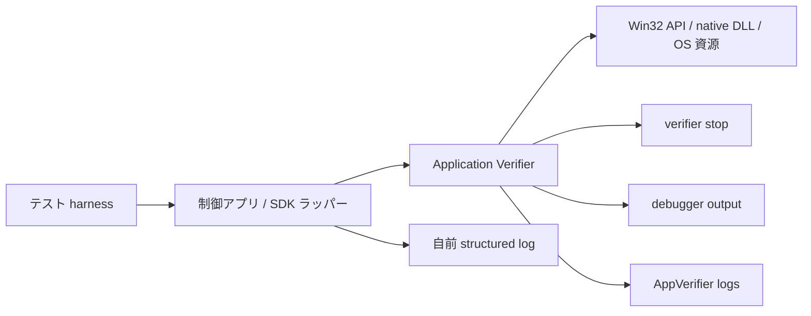
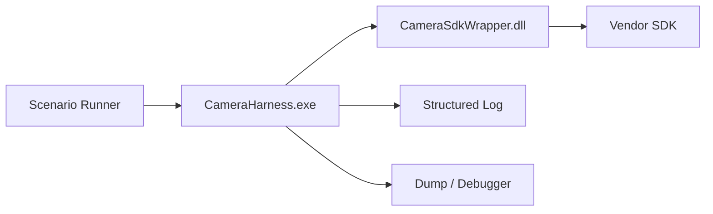

Application Verifier は、Windows のネイティブコードや Win32 境界で起きる異常を前倒しで表面化させたいときに有力なツールです。
特に、ハンドル異常、ヒープ破壊、低リソース時の failure path をテストしたい場面では、通常系の試験だけでは見えない問題をかなり早く表に出せます。

前編の [産業用カメラ制御アプリが1か月後に突然落ちるとき（前編） - ハンドルリークの見つけ方と長期稼働向けログ設計](https://comcomponent.com/blog/2026/03/11/002-handle-leak-industrial-camera-long-run-crash-part1/) では、長時間運転後に落ちる制御アプリを調べた結果、原因がハンドルリークだった事例を整理しました。  
ただ、ログを強化しただけではまだ半分です。本当にほしいのは、**今後もし想定外のプログラムミスでメモリリークやハンドルリーク、途中失敗、解放漏れが起きても、「何が起きたか分かる」状態になっているか** を、先に試せることです。

そこで使ったのが **Application Verifier** です。  
Windows のネイティブコードや Win32 境界で動く処理に対して、実行時にチェックや fault injection を入れられる道具です。実務で特に便利なのは、**本当にマシンのメモリを食い尽くさなくても、メモリ不足や資源不足っぽい壊れ方を前倒しで起こせる** ところです。

後編では、Application Verifier とは何か、どんなことができるか、それをどう異常系テスト基盤に組み込むかを、産業用カメラ制御アプリの文脈で整理します。

## 目次

1. まず結論（ひとことで）
2. Application Verifier とは何か
   - 2.1. ひとことで言うと何か
   - 2.2. どういう場面で効くか
   - 2.3. 何がうれしいか
3. Application Verifier でどんなことができるか
   - 3.1. Basics: Handles / Heaps / Locks / Memory / TLS など
   - 3.2. Low Resource Simulation: メモリ不足や資源不足の前倒し
   - 3.3. Page Heap と debugger
   - 3.4. `!avrf` / `!htrace` / ログ
4. 今回なぜ導入したか
   - 4.1. 目的は「バグを見つける」だけではない
   - 4.2. メモリ不足っぽい現象を起こす
   - 4.3. ハンドル異常が起きたときに追えるか確かめる
5. メモリ不足や資源不足のような現象をどう起こすか
   - 5.1. Low Resource Simulation の考え方
   - 5.2. 何を失敗させられるか
   - 5.3. 実務での当て方
6. ハンドル異常をどう見るか
   - 6.1. `Handles` チェック
   - 6.2. `!htrace` で open / close のスタックを見る
   - 6.3. 自前ログとどう組み合わせるか
7. 異常系テスト基盤の作り方
   - 7.1. 実行単位を harness に寄せる
   - 7.2. テストメニューを分ける
   - 7.3. 収集するもの
   - 7.4. 合格条件
   - 7.5. 注意点
8. ざっくり使い分け
9. まとめ
10. 参考資料

* * *

## 1. まず結論（ひとことで）

- Application Verifier は、Windows の **アンマネージド / ネイティブ境界** で起きる誤用を実行時に見つけやすくするツールです
- 便利なのは「バグを見つける」だけでなく、**普段は出にくい異常系を前倒しで起こせる** ことです
- `Handles` では invalid handle の検出、`Heaps` ではヒープ破壊の顕在化、`Low Resource Simulation` ではメモリ不足や資源不足っぽい状況の fault injection ができます
- 長時間常駐する EXE の leak 調査を Application Verifier だけに丸投げするのは筋が悪く、`Handle Count` や resource lifecycle の自前ログと組み合わせるのが現実的です
- 異常系テスト基盤では、**通常系の verifier run** と **fault injection run** を分けて回した方が読みやすいです
- DLL を試したい場合でも、Application Verifier を有効にする対象は、その DLL を実際に動かす **テスト用 EXE** です

要するに、Application Verifier は **Windows の native / Win32 周りにいる“いやらしいバグ”を表面に引きずり出す道具** です。  
特に、装置制御アプリのように native SDK、P/Invoke、Win32 API が普通に混ざる世界では、かなり相性がよいです。

## 2. Application Verifier とは何か

### 2.1. ひとことで言うと何か

Application Verifier は、Windows の user-mode アプリに対する **ランタイム検証ツール** です。  
実行中のアプリの OS API 利用や資源の扱い方を監視して、怪しい使い方を検出したり、意図的に失敗を注入したりできます。

「静的解析」や「単体テスト」と違って、**実際にそのコードパスを通したときにどう壊れるか** を見る道具です。  
なので、普段の機能テストでは見えない failure path を炙り出すのに向いています。



### 2.2. どういう場面で効くか

特に効きやすいのは、次のような場面です。

- native DLL やカメラ SDK を呼んでいる
- P/Invoke や COM をまたいでいる
- handle、heap、lock、virtual memory を直接または間接に多く使う
- 普通の正常系ではまず落ちないが、異常系でだけ寿命管理が崩れそう
- 「落ちる」よりも「たまに変な失敗を返す」が先に出る

逆に、**純 managed の世界だけの object graph を追うための道具** ではありません。  
なので、C# アプリでも native SDK や Win32 境界が厚いならかなり効きますが、純 managed heap leak をこれ 1 本で全部見る、という話ではないです。

### 2.3. 何がうれしいか

実務でうれしいのは、だいたい次の 3 つです。

1. **ネイティブ境界の誤用を早く止められる**
   - invalid handle
   - heap corruption
   - lock misuse
   - virtual memory API misuse など

2. **低リソース時にしか出ない壊れ方を前倒しできる**
   - `malloc` 相当がたまに失敗する
   - `CreateEvent` や `CreateFile` がたまに失敗する
   - `VirtualAlloc` が失敗する

3. **debugger と組み合わせると追いやすい**
   - `!avrf`
   - `!htrace`
   - `!heap -p -a`
   - verifier stop のログ

装置制御アプリで困るのは、「異常系で何が起きたか分からない」ことです。  
Application Verifier は、その“分からなさ”を減らすのにかなり効きます。

## 3. Application Verifier でどんなことができるか

### 3.1. Basics: Handles / Heaps / Locks / Memory / TLS など

Application Verifier の基本セットは `Basics` です。  
ここに、実務でよく使うチェックがまとまっています。

| レイヤ | 何を見るか | 今回の文脈での使いどころ |
| --- | --- | --- |
| `Handles` | invalid handle の使用 | close 済み / 壊れた handle を踏んでいないか |
| `Heaps` | heap corruption | native SDK 境界のバッファ破壊や use-after-free の炙り出し |
| `Leak` | DLL unload 時点で解放されていない資源 | 短命 harness のテストや unload を含むケースの確認 |
| `Locks` / `SRWLock` | lock の誤用 | reconnect と shutdown の競合確認 |
| `Memory` | `VirtualAlloc` / `MapViewOfFile` などの誤用 | 大きいバッファや共有メモリ周辺の異常確認 |
| `TLS` | Thread Local Storage API の誤用 | スレッド境界が複雑な native コードの保険 |
| `Threadpool` | threadpool API や worker state の整合性 | callback や非同期処理が多い場合の補助 |

ポイントは、**「落ちたあとで読めば分かる」ではなく、「怪しい使い方をその場で止める」** ことです。  
長時間運転型の不具合では、この前倒しがかなり効きます。

### 3.2. Low Resource Simulation: メモリ不足や資源不足の前倒し

実務でかなり便利なのがここです。  
**本当に RAM を食い尽くさなくても、メモリ不足や資源不足に近い現象を起こせる** からです。

考え方としては単純です。

- ある API 呼び出しを
- 一定確率で
- わざと失敗させる

これで、普段はまず通らない error path を通せます。

たとえば、次のような現象を意図的に起こしやすくなります。

- `HeapAlloc` や `VirtualAlloc` が失敗する
- `CreateFile` が失敗する
- `CreateEvent` が失敗する
- `MapViewOfFile` が失敗する
- `SysAllocString` のような OLE/COM 系割り当てが失敗する

本当にメモリ不足にしようとしてマシン全体を苦しめるより、こちらの方がずっと扱いやすいです。  
しかも、**特定の DLL だけを狙って fault injection を入れる** こともできます。装置制御アプリのように自前ラッパーと vendor SDK が混ざる構成では、かなり実務向きです。

### 3.3. Page Heap と debugger

ヒープ破壊を見るなら、`Heaps` と page heap の組み合わせが強いです。  
特に full page heap は、guard page を使って **壊れた瞬間に止めやすい** のが利点です。

ただし、これはだいぶ重いです。  
長時間の総当たりというより、**再現が近いシナリオに絞って debugger 下で回す** 方が使いやすいです。

なので、運用としてはこんな分け方が現実的です。

- まず `Basics` で広く当てる
- ヒープが怪しくなったら full page heap を使う
- 重すぎるときは light page heap に落とす
- 本番相当の長時間試験は、自前ログ中心で見る

要するに、AppVerifier は万能杖ではなく、**場面ごとに刃を替える工具** です。

### 3.4. `!avrf` / `!htrace` / ログ

Application Verifier は、stop を出して終わりではありません。  
debugger 拡張やログがあるので、何が起きたかを追いやすくなります。

- `!avrf`
  - 現在の verifier 設定や、今起きている stop を見る
- `!htrace`
  - handle の open / close / invalid reference のスタックを見る
- `!heap -p -a`
  - page heap と組み合わせて、壊れたヒープブロックをたどる
- AppVerifier のログ
  - stop が起きたときのログを残せる

特に `Handles` を有効にしていると、**handle tracing が自動で有効になる** のがありがたいです。  
これで「この handle をどこで開いて、どこで閉じたか」を後から追いやすくなります。

## 4. 今回なぜ導入したか

### 4.1. 目的は「バグを見つける」だけではない

今回の目的は、単に「AppVerifier で 1 個バグを見つける」ことではありませんでした。  
もっと実務的に言うと、次を確かめたかったです。

- 将来また別の failure path で資源漏れが起きたとき
- ちゃんとログに文脈が残るか
- debugger 情報と合わせて追い切れるか
- 「何が起きたか不明」という状態にならないか

つまり、**検出器** としてだけでなく、**観測基盤のテスト** として使いました。

### 4.2. メモリ不足っぽい現象を起こす

普段の開発機で本当にメモリ不足を起こすのは、なかなか面倒です。  
しかも、マシン全体が不安定になると、今度はテスト自体が雑音だらけになります。

そこで、Low Resource Simulation を使って、**メモリ不足や資源不足で起きそうな failure path を、狙って踏ませる** 方向にしました。

たとえば、次のような問いに答えやすくなります。

- `CreateEvent` が失敗したら、ログに `cameraId` と `phase` は残るか
- 中途半端な初期化のあとで clean up はちゃんと走るか
- `VirtualAlloc` が失敗したら、リトライで壊れないか
- save path の `CreateFile` 失敗時にハンドルが戻るか

ここがかなり大事で、**異常を起こすこと自体が目的ではなく、異常時に壊れ方が読めることが目的** です。

### 4.3. ハンドル異常が起きたときに追えるか確かめる

前編で出てきたハンドルリークもそうですが、ハンドルまわりは **最後に落ちた場所と本当の原因がずれやすい** です。

なので、確認したかったのは次です。

- invalid handle stop が出たときに、`!htrace` で open / close を追えるか
- 自前ログの `resourceId` / `sessionId` / `phase` と結びつくか
- 失敗後に handle count が戻るか
- harness を短命プロセスにしたとき、リークの差分が見やすいか

ここまで見えると、単なる「バグが出ました」から、**「どの責務で寿命管理が崩れたか」まで行ける** ようになります。

## 5. メモリ不足や資源不足のような現象をどう起こすか

### 5.1. Low Resource Simulation の考え方

Low Resource Simulation は、いわゆる **fault injection** です。  
低リソース環境を本物そっくりに再現するというより、**低リソース時に起きる代表的な API 失敗を人工的に混ぜる** イメージです。

なので、使いどころはかなりはっきりしています。

- failure path の後始末確認
- retry / reconnect の堅さ確認
- 途中成功・途中失敗の混ざる初期化確認
- 「普段は起きない失敗」でもログが残るか確認

ここでのコツは、**最初から何でも失敗させない** ことです。  
いきなり全部盛りにすると、ログが爆発して「何を見ているか」が分からなくなります。

### 5.2. 何を失敗させられるか

Low Resource Simulation では、代表的には次の種類の API を確率的に失敗させられます。

| 種類 | 例 | 装置制御アプリでの例 |
| --- | --- | --- |
| `Heap_Alloc` | ヒープ確保 | 一時バッファ、画像メタデータ、SDK ラッパー内部確保 |
| `Virtual_Alloc` | 仮想メモリ確保 | 大きめのフレームバッファ、リングバッファ |
| `File` | `CreateFile` など | 保存パスやログファイルの open |
| `Event` | `CreateEvent` など | frame ready 通知、stop/reconnect 同期 |
| `MapView` | `CreateMapView` など | 共有メモリや memory mapped file |
| `Ole_Alloc` | `SysAllocString` など | COM / OLE 境界 |
| `Wait` | `WaitForXXX` 系 | 同期待機失敗まわり |
| `Registry` | レジストリアクセス | 設定読み書きやドライバ周辺設定 |

実務では、全部を同時に開けるより、  
**今回見たい failure path に近いものから絞って開ける** のがだいぶ大事です。

### 5.3. 実務での当て方

コマンドラインのイメージとしては、たとえば次のようになります。

```text
appverif /verify CameraHarness.exe
appverif /verify CameraHarness.exe /faults
appverif -enable lowres -for CameraHarness.exe -with heap_alloc=20000 virtual_alloc=20000 file=20000 event=20000
appverif -query lowres -for CameraHarness.exe
```

考え方としては、こんな感じです。

1. まず `Basics` だけで通常系を回す
2. 次に `Low Resource Simulation` を足して fault injection ありで回す
3. 必要なら `file` や `event` など、見たい失敗だけ確率を持たせる
4. 特定 DLL だけ狙いたいなら、その DLL に絞って入れる

`/faults` のショートカットは便利ですが、これだけだと **`OLE_ALLOC` と `HEAP_ALLOC` 中心** です。  
`CreateFile` や `CreateEvent` の failure path を見たいなら、`-enable lowres -with file=... event=...` まで書いた方がかなり分かりやすいです。

装置制御アプリでは、**アプリ全体に fault をばらまくより、camera wrapper や save path の DLL に絞ったほうが読みやすい** ことが多いです。

たとえば、こういうシナリオを作れます。

- reconnect 開始直後の `CreateEvent` 失敗
- 保存開始時の `CreateFile` 失敗
- 一時バッファ確保失敗
- COM 変換の `SysAllocString` 失敗
- 待機 API の失敗経路確認

このへんは、普段の正常系テストだけではまず踏めません。  
だからこそ、意図的に踏ませる価値があります。

## 6. ハンドル異常をどう見るか

### 6.1. `Handles` チェック

ハンドル周りでは、まず `Handles` を使います。  
これで、invalid handle の使用を検出しやすくなります。

典型的には、次のような事故に効きます。

- close 済み handle をもう一度使う
- 壊れた handle 値を渡す
- 途中失敗で初期化されていない handle を使う
- lifetime が崩れて別スレッドから触る

長時間運転で見ると「たまに変なエラーが出る」だけでも、verifier 下ではその場で止まってくれることがあります。  
この前倒しはかなり助かります。

### 6.2. `!htrace` で open / close のスタックを見る

`Handles` がありがたいのは、**handle tracing と相性がよい** ことです。

```text
windbg -xd av -xd ch -xd sov CameraHarness.exe
!avrf
!htrace 0x00000ABC
```

`!htrace` で見たいのは、だいたい次です。

- その handle がどこで open されたか
- どこで close されたか
- invalid handle として参照されたか
- 想定より多く open が積み上がっていないか

ハンドルリークや handle misuse が厄介なのは、**最後にこけた API が本当の原因ではない** ことです。  
`!htrace` があると、その handle の履歴をかなり具体的に追えます。

### 6.3. 自前ログとどう組み合わせるか

とはいえ、Application Verifier だけでは足りません。  
特に、長時間常駐する EXE の leak 調査をこれだけでやるのは、だいぶしんどいです。

なので、実務では次を合わせます。

- 定期 `Handle Count`
- `sessionId`
- `resourceId`
- `phase`
- create/open と close/dispose の lifecycle log
- verifier stop 時の dump と debugger 出力

これで、たとえば次のように追えます。

1. heartbeat で `Handle Count` の傾きが怪しいと分かる
2. lifecycle log で `Create` はあるのに `Close` が無い resource を絞る
3. verifier run で invalid handle や misuse を前倒しで出す
4. `!htrace` で open / close stack を見る

この合わせ技で、かなり追いやすくなります。

## 7. 異常系テスト基盤の作り方

### 7.1. 実行単位を harness に寄せる

Application Verifier は、**動いている最中のプロセスに後から有効化できません**。  
設定してから起動、です。

しかも、設定は明示的に消すまで残ります。  
なので、実務では **本番アプリ本体より、テスト用 harness EXE** に寄せたほうが扱いやすいです。

たとえば、こういう構成です。



これなら、

- 1 シナリオ 1 プロセスで回せる
- leak 差分を見やすい
- AppVerifier 設定の ON/OFF を切り替えやすい
- DLL を試す場合も EXE 側で扱える

という利点があります。

コマンドのイメージは、たとえば次です。

```text
appverif /verify CameraHarness.exe
appverif /n CameraHarness.exe
```

有効化は起動前、解除は明示的に、です。  
このへんを harness 前提で回すと、設定の事故も減らしやすいです。

### 7.2. テストメニューを分ける

異常系テスト基盤では、全部を 1 回でやらない方がいいです。  
だいたい次の 3 本に分けると読みやすいです。

1. **通常系 + Basics**
   - 何も失敗を注入しない
   - verifier stop が出ないことを確認する

2. **fault injection 系**
   - `Low Resource Simulation`
   - `event` / `file` / `heap_alloc` / `virtual_alloc` などを狙って失敗させる

3. **heap 深掘り系**
   - `Heaps`
   - full page heap
   - debugger 下で局所的に再現する

ここを分けると、  
**「普段の使い方で壊れているのか」** と **「低リソース時だけ壊れるのか」** がごちゃつきにくいです。

特に fault injection の有無では、通る code path がかなり変わります。  
なので、**fault なしの run** と **fault ありの run** は両方回した方がよいです。

### 7.3. 収集するもの

最低限、次は取りたいです。

| 種類 | ほしいもの |
| --- | --- |
| アプリログ | `cameraId`, `sessionId`, `phase`, `handleCount`, `error code` |
| process 状態 | `Handle Count`, `Private Bytes`, `Thread Count` |
| debugger 情報 | `!avrf`, `!htrace`, 必要に応じて `!heap -p -a` |
| dump | verifier stop 時、または異常終了時 |
| AppVerifier ログ | stop の記録、必要なら XML 化して集計 |

必要なら AppVerifier 側のログも XML にして集計できます。  
ただ、そこだけ見ても原因は閉じないことが多いので、自前ログと並べて読む前提のほうが実務向きです。

ログが多いこと自体は偉くありません。  
**あとで因果がつながること** が大事です。

### 7.4. 合格条件

合格条件も、「落ちなかった」だけでは弱いです。  
今回の文脈では、少なくとも次は必要でした。

- 通常系 + Basics で verifier stop が出ない
- fault injection ありでも、想定した失敗はログに残る
- 中途半端に初期化された資源がきちんと片付く
- reconnect / retry 後に `Handle Count` が baseline 近くへ戻る
- verifier stop が出たとき、`sessionId` / `phase` / stack で追える
- 「何が起きたか分からない」失敗にならない

ここで大事なのは、  
**壊れないこと** と **壊れたときに追えること** を分けて評価することです。

### 7.5. 注意点

Application Verifier はかなり便利ですが、魔法ではありません。

- 実際に通していないコードパスは検証されない
- full page heap は重い
- third-party SDK 側で stop が出ることもある
- fault injection あり/なしで通るコードパスはかなり違う
- 純 managed heap leak の調査をこれ 1 本でやる道具ではない

なので、立ち位置としてはこうです。

- **長時間の傾き** は自前ログと counters
- **native 境界の誤用** は Application Verifier
- **異常時の因果の復元** は structured log + dump + debugger

この分業がいちばん実務向きです。

## 8. ざっくり使い分け

- **invalid handle や double close が怪しい**
  - `Handles` + `!htrace`

- **heap corruption / use-after-free が怪しい**
  - `Heaps` + full page heap + `!heap -p -a`

- **メモリ不足や資源不足っぽい現象を起こしたい**
  - `Low Resource Simulation`

- **長時間運転でじわじわ壊れる**
  - まず自前の `Handle Count` / `Private Bytes` / lifecycle log

- **DLL を試したい**
  - その DLL を呼ぶ harness EXE に対して Application Verifier を有効にする

最初から全部盛りにすると、だいたいログの霧になります。  
見たい failure path に近い刃から当てる方が、ずっと分かりやすいです。

## 9. まとめ

押さえたい点は次です。

Application Verifier の立ち位置:

- Windows の native / Win32 境界の runtime verifier
- Handles / Heaps / Locks / Memory / TLS / Low Resource Simulation などを使える
- 普段は出にくい failure path を前倒しで踏ませられる

今回の文脈で効いたこと:

- ハンドル異常が起きたときに `!htrace` で追いやすい
- メモリ不足や資源不足っぽい現象を、マシン全体を壊さずに起こしやすい
- そのとき自前ログが本当に役に立つかを確認できる

実務での使い方:

- 通常系 + Basics と fault injection 系を分けて回す
- harness EXE を用意して短命プロセスでシナリオを回す
- 自前ログ、dump、debugger 情報と組み合わせる
- 長時間 leak の傾きそのものは自前 counters で見る

Application Verifier は、  
**「めったに出ない異常」を“たまたま待つ”のではなく、“こちらから迎えに行く”ための道具** です。

装置制御アプリでは、壊れないことも大事ですが、  
壊れたときに **何が起きたかを説明できること** が、同じくらい大事です。  
その意味で、かなり実務向きの道具だと思います。

前編: [産業用カメラ制御アプリが1か月後に突然落ちるとき（前編） - ハンドルリークの見つけ方と長期稼働向けログ設計](https://comcomponent.com/blog/2026/03/11/002-handle-leak-industrial-camera-long-run-crash-part1/)

## 10. 参考資料

- [前編: 産業用カメラ制御アプリが1か月後に突然落ちるとき（前編） - ハンドルリークの見つけ方と長期稼働向けログ設計](https://comcomponent.com/blog/2026/03/11/002-handle-leak-industrial-camera-long-run-crash-part1/)
- [Application Verifier - Overview](https://learn.microsoft.com/en-us/windows-hardware/drivers/devtest/application-verifier)
- [Application Verifier - Testing Applications](https://learn.microsoft.com/en-us/windows-hardware/drivers/devtest/application-verifier-testing-applications)
- [Application Verifier - Tests within Application Verifier](https://learn.microsoft.com/en-us/windows-hardware/drivers/devtest/application-verifier-tests-within-application-verifier)
- [Application Verifier - Debugging Application Verifier Stops](https://learn.microsoft.com/en-us/windows-hardware/drivers/devtest/application-verifier-debugging-application-verifier-stops)
- [Application Verifier - Features](https://learn.microsoft.com/en-us/windows-hardware/drivers/devtest/application-verifier-features)
- [!htrace (WinDbg)](https://learn.microsoft.com/en-us/windows-hardware/drivers/debuggercmds/-htrace)
- [GetProcessHandleCount 関数 (processthreadsapi.h)](https://learn.microsoft.com/ja-jp/windows/win32/api/processthreadsapi/nf-processthreadsapi-getprocesshandlecount)

## Author GitHub

この記事の著者 Go Komura の GitHub アカウントは [gomurin0428](https://github.com/gomurin0428) です。

GitHub では [COM_BLAS](https://github.com/gomurin0428/COM_BLAS) と [COM_BigDecimal](https://github.com/gomurin0428/COM_BigDecimal) を公開しています。

[← ブログ一覧に戻る](https://comcomponent.com/blog/)

[問い合わせる](https://docs.google.com/forms/d/e/1FAIpQLSdQz2lqorHFF3fpJtfZv3Ohm5gHG7uyPtm7p_ydGwasc7Xi_g/viewform?usp=dialog)
