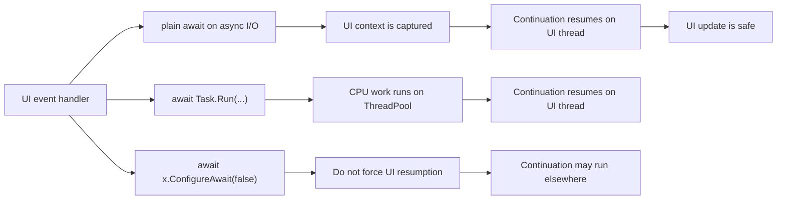

# WPF / WinForms async/await and the UI Thread in One Sheet - Where Continuations Resume, When to Use Dispatcher, and Why .Result Freezes the UI

The hardest part of `async` / `await` in WPF and WinForms is usually not the syntax.  
It is understanding **which thread the continuation returns to** and **when it is safe to touch the UI**.

## Contents

1. [Short version](#1-short-version)
2. [The first mental model](#2-the-first-mental-model)
3. [Key terms](#3-key-terms)
4. [Typical patterns](#4-typical-patterns)
5. [When to use Dispatcher / Invoke explicitly](#5-when-to-use-dispatcher--invoke-explicitly)
6. [Summary](#6-summary)

---

## 1. Short version

- In a WPF / WinForms UI event handler, a plain `await` usually resumes on the **UI thread**
- `Task.Run` is for moving **CPU-heavy work** off the UI thread, not for wrapping I/O just because it is asynchronous
- If you `await Task.Run(...)` from a UI handler and the `await` is plain, the continuation usually comes back to the UI thread
- `ConfigureAwait(false)` means "do not force resumption on the captured UI context"
- `.Result`, `.Wait()`, and `.GetAwaiter().GetResult()` block the UI thread and can easily cause hangs or at least visible freezes
- In WPF, explicitly returning to UI code usually means `Dispatcher.InvokeAsync`
- In WinForms, the explicit return path is traditionally `BeginInvoke` / `Invoke`, and `.NET 9+` adds `InvokeAsync`

## 2. The first mental model



The important takeaway is that plain `await` is usually your friend in UI code.  
The real enemy is **blocking the UI thread synchronously**.

## 3. Key terms

| Term | Meaning here |
| --- | --- |
| UI thread | the thread that owns the controls and message loop |
| message loop | the mechanism that keeps input, repaint, and events moving |
| `SynchronizationContext` | the abstraction that lets continuations resume in the original environment |
| `Dispatcher` | WPF's UI-thread queue |
| `Invoke` / `BeginInvoke` / `InvokeAsync` | APIs that push work back to the UI thread |

## 4. Typical patterns

### UI event handler + plain await

This is usually the most natural pattern for I/O:

```csharp
private async void LoadButton_Click(object sender, EventArgs e)
{
    string text = await File.ReadAllTextAsync(path);
    TextBoxPreview.Text = text;
}
```

### UI event handler + `Task.Run`

Use this when the work is CPU-heavy and would otherwise freeze the UI.

### `ConfigureAwait(false)`

This is most natural in reusable library code.
Once you use it, do not assume the continuation is still on the UI thread.

### `.Result` / `.Wait()`

These block the UI thread.  
If the awaited continuation needs that UI thread, you have created the classic deadlock / freeze pattern.

## 5. When to use Dispatcher / Invoke explicitly

Use them when:

- you are already on a background thread
- you used `ConfigureAwait(false)`
- a callback arrives on a non-UI thread
- a timer or worker service needs to update the UI

In short, if you no longer know that you are on the UI thread, do not touch the UI directly.

## 6. Summary

In WPF and WinForms, the practical questions are:

1. which thread am I on now?
2. where will this `await` continue?
3. who is responsible for returning to the UI thread?

If those answers are clear, most UI-thread async problems become ordinary design issues instead of mysterious freezes.
