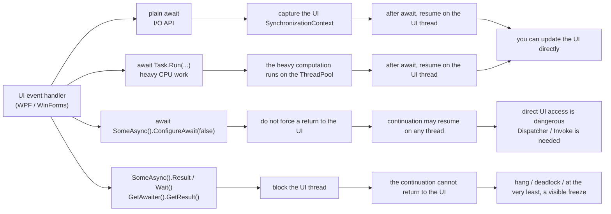
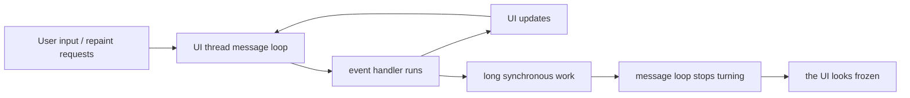
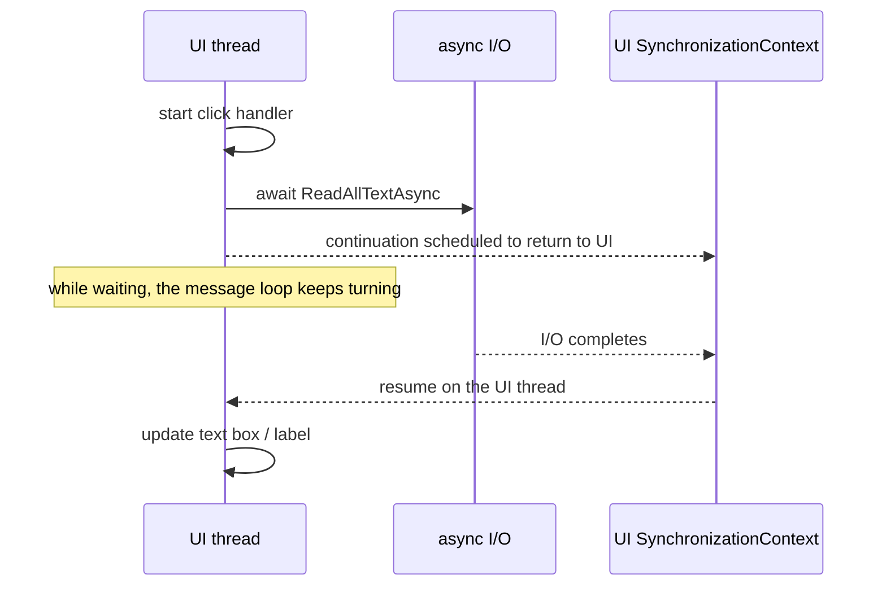
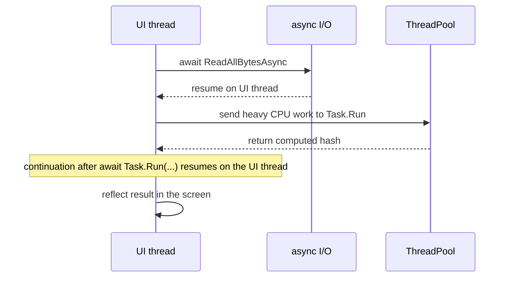
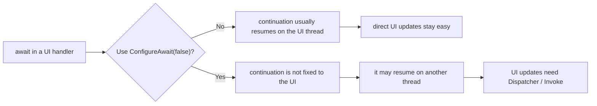
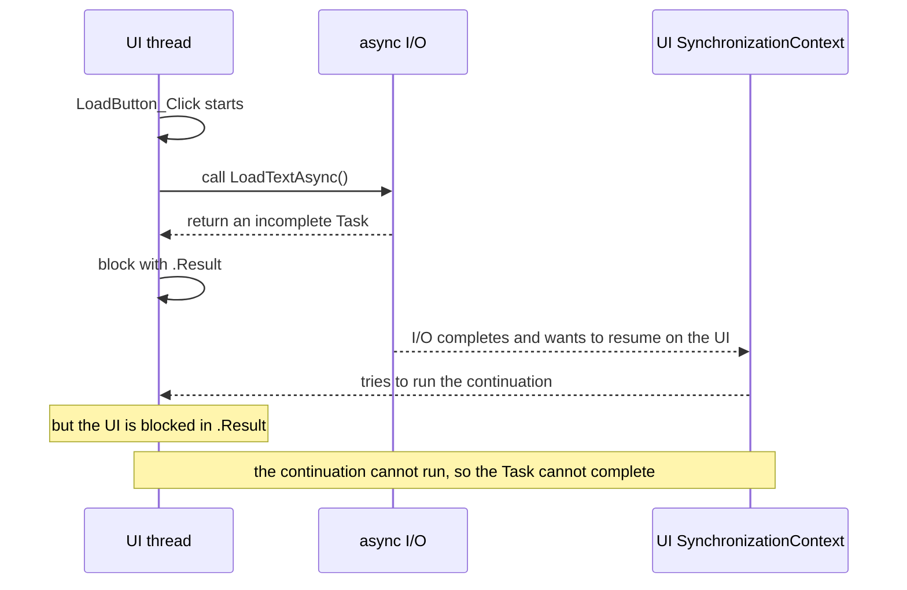
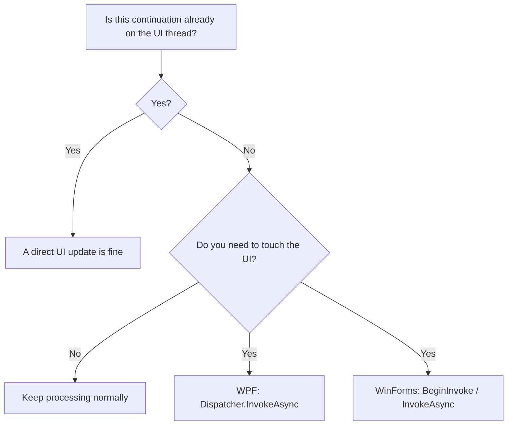

The hardest thing when using `async` / `await` in WPF / WinForms is usually **which thread execution returns to after `await`**, and **when it is safe to touch the UI**.
When `Dispatcher`, `BeginInvoke`, `ConfigureAwait(false)`, and `.Result` / `.Wait()` all get mixed together, the cause of UI freezes and cross-thread exceptions becomes hard to see.

This article focuses specifically on the relationship between the UI thread and `async` / `await` in WPF / WinForms.  
For the broader decision-making around `async` / `await`, it connects naturally to [C# async/await Best Practices - A decision table for Task.Run and ConfigureAwait](https://comcomponent.com/blog/2026/03/09/001-csharp-async-await-best-practices/).

The places where things start to smell like real production trouble are usually these:

* not knowing where execution continues after `await`
* not knowing whether the UI is safe to touch after `Task.Run`
* hesitating about where `ConfigureAwait(false)` belongs
* freezing the screen with `.Result` / `.Wait()` / `.GetAwaiter().GetResult()`
* mentally mixing WPF's `Dispatcher` with WinForms `Invoke` / `BeginInvoke` / `InvokeAsync`

WPF and WinForms are both **UI-thread-centered models**.  
So the most useful way to understand `async` / `await` here is not to start from abstract philosophy, but to ask **what this code is doing to the UI thread and its message loop**.

This article assumes mostly **WPF / WinForms applications on .NET 6 and later** and organizes:

- where continuation returns after `await`
- what `Dispatcher` is doing
- what `ConfigureAwait(false)` really means
- why `.Result` / `.Wait()` can get stuck

One version-specific note first: WinForms `Control.InvokeAsync` exists only on **.NET 9 and later**.  
Before that, the standard choices are still `BeginInvoke` and `Invoke`.

## Contents

1. [Short version](#1-short-version)
2. [First, see the whole picture in one page](#2-first-see-the-whole-picture-in-one-page)
   * 2.1. [Overall picture](#21-overall-picture)
   * 2.2. [The first decision table](#22-the-first-decision-table)
3. [Terms used in this article](#3-terms-used-in-this-article)
   * 3.1. [The UI thread and the message loop](#31-the-ui-thread-and-the-message-loop)
   * 3.2. [`SynchronizationContext` / `Dispatcher` / `Invoke`](#32-synchronizationcontext--dispatcher--invoke)
4. [Typical patterns](#4-typical-patterns)
   * 4.1. [Plain `await` inside a UI event handler](#41-plain-await-inside-a-ui-event-handler)
   * 4.2. [Use `Task.Run` only for heavy CPU work](#42-use-taskrun-only-for-heavy-cpu-work)
   * 4.3. [`ConfigureAwait(false)` does not mean "guaranteed not to return"](#43-configureawaitfalse-does-not-mean-guaranteed-not-to-return)
   * 4.4. [Why `.Result` / `.Wait()` / `.GetAwaiter().GetResult()` get stuck](#44-why-result--wait--getawaitergetresult-get-stuck)
5. [When to use `Dispatcher` / `Invoke`](#5-when-to-use-dispatcher--invoke)
6. [Common anti-patterns](#6-common-anti-patterns)
7. [Checklist for review](#7-checklist-for-review)
8. [Rough rule-of-thumb guide](#8-rough-rule-of-thumb-guide)
9. [Summary](#9-summary)
10. [References](#10-references)

* * *

## 1. Short version

* If you use plain `await` inside a **UI event handler** in WPF / WinForms, the continuation after `await` will **usually return to the UI thread**
* `Task.Run` is for **moving CPU-heavy work off the UI thread**, not for wrapping I/O waits
* Even if you `await Task.Run(...)` inside a UI handler, if that `await` is plain `await`, the continuation will usually return to the UI thread
* `ConfigureAwait(false)` means **do not force the continuation back to the captured UI context**. Touching the UI directly after that becomes dangerous
* `.Result` / `.Wait()` / `.GetAwaiter().GetResult()` **block the UI thread**. If the awaited continuation needs to return to the UI, this gets stuck very easily
* In WPF, if you explicitly need to get back onto the UI thread, the representative tool is `Dispatcher.InvokeAsync`
* In WinForms, the traditional choices are `BeginInvoke` / `Invoke`, and on .NET 9+ `InvokeAsync` fits async flow especially well
* A very practical starting rule is: **plain `await` at the outer UI layer, consider `ConfigureAwait(false)` in general-purpose libraries, and return to the UI explicitly only where needed**

Put differently, in WPF / WinForms, things become much easier to reason about once you separate:

1. which thread the code is on now
2. where the continuation will resume after `await`
3. who owns the responsibility for getting back to the UI

## 2. First, see the whole picture in one page

### 2.1. Overall picture

This diagram is the fastest way to get the whole shape into your head:



In real applications, most problems cluster around four patterns:

1. plain `await` in a UI event handler
2. using `Task.Run` inside a UI event handler to move CPU work away
3. removing the return to the UI with `ConfigureAwait(false)`
4. blocking the UI thread with `.Result` / `.Wait()`

### 2.2. The first decision table

| Situation | What runs while waiting | Continuation after `await` | Is direct UI access safe? | Default choice |
|---|---|---|---|---|
| `await SomeIoAsync()` inside a UI handler | the I/O completes asynchronously while the UI thread can go back to the message loop | usually the UI thread | yes | plain `await` |
| `await Task.Run(...)` inside a UI handler | the heavy CPU work runs on the ThreadPool | usually the UI thread | yes | `Task.Run` only for CPU work |
| `await x.ConfigureAwait(false)` inside a UI handler | the continuation is not fixed to the UI | any thread | no | generally avoid this in UI code |
| `x.Result` / `x.Wait()` on the UI thread | the UI thread is blocked while waiting | the continuation has a hard time resuming | no | do not do this |
| updating UI from a background thread or after `ConfigureAwait(false)` | the work is already outside the UI thread | the continuation is not on the UI | no | WPF: `Dispatcher.InvokeAsync`; WinForms: `BeginInvoke` / `InvokeAsync` |

The important idea in this table is that **plain `await` is usually your ally in UI code**.  
The real enemy is not async itself, but **synchronously blocking the UI thread**.

## 3. Terms used in this article

### 3.1. The UI thread and the message loop

In WPF / WinForms, the UI is basically organized around **one UI thread that processes input, painting, and events**.

That UI thread is responsible for things like:

* handling input and repaint messages
* being the only safe thread for touching controls and UI objects
* keeping the app responsive by not being blocked too long

The key point is that **the UI thread's job is to keep turning the message loop**.  
If you block it for too long, input, repaint, and event handling stop, and the user experiences the app as "frozen."



### 3.2. `SynchronizationContext` / `Dispatcher` / `Invoke`

These words come up repeatedly, so it helps to map them simply:

| Term | Meaning here |
|---|---|
| UI thread | the thread that created the UI objects and generally owns them |
| message loop | the mechanism by which the UI thread processes messages |
| `SynchronizationContext` | an abstraction that lets code resume in the same execution environment |
| `Dispatcher` | WPF's queue for the UI thread |
| `Invoke` / `BeginInvoke` / `InvokeAsync` | APIs that post work back to the UI thread |

More precisely, `await` chooses where to resume by first looking at the current `SynchronizationContext`, and if there is no special one, it can also pay attention to a non-default `TaskScheduler`.
In everyday WPF / WinForms work, though, it is usually enough to understand it as **"the UI `SynchronizationContext` is in effect."**

Framework-wise, the mapping looks roughly like this:

| Framework | UI-side context | Common API for explicitly returning to the UI |
|---|---|---|
| WPF | `DispatcherSynchronizationContext` | `Dispatcher.InvokeAsync` / `Dispatcher.BeginInvoke` / `Dispatcher.Invoke` |
| WinForms | `WindowsFormsSynchronizationContext` | `Control.BeginInvoke` / `Control.Invoke` / `.NET 9+ Control.InvokeAsync` |

WPF is centered on the `Dispatcher`.  
WinForms is centered on control handles and the message loop, which is why `BeginInvoke` / `Invoke` are so prominent there.


## 4. Typical patterns

### 4.1. Plain `await` inside a UI event handler

This is the most natural pattern.

```csharp
private async void LoadButton_Click(object sender, RoutedEventArgs e)
{
    LoadButton.IsEnabled = false;
    StatusText.Text = "Loading...";

    try
    {
        string text = await File.ReadAllTextAsync(FilePathTextBox.Text);
        PreviewTextBox.Text = text;
        StatusText.Text = "Done";
    }
    catch (Exception ex)
    {
        StatusText.Text = ex.Message;
    }
    finally
    {
        LoadButton.IsEnabled = true;
    }
}
```

In this code:

* the event handler starts on the UI thread
* the I/O wait does not block the UI thread
* because the `await` is plain, the UI context is usually captured
* the continuation returns to the UI thread
* updating `PreviewTextBox.Text` directly is normally safe

That means no extra `Dispatcher` is required here.
If you simply use plain `await` inside a UI handler, you can normally keep writing UI updates directly after the await.



### 4.2. Use `Task.Run` only for heavy CPU work

`Task.Run` helps when you want to **move heavy CPU work off the UI thread**.

```csharp
private async void HashButton_Click(object sender, RoutedEventArgs e)
{
    HashButton.IsEnabled = false;
    ResultText.Text = "Calculating...";

    try
    {
        byte[] data = await File.ReadAllBytesAsync(InputPathTextBox.Text);

        string hash = await Task.Run(() =>
        {
            using SHA256 sha256 = SHA256.Create();
            byte[] digest = sha256.ComputeHash(data);
            return Convert.ToHexString(digest);
        });

        ResultText.Text = hash;
    }
    catch (Exception ex)
    {
        ResultText.Text = ex.Message;
    }
    finally
    {
        HashButton.IsEnabled = true;
    }
}
```

What happens here is:

1. the event handler starts on the UI thread
2. the file I/O is awaited asynchronously
3. only the heavy hashing work is moved to the ThreadPool with `Task.Run`
4. because `await Task.Run(...)` is still a plain `await`, the continuation usually returns to the UI thread
5. `ResultText.Text = hash;` can still be written directly

So **only the inside of `Task.Run` is on another thread**.
The code does not permanently move into a "not-UI place" after that.



Two practical cautions matter here:

* do not wrap I/O waits in `Task.Run`
* think of `Task.Run` as "where the CPU work should run," not as "how to make something asynchronous"

### 4.3. `ConfigureAwait(false)` does not mean "guaranteed not to return"

This is one of the most misunderstood areas.

First, `ConfigureAwait(false)` is most natural in **general-purpose library code that does not depend on the UI or on a specific application model**.

```csharp
public sealed class DocumentRepository
{
    public async Task<string> LoadNormalizedTextAsync(string path, CancellationToken cancellationToken)
    {
        string text = await File.ReadAllTextAsync(path, cancellationToken).ConfigureAwait(false);
        return text.Replace("\r\n", "\n", StringComparison.Ordinal);
    }
}
```

This method does not touch the UI.
It can be used from WPF, WinForms, ASP.NET Core, workers, or elsewhere.
That is exactly the kind of place where `ConfigureAwait(false)` is very natural.

Then the UI-side caller can still use plain `await`.

```csharp
private readonly DocumentRepository _repository = new();

private async void OpenButton_Click(object sender, RoutedEventArgs e)
{
    OpenButton.IsEnabled = false;
    StatusText.Text = "Loading...";

    try
    {
        string text = await _repository.LoadNormalizedTextAsync(
            PathTextBox.Text,
            CancellationToken.None);

        PreviewTextBox.Text = text;
        StatusText.Text = "Done";
    }
    catch (Exception ex)
    {
        StatusText.Text = ex.Message;
    }
    finally
    {
        OpenButton.IsEnabled = true;
    }
}
```

The important point is that **`ConfigureAwait(false)` inside the library does not force the caller's `await` to become false as well**.

So the split becomes:

* inside the library: do not return to the UI
* in the UI handler: use plain `await`, so the caller resumes on the UI thread

By contrast, this is dangerous:

```csharp
private async void OpenButton_Click(object sender, RoutedEventArgs e)
{
    string text = await _repository.LoadNormalizedTextAsync(
        PathTextBox.Text,
        CancellationToken.None).ConfigureAwait(false);

    PreviewTextBox.Text = text;
}
```

Here, the continuation of **that UI handler's own await** is no longer forced back to the UI.
That makes `PreviewTextBox.Text = text;` a potential cross-thread UI access.

There is another subtle point.
`ConfigureAwait(false)` does **not** mean "always move to the ThreadPool."

If the awaited operation is already complete and there is no real wait, the continuation may simply continue on the current thread.

So `ConfigureAwait(false)` does **not** mean:

* "you will definitely switch to another thread"
* "from here on, you are definitely no longer on the UI thread"

Its real meaning is only:

* **do not force the continuation of this await back to the captured UI context**

That interpretation leads to fewer mistakes.



### 4.4. Why `.Result` / `.Wait()` / `.GetAwaiter().GetResult()` get stuck

This is one of the most common accidents.

```csharp
private void LoadButton_Click(object sender, RoutedEventArgs e)
{
    string text = LoadTextAsync().Result;
    PreviewTextBox.Text = text;
}

private async Task<string> LoadTextAsync()
{
    string text = await File.ReadAllTextAsync(FilePathTextBox.Text);
    return text.ToUpperInvariant();
}
```

At first glance, this looks like a simple synchronous wait.
But on the UI thread, it is extremely dangerous.



What is happening in words is:

1. the UI thread calls `LoadTextAsync()`
2. the `await` inside it captures the UI context
3. the UI thread blocks on `.Result`
4. the I/O completes
5. the continuation wants to return to the UI thread
6. but the UI thread is blocked
7. so the continuation cannot run
8. and `.Result` never completes

In other words, **the UI says "I will wait for you to finish," while the async method says "I can only finish if I get back onto the UI."**

That is the classic stuck state.

It is also a mistake to assume that `GetAwaiter().GetResult()` is safe.
It changes exception wrapping, but **it still blocks the UI thread**.

So on the UI thread, treat these three with the same suspicion:

* `.Result`
* `.Wait()`
* `.GetAwaiter().GetResult()`

Also note that synchronously waiting on the `Task` returned by `Dispatcher.InvokeAsync(...)` in WPF is dangerous for the same general reason.

Strictly speaking, these patterns do not always produce a formal deadlock.
If the continuation does not actually need the UI, they may "only" freeze the screen instead.
But that is still more than bad enough.

## 5. When to use `Dispatcher` / `Invoke`

If you are in a **plain UI handler with plain `await`**, you usually do not need explicit `Dispatcher` / `Invoke`.

You need them in situations like:

* you want to touch the UI after a `ConfigureAwait(false)` continuation
* you are inside `Task.Run` or another background thread
* a socket callback, timer callback, or event callback arrives on a non-UI thread
* you intentionally separated the UI layer and the non-UI layer and now need to marshal the final update back

In WPF, the representative tool is `Dispatcher.InvokeAsync`.

```csharp
private async Task RefreshPreviewAsync(string path, CancellationToken cancellationToken)
{
    string text = await File.ReadAllTextAsync(path, cancellationToken).ConfigureAwait(false);

    await Dispatcher.InvokeAsync(() =>
    {
        PreviewTextBox.Text = text;
        StatusText.Text = "Done";
    });
}
```

In WinForms, `.NET 9+` gives you `InvokeAsync`, which fits async flow very well.

```csharp
private async Task RefreshPreviewAsync(string path, CancellationToken cancellationToken)
{
    string text = await File.ReadAllTextAsync(path, cancellationToken).ConfigureAwait(false);

    await previewTextBox.InvokeAsync(() =>
    {
        previewTextBox.Text = text;
        statusLabel.Text = "Done";
    });
}
```

In older WinForms patterns, `BeginInvoke` is still the usual non-blocking option.
`Invoke` sends synchronously and blocks the caller.
In async flows, the non-blocking side is usually the better fit.

A rough practical guide is enough:

| What you want to do | WPF | WinForms |
|---|---|---|
| enter the UI synchronously | `Dispatcher.Invoke` | `Control.Invoke` |
| post to the UI asynchronously | `Dispatcher.InvokeAsync` / `Dispatcher.BeginInvoke` | `Control.BeginInvoke` / `.NET 9+ Control.InvokeAsync` |
| fit naturally into async / await | `Dispatcher.InvokeAsync` | `.NET 9+ Control.InvokeAsync`, or `BeginInvoke` before that |

In day-to-day code, this rule-of-thumb is usually enough:

* if you are simply using plain `await` inside a UI handler, you do not need them
* if you need to touch the UI from outside the UI context, you do
* do not overuse synchronous `Invoke` inside async flows



## 6. Common anti-patterns

| Anti-pattern | Why it hurts | Better first replacement |
|---|---|---|
| `LoadAsync().Result` in a UI handler | blocks the UI thread, easy to deadlock | `await LoadAsync()` |
| `LoadAsync().Wait()` in a UI handler | same problem, message loop stops | `await LoadAsync()` |
| `LoadAsync().GetAwaiter().GetResult()` in a UI handler | same blocking behavior, different exception shape | `await LoadAsync()` |
| mechanically applying `ConfigureAwait(false)` in UI code | the continuation after await becomes unsafe for direct UI access | keep plain `await` at the outer UI layer |
| `Task.Run(async () => await IoAsync())` | pushes I/O through the ThreadPool for no real benefit | `await IoAsync()` |
| letting library code hold `Dispatcher` or `Control` directly | UI dependency leaks deep into non-UI layers | return data from the library and marshal at the UI boundary |
| overusing `Dispatcher.Invoke` / `Control.Invoke` in async flows | easy to build blocking chains | prefer `Dispatcher.InvokeAsync` / `BeginInvoke` / `InvokeAsync` |
| forcing async into constructors or sync property getters | common source of startup hangs | move the work into `Loaded`, `Shown`, or `InitializeAsync` |

The three most common ones are:

1. `.Result` / `.Wait()` on the UI thread
2. mechanically adding `ConfigureAwait(false)` to UI code
3. mixing library responsibilities with UI responsibilities until `Dispatcher` leaks everywhere

Removing just those already calms things down a lot.

## 7. Checklist for review

When reviewing WPF / WinForms async code, this order usually works well:

* Are `.Result`, `.Wait()`, or `.GetAwaiter().GetResult()` still present in UI event handlers or UI initialization paths?
* Is `Task.Run` used only for **CPU-heavy work**, not for I/O?
* Is `ConfigureAwait(false)` being applied mechanically inside UI code?
* On the other hand, does general-purpose library code still accidentally depend on a UI context?
* When UI is touched after `await`, is it really guaranteed that the continuation is on the UI thread?
* When explicit marshaling back to the UI is required, is the code using `Dispatcher.InvokeAsync`, `BeginInvoke`, or `InvokeAsync` appropriately?
* Are synchronous marshaling calls like `Dispatcher.Invoke` / `Control.Invoke` increasing unnecessarily?
* Is async being forced back into synchronous constructors, property getters, or event paths?
* Is library code directly referencing `Window`, `Control`, or `Dispatcher`?

This checklist is also useful for aligning a team around **where the UI boundary really is**.

## 8. Rough rule-of-thumb guide

| What you want to do | First thing to choose |
|---|---|
| wait for HTTP / DB / file I/O in a UI handler | plain `await` |
| run heavy CPU work without freezing the UI | `await Task.Run(...)` |
| update the UI after `ConfigureAwait(false)` or from a background thread | WPF: `Dispatcher.InvokeAsync`; WinForms: `BeginInvoke` or `.NET 9+ InvokeAsync` |
| write a reusable library | consider `ConfigureAwait(false)` |
| synchronize async work back into a UI call | generally do not; make the caller async instead |
| do startup initialization | `Loaded`, `Shown`, or an explicit `InitializeAsync` |
| keep direct UI access after `await` | preserve plain `await` at the outer UI layer |

## 9. Summary

The most important thing in WPF / WinForms `async` / `await` is not a vague idea that "async is difficult."
What matters is separating:

* **where the code started**
* **where the continuation returns after `await`**
* **who owns the responsibility for getting back onto the UI thread**

A very practical starting set of rules is:

1. plain `await` at the outer UI layer
2. `Task.Run` only for heavy CPU work
3. consider `ConfigureAwait(false)` in general-purpose libraries
4. use `Dispatcher` / `BeginInvoke` / `InvokeAsync` only when you truly need to re-enter the UI
5. do not use `.Result` / `.Wait()` / `.GetAwaiter().GetResult()` on the UI thread

`async` / `await` itself is not especially hostile.
What becomes hostile is using it **without keeping the UI thread in view**.

If you separate inside and outside of the UI, think about where continuations resume, and avoid bringing blocking into the UI thread, WPF / WinForms async code becomes much calmer.
Code that freezes the screen is usually not "what async does"; it is usually **careless debt against the UI thread**.

## 10. References

* [Related: C# async/await Best Practices - A decision table for Task.Run and ConfigureAwait](https://comcomponent.com/blog/2026/03/09/001-csharp-async-await-best-practices/)
* [Threading Model - WPF](https://learn.microsoft.com/en-us/dotnet/desktop/wpf/advanced/threading-model)
* [DispatcherSynchronizationContext Class](https://learn.microsoft.com/ja-jp/dotnet/api/system.windows.threading.dispatchersynchronizationcontext?view=windowsdesktop-10.0)
* [How to handle cross-thread operations with controls - Windows Forms](https://learn.microsoft.com/en-us/dotnet/desktop/winforms/controls/how-to-make-thread-safe-calls)
* [WindowsFormsSynchronizationContext Class](https://learn.microsoft.com/en-us/dotnet/api/system.windows.forms.windowsformssynchronizationcontext?view=windowsdesktop-10.0)
* [Events Overview - Windows Forms](https://learn.microsoft.com/en-us/dotnet/desktop/winforms/forms/events)
* [TaskScheduler.FromCurrentSynchronizationContext Method](https://learn.microsoft.com/ja-jp/dotnet/api/system.threading.tasks.taskscheduler.fromcurrentsynchronizationcontext?view=net-9.0)
* [ConfigureAwait FAQ](https://devblogs.microsoft.com/dotnet/configureawait-faq/)
* [How Async/Await Really Works in C#](https://devblogs.microsoft.com/dotnet/how-async-await-really-works/)
* [Await, and UI, and deadlocks! Oh my!](https://devblogs.microsoft.com/dotnet/await-and-ui-and-deadlocks-oh-my/)
* [Threading model for WebView2 apps](https://learn.microsoft.com/en-us/microsoft-edge/webview2/concepts/threading-model)
