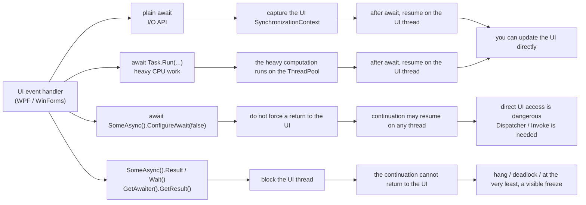
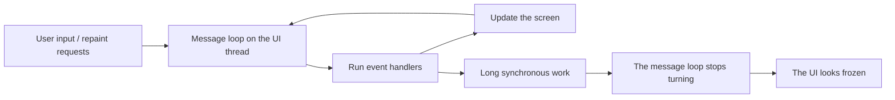
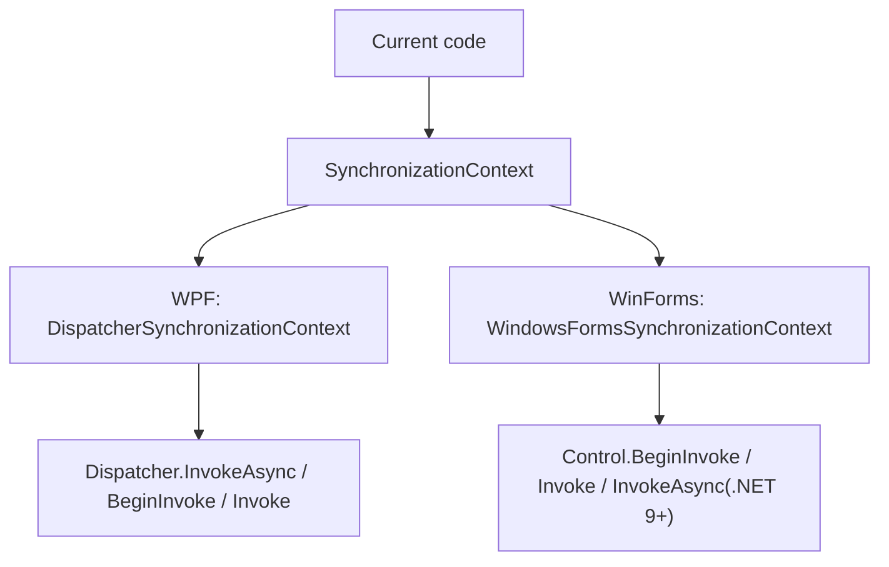
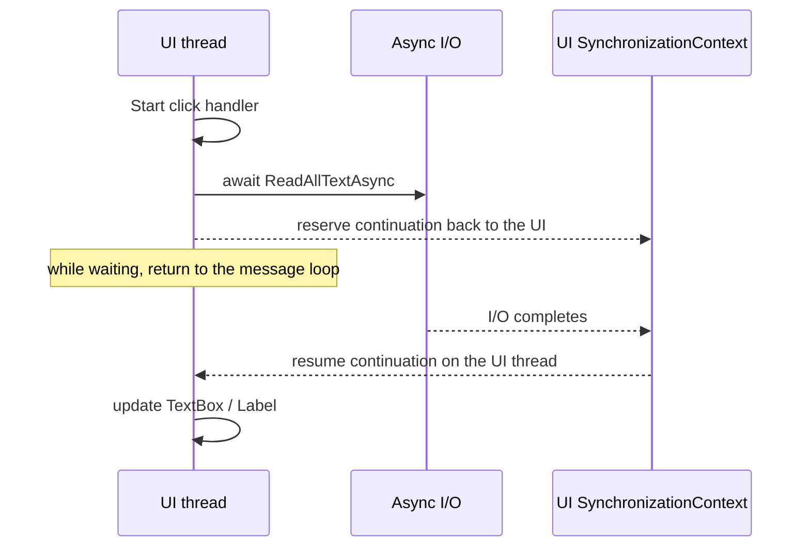
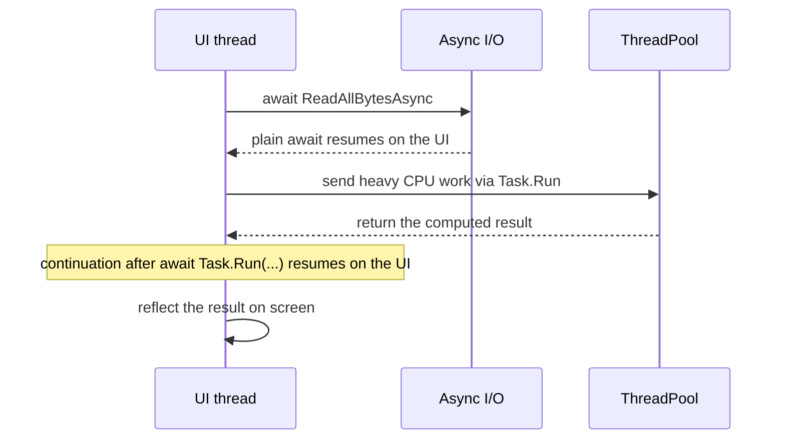
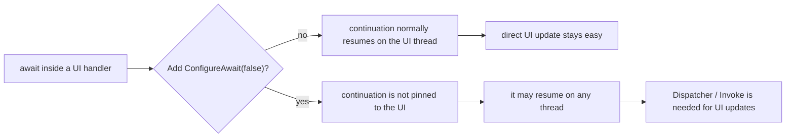
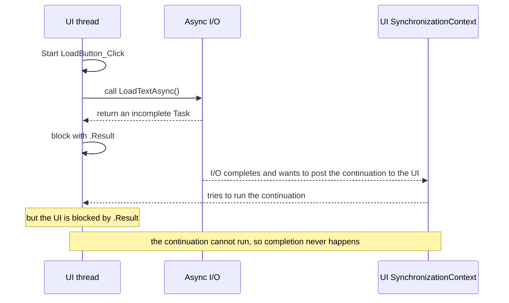
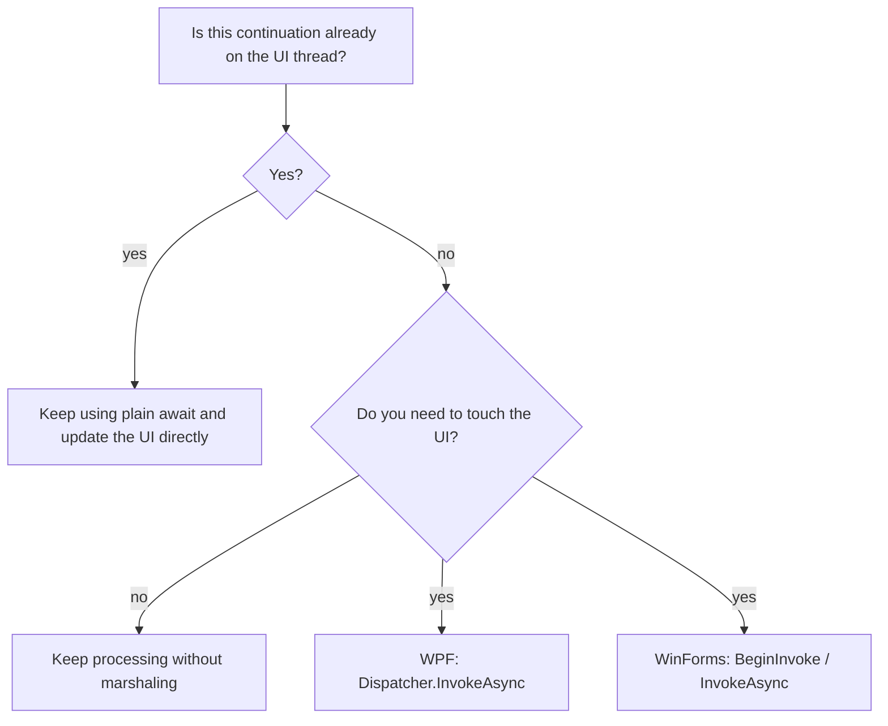

The easiest place to get lost when using `async` / `await` in WPF / WinForms is **which thread execution returns to after `await`**, and **when it is safe to touch the UI**.
Once `Dispatcher`, `BeginInvoke`, `ConfigureAwait(false)`, and `.Result` / `.Wait()` get mixed together, the cause of freezes and cross-thread exceptions becomes hard to see.

This article focuses specifically on the relationship between the UI thread and `async` / `await` in WPF / WinForms.  
For the broader decision-making around `async` / `await`, it connects naturally to [C# async/await Best Practices - A decision table for Task.Run and ConfigureAwait](/en/blog/2026/03/09/001-csharp-async-await-best-practices/).

The places that start to smell like real production trouble are usually these:

* not knowing where execution resumes after `await`
* not knowing whether it is safe to touch the UI after `Task.Run`
* hesitating about where `ConfigureAwait(false)` belongs
* freezing the screen with `.Result` / `.Wait()` / `.GetAwaiter().GetResult()`
* mentally mixing WPF `Dispatcher` with WinForms `Invoke` / `BeginInvoke` / `InvokeAsync`

WPF and WinForms are both **UI-thread-centered models**.  
So the most useful way to understand `async` / `await` here is not abstract philosophy about asynchrony. It is being explicit about **what your code is doing to the UI thread and its message loop**.

This article assumes mostly **WPF / WinForms applications on .NET 6 and later** and organizes the practical reasoning around continuation destinations after `await`, `Dispatcher`, `ConfigureAwait(false)`, and why `.Result` / `.Wait()` get stuck.

One version-specific note first: WinForms `Control.InvokeAsync` exists only on **.NET 9 and later**.  
Before that, the standard choices are still `BeginInvoke` and `Invoke`.

## Contents

1. [Short version](#1-short-version)
2. [First, see the whole picture in one page](#2-first-see-the-whole-picture-in-one-page)
   * 2.1. [Overall picture](#21-overall-picture)
   * 2.2. [Quick decision table](#22-quick-decision-table)
3. [Terms used in this article](#3-terms-used-in-this-article)
   * 3.1. [The UI thread and the message loop](#31-the-ui-thread-and-the-message-loop)
   * 3.2. [`SynchronizationContext` / `Dispatcher` / `Invoke`](#32-synchronizationcontext--dispatcher--invoke)
4. [Typical patterns](#4-typical-patterns)
   * 4.1. [Plain `await` inside a UI event handler](#41-plain-await-inside-a-ui-event-handler)
   * 4.2. [Use `Task.Run` only for heavy CPU work](#42-use-taskrun-only-for-heavy-cpu-work)
   * 4.3. [`ConfigureAwait(false)` means "do not force a return," not "guaranteed not to return"](#43-configureawaitfalse-means-do-not-force-a-return-not-guaranteed-not-to-return)
   * 4.4. [Why `.Result` / `.Wait()` / `.GetAwaiter().GetResult()` get stuck](#44-why-result--wait--getawaitergetresult-get-stuck)
5. [When to use `Dispatcher` / `Invoke`](#5-when-to-use-dispatcher--invoke)
6. [Common anti-patterns](#6-common-anti-patterns)
7. [Checklist for review](#7-checklist-for-review)
8. [Rough rule-of-thumb guide](#8-rough-rule-of-thumb-guide)
9. [Summary](#9-summary)
10. [References](#10-references)

* * *

## 1. Short version

* If you use plain `await` inside a **UI event handler** in WPF / WinForms, the continuation after `await` will **normally return to the UI thread**
* `Task.Run` is for **moving CPU-heavy work off the UI thread**, not for wrapping I/O waits
* Even if you `await Task.Run(...)` inside a UI handler, if that `await` is plain `await`, the continuation will usually resume on the UI thread
* `ConfigureAwait(false)` means **do not force the continuation back to the captured UI context**. Touching the UI directly after that is dangerous
* `.Result` / `.Wait()` / `.GetAwaiter().GetResult()` **block the UI thread**. If the awaited continuation needs to return to the UI, they get stuck very easily
* In WPF, the representative way to return explicitly to the UI is `Dispatcher.InvokeAsync`
* In WinForms, the traditional choice is `BeginInvoke`, and on .NET 9+ `InvokeAsync` fits async flow especially well
* A practical first rule is: **plain `await` at the outer UI layer, consider `ConfigureAwait(false)` in general-purpose libraries, and return to the UI explicitly only where needed**

In other words, WPF / WinForms becomes much easier to reason about once you separate:

1. which thread the code is on now
2. where the continuation will resume after `await`
3. who owns the responsibility for getting back to the UI

## 2. First, see the whole picture in one page

### 2.1. Overall picture

This diagram is the fastest way to get the overall shape into your head.



In real applications, most problems cluster around four patterns:

1. plain `await` in a UI event handler
2. using `Task.Run` inside a UI event handler to move CPU work away
3. removing the return to the UI with `ConfigureAwait(false)`
4. blocking the UI thread with `.Result` / `.Wait()`

### 2.2. Quick decision table

| Situation | What runs while waiting | Continuation after `await` | Is direct UI access safe? | First choice |
|---|---|---|---|---|
| `await SomeIoAsync()` inside a UI handler | waiting for I/O completion while the UI thread can return to the message loop | normally the UI thread | yes | plain `await` |
| `await Task.Run(...)` inside a UI handler | heavy CPU work runs on the ThreadPool | normally the UI thread | yes | `Task.Run` only for CPU work |
| `await x.ConfigureAwait(false)` inside a UI handler | the continuation is not pinned to the UI | any thread | no | usually avoid this in UI code |
| `x.Result` / `x.Wait()` on the UI thread | the UI thread is blocked by waiting | the continuation has trouble running at all | no | do not use it |
| update the UI after background-thread work or after `ConfigureAwait(false)` | the code is already running outside the UI thread | it is still not on the UI thread | no | `Dispatcher.InvokeAsync` / `BeginInvoke` / `InvokeAsync` |

The important point in this table is that **plain `await` is usually your ally in UI code**.  
The enemy is not `await` itself. The enemy is **synchronously blocking the UI thread**.

## 3. Terms used in this article

### 3.1. The UI thread and the message loop

In WPF / WinForms, the basic shape is that **there is one UI thread, and it is responsible for input, drawing, and event handling**.

That UI thread is generally responsible for:

* processing messages such as button clicks, key input, and repaint requests
* being the only thread allowed to safely touch controls and UI objects
* stalling screen updates and user input if you overload it with long-running work

The key idea is that **the UI thread's job is to keep turning quickly**.  
If you block it for a long time, mouse input, keyboard input, and repainting all stall, and from the user's perspective the app "froze."

This diagram is a good mental model to keep:



### 3.2. `SynchronizationContext` / `Dispatcher` / `Invoke`

Here is a practical split of the terms that appear often:

| Term | Meaning in this article |
|---|---|
| UI thread | the thread that created the UI objects. Normally only this thread can safely touch the UI |
| message loop | the mechanism by which the UI thread processes messages one by one |
| `SynchronizationContext` | an abstraction for "post the continuation back to this execution context" |
| `Dispatcher` | WPF's queue for work that must run on the UI thread |
| `Invoke` / `BeginInvoke` / `InvokeAsync` | APIs for posting work to the UI thread |

Strictly speaking, when deciding where to continue, `await` first prefers the current `SynchronizationContext`, and if there is none it may also consider a non-default `TaskScheduler`.  
But in day-to-day WPF / WinForms work, it is usually enough to think of it as **the UI `SynchronizationContext` being the thing that matters**.

This is a good way to picture the framework-specific mapping:

| Framework | UI-side context | Representative API for explicitly returning to the UI |
|---|---|---|
| WPF | `DispatcherSynchronizationContext` | `Dispatcher.InvokeAsync` / `Dispatcher.BeginInvoke` / `Dispatcher.Invoke` |
| WinForms | `WindowsFormsSynchronizationContext` | `Control.BeginInvoke` / `Control.Invoke` / `.NET 9+ Control.InvokeAsync` |

WPF centers on `Dispatcher`.  
WinForms centers more visibly on a control handle and the message loop, so `BeginInvoke` / `Invoke` tends to show up at the surface.

In practice, it is enough to remember the abstraction-to-implementation relation at about this level:



## 4. Typical patterns

### 4.1. Plain `await` inside a UI event handler

This is the most straightforward shape.

```csharp
private async void LoadButton_Click(object sender, RoutedEventArgs e)
{
    LoadButton.IsEnabled = false;
    StatusText.Text = "Loading...";

    try
    {
        string text = await File.ReadAllTextAsync(FilePathTextBox.Text);
        PreviewTextBox.Text = text;
        StatusText.Text = "Done";
    }
    catch (Exception ex)
    {
        StatusText.Text = ex.Message;
    }
    finally
    {
        LoadButton.IsEnabled = true;
    }
}
```

In this code, `LoadButton_Click` **starts on the UI thread**.  
And because `await File.ReadAllTextAsync(...)` is plain `await`, it normally **captures the current UI context**.

That gives you this behavior:

* the file I/O wait does not occupy the UI thread
* after the read completes, execution normally resumes on the UI thread
* `PreviewTextBox.Text = text;` can be written directly

No extra `Dispatcher` is needed here.  
**If you are inside a UI handler and you just used plain `await`, you can normally keep touching the UI directly.**

The same interpretation applies in WinForms.  
As long as you use plain `await` inside a `Click` handler, the continuation will normally come back to the UI side.

Visually, the flow looks like this:



### 4.2. Use `Task.Run` only for heavy CPU work

`Task.Run` is useful when you want to **move heavy CPU work off the UI thread**.

```csharp
private async void HashButton_Click(object sender, RoutedEventArgs e)
{
    HashButton.IsEnabled = false;
    ResultText.Text = "Computing...";

    try
    {
        byte[] data = await File.ReadAllBytesAsync(InputPathTextBox.Text);

        string hash = await Task.Run(() =>
        {
            using SHA256 sha256 = SHA256.Create();
            byte[] digest = sha256.ComputeHash(data);
            return Convert.ToHexString(digest);
        });

        ResultText.Text = hash;
    }
    catch (Exception ex)
    {
        ResultText.Text = ex.Message;
    }
    finally
    {
        HashButton.IsEnabled = true;
    }
}
```

What happens here is roughly:

1. the event handler starts on the UI thread
2. `File.ReadAllBytesAsync` handles the I/O wait asynchronously
3. only the heavy hash computation is moved to the ThreadPool with `Task.Run`
4. because `await Task.Run(...)` is still plain `await`, the continuation returns to the UI thread
5. `ResultText.Text = hash;` can still be written directly

In other words, **only the inside of `Task.Run` is on another thread**.  
Execution does not permanently move to some non-UI place after `await`.

Seen as one picture, it becomes harder to misunderstand:



Two cautions matter here:

* do not wrap I/O waits in `Task.Run`
* think of `Task.Run` not as "making something async," but as "creating a place to run CPU work away from the UI"

Code like `Task.Run(async () => await File.ReadAllTextAsync(...))` mostly just bounces I/O onto the ThreadPool for no real benefit.

### 4.3. `ConfigureAwait(false)` means "do not force a return," not "guaranteed not to return"

This is the part people misunderstand most often.

First, `ConfigureAwait(false)` fits best in **general-purpose library code that does not depend on the UI or on a specific application model**.

```csharp
public sealed class DocumentRepository
{
    public async Task<string> LoadNormalizedTextAsync(string path, CancellationToken cancellationToken)
    {
        string text = await File.ReadAllTextAsync(path, cancellationToken).ConfigureAwait(false);
        return text.Replace("\r\n", "\n", StringComparison.Ordinal);
    }
}
```

This method does not touch the UI.  
It can be used from WPF, WinForms, ASP.NET Core, or a worker.  
In code like this, `ConfigureAwait(false)` is quite natural.

And the UI side can still use plain `await`:

```csharp
private readonly DocumentRepository _repository = new();

private async void OpenButton_Click(object sender, RoutedEventArgs e)
{
    OpenButton.IsEnabled = false;
    StatusText.Text = "Loading...";

    try
    {
        string text = await _repository.LoadNormalizedTextAsync(
            PathTextBox.Text,
            CancellationToken.None);

        PreviewTextBox.Text = text;
        StatusText.Text = "Done";
    }
    catch (Exception ex)
    {
        StatusText.Text = ex.Message;
    }
    finally
    {
        OpenButton.IsEnabled = true;
    }
}
```

The important point is that **`ConfigureAwait(false)` inside the library does not force the caller's `await` to become `false` too**.

That gives you a clean separation:

* inside the library, the continuation does not return to the UI
* when a UI handler awaits that library call with plain `await`, the caller continuation still returns to the UI

By contrast, this is dangerous inside the UI handler itself:

```csharp
private async void OpenButton_Click(object sender, RoutedEventArgs e)
{
    string text = await _repository.LoadNormalizedTextAsync(
        PathTextBox.Text,
        CancellationToken.None).ConfigureAwait(false);

    PreviewTextBox.Text = text;
}
```

In this case, the continuation of **that `await` inside `OpenButton_Click`** is no longer forced back to the UI.  
So `PreviewTextBox.Text = text;` can become a **cross-thread access**.

There is another subtle but important point.  
`ConfigureAwait(false)` does **not** mean "always move to the ThreadPool."

If the awaited operation completes synchronously and does not actually need to suspend, the continuation may keep flowing on the current thread.  
So `ConfigureAwait(false)` does not mean:

* "it always goes to another thread"
* "from here on, the code is definitely no longer on the UI thread"

What it means is only:

* **do not force this `await` continuation back to the original UI context**

That interpretation causes far fewer accidents.

As a picture, it looks like this:



### 4.4. Why `.Result` / `.Wait()` / `.GetAwaiter().GetResult()` get stuck

This is the failure mode people run into most often.

```csharp
private void LoadButton_Click(object sender, RoutedEventArgs e)
{
    string text = LoadTextAsync().Result;
    PreviewTextBox.Text = text;
}

private async Task<string> LoadTextAsync()
{
    string text = await File.ReadAllTextAsync(FilePathTextBox.Text);
    return text.ToUpperInvariant();
}
```

At first glance, it looks like "just get the result synchronously."  
But on the UI thread, it is quite dangerous.

The flow looks like this:



In words:

1. the UI thread calls `LoadTextAsync()`
2. the `await` inside `LoadTextAsync()` captures the UI context
3. the UI thread blocks on `.Result`
4. the I/O completes
5. the continuation of `LoadTextAsync()` wants to resume on the UI thread
6. but the UI thread is blocked by `.Result`
7. the continuation cannot run, so `LoadTextAsync()` cannot complete
8. `.Result` never finishes

So the UI is saying, "I will wait until you finish," while the async method is saying, "I can only finish if I get back onto the UI."  
They end up waiting on each other.

One common misunderstanding is thinking that `GetAwaiter().GetResult()` is safe.  
But the core problem, **blocking the UI thread**, is the same. The main difference is how exceptions are wrapped.

So in UI code, it is safer to treat these three with the same smell:

* `.Result`
* `.Wait()`
* `.GetAwaiter().GetResult()`

Also note that it is dangerous to call `Task.Wait()` on the `Task` returned by WPF `Dispatcher.InvokeAsync(...)`.  
The WPF documentation itself notes that waiting that way can deadlock.  
In short, **the whole direction of "post something to the UI and then wait for it synchronously" tends to clog badly in a UI context**.

Will it always deadlock? Not necessarily.  
If the continuation does not need to return to the UI, it may "only" freeze the UI rather than deadlock.  
But that is still bad enough, so in UI code the practical rule is to avoid it.

## 5. When to use `Dispatcher` / `Invoke`

If you organize the rules above, **a plain-`await` UI handler** usually does not need explicit `Dispatcher` / `Invoke`.

You need it in cases like these:

* you want to touch the UI after `ConfigureAwait(false)`
* your code is structured so that it does not return to the UI after `Task.Run` or other background work
* notifications arrive from a socket receiver, timer, or callback that does not start on the UI thread
* you intentionally separate UI and non-UI layers and want to make only the final UI update explicit

In WPF, the representative API is `Dispatcher.InvokeAsync`.

```csharp
private async Task RefreshPreviewAsync(string path, CancellationToken cancellationToken)
{
    string text = await File.ReadAllTextAsync(path, cancellationToken).ConfigureAwait(false);

    await Dispatcher.InvokeAsync(() =>
    {
        PreviewTextBox.Text = text;
        StatusText.Text = "Done";
    });
}
```

In WinForms, on .NET 9 and later, `InvokeAsync` is especially nice for async flow.

```csharp
private async Task RefreshPreviewAsync(string path, CancellationToken cancellationToken)
{
    string text = await File.ReadAllTextAsync(path, cancellationToken).ConfigureAwait(false);

    await previewTextBox.InvokeAsync(() =>
    {
        previewTextBox.Text = text;
        statusLabel.Text = "Done";
    });
}
```

In older WinForms patterns, `BeginInvoke` is the typical choice.  
`Invoke` sends work synchronously and makes the caller wait. `BeginInvoke` posts and returns immediately.  
In async flow, the **non-blocking side** usually fits better.

As a rough distinction:

| What you want to do | WPF | WinForms |
|---|---|---|
| enter the UI synchronously | `Dispatcher.Invoke` | `Control.Invoke` |
| post to the UI asynchronously | `Dispatcher.InvokeAsync` / `Dispatcher.BeginInvoke` | `Control.BeginInvoke` / `.NET 9+ Control.InvokeAsync` |
| combine naturally with async / await | `Dispatcher.InvokeAsync` | `.NET 9+ Control.InvokeAsync`, or `BeginInvoke` before that |

In day-to-day work, this rough intuition is usually enough:

* **if you are only doing plain `await` inside a UI handler, you do not need it**
* **use it when you need to touch the UI from somewhere that is not the UI**
* **do not overuse synchronous `Invoke` inside async flow**

That alone prevents many accidents.

When in doubt, this decision diagram is enough:



## 6. Common anti-patterns

| Anti-pattern | Why it hurts | First replacement |
|---|---|---|
| `LoadAsync().Result` inside a UI handler | blocks the UI thread and deadlocks easily | `await LoadAsync()` |
| `LoadAsync().Wait()` inside a UI handler | same issue, the message loop stops turning | `await LoadAsync()` |
| `LoadAsync().GetAwaiter().GetResult()` inside a UI handler | same blocking problem with different exception wrapping | `await LoadAsync()` |
| mechanically adding `ConfigureAwait(false)` to UI code | direct UI updates after `await` become fragile | keep plain `await` at the outer UI layer |
| `Task.Run(async () => await IoAsync())` | needlessly bounces I/O onto the ThreadPool | `await IoAsync()` |
| library code holding `Dispatcher` or `Control` directly | UI dependency spreads too deep and hurts reuse | let the library return data and marshal in the UI layer |
| overusing `Dispatcher.Invoke` / `Control.Invoke` inside async flow | creates new blocking cycles | consider `Dispatcher.InvokeAsync` / `BeginInvoke` / `InvokeAsync` |
| synchronizing async work inside constructors or property getters | creates startup hangs easily | move it to `Loaded` / `Shown` / `InitializeAsync` |

The three especially common ones are:

1. `.Result` / `.Wait()` on the UI thread
2. mechanically adding `ConfigureAwait(false)` in UI code
3. mixing library responsibility with UI responsibility so that `Dispatcher` leaks deep into the codebase

Removing just those three already calms things down a lot.

## 7. Checklist for review

When reviewing `async` / `await` in WPF / WinForms, it helps to inspect these in order:

* are `.Result` / `.Wait()` / `.GetAwaiter().GetResult()` still present in UI event handlers or UI initialization paths?
* is `Task.Run` used only for **CPU work**, not for wrapping I/O?
* has `ConfigureAwait(false)` been added mechanically to UI code?
* conversely, is general-purpose library code still dragging UI-context assumptions around?
* when code touches the UI directly after `await`, can you really say that it is still on the UI context?
* where the code truly must return explicitly to the UI, is it using `Dispatcher.InvokeAsync` / `BeginInvoke` / `InvokeAsync`?
* are synchronous marshaling calls like `Dispatcher.Invoke` / `Control.Invoke` multiplying without real need?
* is async work being forced back into sync inside constructors, synchronous properties, or synchronous events?
* does the library layer directly reference `Window`, `Control`, or `Dispatcher`?

This checklist is also useful for aligning a team around where UI responsibility really lives.

## 8. Rough rule-of-thumb guide

| What you want to do | First choice |
|---|---|
| wait for HTTP / DB / file I/O in a UI handler | plain `await` |
| run heavy CPU work without freezing the UI | `await Task.Run(...)` |
| update the UI after `ConfigureAwait(false)` or from a background thread | WPF: `Dispatcher.InvokeAsync` / WinForms: `BeginInvoke` or `.NET 9+ InvokeAsync` |
| write a general-purpose library | consider `ConfigureAwait(false)` |
| synchronize async code back into sync in the UI | usually do not; extend async upward instead |
| perform startup initialization | `Loaded` / `Shown` / explicit `InitializeAsync` |
| keep touching the UI directly after `await` | preserve plain `await` at the outer UI layer |

## 9. Summary

What really matters in WPF / WinForms `async` / `await` is not a vague feeling that "async is hard."  
What matters is separating:

* **where execution started**
* **where the continuation returns after `await`**
* **who owns the responsibility for getting back to the UI**

As a starting rule set, these five go a long way:

1. plain `await` at the outermost UI layer
2. `Task.Run` only for heavy CPU work
3. consider `ConfigureAwait(false)` in general-purpose libraries
4. use `Dispatcher` / `BeginInvoke` / `InvokeAsync` only when you truly need to get back to the UI
5. never use `.Result` / `.Wait()` / `.GetAwaiter().GetResult()` on the UI thread

`async` / `await` itself is not an especially nasty mechanism.  
But **if you use it without keeping the UI thread at the center of the picture, it quickly turns into mud**.

Put the other way around:

* separate inside-UI and outside-UI work
* stay conscious of where continuations return
* do not bring synchronous blocking into the UI

Those three alone make asynchronous WPF / WinForms code much calmer.  
When the screen freezes, the problem is usually not that "async is bad." It is that **the code is taking on UI-thread debt in a sloppy way**.

## 10. References

* [Related: C# async/await Best Practices - A decision table for Task.Run and ConfigureAwait](/en/blog/2026/03/09/001-csharp-async-await-best-practices/)
* [Threading Model - WPF](https://learn.microsoft.com/en-us/dotnet/desktop/wpf/advanced/threading-model)
* [DispatcherSynchronizationContext Class](https://learn.microsoft.com/en-us/dotnet/api/system.windows.threading.dispatchersynchronizationcontext?view=windowsdesktop-10.0)
* [How to handle cross-thread operations with controls - Windows Forms](https://learn.microsoft.com/en-us/dotnet/desktop/winforms/controls/how-to-make-thread-safe-calls)
* [WindowsFormsSynchronizationContext Class](https://learn.microsoft.com/en-us/dotnet/api/system.windows.forms.windowsformssynchronizationcontext?view=windowsdesktop-10.0)
* [Events Overview - Windows Forms](https://learn.microsoft.com/en-us/dotnet/desktop/winforms/forms/events)
* [TaskScheduler.FromCurrentSynchronizationContext Method](https://learn.microsoft.com/en-us/dotnet/api/system.threading.tasks.taskscheduler.fromcurrentsynchronizationcontext?view=net-9.0)
* [ConfigureAwait FAQ](https://devblogs.microsoft.com/dotnet/configureawait-faq/)
* [How Async/Await Really Works in C#](https://devblogs.microsoft.com/dotnet/how-async-await-really-works/)
* [Await, and UI, and deadlocks! Oh my!](https://devblogs.microsoft.com/dotnet/await-and-ui-and-deadlocks-oh-my/)
* [Threading model for WebView2 apps](https://learn.microsoft.com/en-us/microsoft-edge/webview2/concepts/threading-model)
