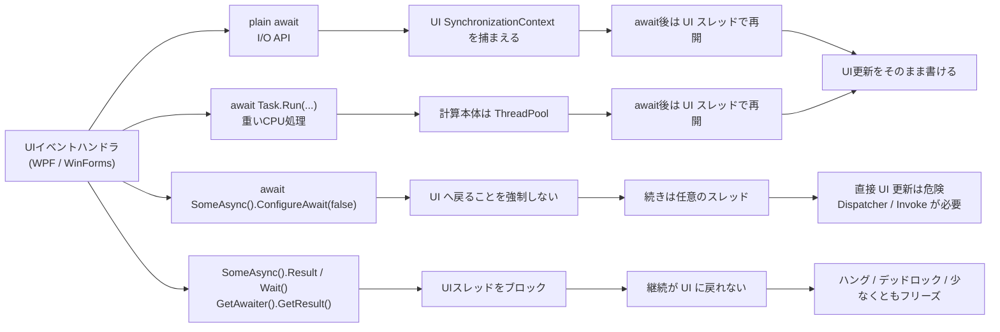
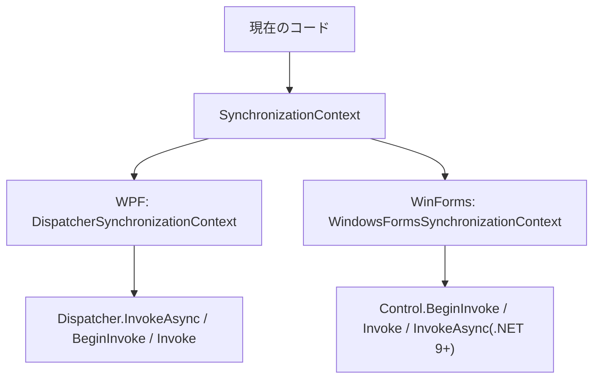
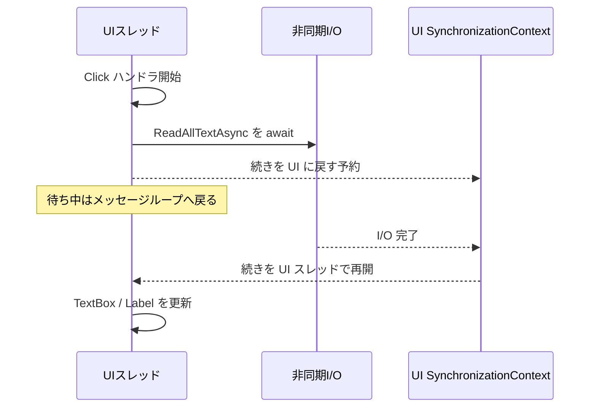
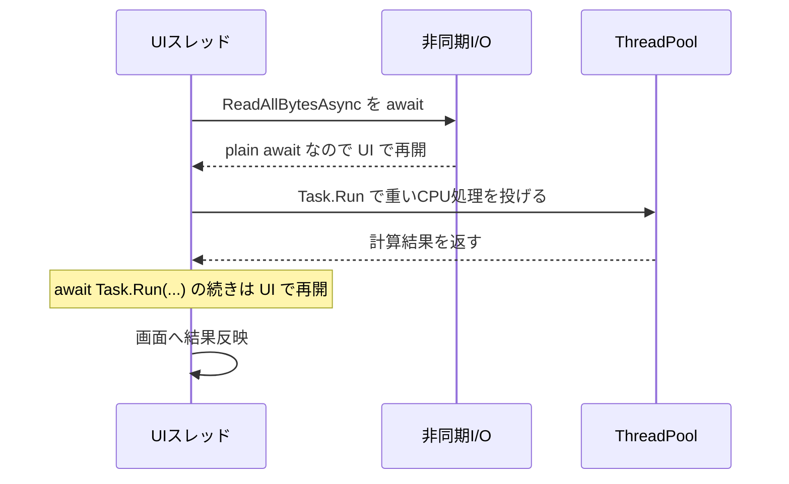
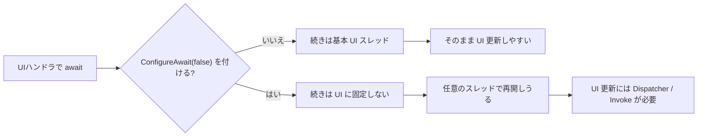
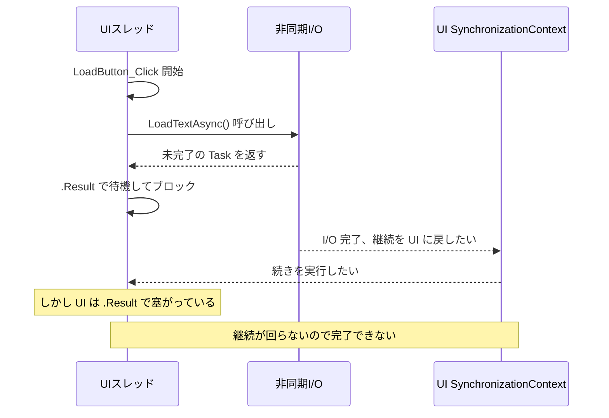
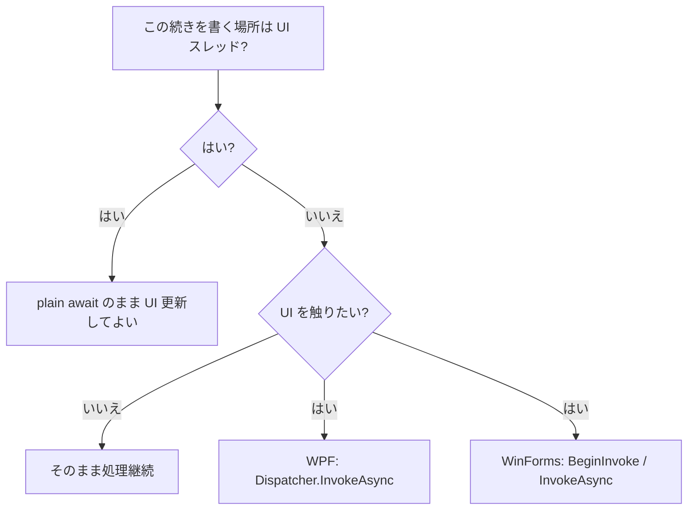

WPF / WinForms で `async` / `await` を使うときに一番迷いやすいのは、**`await` のあとにどのスレッドへ戻るのか**、そして **いつ UI を触ってよいのか** です。
特に `Dispatcher`、`BeginInvoke`、`ConfigureAwait(false)`、`.Result` / `.Wait()` が混ざると、画面フリーズやクロススレッド例外の原因が見えにくくなります。

この記事では、WPF / WinForms の UI スレッドと `async` / `await` の関係に絞って整理します。  
`async` / `await` の全体的な判断軸は、[C# async/await のベストプラクティス - Task.Run と ConfigureAwait の判断表](https://comcomponent.com/blog/2026/03/09/001-csharp-async-await-best-practices/) とつながる形です。

実務で本当に血の匂いがするのは、だいたいこのへんです。

* `await` のあと、どこで続きが動くのか分からない
* `Task.Run` を挟んだあとに UI を触ってよいのか分からない
* `ConfigureAwait(false)` をどこに付けるべきか迷う
* `.Result` / `.Wait()` / `.GetAwaiter().GetResult()` で画面が固まる
* WPF の `Dispatcher` と WinForms の `Invoke` / `BeginInvoke` / `InvokeAsync` が頭の中で混ざる

WPF / WinForms は、どちらも **UI スレッド中心のモデル** です。  
なので、`async` / `await` の整理でいちばん効くのは「非同期とは何か」という哲学っぽい話より、**UI スレッドとメッセージループに対して何をしているのか** をはっきりさせることです。

この記事では、主に **.NET 6 以降の WPF / WinForms アプリ** を前提に、  
`await` 後の戻り先、`Dispatcher`、`ConfigureAwait(false)`、`.Result` / `.Wait()` で詰まる理由を、実務で使いやすい順番で整理します。

なお、WinForms の `Control.InvokeAsync` は **.NET 9 以降** です。  
それより前の WinForms では、基本は `BeginInvoke` / `Invoke` を使います。

## 目次

1. まず結論（ひとことで）
2. まず一枚で整理
   * 2.1. 全体像
   * 2.2. まずの判断表
3. この記事で使う言葉
   * 3.1. UI スレッドとメッセージループ
   * 3.2. `SynchronizationContext` / `Dispatcher` / `Invoke`
4. 典型パターン
   * 4.1. UI イベントハンドラで plain `await`
   * 4.2. 重い CPU 計算だけ `Task.Run`
   * 4.3. `ConfigureAwait(false)` は「戻らない保証」ではなく「戻りを強制しない」
   * 4.4. `.Result` / `.Wait()` / `.GetAwaiter().GetResult()` で詰まる理由
5. `Dispatcher` / `Invoke` をいつ使うか
6. よくあるアンチパターン
7. レビュー時のチェックリスト
8. ざっくり使い分け
9. まとめ
10. 参考資料

* * *

## 1. まず結論（ひとことで）

* WPF / WinForms の **UI イベントハンドラ** で plain `await` した場合、`await` 後の続きは **基本的に UI スレッドへ戻る** と考えてよい
* `Task.Run` は **CPU 計算を UI スレッドから外すためのもの** であって、I/O 待ちを包む道具ではない
* UI ハンドラの中で `await Task.Run(...)` しても、その `await` が plain `await` なら、続きは通常 **UI スレッドへ戻る**
* `ConfigureAwait(false)` は、その `await` で **キャプチャした UI コンテキストへ戻ることを強制しない** という意味。付けたあとの続きで UI を直接触るのは危ない
* `.Result` / `.Wait()` / `.GetAwaiter().GetResult()` は **UI スレッドを塞ぐ**。`await` の継続が UI に戻る必要があると、かなり普通に詰まる
* WPF で明示的に UI に戻すなら `Dispatcher.InvokeAsync`
* WinForms で明示的に UI に戻すなら、旧来は `BeginInvoke`、.NET 9 以降なら `InvokeAsync` が async フローと相性がよい
* まずの方針は、**UI の一番外側は plain `await`、汎用ライブラリは `ConfigureAwait(false)` を検討、UI への戻しは必要な場所でだけ明示**、です

要するに、WPF / WinForms では

1. 今どのスレッドで走っているか
2. `await` の続きがどこに戻るか
3. UI へ戻す責任をどこが持つか

この 3 つを見ると、かなり整理しやすくなります。

## 2. まず一枚で整理

### 2.1. 全体像

まずはこの図で、ざっくり全体像を掴むのが早いです。



実務で見ると、だいたい次の 4 パターンです。

1. UI イベントハンドラで plain `await`
2. UI イベントハンドラで `Task.Run` を使って CPU を逃がす
3. `ConfigureAwait(false)` で戻り先を外す
4. `.Result` / `.Wait()` で UI スレッドを塞ぐ

### 2.2. まずの判断表

| 状況 | 待ち中にどこが動くか | `await` 後の続き | UI を直接触ってよいか | まずの選択 |
|---|---|---|---|---|
| UI ハンドラで `await SomeIoAsync()` | I/O の完了待ち。UI スレッド自体はメッセージループへ戻れる | 基本は UI スレッド | よい | plain `await` |
| UI ハンドラで `await Task.Run(...)` | 重い CPU は ThreadPool | 基本は UI スレッド | よい | CPU だけ `Task.Run` |
| UI ハンドラで `await x.ConfigureAwait(false)` | 戻り先を UI に固定しない | 任意のスレッド | よくない | UI コードでは基本避ける |
| UI スレッドで `x.Result` / `x.Wait()` | UI スレッドが待ちで塞がる | そもそも継続が回りにくい | よくない | 使わない |
| 背景スレッドや `ConfigureAwait(false)` の後で UI 更新したい | UI とは別スレッドで動いている | そのままでは UI ではない | よくない | `Dispatcher.InvokeAsync` / `BeginInvoke` / `InvokeAsync` |

この表で大事なのは、**plain `await` は UI コードではむしろ味方** だという点です。  
敵なのは `await` そのものではなく、**UI スレッドを同期的に塞ぐこと** です。

## 3. この記事で使う言葉

### 3.1. UI スレッドとメッセージループ

WPF / WinForms の UI は、基本的に **UI スレッドが 1 本あって、そこが入力・描画・イベント処理を回す** という形です。

この UI スレッドは、だいたい次の役割を持っています。

* ボタン押下、キー入力、再描画などのメッセージを処理する
* コントロールや UI オブジェクトを安全に触れる唯一のスレッドになる
* そこに処理を詰め込みすぎると、画面更新や入力応答が止まる

ここでのキモは、**UI スレッドは「速く回ること」が仕事** だということです。  
ここを長くブロックすると、マウスもキーボードも再描画も詰まり、ユーザーから見ると「固まった」に見えます。

このイメージは、次の図で持っておくとかなり整理しやすいです。


### 3.2. `SynchronizationContext` / `Dispatcher` / `Invoke`

ここでよく出る言葉を、実務向けにざっくり分けるとこうです。

| 言葉 | ここでの意味 |
|---|---|
| UI スレッド | UI オブジェクトを作ったスレッド。基本はここだけが UI を安全に触れる |
| メッセージループ | UI スレッドがメッセージを順に処理する仕組み |
| `SynchronizationContext` | 「その実行場所へ処理を戻す」ための抽象化 |
| `Dispatcher` | WPF の UI スレッド用キュー |
| `Invoke` / `BeginInvoke` / `InvokeAsync` | UI スレッドへ処理を投げるための API |

細かく言うと、`await` は継続先を決めるときに **現在の `SynchronizationContext`** を優先し、無ければ **非既定の `TaskScheduler`** も見ます。  
ただ、WPF / WinForms の実務では、まず **UI の `SynchronizationContext` が効いている** と考えると十分です。

フレームワークごとの対応は、だいたい次のように見ると分かりやすいです。

| フレームワーク | UI 側のコンテキスト | 明示的に UI へ戻す代表 API |
|---|---|---|
| WPF | `DispatcherSynchronizationContext` | `Dispatcher.InvokeAsync` / `Dispatcher.BeginInvoke` / `Dispatcher.Invoke` |
| WinForms | `WindowsFormsSynchronizationContext` | `Control.BeginInvoke` / `Control.Invoke` / `.NET 9+ Control.InvokeAsync` |

WPF は `Dispatcher` が中心です。  
WinForms はコントロールのハンドルとメッセージループが中心で、`BeginInvoke` / `Invoke` が表に出てきます。

実務では、抽象化と実体の関係をこのくらいで覚えると混ざりにくいです。



## 4. 典型パターン

### 4.1. UI イベントハンドラで plain `await`

いちばん素直な形です。

```csharp
private async void LoadButton_Click(object sender, RoutedEventArgs e)
{
    LoadButton.IsEnabled = false;
    StatusText.Text = "読み込み中...";

    try
    {
        string text = await File.ReadAllTextAsync(FilePathTextBox.Text);
        PreviewTextBox.Text = text;
        StatusText.Text = "完了";
    }
    catch (Exception ex)
    {
        StatusText.Text = ex.Message;
    }
    finally
    {
        LoadButton.IsEnabled = true;
    }
}
```

このコードでは、`LoadButton_Click` は **UI スレッド上で始まります**。  
そして `await File.ReadAllTextAsync(...)` は plain `await` なので、通常はその時点の **UI コンテキストを捕まえます**。

そのため、

* ファイル I/O の待ち中は UI スレッドを占有しない
* 読み込み完了後の続きは、基本的に UI スレッドへ戻る
* `PreviewTextBox.Text = text;` をそのまま書ける

という形になります。

ここで余計な `Dispatcher` は要りません。  
**UI ハンドラの中で plain `await` しただけなら、普通はそのまま UI を触れます。**

WinForms でも見方は同じです。  
`Click` ハンドラの中で plain `await` している限り、続きは基本的に UI 側へ戻ります。

図にすると、こういう流れです。



### 4.2. 重い CPU 計算だけ `Task.Run`

`Task.Run` が効くのは、**重い CPU 計算を UI スレッドから外したいとき** です。

```csharp
private async void HashButton_Click(object sender, RoutedEventArgs e)
{
    HashButton.IsEnabled = false;
    ResultText.Text = "計算中...";

    try
    {
        byte[] data = await File.ReadAllBytesAsync(InputPathTextBox.Text);

        string hash = await Task.Run(() =>
        {
            using SHA256 sha256 = SHA256.Create();
            byte[] digest = sha256.ComputeHash(data);
            return Convert.ToHexString(digest);
        });

        ResultText.Text = hash;
    }
    catch (Exception ex)
    {
        ResultText.Text = ex.Message;
    }
    finally
    {
        HashButton.IsEnabled = true;
    }
}
```

このコードで起きていることは、だいたいこうです。

1. UI スレッドでイベントハンドラが始まる
2. `File.ReadAllBytesAsync` の I/O 待ちは非同期で流す
3. 重いハッシュ計算だけ `Task.Run` で ThreadPool に出す
4. `await Task.Run(...)` の続きは plain `await` なので UI スレッドへ戻る
5. `ResultText.Text = hash;` をそのまま書ける

つまり、**`Task.Run` の中だけが別スレッド** です。  
`await` 後まで永続的に「もう UI ではない場所」へ行くわけではありません。

ここを 1 枚で見ると、誤解しにくいです。



ここでの注意は 2 つです。

* I/O 待ちを `Task.Run` で包まない
* `Task.Run` は「非同期化」ではなく「CPU の逃がし先」を作るものだと考える

`Task.Run(async () => await File.ReadAllTextAsync(...))` のような書き方は、I/O 待ちを無駄に ThreadPool へ投げ直しているだけで、あまり得がありません。

### 4.3. `ConfigureAwait(false)` は「戻らない保証」ではなく「戻りを強制しない」

ここがいちばん誤解されやすいところです。

まず、`ConfigureAwait(false)` が向いているのは、**UI や特定アプリモデルに依存しない汎用ライブラリコード** です。

```csharp
public sealed class DocumentRepository
{
    public async Task<string> LoadNormalizedTextAsync(string path, CancellationToken cancellationToken)
    {
        string text = await File.ReadAllTextAsync(path, cancellationToken).ConfigureAwait(false);
        return text.Replace("\r\n", "\n", StringComparison.Ordinal);
    }
}
```

このメソッドは、UI を触りません。  
WPF でも WinForms でも ASP.NET Core でも worker でも使える形です。  
こういうコードでは `ConfigureAwait(false)` がかなり自然です。

そして、UI 側の呼び出しは plain `await` でよいです。

```csharp
private readonly DocumentRepository _repository = new();

private async void OpenButton_Click(object sender, RoutedEventArgs e)
{
    OpenButton.IsEnabled = false;
    StatusText.Text = "読み込み中...";

    try
    {
        string text = await _repository.LoadNormalizedTextAsync(
            PathTextBox.Text,
            CancellationToken.None);

        PreviewTextBox.Text = text;
        StatusText.Text = "完了";
    }
    catch (Exception ex)
    {
        StatusText.Text = ex.Message;
    }
    finally
    {
        OpenButton.IsEnabled = true;
    }
}
```

ここで大事なのは、**ライブラリ内の `ConfigureAwait(false)` は、呼び出し元の `await` まで強制的に `false` にしない** という点です。

つまり、

* ライブラリ内部では UI に戻らない
* それを UI ハンドラが plain `await` すると、呼び出し元の続きは UI へ戻る

という分離ができます。

逆に、UI ハンドラ自身でこう書くと危ないです。

```csharp
private async void OpenButton_Click(object sender, RoutedEventArgs e)
{
    string text = await _repository.LoadNormalizedTextAsync(
        PathTextBox.Text,
        CancellationToken.None).ConfigureAwait(false);

    PreviewTextBox.Text = text;
}
```

この場合、`OpenButton_Click` の **その `await` の続き** は UI に戻ることを強制しません。  
そのため `PreviewTextBox.Text = text;` は **クロススレッドアクセス** になりえます。

もう 1 つ、地味に大事な点があります。  
`ConfigureAwait(false)` は「必ず ThreadPool に移る」ではありません。

**その await が待たずに即完了した場合**、続きはそのまま今のスレッドで流れることがあります。  
なので、`ConfigureAwait(false)` は

* 「必ず別スレッドへ行く」
* 「ここから先はずっと UI ではない」

という意味ではありません。

意味としては、あくまで

* **その `await` の継続を、元の UI コンテキストへ戻すことを強制しない**

です。  
このほうが、かなり事故りにくい理解です。

整理図にすると、こう見ます。



### 4.4. `.Result` / `.Wait()` / `.GetAwaiter().GetResult()` で詰まる理由

ここが一番よく見る事故です。

```csharp
private void LoadButton_Click(object sender, RoutedEventArgs e)
{
    string text = LoadTextAsync().Result;
    PreviewTextBox.Text = text;
}

private async Task<string> LoadTextAsync()
{
    string text = await File.ReadAllTextAsync(FilePathTextBox.Text);
    return text.ToUpperInvariant();
}
```

一見すると、ただ同期で結果を取っているだけに見えます。  
ですが、UI スレッドではかなり危ないです。

流れを図にするとこうです。



何が起きているかを言葉にすると、こうです。

1. UI スレッドが `LoadTextAsync()` を呼ぶ
2. `LoadTextAsync()` の中の `await` は UI コンテキストを捕まえる
3. UI スレッドは `.Result` で待ってしまう
4. I/O が終わる
5. `LoadTextAsync()` の続きは UI スレッドへ戻りたい
6. でも UI スレッドは `.Result` で塞がっている
7. 続きが走れないので `LoadTextAsync()` が完了しない
8. `.Result` は終わらない

つまり、**UI が「お前が終わるまで待つ」と言い、非同期側が「UI に戻れたら終われる」と言って、互いに待ち合う** わけです。  
実に嫌な感じです。

ここでよくある勘違いは、`GetAwaiter().GetResult()` にすると安全だと思うことです。  
ですが、**UI スレッドを塞ぐ** という本質は同じです。違うのは主に例外の包まれ方です。

なので、UI では次の 3 つを同じ匂いとして扱ったほうが安全です。

* `.Result`
* `.Wait()`
* `.GetAwaiter().GetResult()`

なお、WPF の `Dispatcher.InvokeAsync(...)` が返す `Task` を `Task.Wait()` するのも危険です。  
WPF のドキュメントでも、`DispatcherOperation` が返す `Task` を `Task.Wait` するとデッドロックになるとされています。  
要するに、**UI の文脈で「投げたものを同期で待つ」方向そのもの** が、かなり詰まりやすいです。

「絶対にデッドロックするのか」というと、必ずしもそうではありません。  
たまたま継続が UI に戻らないコードなら、**デッドロックせずに単に UI をフリーズさせるだけ** のこともあります。  
しかし、それも十分につらいので、UI では基本的にやらない方がよいです。

## 5. `Dispatcher` / `Invoke` をいつ使うか

整理すると、**plain `await` の UI ハンドラ** では、普段は明示的な `Dispatcher` / `Invoke` は要りません。

必要になるのは、たとえば次のようなときです。

* `ConfigureAwait(false)` の続きで UI を触りたい
* `Task.Run` の中や、その外側でも UI に戻らない構成にしている
* ソケット受信、タイマー、イベントコールバックなど、最初から UI スレッドでない場所で通知が来る
* UI と非 UI を意図的に分離したレイヤで、最後の UI 更新だけ明示したい

WPF なら、代表は `Dispatcher.InvokeAsync` です。

```csharp
private async Task RefreshPreviewAsync(string path, CancellationToken cancellationToken)
{
    string text = await File.ReadAllTextAsync(path, cancellationToken).ConfigureAwait(false);

    await Dispatcher.InvokeAsync(() =>
    {
        PreviewTextBox.Text = text;
        StatusText.Text = "完了";
    });
}
```

WinForms なら、.NET 9 以降は `InvokeAsync` がかなり相性よいです。

```csharp
private async Task RefreshPreviewAsync(string path, CancellationToken cancellationToken)
{
    string text = await File.ReadAllTextAsync(path, cancellationToken).ConfigureAwait(false);

    await previewTextBox.InvokeAsync(() =>
    {
        previewTextBox.Text = text;
        statusLabel.Text = "完了";
    });
}
```

WinForms の旧来パターンでは `BeginInvoke` を使います。  
`Invoke` は同期送信で、呼び出し側を待たせます。`BeginInvoke` は投稿してすぐ返ります。  
async フローでは、基本的に **ブロックしない側** のほうが噛み合わせがよいです。

ざっくり言うと、次の見分け方で十分です。

| やりたいこと | WPF | WinForms |
|---|---|---|
| UI へ同期的に入れる | `Dispatcher.Invoke` | `Control.Invoke` |
| UI へ非同期に投げる | `Dispatcher.InvokeAsync` / `Dispatcher.BeginInvoke` | `Control.BeginInvoke` / `.NET 9+ Control.InvokeAsync` |
| async / await と素直に合わせたい | `Dispatcher.InvokeAsync` | `.NET 9+ Control.InvokeAsync`、それ以前は `BeginInvoke` |

実務での感覚としては、

* **UI ハンドラで plain `await` しているだけなら不要**
* **UI 以外の場所から UI を触りたくなったら使う**
* **async フローの中で同期 `Invoke` を増やしすぎない**

これでだいぶ事故が減ります。

迷ったときは、次の判断図で十分です。



## 6. よくあるアンチパターン

| アンチパターン | 何がつらいか | まずの置き換え |
|---|---|---|
| UI ハンドラで `LoadAsync().Result` | UI スレッドを塞ぐ。デッドロックしやすい | `await LoadAsync()` |
| UI ハンドラで `LoadAsync().Wait()` | 同上。メッセージループが止まる | `await LoadAsync()` |
| UI ハンドラで `LoadAsync().GetAwaiter().GetResult()` | 例外の見え方が違うだけで、ブロックは同じ | `await LoadAsync()` |
| UI コードへ機械的に `ConfigureAwait(false)` | `await` 後の UI 更新が壊れやすい | UI の一番外側は plain `await` |
| `Task.Run(async () => await IoAsync())` | I/O を無駄に投げ直している | `await IoAsync()` |
| ライブラリコードが `Dispatcher` や `Control` を直接握る | UI 依存が深くなる。再利用しにくい | ライブラリはデータだけ返し、UI 側で marshal する |
| `Dispatcher.Invoke` / `Control.Invoke` を async フローに多用する | ブロックの輪ができやすい | `Dispatcher.InvokeAsync` / `BeginInvoke` / `InvokeAsync` を検討 |
| コンストラクタやプロパティ getter で async を同期化する | 起動時ハングの温床になる | `Loaded` / `Shown` / `InitializeAsync` へ逃がす |

この中で、特に遭遇率が高いのは次の 3 つです。

1. UI スレッドで `.Result` / `.Wait()`
2. UI コードに `ConfigureAwait(false)` を機械的に付ける
3. ライブラリと UI の責務が混ざって `Dispatcher` が奥まで侵入する

この 3 つを外すだけでも、かなり落ち着きます。

## 7. レビュー時のチェックリスト

WPF / WinForms の `async` / `await` をレビューするときは、次を順番に見ると分かりやすいです。

* UI イベントハンドラや UI 初期化経路に `.Result` / `.Wait()` / `.GetAwaiter().GetResult()` が残っていないか
* `Task.Run` は **CPU 計算** にだけ使われているか。I/O を包んでいないか
* `ConfigureAwait(false)` が UI コードに機械的に入っていないか
* 逆に、汎用ライブラリで UI コンテキストへの依存を引きずっていないか
* `await` 後に UI を直接触っている箇所は、そこが本当に UI コンテキスト上だと言えるか
* UI に明示的に戻す必要がある箇所で、`Dispatcher.InvokeAsync` / `BeginInvoke` / `InvokeAsync` が使われているか
* `Dispatcher.Invoke` / `Control.Invoke` のような同期 marshal が、不要に増えていないか
* コンストラクタ、同期プロパティ、同期イベントから async を無理やり同期化していないか
* ライブラリ層が `Window` / `Control` / `Dispatcher` を直接参照していないか

このチェックリストは、チームで「どこが UI の責務か」を揃えるのにも使いやすいです。

## 8. ざっくり使い分け

| やりたいこと | まず選ぶもの |
|---|---|
| UI ハンドラで HTTP / DB / ファイル I/O を待つ | plain `await` |
| UI を止めたくない重い CPU 計算 | `Task.Run` を `await` |
| `ConfigureAwait(false)` の後や背景スレッドから UI を更新する | WPF: `Dispatcher.InvokeAsync` / WinForms: `BeginInvoke` or `.NET 9+ InvokeAsync` |
| 汎用ライブラリを書く | `ConfigureAwait(false)` を検討 |
| UI で async を同期化したい | 基本やらない。呼び出し元ごと async に伸ばす |
| 起動時初期化をしたい | `Loaded` / `Shown` / 明示的な `InitializeAsync` |
| `await` 後にそのまま UI を触りたい | UI の一番外側は plain `await` を保つ |

## 9. まとめ

WPF / WinForms の `async` / `await` で本当に大事なのは、  
「非同期は難しい」という雰囲気ではなく、

* **今どこで始まったか**
* **`await` の続きがどこへ戻るか**
* **UI へ戻す責任を誰が持つか**

を分けて考えることです。

まずのルールとしては、次でかなり戦えます。

1. UI の一番外側では plain `await`
2. 重い CPU だけ `Task.Run`
3. 汎用ライブラリでは `ConfigureAwait(false)` を検討
4. UI へ戻す必要があるときだけ `Dispatcher` / `BeginInvoke` / `InvokeAsync`
5. UI スレッドでは `.Result` / `.Wait()` / `.GetAwaiter().GetResult()` を使わない

`async` / `await` 自体は、そこまで気難しい仕組みではありません。  
ただ、**UI スレッドを中心に見ないまま使うと、急にぬかるみになります。**

逆に言うと、

* UI の外側と内側を分ける
* 戻り先を意識する
* ブロックを持ち込まない

この 3 つを守るだけで、WPF / WinForms の非同期コードはだいぶ静かになります。  
画面が固まるコードは、だいたい「非同期が悪い」のではなく、**UI スレッドへの借金の仕方が雑** なだけです。

## 10. 参考資料

* [関連記事: C# async/await のベストプラクティス - Task.Run と ConfigureAwait の判断表](https://comcomponent.com/blog/2026/03/09/001-csharp-async-await-best-practices/)
* [Threading Model - WPF](https://learn.microsoft.com/en-us/dotnet/desktop/wpf/advanced/threading-model)
* [DispatcherSynchronizationContext Class](https://learn.microsoft.com/ja-jp/dotnet/api/system.windows.threading.dispatchersynchronizationcontext?view=windowsdesktop-10.0)
* [How to handle cross-thread operations with controls - Windows Forms](https://learn.microsoft.com/en-us/dotnet/desktop/winforms/controls/how-to-make-thread-safe-calls)
* [WindowsFormsSynchronizationContext Class](https://learn.microsoft.com/en-us/dotnet/api/system.windows.forms.windowsformssynchronizationcontext?view=windowsdesktop-10.0)
* [Events Overview - Windows Forms](https://learn.microsoft.com/en-us/dotnet/desktop/winforms/forms/events)
* [TaskScheduler.FromCurrentSynchronizationContext Method](https://learn.microsoft.com/ja-jp/dotnet/api/system.threading.tasks.taskscheduler.fromcurrentsynchronizationcontext?view=net-9.0)
* [ConfigureAwait FAQ](https://devblogs.microsoft.com/dotnet/configureawait-faq/)
* [How Async/Await Really Works in C#](https://devblogs.microsoft.com/dotnet/how-async-await-really-works/)
* [Await, and UI, and deadlocks! Oh my!](https://devblogs.microsoft.com/dotnet/await-and-ui-and-deadlocks-oh-my/)
* [Threading model for WebView2 apps](https://learn.microsoft.com/en-us/microsoft-edge/webview2/concepts/threading-model)
