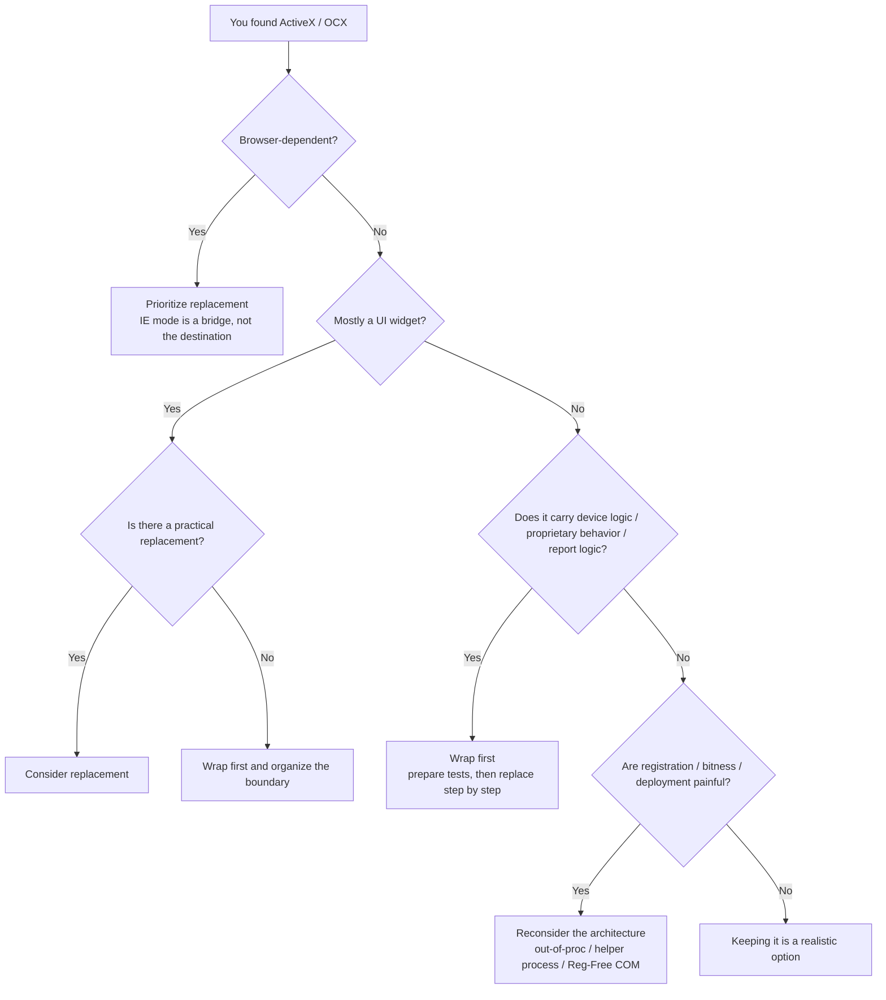
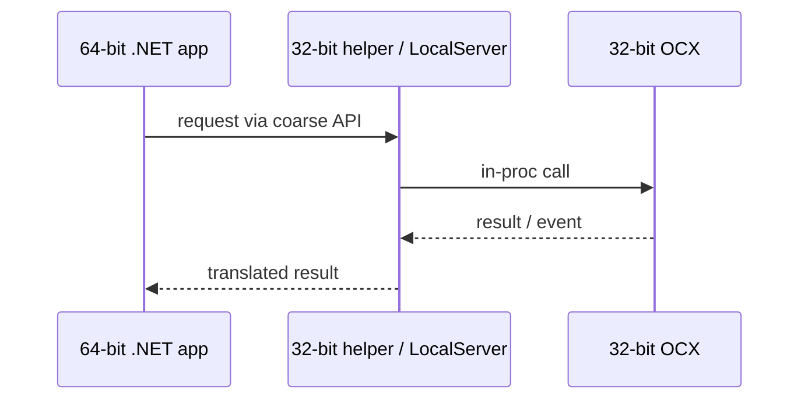

Projects that still mention ActiveX / OCX usually come with a certain heaviness in the air.

- old VB6 or C++ / MFC applications are still in active use
- industrial equipment or measurement SDKs still expose only an OCX
- an internal web app still assumes ActiveX and cannot leave IE mode
- a single OCX is blocking a 32-bit to 64-bit move

But neither of these reactions is very good:

- "it is old, so throw everything away"
- "it still runs, so preserve it forever"

What matters first is whether that ActiveX / OCX is merely a UI widget or a boundary that carries real business or equipment behavior.

This article organizes how to decide between **keep**, **wrap**, and **replace** when you encounter ActiveX / OCX.

Typical targets include:

- legacy desktop applications built with VB6 / MFC / WinForms
- stepwise migration toward C# / .NET
- legacy screens involving `WebBrowser` or IE mode
- Windows apps that depend on vendor-supplied ActiveX controls

## Contents

1. [Short version](#1-short-version)
2. [What ActiveX / OCX means in this article](#2-what-activex--ocx-means-in-this-article)
3. [The first decision table](#3-the-first-decision-table)
   - [3.1. Overall picture](#31-overall-picture)
   - [3.2. When to keep it](#32-when-to-keep-it)
   - [3.3. When to wrap it](#33-when-to-wrap-it)
   - [3.4. When to replace it](#34-when-to-replace-it)
   - [3.5. Browser dependence is its own special case](#35-browser-dependence-is-its-own-special-case)
4. [Questions that distort the decision](#4-questions-that-distort-the-decision)
   - [4.1. Is it just a UI component, or does it contain real behavior?](#41-is-it-just-a-ui-component-or-does-it-contain-real-behavior)
   - [4.2. 32-bit / 64-bit and process boundaries](#42-32-bit--64-bit-and-process-boundaries)
   - [4.3. Registration, deployment, permissions, and licensing](#43-registration-deployment-permissions-and-licensing)
   - [4.4. STA, message loops, and callbacks](#44-sta-message-loops-and-callbacks)
   - [4.5. Whether behavior is observable and testable](#45-whether-behavior-is-observable-and-testable)
5. [Recommendations by typical case](#5-recommendations-by-typical-case)
   - [5.1. Stable internal desktop application](#51-stable-internal-desktop-application)
   - [5.2. Wanting to bring a 32-bit OCX into the 64-bit side](#52-wanting-to-bring-a-32-bit-ocx-into-the-64-bit-side)
   - [5.3. Screens built around IE / WebBrowser assumptions](#53-screens-built-around-ie--webbrowser-assumptions)
   - [5.4. ActiveX that hides device control or proprietary behavior](#54-activex-that-hides-device-control-or-proprietary-behavior)
6. [Common anti-patterns](#6-common-anti-patterns)
7. [Checklist for starting a migration](#7-checklist-for-starting-a-migration)
8. [Rough rule-of-thumb guide](#8-rough-rule-of-thumb-guide)
9. [This kind of consultation is a good fit](#9-this-kind-of-consultation-is-a-good-fit)
10. [Summary](#10-summary)

* * *

## 1. Short version

- The first thing to judge is not whether the component is "old," but **what responsibility it is carrying**
- If it is just a UI component, replacement is comparatively easy
- If it carries device control, reporting logic, proprietary formats, or accumulated business behavior, it is usually safer to **wrap it first**
- If it is stable inside a desktop app and the change surface is small, **keeping it** can be a completely rational decision
- Browser-side ActiveX dependence should usually be treated as a **replace-first** problem
- You cannot load a 32-bit OCX into a 64-bit process in-proc
- Registration, deployment, permissions, licensing, and threading assumptions are often harder than the code itself
- "Rewrite the whole thing" and "freeze it forever because it is scary" are both high-risk choices

The practical order is usually:

1. what does this OCX actually own?
2. does it really need to run in the same process?
3. will bitness, registration, or browser dependence stop the plan?
4. do we need to make the behavior testable before replacing it?

## 2. What ActiveX / OCX means in this article

This article uses the terms in a practical, project-facing sense:

| Term | Meaning here |
|---|---|
| COM | Windows' binary component model: interfaces, registration, apartment model, and related runtime rules |
| ActiveX / OCX | in real projects, usually COM-based controls and the surrounding assets, especially `.ocx` UI controls and components embedded into containers such as IE-era hosts |
| Browser-side IE / ActiveX dependence | not necessarily an OCX file itself, but any design that still assumes the IE-style world and its component model |

Strictly speaking, ActiveX and COM are not the same thing.
But the practical pain points are very similar:

- bitness
- registration and deployment
- host / container assumptions
- STA and callback assumptions
- browser dependence

So this article groups them together from a practical decision-making viewpoint.

## 3. The first decision table

### 3.1. Overall picture

This first table already gives the right direction in many cases.

| Situation | First recommendation | Why |
|---|---|---|
| browser-side ActiveX dependence | replace first | because Edge itself does not support ActiveX, and IE mode is a compatibility layer rather than a future-facing design base |
| stable desktop app with an OCX that already behaves well and changes little | keep first | because breaking it now often costs more than preserving it |
| you want to modernize the surrounding app but do not yet fully understand the control's behavior | wrap first | because it is safer to organize the boundary before re-implementing behavior |
| you want to move a 32-bit OCX into a 64-bit process | wrap / change architecture | because an in-proc boundary cannot cross bitness |
| the OCX is mostly a UI widget and there is a strong replacement available | replace first | because the replacement cost is more limited |
| vendor support has ended and registration / deployment is painful every time | replacement becomes more attractive | because operational cost has already become technical debt |
| the component carries device control or proprietary behavior | wrap first | because you need a stable, testable boundary before replacement |

### 3.2. When to keep it

Not every ActiveX / OCX should immediately become a replacement project.
Keeping it can be the cheapest correct answer when conditions look like this:

- the usage is confined and the environment is controlled
- the control is stable today and the requested changes are small
- the vendor still exists, or you can at least maintain the minimum internally
- it is not browser-side dependence but a desktop-hosted component
- you do not need to change the bitness premise yet

But keeping it does **not** mean leaving it untouched forever.
If you keep it, at least:

- document the supported OS, bitness, required DLLs, and registration steps
- stop relying on people's memory for setup; move deployment toward scripts or installers
- prepare a smoke test on a clean environment
- gather the control calls behind a narrower part of the application instead of scattering them everywhere

The worst pattern is "it works, so no one touches it" for ten years until nobody can explain its real assumptions anymore.

### 3.3. When to wrap it

In real work, this is often the most valuable option.

"Wrapping" means enclosing ActiveX / OCX inside a narrow boundary and exposing a cleaner API or screen-side abstraction to the rest of the modernized system.

This is powerful because if you jump into a full rewrite while the old component's behavior is still fuzzy, the project quickly becomes a combined effort of:

- discovering the old behavior
- recreating it
- debugging the boundary

Wrapping first is safer.

Practical wrapping patterns include:

| Wrapping style | Good fit | What to watch |
|---|---|---|
| WinForms host + AxHost / Aximp | you want to keep using the control inside a desktop UI with limited surface area | STA, events, design-time dependence, licensing |
| 32-bit helper EXE / COM LocalServer / separate process bridge | you want to move the main app to 64-bit or isolate crashes | IPC, startup order, supervision, deployment |
| COM-compatible front door on the .NET side | you want to keep old COM callers while replacing internal behavior | IID / CLSID / TLB / registration / bitness |

The most important discipline here is **not to copy 200 old methods one by one into a new layer**.
That merely imports the old design constraints into new code.

When wrapping, it helps a lot to:

- prefer coarse-grained methods
- stop UI code from talking to the OCX directly
- collect logs at the boundary
- define timeout / retry / exception-translation responsibility at the boundary
- expose an interface that could later be reimplemented without the OCX behind it

### 3.4. When to replace it

Replacement is easier when the problem is mostly **surface-level oldness**.

Good examples:

- the component is mostly a UI widget
- the vendor already has a modern .NET / WPF / WebView2-side replacement
- the main pain is browser dependence
- registration, signatures, admin privileges, or security settings are constantly getting in the way
- you have enough tests or observable business scenarios to confirm replacement behavior

The risky version is seeing something old-looking and assuming the whole thing can be replaced "just as a UI refresh," even though it secretly carries device behavior, report logic, or a proprietary data contract.

If you replace, starting from the UI side is often much safer:

- grids
- calendars
- tree controls
- browser-display areas
- simple input helpers

Those are very different from:

- vendor-supplied equipment-control ActiveX controls
- report or printing controls with embedded format logic
- controls that read and write proprietary files
- controls with COM callback and threading assumptions built in

Misjudging that difference destroys estimates very quickly.

### 3.5. Browser dependence is its own special case

This needs to be treated separately.

Browser-side ActiveX has a much weaker long-term future than desktop OCX hosted in a controlled process.

The reason is straightforward:

- Microsoft Edge itself does not support ActiveX
- IE mode can keep some IE-era features alive for configured sites, including some ActiveX behavior
- but that is a compatibility strategy, not a strong long-term product direction

The same practical issue appears with the old `WebBrowser` control embedded into Windows apps.
If the real need is "show web content," then new development should normally look at WebView2 first.

But WebView2 is **not** a drop-in replacement for every IE-era assumption.
The migration may also require redesigning:

- IE DOM assumptions
- ActiveX dependence
- `window.external`
- security zone and intranet assumptions

So browser-side ActiveX is usually not a simple "swap rendering engine" problem.
It is often a **browser boundary redesign** problem.

## 4. Questions that distort the decision

### 4.1. Is it just a UI component, or does it contain real behavior?

This is the most important question.

An old grid or calendar is often mostly about appearance and event compatibility.
But some controls that look like "just a UI widget" are actually carrying deep behavior, such as:

- device commands
- retry and timeout handling
- event ordering assumptions
- report generation
- proprietary format I/O

Reimplementing that immediately often turns into a specification-discovery project.
Wrapping first is much safer there.

### 4.2. 32-bit / 64-bit and process boundaries

This is often missed, but it is a core technical constraint.

An in-proc OCX must match the host process bitness.
So you cannot just load a 32-bit OCX into a 64-bit process.

Practical options then become:

- keep the host app 32-bit for now
- isolate the OCX in a 32-bit helper / LocalServer and connect from the 64-bit side through IPC or out-of-proc COM
- remove that dependency gradually where possible

"Any CPU will make it work somehow" is almost never a real answer here.

### 4.3. Registration, deployment, permissions, and licensing

Sometimes the code is technically callable, but the real project still fails in deployment.

Typical trouble points:

- human-dependent `regsvr32` steps
- implicit dependent DLL placement
- hidden administrator-right requirements
- different runtime / design-time vendor licensing assumptions
- "works on the dev machine, fails on a clean environment"

This is why ActiveX / OCX migration is often not only an implementation problem, but also a **deployment design** problem.

### 4.4. STA, message loops, and callbacks

ActiveX / OCX is not just "a DLL call."
It may carry COM threading-model and message-loop assumptions.

Watch out for cases like:

- it is only stable when created on the UI thread
- it assumes STA, but someone is calling it casually from MTA
- a synchronous call triggers callbacks back into your app
- the thread that receives events is left vague

These issues often appear first as "it sometimes hangs" or "sometimes the event never arrives."
But the real cause is often a violated threading assumption.

### 4.5. Whether behavior is observable and testable

Replacement is hard not only because the code is old.
It is hard because you often do not yet know what "behaves the same" really means.

Even a few of these help a lot:

- smoke tests for important operation scenarios
- sample inputs and outputs
- sample reports or captured screen states
- expected behavior on failure paths
- logs for timeouts and disconnected-equipment scenarios

Especially with equipment and reporting, the real system behavior is often more trustworthy than any written specification.
Without observability, replacement turns into excavation.

## 5. Recommendations by typical case

### 5.1. Stable internal desktop application

Recommendation: **lean toward keep**.

If:

- the app is internal only
- the environment is controlled
- the OCX is used in only a small number of screens
- the change demand is limited

then it is often more reasonable not to tear it out immediately.

Still, even if you keep it, it helps to gather its usage behind a boundary.

The practical stance becomes:

- keep it for now
- but organize the boundary
- so replacement remains possible later

### 5.2. Wanting to bring a 32-bit OCX into the 64-bit side

Recommendation: **wrap / change architecture**.

This is where going straight on usually fails, because a 32-bit in-proc OCX cannot live inside a 64-bit process.

The practical shape is often:

- put the OCX behind a 32-bit helper process or LocalServer
- talk to it through a coarser API
- avoid forwarding every tiny method call across the process boundary

### 5.3. Screens built around IE / WebBrowser assumptions

Recommendation: **replace first**.

This is an area where "works now" and "is healthy for the future" diverge badly.
IE mode can keep a system alive, but it is still IE-era compatibility.

So the practical stance is:

- keep the business running now
- do not confuse that with a permanent architecture
- evaluate replacements such as WebView2, a real web rewrite, or a native UI + web hybrid design

### 5.4. ActiveX that hides device control or proprietary behavior

Recommendation: **wrap first**.

This kind of component is often much deeper than it looks.
Even if the official documentation is thin, years of operation may have embedded assumptions about:

- timeout behavior
- reconnect timing
- event ordering
- device-specific workarounds
- interpretation of errors and exceptions

Trying to rewrite that all at once often burns the acceptance test phase.

So the safer sequence is:

1. isolate the existing component behind a boundary
2. add logging and observability
3. collect test scenarios and real-device patterns
4. only then replace parts step by step

## 6. Common anti-patterns

| Anti-pattern | Why it hurts | First repair |
|---|---|---|
| deciding on a full rewrite only because ActiveX exists | specification gaps and estimate explosions become likely | inventory first, then cut a boundary |
| trying to load a 32-bit OCX directly into a 64-bit app | impossible in principle | isolate it on the 32-bit side or change the architecture |
| calling the control API directly from all over the app | later replacement becomes almost impossible | gather it behind an adapter / facade |
| relying on manual `regsvr32` deployment | environment differences cause repeated failures | move toward installers, scripts, or manifest-based deployment |
| relaxing because IE mode exists | confuses life support with future architecture | define a replacement plan and an exit condition |
| replacing without first recording current behavior | there is no real definition of "done" | gather smoke tests, sample data, and logs |

## 7. Checklist for starting a migration

For ActiveX / OCX work, it usually goes better if you inventory first instead of jumping straight into implementation.

The practical order is often:

1. inventory the OCX / DLL set  
   - filename, version, ProgID, CLSID, vendor, licensing
2. inventory where it is used  
   - screens, functions, reports, devices, batches, Office automation, and so on
3. confirm host and bitness conditions  
   - 32-bit / 64-bit, in-proc / out-of-proc, STA assumptions, browser dependence
4. confirm deployment conditions  
   - registration method, dependent DLLs, admin rights, clean-machine reproducibility
5. build smoke tests  
   - not only normal paths, but also failure, timeout, and disconnected-device paths
6. create a boundary  
   - adapter, service, facade, helper process bridge, and so on
7. test one small screen / one function / one device path first
8. spread keep / wrap / replace decisions outward from the boundaries that work

Skipping these steps makes it much harder even to explain later **what was actually difficult**.

## 8. Rough rule-of-thumb guide

| Situation | First recommendation |
|---|---|
| stable, controlled internal desktop usage with little change | keep |
| surrounding app modernization while preserving behavior | wrap |
| collision with 32-bit / 64-bit process boundaries | wrap / change architecture |
| IE / WebBrowser / browser-side ActiveX dependence | replace |
| a simple UI widget with a practical replacement | replace |
| equipment control, reports, or proprietary behavior inside the component | wrap |
| repeated pain around registration and deployment | wrap or replace |

When in doubt, first decide whether the component is merely UI or a behavior-heavy boundary.

## 9. This kind of consultation is a good fit

This topic often produces value even before implementation starts, simply by organizing direction.

For example:

- deciding which OCX should really be replaced first
- sorting out the 32-bit / 64-bit traps in advance
- keeping only the COM entry point while modernizing internals
- comparing survival strategies versus migration for a vendor-abandoned control
- deciding where IE / WebBrowser dependence can be peeled away first
- safely separating just one screen or one function first

In these projects, **how you cut the boundary** is often the real win condition.

## 10. Summary

Handling ActiveX / OCX is not about loving legacy or hating legacy.
It is about understanding:

1. whether the component is a UI widget or a behavior-heavy boundary
2. whether it must really stay in the same process
3. whether bitness, registration, browser dependence, or licensing will block you
4. whether the current behavior is observable enough to replace safely

Once you see those four things, the keep / wrap / replace choice becomes much clearer:

- keep it if it is stable and the remaining life is manageable
- wrap it if you want to modernize around it safely
- replace it when the problem is mostly UI-level or browser dependence
- wrap first when it contains a dense block of behavior and contracts

Legacy components are not just "old code."  
They are often artifacts full of history and implicit contracts.
