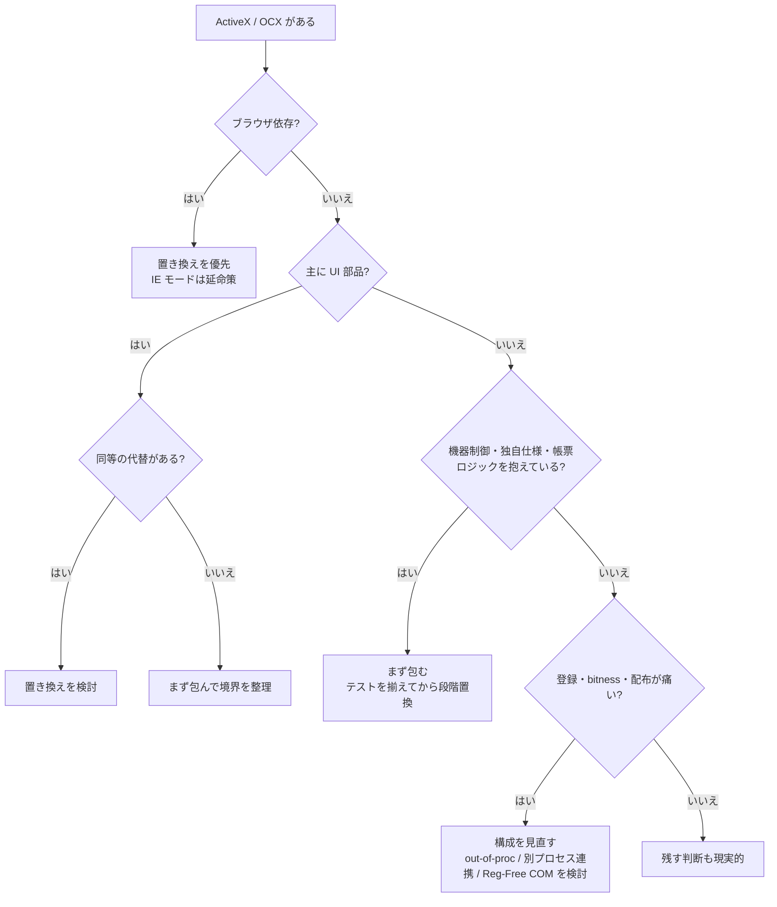
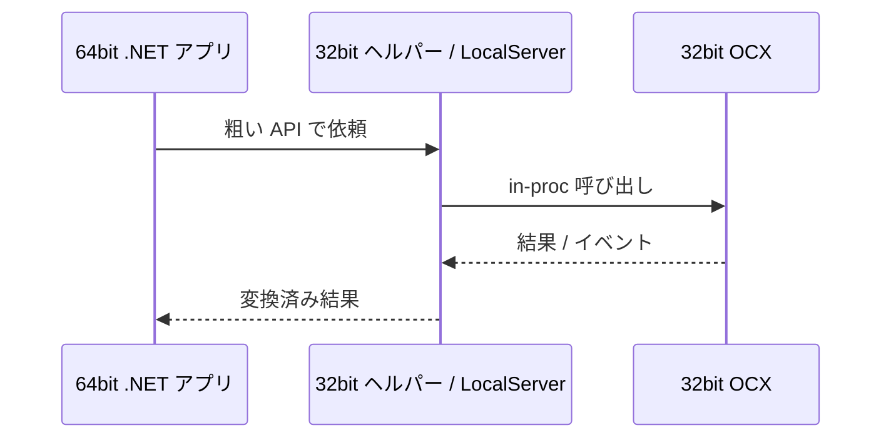

ActiveX / OCX という言葉が出てくる案件は、だいたい空気が少し重いです。

- VB6 や古い C++ / MFC アプリがまだ現役
- 産業機器や計測器の SDK が OCX しか出していない
- 社内 Web が ActiveX 前提で、IE モードから抜けられない
- 32bit から 64bit へ寄せたいのに、1 個の OCX が首を横に振っている

ただ、ここで「古いから全部捨てる」も、「動いているから永久保存」も、どちらも雑です。
大事なのは、その ActiveX / OCX が単なる UI 部品なのか、それとも業務仕様や機器仕様を抱えた境界面なのか を見分けることです。

この記事では、ActiveX / OCX を見つけたときに、
残す・包む・置き換える のどれを選ぶべきかを、判断しやすい順番で整理します。

対象は、たとえば次のようなケースです。

- VB6 / MFC / WinForms 系の既存デスクトップアプリ
- C# / .NET への段階移行
- WebBrowser / IE モードを含むレガシー画面
- ベンダー製 ActiveX コントロールを含む Windows アプリ

## 目次

1. まず結論（ひとことで）
2. この記事でいう ActiveX / OCX
3. まず見る判断表
   - 3.1. 全体像
   - 3.2. 残す判断
   - 3.3. 包む判断
   - 3.4. 置き換える判断
   - 3.5. ブラウザ依存は別枠で考える
4. 判断を狂わせやすい論点
   - 4.1. UI 部品なのか、仕様を抱えた部品なのか
   - 4.2. 32bit / 64bit とプロセス境界
   - 4.3. 登録、配布、権限、ライセンス
   - 4.4. STA / メッセージループ / コールバック
   - 4.5. テストがあるか、観測できるか
5. 典型パターン別のおすすめ
   - 5.1. いまも安定して動く社内デスクトップアプリ
   - 5.2. 32bit OCX を 64bit 側へ持っていきたい
   - 5.3. IE / WebBrowser 前提の画面
   - 5.4. 機器制御や独自仕様を抱えた ActiveX
6. よくあるアンチパターン
7. 移行を始めるときのチェックリスト
8. ざっくり使い分け
9. こういう相談は相性がよい
10. まとめ
11. 参考資料

* * *

## 1. まず結論（ひとことで）

- ActiveX / OCX を見たら、最初に判断すべきは「古いかどうか」ではなく、その部品が何を引き受けているか です
- 単なる UI 部品なら、置き換えは比較的しやすいです
- 機器制御、帳票、独自ファイル形式、長年の運用癖を抱えているなら、いきなり再実装するより まず包む ほうが安全です
- デスクトップで安定稼働しており、変更範囲が小さいなら、残す判断も十分ありです
- ブラウザ上の ActiveX 依存は、延命はできても未来は細いので、置き換え優先で見たほうがよいです
- 32bit OCX を 64bit プロセスへそのまま読み込むことはできません。ここは気合いでは越えられません
- 登録、依存 DLL、管理者権限、ライセンス、STA / MTA など、実装以外の摩擦 が難所になりやすいです
- 「とりあえず全面リライト」と「怖いから永久凍結」は、どちらも事故率が高いです

要するに、判断の順番はだいたい次です。

1. その OCX は何を持っているのか
2. 同一プロセスで使う必要があるのか
3. 32bit / 64bit、登録、ブラウザ依存で詰まらないか
4. テスト可能な境界を作ってから置き換えるべきか

この順で見ると、かなり整理しやすくなります。

## 2. この記事でいう ActiveX / OCX

ここは少しだけ言葉を整理します。

| 言葉 | この記事での意味 |
|---|---|
| COM | Windows のバイナリ互換コンポーネントモデル。公開インターフェース、登録、Apartment Model などの土台です |
| ActiveX / OCX | 実務では、COM ベースのコントロールやその周辺資産をまとめて指して使われがちです。特に `.ocx` の UI コントロールや IE / コンテナに埋め込む部品を含むことが多いです |
| WebBrowser / IE 系依存 | ActiveX そのものではなくても、「IE の世界観」を前提にした埋め込みブラウザや連携を含みます。判断上はかなり近い問題になります |

厳密には ActiveX と COM は同じものではありません。
ただ、実務で困る地点はかなり似ています。

- 32bit / 64bit が噛み合うか
- 登録や依存 DLL をどう配るか
- どのホスト / コンテナで動くのか
- STA、メッセージループ、コールバックで詰まらないか
- ブラウザ依存が残っていないか

この記事では、こうした実務上の判断ポイントをまとめて扱います。

## 3. まず見る判断表

### 3.1. 全体像

まずはこの表から見ると、だいたいの方針が決まります。

| 状況 | まずの選択 | 理由 |
|---|---|---|
| ブラウザ上の ActiveX に依存している | 置き換える寄り | Edge 本体は ActiveX 非対応で、IE モードは延命策としての位置づけだから |
| デスクトップアプリで OCX が安定稼働し、変更範囲が小さい | 残す寄り | いま崩すコストのほうが大きいことが多いから |
| 周辺だけ .NET 化したいが、コントロールの挙動が読めない | 包む寄り | 先に境界を整理したほうが安全だから |
| 32bit OCX を 64bit プロセスへそのまま入れたい | 包む / 構成変更 | in-proc では越えられない境界だから |
| UI 部品としてしか使っておらず、代替がある | 置き換える寄り | 表面の置換で済みやすいから |
| ベンダー終了、署名、登録、依存 DLL で毎回事故る | 置き換える寄り | 運用コストが技術的負債として表面化しているから |
| 機器制御、帳票、独自プロトコルを内包している | 包む寄り | まず振る舞いを固定化しないと置換コストが読めないから |

以下、各パターンを順番に見ていきます。

### 3.2. 残す判断

ActiveX / OCX だからといって、すぐ置換対象になるわけではありません。
次の条件が揃うなら、残すのがいちばん安いことは普通にあります。

- 利用範囲が閉じていて、社内配布や装置同梱など運用環境が固定されている
- そのコントロールがいまも安定稼働しており、変更要求が大きくない
- ベンダーがまだ現役、または自社で最低限の保守ができる
- ブラウザ依存ではなく、デスクトップの既存ホスト上で完結している
- 32bit / 64bit の前提を当面変えなくてよい

ここで大事なのは、残す = 放置 ではないことです。
残すなら、少なくとも次はやっておいたほうがよいです。

- 対応 OS、bitness、必要な依存 DLL、登録手順を文章で残す
- インストール、登録、解除を人力メモではなくスクリプトやインストーラーへ寄せる
- クリーン環境でのスモークテストを用意する
- コントロールへの呼び出しをアプリ全体へばらまかず、できるだけ 1 か所に寄せる

いちばんまずいのは、「動いているので触らない」を 10 年続けて、誰も前提を説明できなくなることです。
残す選択をするほど、前提の見える化 は重要になります。

### 3.3. 包む判断

実務では、この選択がいちばん仕事になります。

ここでいう「包む」は、ActiveX / OCX を狭い境界の内側に閉じ込めて、
周辺からは新しい API や新しい画面部品として見せることです。

これはかなり有効です。
なぜなら、古い部品の挙動が読み切れない段階で全面再実装に入ると、仕様発掘と不具合再現の二重苦になりやすいからです。
まずは古い部品を隔離し、境界だけ整える ほうが安全です。

包み方としては、たとえば次のようなものがあります。

| 包み方 | 向く場面 | 見るポイント |
|---|---|---|
| WinForms ホスト + AxHost / Aximp | 既存デスクトップ画面に埋めたい、少数画面だけ残したい | STA、イベント、デザイン時依存、ライセンス |
| 32bit helper EXE / COM LocalServer / 別プロセス橋渡し | 64bit 側へ寄せたい、クラッシュを隔離したい | プロセス間通信、起動順、監視、デプロイ |
| .NET 側の COM 互換窓口 | 既存 COM 呼び出し元は残しつつ中身を更新したい | IID / CLSID / TLB / 登録方法 / bitness |

特に大事なのは、包むときに 古い API をそのまま 200 個コピーしない ことです。
それをやると、古い都合を新しいコードへそのまま輸入するだけになります。

包むときは、次を意識するとかなりましになります。

- 粗い粒度のメソッドにする
- 画面コードから直接 OCX を触らせない
- 失敗時に必要なログを境界で取る
- タイムアウト、再試行、例外変換の責務を境界で決める
- 将来の置き換え先も同じインターフェースで差し替えられるようにする

新しい .NET 側で COM の入口だけ残したい場合もあります。
この場合は、「中身は更新しつつ、COM 契約だけ維持する」という構成が現実的です。
ただし、.NET Framework 時代の感覚で「とりあえず RegAsm」で済むとは限りません。
今の .NET の COM host、TLB、bitness、Registry-Free COM の扱いは、先に設計しておいたほうが後で楽です。

### 3.4. 置き換える判断

置き換えに向いているのは、主に 表面の古さ が問題になっているケースです。

たとえば、次のようなときは置き換え優先で見たほうがよいです。

- その ActiveX が UI 部品としてしか使われていない
- ベンダーが .NET / WPF / WebView2 向けの後継を出している
- ブラウザ依存や IE 前提が足を引っ張っている
- 登録、署名、管理者権限、セキュリティ設定で毎回つまずく
- 代替実装を検証できるテストや業務シナリオがある

逆に、見た目が古いからという理由だけで機器制御や帳票ロジックまで抱えた部品を一気に捨てにいくと、だいたい泥になります。

置き換えるなら、まずは UI から です。

- グリッド
- カレンダー
- ツリー
- ブラウザ表示部
- 単純な入力補助

このあたりは、比較的置き換えやすいです。
一方で、次のようなものは UI に見えても中身が濃いです。

- ベンダー製の機器制御 ActiveX
- 印刷や帳票生成と一体化したコントロール
- 独自ファイル形式の読み書きを内包しているコントロール
- COM コールバックやスレッド前提を抱えたコントロール

この差を見誤ると、工数見積もりが一気に壊れます。

### 3.5. ブラウザ依存は別枠で考える

ここはかなり別枠です。

ブラウザ上の ActiveX は、デスクトップの OCX と違って、
今後もそのまま伸ばしていく理由がかなり弱いです。

理由は単純で、現代のブラウザ基盤がそこを主戦場にしていないからです。
Microsoft Edge 自体は ActiveX をサポートしていません。
一方で、IE モードは設定されたサイトに対して IE 系のエンジンを使い、ActiveX を含む一部の IE 機能を動かすための互換レイヤーとして使えます。

つまり、

- いま動かすための延命 はできる
- でも、長期の設計としては未来が太いわけではない

ということです。

同じことは、Windows アプリに埋め込んだ `WebBrowser` コントロールにも起きます。
`WebBrowser` は IE 系の世界観を引きずるので、単に HTML を表示したいだけなら、今からの新規作業は WebView2 を第一候補にしたほうが自然です。

ただし、ここで気を付けたいのは、WebView2 は `WebBrowser` の完全な差し替え部品ではない ことです。

- IE DOM 前提のスクリプト
- ActiveX 依存
- `window.external` まわりの前提
- セキュリティゾーンやイントラネット前提の挙動

このあたりは、そのままでは移りません。
置き換えるなら、描画エンジンだけでなく、ブラウザとネイティブの接続面 も設計し直す必要があります。

## 4. 判断を狂わせやすい論点

### 4.1. UI 部品なのか、仕様を抱えた部品なのか

これは最重要です。

古いグリッドやカレンダーなら、見た目とイベントの互換を見ればかなり話が進みます。
一方で、機器制御や帳票や独自形式を抱えた ActiveX は、見た目の裏に仕様の塊があります。

たとえば、同じ「画面上のコントロール」に見えても、実際には次のような差があります。

- ただの一覧表示部品
- 独自プロトコルで装置へ命令を飛ばしている部品
- 内部でタイムアウト、再接続、再送、例外吸収までやっている部品
- 印刷やエクスポート形式の互換を背負っている部品

後者をいきなり再実装するのは、だいたい仕様発掘プロジェクトになります。
ここは先に包むほうが安全です。

### 4.2. 32bit / 64bit とプロセス境界

ここはよく見落とされますが、かなり本質です。

in-proc の OCX は、読み込むプロセスと bitness を揃える必要があります。
つまり、32bit OCX を 64bit アプリへそのまま読み込むことはできません。

このときの現実的な選択肢は、だいたい次のどれかです。

- 当面、ホストアプリ側も 32bit のまま維持する
- 32bit の別プロセスへ閉じ込めて、64bit 側とは IPC や out-of-proc COM でつなぐ
- その OCX 依存を外せるところから先に置き換える

ここで「Any CPU だから何とかなるだろう」は、だいたい効きません。
新しい .NET 側で COM 互換窓口を作る場合も、managed コードの見た目と実際の COM host の bitness は別問題です。
ここを雑に始めると、ビルドは通るのに配布先で動かない、という嫌なやつが出てきます。

### 4.3. 登録、配布、権限、ライセンス

技術的には呼べるのに、配布で死ぬ。
これは ActiveX / OCX ではかなりよくあります。

難所になりやすいのは、たとえば次です。

- `regsvr32` の前提が人依存になっている
- 依存 DLL の配置が暗黙になっている
- 管理者権限が必要なのに、運用手順へ落ちていない
- ベンダー製コントロールの design-time / runtime ライセンスが分かれている
- 開発機では動くのに、クリーン環境では動かない

このあたりは、コードを 1 行も触らなくてもプロジェクトを止めます。

登録不要の構成や side-by-side 配置で楽になるケースもありますが、魔法の粉ではありません。
コンテナ側や配布方式との相性確認は必要です。

要するに、ActiveX / OCX の移行は 実装だけでなく配布設計 でもあります。
ここを後回しにすると、最後に派手に転びます。

### 4.4. STA / メッセージループ / コールバック

ActiveX / OCX は、ただの DLL 呼び出しではありません。
COM のスレッドモデルやメッセージループの前提を持っていることがあります。

特に注意したいのは、次のようなケースです。

- UI スレッド前提でしか安定しない
- STA 前提なのに MTA 側から雑に呼んでいる
- 同期呼び出し中にコールバックが返ってくる
- イベントを受けるスレッド前提が曖昧

この辺りは、最初は「たまに固まる」「たまにイベントが来ない」という怪談の顔をして現れます。
でも中身はだいたい前提違反です。

なので、包むときも置き換えるときも、
どのスレッドで生成し、どのスレッドで呼び、どこでイベントを受けるか は先に固定したほうがよいです。

### 4.5. テストがあるか、観測できるか

置き換えが難しいのは、コードが古いからだけではありません。
何をもって「同じように動いた」と言えるか がないからです。

たとえば、次があるだけでもかなり違います。

- 操作シナリオごとのスモークテスト
- 入出力サンプル
- 画面キャプチャや帳票サンプル
- エラーパターンと期待挙動
- タイムアウト時や装置未接続時のログ

特に機器や帳票が絡むと、仕様書より現物の挙動のほうが真実、という妙なことが起きます。
ここで観測手段がないと、置き換えは発掘調査に変わります。

## 5. 典型パターン別のおすすめ

### 5.1. いまも安定して動く社内デスクトップアプリ

おすすめは、残す寄り です。

次のような条件なら、無理に剥がさないほうがよいことが多いです。

- 社内限定で使っている
- 対象端末や OS がある程度固定されている
- その OCX は数画面でしか使っていない
- 改修要求は小さく、寿命も読めている

ただし、そのまま裸で置いておくのではなく、
呼び出し箇所だけは寄せておいたほうが後で効きます。

つまり、方針としてはこうです。

- いまは残す
- でも、境界だけ整える
- 置き換えが必要になったときに、そこから着手できる形にする

この 3 段構えが素直です。

### 5.2. 32bit OCX を 64bit 側へ持っていきたい

おすすめは、包む / 構成変更 です。

ここは真正面から行くと詰みます。
32bit OCX を 64bit プロセスへ in-proc で入れることはできないからです。

現実的には、32bit のヘルパープロセスや LocalServer 側に閉じ込めて、
64bit アプリとは粗い API で通信する構成が扱いやすいです。

ここでのポイントは、細かいメソッドを全部そのまま中継しない ことです。
プロセス間境界は、細かい呼び出しを大量に流すとすぐつらくなります。

- 1 操作 = 1 要求 くらいの粒度に寄せる
- 戻り値やエラーを意味のある単位に整形する
- ログを境界で取る

この形にしておくと、後で中身を本当に置き換えるときも楽です。

### 5.3. IE / WebBrowser 前提の画面

おすすめは、置き換え優先 です。

ここは「今動く」と「今後も楽に保てる」が一致しにくい領域です。
IE モードは互換のためにかなり助かりますが、それでも前提は IE 系のままです。

なので、考え方としては次が分かりやすいです。

- 社内業務を止めないために IE モードで延命する
- ただし、延命と恒久設計を混同しない
- 置き換え先は WebView2、純 Web、ネイティブ UI + Web のハイブリッドなどから選ぶ

特に `WebBrowser` コントロールを単に HTML ビューアとして使っているだけなら、
置き換え優先度は高いです。

一方で、ブラウザ内の ActiveX がローカルファイル、装置、署名、独自アドオンのような役割まで持っているなら、
それは描画エンジンの交換ではなく ネイティブ連携の再設計 です。
ここは少し話が重くなります。

### 5.4. 機器制御や独自仕様を抱えた ActiveX

おすすめは、まず包む です。

このタイプは、見た目より中身が濃いです。
SDK の資料が薄くても、現場で長年動いてきた結果として、
次のような挙動が暗黙に積まれていることがあります。

- 接続失敗時の待ち方
- タイムアウト後の再試行
- イベント順序
- 実機の癖を吸収する回避処理
- 例外やエラーコードの解釈

この手の部品を「どうせ古いから」で作り直すと、かなりの確率で現場試験が燃えます。

なので、まずは次をやるのが安全です。

1. 既存部品を境界の内側へ閉じ込める
2. ログを足して、何が起きているか見えるようにする
3. テストシナリオと実機パターンを集める
4. その後で、置き換え可能な範囲を切り出す

派手さはありませんが、実務ではこれがいちばん効きます。

## 6. よくあるアンチパターン

| アンチパターン | 何がつらいか | まずの直し方 |
|---|---|---|
| ActiveX があるので全面リライト | 仕様漏れと工数爆発が起きやすい | まず棚卸しと境界切り出し |
| 32bit OCX を 64bit アプリへそのまま入れようとする | 原理的に無理 | 32bit 側へ隔離するか、構成を変える |
| コントロール API を画面中から直呼びしている | 置き換え不能になりやすい | adapter / facade に寄せる |
| `regsvr32` 手順を人力運用している | 環境差異で毎回事故る | インストーラー、スクリプト、マニフェスト化を検討 |
| IE モードがあるので安心する | 延命と恒久対応を混同しやすい | 置き換え計画と終了条件を決める |
| 置き換え前に振る舞いを記録していない | 完成判定ができない | スモークテスト、サンプルデータ、ログを揃える |

この中で、特に実務でよく見るのは次の 3 つです。

1. 全面リライトを急ぐ
2. bitness の壁を軽く見る
3. API をアプリ全体へばらまく

この 3 つを避けるだけでも、かなり事故率は下がります。

## 7. 移行を始めるときのチェックリスト

ActiveX / OCX の案件は、いきなり実装へ入るより、先に棚卸ししたほうがうまくいきます。
順番としては、だいたい次です。

1. 使っている OCX / DLL を洗い出す
   - ファイル名、バージョン、ProgID、CLSID、ベンダー、ライセンスの有無
2. どこで使っているかを洗い出す
   - 画面、機能、帳票、装置、バッチ、Office 連携など
3. bitness とホスト条件を確認する
   - 32bit / 64bit、in-proc / out-of-proc、STA 前提、ブラウザ依存
4. 配布条件を確認する
   - 登録方法、依存 DLL、管理者権限、サイレントインストール、クリーン環境再現
5. スモークテストを作る
   - 正常系だけでなく、失敗時、未接続時、タイムアウト時も含める
6. 境界を作る
   - adapter、service、facade、別プロセス橋渡しなど
7. 1 画面、1 機能、1 装置など、小さい単位で試す
8. うまくいった境界から、順に残す / 包む / 置き換える を広げる

この手順を飛ばすと、後で「何が難しかったのか」すら説明しにくくなります。

## 8. ざっくり使い分け

| 状況 | まず選ぶもの |
|---|---|
| 社内限定で安定稼働、変更も小さい | 残す |
| 周辺だけ .NET 化したい | 包む |
| 32bit / 64bit がぶつかる | 包む / 構成変更 |
| IE / WebBrowser / ブラウザ ActiveX 依存 | 置き換える |
| 単なる UI 部品で代替がある | 置き換える |
| 機器制御、帳票、独自仕様を抱えている | 包む |
| 登録や配布で毎回こける | 包むか置き換える |

迷ったら、まずは UI 部品か、仕様を抱えた境界面か を見分けると、かなり外しにくくなります。

## 9. こういう相談は相性がよい

このテーマは、いきなり開発に入る前の 方針整理 だけでも価値が出やすいです。

たとえば、次のような相談はかなり相性がよいです。

- どの OCX を本当に置き換えるべきか、棚卸ししたい
- 32bit / 64bit の詰まりどころだけ先に整理したい
- .NET へ寄せたいが、COM の入口だけは残したい
- ベンダー終了した ActiveX の延命策と撤退戦を比較したい
- IE / WebBrowser 依存をどこから剥がせるか見たい
- まずは 1 画面、1 機能だけ安全に分離したい

ActiveX / OCX の案件は、実装より先に 境界をどう切るか が勝負になることが多いです。
全面改修の前段として、現状整理、構成比較、移行順序の設計から入るだけでも、かなり意味があります。

## 10. まとめ

ActiveX / OCX をどう扱うかは、レガシーだから嫌う、で決める話ではありません。

まず見るべきなのは、次の 4 つです。

1. その部品は単なる UI か、それとも仕様を抱えた境界面か
2. 同一プロセスで使う必要があるか
3. 32bit / 64bit、登録、ブラウザ依存、ライセンスで詰まらないか
4. 置き換え前に、振る舞いを観測できるか

この 4 つが見えれば、だいたい次のように整理できます。

- 安定稼働していて寿命も読めるなら、残す
- 周辺だけ近代化したいなら、包む
- UI 部品やブラウザ依存なら、置き換える
- 仕様の塊を抱えた部品は、まず包んでから段階置換する

レガシー技術は、笑う対象ではなく、歴史と契約が詰まった現物 です。
ただし、現物に付き合うための境界設計は必要です。

「残す・包む・置き換える」を混ぜて考えられるようになると、
ActiveX / OCX の案件は、急に扱える問題に変わってきます。

## 11. 参考資料

- Microsoft Learn: AxHost Class (System.Windows.Forms)
  - https://learn.microsoft.com/ja-jp/dotnet/api/system.windows.forms.axhost
- Microsoft Learn: Aximp.exe (Windows フォーム ActiveX コントロール インポーター)
  - https://learn.microsoft.com/ja-jp/dotnet/framework/tools/aximp-exe-windows-forms-activex-control-importer
- Microsoft Learn: How to: Add ActiveX Controls to Windows Forms
  - https://learn.microsoft.com/en-us/dotnet/desktop/winforms/controls/how-to-add-activex-controls-to-windows-forms
- Microsoft Learn: Expose .NET Core components to COM
  - https://learn.microsoft.com/en-us/dotnet/core/native-interop/expose-components-to-com
- Microsoft Learn: Registration-Free COM Interop
  - https://learn.microsoft.com/en-us/dotnet/framework/interop/registration-free-com-interop
- Microsoft Learn: Microsoft Edge に関してよく寄せられる質問
  - https://learn.microsoft.com/ja-jp/deployedge/microsoft-edge-frequently-asked-questions
- Microsoft Learn: What is Internet Explorer (IE) mode?
  - https://learn.microsoft.com/en-us/deployedge/edge-ie-mode
- Microsoft Learn: WebBrowser Class (System.Windows.Forms)
  - https://learn.microsoft.com/en-us/dotnet/api/system.windows.forms.webbrowser
- Microsoft Learn: Introduction to Microsoft Edge WebView2
  - https://learn.microsoft.com/en-us/microsoft-edge/webview2/
- KomuraSoft Blog: COMのSTA/MTAでハングを避けるための基礎知識
  - https://comcomponent.com/blog/2026/01/31/000-sta-mta-com-relationship/
- KomuraSoft Blog: C++のネイティブDLLをC#から使うとき、C++/CLIでラッパーを作ったほうがよい理由
  - https://comcomponent.com/blog/2026/03/07/000-cpp-cli-wrapper-for-native-dlls/
- KomuraSoft Blog: COMが役立つケーススタディ-32bitアプリから64bit DLLを呼び出したいとき
  - https://comcomponent.com/blog/2026/01/25/002-com-case-study-32bit-to-64bit/
