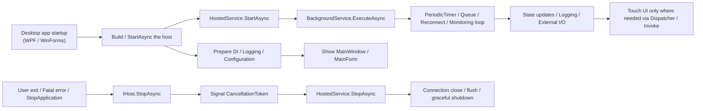

As a Windows tool or resident desktop app grows a little, the work outside the UI starts to increase gradually.
Periodic polling, file watching, reconnect loops, queue processing, startup initialization, shutdown-time flushing.
At first, you can often get by with `Form_Load`, `OnStartup`, or a quick `Task.Run`, but if the app keeps growing that way, it becomes unclear who starts what, who stops what, and who is responsible for observing exceptions.

There are situations where it helps to decide **who owns the lifetime of a piece of work** even before discussing the details of `async` / `await`.
That is where .NET's Generic Host and `BackgroundService` become useful.

The UI-thread side of `async` / `await` connects naturally to:

- [WPF / WinForms async/await and the UI Thread in One Sheet - Continuation destinations, Dispatcher, ConfigureAwait, and why .Result / .Wait() get stuck](/blog/2026/03/12/000-wpf-winforms-ui-thread-async-await-one-sheet/)
- [C# async/await Best Practices - A decision table for Task.Run and ConfigureAwait](/blog/2026/03/09/001-csharp-async-await-best-practices/)

This article focuses one level outside that, on organizing **startup and shutdown for the application as a whole**.

The parts that tend to decay slowly in real projects are usually things like these:

* `Task.Run` starts appearing all over forms and view models
* resident loops are controlled by scattered `bool` flags
* some work is still running during shutdown, and the app occasionally does not close cleanly
* logging, configuration, and DI each end up with their own separate entry points
* `Environment.Exit` starts to look tempting, and `finally` blocks get skipped

This article assumes mostly .NET 6 and later WPF / WinForms / resident Windows applications, and organizes:

- why Generic Host / `BackgroundService` helps in a quiet but important way
- how far it is worth bringing them in
- where the design gets muddy if you use them carelessly

## Terms First

This topic gets harder to read quickly if the terms remain vague, so it helps to fix the basic vocabulary first.

* **Generic Host**
  * the foundation that takes care of application startup, dependencies, configuration, logging, and shutdown
  * it is not just for ASP.NET Core; it also works in console apps, workers, and desktop apps
* **Host / `IHost`**
  * the built runtime instance
  * you start it with `StartAsync` and stop it with `StopAsync`
* **Hosted Service**
  * a resident process that starts and stops along with the host lifetime
  * you can implement `IHostedService` directly, but usually you inherit from `BackgroundService`
* **`BackgroundService`**
  * a helper implementation that makes `IHostedService` easier to write
  * because the long-running body goes into `ExecuteAsync`, it is good for organizing monitoring loops and periodic processing
* **lifetime**
  * in this article, this means when the work starts, when it ends, and who is responsible for stopping it
  * it is more than just "how long it lives"; it includes both start responsibility and stop responsibility
* **graceful shutdown**
  * stopping through a proper signal instead of forcing the process down immediately, and letting in-flight work settle as much as practical
  * for example: not starting the next cycle, deciding how much of a queue to drain, or waiting for close / flush
* **DI**
  * shorthand for Dependency Injection
  * instead of hardcoding object construction at each call site, dependencies are assembled at the entry point and injected through the container

In other words, this is not only an introduction to a convenient class called `BackgroundService`.
It is really about **gathering application startup and shutdown into the host and treating the lifetime of resident processing as part of the architecture**.

## Contents

1. [Short version](#1-short-version)
2. [First, see the whole picture in one page](#2-first-see-the-whole-picture-in-one-page)
   * 2.1. [Overall picture](#21-overall-picture)
   * 2.2. [A placement decision table](#22-a-placement-decision-table)
3. [Why this works well in desktop apps](#3-why-this-works-well-in-desktop-apps)
   * 3.1. [It becomes easier to separate UI responsibilities from resident processing](#31-it-becomes-easier-to-separate-ui-responsibilities-from-resident-processing)
   * 3.2. [Startup, shutdown, and exception entry points can be gathered into one place](#32-startup-shutdown-and-exception-entry-points-can-be-gathered-into-one-place)
   * 3.3. [It becomes easier to make graceful shutdown part of the design](#33-it-becomes-easier-to-make-graceful-shutdown-part-of-the-design)
   * 3.4. [DI, logging, and configuration come pre-aligned](#34-di-logging-and-configuration-come-pre-aligned)
4. [Cases where it fits well](#4-cases-where-it-fits-well)
5. [A minimal configuration example (WPF)](#5-a-minimal-configuration-example-wpf)
6. [How to divide StartAsync / ExecuteAsync / StopAsync](#6-how-to-divide-startasync--executeasync--stopasync)
   * 6.1. [`StartAsync`](#61-startasync)
   * 6.2. [`ExecuteAsync`](#62-executeasync)
   * 6.3. [`StopAsync`](#63-stopasync)
   * 6.4. [A note for .NET 10 and later](#64-a-note-for-net-10-and-later)
7. [Common anti-patterns](#7-common-anti-patterns)
8. [Checklist for review](#8-checklist-for-review)
9. [A rough rule-of-thumb guide](#9-a-rough-rule-of-thumb-guide)
10. [Summary](#10-summary)
11. [References](#11-references)

* * *

## 1. Short version

* Generic Host is a very strong foundation for **startup and lifetime management**, even in desktop applications.
* `BackgroundService` is a container that places **long-lived work onto a managed lifetime** instead of throwing it into `Task.Run` and forgetting about it.
* What helps most in practice is being able to gather **start responsibility, stop responsibility, exception observation, logging, DI, and configuration** into one design center.
* If `StartAsync` stays short, the long-running body lives in `ExecuteAsync`, and shutdown cleanup is placed in `StopAsync`, the code becomes much easier to read.
* Tray apps, device-monitoring apps, periodic synchronization, ordered background post-processing, and reconnect loops are especially good fits.
* On the other hand, if you move one-shot button-triggered work into `BackgroundService`, the design can become unnecessarily heavy.
* `StopAsync` is useful, but it is **not insurance against process crashes or forced termination**. It is also important not to overload it with every form of cleanup.

So the reason Generic Host / `BackgroundService` helps in desktop apps is not merely "because background work exists."
It helps because **you want to treat the lifetime of that background work as architecture instead of as a side effect of the UI**.

## 2. First, see the whole picture in one page

### 2.1. Overall picture

This diagram usually makes the idea much easier to grasp:



In a UI application, responsibilities often get scattered across `Program.cs`, `App.xaml.cs`, `Form_Load`, `Closing`, random `Task.Run` calls, timers, and static singletons.

Once you introduce the host, you can usually separate the picture into:

* **UI**: screens, input, and display
* **HostedService / BackgroundService**: resident work, monitoring, queue processing, periodic processing
* **DI services**: actual business logic, external connections, configuration, and logging

That separation alone makes design review much easier.

### 2.2. A placement decision table

| What you want to do | First candidate placement | Why |
|---|---|---|
| lightweight initialization immediately after startup | `StartAsync` | it clearly participates in startup |
| long-lived monitoring / polling / reconnect behavior | `ExecuteAsync` | it naturally runs for the service lifetime |
| stop notifications / flush / close during shutdown | `StopAsync` | it pairs naturally with `CancellationToken` and graceful shutdown |
| dependency setup, configuration, and logging | `Host.CreateApplicationBuilder` | it gathers the entry point in one place |
| UI updates | the UI side | it is safer not to let workers touch UI directly |
| one-shot button-triggered work | a normal `async` method | it usually does not need to become a hosted service |
| ordered background post-processing | `Channel<T>` + `BackgroundService` | it manages lifetime and queue limits better than fire-and-forget |

The value of introducing the host is not primarily that "it makes things asynchronous."
Its real value is that **it clarifies where different responsibilities belong**.

## 3. Why this works well in desktop apps

### 3.1. It becomes easier to separate UI responsibilities from resident processing

Desktop apps look UI-centric, but in practice the heavier responsibilities are often outside the UI.

For example:

* synchronizing state every 10 seconds
* reconnecting to equipment or servers
* watching files and importing them
* draining queued post-processing work
* shipping logs or metrics
* warming caches at startup

These are not really "screen events." They are **processes attached to the lifetime of the application itself**.

If you keep them in form code-behind or window code, then:

- stopping them when the UI closes
- owning their exceptions
- deciding retry behavior and backoff

all start to mix with screen-level concerns.

When you move them into `BackgroundService`, the code itself expresses:

> "this work stays alive as long as the application stays alive"

That is a subtle but powerful improvement.

### 3.2. Startup, shutdown, and exception entry points can be gathered into one place

You can assemble similar pieces manually even without the host by using `ServiceCollection`, `ConfigurationBuilder`, and `LoggerFactory` directly.

But in that style, responsibilities tend to drift apart:

* DI in `Program.cs`
* configuration in a custom static class
* logging in a separate factory
* shutdown logic in `ApplicationExit`
* resident work in `Task.Run`

That can still work at the beginning.
The problem appears a few months later, when it becomes hard to tell **who really owns the application's lifetime**.

With Generic Host, the following live in the same framework:

* service registration
* configuration loading
* logging configuration
* startup of hosted services
* stop notifications
* global stop requests through `IHostApplicationLifetime`

That means the entry point for "how this application starts and stops" becomes much easier to understand.

### 3.3. It becomes easier to make graceful shutdown part of the design

Long-lived work is often harder to stop cleanly than to start.
That is genuinely true.
Startup may be three lines long; shutdown is where the mud usually appears.

At shutdown, you often want to:

* cancel in-flight I/O
* avoid starting the next periodic cycle
* decide how much of a queue to drain
* close sockets or COM objects
* wait for log flush or state persistence

If you push all of that into `FormClosing`, the UI concerns and the lifetime concerns get mixed together.

With Host / `BackgroundService`, you start with:

* a `CancellationToken`
* a `StopAsync` path

So there is an explicit, designed route for stopping.

Of course this is not magic.
If the process crashes or is killed, `StopAsync` may never run.
Even so, simply having a defined normal shutdown path already removes a lot of ambiguity.

### 3.4. DI, logging, and configuration come pre-aligned

The value of Generic Host is not only `BackgroundService`.

* `Host.CreateApplicationBuilder` gives you DI, configuration, and logging at the same time
* `appsettings.json` and environment variables become easy to use consistently
* `ILogger<T>` can be used by the UI and by workers through the same conventions
* `IOptions<T>` patterns become available if you want to organize configuration cleanly

This matters because in many Windows tool projects:

> a logger or configuration setting starts life as a quick static shortcut and later becomes painful

If you put those concerns on the host from the beginning, the application tends to age more gracefully.

## 4. Cases where it fits well

Generic Host / `BackgroundService` is especially effective in cases such as:

* **tray-resident applications**  
  periodic synchronization, monitoring, notification, reconnect logic
* **device / camera / socket connection apps**  
  connection maintenance, monitoring, retry, state retrieval
* **file integration tools**  
  watching, import queues, ordered processing
* **preventing small internal tools from bloating chaotically**  
  apps that are small now but likely to gain configuration, logging, and external I/O
* **apps where shutdown quality matters**  
  you do not want to leave the app half-finished when it closes

On the other hand, you may not need to introduce the host immediately in cases like:

* a very small one-shot tool that runs once and exits
* a screen that is almost entirely driven by UI events and has almost no background processing
* a truly tiny internal helper tool where dependencies and configuration are not likely to grow

So Generic Host is not "mandatory."
But once you can already see **two or more resident processes**, it is often well worth considering.
That is usually cheaper than cleaning up a colony of scattered `Task.Run` calls later.

## 5. A minimal configuration example (WPF)

As an example, here is a minimal WPF setup that starts a host and runs a `BackgroundService` that reads external state every five seconds.
The same way of thinking also works in WinForms; only the entry point changes to `Main` or `ApplicationContext`.

### 5.1. `App.xaml.cs`

```csharp
using System.Windows;
using Microsoft.Extensions.DependencyInjection;
using Microsoft.Extensions.Hosting;

namespace DesktopHostSample;

public partial class App : Application
{
    private IHost? _host;

    protected override async void OnStartup(StartupEventArgs e)
    {
        base.OnStartup(e);

        HostApplicationBuilder builder = Host.CreateApplicationBuilder(e.Args);

        builder.Services.Configure<HostOptions>(options =>
        {
            options.ShutdownTimeout = TimeSpan.FromSeconds(15);
        });

        builder.Services.AddSingleton<MainWindow>();
        builder.Services.AddSingleton<StatusStore>();
        builder.Services.AddScoped<IDeviceStatusReader, DeviceStatusReader>();
        builder.Services.AddHostedService<DevicePollingBackgroundService>();

        _host = builder.Build();

        await _host.StartAsync();

        MainWindow mainWindow = _host.Services.GetRequiredService<MainWindow>();
        mainWindow.Show();
    }

    protected override async void OnExit(ExitEventArgs e)
    {
        if (_host is not null)
        {
            await _host.StopAsync();
            _host.Dispose();
        }

        base.OnExit(e);
    }
}
```

The key points here are:

1. **start the host before showing the UI**
2. **explicitly await `StopAsync` during shutdown**
3. **gather DI, hosted services, and shutdown timeout at the entry point**

Making `OnExit` asynchronous requires a little care because of UI-framework behavior, but writing the shutdown route explicitly is still very valuable.

### 5.2. `BackgroundService`

```csharp
using Microsoft.Extensions.DependencyInjection;
using Microsoft.Extensions.Hosting;
using Microsoft.Extensions.Logging;

namespace DesktopHostSample;

public sealed class DevicePollingBackgroundService(
    IServiceScopeFactory scopeFactory,
    StatusStore statusStore,
    ILogger<DevicePollingBackgroundService> logger) : BackgroundService
{
    public override async Task StartAsync(CancellationToken cancellationToken)
    {
        logger.LogInformation("Device polling service is starting.");
        await base.StartAsync(cancellationToken);
    }

    protected override async Task ExecuteAsync(CancellationToken stoppingToken)
    {
        logger.LogInformation("Device polling loop started.");

        using var timer = new PeriodicTimer(TimeSpan.FromSeconds(5));

        while (await timer.WaitForNextTickAsync(stoppingToken))
        {
            try
            {
                using IServiceScope scope = scopeFactory.CreateScope();
                IDeviceStatusReader reader =
                    scope.ServiceProvider.GetRequiredService<IDeviceStatusReader>();

                DeviceStatus status = await reader.ReadAsync(stoppingToken);
                statusStore.Update(status);
            }
            catch (OperationCanceledException) when (stoppingToken.IsCancellationRequested)
            {
                break;
            }
            catch (Exception ex)
            {
                logger.LogError(ex, "Device polling failed.");
            }
        }

        logger.LogInformation("Device polling loop finished.");
    }

    public override async Task StopAsync(CancellationToken cancellationToken)
    {
        logger.LogInformation("Device polling service is stopping.");
        await base.StopAsync(cancellationToken);
        logger.LogInformation("Device polling service stopped.");
    }
}
```

What matters here is that `ExecuteAsync` is written plainly as a **managed while loop**.

* the period comes from `PeriodicTimer`
* stopping comes from `stoppingToken`
* exceptions are logged
* if you need scoped dependencies, you create a scope each time

That keeps it easy to see:

> where this resident process starts, where it stops, and where failure becomes visible

### 5.3. Do not tie state sharing directly to the UI

If the worker touches UI objects directly, the UI-thread problem simply returns there.

So the safer split is:

* the worker updates a **state store or messaging layer**
* the UI reads or reflects that state in **its own context**

For example, `StatusStore` can be a thin shared layer like this:

```csharp
namespace DesktopHostSample;

public sealed class StatusStore
{
    private readonly object _gate = new();
    private DeviceStatus _current = DeviceStatus.Empty;

    public DeviceStatus Current
    {
        get
        {
            lock (_gate)
            {
                return _current;
            }
        }
    }

    public void Update(DeviceStatus next)
    {
        lock (_gate)
        {
            _current = next;
        }
    }
}

public sealed record DeviceStatus(string Message)
{
    public static readonly DeviceStatus Empty = new("No Data");
}
```

If the UI needs immediate notification, then use `Dispatcher`, `BeginInvoke`, events, or a messenger-style layer.
But it is still safer when **the UI boundary owns that responsibility**.

## 6. How to divide StartAsync / ExecuteAsync / StopAsync

These three become confusing very quickly if their responsibilities blur together.
This split is usually stable:

### 6.1. `StartAsync`

`StartAsync` is for **short work that participates in startup**.

Good fits:

* startup logging
* beginning a lightweight subscription
* preparing a quick initial state
* minimal ordering around `base.StartAsync`

Poor fits:

* warm-up that takes tens of seconds
* infinite loops
* heavy I/O as the main body of the service

If `StartAsync` becomes heavy, the whole application feels slow to start.
It helps to think of it as "the start signal," not "the whole service."

### 6.2. `ExecuteAsync`

`ExecuteAsync` is the **main service body**.

Good fits:

* polling
* monitoring loops
* reconnect loops
* `Channel<T>` consumers
* periodic processing
* any work that should live until cancellation

Three practical rules matter a lot here:

1. pass the `CancellationToken` all the way through  
2. do not let the whole loop die silently on an exception  
3. do not pile up retries and backoff rules until the loop turns into mud

`BackgroundService` is convenient, but if you let it absorb everything, it can become "the huge loop that does everything."
It is usually clearer if the actual work lives in separate services, while `ExecuteAsync` focuses on **lifetime management and orchestration**.

### 6.3. `StopAsync`

`StopAsync` is where you organize **normal-shutdown cleanup**.

Good fits:

* shutdown logging
* disposing timers, subscriptions, and monitoring hooks
* explicitly closing or flushing resources
* waiting through `base.StopAsync`

But it is also important not to expect too much from it.

It may never run if:

* the process crashes
* the process is forcibly terminated
* the OS kills it

So:

* do as much persistence as possible incrementally during normal operation
* do not make shutdown the only moment when consistency becomes correct
* make cleanup idempotent

Trying to "save the world at shutdown time" is where designs often get messy.

### 6.4. A note for .NET 10 and later

One of the relevant changes after 2025 is that in .NET 10, the whole body of `BackgroundService.ExecuteAsync` is executed as a background task.

Earlier versions had the somewhat confusing behavior that the synchronous part before the first `await` could still block startup of other services.
That change reduces the number of accidents where "the first few lines of `ExecuteAsync` made startup unexpectedly heavy."

Even so, from a design standpoint it is still clearer to separate:

* short startup-participating work → `StartAsync`
* long-lived main body → `ExecuteAsync`

If you need even tighter lifecycle control at startup, `IHostedLifecycleService` also becomes relevant.

## 7. Common anti-patterns

### 7.1. Starting an infinite loop in `Window_Loaded` / `Form_Shown`

This feels easy at first.
But then stop ownership and exception ownership cling directly to the UI layer.

As soon as conditions like these appear:

- "stop when the window closes"
- "do not stop when minimizing to tray"
- "restart on a settings change"

the design gets painful quickly.

### 7.2. Fire-and-forget `Task.Run`

`Task.Run` itself is not bad.  
What is bad is **having no owner for the lifetime and no owner for the exception path**.

When resident work is started with something like:

`Task.Run(async () => { while (...) { ... } })`

then it quickly becomes unclear:

- when it ends
- who waits for it
- who observes exceptions
- how long shutdown should wait

Putting that same responsibility on `BackgroundService` makes it much easier to reason about.

### 7.3. Touching the UI directly from `BackgroundService`

This is a trap.
The UI-thread problem and the lifetime problem get mixed together all at once.

The worker should communicate through:

* state
* events
* messages
* queues

rather than directly manipulating UI objects.

### 7.4. Putting critical persistence only in `StopAsync`

`StopAsync` helps with normal shutdown, but it is not the final guardian of correctness.

If the system only persists:

- at shutdown
- or only flushes at shutdown
- or only becomes consistent at shutdown

then a crash breaks that assumption immediately.

### 7.5. Using `Environment.Exit` even though you are already using the host

This is another common mistake.

Once you do "let's just force the process to exit," you cut off the graceful shutdown path that the host was giving you.

If a fatal error should stop the whole app, use `IHostApplicationLifetime.StopApplication()` first so the system can still follow **the normal shutdown route**.

## 8. Checklist for review

When reviewing a desktop app that uses Generic Host / `BackgroundService`, these checks are usually helpful:

* Is the work really attached to the **application lifetime**, or is it just ordinary UI-event work?
* Are startup, main execution, and shutdown responsibilities divided appropriately across `StartAsync`, `ExecuteAsync`, and `StopAsync`?
* Has `StartAsync` become too heavy?
* Does `ExecuteAsync` pass `CancellationToken` all the way down?
* Is a hosted service holding a scoped dependency directly instead of creating scopes properly?
* Is the worker touching UI objects directly?
* Are exceptions being swallowed silently?
* Are retry loops running too aggressively without limits?
* Is there an upper bound on shutdown wait time?
* Are there any places that bypass the normal path with `Environment.Exit` or a kill-first design?

This checklist makes the difference between:

- "we added the host"
- and "we actually organized lifetime as architecture"

much easier to see.

## 9. A rough rule-of-thumb guide

| What you want to do | First thing to choose |
|---|---|
| align DI / logging / configuration for the whole app | `Host.CreateApplicationBuilder` |
| run a resident loop | `BackgroundService` |
| run fixed-interval processing | `PeriodicTimer` + `BackgroundService` |
| process ordered background work | `Channel<T>` + `BackgroundService` |
| use scoped services | `IServiceScopeFactory.CreateScope()` |
| request a normal app-wide stop | `IHostApplicationLifetime.StopApplication()` |
| update the UI | the UI side using `Dispatcher` / `Invoke` |
| one-shot screen interaction | an ordinary `async` method |
| stricter startup lifecycle control | consider `IHostedLifecycleService` |

## 10. Summary

The reason to bring Generic Host / `BackgroundService` into a desktop app is not "because we want to write things in a web-like style."

What really helps is:

1. **startup and shutdown responsibilities can be gathered in one place**
2. **the lifetime of long-running work can be treated as architecture**
3. **graceful shutdown becomes part of the design instead of an afterthought**

Windows tools and resident applications often start small, but then monitoring, synchronization, reconnect logic, queues, logging, and configuration grow little by little.
If those are managed as side effects of the UI, the app quietly becomes harder to maintain.

By contrast, if you keep:

* UI as UI
* resident work as hosted services
* real processing as DI services
* shutdown organized through `StopAsync` and `CancellationToken`

the structure becomes much easier to understand.

It is not flashy.
But in real projects, this kind of quiet architectural cleanup matters a lot.

If you are stuck on `BackgroundService`-based design, startup / shutdown structure, monitoring loops, or lifetime organization around COM, sockets, or file watching in a Windows tool or resident app, feel free to reach out through the contact form for design review or architecture discussion.

## 11. References

* [Related: C# async/await Best Practices - A decision table for Task.Run and ConfigureAwait](/blog/2026/03/09/001-csharp-async-await-best-practices/)
* [Related: WPF / WinForms async/await and the UI Thread in One Sheet](/blog/2026/03/12/000-wpf-winforms-ui-thread-async-await-one-sheet/)
* [Generic Host in .NET](https://learn.microsoft.com/ja-jp/dotnet/core/extensions/generic-host)
* [Background tasks with hosted services in ASP.NET Core](https://learn.microsoft.com/ja-jp/aspnet/core/fundamentals/host/hosted-services?view=aspnetcore-10.0)
* [BackgroundService class](https://learn.microsoft.com/ja-jp/dotnet/api/microsoft.extensions.hosting.backgroundservice?view=net-9.0-pp)
* [Breaking change: BackgroundService runs the whole ExecuteAsync as a Task](https://learn.microsoft.com/ja-jp/dotnet/core/compatibility/extensions/10.0/backgroundservice-executeasync-task)
* [Logging in C# - .NET](https://learn.microsoft.com/en-us/dotnet/core/extensions/logging/overview)
