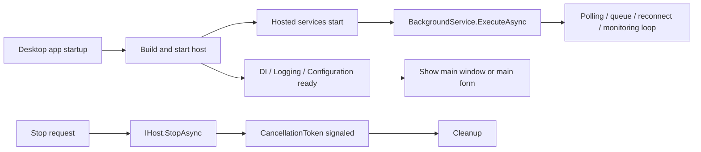

# Why Generic Host and BackgroundService Belong in Desktop Apps - A Cleaner Way to Manage Startup, Lifetime, and Graceful Shutdown

As a Windows tool or resident desktop app grows, the work outside the UI slowly starts to dominate:

- periodic polling
- file watching
- reconnect loops
- queue processing
- startup initialization
- shutdown flushing

At first, `Form_Load`, `OnStartup`, timers, and `Task.Run` feel sufficient.  
After a while, it becomes unclear who starts what, who stops what, and who owns the exceptions.

That is where .NET Generic Host and `BackgroundService` become surprisingly valuable.

## Contents

1. [Short version](#1-short-version)
2. [The overall picture](#2-the-overall-picture)
3. [Why this works well for desktop apps](#3-why-this-works-well-for-desktop-apps)
4. [Cases where it fits well](#4-cases-where-it-fits-well)
5. [How to divide StartAsync, ExecuteAsync, and StopAsync](#5-how-to-divide-startasync-executeasync-and-stopasync)
6. [Common anti-patterns](#6-common-anti-patterns)
7. [Summary](#7-summary)

---

## 1. Short version

- Generic Host is very useful in desktop apps as a **foundation for startup and lifetime management**
- `BackgroundService` is a container for long-lived work with a **managed lifetime**, not a prettier `Task.Run`
- The biggest payoff is that startup responsibility, stop responsibility, exception monitoring, logging, configuration, and DI can all move toward one design center
- Keeping `StartAsync` short, running the long-lived loop in `ExecuteAsync`, and doing cleanup in `StopAsync` makes the code much easier to understand

The real benefit is not just "background work exists."  
It is that **the lifetime of that work becomes a first-class design decision instead of an accident of the UI layer**.

## 2. The overall picture

## 3. Why this works well for desktop apps

- UI responsibilities and resident processing become easier to separate
- startup, shutdown, and error observation move toward one entry point
- graceful shutdown can be designed explicitly instead of improvised
- DI, logging, and configuration are already part of the host model

## 4. Cases where it fits well

This structure fits especially well when the app contains:

- tray-resident monitoring logic
- periodic synchronization
- reconnect loops
- file watchers plus queue-based follow-up work
- startup warm-up routines
- bounded background pipelines using `Channel<T>`

## 5. How to divide StartAsync, ExecuteAsync, and StopAsync

### `StartAsync`

Use it for short startup work that really belongs to application startup.

### `ExecuteAsync`

Put the long-running body here:

- monitoring loops
- periodic timers
- queue consumers
- reconnect and retry loops

### `StopAsync`

Use it for orderly shutdown:

- stop accepting new work
- close external resources
- flush or finalize state

`StopAsync` is helpful, but it is **not crash insurance**.

## 6. Common anti-patterns

- scattering `Task.Run` across forms or view models for long-lived work
- controlling service lifetime through random `bool` flags
- letting background loops outlive the app shutdown sequence
- mixing UI updates, I/O, retry logic, and queue management in one class
- treating `Environment.Exit` as normal shutdown orchestration

## 7. Summary

Generic Host works well in desktop apps because it gives you a clean place to answer questions that otherwise become muddy over time:

- what starts at application startup?
- what keeps running in the background?
- who stops it?
- who observes failure?

Once those answers live in the host and hosted services instead of leaking through the UI layer, the app becomes much easier to maintain.
