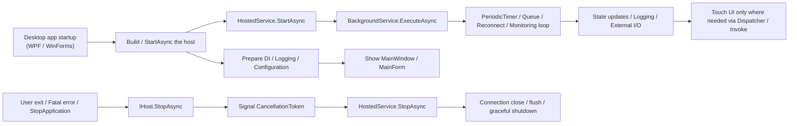

As a Windows tool or resident desktop app grows a little, the work outside the UI starts to increase gradually.
Periodic polling, file watching, reconnect loops, queue processing, startup initialization, shutdown-time flushing.
At first, you can often get by with `Form_Load`, `OnStartup`, or a quick `Task.Run`, but if the app keeps growing that way, it becomes unclear who starts what, who stops what, and who is responsible for observing exceptions.

There are situations where it helps to decide **who owns the lifetime of a piece of work** even before discussing the details of `async` / `await`.
That is where .NET's Generic Host and `BackgroundService` become useful.

The UI-thread side of `async` / `await` connects naturally to:

* [WPF / WinForms async/await and the UI Thread in One Sheet - Continuation destinations, Dispatcher, ConfigureAwait, and why .Result / .Wait() get stuck](/en/blog/2026/03/12/000-wpf-winforms-ui-thread-async-await-one-sheet/)
* [C# async/await Best Practices - A decision table for Task.Run and ConfigureAwait](/en/blog/2026/03/09/001-csharp-async-await-best-practices/)

This article focuses one layer outside that, on organizing **startup and shutdown for the application as a whole**.

The parts that tend to decay slowly in real projects are usually things like these:

* `Task.Run` starts appearing all over forms and view models
* resident loops are controlled by scattered `bool` flags
* some work is still running during shutdown, and the app occasionally does not close cleanly
* logging, configuration, and DI each end up with their own separate entry points
* `Environment.Exit` starts to look tempting, and `finally` blocks get skipped

This article assumes mostly .NET 6 and later WPF / WinForms / resident Windows applications and organizes why Generic Host / `BackgroundService` helps, how far it is worth bringing them in, and where the design turns muddy if you use them carelessly.

## Terms First

This topic gets harder to read quickly if the terms remain vague, so it helps to fix the basic vocabulary first.

* **Generic Host**
  * the foundation that takes care of application startup, dependencies, configuration, logging, and shutdown
  * it is not just for ASP.NET Core; it also works in console apps, workers, and desktop apps
* **Host / `IHost`**
  * the built runtime instance
  * you start it with `StartAsync` and stop it with `StopAsync`
* **Hosted Service**
  * resident work that starts and stops along with the host lifetime
  * you can implement `IHostedService` directly, but most of the time you inherit from `BackgroundService`
* **`BackgroundService`**
  * a helper implementation that makes `IHostedService` easier to write
  * because the long-running body lives in `ExecuteAsync`, it is good for organizing monitoring loops and periodic processing
* **lifetime**
  * in this article, this means when the work starts, when it ends, and who is responsible for stopping it
  * it is more than just "how long it lives"; it includes both start responsibility and stop responsibility
* **graceful shutdown**
  * shutting down by sending a proper stop signal and letting in-flight work settle as much as practical instead of forcing the process down immediately
  * for example: not starting the next cycle, deciding how much of a queue to drain, or waiting for close / flush
* **DI**
  * shorthand for Dependency Injection
  * instead of hardcoding object construction at each call site, dependencies are assembled at the entry point and injected through the container

In other words, this is not only an introduction to a convenient class called `BackgroundService`.  
It is really about **gathering application startup and shutdown into the host and treating the lifetime of resident processing as part of the architecture**.

## Contents

1. [Short version](#1-short-version)
2. [First, see the whole picture in one page](#2-first-see-the-whole-picture-in-one-page)
   * 2.1. [Overall picture](#21-overall-picture)
   * 2.2. [Placement decision table](#22-placement-decision-table)
3. [Why this works well in desktop apps](#3-why-this-works-well-in-desktop-apps)
   * 3.1. [It becomes easier to separate UI responsibility from resident processing](#31-it-becomes-easier-to-separate-ui-responsibility-from-resident-processing)
   * 3.2. [Startup, shutdown, and exception entry points can be gathered into one place](#32-startup-shutdown-and-exception-entry-points-can-be-gathered-into-one-place)
   * 3.3. [It becomes easier to make graceful shutdown part of the design](#33-it-becomes-easier-to-make-graceful-shutdown-part-of-the-design)
   * 3.4. [DI, logging, and configuration come pre-aligned](#34-di-logging-and-configuration-come-pre-aligned)
4. [Cases where it fits well](#4-cases-where-it-fits-well)
5. [A minimal configuration example (WPF)](#5-a-minimal-configuration-example-wpf)
   * 5.1. [`App.xaml.cs`](#51-appxamlcs)
   * 5.2. [`BackgroundService`](#52-backgroundservice)
   * 5.3. [Do not tie state sharing directly to the UI](#53-do-not-tie-state-sharing-directly-to-the-ui)
6. [How to divide `StartAsync` / `ExecuteAsync` / `StopAsync`](#6-how-to-divide-startasync--executeasync--stopasync)
   * 6.1. [`StartAsync`](#61-startasync)
   * 6.2. [`ExecuteAsync`](#62-executeasync)
   * 6.3. [`StopAsync`](#63-stopasync)
   * 6.4. [A note for .NET 10 and later](#64-a-note-for-net-10-and-later)
7. [Common anti-patterns](#7-common-anti-patterns)
   * 7.1. [Starting an infinite loop in `Window_Loaded` / `Form_Shown`](#71-starting-an-infinite-loop-in-window_loaded--form_shown)
   * 7.2. [Fire-and-forget `Task.Run`](#72-fire-and-forget-taskrun)
   * 7.3. [Touching the UI directly from `BackgroundService`](#73-touching-the-ui-directly-from-backgroundservice)
   * 7.4. [Putting critical persistence only in `StopAsync`](#74-putting-critical-persistence-only-in-stopasync)
   * 7.5. [Using `Environment.Exit` even though you are already using the host](#75-using-environmentexit-even-though-you-are-already-using-the-host)
8. [Checklist for review](#8-checklist-for-review)
9. [Rough rule-of-thumb guide](#9-rough-rule-of-thumb-guide)
10. [Summary](#10-summary)
11. [References](#11-references)
12. [Author GitHub](#author-github)

* * *

## 1. Short version

* Generic Host is a very strong foundation for **startup and lifetime management**, even in desktop applications
* `BackgroundService` is a container that places **long-lived work onto a managed lifetime** instead of throwing it into `Task.Run` and forgetting about it
* What helps most in practice is being able to gather **start responsibility, stop responsibility, exception observation, logging, DI, and configuration** into one design center
* If `StartAsync` stays short, the long-running body lives in `ExecuteAsync`, and shutdown cleanup is placed in `StopAsync`, the code becomes much easier to read
* Tray apps, device-monitoring apps, periodic synchronization, ordered background post-processing, and reconnect loops are especially good fits
* On the other hand, if you move one-shot button-triggered work into `BackgroundService`, the design can become unnecessarily heavy
* `StopAsync` is useful, but it is **not insurance against process crashes or forced termination**. It is also important not to overload it with every form of cleanup

So the reason Generic Host / `BackgroundService` helps in desktop apps is not merely "because background work exists."  
It helps because **you want to treat the lifetime of that background work as architecture instead of as a side effect of the UI**.

## 2. First, see the whole picture in one page

### 2.1. Overall picture

This diagram usually makes the idea much easier to grasp.



In a UI application, responsibilities often get scattered across `Program.cs`, `App.xaml.cs`, `Form_Load`, `Closing`, random `Task.Run` calls, timers, and static singletons.

Once you introduce the host, you can usually separate the picture into:

* **UI**: screens, input, and display
* **HostedService / BackgroundService**: resident work, monitoring, queue processing, periodic processing
* **DI services**: actual business logic, external connections, configuration, and logging

That separation alone makes design review much easier.

### 2.2. Placement decision table

| What you want to do | First candidate placement | Why |
|---|---|---|
| lightweight initialization immediately after startup | `StartAsync` | it clearly participates in startup as short work |
| long-lived monitoring / polling / reconnect behavior | `ExecuteAsync` | it naturally runs for the service lifetime |
| stop notifications / flush / close during shutdown | `StopAsync` | it pairs naturally with `CancellationToken` and graceful shutdown |
| dependency setup, configuration, and logging | `Host.CreateApplicationBuilder` | it gathers the entry point in one place |
| UI updates | the UI side | it is safer not to let workers touch the UI directly |
| one-shot button-triggered work | a normal `async` method | it usually does not need to become a hosted service |
| ordered background post-processing | `Channel<T>` + `BackgroundService` | it manages lifetime and limits better than fire-and-forget |

The value of introducing the host is not only that it lets something become "asynchronous."  
It is that **it makes placement decisions much clearer**.

## 3. Why this works well in desktop apps

### 3.1. It becomes easier to separate UI responsibility from resident processing

Desktop apps look UI-centered, but the parts that become heavy in real work are usually outside the UI.

For example:

* state synchronization every 10 seconds
* reconnecting to devices or servers
* file watching and ingestion
* queued follow-up processing
* log shipping or metric reporting
* startup cache warm-up

These are not really "screen events." They are **work that hangs off the lifetime of the whole application**.

If you let them live in forms or window code-behind, the responsibility for stopping them when the screen closes, observing exceptions, and deciding retries or backoff starts mixing with UI concerns.

With `BackgroundService`, the statement "this work lives for as long as the application lives" appears directly in the shape of the code.  
That is quietly powerful.

### 3.2. Startup, shutdown, and exception entry points can be gathered into one place

Even without the host, a desktop app can line up `ServiceCollection`, `ConfigurationBuilder`, and `LoggerFactory` by hand.

But that shape usually scatters little by little:

* DI in `Program.cs`
* configuration in some custom static holder
* logging in another factory
* shutdown handling in `ApplicationExit`
* resident processing in `Task.Run`

That can still work at first.
But when you revisit it a few months later, it becomes hard to see **who actually owns the application's lifetime**.

With Generic Host, these all fit into one framework:

* service registration
* configuration loading
* logging setup
* hosted service startup
* stop notifications
* whole-application shutdown via `IHostApplicationLifetime`

So it becomes easier to gather the entry point for "how this application starts and how it stops" into one place.  
That pays off later in resident apps.

### 3.3. It becomes easier to make graceful shutdown part of the design

For resident work, stopping is harder than starting.
Truly.
Start-up can take three lines. Shutdown often tastes like mud.

At shutdown, you often need to:

* cancel in-flight I/O
* avoid starting the next cycle
* decide how much queued work to drain
* close sockets or COM objects
* wait for logging flushes or state persistence

If you cram that into `FormClosing`, it quickly gets painful because it mixes with screen-specific concerns.

With Host / `BackgroundService`, you already have `CancellationToken` and `StopAsync`, so **a path for stopping exists from the beginning**.

Of course it is not magic.
`StopAsync` may not be called on crashes or hard kills.
Even so, merely having a design that says "on normal shutdown, stop through this route" makes the whole system much calmer.

### 3.4. DI, logging, and configuration come pre-aligned

The nice part about Generic Host is not only `BackgroundService`.

* `Host.CreateApplicationBuilder` gives you a base for DI, configuration, and logging
* `appsettings.json` and environment variables fit naturally
* `ILogger<T>` can be used in both UI code and workers with the same style
* if needed, `IOptions<T>` style configuration grouping is already there

This matters especially in Windows tool projects where "it started small, so settings and loggers lived in random statics" often turns painful later.

If you put those concerns onto the host from the beginning, the app stays less out of breath when it grows a little.

## 4. Cases where it fits well

Generic Host / `BackgroundService` is especially effective in cases like these:

* **tray resident apps**  
  periodic synchronization, monitoring, notifications, and reconnect behavior exist
* **device / camera / socket connection apps**  
  connection maintenance, monitoring, retry, and state collection exist
* **file integration tools**  
  watching, ingestion queues, and ordered processing exist
* **preventing internal tools from quietly bloating**  
  the app starts small, but settings, logging, and external I/O are likely to grow
* **apps where shutdown quality matters**  
  you do not want to leave half-finished state behind on exit

By contrast, you may not need to introduce the host immediately in cases like these:

* a tiny tool that starts, performs one operation, and exits
* a screen that is almost completely driven by UI events and has little background work
* a genuinely tiny internal helper app where dependencies and settings are unlikely to grow

In other words, Host is not mandatory.  
But once you can already see **two or more resident workflows**, it is worth considering very positively. It is much cheaper than cleaning up a later `Task.Run` colony.

## 5. A minimal configuration example (WPF)

As an example, here is a minimal WPF setup that starts a host and runs a `BackgroundService` that reads external state every five seconds.
In WinForms, the entry point changes to `Main` / `ApplicationContext`, but the idea is almost the same.

### 5.1. `App.xaml.cs`

```csharp
using System.Windows;
using Microsoft.Extensions.DependencyInjection;
using Microsoft.Extensions.Hosting;

namespace DesktopHostSample;

public partial class App : Application
{
    private IHost? _host;

    protected override async void OnStartup(StartupEventArgs e)
    {
        base.OnStartup(e);

        HostApplicationBuilder builder = Host.CreateApplicationBuilder(e.Args);

        builder.Services.Configure<HostOptions>(options =>
        {
            options.ShutdownTimeout = TimeSpan.FromSeconds(15);
        });

        builder.Services.AddSingleton<MainWindow>();
        builder.Services.AddSingleton<StatusStore>();
        builder.Services.AddScoped<IDeviceStatusReader, DeviceStatusReader>();
        builder.Services.AddHostedService<DevicePollingBackgroundService>();

        _host = builder.Build();

        await _host.StartAsync();

        MainWindow mainWindow = _host.Services.GetRequiredService<MainWindow>();
        mainWindow.Show();
    }

    protected override async void OnExit(ExitEventArgs e)
    {
        if (_host is not null)
        {
            await _host.StopAsync();
            _host.Dispose();
        }

        base.OnExit(e);
    }
}
```

Three points matter in this shape:

1. **start the host before showing the UI**
2. **explicitly await `StopAsync` on shutdown**
3. **gather DI, hosted services, and shutdown timeout at the entry point**

Making `OnExit` async itself needs some care because of UI framework behavior, but it is still important to make the host-shutdown path explicit.

### 5.2. `BackgroundService`

```csharp
using Microsoft.Extensions.DependencyInjection;
using Microsoft.Extensions.Hosting;
using Microsoft.Extensions.Logging;

namespace DesktopHostSample;

public sealed class DevicePollingBackgroundService(
    IServiceScopeFactory scopeFactory,
    StatusStore statusStore,
    ILogger<DevicePollingBackgroundService> logger) : BackgroundService
{
    public override async Task StartAsync(CancellationToken cancellationToken)
    {
        logger.LogInformation("Device polling service is starting.");
        await base.StartAsync(cancellationToken);
    }

    protected override async Task ExecuteAsync(CancellationToken stoppingToken)
    {
        logger.LogInformation("Device polling loop started.");

        using var timer = new PeriodicTimer(TimeSpan.FromSeconds(5));

        while (await timer.WaitForNextTickAsync(stoppingToken))
        {
            try
            {
                using IServiceScope scope = scopeFactory.CreateScope();
                IDeviceStatusReader reader =
                    scope.ServiceProvider.GetRequiredService<IDeviceStatusReader>();

                DeviceStatus status = await reader.ReadAsync(stoppingToken);
                statusStore.Update(status);
            }
            catch (OperationCanceledException) when (stoppingToken.IsCancellationRequested)
            {
                break;
            }
            catch (Exception ex)
            {
                logger.LogError(ex, "Device polling failed.");
            }
        }

        logger.LogInformation("Device polling loop finished.");
    }

    public override async Task StopAsync(CancellationToken cancellationToken)
    {
        logger.LogInformation("Device polling service is stopping.");
        await base.StopAsync(cancellationToken);
        logger.LogInformation("Device polling service stopped.");
    }
}
```

The important thing here is to write `ExecuteAsync` plainly as **a managed while loop**.

* `PeriodicTimer` controls the cycle
* `stoppingToken` controls shutdown
* exceptions are logged
* if you need scoped dependencies, you create a scope each time

That shape makes it much easier to read where the resident work starts, where it stops, and where failure becomes visible.

### 5.3. Do not tie state sharing directly to the UI

If a worker touches UI objects directly, the UI-thread problem simply reappears there.

So a safer first separation is:

* the worker updates **a state store or messaging layer**
* the UI reads and reflects that state in **its own context**

For example, `StatusStore` can be a thin shared layer like this:

```csharp
namespace DesktopHostSample;

public sealed class StatusStore
{
    private readonly object _gate = new();
    private DeviceStatus _current = DeviceStatus.Empty;

    public DeviceStatus Current
    {
        get
        {
            lock (_gate)
            {
                return _current;
            }
        }
    }

    public void Update(DeviceStatus next)
    {
        lock (_gate)
        {
            _current = next;
        }
    }
}

public sealed record DeviceStatus(string Message)
{
    public static readonly DeviceStatus Empty = new("No Data");
}
```

If you need immediate UI notifications, you can use `Dispatcher`, `BeginInvoke`, events, or a messenger.
But it is less confusing when that responsibility lives **at the UI boundary**.

## 6. How to divide `StartAsync` / `ExecuteAsync` / `StopAsync`

Once those three get mixed together, the reader's picture turns muddy very quickly.
This split is a stable starting point.

### 6.1. `StartAsync`

`StartAsync` is where you put **short work that participates in startup**.

Good fits:

* startup logging
* beginning a light subscription
* preparing an initial state quickly
* minimal sequencing before or after `base.StartAsync`

Poor fits:

* warm-up that takes tens of seconds
* infinite loops
* the main body that lines up heavy I/O

If `StartAsync` becomes heavy, the whole application startup starts to feel sluggish.
It is safer to think of it as "the place to write the start signal."

### 6.2. `ExecuteAsync`

`ExecuteAsync` is **the main body for the service lifetime**.

Good fits:

* polling
* monitoring loops
* reconnect loops
* consumers that read `Channel<T>`
* periodic work
* any work that should live until shutdown

Three habits matter here:

1. pass `CancellationToken` all the way through  
2. avoid having the whole loop die silently on exceptions  
3. do not keep piling retries and backoff onto the same spot in an ad hoc way

`BackgroundService` is convenient, but if you let it, it can turn into "the giant loop that absorbs everything."
It is usually easier to read when real business logic lives in separate services and `ExecuteAsync` stays focused on **lifetime management and orchestration**.

### 6.3. `StopAsync`

`StopAsync` is where you do **normal-shutdown cleanup**.

Good fits:

* shutdown logging
* unregistering timers, subscriptions, and monitoring
* cleaning up resources you want to close or flush explicitly
* waiting for completion through `base.StopAsync`

But it is also important not to expect too much from `StopAsync`.

* the process crashed
* the process was force-terminated
* the OS killed it

In those cases, this route may never run at all.

So it matters to:

* keep persistence small and regular during normal operation
* avoid designs that become consistent only at shutdown
* keep cleanup idempotent

Trying to save the whole world only at shutdown usually turns muddy.

### 6.4. A note for .NET 10 and later

As a change from 2025 onward, in .NET 10 the whole body of `BackgroundService.ExecuteAsync` is executed as a background task.

Previously, there was a slightly confusing behavior where the synchronous portion before the first `await` could block the startup of other services.
This change reduces the chance of "the first few lines of `ExecuteAsync` quietly made startup heavy."

Even so, from a design perspective it is still easier to read if you keep the split:

* short work that participates in startup -> `StartAsync`
* long-running main body -> `ExecuteAsync`

If you need more precise control over lifecycle timing, `IHostedLifecycleService` is worth considering.
That is a quiet but useful point once resident apps start getting bigger.

## 7. Common anti-patterns

### 7.1. Starting an infinite loop in `Window_Loaded` / `Form_Shown`

It feels easy at first.
But then stop responsibility and exception responsibility stick directly to the UI.

As soon as conditions like these start piling up, it becomes painful:

"stop when the screen closes"  
"do not stop when minimized to tray"  
"restart when settings change"

### 7.2. Fire-and-forget `Task.Run`

`Task.Run` itself is not evil.
What hurts is **having nobody own the lifetime and the exceptions**.

Especially when resident work starts as `Task.Run(async () => { while (...) { ... } })`, these become ambiguous:

* when does it end?
* who waits for it?
* who observes exceptions?
* how long do we wait during shutdown?

Once that work moves onto `BackgroundService`, the picture becomes much easier to organize.

### 7.3. Touching the UI directly from `BackgroundService`

This is a landmine.
The UI-thread problem and the lifetime problem become tangled all at once.

It is safer if the worker does not manipulate the UI directly and instead puts a boundary around one of these:

* state
* events
* messages
* queues

### 7.4. Putting critical persistence only in `StopAsync`

`StopAsync` helps with normal shutdown, but it is not the final judge of all things.

If the design says:

* save only at shutdown
* flush only at shutdown
* become consistent only at shutdown

then crashes will break it.

### 7.5. Using `Environment.Exit` even though you are already using the host

This also happens often.

Once you say "this is annoying, let's just exit" and call `Environment.Exit`, you are cutting off the graceful shutdown path that the host is already providing.

If you want to terminate the whole app on a fatal error, it is much cleaner to use `IHostApplicationLifetime.StopApplication()` first and go through **the official route for stopping**.

## 8. Checklist for review

When reviewing a desktop app that uses Generic Host / `BackgroundService`, it helps to inspect these in order:

* is this work really **application-lifetime work**, or is it just a UI event handler?
* are startup responsibilities split appropriately across `StartAsync` / `ExecuteAsync` / `StopAsync`?
* has `StartAsync` become too heavy?
* does `ExecuteAsync` pass `CancellationToken` all the way through?
* is a hosted service holding onto scoped dependencies directly instead of creating scopes?
* is a worker touching UI objects directly?
* are exceptions being swallowed silently?
* has a retry loop become an unbounded high-frequency loop?
* is there an upper bound on shutdown waiting time?
* are there shutdown paths that assume `Environment.Exit` or process kill?

This checklist makes it much easier to see the difference between "we introduced Host" and "we actually organized lifetime as architecture."

## 9. Rough rule-of-thumb guide

| What you want to do | First choice |
|---|---|
| align DI / logging / configuration for the whole application | `Host.CreateApplicationBuilder` |
| run a resident loop | `BackgroundService` |
| run on a fixed interval | `PeriodicTimer` + `BackgroundService` |
| process ordered background follow-up work | `Channel<T>` + `BackgroundService` |
| use scoped services | `IServiceScopeFactory.CreateScope()` |
| signal normal shutdown to the whole app | `IHostApplicationLifetime.StopApplication()` |
| update the UI | `Dispatcher` / `Invoke` on the UI side |
| run a one-shot screen action | a normal `async` method |
| control startup lifecycle more strictly | consider `IHostedLifecycleService` |

## 10. Summary

The reason to bring Generic Host / `BackgroundService` into a desktop app is not "because we want to write code that looks like web code."

What really helps is these three:

1. **startup and shutdown responsibility can be gathered into one place**
2. **the lifetime of long-lived work becomes part of the design**
3. **graceful shutdown can be treated from the entry point instead of added later**

Windows tools and resident apps may start small, but monitoring, synchronization, reconnect logic, queues, logging, and configuration tend to increase gradually.
When those are operated as a side effect of UI code, the project gets quietly painful later.

By contrast, the following split already cleans up a lot:

* UI is UI
* resident work is hosted services
* actual business logic lives in DI services
* shutdown runs through `StopAsync` and `CancellationToken`

It is not flashy.
But this kind of quiet design works very well in practice.
It reduces the sticky unpleasantness behind problems like:

"sometimes shutdown behaves oddly"  
"nobody knows where the process is actually being stopped"

If you are stuck on desktop-app background processing, startup / shutdown design, monitoring loops, lifetime design for COM / sockets / file watching, or investigating shutdown defects, feel free to reach out for design review or direction-setting.

## 11. References

* [Related: C# async/await Best Practices - A decision table for Task.Run and ConfigureAwait](/en/blog/2026/03/09/001-csharp-async-await-best-practices/)
* [Related: WPF / WinForms async/await and the UI Thread in One Sheet](/en/blog/2026/03/12/000-wpf-winforms-ui-thread-async-await-one-sheet/)
* [The .NET Generic Host](https://learn.microsoft.com/en-us/dotnet/core/extensions/generic-host)
* [Background tasks with hosted services in ASP.NET Core](https://learn.microsoft.com/en-us/aspnet/core/fundamentals/host/hosted-services?view=aspnetcore-10.0)
* [BackgroundService Class](https://learn.microsoft.com/en-us/dotnet/api/microsoft.extensions.hosting.backgroundservice?view=net-9.0-pp)
* [Breaking change: BackgroundService runs all of ExecuteAsync as a Task](https://learn.microsoft.com/en-us/dotnet/core/compatibility/extensions/10.0/backgroundservice-executeasync-task)
* [Logging in C# and .NET](https://learn.microsoft.com/en-us/dotnet/core/extensions/logging/overview)

## Author GitHub

The author of this article, Go Komura, uses the GitHub account [gomurin0428](https://github.com/gomurin0428).

On GitHub, he publishes [COM_BLAS](https://github.com/gomurin0428/COM_BLAS) and [COM_BigDecimal](https://github.com/LongTail-Software/COM_BigDecimal).

[← Back to the blog index](/en/blog/)
