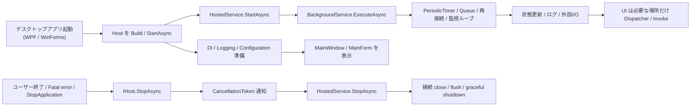

Windows ツールや常駐系アプリを少し育てると、UI の外側にある処理がじわじわ増えてきます。
定期ポーリング、ファイル監視、再接続、キュー処理、起動時初期化、終了時 flush。
最初は `Form_Load` や `OnStartup` や `Task.Run` でしのげますが、そのまま育つと、誰が開始して、誰が止めて、誰が例外を見るのかが曖昧になります。

`async` / `await` の書き方そのものより前に、処理の寿命を誰が持つかを決めたほうがよい場面です。
そこで効くのが .NET の Generic Host と `BackgroundService` です。

UI スレッド側の `async` / `await` については、
[WPF / WinForms の async/await と UI スレッドを一枚で整理 - await 後の戻り先、Dispatcher、ConfigureAwait、.Result / .Wait() の詰まりどころ](/blog/2026/03/12/000-wpf-winforms-ui-thread-async-await-one-sheet/)
や
[C# async/await のベストプラクティス - Task.Run と ConfigureAwait の判断表](/blog/2026/03/09/001-csharp-async-await-best-practices/)
とつながる話です。
今回は、そのさらに外側にある「アプリ全体の起動と停止」の整理に絞ります。

実務でじわっと腐りやすいのは、だいたいこのへんです。

* フォームや ViewModel のあちこちから `Task.Run` が生える
* 常駐ループの停止条件が `bool` フラグで散らばる
* 終了時にまだ動いている処理がいて、たまに閉じきらない
* ログ / 設定 / DI の入口が技術ごとに別々になる
* `Environment.Exit` で片付けたくなり、`finally` が飛ぶ

この記事では、主に .NET 6 以降の WPF / WinForms / 常駐系 Windows アプリを前提に、
なぜ Generic Host / `BackgroundService` が地味に効くのか、
どこまで持ち込むと得か、どこで雑にするとぬかるみになるかを整理します。

## 用語を先にそろえる

この手の話は、単語の意味がふわっとしたままだと急に読みづらくなります。
なので、この記事で使う言葉を最初にざっくり固定します。

* **Generic Host**
  * .NET アプリの「起動」「依存関係」「設定」「ログ」「停止」をまとめて面倒を見る土台です。
  * ASP.NET Core だけの仕組みではなく、コンソール、worker、デスクトップアプリでも使えます。
* **Host / `IHost`**
  * build した後の実体です。
  * これを `StartAsync` で起動し、`StopAsync` で止めます。
* **Hosted Service**
  * host の寿命にぶら下がって開始・停止される常駐処理です。
  * `IHostedService` を実装するか、通常は `BackgroundService` を継承して書きます。
* **`BackgroundService`**
  * `IHostedService` の書きやすい実装補助です。
  * 長く走る本体を `ExecuteAsync` に書けるので、監視ループや定期処理を整理しやすくなります。
* **lifetime**
  * この記事では「その処理が、いつ始まり、いつ終わり、誰が止める責任を持つか」という意味で使います。
  * 単なる生存時間というより、開始責務と停止責務を含んだ寿命管理です。
* **graceful shutdown**
  * 強制終了ではなく、止める合図を出して、進行中の処理をなるべく整えてから終了することです。
  * たとえば「次の周期を始めない」「キューをどこまで流すか決める」「close や flush を待つ」がここに入ります。
* **DI**
  * Dependency Injection の略で、依存オブジェクトの組み立てを呼び出し側にべた書きせず、コンテナ経由で受け取るやり方です。
  * この記事では「logger や設定や reader を new 祭りにせず、入口でまとめて構成する」くらいの理解で十分です。

要するに、この話は
「`BackgroundService` という便利クラスの紹介」だけではなく、
**アプリ全体の起動と停止を host に集めて、常駐処理の lifetime を設計として持つ話**
だと思って読むと追いやすいです。

## 目次

1. まず結論（ひとことで）
2. まず一枚で整理
   * 2.1. 全体像
   * 2.2. 置き場所の判断表
3. なぜデスクトップアプリで効くのか
   * 3.1. UI と常駐処理の責務を分けやすい
   * 3.2. 起動・停止・例外の入口を一か所に寄せられる
   * 3.3. graceful shutdown を設計に入れやすい
   * 3.4. DI / ログ / 設定が最初からそろう
4. 向いているケース
5. 最小構成例（WPF 例）
6. `StartAsync` / `ExecuteAsync` / `StopAsync` の分け方
   * 6.1. `StartAsync`
   * 6.2. `ExecuteAsync`
   * 6.3. `StopAsync`
   * 6.4. .NET 10 以降の注意
7. よくあるアンチパターン
8. レビュー時のチェックリスト
9. ざっくり使い分け
10. まとめ
11. 参考資料

* * *

## 1. まず結論（ひとことで）

* Generic Host は、デスクトップアプリでも **起動と lifetime 管理の土台** としてかなり有力です。
* `BackgroundService` は、「長く生きる処理」を `Task.Run` 投げっぱなしではなく **管理された寿命** に載せるための器です。
* 実務でいちばん効くのは、**開始責務 / 停止責務 / 例外監視 / ログ / DI / 設定** を 1 か所の設計に寄せられることです。
* `StartAsync` は短く、長く走る本体は `ExecuteAsync`、終了時の後片付けは `StopAsync` に分けるとかなり読みやすくなります。
* 常駐アプリ、トレイアプリ、装置監視、定期同期、順番付き後処理、再接続ループは特に相性がよいです。
* 逆に、ボタンを押したときだけ 1 回動く処理まで全部 `BackgroundService` にすると、少し仰々しくなります。
* `StopAsync` は便利ですが、**プロセスクラッシュや強制終了の保険ではありません**。そこに後始末を寄せすぎないことも大事です。

要するに、デスクトップアプリで Generic Host / `BackgroundService` が効くのは、
「バックグラウンド処理があるから」より、
「そのバックグラウンド処理の寿命を、UI のついでではなく設計として持ちたいから」です。

## 2. まず一枚で整理

### 2.1. 全体像

まずはこの図で見ると、話がかなり早いです。



UI アプリでありがちなのは、`Program.cs` / `App.xaml.cs` / `Form_Load` / `Closing` / `Task.Run` / `Timer` / static singleton に少しずつ責務が散る形です。

Host を入れると、ざっくり次の分担にできます。

* **UI**: 画面、入力、表示
* **HostedService / BackgroundService**: 常駐処理、監視、キュー処理、定期処理
* **DI サービス**: 実際の業務ロジック、外部接続、設定、ログ

この切り方ができるだけで、レビューしやすさがかなり変わります。

### 2.2. 置き場所の判断表

| やりたいこと | 置き場所の第一候補 | 理由 |
|---|---|---|
| 起動直後の軽い初期化 | `StartAsync` | 起動に参加する短い処理として意味が明確 |
| 長く生きる監視 / ポーリング / 再接続 | `ExecuteAsync` | サービス寿命と一緒に走らせやすい |
| 終了時の停止通知 / flush / close | `StopAsync` | `CancellationToken` とあわせて graceful shutdown を書きやすい |
| 依存関係の構成、設定、ログ | `Host.CreateApplicationBuilder` | 入口を 1 か所に寄せられる |
| 画面更新 | UI 側 | worker から直接 UI を触らないほうが事故が少ない |
| ボタン押下ごとの 1 回処理 | 通常の `async` メソッド | HostedService にしなくてよいことが多い |
| 順番付きのバックグラウンド後処理 | `Channel<T>` + `BackgroundService` | 投げっぱなしより寿命と上限を管理しやすい |

Host を入れる価値は、何かを「非同期にできる」ことより、
**どこに置くべきかの判断が明確になる** ことにあります。

## 3. なぜデスクトップアプリで効くのか

### 3.1. UI と常駐処理の責務を分けやすい

デスクトップアプリは UI が主役に見えますが、実務で重くなるのはだいたい UI の外側です。

たとえば:

* 10 秒ごとの状態同期
* 装置やサーバーとの再接続
* ファイル監視と取り込み
* キューに積まれた後処理
* ログ転送やメトリクス送信
* 起動時のキャッシュ warm-up

これらは「画面のイベント」ではなく、**アプリ全体の寿命にぶら下がる処理** です。

ここをフォームやウィンドウのコードビハインドに住まわせると、
画面を閉じたときに止める責任、
例外を拾う責任、
再試行や backoff を決める責任が、
UI の事情と混ざり始めます。

`BackgroundService` を使うと、
「この処理はアプリが動いている間ずっと生きる」
という宣言がコードの形に出ます。
これが地味に強いです。

### 3.2. 起動・停止・例外の入口を一か所に寄せられる

Host を使わない desktop app でも、`ServiceCollection`、`ConfigurationBuilder`、`LoggerFactory` を個別に並べれば似たことはできます。

ただ、その形はだいたい少しずつ散ります。

* DI は `Program.cs`
* 設定は独自 static
* ログは別 factory
* 終了処理は `ApplicationExit`
* 常駐処理は `Task.Run`

この状態でも最初は動きます。
しかし数か月後に見返すと、**誰がアプリの寿命を持っているのか** が見えにくくなります。

Generic Host を使うと、

* サービス登録
* 構成読み込み
* ログ構成
* hosted service の起動
* 停止通知
* `IHostApplicationLifetime` による全体停止

が、同じ枠組みに入ります。

つまり、「このアプリはどう起動し、どう止まるのか」の入口を 1 か所に寄せやすいわけです。
常駐系アプリでは、ここがあとから効いてきます。

### 3.3. graceful shutdown を設計に入れやすい

常駐処理は、始めるより止めるほうが難しいです。
ほんとうにそうです。開始は 3 行でも、終了は泥の味がします。

たとえば終了時には:

* 進行中の I/O をキャンセルしたい
* 次の周期を開始しないようにしたい
* キューの残件をどこまで流すか決めたい
* ソケットや COM オブジェクトを閉じたい
* ログ flush や状態保存を待ちたい

このへんを `FormClosing` に寄せると、画面都合と混ざってつらくなります。

Host / `BackgroundService` なら、`CancellationToken` と `StopAsync` があるので、
「止めるための経路」が最初からあります。

もちろん魔法ではありません。
クラッシュや kill では `StopAsync` が呼ばれないこともあります。
それでも、「正常終了時はこのルートで止める」という設計があるだけで、かなり静かになります。

### 3.4. DI / ログ / 設定が最初からそろう

Generic Host の良さは、`BackgroundService` だけではありません。

* `Host.CreateApplicationBuilder` で DI / 構成 / ログの土台がそろう
* `appsettings.json` や環境変数をそのまま使いやすい
* `ILogger<T>` を UI も worker も同じ流儀で使える
* 必要なら `IOptions<T>` 系で設定をまとめられる

特に Windows ツール案件では、
「最初は小さかったので雑に static で持っていた設定や logger が、あとで苦しくなる」
というのがかなりよくあります。

ここを最初から host に載せておくと、
アプリが少し太ってきたときの息切れが減ります。

## 4. 向いているケース

Generic Host / `BackgroundService` が特に効きやすいのは、たとえば次のようなケースです。

* **トレイ常駐アプリ**  
  定期同期、監視、通知、再接続がある
* **装置 / カメラ / ソケット接続アプリ**  
  接続維持、監視、再試行、状態取得がある
* **ファイル連携ツール**  
  監視、取り込みキュー、順番付き処理がある
* **社内ツールの肥大化予防**  
  最初は小さいが、設定・ログ・外部 I/O が増えそう
* **終了品質が大事なアプリ**  
  閉じるときに中途半端な状態を残したくない

逆に、次のようなケースでは、いきなり host を入れなくてもよいことがあります。

* 単発起動して 1 回だけ処理して終わる小さなツール
* 背景処理がほぼ無く、UI イベントだけで完結する画面
* 依存関係や設定がほとんど増えない、本当に小さい社内補助ツール

つまり、Host は「必須」ではありません。
ただし、**常駐処理が 2 つ以上見え始めたら、かなり前向きに検討してよい** です。
後から `Task.Run` 植民地を片付けるより、だいぶ安いです。

## 5. 最小構成例（WPF 例）

例として、WPF で host を起動し、5 秒ごとに外部状態を読む `BackgroundService` を動かす最小構成を書きます。
WinForms でも、入口が `Main` / `ApplicationContext` に変わるだけで考え方はほぼ同じです。

### 5.1. `App.xaml.cs`

```csharp
using System.Windows;
using Microsoft.Extensions.DependencyInjection;
using Microsoft.Extensions.Hosting;

namespace DesktopHostSample;

public partial class App : Application
{
    private IHost? _host;

    protected override async void OnStartup(StartupEventArgs e)
    {
        base.OnStartup(e);

        HostApplicationBuilder builder = Host.CreateApplicationBuilder(e.Args);

        builder.Services.Configure<HostOptions>(options =>
        {
            options.ShutdownTimeout = TimeSpan.FromSeconds(15);
        });

        builder.Services.AddSingleton<MainWindow>();
        builder.Services.AddSingleton<StatusStore>();
        builder.Services.AddScoped<IDeviceStatusReader, DeviceStatusReader>();
        builder.Services.AddHostedService<DevicePollingBackgroundService>();

        _host = builder.Build();

        await _host.StartAsync();

        MainWindow mainWindow = _host.Services.GetRequiredService<MainWindow>();
        mainWindow.Show();
    }

    protected override async void OnExit(ExitEventArgs e)
    {
        if (_host is not null)
        {
            await _host.StopAsync();
            _host.Dispose();
        }

        base.OnExit(e);
    }
}
```

この形のポイントは 3 つです。

1. **host の起動を UI 表示の前に行う**
2. **終了時に `StopAsync` を明示的に await する**
3. **DI / hosted service / shutdown timeout を入口でまとめる**

`OnExit` を async にすること自体は UI フレームワーク都合で少し気を使いますが、
「終了時に host を止める」という流れをはっきり書いておく意味は大きいです。

### 5.2. `BackgroundService`

```csharp
using Microsoft.Extensions.DependencyInjection;
using Microsoft.Extensions.Hosting;
using Microsoft.Extensions.Logging;

namespace DesktopHostSample;

public sealed class DevicePollingBackgroundService(
    IServiceScopeFactory scopeFactory,
    StatusStore statusStore,
    ILogger<DevicePollingBackgroundService> logger) : BackgroundService
{
    public override async Task StartAsync(CancellationToken cancellationToken)
    {
        logger.LogInformation("Device polling service is starting.");
        await base.StartAsync(cancellationToken);
    }

    protected override async Task ExecuteAsync(CancellationToken stoppingToken)
    {
        logger.LogInformation("Device polling loop started.");

        using var timer = new PeriodicTimer(TimeSpan.FromSeconds(5));

        while (await timer.WaitForNextTickAsync(stoppingToken))
        {
            try
            {
                using IServiceScope scope = scopeFactory.CreateScope();
                IDeviceStatusReader reader =
                    scope.ServiceProvider.GetRequiredService<IDeviceStatusReader>();

                DeviceStatus status = await reader.ReadAsync(stoppingToken);
                statusStore.Update(status);
            }
            catch (OperationCanceledException) when (stoppingToken.IsCancellationRequested)
            {
                break;
            }
            catch (Exception ex)
            {
                logger.LogError(ex, "Device polling failed.");
            }
        }

        logger.LogInformation("Device polling loop finished.");
    }

    public override async Task StopAsync(CancellationToken cancellationToken)
    {
        logger.LogInformation("Device polling service is stopping.");
        await base.StopAsync(cancellationToken);
        logger.LogInformation("Device polling service stopped.");
    }
}
```

ここで大事なのは、`ExecuteAsync` を
「管理された while ループ」として素直に書くことです。

* 周期は `PeriodicTimer`
* 停止は `stoppingToken`
* 例外はロギング
* `scoped` な依存が必要なら毎回 scope を切る

この形にしておくと、
「今この常駐処理はどこで始まり、どこで止まり、どこで失敗が見えるのか」
がかなり読みやすくなります。

### 5.3. 状態共有は UI 直結にしない

worker から UI オブジェクトを直接触ると、結局そこで UI スレッド問題が再発します。

なので、まずは:

* worker は **状態ストアやメッセージング層** を更新する
* UI は **自分のコンテキスト** でその状態を読む / 反映する

という分離のほうが安全です。

たとえば `StatusStore` は次のような薄い共有層にしておけます。

```csharp
namespace DesktopHostSample;

public sealed class StatusStore
{
    private readonly object _gate = new();
    private DeviceStatus _current = DeviceStatus.Empty;

    public DeviceStatus Current
    {
        get
        {
            lock (_gate)
            {
                return _current;
            }
        }
    }

    public void Update(DeviceStatus next)
    {
        lock (_gate)
        {
            _current = next;
        }
    }
}

public sealed record DeviceStatus(string Message)
{
    public static readonly DeviceStatus Empty = new("No Data");
}
```

UI への即時通知が必要なら、`Dispatcher` / `BeginInvoke` / イベント / messenger などを使います。
ただし、その責任は **UI 境界で持つ** ほうが混ざりにくいです。

## 6. `StartAsync` / `ExecuteAsync` / `StopAsync` の分け方

この 3 つが混ざると、読み手の頭の中がすぐ濁ります。
まずは次の分け方がかなり安定します。

### 6.1. `StartAsync`

`StartAsync` は、**起動に参加する短い処理** を置く場所です。

向いているもの:

* 起動ログ
* 軽い購読開始
* すぐ終わる初期状態の準備
* `base.StartAsync` 前後での最小限の整序

向いていないもの:

* 何十秒もかかる warm-up
* 無限ループ
* 重い I/O を並べる本体処理

`StartAsync` を重くすると、アプリ全体の立ち上がりまで鈍く見えます。
ここは「開始の合図」を書く場所、くらいに考えると事故が少ないです。

### 6.2. `ExecuteAsync`

`ExecuteAsync` は、**サービス寿命の本体** です。

向いているもの:

* ポーリング
* 監視ループ
* 再接続ループ
* `Channel<T>` を読むコンシューマ
* 周期処理
* 「停止まで生きる」処理全般

ここでのコツは 3 つです。

1. `CancellationToken` を最初から最後まで通す  
2. 例外でループ全体が無言で死なないようにする  
3. リトライや backoff をその場しのぎで増やしすぎない

`BackgroundService` は便利ですが、放っておくと「何でも吸い込む巨大ループ」にもなります。
実処理は別サービスへ切り出して、`ExecuteAsync` 自体は **寿命管理とオーケストレーション** に寄せるほうが読みやすいです。

### 6.3. `StopAsync`

`StopAsync` は、**正常終了時の整理** をする場所です。

向いているもの:

* 停止ログ
* タイマー / 購読 / 監視の解除
* 明示的に close / flush したいリソースの整理
* `base.StopAsync` を通した終了待ち

ただし、`StopAsync` に全部を期待しすぎないことも重要です。

* プロセスが落ちた
* 強制終了された
* OS 側で kill された

この手の終了では、そもそも通らないことがあります。

なので、

* 永続化はできるだけ平常時に小さく済ませる
* 終了時だけにしか整合が取れない設計にしない
* cleanup は idempotent にしておく

このあたりが大事です。
終了時だけで世界を救おうとすると、だいたい濁ります。

### 6.4. .NET 10 以降の注意

2025 年以降の変更点として、.NET 10 では `BackgroundService.ExecuteAsync` の全体がバックグラウンド タスクとして実行される挙動に変わっています。

以前は、最初の `await` 前の同期部分が起動時に他サービスの開始をブロックする、少し分かりにくい挙動がありました。
この変更で、`ExecuteAsync` の「最初の数行が起動を重くしていた」事故は減りやすくなりました。

ただし、それでも設計上は

* 起動に参加する短い処理 → `StartAsync`
* 長く走る本体 → `ExecuteAsync`

と分けておくほうが読みやすいです。

起動タイミングをもっと厳密に制御したいなら、`IHostedLifecycleService` まで視野に入ります。
このへんは、常駐アプリが太ってきたときに効く地味な論点です。

## 7. よくあるアンチパターン

### 7.1. `Window_Loaded` / `Form_Shown` で無限ループを始める

最初は楽です。
でも、停止責務と例外責務が UI 側にべったり付きます。

「画面が閉じたら止める」
「最小化 to tray では止めない」
「設定変更時は再起動する」
みたいな条件が増え始めると、すぐ苦しくなります。

### 7.2. `Task.Run` を投げっぱなしにする

`Task.Run` 自体が悪いわけではありません。
悪いのは、**寿命と例外の持ち主がいないこと** です。

特に常駐処理を `Task.Run(async () => { while (...) { ... } })` で始めると、

* いつ終わるのか
* 誰が待つのか
* 例外はどう見るのか
* 終了時にどこまで待つのか

が曖昧になります。

これが `BackgroundService` に載るだけで、かなり整理しやすくなります。

### 7.3. `BackgroundService` から UI を直接触る

これは地雷です。
UI スレッド問題と lifetime 問題が一気に混ざります。

worker は UI を直接いじらず、

* 状態
* イベント
* メッセージ
* queue

のどれかで境界を置くほうが安全です。

### 7.4. `StopAsync` にだけ大事な保存処理を寄せる

`StopAsync` は正常終了の助けにはなりますが、最後の審判ではありません。

終了時にしか保存しない、
終了時にしか flush しない、
終了時にしか一貫性が合わない、

という設計だと、クラッシュで崩れます。

### 7.5. host を使っているのに `Environment.Exit` で雑に落とす

これもよくあります。

「もう面倒だから落とすか」
で `Environment.Exit` を呼ぶと、
host が持っている graceful shutdown の経路を自分で切ってしまいます。

致命的エラーで全体終了したいなら、
まずは `IHostApplicationLifetime.StopApplication()` を使って、
**止まるための正規ルート** を通すほうが素直です。

## 8. レビュー時のチェックリスト

Generic Host / `BackgroundService` を使う desktop app のレビューでは、次を順番に見ると分かりやすいです。

* その処理は **アプリ寿命にぶら下がる処理** なのか、単なる UI イベント処理なのか
* 起動責務が `StartAsync` / `ExecuteAsync` / `StopAsync` に適切に分かれているか
* `StartAsync` が重くなりすぎていないか
* `ExecuteAsync` が `CancellationToken` を最後まで渡しているか
* `scoped` な依存を hosted service から直接握っていないか
* worker が UI オブジェクトを直接触っていないか
* 例外が無言で握りつぶされていないか
* 再試行ループが無限高頻度になっていないか
* 終了時の待ち時間に上限があるか
* `Environment.Exit` やプロセス kill 前提の終了が混ざっていないか

このチェックリストで見ると、
「とりあえず Host 入れました」
と
「寿命を設計として整理できています」
の差がかなり見えやすくなります。

## 9. ざっくり使い分け

| やりたいこと | まず選ぶもの |
|---|---|
| アプリ全体の DI / ログ / 設定をそろえる | `Host.CreateApplicationBuilder` |
| 常駐ループを動かす | `BackgroundService` |
| 一定間隔で回す | `PeriodicTimer` + `BackgroundService` |
| 順番付きの後処理を流す | `Channel<T>` + `BackgroundService` |
| scoped service を使う | `IServiceScopeFactory.CreateScope()` |
| 正常終了を全体へ通知する | `IHostApplicationLifetime.StopApplication()` |
| UI 更新 | UI 側で `Dispatcher` / `Invoke` |
| 1 回だけの画面操作 | 通常の `async` メソッド |
| 起動時の厳密なライフサイクル制御 | `IHostedLifecycleService` を検討 |

## 10. まとめ

デスクトップアプリに Generic Host / `BackgroundService` を持ち込む理由は、
「Web っぽい書き方をしたいから」ではありません。

本当に効くのは、次の 3 つです。

1. **起動と停止の責務を 1 か所に寄せられる**
2. **長く生きる処理の寿命を設計として持てる**
3. **graceful shutdown を後付けではなく入口から扱える**

Windows ツールや常駐系アプリは、最初は小さくても、
監視、同期、再接続、キュー、ログ、設定が少しずつ増えていきます。
そのとき、UI コードのついでで運用すると、後から静かに苦しくなります。

逆に、

* UI は UI
* 常駐処理は hosted service
* 実処理は DI サービス
* 終了は `StopAsync` と `CancellationToken`

と分けるだけで、かなり整います。

派手さはありません。
ただ、こういう地味な設計は実務でしっかり効きます。
「閉じるとたまに変になる」
「どこで止めているのか分からない」
みたいな、いやな粘り気を減らしてくれます。

Windows ツールや常駐系アプリで、BackgroundService 化、起動 / 停止設計、監視ループ、COM / ソケット / ファイル監視の寿命整理、終了時不具合の切り分けなどで詰まっている場合は、設計レビューや方針整理からご相談ください。

## 11. 参考資料

* [関連記事: C# async/await のベストプラクティス - Task.Run と ConfigureAwait の判断表](/blog/2026/03/09/001-csharp-async-await-best-practices/)
* [関連記事: WPF / WinForms の async/await と UI スレッドを一枚で整理](/blog/2026/03/12/000-wpf-winforms-ui-thread-async-await-one-sheet/)
* [.NET での汎用ホスト](https://learn.microsoft.com/ja-jp/dotnet/core/extensions/generic-host)
* [ASP.NET Core でホステッド サービスを使用するバックグラウンド タスク](https://learn.microsoft.com/ja-jp/aspnet/core/fundamentals/host/hosted-services?view=aspnetcore-10.0)
* [BackgroundService クラス](https://learn.microsoft.com/ja-jp/dotnet/api/microsoft.extensions.hosting.backgroundservice?view=net-9.0-pp)
* [破壊的変更: BackgroundService は、すべての ExecuteAsync をタスクとして実行します](https://learn.microsoft.com/ja-jp/dotnet/core/compatibility/extensions/10.0/backgroundservice-executeasync-task)
* [Logging in C# - .NET](https://learn.microsoft.com/en-us/dotnet/core/extensions/logging/overview)

## Author GitHub

この記事の著者 Go Komura の GitHub アカウントは [gomurin0428](https://github.com/gomurin0428) です。

GitHub では [COM_BLAS](https://github.com/gomurin0428/COM_BLAS) と [COM_BigDecimal](https://github.com/LongTail-Software/COM_BigDecimal) を公開しています。

[← ブログ一覧に戻る](/blog/)
