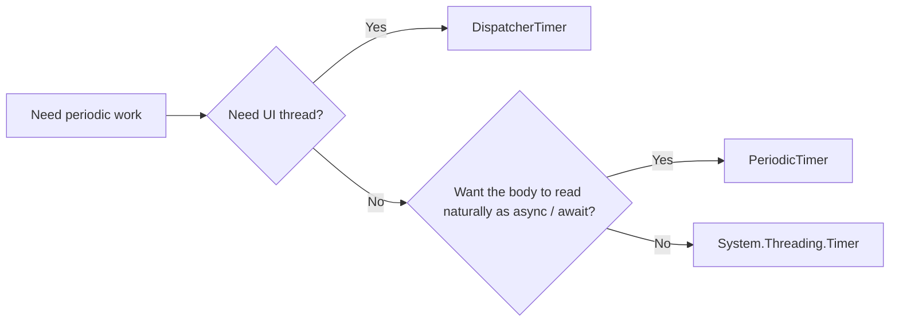

# Choosing Between PeriodicTimer, System.Threading.Timer, and DispatcherTimer - A Practical Guide to Periodic Work in .NET

These three APIs are all called "timers," but they have very different personalities:

- `PeriodicTimer` waits through `await`
- `System.Threading.Timer` invokes callbacks on the ThreadPool
- `DispatcherTimer` runs on the WPF UI `Dispatcher`

That is why they are easy to mix up in everyday .NET development.

## Contents

1. [Short version](#1-short-version)
2. [The first mental split](#2-the-first-mental-split)
3. [Typical patterns](#3-typical-patterns)
4. [Common anti-patterns](#4-common-anti-patterns)
5. [Summary](#5-summary)

---

## 1. Short version

- If you want natural `await`-based periodic work, start with **`PeriodicTimer`**
- If you want a lightweight callback running on the ThreadPool, consider **`System.Threading.Timer`**
- If you want periodic UI updates on a WPF UI thread, use **`DispatcherTimer`**
- `System.Threading.Timer` callbacks can overlap; careless async usage often becomes messy
- `DispatcherTimer` can touch the UI directly, but heavy work there can slow the whole UI
- None of these three is the main tool for high-precision timing itself

## 2. The first mental split

The important distinctions are:

1. callback-style timer vs await-style timer
2. ThreadPool execution vs UI-thread execution
3. ordinary periodic app work vs true timing-precision design

## 3. Typical patterns

### `PeriodicTimer`

Best when you want:

- periodic async I/O
- a worker service loop
- clear cancellation flow
- one consumer handling ticks sequentially

### `System.Threading.Timer`

Best when you want:

- a lightweight callback
- ThreadPool execution
- compatibility with callback-based designs

But you must assume reentrancy and overlapping callbacks.

### `DispatcherTimer`

Best when you want:

- WPF UI updates
- UI-thread-safe periodic refresh
- integration with the `Dispatcher`

But heavy work here blocks the UI.

## 4. Common anti-patterns

- passing an `async` lambda into `System.Threading.Timer` without thinking through overlap and error handling
- updating WPF UI directly from a ThreadPool timer callback
- putting heavy work into `DispatcherTimer`
- discussing timing precision and ordinary periodic application logic as if they were the same problem

## 5. Summary

Timer selection in .NET becomes much easier once you ask:

1. which thread or context should run this work?
2. do I want the body to read as a normal async flow?
3. can callbacks overlap safely?

Once those answers are clear, the choice between these timers is usually straightforward.
