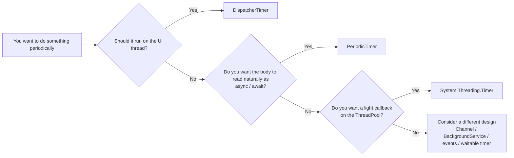

In the previous article, [A Practical Guide to Soft Real-Time on Windows - A Checklist for Reducing Latency and Jitter](https://comcomponent.com/blog/2026/03/09/000-windows-soft-realtime-practical-guide-natural/), I organized how to avoid `Sleep`-driven periodic loops and when to think in terms of event-driven design or waitable timers.

But what about ordinary .NET application development?
The confusing trio there is usually `PeriodicTimer`, `System.Threading.Timer`, and `DispatcherTimer`.

They are all called "timers," but they are very different:

- a timer that lets you wait for ticks with `await`
- a timer that fires callbacks on the ThreadPool
- a timer that runs on the UI thread's `Dispatcher`

The kinds of mistakes that show up in real projects are usually these:

- putting an `async` lambda into `System.Threading.Timer` even though the real work is asynchronous
- updating WPF UI directly from a ThreadPool timer callback
- putting heavy work into `DispatcherTimer` and slowing the whole UI
- mentally mixing this article's "ordinary periodic application work" with the previous article's "soft real-time timing precision"

This article assumes mostly ordinary C# / .NET applications on .NET 6 and later and organizes `PeriodicTimer`, `System.Threading.Timer`, and `DispatcherTimer` in a practical order.

Typical targets include:

- workers and background services
- console applications
- server-side background tasks in ASP.NET Core
- WPF desktop applications

When I say `DispatcherTimer` here, I mainly mean WPF's `System.Windows.Threading.DispatcherTimer`.
WinUI / UWP has a similar idea.
For WinForms, `System.Windows.Forms.Timer` is usually the more natural UI timer to look at.

Also, this article is about **how to write periodic work on the application side**.  
If the real subject is **timing accuracy itself**, that goes back to the previous soft real-time article.

## Contents

1. [Short version](#1-short-version)
2. [First, organize it in one page](#2-first-organize-it-in-one-page)
   - [2.1. Overall picture](#21-overall-picture)
   - [2.2. The first decision table](#22-the-first-decision-table)
3. [The distinctions to make first](#3-the-distinctions-to-make-first)
   - [3.1. Callback style vs tick-waiting style](#31-callback-style-vs-tick-waiting-style)
   - [3.2. ThreadPool execution vs UI-thread execution](#32-threadpool-execution-vs-ui-thread-execution)
   - [3.3. Periodic work and timing guarantees are different problems](#33-periodic-work-and-timing-guarantees-are-different-problems)
4. [Typical patterns](#4-typical-patterns)
   - [4.1. For async periodic work, use `PeriodicTimer`](#41-for-async-periodic-work-use-periodictimer)
   - [4.2. For light callbacks on the ThreadPool, use `System.Threading.Timer`](#42-for-light-callbacks-on-the-threadpool-use-systemthreadingtimer)
   - [4.3. For WPF UI updates, use `DispatcherTimer`](#43-for-wpf-ui-updates-use-dispatchertimer)
   - [4.4. For soft-real-time-style periodic processing, look at different tools](#44-for-soft-real-time-style-periodic-processing-look-at-different-tools)
5. [Common anti-patterns](#5-common-anti-patterns)
6. [Checklist for review](#6-checklist-for-review)
7. [Rough rule-of-thumb guide](#7-rough-rule-of-thumb-guide)
8. [Summary](#8-summary)
9. [References](#9-references)

* * *

## 1. Short version

- If you want to write fixed-interval work naturally in an `await`-based style, start with `PeriodicTimer`
- If you want to fire lightweight callbacks on the ThreadPool at regular intervals, use `System.Threading.Timer`
- If you want periodic UI updates on the WPF UI thread, use `DispatcherTimer`
- `System.Threading.Timer` callbacks can overlap; if you shove asynchronous work into it carelessly, it gets messy fast
- `DispatcherTimer` lets you touch the UI directly, but heavy work there can slow the whole UI
- In the soft-real-time sense from the previous article, none of these three should be treated as the main tool for high-precision waiting

The three questions to separate first are:

1. which thread or context should run this work?
2. do you want the body of the processing to read naturally as `async` / `await`?
3. can overlapping callbacks be tolerated?

Just separating those makes the choice much easier.

## 2. First, organize it in one page

### 2.1. Overall picture



In everyday work, this branching is usually enough.

If you want the safest first guess:

- for asynchronous periodic work, start with `PeriodicTimer`
- for UI updates, start with `DispatcherTimer`

`System.Threading.Timer` is useful, but it has more quirks around callback overlap and lifetime.
It is a little more temperamental as a "first timer."

### 2.2. The first decision table

| Situation | First choice | Where it runs | Why it fits | First caution |
| --- | --- | --- | --- | --- |
| periodic async I/O such as HTTP / DB / file work | `PeriodicTimer` | inside the current async flow | the code reads naturally with `await`, cancellation is straightforward | assume one timer / one consumer; it does not auto-parallelize lagging work |
| light heartbeat / metrics / cache-expiry checks | `System.Threading.Timer` | ThreadPool | lightweight callback model, easy to attach to existing callback-driven designs | callbacks are effectively reentrant; they can overlap; keep a reference |
| periodic WPF UI updates such as a clock or status display | `DispatcherTimer` | WPF `Dispatcher` (UI thread) | you can touch the UI directly, and priority is part of the model | no precise firing-time guarantee; heavy work blocks the UI |
| a problem where timing precision itself is the core concern | not these three as the main tool | - | the problem becomes about waiting strategy rather than app-side timer choice | go back to event / waitable timer / scheduling design |

The most important thing in this table is that **the timer name matters less than the execution context and processing model**.
When teams choose badly here, the mistake is often not about "the wrong API name," but about not looking at **where the code runs**.

## 3. The distinctions to make first

### 3.1. Callback style vs tick-waiting style

This distinction alone removes a lot of confusion.

- `System.Threading.Timer` and `DispatcherTimer` are callback / event style
- `PeriodicTimer` is tick-waiting style through `await`

So:

- callback timers mean "the timer calls you"
- `PeriodicTimer` means "you wait for the next tick"

If the real work is already asynchronous and you want to read it as:

- wait
- do work
- wait again

then `PeriodicTimer` is usually the most natural fit.

If instead:

- the design is already callback-based
- the work is short and synchronous
- you just want a periodic kick

then `System.Threading.Timer` fits more naturally.

`PeriodicTimer` is useful, but not magical.
It is not designed around multiple simultaneous consumers waiting on the same timer, and ticks that happen while you are not waiting can effectively collapse.

### 3.2. ThreadPool execution vs UI-thread execution

The next question is **where the code actually runs**.

`System.Threading.Timer` callbacks run on the ThreadPool, not on the thread that created the timer.
That makes it suitable for background work, but not for direct UI manipulation.

`DispatcherTimer`, by contrast, runs on the WPF `Dispatcher`.
That means its Tick handler can touch the UI directly.

This is a big distinction.

- a ThreadPool timer needs explicit marshaling if you want to update the UI
- `DispatcherTimer` is convenient for UI work, but it also means its work consumes UI-thread time

So `DispatcherTimer` being "safe for direct UI access" is both its strength and its risk.

### 3.3. Periodic work and timing guarantees are different problems

This is the most important connection to the previous soft-real-time article.

The phrase "do something periodically" can mean very different problems:

- "run this every few seconds as an application task"
- "run this every 1 ms with as little jitter as possible"

`System.Threading.Timer` is lightweight and practical, but it is not a specialist tool for timing accuracy.
`DispatcherTimer` is also affected by the UI queue and Dispatcher priority.
`PeriodicTimer` looks precise from its name, but its real strength is **how naturally it lets you write an async loop**, not hard timing guarantees.

So it is safer to separate:

- **application-side periodic work**
- **timing precision as a real-time problem**

If those two get mixed together, discussions about timers quickly become confused.

## 4. Typical patterns

### 4.1. For async periodic work, use `PeriodicTimer`

If you want periodic async work inside a worker, `BackgroundService`, or similar resident loop, `PeriodicTimer` is usually the easiest to read.

```csharp
using System;
using System.Threading;
using System.Threading.Tasks;
using Microsoft.Extensions.Hosting;
using Microsoft.Extensions.Logging;

public sealed class CacheRefreshWorker : BackgroundService
{
    private readonly ILogger<CacheRefreshWorker> _logger;

    public CacheRefreshWorker(ILogger<CacheRefreshWorker> logger)
    {
        _logger = logger;
    }

    protected override async Task ExecuteAsync(CancellationToken stoppingToken)
    {
        _logger.LogInformation("CacheRefreshWorker started.");

        await RefreshCacheAsync(stoppingToken);

        using var timer = new PeriodicTimer(TimeSpan.FromMinutes(5));
        try
        {
            while (await timer.WaitForNextTickAsync(stoppingToken))
            {
                await RefreshCacheAsync(stoppingToken);
            }
        }
        catch (OperationCanceledException)
        {
            _logger.LogInformation("CacheRefreshWorker stopping.");
        }
    }

    private async Task RefreshCacheAsync(CancellationToken cancellationToken)
    {
        _logger.LogInformation("Refreshing cache...");
        await Task.Delay(TimeSpan.FromSeconds(1), cancellationToken);
    }
}
```

This shape is nice because:

- the control flow is easy to follow as one async method
- `CancellationToken` is easy to pass downstream
- you avoid a lot of callback-lifetime and callback-exception noise

It is especially comfortable when the body is mostly **I/O-bound**:

- calling HTTP
- querying a database
- reading files
- awaiting other async APIs

Two cautions matter a lot:

1. assume one timer / one consumer
2. decide explicitly what to do if the work takes longer than the interval

`PeriodicTimer` does not automatically parallelize overdue work in order to "catch up."
It is a tool for writing a clear async periodic loop, not a scheduler that corrects your design for you.

If testability matters, the constructor overloads that integrate with `TimeProvider` are also quietly useful.

### 4.2. For light callbacks on the ThreadPool, use `System.Threading.Timer`

If you only want a short callback to fire periodically, `System.Threading.Timer` is straightforward.

Typical cases:

- sending a heartbeat
- capturing light metrics
- quick cache-expiry checks
- attaching a small periodic trigger to an existing callback-style design

```csharp
using System;
using System.Threading;
using System.Threading.Tasks;
using Microsoft.Extensions.Hosting;
using Microsoft.Extensions.Logging;

public sealed class HeartbeatService : IHostedService, IDisposable
{
    private readonly ILogger<HeartbeatService> _logger;
    private Timer? _timer;
    private int _running;

    public HeartbeatService(ILogger<HeartbeatService> logger)
    {
        _logger = logger;
    }

    public Task StartAsync(CancellationToken cancellationToken)
    {
        _timer = new Timer(OnTimer, null, TimeSpan.Zero, TimeSpan.FromSeconds(5));
        return Task.CompletedTask;
    }

    private void OnTimer(object? state)
    {
        if (Interlocked.Exchange(ref _running, 1) != 0)
        {
            return;
        }

        try
        {
            _logger.LogInformation("Heartbeat: {Now}", DateTimeOffset.Now);
        }
        finally
        {
            Volatile.Write(ref _running, 0);
        }
    }

    public Task StopAsync(CancellationToken cancellationToken)
    {
        _timer?.Change(Timeout.InfiniteTimeSpan, Timeout.InfiniteTimeSpan);
        return Task.CompletedTask;
    }

    public void Dispose()
    {
        _timer?.Dispose();
    }
}
```

The reason the example uses `Interlocked.Exchange` is important:
`System.Threading.Timer` does **not** wait for the previous callback to finish.

So:

- callbacks run on the ThreadPool
- overlap is possible
- if the work is longer than the interval, callbacks can pile up

If the work is not trivial, it is often better to:

- skip duplicate triggers
- queue work elsewhere
- or switch to `PeriodicTimer`

Another practical point is **keeping a reference**.
Even while active, a `System.Threading.Timer` can become collectible if you lose all references to it.
Also, after calling `Dispose()`, a callback that was already queued may still run later.

So `System.Threading.Timer` is:

- lightweight
- fast
- simple

but only if you are willing to own callback behavior properly.

### 4.3. For WPF UI updates, use `DispatcherTimer`

If you want to update a clock or a light status display on a WPF screen, `DispatcherTimer` is the natural choice.

```csharp
using System;
using System.Windows;
using System.Windows.Threading;

public partial class MainWindow : Window
{
    private readonly DispatcherTimer _clockTimer;

    public MainWindow()
    {
        InitializeComponent();

        _clockTimer = new DispatcherTimer(DispatcherPriority.Background)
        {
            Interval = TimeSpan.FromSeconds(1)
        };
        _clockTimer.Tick += ClockTimer_Tick;
        _clockTimer.Start();
    }

    private void ClockTimer_Tick(object? sender, EventArgs e)
    {
        ClockText.Text = DateTime.Now.ToString("HH:mm:ss");
    }

    protected override void OnClosed(EventArgs e)
    {
        _clockTimer.Stop();
        _clockTimer.Tick -= ClockTimer_Tick;
        base.OnClosed(e);
    }
}
```

The good part is that Tick runs on the WPF `Dispatcher`, so UI updates are direct.

That fits scenarios like:

- a clock
- light connection-status display
- command re-evaluation triggers
- periodically refreshing values already on screen

But the tradeoff changes with it:

because `DispatcherTimer` runs on the UI thread, any heavy work in Tick directly competes with input, layout, and rendering.

Also, `DispatcherTimer` is not a "fire exactly at the requested time" tool.
It is affected by the `Dispatcher` queue and priority.

So in practice:

- keep Tick handlers light
- move heavy I/O or CPU work elsewhere
- explicitly stop the timer and unsubscribe on shutdown

### 4.4. For soft-real-time-style periodic processing, look at different tools

This is the connection back to the previous article.

That article was not about "roughly every few seconds is good enough."
It was about **how to reduce jitter and missed deadlines**.

In that context, the important topics are things like:

- avoiding `Sleep`-based relative waiting
- using event-driven or waitable timer style waiting
- separating fast path and slow path
- measuring lateness explicitly

So it is cleaner to separate the problem space like this:

- ordinary application-side async periodic work  
  → `PeriodicTimer`
- lightweight ThreadPool callbacks  
  → `System.Threading.Timer`
- UI updates  
  → `DispatcherTimer`
- timing precision itself as the main problem  
  → go back to the soft-real-time discussion

As soon as the question becomes:

> "Which .NET timer should I use if I want to run every 1 ms as precisely as possible?"

you are already no longer really choosing among app-side timers.
You are designing waiting strategy and system behavior.

## 5. Common anti-patterns

### 5.1. Passing an `async` lambda directly into `System.Threading.Timer`

This is very tempting:

```csharp
_timer = new Timer(async _ => await RefreshAsync(), null,
    TimeSpan.Zero, TimeSpan.FromSeconds(5));
```

It looks neat, but `TimerCallback` is `void`.
That means the `async` lambda is effectively in `async void` territory.

Then:

- the caller cannot await it
- completion cannot be coordinated cleanly
- exception handling becomes harder
- callback overlap is still a separate problem

If the body is really asynchronous, `PeriodicTimer` is often the first thing to consider instead.

### 5.2. Putting heavy work into `DispatcherTimer.Tick`

Because `DispatcherTimer` can touch the UI directly, it is easy to keep adding work into Tick.
But that is the UI thread.

Heavy synchronous work, blocking I/O, or overlap-prone async logic there can directly harm input and rendering.

### 5.3. Assuming `PeriodicTimer` automatically catches up when lagging

This is another common misunderstanding.

`PeriodicTimer` is excellent for expressing a periodic async loop, but it does **not** automatically parallelize overdue work or guarantee that every missed interval is individually replayed.

So you still need to decide:

- should late iterations be skipped?
- is only the latest state important?
- do you really need to process every single tick?

### 5.4. Postponing stop and lifetime management

Timers are often easier to start than to stop cleanly.

Typical mistakes include:

- creating `System.Threading.Timer` without retaining a reference
- disposing a timer without understanding that already-queued callbacks may still run
- forgetting to call `Stop()` or unsubscribe from `DispatcherTimer`

## 6. Checklist for review

When reviewing periodic processing, check these in order:

- Is the real problem UI updates, async periodic work, or callback-style triggering?
- Does the chosen timer match the execution context?
- Can callbacks overlap, and if not, where is that prevented?
- Is lifetime explicit and shutdown clean?
- Is the code accidentally using an app-side timer for a timing-precision problem?

## 7. Rough rule-of-thumb guide

| What you want to do | First thing to choose |
|---|---|
| write natural async periodic work | `PeriodicTimer` |
| fire light periodic callbacks on the ThreadPool | `System.Threading.Timer` |
| update WPF UI periodically | `DispatcherTimer` |
| control an ordered background queue | `Channel<T>` + worker |
| chase timing precision itself | event-driven design / waitable timer / scheduler design |

## 8. Summary

Choosing among `PeriodicTimer`, `System.Threading.Timer`, and `DispatcherTimer` becomes much easier once you ask:

1. where should this work run?
2. do I want the body to read as a normal async flow?
3. can callback overlap be tolerated?

Once those answers are clear, the timer choice itself is usually straightforward.

## 9. References

* [PeriodicTimer](https://learn.microsoft.com/en-us/dotnet/api/system.threading.periodictimer)
* [System.Threading.Timer](https://learn.microsoft.com/en-us/dotnet/api/system.threading.timer)
* [DispatcherTimer](https://learn.microsoft.com/en-us/dotnet/api/system.windows.threading.dispatchertimer)
