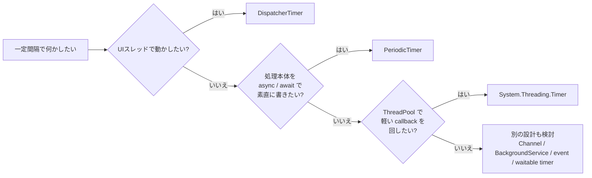

前回の [普通のWindowsでソフトリアルタイムをできるだけ実現するための実践ガイド - まず見るチェックリスト](https://comcomponent.com/blog/2026/03/09/000-windows-soft-realtime-practical-guide-natural/) では、`Sleep` 任せの周期ループを避け、イベント駆動や waitable timer を使う話を整理しました。

では、もっと普段の .NET アプリ開発ではどうするのか。  
ここで迷いやすいのが、`PeriodicTimer`、`System.Threading.Timer`、`DispatcherTimer` です。

名前はどれもタイマーですが、

- `await` でティックを待つタイマー
- ThreadPool で callback が飛んでくるタイマー
- UI スレッドの `Dispatcher` 上で動くタイマー

というように、性格がかなり違います。

実務で混ざりやすいのは、だいたいこのへんです。

- 非同期の定期処理なのに `System.Threading.Timer` に `async` ラムダを渡してしまう
- WPF の UI 更新なのに ThreadPool タイマーから直接画面を触ってしまう
- `DispatcherTimer` に重い処理を入れて、画面ごと鈍らせる
- 前回の「ソフトリアルタイム」の話と、普段のアプリの定期実行が頭の中で混ざる

この記事では、主に .NET 6 以降の一般的な C# / .NET アプリを前提に、  
`PeriodicTimer` / `System.Threading.Timer` / `DispatcherTimer` を、普段の実務で迷いにくい順番で整理します。

対象は、たとえば次のようなものです。

- worker / バックグラウンドサービス
- コンソールアプリ
- ASP.NET Core の裏方処理
- WPF のデスクトップアプリ

この記事でいう `DispatcherTimer` は、主に WPF の `System.Windows.Threading.DispatcherTimer` を指します。  
WinUI / UWP にも同じ考え方の `DispatcherTimer` があります。  
WinForms なら、UI 用タイマーとしては `System.Windows.Forms.Timer` を見るほうが自然です。

なお、ここで扱うのは **アプリ側の定期実行をどう書くか** です。  
**周期の正確さそのものが主題** のときは、前回のソフトリアルタイム記事の話に戻ります。

## 目次

1. まず結論（ひとことで）
2. まず一枚で整理
   - 2.1. 全体像
   - 2.2. まずの判断表
3. まず区別したいこと
   - 3.1. callback 型か、tick を待つ型か
   - 3.2. ThreadPool で動くのか、UI スレッドで動くのか
   - 3.3. 周期処理と精度保証は別の話
4. 典型パターン
   - 4.1. async な定期処理なら、`PeriodicTimer`
   - 4.2. 軽い callback を ThreadPool で回すなら、`System.Threading.Timer`
   - 4.3. WPF の UI 更新なら、`DispatcherTimer`
   - 4.4. ソフトリアルタイム寄りの周期処理なら、別の道具を見る
5. よくあるアンチパターン
6. レビュー時のチェックリスト
7. ざっくり使い分け
8. まとめ
9. 参考資料

* * *

## 1. まず結論（ひとことで）

- `await` ベースで一定間隔の処理を自然に書きたいなら、まず `PeriodicTimer`
- ThreadPool 上で軽い callback を定期的に起動したいなら、`System.Threading.Timer`
- WPF の UI スレッドで画面更新したいなら、`DispatcherTimer`
- `System.Threading.Timer` は callback が重なりうる。非同期処理を雑に突っ込むと荒れやすい
- `DispatcherTimer` は UI を直接触れる代わりに、重い処理を入れると UI ごと止めやすい
- 前回のソフトリアルタイムの文脈では、この 3 つは高精度待機の主役ではない

要するに、最初に見るべきなのは次の 3 つです。

1. どのスレッド / コンテキストで動かしたいか
2. 処理本体を `async` / `await` で直列に書きたいか
3. callback の重なりを許せるか

この 3 つを分けるだけで、かなり迷いにくくなります。

## 2. まず一枚で整理

### 2.1. 全体像



実務では、だいたいこの分岐で十分です。

迷ったときにいちばん外しにくいのは、  
**非同期処理なら `PeriodicTimer`、UI 更新なら `DispatcherTimer`** と先に切ることです。

`System.Threading.Timer` は便利ですが、callback の重なりや寿命管理の癖があるので、  
最初の 1 本目としては少し気難しいです。

### 2.2. まずの判断表

| 状況 | まずの選択 | 実行される場所 | 向いている理由 | まずの注意点 |
| --- | --- | --- | --- | --- |
| 一定間隔で HTTP / DB / ファイル I/O などの async 処理を回したい | `PeriodicTimer` | 今の async メソッドの流れの中 | `await` ベースで書けて、停止とキャンセルが素直 | 1 タイマー 1 コンシューマー前提。遅れは勝手に並列化されない |
| 軽い heartbeat / メトリクス送信 / キャッシュの期限切れチェックを ThreadPool で回したい | `System.Threading.Timer` | ThreadPool | 軽量で callback 型。既存の callback ベース設計に載せやすい | callback は再入可能前提。重なりうる。参照を保持する |
| WPF の時計表示や軽い UI 更新を一定間隔で回したい | `DispatcherTimer` | WPF の `Dispatcher`（UI スレッド） | UI をそのまま触れる。優先度を持てる | 正確な発火時刻は保証されない。重い処理で UI が詰まる |
| 周期の正確さが本体で、`Sleep` 任せを避けたい | この 3 つを主役にしない | - | 目的がアプリの定期実行ではなく、待機精度の設計になる | event / waitable timer 側を見る |

この表で大事なのは、**タイマー名より、実行場所と書き方を見る** ことです。  
タイマー選びで事故るときは、API 名称より「どこで走るか」を見ていないことのほうが多いです。

## 3. まず区別したいこと

### 3.1. callback 型か、tick を待つ型か

ここを分けると、かなり整理しやすくなります。

- `System.Threading.Timer` と `DispatcherTimer` は callback / event 型
- `PeriodicTimer` は tick を `await` して待つ型

つまり、

- callback 型は「タイマー側が呼んでくる」
- `PeriodicTimer` は「こちらが次の tick を待つ」

という違いです。

処理本体が `async` で、  
「待つ → 処理する → また待つ」を 1 本の流れとして読みたいなら、`PeriodicTimer` のほうが自然です。

逆に、

- 既存の callback ベース設計に載せたい
- 処理本体が短くて同期的
- 単純に定期キックしたい

という場面では、`System.Threading.Timer` が合います。

`PeriodicTimer` は便利ですが、万能ではありません。  
1 つのタイマーに対して同時に複数の `WaitForNextTickAsync` を飛ばす前提ではなく、  
待っていない間に複数回 tick しても、それは 1 回に畳まれます。

ここを「勝手に追いついてくれる」と誤解しないのが大事です。

### 3.2. ThreadPool で動くのか、UI スレッドで動くのか

次に見るべきなのは、**どこで実行されるか** です。

`System.Threading.Timer` の callback は、作成したスレッドではなく ThreadPool で動きます。  
なので、バックグラウンド処理には向きますが、UI を直接触る前提ではありません。

一方で `DispatcherTimer` は、`Dispatcher` キューに統合された UI 用タイマーです。  
WPF では、同じ `Dispatcher` 上で動くので、Tick ハンドラの中で UI をそのまま更新できます。

この違いはかなり大きいです。

- ThreadPool タイマーから UI を触るには、明示的に UI へ戻す必要がある
- `DispatcherTimer` は UI を触りやすいが、その分 UI スレッドの時間を使う

つまり、`DispatcherTimer` は「UI を安全に触れる」ことが強みですが、  
それは同時に「重い処理を入れると入力や再描画も巻き込む」という意味でもあります。

### 3.3. 周期処理と精度保証は別の話

ここは前回の記事とのつながりとして大事です。

一定間隔で何かする、という言い方は同じでも、

- アプリの都合として、数秒おきに定期処理したい
- 1ms〜数ms 級で、できるだけ deadline に近づけたい

は、別の問題です。

`System.Threading.Timer` は軽量で扱いやすいタイマーですが、  
精度のための専用道具ではありません。  
`DispatcherTimer` も、`Dispatcher` キューの都合や優先度の影響を受けます。

`PeriodicTimer` も名前だけ見ると「周期がきっちりしていそう」に見えますが、  
実務での強みは precision というより **async フローの書きやすさ** です。

なので、

- **アプリの定期実行** を書きたいのか
- **待機精度** を詰めたいのか

は、最初に分けたほうが安全です。

この 2 つが混ざると、タイマー選びの議論がだんだん変な方向へ行きます。

## 4. 典型パターン

### 4.1. async な定期処理なら、`PeriodicTimer`

worker や `BackgroundService`、コンソールの常駐処理などで、  
一定間隔で async な処理を回したいなら、まず `PeriodicTimer` が書きやすいです。

```csharp
using System;
using System.Threading;
using System.Threading.Tasks;
using Microsoft.Extensions.Hosting;
using Microsoft.Extensions.Logging;

public sealed class CacheRefreshWorker : BackgroundService
{
    private readonly ILogger<CacheRefreshWorker> _logger;

    public CacheRefreshWorker(ILogger<CacheRefreshWorker> logger)
    {
        _logger = logger;
    }

    protected override async Task ExecuteAsync(CancellationToken stoppingToken)
    {
        _logger.LogInformation("CacheRefreshWorker started.");

        await RefreshCacheAsync(stoppingToken);

        using var timer = new PeriodicTimer(TimeSpan.FromMinutes(5));
        try
        {
            while (await timer.WaitForNextTickAsync(stoppingToken))
            {
                await RefreshCacheAsync(stoppingToken);
            }
        }
        catch (OperationCanceledException)
        {
            _logger.LogInformation("CacheRefreshWorker stopping.");
        }
    }

    private async Task RefreshCacheAsync(CancellationToken cancellationToken)
    {
        _logger.LogInformation("Refreshing cache...");
        await Task.Delay(TimeSpan.FromSeconds(1), cancellationToken);
    }
}
```

この形がよいのは、次の点です。

- コードの流れが 1 本の `async` メソッドとして追いやすい
- `CancellationToken` をそのまま下流へ渡しやすい
- callback ベースの寿命管理や例外管理を減らせる

特に、処理本体が

- HTTP を呼ぶ
- DB に問い合わせる
- ファイルを読む
- 他の async API を await する

のような **I/O 待ち中心** なら、かなり相性がよいです。

注意点は 2 つです。

1. 1 タイマー 1 コンシューマー前提で使う
2. 処理時間が周期より長いときの方針を、自分で決める

`PeriodicTimer` は、前の処理が長引いたからといって、自動で並列化して追いついてくれるわけではありません。  
その意味では、「一定間隔の async ループを自然に書く」ためのタイマーです。

テストしやすさまで見るなら、`TimeProvider` を受けるコンストラクターを使えるのも地味に便利です。

### 4.2. 軽い callback を ThreadPool で回すなら、`System.Threading.Timer`

定期的に短い callback を呼びたいだけなら、`System.Threading.Timer` は素直です。

たとえば、

- heartbeat を打つ
- 軽いメトリクスを採る
- 短い期限切れチェックを入れる
- 既存の callback ベース設計にぶら下げる

といった場面です。

```csharp
using System;
using System.Threading;
using System.Threading.Tasks;
using Microsoft.Extensions.Hosting;
using Microsoft.Extensions.Logging;

public sealed class HeartbeatService : IHostedService, IDisposable
{
    private readonly ILogger<HeartbeatService> _logger;
    private Timer? _timer;
    private int _running;

    public HeartbeatService(ILogger<HeartbeatService> logger)
    {
        _logger = logger;
    }

    public Task StartAsync(CancellationToken cancellationToken)
    {
        _timer = new Timer(OnTimer, null, TimeSpan.Zero, TimeSpan.FromSeconds(5));
        return Task.CompletedTask;
    }

    private void OnTimer(object? state)
    {
        if (Interlocked.Exchange(ref _running, 1) != 0)
        {
            return;
        }

        try
        {
            _logger.LogInformation("Heartbeat: {Now}", DateTimeOffset.Now);
        }
        finally
        {
            Volatile.Write(ref _running, 0);
        }
    }

    public Task StopAsync(CancellationToken cancellationToken)
    {
        _timer?.Change(Timeout.InfiniteTimeSpan, Timeout.InfiniteTimeSpan);
        return Task.CompletedTask;
    }

    public void Dispose()
    {
        _timer?.Dispose();
    }
}
```

この例で `Interlocked.Exchange` を入れているのは、  
`System.Threading.Timer` が **前回の callback 完了を待たない** からです。

ここはかなり大事です。

- callback は ThreadPool で動く
- callback は再入可能前提
- 間隔より処理が長ければ、重なりうる

なので、処理が軽くない場合は、

- 重複起動をスキップする
- キューへ積む
- `PeriodicTimer` に寄せる

のように設計したほうが穏やかです。

もう 1 つ地味に大事なのは、**参照を保持すること** です。  
`System.Threading.Timer` は動作中でも、参照がなくなると GC の対象になります。  
また、`Dispose()` を呼んだ直後でも、すでにキューされた callback が後から走ることがあります。

つまり `System.Threading.Timer` は、

- 軽量
- 速い
- シンプル

ですが、その代わりに callback の都合をこちらがきちんと受け持つタイマーです。

### 4.3. WPF の UI 更新なら、`DispatcherTimer`

WPF で画面上の時計や軽い状態表示を定期更新したいなら、`DispatcherTimer` が自然です。

```csharp
using System;
using System.Windows;
using System.Windows.Threading;

public partial class MainWindow : Window
{
    private readonly DispatcherTimer _clockTimer;

    public MainWindow()
    {
        InitializeComponent();

        _clockTimer = new DispatcherTimer(DispatcherPriority.Background)
        {
            Interval = TimeSpan.FromSeconds(1)
        };
        _clockTimer.Tick += ClockTimer_Tick;
        _clockTimer.Start();
    }

    private void ClockTimer_Tick(object? sender, EventArgs e)
    {
        ClockText.Text = DateTime.Now.ToString("HH:mm:ss");
    }

    protected override void OnClosed(EventArgs e)
    {
        _clockTimer.Stop();
        _clockTimer.Tick -= ClockTimer_Tick;
        base.OnClosed(e);
    }
}
```

`DispatcherTimer` のよいところは、Tick が WPF の `Dispatcher` 上で処理されることです。  
なので、UI をそのまま触れます。

これはたとえば、

- 時計表示
- 接続状態の軽い表示更新
- Command の再評価きっかけ
- 画面に出ている数値の軽い更新

のような場面と相性がよいです。

ただし、ここでも空気が変わる点があります。

`DispatcherTimer` は **UI スレッドで動く** ので、  
Tick ハンドラで重い処理をすると、そのまま入力・描画・再配置まで巻き込んで遅くなります。

また、`DispatcherTimer` は「指定時刻ぴったり」を保証する道具ではありません。  
`Dispatcher` キュー上の他の仕事や優先度の影響を受けます。

なので実務では、

- Tick の中身は軽くする
- 重い I/O や CPU は別へ逃がす
- 閉じるときは `Stop()` と購読解除をして寿命を明示する

くらいまで意識しておくと安定します。

### 4.4. ソフトリアルタイム寄りの周期処理なら、別の道具を見る

ここが前回の記事との接続点です。

前回のソフトリアルタイム記事で扱ったのは、  
「何秒おきにだいたい動けばよい」ではなく、  
**周期の揺れや deadline miss をどう減らすか** という話でした。

その文脈では、

- `Sleep` 任せの相対待機にしない
- イベント駆動や waitable timer を使う
- fast path と slow path を分ける
- 遅れを計測する

が主題になります。

なので、

- 普段のアプリの async な定期処理  
  → `PeriodicTimer`
- ThreadPool callback  
  → `System.Threading.Timer`
- UI 更新  
  → `DispatcherTimer`
- 周期精度そのものが主役  
  → 前回の記事の世界

というふうに、最初から問題を分けてしまうのがきれいです。

「1ms ごとにできるだけきっちり回したい。どの .NET タイマーがよいか」という問いは、  
半分くらいはもうタイマー選びではなく、待機方法と設計の問題です。

## 5. よくあるアンチパターン

### 5.1. `System.Threading.Timer` に `async` ラムダをそのまま渡す

これはかなりやりがちです。

```csharp
_timer = new Timer(async _ => await RefreshAsync(), null,
    TimeSpan.Zero, TimeSpan.FromSeconds(5));
```

見た目はすっきりしていますが、`TimerCallback` は `void` です。  
つまりこの `async` ラムダは、実質 `async void` 的な扱いになります。

すると、

- 呼び出し側が await できない
- 完了を待てない
- 例外管理が難しい
- callback の重なりも別途考える必要がある

という、わりとぬかるみな状態になります。

処理本体が async なら、まず `PeriodicTimer` を検討したほうが読みやすいです。

### 5.2. `DispatcherTimer` の Tick に重い処理を入れる

`DispatcherTimer` は UI をそのまま触れるので、つい何でも書きたくなります。  
でも、そこは UI スレッドです。

- 長い同期処理
- 重い CPU 計算
- ブロッキング I/O
- 長い `await` を含む二重起動しうる処理

を入れると、UI の入力や描画と正面衝突します。

Tick の中身は軽くして、  
重い仕事は背景に逃がし、必要な結果だけ UI に戻すほうが安定します。

### 5.3. `PeriodicTimer` なら遅れを自動で取り戻してくれると思う

ここも誤解しやすいです。

`PeriodicTimer` は、一定間隔の async ループをきれいに書く道具としては優秀ですが、  
前の処理が長引いたときに、勝手に並列実行して追いついてくれるわけではありません。

待っていない間の tick が 1 回に畳まれることもあるので、

- 遅れたらスキップするのか
- 最新だけ見ればよいのか
- 必ず全回数ぶん処理したいのか

は、設計で決める必要があります。

### 5.4. 停止と寿命管理を後回しにする

タイマーは、動かすより止めるほうが事故ります。

見落としやすいのは、たとえば次です。

- `System.Threading.Timer` をローカル変数のまま作って参照を保持しない
- `System.Threading.Timer` を止めずに `Dispose()` まわりを曖昧にする
- `DispatcherTimer` を `Stop()` せず、Tick 購読も外さない
- 画面を閉じたあとも、タイマーがオブジェクト寿命を引っ張る

特に `DispatcherTimer` は、メソッドがバインドされているオブジェクトを生かし続けることがあります。  
「なんかこの Window、閉じたはずなのに残ってるな」という妙な感じが出たら、ここを疑いたくなります。

## 6. レビュー時のチェックリスト

- その周期処理は、UI 更新 / ThreadPool callback / async ループ のどれとして書くべきか説明できるか
- 処理本体が async なのに、callback 型タイマーへ無理に押し込んでいないか
- `System.Threading.Timer` を使うなら、callback の重なりに耐えられるか、またはガードしているか
- `DispatcherTimer` の Tick に重い処理、ブロッキング I/O、長い同期処理を入れていないか
- `PeriodicTimer` を使うなら、遅れたときの方針が決まっているか
- 停止方法 (`Change` / `Dispose` / `Stop`) と、アプリ終了時の流れが明確か
- `System.Threading.Timer` の参照をちゃんと保持しているか
- `DispatcherTimer` の購読解除や画面クローズ時の後始末があるか
- その問題が「アプリの定期実行」なのか「待機精度」なのか、最初に分けられているか

## 7. ざっくり使い分け

実務での目安としては、だいたい次です。

- 30 秒おきに API を叩いて設定を更新したい  
  → `PeriodicTimer`

- 5 秒おきに heartbeat や軽いメトリクスを送りたい  
  → `System.Threading.Timer`

- WPF で時計表示や軽いステータス更新をしたい  
  → `DispatcherTimer`

- Tick のたびに UI を直接触りたい  
  → `DispatcherTimer`

- 定期処理の本体が `await` だらけで、停止や例外も自然に扱いたい  
  → `PeriodicTimer`

- callback ベースの小さなキックを低コストで入れたい  
  → `System.Threading.Timer`

- 1〜5ms 級の周期精度や揺れの管理が本体  
  → この 3 つの前に、前回の記事の待機方法を見る

かなり乱暴に 1 行で言うと、

- `PeriodicTimer` は async のためのタイマー
- `System.Threading.Timer` は ThreadPool callback のためのタイマー
- `DispatcherTimer` は UI のためのタイマー

です。

この覚え方だと、大きく外しにくいです。

## 8. まとめ

.NET のタイマー選びで本当に大事なのは、名前の違いより次です。

1. どこで動くか
2. どういう流れで書きたいか
3. 重なりや遅れをどう扱うか

まずの方針としては、次でかなり戦えます。

1. async な定期処理なら `PeriodicTimer`
2. 軽い callback を ThreadPool で回すなら `System.Threading.Timer`
3. WPF の UI 更新なら `DispatcherTimer`
4. 精度が主役なら、別の待機方法を見る

タイマーは、名前が似ているので混ざります。  
でも、役割はそんなに似ていません。

- `PeriodicTimer` は async フローを整える道具
- `System.Threading.Timer` は callback を定期キックする道具
- `DispatcherTimer` は UI スレッドで定期更新する道具

この 3 つを分けて考えるだけで、コードはかなり静かになります。

逆にここが混ざると、

- async のはずが `async void` っぽくなる
- UI を直接触って落ちる
- callback が重なって状態が濁る
- 周期精度の話まで一緒くたになる

という、わりと普通に面倒なことが起きます。

まずは「どこで動かしたいか」から見る。  
それだけで、タイマー選びはだいぶ穏やかになります。

## 9. 参考資料

- [関連記事: 普通のWindowsでソフトリアルタイムをできるだけ実現するための実践ガイド - まず見るチェックリスト](https://comcomponent.com/blog/2026/03/09/000-windows-soft-realtime-practical-guide-natural/)
- [関連記事: C# における async/await のベストプラクティス - まず見る判断表](https://comcomponent.com/blog/2026/03/09/001-csharp-async-await-best-practices/)
- [関連記事: WPF / WinForms の async/await と UI スレッドを一枚で整理 - await 後の戻り先、Dispatcher、ConfigureAwait、.Result / .Wait() の詰まりどころ](https://comcomponent.com/blog/2026/03/12/000-wpf-winforms-ui-thread-async-await-one-sheet/)
- [Timers - .NET](https://learn.microsoft.com/ja-jp/dotnet/standard/threading/timers)
- [PeriodicTimer Class](https://learn.microsoft.com/ja-jp/dotnet/api/system.threading.periodictimer?view=net-10.0)
- [PeriodicTimer.WaitForNextTickAsync(CancellationToken) Method](https://learn.microsoft.com/en-us/dotnet/api/system.threading.periodictimer.waitfornexttickasync?view=net-10.0)
- [PeriodicTimer.Dispose Method](https://learn.microsoft.com/ja-jp/dotnet/api/system.threading.periodictimer.dispose?view=net-9.0)
- [PeriodicTimer Constructor](https://learn.microsoft.com/en-us/dotnet/api/system.threading.periodictimer.-ctor?view=net-10.0)
- [Timer Class (System.Threading)](https://learn.microsoft.com/en-us/dotnet/api/system.threading.timer?view=net-10.0)
- [Timer Constructor (System.Threading)](https://learn.microsoft.com/en-us/dotnet/api/system.threading.timer.-ctor?view=net-10.0)
- [Background tasks with hosted services in ASP.NET Core](https://learn.microsoft.com/en-us/aspnet/core/fundamentals/host/hosted-services?view=aspnetcore-10.0)
- [DispatcherTimer Class (System.Windows.Threading)](https://learn.microsoft.com/ja-jp/dotnet/api/system.windows.threading.dispatchertimer?view=windowsdesktop-10.0)
- [DispatcherTimer Class (Microsoft.UI.Xaml)](https://learn.microsoft.com/en-us/windows/windows-app-sdk/api/winrt/microsoft.ui.xaml.dispatchertimer?view=windows-app-sdk-1.8)
