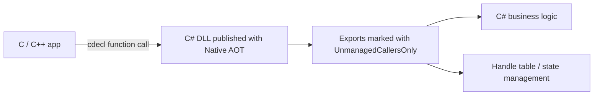

# How to Turn C# into a Native DLL with Native AOT - Calling UnmanagedCallersOnly Exports from C/C++

In the previous article, [Why a C++/CLI Wrapper Is Often the Best Way to Use a Native DLL from C#](/en/blog/2026/03/07/000-cpp-cli-wrapper-for-native-dlls/), the focus was calling C++ from C#.
This time the direction is reversed: calling C# from C or C++.

There are cases where you want to call logic written in C# from an existing C/C++ application, but P/Invoke points in the other direction and introducing C++/CLI or COM would feel too heavy.
This is especially true when you want to keep the native application itself as-is while moving only parts such as decision logic, string handling, configuration interpretation, or calculation rules into C#.

COM can also bridge that gap, but this article focuses on something more in-process and more DLL-like.
With .NET Native AOT, you can publish a class library as a native shared library and expose methods marked with `UnmanagedCallersOnly` as C entry points.
In other words, you can use C# as **a native DLL that is called from the outside**.

That does not mean everything crosses the boundary cleanly.
If you let `string`, `List<T>`, exceptions, or ownership leak across the boundary, the design turns bad very quickly.
So this article uses a minimal Windows + C++ example and organizes when this approach fits, and what kind of API shape stays robust.

## Contents

1. [Short version](#1-short-version)
2. [Quick comparison](#2-quick-comparison)
3. [Structure diagram](#3-structure-diagram)
4. [Minimal configuration](#4-minimal-configuration)
   * 4.1. [C# project](#41-c-project)
   * 4.2. [Exported C# code](#42-exported-c-code)
   * 4.3. [Publish command](#43-publish-command)
   * 4.4. [C++ calling example](#44-c-calling-example)
5. [API shapes that are hard to break](#5-api-shapes-that-are-hard-to-break)
   * 5.1. [Stay close to a C ABI](#51-stay-close-to-a-c-abi)
   * 5.2. [Handle strings as pointer + length + buffer size](#52-handle-strings-as-pointer--length--buffer-size)
   * 5.3. [Do not let exceptions cross the boundary](#53-do-not-let-exceptions-cross-the-boundary)
   * 5.4. [Fix the calling convention](#54-fix-the-calling-convention)
   * 5.5. [Keep export methods thin and place the real logic elsewhere](#55-keep-export-methods-thin-and-place-the-real-logic-elsewhere)
6. [Cases where this fits well](#6-cases-where-this-fits-well)
7. [Cases where it still does not fit](#7-cases-where-it-still-does-not-fit)
8. [Common traps](#8-common-traps)
9. [Summary](#9-summary)
10. [References](#10-references)

* * *

## 1. Short version

* If you want C/C++ to call C# logic **in-process**, Native AOT + `UnmanagedCallersOnly` is a very strong option
* But what gets exported is still only **a C-style function boundary**, not a .NET object model
* In practice, it is more stable to flatten the surface into a C API like `create` / `destroy` / `operate` and make lifetime and error codes explicit
* If you want to handle C++ classes and STL naturally, C++/CLI fits better; if you need registration, automation, or cross-process behavior, COM often fits better

In short, **you can use C# as the inside of a native DLL, but the boundary must be designed as a C ABI rather than as .NET**.

## 2. Quick comparison

| What you want to do | Strong candidate | Why |
| --- | --- | --- |
| call C functions from C# | P/Invoke | the direction is natural |
| use a C++ library naturally from C# | C++/CLI | easier to absorb C++ types, ownership, exceptions, and `std::wstring` |
| cross 32-bit / 64-bit or process boundaries | COM / IPC | an in-process DLL alone cannot solve that |
| call C# logic as a native DLL from C/C++ | Native AOT + `UnmanagedCallersOnly` | you can export your own C entry points |

This approach is especially attractive when **the native side is the main program and C# is a reusable component**.

## 3. Structure diagram



The important point is to **align the boundary with C functions**.
The C# internals can use classes, collections, and LINQ freely, but the external surface should be flat.

## 4. Minimal configuration

Here the example is a simple accumulator.
The native side creates an accumulator, adds values to it, and then retrieves the total.
The core idea is simply that **the native side holds a handle and calls operation functions in order**.

### 4.1. C# project

```xml
<!-- NativeAotSample.csproj -->
<Project Sdk="Microsoft.NET.Sdk">
  <PropertyGroup>
    <TargetFramework>net8.0</TargetFramework>
    <Nullable>enable</Nullable>
    <ImplicitUsings>enable</ImplicitUsings>
    <PublishAot>true</PublishAot>
    <AllowUnsafeBlocks>true</AllowUnsafeBlocks>
  </PropertyGroup>
</Project>
```

Important points:

* enable Native AOT publishing
* allow `unsafe` because pointer arguments are used

### 4.2. Exported C# code

Methods marked with `UnmanagedCallersOnly` become the entry points visible from native code.
In this sample, a handle is issued as an integer-like value, and the real state lives in a C# dictionary.

```csharp
// NativeExports.cs
using System.Collections.Generic;
using System.Runtime.CompilerServices;
using System.Runtime.InteropServices;

namespace KomuraSoft.NativeAotSample;

internal static class NativeStatus
{
    public const int Ok = 0;
    public const int InvalidArgument = -1;
    public const int InvalidHandle = -2;
    public const int UnexpectedError = -3;
}

internal sealed class Accumulator
{
    public long Total { get; private set; }

    public void Add(int value)
    {
        Total += value;
    }
}

internal static class AccumulatorStore
{
    private static readonly object s_gate = new();
    private static readonly Dictionary<nint, Accumulator> s_instances = new();
    private static long s_nextHandle = 0;

    public static int Create(out nint handle)
    {
        try
        {
            var instance = new Accumulator();
            handle = (nint)System.Threading.Interlocked.Increment(ref s_nextHandle);

            lock (s_gate)
            {
                s_instances.Add(handle, instance);
            }

            return NativeStatus.Ok;
        }
        catch
        {
            handle = 0;
            return NativeStatus.UnexpectedError;
        }
    }

    public static int Add(nint handle, int value)
    {
        try
        {
            lock (s_gate)
            {
                if (!s_instances.TryGetValue(handle, out var instance))
                {
                    return NativeStatus.InvalidHandle;
                }

                instance.Add(value);
                return NativeStatus.Ok;
            }
        }
        catch
        {
            return NativeStatus.UnexpectedError;
        }
    }

    public static int GetTotal(nint handle, out long total)
    {
        try
        {
            lock (s_gate)
            {
                if (!s_instances.TryGetValue(handle, out var instance))
                {
                    total = 0;
                    return NativeStatus.InvalidHandle;
                }

                total = instance.Total;
                return NativeStatus.Ok;
            }
        }
        catch
        {
            total = 0;
            return NativeStatus.UnexpectedError;
        }
    }

    public static int Destroy(nint handle)
    {
        try
        {
            lock (s_gate)
            {
                return s_instances.Remove(handle)
                    ? NativeStatus.Ok
                    : NativeStatus.InvalidHandle;
            }
        }
        catch
        {
            return NativeStatus.UnexpectedError;
        }
    }
}

public static unsafe class NativeExports
{
    [UnmanagedCallersOnly(
        EntryPoint = "km_accumulator_create",
        CallConvs = new[] { typeof(CallConvCdecl) })]
    public static int AccumulatorCreate(nint* outHandle)
    {
        if (outHandle == null)
        {
            return NativeStatus.InvalidArgument;
        }

        var status = AccumulatorStore.Create(out var handle);
        *outHandle = handle;
        return status;
    }

    [UnmanagedCallersOnly(
        EntryPoint = "km_accumulator_add",
        CallConvs = new[] { typeof(CallConvCdecl) })]
    public static int AccumulatorAdd(nint handle, int value)
    {
        return AccumulatorStore.Add(handle, value);
    }

    [UnmanagedCallersOnly(
        EntryPoint = "km_accumulator_get_total",
        CallConvs = new[] { typeof(CallConvCdecl) })]
    public static int AccumulatorGetTotal(nint handle, long* outTotal)
    {
        if (outTotal == null)
        {
            return NativeStatus.InvalidArgument;
        }

        var status = AccumulatorStore.GetTotal(handle, out var total);
        *outTotal = total;
        return status;
    }

    [UnmanagedCallersOnly(
        EntryPoint = "km_accumulator_destroy",
        CallConvs = new[] { typeof(CallConvCdecl) })]
    public static int AccumulatorDestroy(nint handle)
    {
        return AccumulatorStore.Destroy(handle);
    }
}
```

The idea is simple:

* the native side sees only an `intptr_t`-style handle
* the real state lives on the C# side
* the surface is split into flat functions like create / add / get / destroy
* return values are status codes, while actual outputs come back through pointer parameters

### 4.3. Publish command

Publish it as a shared library:

```bash
dotnet publish -r win-x64 -c Release /p:NativeLib=Shared
```

That produces a native DLL under `bin/Release/net8.0/win-x64/publish/`.
One important point is that you publish **per RID** and the caller and DLL must match in bitness.

### 4.4. C++ calling example

This example uses `LoadLibrary` / `GetProcAddress` directly so the exported shape is easy to see.

```c
/* native_api.h */
#pragma once
#include <stdint.h>

enum km_status
{
    KM_STATUS_OK = 0,
    KM_STATUS_INVALID_ARGUMENT = -1,
    KM_STATUS_INVALID_HANDLE = -2,
    KM_STATUS_UNEXPECTED_ERROR = -3
};

typedef int (__cdecl *km_accumulator_create_fn)(intptr_t* out_handle);
typedef int (__cdecl *km_accumulator_add_fn)(intptr_t handle, int value);
typedef int (__cdecl *km_accumulator_get_total_fn)(intptr_t handle, int64_t* out_total);
typedef int (__cdecl *km_accumulator_destroy_fn)(intptr_t handle);
```

```cpp
// main.cpp
#include <cstdint>
#include <cstdlib>
#include <iostream>
#include <windows.h>

#include "native_api.h"

template <typename T>
T LoadSymbol(HMODULE module, const char* name)
{
    FARPROC proc = ::GetProcAddress(module, name);
    if (proc == nullptr)
    {
        std::cerr << "GetProcAddress failed: " << name << '\n';
        std::exit(EXIT_FAILURE);
    }

    return reinterpret_cast<T>(proc);
}
```

From the C++ side, this looks like nothing more than a C API that can be called via function pointers.

## 5. API shapes that are hard to break

### 5.1. Stay close to a C ABI

Good things to expose across the boundary:

* primitive numeric types like `int32_t`, `int64_t`, and `double`
* fixed-layout structs
* handle-like values such as `intptr_t` / `void*`
* `uint8_t*` plus length

Things you usually do **not** want to leak directly:

* `string`
* `object`
* `List<T>`
* `Task`
* `Span<T>`
* C++ classes, `std::vector`, or `std::wstring`

### 5.2. Handle strings as pointer + length + buffer size

If you need strings, resist the urge to expose `string` directly.
At the library boundary, shapes like these are much easier to reason about:

```c
int km_parse_utf8(const uint8_t* text, int32_t text_len, int32_t* out_value);
int km_format_utf8(int32_t value, uint8_t* buffer, int32_t buffer_len, int32_t* out_written);
```

The key is to decide up front:

* the encoding
* the length
* who owns buffer allocation

### 5.3. Do not let exceptions cross the boundary

Native function boundaries are a poor place to expose exceptions.
At minimum, it is safer not to let managed exceptions leak directly into the caller.

A common practical shape is:

* return a status code
* return actual data through out buffers or pointer parameters
* if needed, add something like `get_last_error` for extra detail

### 5.4. Fix the calling convention

This sample explicitly uses `CallConvCdecl`.
If you want the header and function-pointer types to stay stable, explicitly choosing the calling convention is safer than leaving it implicit.

### 5.5. Keep export methods thin and place the real logic elsewhere

Methods marked with `UnmanagedCallersOnly` are not ordinary managed APIs that you call from the rest of your C# code.
So if you pile all business logic into them, they become hard to test.

That is why the sample keeps the exported methods in `NativeExports` thin and places the real state management in `AccumulatorStore`.

* export methods: ABI entry points
* internal classes: ordinary C# logic

## 6. Cases where this fits well

This shape fits especially well when:

* you want to keep the existing C/C++ application and move only part of the business logic into C#
* you do not want distribution to depend on a preinstalled .NET runtime
* the exported function surface can stay small
* you might later want the same C API to be callable from Rust, Go, or other languages too

It is especially attractive when **the native app remains the main actor, while replaceable logic layers move into C#**.

## 7. Cases where it still does not fit

This is not universal.
It is usually a bad fit when:

* you want to handle C++ classes, `std::vector`, and exceptions naturally
  - C++/CLI or a native-side wrapper is usually more natural
* you want COM-style registration, VBA / Office automation, or shell-extension behavior
  - that is usually better understood as a COM problem
* you want to bridge 32-bit and 64-bit or cross process boundaries
  - an in-process DLL is not the right tool; COM / IPC is
* you want the plugin to be unloadable later
  - Native AOT shared libraries are not something you should design around unloading
* dependencies rely heavily on reflection or dynamic code generation
  - do not ignore AOT / trimming warnings casually

The real dividing line is whether **you can cleanly accept a C ABI at the boundary**.

## 8. Common traps

Some common practical traps:

* methods marked with `UnmanagedCallersOnly` must be `static`
* they cannot live on generic methods or inside generic classes
* if you want a named export, use `EntryPoint`
* rather than `ref` / `in` / `out`, pointer parameters are usually the cleaner shape
* what gets exported is the method in the published assembly itself; decorating a referenced library method does not expose it automatically
* the caller and DLL must match in bitness
* AOT / trimming warnings matter a lot; do not wave them away

Each of these is obvious once you know it.
But stepping on them once without knowing them usually costs a frustrating amount of time.

## 9. Summary

When you want C/C++ to call C#, the first ideas people often reach for are COM, C++/CLI, or another process.
All of those are valid choices.

But if you want to **insert C# logic as an in-process native DLL**, Native AOT + `UnmanagedCallersOnly` is a very interesting option.

The important points are:

* flatten the boundary into a C ABI rather than exposing C# directly
* make lifetime explicit through handles
* cross the boundary with error codes rather than exceptions
* fix the calling convention
* keep the export methods thin and separate them from the internal logic

This is not flashy work.
But decisions about **where to cut the boundary** have a large effect on long-term maintainability.
If you want to keep native assets while bringing C# productivity into the logic layer, this is a very useful shape to remember.

## 10. References

* [Native code interop with Native AOT - Microsoft Learn](https://learn.microsoft.com/en-us/dotnet/core/deploying/native-aot/interop)
* [Building native libraries - Microsoft Learn](https://learn.microsoft.com/en-us/dotnet/core/deploying/native-aot/libraries)
* [Native AOT deployment - Microsoft Learn](https://learn.microsoft.com/en-us/dotnet/core/deploying/native-aot/)
* [UnmanagedCallersOnlyAttribute Class - Microsoft Learn](https://learn.microsoft.com/en-us/dotnet/api/system.runtime.interopservices.unmanagedcallersonlyattribute?view=net-10.0)
* [UnmanagedCallersOnlyAttribute.CallConvs Field - Microsoft Learn](https://learn.microsoft.com/en-us/dotnet/api/system.runtime.interopservices.unmanagedcallersonlyattribute.callconvs?view=net-10.0)
* [C# compiler breaking changes for UnmanagedCallersOnly](https://learn.microsoft.com/en-us/dotnet/csharp/whats-new/breaking-changes/compiler%20breaking%20changes%20-%20dotnet%207)
* [Building Native Libraries with NativeAOT - dotnet/samples](https://github.com/dotnet/samples/blob/main/core/nativeaot/NativeLibrary/README.md)
* [Why a C++/CLI Wrapper Is Often the Best Way to Use a Native DLL from C#](/en/blog/2026/03/07/000-cpp-cli-wrapper-for-native-dlls/)
* [How a 32-bit App Can Call a 64-bit DLL - A COM Bridge Case Study](/en/blog/2026/01/25/002-com-case-study-32bit-to-64bit/)
