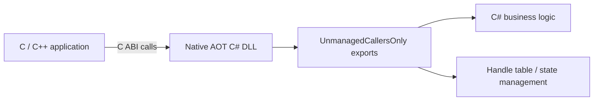

# How to Turn C# into a Native DLL with Native AOT - Calling UnmanagedCallersOnly Exports from C/C++

After looking at how C# can call into native code, the natural reverse question is: can native C or C++ call into logic written in C#?

With Native AOT, the answer can be yes.  
A C# class library can be published as a native shared library, and methods marked with `UnmanagedCallersOnly` can be exposed as C-style entry points.

## Contents

1. [Short version](#1-short-version)
2. [When this approach fits](#2-when-this-approach-fits)
3. [The basic structure](#3-the-basic-structure)
4. [A minimal pattern](#4-a-minimal-pattern)
5. [How to make the boundary robust](#5-how-to-make-the-boundary-robust)
6. [Cases where it is not the right tool](#6-cases-where-it-is-not-the-right-tool)
7. [Summary](#7-summary)

---

## 1. Short version

- If you want native C or C++ to call C# logic **in-process**, Native AOT plus `UnmanagedCallersOnly` is a strong option
- But the exported surface is still a **C ABI**, not a normal .NET object model
- In practice, flat C-style APIs with explicit lifetime and error codes are much more stable than trying to expose `string`, `List<T>`, or exceptions directly
- If you want natural C++ class handling, C++/CLI is often a better fit; if you need registration, automation, or process-boundary behavior, COM may be a better fit

## 2. When this approach fits

This approach is especially attractive when:

- the native application remains the main host
- you want to move only selected logic into C#
- the boundary can be expressed as a stable C-style API

Typical examples include:

- rules engines
- text processing
- configuration interpretation
- computation modules

## 3. The basic structure

The critical point is to keep the external boundary **flat and C-shaped**.

## 4. A minimal pattern

A practical export surface often looks like:

- `create`
- `destroy`
- `operate`
- `get_result`

That gives the native side explicit lifetime control while letting the C# side keep richer internal structure.

## 5. How to make the boundary robust

- align the surface to a **C ABI**
- use pointer + length + capacity patterns for strings and buffers
- never let exceptions cross the native boundary
- keep the calling convention fixed and explicit
- keep the exported method thin and delegate to internal logic

The more the boundary looks like a small, disciplined C library, the better it usually ages.

## 6. Cases where it is not the right tool

- when you need direct use of complex C++ class or STL-style types
- when the problem is really about process boundaries or bitness boundaries
- when you need COM-style registration, automation, or system-wide integration
- when the interop surface cannot be made flat enough to be stable

## 7. Summary

Native AOT makes it possible to use C# as the implementation language **behind a native DLL**.
That is powerful, but only if you accept the real rule of the boundary:

the outside world sees **a C ABI**, not ".NET but from C++".
