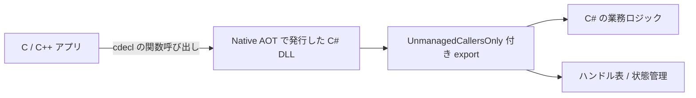

前回の [C# からネイティブ DLL を使うなら C++/CLI ラッパーが有力な理由](https://comcomponent.com/blog/2026/03/07/000-cpp-cli-wrapper-for-native-dlls/) では、C# から C++ を呼ぶときの境界面を整理しました。今回は向きを逆にして、C/C++ から C# を呼ぶ話です。

C# で書いた処理を既存の C/C++ アプリから呼びたい、でも P/Invoke の向きは逆だし、C++/CLI や COM まで持ち込むほどでもない、という場面があります。特に、ネイティブアプリ本体はそのまま残しつつ、判定ロジック、文字列処理、設定解釈、計算ルールのような部分だけを C# に寄せたいときです。

COM でも橋は架けられますが、今回はもっと in-process で、もっと DLL らしいやり方です。.NET の Native AOT では、クラスライブラリをネイティブ共有ライブラリとして発行でき、`UnmanagedCallersOnly` を付けたメソッドを C のエントリポイントとして公開できます。つまり、C# を「呼ばれる側のネイティブ DLL」として使えます。

ただし、何でもそのまま越境できるわけではありません。`string`、`List<T>`、例外、所有権を境界に漏らすと、急に空気が悪くなります。この記事では、Windows + C++ の最小例で、どんなときにこの構成が刺さるのか、どういう API 形状にすると壊れにくいのかを整理します。Linux / macOS でも考え方はほぼ同じですが、コード例は Windows の DLL を前提にします。

## 目次

1. まず結論（ひとことで）
2. まず見る使い分け
3. 構成図
4. 最小構成
   * 4.1. C# プロジェクト
   * 4.2. エクスポートする C# コード
   * 4.3. 発行コマンド
   * 4.4. C++ 側の呼び出し例
5. 壊れにくい API 形状
   * 5.1. C ABI に寄せる
   * 5.2. 文字列はポインタ + 長さ + バッファ容量で扱う
   * 5.3. 例外を越境させない
   * 5.4. 呼び出し規約を固定する
   * 5.5. Export メソッドは薄くして本体を別に置く
6. 向いているケース
7. それでも向かないケース
8. はまりどころ
9. まとめ
10. 参考資料

* * *

## 1. まず結論（ひとことで）

* C/C++ から C# の処理を in-process で呼びたいなら、Native AOT + `UnmanagedCallersOnly` はかなり有力です。
* ただし、export されるのは あくまで C の関数入口 です。`string` や `List<T>` をそのまま見せる世界ではありません。
* 実務では、`create` / `destroy` / `operate` のようなフラットな C API に落として、寿命管理とエラーコードを明示したほうが安定します。
* C++ のクラスや STL を自然に扱いたいなら C++/CLI、登録や自動化やプロセス越しが欲しいなら COM のほうが向いています。

要するに、**C# をネイティブ DLL の中身として使うことはできるが、境界面は .NET ではなく C ABI として設計する**、ということです。ここを割り切れるなら、かなり面白い武器になります。

## 2. まず見る使い分け

やりたいこと | 有力候補 | 理由
--- | --- | ---
C# から C の関数群を呼ぶ | P/Invoke | 向きが素直で、いちばん自然です
C# から C++ ライブラリを自然に扱う | C++/CLI | C++ 型、所有権、例外、`std::wstring` などを C++ 側で吸収しやすいです
32bit / 64bit やプロセス境界を越える | COM / IPC | in-process DLL だけでは越えられません
C/C++ から C# ロジックをネイティブ DLL として呼ぶ | Native AOT + `UnmanagedCallersOnly` | C の entry point を自前で export できます

この構成が刺さるのは、**「ネイティブ側が主役で、C# は部品として呼ばれる」** 場面です。ここは P/Invoke や C++/CLI とちょうど向きが違います。

## 3. 構成図



見た目はシンプルです。大事なのは、**境界面を C の関数に揃える** ことです。C# 側の内部実装がクラスでもコレクションでも LINQ でも構いませんが、外に見せる面は flat にします。

## 4. 最小構成

ここでは、C++ 側から「加算器」を作って値を足し込み、最後に合計を取得する最小例にします。実務では判定エンジンでも、設定解釈でも、簡単な解析器でも構いません。要するに、**ネイティブ側は handle を持ち、操作関数を順番に呼ぶ** 形です。

### 4.1. C# プロジェクト

まずはクラスライブラリを用意します。

```xml
<!-- NativeAotSample.csproj -->
<Project Sdk="Microsoft.NET.Sdk">
  <PropertyGroup>
    <TargetFramework>net8.0</TargetFramework>
    <Nullable>enable</Nullable>
    <ImplicitUsings>enable</ImplicitUsings>
    <PublishAot>true</PublishAot>
    <AllowUnsafeBlocks>true</AllowUnsafeBlocks>
  </PropertyGroup>
</Project>
```

ポイントは 2 つです。

* Native AOT publish を有効にすること
* ポインタ引数を使うので `unsafe` を許可すること

この記事のサンプルは `net8.0` を前提にしていますが、考え方自体は .NET 9 / 10 でも同じです。

### 4.2. エクスポートする C# コード

`UnmanagedCallersOnly` を付けたメソッドが、ネイティブ側から見える入口になります。ここでは handle を整数で払い出して、内部の状態は C# 側の dictionary で管理します。

```csharp
// NativeExports.cs
using System.Collections.Generic;
using System.Runtime.CompilerServices;
using System.Runtime.InteropServices;

namespace KomuraSoft.NativeAotSample;

internal static class NativeStatus
{
    public const int Ok = 0;
    public const int InvalidArgument = -1;
    public const int InvalidHandle = -2;
    public const int UnexpectedError = -3;
}

internal sealed class Accumulator
{
    public long Total { get; private set; }

    public void Add(int value)
    {
        Total += value;
    }
}

internal static class AccumulatorStore
{
    private static readonly object s_gate = new();
    private static readonly Dictionary<nint, Accumulator> s_instances = new();
    private static long s_nextHandle = 0;

    public static int Create(out nint handle)
    {
        try
        {
            var instance = new Accumulator();
            handle = (nint)System.Threading.Interlocked.Increment(ref s_nextHandle);

            lock (s_gate)
            {
                s_instances.Add(handle, instance);
            }

            return NativeStatus.Ok;
        }
        catch
        {
            handle = 0;
            return NativeStatus.UnexpectedError;
        }
    }

    public static int Add(nint handle, int value)
    {
        try
        {
            lock (s_gate)
            {
                if (!s_instances.TryGetValue(handle, out var instance))
                {
                    return NativeStatus.InvalidHandle;
                }

                instance.Add(value);
                return NativeStatus.Ok;
            }
        }
        catch
        {
            return NativeStatus.UnexpectedError;
        }
    }

    public static int GetTotal(nint handle, out long total)
    {
        try
        {
            lock (s_gate)
            {
                if (!s_instances.TryGetValue(handle, out var instance))
                {
                    total = 0;
                    return NativeStatus.InvalidHandle;
                }

                total = instance.Total;
                return NativeStatus.Ok;
            }
        }
        catch
        {
            total = 0;
            return NativeStatus.UnexpectedError;
        }
    }

    public static int Destroy(nint handle)
    {
        try
        {
            lock (s_gate)
            {
                return s_instances.Remove(handle)
                    ? NativeStatus.Ok
                    : NativeStatus.InvalidHandle;
            }
        }
        catch
        {
            return NativeStatus.UnexpectedError;
        }
    }
}

public static unsafe class NativeExports
{
    [UnmanagedCallersOnly(
        EntryPoint = "km_accumulator_create",
        CallConvs = new[] { typeof(CallConvCdecl) })]
    public static int AccumulatorCreate(nint* outHandle)
    {
        if (outHandle == null)
        {
            return NativeStatus.InvalidArgument;
        }

        var status = AccumulatorStore.Create(out var handle);
        *outHandle = handle;
        return status;
    }

    [UnmanagedCallersOnly(
        EntryPoint = "km_accumulator_add",
        CallConvs = new[] { typeof(CallConvCdecl) })]
    public static int AccumulatorAdd(nint handle, int value)
    {
        return AccumulatorStore.Add(handle, value);
    }

    [UnmanagedCallersOnly(
        EntryPoint = "km_accumulator_get_total",
        CallConvs = new[] { typeof(CallConvCdecl) })]
    public static int AccumulatorGetTotal(nint handle, long* outTotal)
    {
        if (outTotal == null)
        {
            return NativeStatus.InvalidArgument;
        }

        var status = AccumulatorStore.GetTotal(handle, out var total);
        *outTotal = total;
        return status;
    }

    [UnmanagedCallersOnly(
        EntryPoint = "km_accumulator_destroy",
        CallConvs = new[] { typeof(CallConvCdecl) })]
    public static int AccumulatorDestroy(nint handle)
    {
        return AccumulatorStore.Destroy(handle);
    }
}
```

やっていることはかなり素朴です。

* ネイティブ側に見せるのは `intptr_t` の handle だけ
* 状態本体は C# 側で持つ
* create / add / get / destroy を flat な関数に分解する
* 返り値はエラーコード、出力値はポインタ引数で返す

この形にしておくと、C# 側の内部実装をあとで差し替えても、C 側の ABI はかなり安定します。

### 4.3. 発行コマンド

共有ライブラリとして publish します。

```bash
dotnet publish -r win-x64 -c Release /p:NativeLib=Shared
```

これで、`bin/Release/net8.0/win-x64/publish/` 配下にネイティブ DLL が出ます。Windows の例なら `.dll`、Linux なら `.so`、macOS なら `.dylib` です。

大事なのは、**RID ごとに publish する** ことです。`win-x64` で作ったものを `win-arm64` の前提で使うことはできませんし、呼び出し側と DLL の bitness も揃える必要があります。

### 4.4. C++ 側の呼び出し例

今回は import lib の話をいったん外して、`LoadLibrary` / `GetProcAddress` で素直に呼びます。この形だと、何が export されていて、どういうシグネチャで受けるべきかが見えやすいです。

```c
/* native_api.h */
#pragma once
#include <stdint.h>

enum km_status
{
    KM_STATUS_OK = 0,
    KM_STATUS_INVALID_ARGUMENT = -1,
    KM_STATUS_INVALID_HANDLE = -2,
    KM_STATUS_UNEXPECTED_ERROR = -3
};

typedef int (__cdecl *km_accumulator_create_fn)(intptr_t* out_handle);
typedef int (__cdecl *km_accumulator_add_fn)(intptr_t handle, int value);
typedef int (__cdecl *km_accumulator_get_total_fn)(intptr_t handle, int64_t* out_total);
typedef int (__cdecl *km_accumulator_destroy_fn)(intptr_t handle);
```

```cpp
// main.cpp
#include <cstdint>
#include <cstdlib>
#include <iostream>
#include <windows.h>

#include "native_api.h"

template <typename T>
T LoadSymbol(HMODULE module, const char* name)
{
    FARPROC proc = ::GetProcAddress(module, name);
    if (proc == nullptr)
    {
        std::cerr << "GetProcAddress failed: " << name << '\n';
        std::exit(EXIT_FAILURE);
    }

    return reinterpret_cast<T>(proc);
}

int main()
{
    HMODULE module = ::LoadLibraryW(L"NativeAotSample.dll");
    if (module == nullptr)
    {
        std::cerr << "LoadLibraryW failed" << '\n';
        return EXIT_FAILURE;
    }

    auto create = LoadSymbol<km_accumulator_create_fn>(module, "km_accumulator_create");
    auto add = LoadSymbol<km_accumulator_add_fn>(module, "km_accumulator_add");
    auto getTotal = LoadSymbol<km_accumulator_get_total_fn>(module, "km_accumulator_get_total");
    auto destroy = LoadSymbol<km_accumulator_destroy_fn>(module, "km_accumulator_destroy");

    intptr_t handle = 0;
    if (create(&handle) != KM_STATUS_OK)
    {
        std::cerr << "create failed" << '\n';
        return EXIT_FAILURE;
    }

    if (add(handle, 10) != KM_STATUS_OK)
    {
        std::cerr << "add(10) failed" << '\n';
        return EXIT_FAILURE;
    }

    if (add(handle, 20) != KM_STATUS_OK)
    {
        std::cerr << "add(20) failed" << '\n';
        return EXIT_FAILURE;
    }

    std::int64_t total = 0;
    if (getTotal(handle, &total) != KM_STATUS_OK)
    {
        std::cerr << "get_total failed" << '\n';
        return EXIT_FAILURE;
    }

    std::cout << "total = " << total << '\n';

    if (destroy(handle) != KM_STATUS_OK)
    {
        std::cerr << "destroy failed" << '\n';
        return EXIT_FAILURE;
    }

    handle = 0;

    // Native AOT の共有ライブラリはアンロード前提では使わない。
    // FreeLibrary(module);

    return EXIT_SUCCESS;
}
```

この例だと、C++ 側から見えるのは「関数ポインタで呼べる C API」だけです。中が C# で書かれていることは、ほとんど意識しなくて済みます。

## 5. 壊れにくい API 形状

Native AOT で export できるのは面白いのですが、実務では **何を export しないか** のほうが大事です。

### 5.1. C ABI に寄せる

境界に出す型は、最初から次のあたりに寄せたほうが穏やかです。

* `int32_t` / `int64_t` / `double` のような基本型
* 固定レイアウトの struct
* `intptr_t` / `void*` 相当の handle
* `uint8_t*` と長さ

逆に、最初から外に漏らしたくないのは次です。

* `string`
* `object`
* `List<T>`
* `Task`
* `Span<T>`
* C++ のクラスや `std::vector` や `std::wstring`

このへんをそのまま越境させようとすると、境界面がすぐ濁ります。**C# の都合を C++ に漏らさず、C++ の都合も C# に漏らしすぎない** というのが大事です。

### 5.2. 文字列はポインタ + 長さ + バッファ容量で扱う

文字列をやり取りしたくなったら、いきなり `string` を出したくなりますが、ここはぐっとこらえたほうがよいです。ライブラリ境界では、たとえば次のような形に落とすのが分かりやすいです。

```c
int km_parse_utf8(const uint8_t* text, int32_t text_len, int32_t* out_value);
int km_format_utf8(int32_t value, uint8_t* buffer, int32_t buffer_len, int32_t* out_written);
```

要するに、**文字コード、長さ、誰がバッファを確保するか** を先に決めておく、ということです。Windows だから UTF-16 に寄せる選択肢もありますが、他言語まで見据えるなら UTF-8 のほうが扱いやすいことが多いです。

### 5.3. 例外を越境させない

ネイティブの関数境界は、例外の表現としてはあまり親切ではありません。少なくとも、**managed 例外をそのまま呼び出し元へ漏らす設計にはしない** ほうが安全です。

実務では、

* 戻り値は status code
* 実データは out バッファやポインタ引数
* 必要なら `get_last_error` 形式で追加情報を取得

のようにしておくと扱いやすいです。

派手ではありませんが、こういう地味な設計が後で効きます。境界面で急に格闘技を始めない、ということです。

### 5.4. 呼び出し規約を固定する

サンプルでは `CallConvCdecl` を明示しました。省略するとプラットフォーム既定の呼び出し規約になりますが、ヘッダや関数ポインタ型を固定したいなら、**こちらで明示してしまったほうが事故りにくい** です。

特に x86 を相手にする可能性があると、ここを曖昧にすると後でつらくなります。x64 では表面化しにくくても、ルールを最初に決めておくほうがよいです。

### 5.5. Export メソッドは薄くして、本体を別に置く

`UnmanagedCallersOnly` を付けたメソッドは、通常の managed コードからそのまま呼ぶ前提ではありません。なので、そこに業務ロジックを全部書き始めると、テストもしづらくなります。

サンプルでも、実体の管理は `AccumulatorStore` に置き、export される `NativeExports` は薄い入口だけにしています。これはかなり大事です。

* export メソッド: ABI の窓口
* 内部クラス: ふつうの C# ロジック

この分業にしておくと、C++ との境界と、C# の本体コードを分けて考えられます。

## 6. 向いているケース

この構成がかなり気持ちよくハマるのは、たとえば次のような場面です。

* 既存の C/C++ アプリは残したまま、一部の業務ロジックだけ C# に寄せたい
* .NET ランタイムの事前インストールを配布前提にしたくない
* export する関数面を小さく保てる
* 将来的に Rust や Go など、他言語からも同じ C API で呼びたくなるかもしれない

特に、**ネイティブアプリはそのままで、差し替えやすいロジック層だけを C# で書く** という構成には相性がよいです。UI や装置制御は C++ のまま、判定や計算や設定ルールは C#、という切り分けです。

## 7. それでも向かないケース

もちろん、これは万能ではありません。向かない場面もはっきりあります。

* C++ のクラスや `std::vector` や例外をそのまま扱いたい
  * こういうときは C++/CLI かネイティブ側ラッパーのほうが自然です。
* COM 登録、VBA / Office 自動化、Explorer 拡張のような世界に入りたい
  * ここは COM の文脈で考えたほうがよいです。
* 32bit / 64bit を橋渡ししたい、またはプロセス境界を越えたい
  * in-process DLL ではなく、COM / IPC / 別プロセス構成のほうが筋がよいです。
* プラグインをあとでアンロードしたい
  * Native AOT の共有ライブラリはアンロード前提では使わないほうがよいです。
* 依存ライブラリが強く reflection や動的コード生成に依存している
  * AOT publish の warning が出るなら、その warning を雑に無視しないほうが安全です。

要するに、**C ABI で割り切れるかどうか** が分水嶺です。割り切れないなら、別の橋のほうがきれいです。

## 8. はまりどころ

最後に、Native AOT export で地味にはまりやすい点をまとめます。

* `UnmanagedCallersOnly` を付けるメソッドは `static` である必要があります。
* generic メソッドや generic class の中には置けません。
* named export にしたいなら `EntryPoint` を付けます。
* `ref` / `in` / `out` は使わず、ポインタ引数で返す形にしたほうがよいです。
* export されるのは publish 対象アセンブリ側のメソッドです。参照先ライブラリのメソッドに属性を付けても、そのままでは表に出ません。
* 呼び出し側と DLL の bitness は揃える必要があります。
* publish warning はかなり重要です。AOT / trimming の warning が出ているなら、先にそこを片付けたほうが安全です。

このあたりは、どれも「知ってしまえばそうですよね」という話です。ですが、知らない状態で一度踏むと、かなり渋い時間が流れます。

## 9. まとめ

C/C++ から C# を呼びたいとき、まず思いつくのは COM だったり、C++/CLI だったり、別プロセスだったりします。どれも正しい選択肢です。

ただ、**in-process のネイティブ DLL として C# の処理を差し込みたい** なら、Native AOT + `UnmanagedCallersOnly` はかなり面白い選択肢です。

ポイントをもう一度まとめると、次です。

* C# をそのまま見せるのではなく、C ABI に flatten する
* handle ベースで寿命管理を明示する
* 例外ではなく error code で境界を越える
* 呼び出し規約を固定する
* export メソッドは薄くして、内部ロジックと分ける

やっていることは派手ではありません。ですが、こういう「境界をどう切るか」は、後の保守性にかなり効きます。ネイティブ資産を活かしつつ、ロジック層だけ C# の生産性を持ち込みたいとき、この構成は覚えておいて損がありません。

## 10. 参考資料

* [Native code interop with Native AOT - Microsoft Learn](https://learn.microsoft.com/en-us/dotnet/core/deploying/native-aot/interop)
* [Building native libraries - Microsoft Learn](https://learn.microsoft.com/en-us/dotnet/core/deploying/native-aot/libraries)
* [Native AOT deployment - Microsoft Learn](https://learn.microsoft.com/en-us/dotnet/core/deploying/native-aot/)
* [UnmanagedCallersOnlyAttribute Class - Microsoft Learn](https://learn.microsoft.com/en-us/dotnet/api/system.runtime.interopservices.unmanagedcallersonlyattribute?view=net-10.0)
* [UnmanagedCallersOnlyAttribute.CallConvs Field - Microsoft Learn](https://learn.microsoft.com/en-us/dotnet/api/system.runtime.interopservices.unmanagedcallersonlyattribute.callconvs?view=net-10.0)
* [C# compiler breaking changes: ref / ref readonly / in / out are not allowed on methods attributed with UnmanagedCallersOnly](https://learn.microsoft.com/en-us/dotnet/csharp/whats-new/breaking-changes/compiler%20breaking%20changes%20-%20dotnet%207)
* [Building Native Libraries with NativeAOT - dotnet/samples](https://github.com/dotnet/samples/blob/main/core/nativeaot/NativeLibrary/README.md)
* [C# からネイティブ DLL を使うなら C++/CLI ラッパーが有力な理由 - 合同会社小村ソフト Blog](https://comcomponent.com/blog/2026/03/07/000-cpp-cli-wrapper-for-native-dlls/)
* [32bit アプリから 64bit DLL を呼び出す方法 - COM ブリッジが役立つケーススタディ - 合同会社小村ソフト Blog](https://comcomponent.com/blog/2026/01/25/002-com-case-study-32bit-to-64bit/)
