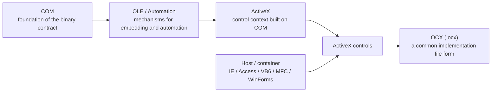

The three terms COM / ActiveX / OCX tend to appear together in Windows legacy projects.

- a vendor sends you an `.ocx`
- a mysterious component is sitting on a screen in Access or VB6
- someone says, "this is COM," and right after that someone else says, "so it is ActiveX"
- then terms like `regsvr32`, 32-bit / 64-bit, and IE mode start arriving all at once

At that point, the conversation usually turns muddy very quickly.

The terms are close to each other, and historically they overlap quite a bit.  
But in real work, once you can separate them properly, investigation, migration, and explanation all become much easier.

This article organizes `what COM is`, `what ActiveX is`, and `what OCX is` in an order that makes their differences and relationships easier to see.  
In particular, it makes clear **which one is the foundation, which one is the component context, and which one is the file**.

## Contents

1. The short answer first
2. What COM / ActiveX / OCX mean in this article
3. The whole picture on one page
   - 3.1. Relationship diagram
   - 3.2. The shortest way to sort out the terms
4. What COM is
   - 4.1. In one sentence
   - 4.2. What matters in COM
5. What ActiveX is
   - 5.1. In one sentence
   - 5.2. ActiveX is not browser-only
6. What OCX is
   - 6.1. In one sentence
   - 6.2. How it differs from `.dll`
7. A table that summarizes the differences
8. Where they were used
9. Why they are so easy to mix up
10. How to think about them in real work today
11. Common misunderstandings
12. Checkpoints when you investigate them
13. Summary
14. References

* * *

## 1. The short answer first

If I say it in a rough but useful way, it looks like this.

- **COM is the foundation**. It is the binary contract that allows components to communicate on Windows
- **ActiveX is a component context built on COM**. In practice, it often appears as controls embedded in a host
- **OCX is an implementation file you often see for ActiveX controls**. You encounter it as a file extension
- In other words, it becomes much easier to think about if you treat **COM = mechanism, ActiveX = component context, OCX = file**
- The memory that `ActiveX = that old dangerous browser thing` is half right and half incomplete. ActiveX is not browser-only
- People often speak as if `OCX = ActiveX`, but strictly speaking that mixes a concept and a file extension
- These are not technologies you would usually put at the center of a brand-new system today, but you still encounter them in existing Windows applications, Office, Access, device SDKs, and internal web systems

So the first important thing is to separate these three questions.

1. Is this a **COM problem**?
2. Is this an **ActiveX control problem**?
3. Is someone simply calling it that because they saw an **`.ocx` file**?

Once that part becomes clear, a lot of the fog goes away.

## 2. What COM / ActiveX / OCX mean in this article

These three terms often live together very loosely in real projects.  
So in this article, I fix the meaning first.

- **COM**: the Windows component model itself. The foundation of interfaces, GUIDs, registration, and invocation
- **ActiveX**: controls built on COM and the usage context around them. In practice, people often mean **ActiveX controls**
- **OCX**: the file extension often used for ActiveX control implementations: `.ocx`

A small additional note: historically, the term **`ActiveX` was used somewhat more broadly at one time**.  
But when people say `ActiveX` in present-day practical work, the places where it hurts are usually around **controls, embedding, hosts, browsers, and registration**.

So in this article as well, I mostly proceed with **ActiveX = a topic centered on ActiveX controls**.

## 3. The whole picture on one page

### 3.1. Relationship diagram

The fastest way is to look at the whole picture first.

The key point here is that **COM and ActiveX are not the same word for the same thing**.

- **COM** is the foundation
- **OLE / Automation** are mechanisms for embedding and automation
- **ActiveX** appears as a control context built on top of that
- **OCX** is a file you often see for that control implementation

So if someone asks, `is ActiveX the same thing as COM?`, the answer is **COM is the foundation, but ActiveX is not COM itself**.

### 3.2. The shortest way to sort out the terms

Term | Quick understanding
--- | ---
COM | mechanism, contract, foundation
ActiveX | the context of COM-based embeddable components
ActiveX control | the actual component that gets placed in a host
OCX | a file extension commonly used for ActiveX controls
OLE / Automation | mechanisms for embedding, automation, and integration

If you want the shortest version, this is enough.

- **COM is the mechanism**
- **ActiveX is the component context**
- **OCX is the file**

## 4. What COM is

### 4.1. In one sentence

COM stands for **Component Object Model**, and it is a **binary contract** for letting components communicate with each other on Windows.

What "binary contract" means here is not something based on source-level convenience or language syntax, but **an interface contract that still holds after compilation**.  
The reason a component written in C++ can be used from another language or another application is that this contract exists.

In practical terms, COM is less like `a handy way to distribute libraries` and more like **a mechanism that connects things by contract while hiding the implementation**.

Typical COM ideas include these:

- reference counting through `IUnknown`
- interface discovery through `QueryInterface`
- GUID-based identification such as `IID` and `CLSID`
- in-process use through DLLs
- out-of-process use through EXEs

In short, COM is **the foundation of the Windows culture of componentization**.

### 4.2. What matters in COM

If you only want the fundamentals, these are the important points in COM.

- **Interface-first**
  - you decide what to publish before talking about the implementation
- **Identification through GUIDs**
  - classes and interfaces are uniquely identified
- **Separation between host and implementation**
  - the caller does not need to know the internal implementation
- **It can cross process boundaries**
  - it can be used not only in the same process but also as a component in another process

This is one reason COM should not be dismissed as merely an old technology.  
At a fairly early stage, it already had a strong model for **contract-based reuse**.

## 5. What ActiveX is

### 5.1. In one sentence

The easiest way to understand ActiveX is as **reusable software components built on COM**, especially **controls that are embedded into a host or container and used there**.

When people say `ActiveX` in real work, a large percentage of the time they mean **ActiveX controls**.  
That can include things like buttons, grids, graphs, calendars, viewers, and device-integration components.

In other words, it is easier not to go wrong if you think of ActiveX not as **a huge standalone technology pretending to be important**, but as **a component that works inside some host**.

### 5.2. ActiveX is not browser-only

The impression that `ActiveX = that Internet Explorer thing` is very strong.  
That is not completely wrong, but **it is not the whole story**.

ActiveX controls were also used in places like these:

- Access forms
- VB6 applications
- MFC containers
- Office / VBA around-the-edges scenarios
- COM wrapper usage from WinForms
- Internet Explorer and compatibility-oriented environments around it

So ActiveX is **not a browser-only technology, but a component technology that was also used for a long time on the Windows application side**.

If you miss that point, you can end up seeing an ActiveX control found in an internal web app and an ActiveX control embedded in an Access screen as if they were unrelated.  
In reality, they are quite close relatives on the COM side.

## 6. What OCX is

### 6.1. In one sentence

OCX is a **file extension commonly used for ActiveX control implementations**.  
If you find an `.ocx` in a Windows project, there is a good chance that what you are looking at is **a COM component on the embedded-control side**.

For example, it shows up in situations like these:

- files distributed with a vendor SDK
- old VB6 / Access / MFC projects
- files inside installers that need to be registered
- components that require `regsvr32`

The important point here is that **OCX is a file form, not the concept itself**.  
So if you explain `what OCX is` in a rough but useful way, it is **a file you often encounter as the physical form of an ActiveX control**.

### 6.2. How it differs from `.dll`

This is another place where people get confused easily.

- **`.ocx`** strongly suggests an ActiveX control
- **`.dll`** might be an ordinary library, might be a COM server, or might be a dependency DLL used around ActiveX

So if you see an `.ocx`, the conversation is already leaning strongly toward ActiveX, but if you only see a `.dll`, you still do not know exactly what it is.

A common practical pattern is something like this:

- `vendorcontrol.ocx`
- `vendorhelper.dll`
- `vendorcore.dll`

The **OCX is the main player, and the DLLs support it from the side**.

So if someone asks, `is OCX just a kind of DLL?`, the practical feeling is close, but in investigation work it is safer to **keep their roles separate**.

## 7. A table that summarizes the differences

Term | What it is | Terms you often see in practice | Common physical form
--- | --- | --- | ---
COM | the component model, the foundation of the binary contract | `IUnknown`, `QueryInterface`, `CLSID`, `IID`, Apartment | `.dll`, `.exe`, registration information
ActiveX | a COM-based control context | container, embedding, properties, events | ActiveX controls
ActiveX control | the actual reusable component that gets placed | grid, calendar, viewer, device integration | `.ocx`, `.dll`
OCX | a file extension commonly seen for ActiveX controls | `regsvr32`, toolbox, 32-bit / 64-bit | `xxx.ocx`
OLE / Automation | mechanisms for embedding and automation | Office integration, property pages, automation | various COM-based features

If you remember the table in one sentence, it is this:

- **COM is the foundation work**
- **ActiveX is the component culture built on top of it**
- **OCX is the file you pick up in the field**

## 8. Where they were used

ActiveX / OCX are so strongly associated with browsers that people often see them as `old web technology`.  
But in reality, they were used much more broadly than that.

For example:

- **desktop applications**
  - VB6
  - MFC / C++
  - Access forms
  - Office / VBA environments
- **browsers / internal web systems**
  - viewers embedded into Internet Explorer
  - signing components
  - file transfer components
  - device-integration components
- **existing .NET applications**
  - existing ActiveX controls wrapped and used from WinForms
  - cases where existing COM assets are kept alive as UI components

The important point here is that **ActiveX is not specifically an internet-only technology**.  
It only feels like web technology because it became very visible in IE. In actual practical work, it makes more sense to view it as **Windows embedding component technology**.

## 9. Why they are so easy to mix up

### 9.1. They belong to different layers, but appear in the same conversation

- COM is about the **foundation**
- ActiveX is about the **component context**
- OCX is about the **file**

In other words, they are different layers from the start.  
And yet they show up together in the same real-world projects, which is exactly why conversations around them get tangled.

### 9.2. The term `ActiveX` is a little broad

`COM` is relatively fixed in meaning.  
`ActiveX`, on the other hand, is a little broader historically and practically.

Depending on the person, it may mean:

- the control itself
- the `.ocx` file
- an old component that runs in IE
- COM-based embeddable components in general

Once that happens, the conversation gets muddy very quickly.

### 9.3. The moment people see `.ocx`, they want to call everything ActiveX

That impulse is understandable.  
In everyday conversation, it usually works well enough.

But in migration and investigation work, you need to separate questions like these:

- is it a UI component?
- which host runs it?
- does it require registration?
- what is the 32-bit / 64-bit situation?
- is there browser dependence?

If you do not separate those points, you are likely to fall over later in a very predictable way.

## 10. How to think about them in real work today

First of all, simply finding COM / ActiveX / OCX is not a reason to reject everything immediately.  
But treating all of them with the same temperature is risky too.

### Browser-side ActiveX dependence

This is the part you should evaluate more strictly.

- it is not part of the modern browser-development mainstream
- IE mode is still discussed in compatibility contexts, but it is better seen as **a bridge for backward compatibility**
- it is hard to recommend it as a new foundational technology

In other words, for **web-side ActiveX**, it is usually more realistic to ask **where to peel it away from** than to ask **how to keep extending its life**.

### Desktop-side ActiveX / OCX dependence

This side can be judged a little more pragmatically.

- it is stable inside the existing host
- distribution targets are limited
- there is a realistic maintenance path from either the vendor or your own team
- the assumptions around registration, dependent DLLs, and bitness are understood

If those conditions are met, choosing to **keep it** is perfectly reasonable.

On the other hand, if you are in one of these situations:

- you want to load a 32-bit OCX directly into a 64-bit side
- you want to modernize the surrounding parts into .NET
- deployment and registration keep failing
- browser dependence still remains

then it is safer to think in terms of **keep / wrap / replace** as separate options.

So in present-day practical work, the issue is not `ActiveX is bad`, but **where to place boundaries**.  
It becomes easier to handle if you see it not as just old technology, but as **a connection surface inside an existing system**.

## 11. Common misunderstandings

### Misunderstanding 1: COM = ActiveX

No.  
COM is the foundation, and ActiveX is a control context built on top of it.

### Misunderstanding 2: ActiveX = Internet Explorer

No.  
It became famous through IE, but ActiveX is not browser-only.

### Misunderstanding 3: ActiveX = OCX

In practice people often use them almost interchangeably, but strictly speaking they are different.  
ActiveX is about the context or component, and OCX is the physical form you encounter as a file extension.

### Misunderstanding 4: OCX is just a DLL, right?

That is close enough for loose conversation, but investigation work should not stay that loose.  
A `.dll` alone does not tell you much about its role, while an `.ocx` strongly suggests a control-oriented component.

### Misunderstanding 5: COM is a dead technology

At least in the Windows world, that way of saying it is too rough.  
It looks less visible than before, but it still shows up in design and interoperability contexts.

## 12. Checkpoints when you investigate them

When you encounter COM / ActiveX / OCX, it becomes much easier to organize the situation if you first check the following points.

1. **What kind of component is it?**
   - a UI control?
   - a viewer?
   - device integration?
   - Office / Access integration?

2. **Where does it run?**
   - Access / VBA?
   - VB6 / MFC?
   - WinForms?
   - IE / IE mode?

3. **What are the files and identifiers?**
   - `.ocx` / `.dll` / `.exe`
   - ProgID
   - CLSID
   - Type Library

4. **How do registration and distribution work?**
   - does it need `regsvr32`?
   - are there dependent DLLs?
   - are administrator rights required?

5. **Does the bitness match?**
   - 32-bit?
   - 64-bit?
   - does it need to run in the same process?

6. **How should it be handled in the future?**
   - keep it as-is?
   - put a boundary around it and wrap it?
   - replace it?

If you skip these questions and jump straight into `we found ActiveX, so we will reimplement everything`, you are very likely to step on the old traps in a neat straight line.  
There is no need to start a reflexology session in a minefield.

## 13. Summary

If I explain the difference between COM / ActiveX / OCX in the roughest form that is still useful in real work, it is this:

- **COM is the foundation**
- **ActiveX is the context of COM-based embeddable components**
- **OCX is the file you often see for ActiveX controls**

In other words:

- `COM` is the mechanism
- `ActiveX` is the component
- `OCX` is the file

Once you can keep those three apart, it becomes much easier to see things like:

- is this simply an `.ocx`?
- is this a broader COM issue?
- is this browser-dependent ActiveX?
- is this a component that can remain on the desktop side?

Legacy technology is not difficult simply because it is old.  
It becomes confusing because **the foundation, the component, and the file all appear in the same conversation**.  
But once the structure becomes visible, it turns into a problem you can handle more calmly than you might expect.

## 14. References

- [What COM Is - Why Windows COM Still Feels Beautifully Designed](https://comcomponent.com/en/blog/2026/01/25/001-why-com-is-beautiful/)
- [How to Handle ActiveX / OCX Today - A Decision Table for Keep / Wrap / Replace](https://comcomponent.com/en/blog/2026/03/12/001-activex-ocx-keep-wrap-replace-decision-table/)
- [Component Object Model (COM) - Microsoft Learn](https://learn.microsoft.com/en-us/windows/win32/com/component-object-model--com--portal)
- [ActiveX Controls - Win32 apps - Microsoft Learn](https://learn.microsoft.com/en-us/windows/win32/com/activex-controls)
- [ActiveX Controls - MFC - Microsoft Learn](https://learn.microsoft.com/en-us/cpp/mfc/activex-controls?view=msvc-170)
- [ActiveX Control - Access VBA - Microsoft Learn](https://learn.microsoft.com/en-us/office/vba/api/overview/activex-control)
- [What is Internet Explorer (IE) mode? - Microsoft Learn](https://learn.microsoft.com/en-us/deployedge/edge-ie-mode)
- [Use DevTools with Internet Explorer mode (IE mode) - Microsoft Learn](https://learn.microsoft.com/en-us/microsoft-edge/devtools/ie-mode/)
