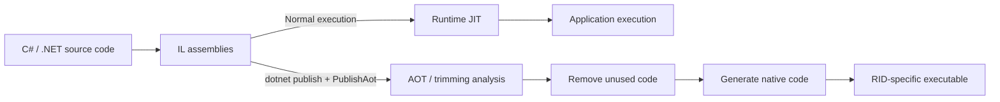

I already wrote about using Native AOT to let C/C++ call into C# in [How to Build a Native DLL from C# with Native AOT - Calling It from C/C++ with UnmanagedCallersOnly](https://comcomponent.com/en/blog/2026/03/12/003-csharp-native-aot-native-dll-from-c-cpp/).  
But the more helpful order would have been to explain **what Native AOT is in the first place** before that article. The order was slightly backwards.

Native AOT is one of those topics where the terminology gets mixed very quickly.

- is it just about getting rid of JIT?
- how is it different from self-contained or single-file publishing?
- is it basically the same family as ReadyToRun?
- what exactly is happening when trimming warnings start appearing everywhere?
- should WPF / WinForms / ASP.NET Core all be considered with the same level of optimism?

When those ideas blur together, Native AOT can look like "a magic switch that makes things faster," or the opposite, "something scary with too many restrictions." Both views are too rough.

This article assumes the current practical landscape around .NET 8 and later, and organizes these four points first:

- what Native AOT actually is
- what gets better and what gets harder
- how it differs from ReadyToRun and trimming
- what kinds of applications are the calmest place to start

## Contents

1. The short answer first
2. The first tables to look at
   - 2.1. Terms around Native AOT
   - 2.2. Differences between JIT, ReadyToRun, and Native AOT
3. The overall picture of Native AOT
4. What Native AOT improves
   - 4.1. Startup tends to get lighter
   - 4.2. You do not have to assume the runtime is preinstalled
   - 4.3. It fits restricted execution environments
5. What gets stricter with Native AOT
   - 5.1. Reflection and dynamic code generation
   - 5.2. You need to think in a trimming-first way
   - 5.3. You publish per platform
   - 5.4. Windows desktop and COM-heavy cases need extra caution
6. The minimum steps
   - 6.1. `csproj`
   - 6.2. `publish`
   - 6.3. How to write JSON code
7. Cases where Native AOT fits well
8. Cases where it does not
9. Common traps
10. Summary
11. References

* * *

## 1. The short answer first

- Native AOT is a publishing model that compiles a .NET application to native code ahead of time at publish time.
- Because it does not rely on runtime JIT, startup time and memory usage often improve, and distribution to machines without a preinstalled .NET runtime becomes easier.
- On the other hand, unrestricted reflection, dynamic code generation, built-in COM, and libraries that are not trimming-friendly become a poor fit.
- In other words, it is less a "magic speed switch" and more a publishing model that gives up some runtime dynamism in exchange for better startup, deployment, and execution-environment characteristics.

So Native AOT is best understood as "a way to distribute .NET more like a native application," not as a generic checkbox for faster compilation.

## 2. The first tables to look at

### 2.1. Terms around Native AOT

It becomes much easier if you separate these terms early.

| Term | What it does | Relationship to Native AOT |
| --- | --- | --- |
| JIT | Generates native code from IL at runtime | Native AOT does this work ahead of time |
| self-contained | Ships the .NET runtime together with the app | Native AOT is usually considered in this family |
| single-file | Bundles the output into one file | Not the essence of Native AOT, though the final shape may feel similar |
| trimming | Removes unused code | Almost a prerequisite with Native AOT |
| ReadyToRun | Keeps IL but moves some JIT work earlier | Similar-sounding but fundamentally different from Native AOT |
| source generator | Moves dynamic runtime work toward build-time code generation | A good match for Native AOT |

What tends to be confusing is that Native AOT is not just one isolated feature. It is a publishing model that works closely with self-contained deployment, trimming, source generation, and RID-specific publish output.

### 2.2. Differences between JIT, ReadyToRun, and Native AOT

This is also easier to see in one table first.

| Viewpoint | Normal JIT execution | ReadyToRun | Native AOT |
| --- | --- | --- | --- |
| Runtime JIT | Used | Still used in some cases | Not used |
| Main contents of the output | Mostly IL | IL + pregenerated code | Mostly native executable output |
| Startup | Baseline | Often improves | Often improves more strongly |
| Compatibility | Widest | Broad | More restrictive |
| Dynamic features | Easy to use | Usually still easy to use | Many limitations |
| Best fit | General .NET development | "I want startup improvement first" | "I care strongly about startup, deployment, and constrained environments" |

ReadyToRun is the direction of "make JIT easier."  
Native AOT is the direction of "do not rely on runtime JIT in the first place."  
They share some wording, but the practical temperature is quite different.

## 3. The overall picture of Native AOT

If you draw Native AOT roughly, it looks like this.



Normal .NET typically generates IL first and then JIT-compiles what it needs at runtime.  
Native AOT pushes a large part of that later work forward into publish time.

The key point is that, at publish time, the toolchain needs to know almost all code that will be needed at runtime.  
That is where the atmosphere changes.

- discovering types at runtime
- generating code at runtime
- loading assemblies at runtime
- relying on "it will probably resolve later somehow"

Those styles suddenly become much less compatible with Native AOT.

## 4. What Native AOT improves

### 4.1. Startup tends to get lighter

The easiest-to-understand benefit of Native AOT is startup.

- CLI tools
- short-lived processes
- serverless-like startup behavior
- container startup and replacement
- monitoring tools and small resident processes

In those cases, JIT cost is easier to see.  
Native AOT can move much of that cost earlier, so the initial startup tends to feel lighter.

Memory usage often improves as well, which matters when you want to pack more instances onto the same machine.  
That becomes especially visible on the cloud side when many similar processes are running.

### 4.2. You do not have to assume the runtime is preinstalled

Applications published with Native AOT are easier to distribute to environments where the .NET runtime is not already installed.

That is quietly valuable.

- you do not want to tell the deployment target to install ".NET 9 Runtime" first
- you want a thinner container image
- you want to place one small tool and run it immediately
- the environment does not allow JIT, or you do not want to allow it

In those cases, simply removing the assumption that a separate runtime must be prepared makes deployment much calmer.

Here, "runtime not required" means the target machine does not need a separate .NET installation.  
It does not mean every runtime-related piece disappears from the application itself.

### 4.3. It fits restricted execution environments

Because Native AOT does not rely on runtime JIT, it is also easier to run in environments where JIT is not allowed.

That tends to matter more in cloud, container, and mobile-adjacent discussions than in desktop work.  
But even in Windows development, it is still valuable whenever you want to reduce assumptions on the deployment side.

## 5. What gets stricter with Native AOT

### 5.1. Reflection and dynamic code generation

This is the heart of the restrictions.

- dynamic loading such as `Assembly.LoadFile`
- runtime code generation such as `System.Reflection.Emit`
- reflection that walks types without clear bounds at runtime
- patterns that assemble generic usage freely at runtime

These make it difficult to determine all required code at publish time, so they are a common source of AOT warnings.

That does not mean "one line of reflection and you are immediately done."  
But it is fundamentally true that **the more your design depends on deciding things at runtime, the harsher Native AOT becomes**.

A warning family you often see is `RequiresDynamicCode`.  
That generally means "this call may break under AOT," so it is usually safer not to suppress it casually.

In practice, Native AOT gets easier to reason about if you think of it as "reduce runtime cleverness, increase build-time explicitness."

### 5.2. You need to think in a trimming-first way

Native AOT is deeply tied to trimming.  
An easy thing to miss is that **the way your dependencies are written matters too, not just your own code**.

Typical areas to watch are:

- reflection-based serializers
- DI or plugin setups that scan types at runtime
- mechanisms that instantiate types from strings
- libraries that rely on dynamic proxies or IL generation

If warnings appear there and you say "publish succeeded, so it is probably fine," the bill often comes later.  
With Native AOT, warnings usually deserve serious attention.

### 5.3. You publish per platform

Native AOT is published against a fixed RID (Runtime Identifier).  
That means a build created for `win-x64` is not the same kind of thing as "a .NET DLL that runs anywhere."

- Windows x64
- Windows Arm64
- Linux x64
- Linux Arm64
- macOS Arm64

You should think in terms of producing separate outputs per target.

Compared with a normal framework-dependent .NET app, it feels much more like a classic native application model.

### 5.4. Windows desktop and COM-heavy cases need extra caution

In KomuraSoft's kind of work, this point matters a lot.

On Windows, Native AOT does not support built-in COM.  
And WPF is not friendly to trimming, while WinForms depends heavily on built-in COM marshalling. At least for now, that means neither of them is a calm "first Native AOT candidate."

In practical terms:

- taking a WPF / WinForms app and trying to Native AOT it immediately
- bringing in COM interop with the same assumptions as usual

Both tend to make the air heavy very quickly.

By contrast, these are much calmer starting points:

- console applications
- workers
- small Web APIs
- native-integration components where the boundary can be kept close to plain C-style functions

If COM is required, it is often better either to keep JIT or to redesign around `ComWrappers` / source-generated COM rather than forcing the issue.

## 6. The minimum steps

### 6.1. `csproj`

The first step is to add `PublishAot` to the project file.

```xml
<Project Sdk="Microsoft.NET.Sdk">
  <PropertyGroup>
    <TargetFramework>net8.0</TargetFramework>
    <PublishAot>true</PublishAot>
    <Nullable>enable</Nullable>
    <ImplicitUsings>enable</ImplicitUsings>
  </PropertyGroup>
</Project>
```

`net8.0` is enough for a sample. The overall way of thinking is largely the same in .NET 9 or .NET 10.

The important point is not to treat this only as a one-off command-line switch on `dotnet publish`.  
It is more useful to keep it in the project and look at build / publish analysis as part of normal development.

Also, adding `<PublishAot>true</PublishAot>` does not mean your ordinary local runs suddenly become Native AOT.  
Normal `dotnet run` and everyday execution are still JIT-based. Native AOT compilation really happens at publish time.

### 6.2. `publish`

For example, for Windows x64:

```bash
dotnet publish -c Release -r win-x64
```

For Linux x64:

```bash
dotnet publish -c Release -r linux-x64
```

The output is RID-specific.  
The mental model shifts from "one .NET DLL that can run in many places" to "an executable built for this OS / architecture."

If you are approaching it from the Web API side, using a Native AOT-oriented template is often the calmest way in.

```bash
dotnet new webapiaot -o MyFirstAotWebApi
```

For a worker:

```bash
dotnet new worker -o WorkerWithAot --aot
```

### 6.3. How to write JSON code

One place Native AOT often touches in a very practical way is JSON.  
If you use `System.Text.Json` in the usual reflection-heavy style, it becomes rougher. Source generation is usually a calmer direction.

```csharp
using System.Text.Json;
using System.Text.Json.Serialization;

[JsonSerializable(typeof(AppConfig))]
internal partial class AppJsonContext : JsonSerializerContext
{
}

public sealed class AppConfig
{
    public string? Name { get; init; }
    public int RetryCount { get; init; }
}

var config = new AppConfig
{
    Name = "sample",
    RetryCount = 3
};

string json = JsonSerializer.Serialize(config, AppJsonContext.Default.AppConfig);
```

In practice, the useful way to remember this is less "Native AOT support" and more **"do not make the runtime go looking for types if you can decide them earlier."**

## 7. Cases where Native AOT fits well

Native AOT tends to fit naturally in cases like these:

- CLI tools where startup is central
- small APIs deployed heavily in containers
- workers and background services
- serverless or other short-lived processes
- small .NET components embedded into native applications
- situations where you do not want to require a preinstalled .NET runtime

What they have in common is that **their boundaries are relatively clear, and it is easier to reduce dynamic behavior**.

## 8. Cases where it does not

There are also cases where Native AOT should clearly not be your first main option.

- large existing WPF / WinForms desktop applications
- architectures that assume built-in COM interop
- applications centered on runtime plugin loading
- frameworks that depend heavily on reflection-based type discovery
- libraries that assume `System.Reflection.Emit` or dynamic proxies as a matter of course
- designs that rely on C++/CLI

In those cases, normal JIT-based .NET, ReadyToRun, or a redesign of the boundaries is often the cleaner direction.

## 9. Common traps

Here are some common first-step mistakes:

- **Treating publish warnings lightly**
  - With Native AOT, warnings are often very meaningful.
- **Build succeeds but publish breaks**
  - Publish runs much more serious analysis across dependencies, so some issues only show up there.
- **Treating ReadyToRun and Native AOT as if they were basically the same**
  - The level of restriction is very different.
- **Starting with the desktop application itself**
  - Console apps, workers, and small APIs are usually calmer first targets.
- **Writing JSON and configuration binding in the usual casual way**
  - Reflection-heavy patterns tend to catch up later.
- **Assuming the result is platform-neutral**
  - Native AOT outputs are RID-specific.
- **Assuming Native AOT automatically makes everything faster**
  - The main story is startup, deployment, and execution-environment constraints. If you miss that, expectations drift.

With Native AOT, **`dotnet publish` feels more like the real judge than `dotnet build`**.  
The earlier you start running publish seriously, the less painful the later phase tends to be.

## 10. Summary

If I put it in one sentence, Native AOT is  
**a way to move a .NET application from a dynamic execution model toward a distribution model where more can be fixed statically in advance**.

The main points to keep in mind are:

1. Native AOT compiles to native code ahead of time at publish time.
2. It can improve startup, memory profile, and deployment convenience significantly.
3. In exchange, it is harsh on reflection, dynamic code generation, built-in COM, and code that is not trimming-friendly.
4. The calmest first targets are usually console apps, workers, and small APIs rather than desktop application cores.
5. It is important to take warnings seriously and validate early on a publish basis.

Native AOT is not a default switch that belongs on every .NET application.  
But when startup matters, when deployment needs to be lighter, or when you want fewer assumptions on the execution environment, it is a very strong option.

At the same time, in WPF / WinForms / COM-heavy worlds, plain .NET still often remains the cleaner fit.  
Once you can tell those cases apart, Native AOT stops looking like "a difficult new feature" and starts looking like a tool with a very clear place.

## 11. References

- [Native AOT deployment overview - .NET](https://learn.microsoft.com/en-us/dotnet/core/deploying/native-aot/)
- [Introduction to AOT warnings - .NET](https://learn.microsoft.com/en-us/dotnet/core/deploying/native-aot/fixing-warnings)
- [Prepare .NET libraries for trimming - .NET](https://learn.microsoft.com/en-us/dotnet/core/deploying/trimming/prepare-libraries-for-trimming)
- [Known trimming incompatibilities - .NET](https://learn.microsoft.com/en-us/dotnet/core/deploying/trimming/incompatibilities)
- [How to use source generation in System.Text.Json - .NET](https://learn.microsoft.com/en-us/dotnet/standard/serialization/system-text-json/source-generation)
- [ASP.NET Core support for Native AOT](https://learn.microsoft.com/en-us/aspnet/core/fundamentals/native-aot?view=aspnetcore-10.0)
- [ReadyToRun deployment overview - .NET](https://learn.microsoft.com/en-us/dotnet/core/deploying/ready-to-run)
- [Building native libraries - .NET](https://learn.microsoft.com/en-us/dotnet/core/deploying/native-aot/libraries)
- [ComWrappers source generation - .NET](https://learn.microsoft.com/en-us/dotnet/standard/native-interop/comwrappers-source-generation)
- [Related article: How to Build a Native DLL from C# with Native AOT - Calling It from C/C++ with UnmanagedCallersOnly](https://comcomponent.com/en/blog/2026/03/12/003-csharp-native-aot-native-dll-from-c-cpp/)
- [Related article: Why a C++/CLI Wrapper Is Often the Strongest Option When Calling Native DLLs from C#](https://comcomponent.com/en/blog/2026/03/07/000-cpp-cli-wrapper-for-native-dlls/)
