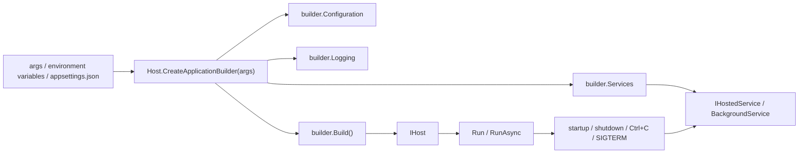

When you start writing a console app or worker in `.NET`, you can often get away with putting a little logic directly in `Main`.  
But once the application grows even a bit, the same kinds of needs tend to show up.

- you want to read `appsettings.json`
- you want environment variables to override settings
- you want to log through `ILogger`
- you do not want object creation to turn into a wall of `new`
- you want a loop running in the background
- you want the app to shut down cleanly on `Ctrl+C` or service stop

This is where `Generic Host` enters the picture.  
But the name itself is also easy to blur a little.

- what is the difference between `Host.CreateApplicationBuilder` and `Host.CreateDefaultBuilder`?
- is `IHost` the same thing as the DI container?
- how is it connected to `BackgroundService`?
- is it separate from ASP.NET Core's `WebApplicationBuilder`?
- is it worth using in a console app at all?

When those ideas get mixed together, Generic Host can look like "something only for web apps," or the opposite, "something every app should always be built on." Both views are a bit too rough.

This article takes the practical feel of .NET 6 and later as the baseline and sorts out these four points first:

- what Generic Host actually is
- what it gathers together and manages for you
- how `Host.CreateApplicationBuilder`, `Host.CreateDefaultBuilder`, and `WebApplication.CreateBuilder` relate to each other
- where it is the calmest place to start

## Contents

1. The short answer first
2. The first tables to look at
   - 2.1. What Generic Host contains
   - 2.2. Differences between the builder entry points
3. The overall picture of Generic Host
4. What Generic Host improves
   - 4.1. It centralizes startup wiring
   - 4.2. DI, configuration, and logging are connected from the beginning
   - 4.3. It handles clean shutdown and long-running processes more easily
5. The minimum setup
   - 5.1. A minimal console app example
   - 5.2. `appsettings.json`
   - 5.3. Adding `BackgroundService`
6. Typical patterns
   - 6.1. Short-lived console tools
   - 6.2. Workers and background services
   - 6.3. It also sits under ASP.NET Core
7. Cases where it fits well
8. Cases where it is unnecessary or excessive
9. Common traps
10. Summary
11. References

* * *

## 1. The short answer first

- Generic Host is the foundation that manages a .NET application's **startup and lifetime**.
- It includes DI, configuration, logging, `IHostedService` / `BackgroundService`, and application shutdown handling.
- In new non-web applications, `Host.CreateApplicationBuilder(args)` is usually the cleanest entry point.
- ASP.NET Core's `WebApplicationBuilder` is not a separate universe. It is a web-oriented entry point built on the same hosting model.
- In other words, Generic Host is not just about the DI container by itself. It is the mechanism that gathers application composition and lifetime management in one place.

The practical rule of thumb is that Generic Host starts paying off once your app grows beyond "read arguments, print once, exit."  
At the same time, it is not something you must drag into every tiny tool.

## 2. The first tables to look at

### 2.1. What Generic Host contains

It helps a lot to separate what is inside the box first.

| Part | What Generic Host manages | Why that helps |
| --- | --- | --- |
| DI | Builds services from `IServiceCollection` | Makes it easier to avoid chains of `new` |
| Configuration | Collects `appsettings.json`, environment variables, command-line arguments, and more | Makes environment-specific differences easier to manage |
| Logging | Sets up the foundation for `ILogger<T>` | Makes it easier to change log destinations later |
| Hosted service | Starts and stops `IHostedService` / `BackgroundService` | Makes it easier to separate long-running work from the app entry point |
| Lifetime | Handles startup and shutdown through `IHostApplicationLifetime`, `IHostEnvironment`, and related abstractions | Makes it easier to unify how the app ends on `Ctrl+C`, SIGTERM, or service stop |

The important point here is that Generic Host is not just "a convenient DI wrapper."  
In practice, it is better understood as the box that wires together the application's entry area.

### 2.2. Differences between the builder entry points

This is also easier to see in one table.

| Entry point | Main use | Coding style | First choice |
| --- | --- | --- | --- |
| `Host.CreateApplicationBuilder(args)` | New non-web console / worker apps | Write directly to `builder.Services`, `builder.Configuration`, and `builder.Logging` | Use this for new apps |
| `Host.CreateDefaultBuilder(args)` | Existing codebases or older extension-method-heavy setups | Uses chained configuration like `ConfigureServices` | Use this when matching existing code |
| `WebApplication.CreateBuilder(args)` | ASP.NET Core web apps / APIs | A web-oriented entry point built on Generic Host | Use this for web apps |

`CreateApplicationBuilder` and `CreateDefaultBuilder` are not "new thing versus separate old thing."  
They both rest on the same core hosting capabilities and defaults.

The biggest difference is mainly the **style of configuration code**.

For a new non-web app, `Host.CreateApplicationBuilder(args)` is usually the cleanest entry point today.  
`WebApplication.CreateBuilder(args)` is easiest to understand if you think of it as the same flow, expanded for web scenarios.

## 3. The overall picture of Generic Host

If you sketch the whole picture, it looks like this.



In the common flow, you create the builder in `Program.cs`, add services through `builder.Services`, adjust configuration and logging as needed, then call `Build()` to get `IHost`, and finally run it through `Run()` or `RunAsync()`.

One quietly important thing is how much is already included at the point of `Host.CreateApplicationBuilder(args)`.  
By default, for example, you already get:

- the current directory as the content root
- host configuration from `DOTNET_`-prefixed environment variables and command-line arguments
- application configuration from `appsettings.json`, `appsettings.{Environment}.json`, user secrets in Development, environment variables, and command-line arguments
- logging providers such as Console, Debug, EventSource, and EventLog on Windows
- scope validation and dependency validation in `Development`

So you are not wiring everything manually from zero.  
You are starting from a foundation that is already fairly complete for normal use.

## 4. What Generic Host improves

### 4.1. It centralizes startup wiring

One of the biggest quiet benefits is that the application entry point is less likely to sprawl.

Once an app grows a bit, `Main` tends to collect things like:

- loading configuration files
- environment-specific overrides
- logger initialization
- wiring `HttpClient`, repositories, and services
- starting background processes
- cleanup on shutdown signals

If all of that is connected by hand without a host, the entry point often gets stickier over time even if it starts small.

With Generic Host, `Program.cs` becomes clearly "the place where dependencies and startup wiring are assembled."  
That alone often makes code review much easier.

### 4.2. DI, configuration, and logging are connected from the beginning

With Generic Host, DI, configuration, and logging all sit on the same foundation from the start.

That means classes can naturally receive things like:

- `ILogger<T>`
- `IConfiguration`
- `IHostEnvironment`
- `IOptions<T>`

The practical payoff is that **configuration access and service construction are less likely to drift into different styles**.

If you only need one or two values, reading `IConfiguration["Section:Key"]` directly may be enough.  
But once settings start to grow, it is usually calmer to bind them into classes with `IOptions<T>`.

The same goes for logging. Instead of building `ILoggerFactory` manually in different places, injecting `ILogger<T>` into the classes that need it usually keeps the shape of the code clearer.

That is one of the real strengths of Generic Host: it lets these things be handled together as part of the application's foundation rather than as unrelated concerns.

### 4.3. It handles clean shutdown and long-running processes more easily

Generic Host does not only help with how the app starts. It also helps with how it stops.

When the host starts, each registered `IHostedService` gets `StartAsync` called.  
In worker-style applications, hosted services including `BackgroundService` run through `ExecuteAsync`.

In this context, "clean shutdown" means not simply killing the process immediately, but instead:

- sending the shutdown signal
- breaking out of loops and waits
- cleaning up connections and resources

That matters a lot in long-running applications.  
It becomes much easier to unify shutdown behavior across `Ctrl+C`, SIGTERM, or service stop events.

And when the application itself wants to ask the host to stop, `IHostApplicationLifetime.StopApplication()` is available.  
That gives you a natural host-level way to say, "the work is done, please shut down cleanly now."

## 5. The minimum setup

### 5.1. A minimal console app example

One important point is that using Generic Host does **not** automatically mean you need a `BackgroundService`.

Even a console tool that runs once and exits can benefit from Generic Host if it needs DI, configuration, or logging.

If you are adding it to a normal console project, the usual first step is to reference `Microsoft.Extensions.Hosting`.

```bash
dotnet add package Microsoft.Extensions.Hosting
```

A minimal `Program.cs` might look like this:

```csharp
using Microsoft.Extensions.Configuration;
using Microsoft.Extensions.DependencyInjection;
using Microsoft.Extensions.Hosting;
using Microsoft.Extensions.Logging;

HostApplicationBuilder builder = Host.CreateApplicationBuilder(args);

builder.Services.AddSingleton<JobRunner>();

using IHost host = builder.Build();

try
{
    JobRunner runner = host.Services.GetRequiredService<JobRunner>();
    await runner.RunAsync();
    return 0;
}
catch (Exception ex)
{
    ILogger logger = host.Services
        .GetRequiredService<ILoggerFactory>()
        .CreateLogger("Program");

    logger.LogError(ex, "Unhandled exception occurred during job execution.");
    return 1;
}

internal sealed class JobRunner(
    ILogger<JobRunner> logger,
    IConfiguration configuration,
    IHostEnvironment hostEnvironment)
{
    public Task RunAsync()
    {
        string message = configuration["Sample:Message"] ?? "(no message)";

        logger.LogInformation("Environment: {EnvironmentName}", hostEnvironment.EnvironmentName);
        logger.LogInformation("Message: {Message}", message);

        return Task.CompletedTask;
    }
}
```

If the app is not long-running, you do not need to go all the way to `RunAsync()`.  
You can build the host, resolve the needed services, do the work, and exit.  
That still gives you a lot of the value of Generic Host.

This is easy to overlook.  
**You do not need to drag the worker template into every short-lived job.**

### 5.2. `appsettings.json`

For the example above, a minimal settings file like this is enough:

```json
{
  "Sample": {
    "Message": "hello from Generic Host"
  }
}
```

Here the code reads `configuration["Sample:Message"]` directly.  
For one or two values, that is perfectly fine.

But once configuration grows in a real system, it is usually better to move toward:

- separate classes per section
- `IOptions<T>`-based injection
- validation at startup

That makes it easier to avoid stringly-typed keys being scattered everywhere.

Also, because the default Generic Host setup already includes not just `appsettings.json` but also `appsettings.{Environment}.json`, environment variables, and command-line arguments, it becomes natural to support patterns like "override only in development" or "replace values through environment variables in production."

### 5.3. Adding `BackgroundService`

If the work is long-running, `BackgroundService` is often a very natural fit.

```csharp
using Microsoft.Extensions.DependencyInjection;
using Microsoft.Extensions.Hosting;
using Microsoft.Extensions.Logging;

HostApplicationBuilder builder = Host.CreateApplicationBuilder(args);

builder.Services.AddScoped<PollingJob>();
builder.Services.AddHostedService<PollingWorker>();

using IHost host = builder.Build();
await host.RunAsync();

internal sealed class PollingWorker(
    IServiceScopeFactory scopeFactory,
    ILogger<PollingWorker> logger) : BackgroundService
{
    protected override async Task ExecuteAsync(CancellationToken stoppingToken)
    {
        using PeriodicTimer timer = new(TimeSpan.FromSeconds(30));

        while (await timer.WaitForNextTickAsync(stoppingToken))
        {
            using IServiceScope scope = scopeFactory.CreateScope();
            PollingJob job = scope.ServiceProvider.GetRequiredService<PollingJob>();

            await job.RunAsync(stoppingToken);
            logger.LogInformation("Polling completed.");
        }
    }
}

internal sealed class PollingJob(ILogger<PollingJob> logger)
{
    public Task RunAsync(CancellationToken cancellationToken)
    {
        logger.LogInformation("Do work here.");
        return Task.CompletedTask;
    }
}
```

Two points are especially worth noticing here:

1. the main body of `BackgroundService` lives in `ExecuteAsync`
2. if you need scoped dependencies, create a scope through `IServiceScopeFactory`

`BackgroundService` itself does not automatically come with a scope.  
So if you want to use something scoped like `DbContext`, resolving the job inside a created scope as above is the safer shape.

The choice of timer itself is a separate topic, but when the flow is `async`-based, `PeriodicTimer` is often a fairly calm option.  
That also connects naturally to the related timer article.

## 6. Typical patterns

### 6.1. Short-lived console tools

Batch tasks, conversion tools, or maintenance commands that run once and exit can still benefit from Generic Host.

Typical cases include:

- reading configuration files
- writing logs
- injecting `HttpClient` or repositories
- returning an exit code

If you take that kind of app and wrap it immediately in `BackgroundService` and `RunAsync()`, you may end up using host lifetime management more heavily than the problem actually needs.

For short-lived jobs, simply resolving a `JobRunner` and executing it, as in the minimal example, is often enough.

### 6.2. Workers and background services

For resident workers, polling, queue consumers, monitoring, and scheduled processing, the combination of Generic Host and `BackgroundService` is usually very natural.

The practical benefits include:

- startup and shutdown behavior being unified through the host
- logging, configuration, and DI being available from the beginning
- cancellation being easier to flow from `Ctrl+C` or stop signals
- the long-running work being easier to separate from `Program.cs`

It also connects naturally to contexts like Windows Services and containers.  
If the application is likely to grow into a resident service, Generic Host is a very natural foundation.

For Windows Service scenarios in particular, it is usually safer to base file lookup on `IHostEnvironment.ContentRootPath` rather than the current directory.  
The host gives you a clear idea of the application's base path.

### 6.3. It also sits under ASP.NET Core

Web apps and APIs use `WebApplication.CreateBuilder(args)`, so at first glance they may seem like a separate world from Generic Host.

But in practice the ideas are strongly connected.

- `builder.Services`
- `builder.Configuration`
- `builder.Logging`

These feel similar for a reason.

In ASP.NET Core, the HTTP server also lives inside host lifetime management.  
So understanding Generic Host helps make sense of why DI, configuration, and logging are all being configured in the web `Program.cs` as well.

## 7. Cases where it fits well

Generic Host tends to fit naturally in cases like these:

- console apps that use configuration, logging, and DI
- queue consumers, pollers, watchdogs, and scheduler-like workers
- long-running apps that need graceful cleanup on `Ctrl+C` or SIGTERM
- apps that may later grow into Windows Services or container-resident processes
- apps where you want the same extension-based style as ASP.NET Core

What these have in common is the desire to **keep the application's entry point and lifetime management from becoming messy**.

## 8. Cases where it is unnecessary or excessive

There are also cases where Generic Host does not need to be the main tool from the start.

- tiny tools that read arguments once, print once, and exit
- rough experimental code used for only a short time
- library projects
- cases where you only need one setting and do not really need DI, logging, or lifetime management

In those situations, a simpler implementation is often quieter than standing up a host.

The important point is that **just because Generic Host is powerful does not mean every executable must use it**.

## 9. Common traps

Here are some easy mistakes at the beginning:

- **Thinking Generic Host is only the DI container**
  - In reality it is the foundation that includes startup, shutdown, configuration, logging, and hosted services.
- **Starting a new app with `Host.CreateDefaultBuilder` out of habit**
  - Unless you are matching an existing codebase, `Host.CreateApplicationBuilder` is usually the cleaner starting point.
- **Injecting scoped services directly into `BackgroundService`**
  - Hosted services do not have a default scope. Creating one through `IServiceScopeFactory` is the safer path.
- **Building a run-once worker without telling the host to stop**
  - If you use a worker template for a "run once" app, you need `IHostApplicationLifetime.StopApplication()` when the work ends, otherwise the host keeps running.
- **Using `Environment.Exit` when you really want a clean shutdown**
  - If you are already using the host, `StopApplication()` is usually the cleaner way to stop.
- **Assuming the current directory in a Windows Service**
  - File lookup is usually more stable when based on `IHostEnvironment.ContentRootPath`.
- **Wrapping a short-lived CLI in `BackgroundService` from the beginning**
  - If the work runs once, resolving and executing a normal service class is often enough.
- **Using callback timers casually inside `BackgroundService`**
  - If the flow is `async`-based, `PeriodicTimer` often leads to code that is easier to read and less likely to drift.

With Generic Host, simply separating **"short-lived job" versus "resident job"** early on already removes a lot of confusion.

## 10. Summary

If you put it in one sentence, Generic Host is **the foundation that gathers a .NET application's entry point and lifetime management**.

The main points worth keeping in mind are:

1. Generic Host includes not only DI but also configuration, logging, shutdown handling, and hosted services
2. For new non-web apps, `Host.CreateApplicationBuilder(args)` is usually the cleanest starting point
3. For short-lived jobs, it is fine to build the host and execute a service directly without `BackgroundService`
4. For resident processing, `BackgroundService` plus host lifetime management becomes very valuable
5. `BackgroundService` does not have a default scope, so scoped services should be resolved inside an explicit scope
6. ASP.NET Core's `WebApplicationBuilder` sits on the same overall model

Generic Host is not a heavy ritual for its own sake.  
Once configuration, logging, dependency wiring, startup, and shutdown begin to grow, it becomes a way to keep those concerns together at the entry point instead of letting them leak all over the app.

On the other hand, if the tool is still very small, you do not have to bring it in.  
Once you can tell those cases apart, Generic Host stops feeling like "something you add by habit" and starts feeling like a very practical foundation.

## 11. References

- [.NET Generic Host - .NET](https://learn.microsoft.com/en-us/dotnet/core/extensions/generic-host/)
- [Worker Services in .NET](https://learn.microsoft.com/en-us/dotnet/core/extensions/workers/)
- [Use scoped services within a BackgroundService - .NET](https://learn.microsoft.com/en-us/dotnet/core/extensions/scoped-service/)
- [Configuration in .NET](https://learn.microsoft.com/en-us/dotnet/core/extensions/configuration/)
- [Options pattern in .NET](https://learn.microsoft.com/en-us/dotnet/core/extensions/options/)
- [.NET Generic Host in ASP.NET Core](https://learn.microsoft.com/en-us/aspnet/core/fundamentals/host/generic-host?view=aspnetcore-10.0)
- [Create Windows Service using BackgroundService - .NET](https://learn.microsoft.com/en-us/dotnet/core/extensions/windows-service/)
- [Related article: First Sort Out PeriodicTimer / System.Threading.Timer / DispatcherTimer](https://comcomponent.com/en/blog/2026/03/12/002-periodictimer-system-threading-timer-dispatchertimer-guide/)
- [Related article: C# async/await Best Practices - A Decision Table for Task.Run and ConfigureAwait](https://comcomponent.com/en/blog/2026/03/09/001-csharp-async-await-best-practices/)
