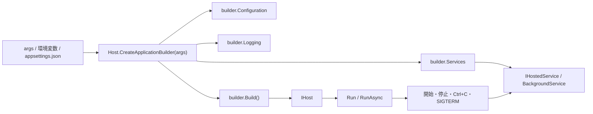

`.NET` でコンソールアプリや worker を書き始めると、最初は `Main` に少し処理を書くだけで済みます。  
ただ、少し育つと、だいたいこのへんが増えてきます。

- `appsettings.json` を読みたい
- 環境変数で上書きしたい
- `ILogger` でログを出したい
- サービスの生成を `new` だらけにしたくない
- バックグラウンドでループを回したい
- `Ctrl+C` やサービス停止できれいに終わりたい

ここで出てくるのが `Generic Host` です。  
ただ、この名前も少し混ざりやすいです。

- `Host.CreateApplicationBuilder` と `Host.CreateDefaultBuilder` は何が違うのか
- `IHost` は DI コンテナーと同じなのか
- `BackgroundService` と何がつながっているのか
- ASP.NET Core の `WebApplicationBuilder` と別物なのか
- コンソールアプリでも使う価値があるのか

このへんが混ざると、Generic Host が「Web アプリ専用っぽいもの」に見えたり、逆に「何でも host にすべきもの」に見えたりします。どちらも少し雑です。

この記事では、主に .NET 6 以降の現在の実務感を前提に、次の 4 つを先に整理します。

- Generic Host の正体
- 何をまとめて面倒を見てくれるのか
- `Host.CreateApplicationBuilder` / `Host.CreateDefaultBuilder` / `WebApplication.CreateBuilder` の関係
- どこから入ると穏やかか

## 目次

1. まず結論（ひとことで）
2. まず見る整理表
   - 2.1. Generic Host が抱えているもの
   - 2.2. builder の違い
3. Generic Host の全体像（図）
4. Generic Host で何がうれしいか
   - 4.1. 起動処理を 1 か所に寄せられる
   - 4.2. DI / 設定 / ログが最初からつながる
   - 4.3. 正常終了と常駐運転を扱いやすい
5. 最小構成
   - 5.1. コンソールアプリで使う最小例
   - 5.2. `appsettings.json`
   - 5.3. `BackgroundService` を載せる
6. 典型パターン
   - 6.1. 短命なコンソールツール
   - 6.2. worker / バックグラウンドサービス
   - 6.3. ASP.NET Core の下にもいる
7. 向いているケース
8. 向かない / 過剰なケース
9. はまりどころ
10. まとめ
11. 参考資料

* * *

## 1. まず結論（ひとことで）

- Generic Host は、.NET アプリの **起動と有効期間** をまとめて扱う土台です。
- その中に、DI、設定、ログ、`IHostedService` / `BackgroundService`、アプリの停止処理が入ります。
- 新しい非 Web アプリでは、まず `Host.CreateApplicationBuilder(args)` から入るのが素直です。
- ASP.NET Core の `WebApplicationBuilder` も別世界ではなく、同じ host の考え方を Web 用に広げた窓口です。
- つまり Generic Host は、DI コンテナー単体の話ではなく、**アプリの組み立て地点と寿命管理をまとめる仕組み** です。

要するに、アプリが「引数を読んで 1 回表示して終わり」を少し超えたあたりから、Generic Host はかなり効いてきます。  
逆に、そこまで育っていない小さな道具にまで、毎回必ず持ち込むものでもありません。

## 2. まず見る整理表

### 2.1. Generic Host が抱えているもの

最初に、この箱の中身を分けておくとかなり楽です。

| 要素 | Generic Host が面倒を見ること | 何がうれしいか |
| --- | --- | --- |
| DI | `IServiceCollection` からサービスを組み立てる | `new` の連鎖を減らしやすい |
| Configuration | `appsettings.json`、環境変数、コマンドライン引数などをまとめる | 環境ごとの差分を扱いやすい |
| Logging | `ILogger<T>` を使うための基盤を作る | ログ出力先を後から差し替えやすい |
| Hosted service | `IHostedService` / `BackgroundService` の起動と停止を扱う | 常駐処理をアプリ本体と分けやすい |
| Lifetime | `IHostApplicationLifetime`、`IHostEnvironment` などを通じて開始・停止を扱う | `Ctrl+C`、SIGTERM、サービス停止で終わり方をそろえやすい |

ここで大事なのは、Generic Host が「便利な DI ラッパー 1 個」ではないことです。  
実際には、アプリの入口まわりをまとめて配線する箱、くらいの見方がいちばん外しにくいです。

### 2.2. builder の違い

ここも最初に 1 枚で見るほうが早いです。

| 入口 | 主な用途 | 書き味 | まずの選択 |
| --- | --- | --- | --- |
| `Host.CreateApplicationBuilder(args)` | コンソール / worker などの新規非 Web アプリ | `builder.Services` / `builder.Configuration` / `builder.Logging` に直接書く | 新規ならこれ |
| `Host.CreateDefaultBuilder(args)` | 既存コードや古い拡張メソッド主体の構成 | `ConfigureServices` などをチェーンする | 既存資産があるならこれ |
| `WebApplication.CreateBuilder(args)` | ASP.NET Core Web アプリ / API | Generic Host に Web 用の都合を足した入口 | Web ならこれ |

`CreateApplicationBuilder` と `CreateDefaultBuilder` は、  
片方が新機能で片方が別物、という話ではありません。

どちらも同じコア機能と既定動作を持っています。  
違うのは主に **書き方の流儀** です。

新しい非 Web アプリなら、いまは `Host.CreateApplicationBuilder(args)` から入るのが素直です。  
`WebApplication.CreateBuilder(args)` は、その流れを Web 用に広げた入口だと思っておくと整理しやすいです。

## 3. Generic Host の全体像（図）

全体像をざっくり図にすると、こうです。



ふつうは `Program.cs` で builder を作り、  
`builder.Services` にサービスを足し、  
`builder.Configuration` や `builder.Logging` を必要に応じて調整し、  
最後に `Build()` して `IHost` を得て、`Run()` / `RunAsync()` で走らせます。

地味に大きいのは、`Host.CreateApplicationBuilder(args)` の時点でかなりのものが既に載っていることです。  
既定では、たとえば次のようなものが入ります。

- コンテンツルートは現在のディレクトリ
- ホスト構成は `DOTNET_` プレフィックス付き環境変数とコマンドライン引数
- アプリ構成は `appsettings.json`、`appsettings.{Environment}.json`、Development の user secrets、環境変数、コマンドライン引数
- ログは Console / Debug / EventSource / EventLog（Windows のみ）
- `Development` 環境では scope 検証と依存関係検証

つまり、何も考えずに 0 から配線しているわけではなく、  
最初から「普通に使うぶんにはかなり足りる土台」が置かれています。

## 4. Generic Host で何がうれしいか

### 4.1. 起動処理を 1 か所に寄せられる

Generic Host のいちばん地味で大きい効き目は、アプリの入口が散らばりにくくなることです。

アプリが少し育つと、`Main` のまわりで次のようなものが増えます。

- 設定ファイルの読み込み
- 環境ごとの差し替え
- ロガーの初期化
- `HttpClient` や repository や service の組み立て
- バックグラウンド処理の起動
- 終了シグナル時の後片づけ

これを host なしで全部手でつないでいくと、  
最初は軽くても、あとからだんだん入口が粘ってきます。

Generic Host を使うと、`Program.cs` が「依存関係をまとめて組み立てる場所」としてはっきりします。  
この整理だけで、コードレビューのしやすさがかなり変わります。

### 4.2. DI / 設定 / ログが最初からつながる

Generic Host を使うと、DI、設定、ログが最初から同じ土台に乗ります。

たとえばクラスの側では、こんなものを普通に受け取れます。

- `ILogger<T>`
- `IConfiguration`
- `IHostEnvironment`
- `IOptions<T>`

ここで効くのは、**設定の読み方とサービスの作り方が別々の流儀になりにくい** ことです。

設定が 1 個や 2 個なら、`IConfiguration["Section:Key"]` を直接読むだけでも動きます。  
ただ、実務で設定が増えてきたら、`IOptions<T>` で section ごとにクラスへ束ねたほうが穏やかです。

同じように、ログも `ILoggerFactory` をあちこちで手作りするより、  
必要なクラスへ `ILogger<T>` を注入したほうが見通しがよくなります。

Generic Host が便利なのは、これらを別々の話にせず、  
**アプリ全体の土台として一緒に扱える** ところです。

### 4.3. 正常終了と常駐運転を扱いやすい

Generic Host は「どう起動するか」だけでなく、「どう止まるか」も面倒を見ます。

host が起動すると、登録された各 `IHostedService` の `StartAsync` が呼ばれます。  
worker サービスでは、`BackgroundService` を含む hosted service の `ExecuteAsync` が走ります。

ここでいう「正常終了」は、いきなり処理を切るのではなく、

- 停止の合図を流す
- ループや待機を抜ける
- 接続やリソースを片づける

という順番を踏んで終わることです。

長時間動くアプリでは、ここがかなり大事です。  
`Ctrl+C`、SIGTERM、サービス停止のようなイベントで、アプリ全体の止まり方をそろえやすくなります。

また、終了をアプリ側から要求したいときは、`IHostApplicationLifetime.StopApplication()` が使えます。  
「もう仕事は終わったので、きれいに落ちてほしい」という合図を、host の文脈で出せます。

## 5. 最小構成

### 5.1. コンソールアプリで使う最小例

まず大事なのは、Generic Host を使うからといって、  
必ず `BackgroundService` を作る必要はないことです。

1 回だけ走るコンソールツールでも、  
DI、設定、ログが欲しいなら Generic Host は十分使えます。

ふつうの console プロジェクトに後から載せるなら、まずは `Microsoft.Extensions.Hosting` を参照します。

```bash
dotnet add package Microsoft.Extensions.Hosting
```

`Program.cs` の最小例は、たとえばこうです。

```csharp
using Microsoft.Extensions.Configuration;
using Microsoft.Extensions.DependencyInjection;
using Microsoft.Extensions.Hosting;
using Microsoft.Extensions.Logging;

HostApplicationBuilder builder = Host.CreateApplicationBuilder(args);

builder.Services.AddSingleton<JobRunner>();

using IHost host = builder.Build();

try
{
    JobRunner runner = host.Services.GetRequiredService<JobRunner>();
    await runner.RunAsync();
    return 0;
}
catch (Exception ex)
{
    ILogger logger = host.Services
        .GetRequiredService<ILoggerFactory>()
        .CreateLogger("Program");

    logger.LogError(ex, "Unhandled exception occurred during job execution.");
    return 1;
}

internal sealed class JobRunner(
    ILogger<JobRunner> logger,
    IConfiguration configuration,
    IHostEnvironment hostEnvironment)
{
    public Task RunAsync()
    {
        string message = configuration["Sample:Message"] ?? "(no message)";

        logger.LogInformation("Environment: {EnvironmentName}", hostEnvironment.EnvironmentName);
        logger.LogInformation("Message: {Message}", message);

        return Task.CompletedTask;
    }
}
```

長時間常駐しないなら、`RunAsync()` まで行かなくてもよいです。  
`Build()` して必要なサービスを解決し、仕事を終えたらそのまま終了する。  
それでも Generic Host のうまみは十分使えます。

ここは意外と大事です。  
**短命なジョブにまで、毎回 Worker テンプレートを持ち込む必要はありません。**

### 5.2. `appsettings.json`

上の例なら、設定ファイルはこんな最小形で十分です。

```json
{
  "Sample": {
    "Message": "hello from Generic Host"
  }
}
```

この例では生で `configuration["Sample:Message"]` を読んでいます。  
値を 1 個や 2 個見るだけなら、これで十分です。

ただ、実務で設定が増えてきたら、

- section ごとにクラスへ分ける
- `IOptions<T>` で注入する
- 起動時に検証する

という形へ寄せたほうが、キー文字列のばら撒きを避けやすいです。

また、Generic Host の既定値では `appsettings.json` だけでなく、  
`appsettings.{Environment}.json`、環境変数、コマンドライン引数もつながるので、  
「開発時だけ差し替える」「本番では環境変数で上書きする」がかなり自然にできます。

### 5.3. `BackgroundService` を載せる

長時間動く処理なら、`BackgroundService` を使うとかなり素直です。

```csharp
using Microsoft.Extensions.DependencyInjection;
using Microsoft.Extensions.Hosting;
using Microsoft.Extensions.Logging;

HostApplicationBuilder builder = Host.CreateApplicationBuilder(args);

builder.Services.AddScoped<PollingJob>();
builder.Services.AddHostedService<PollingWorker>();

using IHost host = builder.Build();
await host.RunAsync();

internal sealed class PollingWorker(
    IServiceScopeFactory scopeFactory,
    ILogger<PollingWorker> logger) : BackgroundService
{
    protected override async Task ExecuteAsync(CancellationToken stoppingToken)
    {
        using PeriodicTimer timer = new(TimeSpan.FromSeconds(30));

        while (await timer.WaitForNextTickAsync(stoppingToken))
        {
            using IServiceScope scope = scopeFactory.CreateScope();
            PollingJob job = scope.ServiceProvider.GetRequiredService<PollingJob>();

            await job.RunAsync(stoppingToken);
            logger.LogInformation("Polling completed.");
        }
    }
}

internal sealed class PollingJob(ILogger<PollingJob> logger)
{
    public Task RunAsync(CancellationToken cancellationToken)
    {
        logger.LogInformation("Do work here.");
        return Task.CompletedTask;
    }
}
```

この例で見ておきたいのは 2 点です。

1. `BackgroundService` の本体は `ExecuteAsync`
2. scoped な依存関係が欲しいなら、`IServiceScopeFactory` で scope を作る

`BackgroundService` 自体には既定の scope がありません。  
たとえば `DbContext` のような scoped サービスを使いたいなら、  
上のように job 側を scope の中で解決する形が安全です。

なお、定期実行の道具そのものの選び方は別テーマですが、  
`async` ベースで書くなら `PeriodicTimer` はかなり穏やかです。  
このあたりは、関連記事のタイマー記事ともつながります。

## 6. 典型パターン

### 6.1. 短命なコンソールツール

バッチ、変換ツール、メンテナンスコマンドのように、  
1 回だけ仕事をして終わるアプリでも Generic Host は普通に使えます。

向いているのは、たとえば次のような場面です。

- 設定ファイルを読みたい
- ログを出したい
- `HttpClient` や repository を注入したい
- 終了コードを返したい

この手のアプリで、いきなり `BackgroundService` と `RunAsync()` を持ち込むと、  
少し重たいわりに、ホストの寿命管理を過剰に使うことになります。

短命ジョブなら、前の最小例のように `JobRunner` を解決して実行するだけで十分です。

### 6.2. worker / バックグラウンドサービス

常駐 worker、ポーリング、キュー消費、監視、定期実行のような処理では、  
Generic Host と `BackgroundService` の組み合わせがかなり素直です。

特にうれしいのは、次のような点です。

- 起動と停止の流れが host 側でそろう
- ログ、設定、DI が最初から使える
- `Ctrl+C` や停止シグナルでキャンセルを流しやすい
- 常駐処理の本体を `Program.cs` から分離しやすい

さらに、Windows Service やコンテナの文脈ともつなぎやすいです。  
常駐アプリとして育てるなら、Generic Host はかなり自然な土台です。

Windows Service 化する場面では、現在のディレクトリ前提でファイルを探すより、  
`IHostEnvironment.ContentRootPath` を起点に考えたほうが事故が少ないです。  
host の文脈で「アプリの基準パス」が決まるからです。

### 6.3. ASP.NET Core の下にもいる

Web アプリ / API では `WebApplication.CreateBuilder(args)` を使うので、  
ぱっと見では Generic Host と別世界に見えるかもしれません。

でも、感覚としてはかなりつながっています。

- `builder.Services`
- `builder.Configuration`
- `builder.Logging`

の書き味が似ているのは、そのためです。

ASP.NET Core では、HTTP サーバーの起動も host の lifetime の中に入っています。  
つまり、Web 側の `Program.cs` を読んだときに「なぜここで DI や設定やログを触っているのか」が分かりやすくなる、という意味でも Generic Host の理解は効きます。

## 7. 向いているケース

Generic Host が気持ちよくハマりやすいのは、たとえば次です。

- 設定、ログ、DI を使うコンソールアプリ
- queue consumer、poller、watchdog、scheduler 的な worker
- `Ctrl+C` や SIGTERM で後片づけしたい長時間実行アプリ
- 将来的に Windows Service / コンテナ常駐へ育つ可能性があるアプリ
- ASP.NET Core と同じ拡張群の流儀にそろえたいアプリ

共通しているのは、  
**「アプリの入口と寿命管理を雑にしたくない」** ことです。

## 8. 向かない / 過剰なケース

逆に、最初から Generic Host を主役にしなくてよい場面もあります。

- 引数を 1 回読んで 1 回出力して終わるだけの小さなツール
- 数十分だけ使う雑な検証コード
- ライブラリプロジェクト
- 設定を 1 つ読むだけで、DI やログや寿命管理まではいらないケース

ここでは、host を立てるより単純な実装のほうが静かです。

大事なのは、  
**Generic Host が強いからといって、全部の executable に必須ではない**  
ということです。

## 9. はまりどころ

最後に、Generic Host 初手で踏みやすい点をまとめます。

- **Generic Host を DI コンテナーとだけ見る**
  - 実際には、起動・停止・設定・ログ・hosted service を含む土台です。
- **新規アプリなのに惰性で `Host.CreateDefaultBuilder` から始める**
  - 既存コードに合わせる事情がなければ、まずは `Host.CreateApplicationBuilder` のほうが素直です。
- **`BackgroundService` に scoped サービスを直接入れる**
  - hosted service には既定の scope がありません。`IServiceScopeFactory` で scope を作るほうが安全です。
- **1 回だけで終わる worker なのに停止を host へ伝えない**
  - Worker テンプレートで「run once」をやるなら、仕事が終わった時点で `IHostApplicationLifetime.StopApplication()` を呼ばないと、host はそのまま走り続けます。
- **正常終了したいのに `Environment.Exit` で切る**
  - host を使っているなら、きれいに止めたい場面では `StopApplication()` のほうが筋がよいです。
- **Windows Service で current directory を前提にする**
  - ファイル探索は `IHostEnvironment.ContentRootPath` 起点で考えたほうが安定します。
- **短命な CLI なのに最初から `BackgroundService` で囲う**
  - 1 回きりの仕事なら、普通のサービスクラスを解決して実行するだけで十分です。
- **`BackgroundService` の定期実行に callback タイマーを雑に入れる**
  - `async` な流れで書くなら `PeriodicTimer` のほうが読みやすく、荒れにくいことが多いです。

Generic Host では、  
**「短命ジョブなのか、常駐ジョブなのか」を最初に分ける**  
だけで、かなり迷いにくくなります。

## 10. まとめ

Generic Host をひとことで言うと、  
**.NET アプリの入口と寿命管理をまとめる土台** です。

見ておきたいポイントをもう一度まとめると、次です。

1. Generic Host は DI だけでなく、設定、ログ、停止処理、hosted service を含む
2. 新しい非 Web アプリなら、まず `Host.CreateApplicationBuilder(args)` が素直
3. 短命なジョブなら、`BackgroundService` を使わず build して実行するだけでもよい
4. 常駐処理なら、`BackgroundService` と host の lifetime 管理がかなり効く
5. `BackgroundService` には既定の scope がないので、scoped サービスは明示的に scope を作る
6. ASP.NET Core の `WebApplicationBuilder` も、考え方としては同じ流れの上にいる

Generic Host は、重たい儀式のための道具ではありません。  
設定、ログ、依存関係、起動、終了が少しでも増えてきたら、  
それらを壁の中へ逃がさず、入口にまとめておくための道具です。

逆に、まだそこまで要らない小さなツールなら、持ち込まなくてもよいです。  
この見分けができると、Generic Host は「なんとなく入れるもの」ではなく、  
使いどころのはっきりした実務の土台になります。

## 11. 参考資料

- [.NET Generic Host - .NET](https://learn.microsoft.com/en-us/dotnet/core/extensions/generic-host/)
- [Worker Services in .NET](https://learn.microsoft.com/en-us/dotnet/core/extensions/workers/)
- [Use scoped services within a BackgroundService - .NET](https://learn.microsoft.com/en-us/dotnet/core/extensions/scoped-service/)
- [Configuration in .NET](https://learn.microsoft.com/en-us/dotnet/core/extensions/configuration/)
- [Options pattern in .NET](https://learn.microsoft.com/en-us/dotnet/core/extensions/options/)
- [.NET Generic Host in ASP.NET Core](https://learn.microsoft.com/en-us/aspnet/core/fundamentals/host/generic-host?view=aspnetcore-10.0)
- [Create Windows Service using BackgroundService - .NET](https://learn.microsoft.com/en-us/dotnet/core/extensions/windows-service/)
- [関連記事: PeriodicTimer / System.Threading.Timer / DispatcherTimer の使い分け - .NET の定期実行をまず整理](https://comcomponent.com/blog/2026/03/12/002-periodictimer-system-threading-timer-dispatchertimer-guide/)
- [関連記事: C# async/await のベストプラクティス - Task.Run と ConfigureAwait の判断表](https://comcomponent.com/blog/2026/03/09/001-csharp-async-await-best-practices/)
