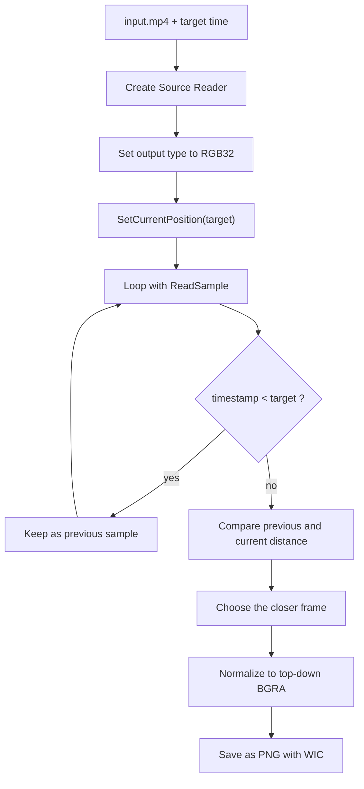

Needing a single frame from an MP4 at something like 12.3 seconds is a very ordinary requirement.  
Thumbnail generation, inspection logs, monitoring snapshots, and equipment-side evidence output all run into this shape sooner or later.

But Media Foundation is a little less straightforward here than it first looks.  
At a glance, it can feel as if `SetCurrentPosition` followed by one `ReadSample` call should be enough. In practice, key frames, sample timestamps, stride, image orientation, and the fourth byte of `RGB32` all matter. If you rush through it, the frame can drift from the requested time, the output can flip vertically, or the PNG can come out strangely transparent.

For the broader shape of Media Foundation itself, the earlier article [What Media Foundation Is - Why It Starts to Feel Like COM and Windows Media APIs at the Same Time](https://comcomponent.com/en/blog/2026/03/09/002-media-foundation-why-it-feels-like-com/) is a useful companion.  
This article goes one layer lower and focuses only on **pulling one still image from an MP4**.

The target here is simple: use `IMFSourceReader` to extract **the frame nearest a requested timestamp** and save it as PNG from a native C++ desktop application.

## 1. Short version

- For pulling a single frame from MP4, `Source Reader` is usually a calmer entry point than `Media Session`
- `IMFSourceReader::SetCurrentPosition` does not guarantee exact seek. It usually lands a little earlier, often near a key frame, so you need to advance with `ReadSample` and compare neighboring timestamps
- `ReadSample` can succeed while still returning `pSample == nullptr`, so both `flags` and `pSample` need to be checked
- `MFVideoFormat_RGB32` is convenient for output, but its fourth byte should not be assumed to already be a valid alpha channel
- If you normalize stride and image orientation before saving, the PNG side becomes much more stable

So the practical flow is less like `seek -> read once -> save` and more like `seek -> compare surrounding timestamps -> normalize stride/orientation -> save as PNG`.

## 2. Assumptions

This article assumes the following.

- the input is a local MP4 file
- only one still image is needed
- the result should be the frame **nearest** the requested time, not an unrealistic exact frame guarantee
- the implementation uses synchronous `IMFSourceReader`
- the output format is PNG through WIC
- only built-in Windows APIs are used
- the MP4 is an ordinary file whose resolution does not change midstream

If you also need playback control, audio sync, timeline UI, or transport controls, the design changes. But for **extract one frame**, this path is usually the easiest one to reason about.

## 3. The processing flow

| Step | API | Role |
| --- | --- | --- |
| Open the MP4 | `MFCreateSourceReaderFromURL` | Create the media source from a file |
| Select only the video stream | `SetStreamSelection` | Skip audio |
| Convert to RGB32 | `SetCurrentMediaType` + `MF_SOURCE_READER_ENABLE_VIDEO_PROCESSING` | Get an uncompressed frame format that is easy to save |
| Move to the requested time | `SetCurrentPosition` | Seek in 100-nanosecond units |
| Read decoded samples | `ReadSample` | Pull one video sample at a time |
| Compare the frame before and after the target | sample timestamp | Decide which one is actually closer |
| Save as PNG | WIC | Write the final image file |

The selection rule used here is:

- seek first
- keep the last sample whose `timestamp < target`
- when the first `timestamp >= target` sample arrives, compare its distance against the previous one
- choose whichever frame is closer

That gives a frame that is actually close to the requested time, not just "the first frame after seek."



## 4. Pitfalls worth deciding first

### 4.1. `SetCurrentPosition` is not exact seek

`IMFSourceReader::SetCurrentPosition` does not promise exact frame-accurate seeking.  
On real MP4 files it usually lands a little earlier, often near a key frame. That makes this implementation risky:

- call `SetCurrentPosition(target)`
- call `ReadSample` once
- save that frame

With a longer GOP, the result can be visibly earlier than requested.

### 4.2. `ReadSample` can succeed with `pSample == nullptr`

Even when `ReadSample` returns `S_OK`, `ppSample` can still be `NULL`.  
For end-of-stream or stream-gap situations, the real meaning is in `flags`. So the stable check is always the three-piece set:

- `HRESULT`
- `flags`
- `pSample`

### 4.3. Stride and orientation matter

You cannot safely assume that the image buffer is just `width * bytesPerPixel` packed in a flat row-major block.  
There can be per-row padding, and RGB-style buffers can also behave like bottom-up images depending on the path.

The practical fix is to normalize everything into a **top-down contiguous BGRA buffer** before saving.

### 4.4. Do not blindly trust the fourth byte of `RGB32`

`MFVideoFormat_RGB32` is convenient, but it is not automatically "clean 32bpp BGRA ready for PNG."  
If the fourth byte contains zeroes and you feed it directly into a PNG encoder that expects alpha, the image can come out transparent.

In this article's approach, that byte is explicitly forced to `0xFF` before writing PNG.

## 5. Implementation flow

### 5.1. Create the Source Reader in synchronous mode

Because the target is only one frame, synchronous `ReadSample` keeps the implementation calmer than a callback-based reader.

At creation time, the setup is:

- `MF_SOURCE_READER_ENABLE_VIDEO_PROCESSING = TRUE`
- disable every stream first
- enable `MF_SOURCE_READER_FIRST_VIDEO_STREAM`
- set the output type to `MFMediaType_Video` + `MFVideoFormat_RGB32`

That makes the later stages much easier to write.

### 5.2. After seek, keep reading until the target is bracketed

Do not save immediately after the seek.  
Read forward until you have:

- the last sample before the target
- the first sample at or after the target

Then compare the distances and keep the closer one.

### 5.3. Convert the sample into top-down BGRA

Before saving:

- call `ConvertToContiguousBuffer`
- lock the media buffer
- copy row by row into a top-down destination buffer
- force alpha bytes to `0xFF`

That keeps the WIC side simple and predictable.

### 5.4. Let WIC handle PNG writing

The roles are cleanly split:

- Media Foundation pulls the video frame
- WIC writes the image file

That is usually the least confusing combination for this use case.

## 6. Code excerpts

The most important part is the post-seek comparison logic.

```cpp
HRESULT ReadNearestVideoSample(
    IMFSourceReader* pReader,
    LONGLONG targetHns,
    IMFSample** ppSelectedSample,
    LONGLONG* phnsSelected)
{
    if (pReader == nullptr || ppSelectedSample == nullptr || phnsSelected == nullptr)
    {
        return E_POINTER;
    }

    *ppSelectedSample = nullptr;
    *phnsSelected = 0;

    PROPVARIANT var;
    PropVariantInit(&var);
    var.vt = VT_I8;
    var.hVal.QuadPart = targetHns;

    HRESULT hr = pReader->SetCurrentPosition(GUID_NULL, var);
    PropVariantClear(&var);
    if (FAILED(hr))
    {
        return hr;
    }

    IMFSample* pPrevSample = nullptr;
    LONGLONG prevTime = 0;

    for (;;)
    {
        DWORD flags = 0;
        LONGLONG sampleTime = 0;
        IMFSample* pSample = nullptr;

        hr = pReader->ReadSample(
            MF_SOURCE_READER_FIRST_VIDEO_STREAM,
            0,
            nullptr,
            &flags,
            &sampleTime,
            &pSample);

        if (FAILED(hr))
        {
            SafeRelease(&pPrevSample);
            return hr;
        }

        if (flags & MF_SOURCE_READERF_ENDOFSTREAM)
        {
            if (pPrevSample != nullptr)
            {
                *ppSelectedSample = pPrevSample;
                *phnsSelected = prevTime;
                return S_OK;
            }

            return MF_E_END_OF_STREAM;
        }

        if (pSample == nullptr)
        {
            continue;
        }

        if (sampleTime < targetHns)
        {
            SafeRelease(&pPrevSample);
            pPrevSample = pSample;
            prevTime = sampleTime;
            continue;
        }

        if (pPrevSample == nullptr)
        {
            *ppSelectedSample = pSample;
            *phnsSelected = sampleTime;
            return S_OK;
        }

        const LONGLONG prevDelta = targetHns - prevTime;
        const LONGLONG currDelta = sampleTime - targetHns;

        if (prevDelta <= currDelta)
        {
            *ppSelectedSample = pPrevSample;
            *phnsSelected = prevTime;
            SafeRelease(&pSample);
        }
        else
        {
            *ppSelectedSample = pSample;
            *phnsSelected = sampleTime;
            SafeRelease(&pPrevSample);
        }

        return S_OK;
    }
}
```

Then the sample needs to be normalized before PNG writing.

```cpp
HRESULT CopySampleToTopDownBgra(
    IMFSample* pSample,
    IMFMediaType* pCurrentType,
    std::vector<BYTE>& outPixels,
    UINT32* pWidth,
    UINT32* pHeight)
{
    if (pSample == nullptr || pCurrentType == nullptr || pWidth == nullptr || pHeight == nullptr)
    {
        return E_POINTER;
    }

    UINT32 width = 0;
    UINT32 height = 0;
    HRESULT hr = MFGetAttributeSize(pCurrentType, MF_MT_FRAME_SIZE, &width, &height);
    if (FAILED(hr))
    {
        return hr;
    }

    LONG stride = static_cast<LONG>(4 * width);

    IMFMediaBuffer* pBuffer = nullptr;
    hr = pSample->ConvertToContiguousBuffer(&pBuffer);
    if (FAILED(hr))
    {
        return hr;
    }

    BYTE* pData = nullptr;
    DWORD maxLen = 0;
    DWORD curLen = 0;
    hr = pBuffer->Lock(&pData, &maxLen, &curLen);
    if (FAILED(hr))
    {
        SafeRelease(&pBuffer);
        return hr;
    }

    outPixels.resize(static_cast<size_t>(width) * static_cast<size_t>(height) * 4);

    for (UINT32 y = 0; y < height; ++y)
    {
        const BYTE* pSrc = pData + static_cast<size_t>(y) * static_cast<size_t>(std::abs(stride));
        BYTE* pDst = outPixels.data() + static_cast<size_t>(y) * static_cast<size_t>(width) * 4;

        std::memcpy(pDst, pSrc, static_cast<size_t>(width) * 4);

        for (UINT32 x = 0; x < width; ++x)
        {
            pDst[4 * x + 3] = 0xFF;
        }
    }

    pBuffer->Unlock();
    SafeRelease(&pBuffer);

    *pWidth = width;
    *pHeight = height;
    return S_OK;
}
```

The important points are:

1. choose the frame by comparing both sides of the target time
2. treat `HRESULT`, `flags`, and `pSample` as a set
3. normalize stride/orientation and force opaque alpha before PNG writing

For a single still-image extraction flow, `ConvertToContiguousBuffer` is usually practical enough. If you later need to extract many frames from one file, there is room to reduce copying further.

## 7. Build notes

This is intended for a native C++ desktop application on Windows 10 / 11.

- Unicode build
- x64 preferred
- link `mfplat.lib`, `mfreadwrite.lib`, `mfuuid.lib`, `ole32.lib`, `propsys.lib`, `windowscodecs.lib`

A command-line shape like this is enough:

```text
ExtractFrameFromMp4.exe C:\work\input.mp4 12.345 C:\work\frame.png
```

It is also useful to print the requested time and the actual chosen frame timestamp after saving.

## 8. Practical checklist

| Item | What to check | What tends to go wrong otherwise |
| --- | --- | --- |
| Seek accuracy | Do not decide on the first sample immediately after `SetCurrentPosition` | The saved frame can be much earlier than expected |
| Null sample handling | Check `HRESULT`, `flags`, and `pSample` together | End-of-stream and stream-gap paths can crash |
| Stride | Respect actual row layout and orientation | The image can break or flip vertically |
| Fourth byte of RGB32 | Force alpha to `0xFF` before PNG writing | The PNG can become transparent |
| Time range | Keep `0 <= target < duration` | End-of-file behavior gets messy |
| Repeated extraction | Reuse the reader and seek repeatedly | Recreating everything wastes time |

## 9. Summary

Extracting a still image from MP4 with Media Foundation is not hard, but it is also not quite as trivial as `seek -> read once -> save`.

The parts worth deciding explicitly are:

- seek is not exact
- the frame should be chosen by timestamp comparison
- `ReadSample` can succeed without returning a usable sample
- stride and orientation should be normalized before saving
- the fourth byte of `RGB32` should not be blindly trusted as alpha

Once those points are handled, the workflow becomes stable enough for thumbnails, monitoring snapshots, and evidence-style frame extraction.

## 10. References

- Microsoft Learn: [Using the Source Reader to Process Media Data](https://learn.microsoft.com/en-us/windows/win32/medfound/processing-media-data-with-the-source-reader)
- Microsoft Learn: [`IMFSourceReader::SetCurrentPosition`](https://learn.microsoft.com/en-us/windows/win32/api/mfreadwrite/nf-mfreadwrite-imfsourcereader-setcurrentposition)
- Microsoft Learn: [`IMFSourceReader::ReadSample`](https://learn.microsoft.com/en-us/windows/win32/api/mfreadwrite/nf-mfreadwrite-imfsourcereader-readsample)
- Microsoft Learn: [`IMFSourceReader::SetCurrentMediaType`](https://learn.microsoft.com/en-us/windows/win32/api/mfreadwrite/nf-mfreadwrite-imfsourcereader-setcurrentmediatype)
- Microsoft Learn: [`IMF2DBuffer`](https://learn.microsoft.com/en-us/windows/win32/api/mfobjects/nn-mfobjects-imf2dbuffer)
- Microsoft Learn: [Uncompressed Video Buffers](https://learn.microsoft.com/en-us/windows/win32/medfound/uncompressed-video-buffers)
- Microsoft Learn: [Image Stride](https://learn.microsoft.com/en-us/windows/win32/medfound/image-stride)
- Microsoft Learn: [MF_MT_FRAME_SIZE attribute](https://learn.microsoft.com/en-us/windows/win32/medfound/mf-mt-frame-size-attribute)
- Microsoft Learn: [Native pixel formats overview (WIC)](https://learn.microsoft.com/en-us/windows/win32/wic/-wic-codec-native-pixel-formats)
- Microsoft Learn: [Uncompressed RGB Video Subtypes](https://learn.microsoft.com/en-us/windows/win32/directshow/uncompressed-rgb-video-subtypes)
