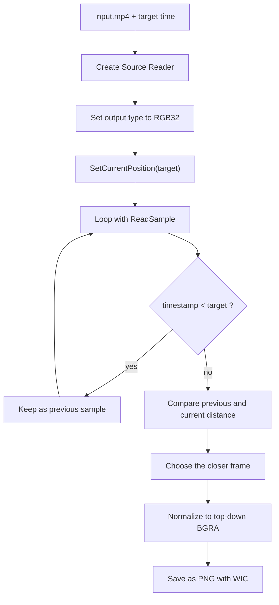

---
title: "How to Extract a Still Image from an MP4 with Media Foundation - A Single .cpp File You Can Paste into a C++ Console App"
date: 2026-03-15 10:00
lang: en
translation_key: media-foundation-extract-still-image-from-mp4-at-specific-time
permalink: /en/blog/2026/03/15/000-media-foundation-extract-still-image-from-mp4-at-specific-time/
tags:
  - Media Foundation
  - C++
  - Windows Development
  - WIC
author: Go Komura
description: "How to use the Media Foundation Source Reader to extract the frame nearest a target timestamp from an MP4 and save it as PNG, with a final one-file .cpp sample that is easy to paste into a Visual Studio C++ console app."
consultation_services:
  - id: windows-app-development
    reason: "This topic connects directly to Windows application work that needs Media Foundation, Source Reader, WIC, and practical still-image extraction from video."
  - id: technical-consulting
    reason: "If the main need is to sort out seek accuracy, frame format handling, stride, and image orientation before implementation, this also fits technical consulting and design review."
---

Needing a single frame from an MP4 at something like 12.3 seconds is a very ordinary requirement.  
Thumbnail generation, inspection logs, monitoring snapshots, and equipment-side evidence output all run into this shape sooner or later.

But Media Foundation is a little less straightforward here than it first looks.  
At a glance, it can feel as if `SetCurrentPosition` followed by one `ReadSample` call should be enough. In practice, key frames, sample timestamps, stride, image orientation, and the fourth byte of `RGB32` all matter. If you rush through it, the frame can drift from the requested time, the output can flip vertically, or the PNG can come out strangely transparent.

For the broader shape of Media Foundation itself, the earlier article [What Media Foundation Is - Why It Starts to Feel Like COM and Windows Media APIs at the Same Time](https://comcomponent.com/en/blog/2026/03/09/002-media-foundation-why-it-feels-like-com/) is a useful companion.  
This article goes one layer lower and focuses only on **pulling one still image from an MP4**.

The target here is simple: use `IMFSourceReader` to extract **the frame nearest a requested timestamp** and save it as PNG from a native C++ desktop application. And at the end, instead of leaving the article as scattered fragments, there is a **single-file `.cpp` version** meant to be easy to paste into a Visual Studio console project.

## 1. Short version

- For pulling a single frame from MP4, `Source Reader` is usually a calmer entry point than `Media Session`
- `IMFSourceReader::SetCurrentPosition` does not guarantee exact seek. It usually lands a little earlier, often near a key frame, so you need to advance with `ReadSample` and compare neighboring timestamps
- `ReadSample` can succeed while still returning `pSample == nullptr`, so both `flags` and `pSample` need to be checked
- `MFVideoFormat_RGB32` is convenient for output, but its fourth byte should not be assumed to already be a valid alpha channel
- If you normalize stride and image orientation before saving, the PNG side becomes much more stable

So the practical flow is less like `seek -> read once -> save` and more like `seek -> compare surrounding timestamps -> normalize stride/orientation -> save as PNG`.

## 2. Assumptions

This article assumes the following.

- the input is a local MP4 file
- only one still image is needed
- the result should be the frame **nearest** the requested time, not an unrealistic exact frame guarantee
- the implementation uses synchronous `IMFSourceReader`
- the output format is PNG through WIC
- only built-in Windows APIs are used
- the MP4 is an ordinary file whose resolution does not change midstream

If you also need playback control, audio sync, timeline UI, or transport controls, the design changes. But for **extract one frame**, this path is usually the easiest one to reason about.

## 3. The processing flow

| Step | API | Role |
| --- | --- | --- |
| Open the MP4 | `MFCreateSourceReaderFromURL` | Create the media source from a file |
| Select only the video stream | `SetStreamSelection` | Skip audio |
| Convert to RGB32 | `SetCurrentMediaType` + `MF_SOURCE_READER_ENABLE_VIDEO_PROCESSING` | Get an uncompressed frame format that is easy to save |
| Move to the requested time | `SetCurrentPosition` | Seek in 100-nanosecond units |
| Read decoded samples | `ReadSample` | Pull one video sample at a time |
| Compare the frame before and after the target | sample timestamp | Decide which one is actually closer |
| Save as PNG | WIC | Write the final image file |

The selection rule used here is:

- seek first
- keep the last sample whose `timestamp < target`
- when the first `timestamp >= target` sample arrives, compare its distance against the previous one
- choose whichever frame is closer

That gives a frame that is actually close to the requested time, not just "the first frame after seek."



## 4. Pitfalls worth deciding first

### 4.1. `SetCurrentPosition` is not exact seek

`IMFSourceReader::SetCurrentPosition` does not promise exact frame-accurate seeking.  
On real MP4 files it usually lands a little earlier, often near a key frame. That makes this implementation risky:

- call `SetCurrentPosition(target)`
- call `ReadSample` once
- save that frame

With a longer GOP, the result can be visibly earlier than requested.

### 4.2. `ReadSample` can succeed with `pSample == nullptr`

Even when `ReadSample` returns `S_OK`, `ppSample` can still be `NULL`.  
For end-of-stream or stream-gap situations, the real meaning is in `flags`. So the stable check is always the three-piece set:

- `HRESULT`
- `flags`
- `pSample`

### 4.3. Stride and orientation matter

You cannot safely assume that the image buffer is just `width * bytesPerPixel` packed in a flat row-major block.  
There can be per-row padding, and RGB-style buffers can also behave like bottom-up images depending on the path.

The practical fix is to normalize everything into a **top-down contiguous BGRA buffer** before saving.

### 4.4. Do not blindly trust the fourth byte of `RGB32`

`MFVideoFormat_RGB32` is convenient, but it is not automatically "clean 32bpp BGRA ready for PNG."  
If the fourth byte contains zeroes and you feed it directly into a PNG encoder that expects alpha, the image can come out transparent.

In this article's approach, that byte is explicitly forced to `0xFF` before writing PNG.

## 5. Implementation flow

### 5.1. Create the Source Reader in synchronous mode

Because the target is only one frame, synchronous `ReadSample` keeps the implementation calmer than a callback-based reader.

At creation time, the setup is:

- `MF_SOURCE_READER_ENABLE_VIDEO_PROCESSING = TRUE`
- disable every stream first
- enable `MF_SOURCE_READER_FIRST_VIDEO_STREAM`
- set the output type to `MFMediaType_Video` + `MFVideoFormat_RGB32`

That makes the later stages much easier to write.

### 5.2. After seek, keep reading until the target is bracketed

Do not save immediately after the seek.  
Read forward until you have:

- the last sample before the target
- the first sample at or after the target

Then compare the distances and keep the closer one.

### 5.3. Convert the sample into top-down BGRA

Before saving:

- call `ConvertToContiguousBuffer`
- lock the media buffer
- copy row by row into a top-down destination buffer
- force alpha bytes to `0xFF`

That keeps the WIC side simple and predictable.

### 5.4. Let WIC handle PNG writing

The roles are cleanly split:

- Media Foundation pulls the video frame
- WIC writes the image file

That is usually the least confusing combination for this use case.

## 6. Practical checklist

| Item | What to check | What tends to go wrong otherwise |
| --- | --- | --- |
| Seek accuracy | Do not decide on the first sample immediately after `SetCurrentPosition` | The saved frame can be much earlier than expected |
| Null sample handling | Check `HRESULT`, `flags`, and `pSample` together | End-of-stream and stream-gap paths can crash |
| Stride | Respect actual row layout and orientation | The image can break or flip vertically |
| Fourth byte of RGB32 | Force alpha to `0xFF` before PNG writing | The PNG can become transparent |
| Time range | Keep `0 <= target < duration` | End-of-file behavior gets messy |
| Repeated extraction | Reuse the reader and seek repeatedly | Recreating everything wastes time |
| Copy cost | If extracting many frames, think about the cost of `ConvertToContiguousBuffer` | CPU and memory bandwidth get wasted |
| Format changes | Treat midstream resolution changes as a separate design problem | Width/height assumptions can break |

## 7. Build and run notes

The code at the end of the article is meant to be **easy to drop into a Visual Studio C++ console application as one `.cpp` file**.

The most useful points to remember are:

- `#pragma comment(lib, ...)` is already included, so additional linker setup is usually unnecessary
- `wmain` is used, so command-line arguments stay in Unicode cleanly
- if the default console template already expects `pch.h` or `stdafx.h`, the code tries to include it with `__has_include`
- if the project still forces a custom precompiled-header setting, this one `.cpp` file can simply be set to "Not Using Precompiled Headers"
- x64 is still the practical default

The command-line shape is:

```text
ExtractFrameFromMp4.exe C:\work\input.mp4 12.345 C:\work\frame.png
```

## 8. Summary

Extracting a still image from MP4 with Media Foundation is not hard, but it is also not quite as trivial as `seek -> read once -> save`.

The parts worth deciding explicitly are:

- seek is not exact
- the frame should be chosen by timestamp comparison
- `ReadSample` can succeed without returning a usable sample
- stride and orientation should be normalized before saving
- the fourth byte of `RGB32` should not be blindly trusted as alpha

Once those points are handled, the workflow becomes stable enough for thumbnails, monitoring snapshots, and evidence-style frame extraction.

## 9. References

- Microsoft Learn: [Using the Source Reader to Process Media Data](https://learn.microsoft.com/en-us/windows/win32/medfound/processing-media-data-with-the-source-reader)
- Microsoft Learn: [`IMFSourceReader::SetCurrentPosition`](https://learn.microsoft.com/en-us/windows/win32/api/mfreadwrite/nf-mfreadwrite-imfsourcereader-setcurrentposition)
- Microsoft Learn: [`IMFSourceReader::ReadSample`](https://learn.microsoft.com/en-us/windows/win32/api/mfreadwrite/nf-mfreadwrite-imfsourcereader-readsample)
- Microsoft Learn: [`IMFSourceReader::SetCurrentMediaType`](https://learn.microsoft.com/en-us/windows/win32/api/mfreadwrite/nf-mfreadwrite-imfsourcereader-setcurrentmediatype)
- Microsoft Learn: [`IMF2DBuffer`](https://learn.microsoft.com/en-us/windows/win32/api/mfobjects/nn-mfobjects-imf2dbuffer)
- Microsoft Learn: [`IMF2DBuffer::Lock2D`](https://learn.microsoft.com/en-us/windows/win32/api/mfobjects/nf-mfobjects-imf2dbuffer-lock2d)
- Microsoft Learn: [Uncompressed Video Buffers](https://learn.microsoft.com/en-us/windows/win32/medfound/uncompressed-video-buffers)
- Microsoft Learn: [Image Stride](https://learn.microsoft.com/en-us/windows/win32/medfound/image-stride)
- Microsoft Learn: [MF_MT_FRAME_SIZE attribute](https://learn.microsoft.com/en-us/windows/win32/medfound/mf-mt-frame-size-attribute)
- Microsoft Learn: [MF_MT_DEFAULT_STRIDE attribute](https://learn.microsoft.com/en-us/windows/win32/medfound/mf-mt-default-stride-attribute)
- Microsoft Learn: [Native pixel formats overview (WIC)](https://learn.microsoft.com/en-us/windows/win32/wic/-wic-codec-native-pixel-formats)
- Microsoft Learn: [Uncompressed RGB Video Subtypes](https://learn.microsoft.com/en-us/windows/win32/directshow/uncompressed-rgb-video-subtypes)

## 10. Full `.cpp` code you can paste directly

The final block below is intended for direct use in a Visual Studio C++ console app project. The command-line arguments are `input.mp4`, `seconds`, and `output.png`, in that order. The code is kept as a single self-contained `.cpp` so it is easy to paste into a project.

```cpp
#define NOMINMAX
#if defined(_MSC_VER)
#  if __has_include("pch.h")
#    include "pch.h"
#  elif __has_include("stdafx.h")
#    include "stdafx.h"
#  endif
#endif
#include <windows.h>
#include <mfapi.h>
#include <mfidl.h>
#include <mfreadwrite.h>
#include <mferror.h>
#include <mfobjects.h>
#include <propvarutil.h>
#include <wincodec.h>

#include <cerrno>
#include <cstdio>
#include <cstdlib>
#include <cwchar>
#include <cmath>
#include <cstring>
#include <limits>
#include <vector>

#pragma comment(lib, "mfplat.lib")
#pragma comment(lib, "mfreadwrite.lib")
#pragma comment(lib, "mfuuid.lib")
#pragma comment(lib, "ole32.lib")
#pragma comment(lib, "propsys.lib")
#pragma comment(lib, "windowscodecs.lib")

template <class T>
void SafeRelease(T** pp)
{
    if (pp != nullptr && *pp != nullptr)
    {
        (*pp)->Release();
        *pp = nullptr;
    }
}

class MediaFoundationScope
{
public:
    MediaFoundationScope() : m_comInitialized(false), m_mfStarted(false)
    {
    }

    HRESULT Initialize()
    {
        HRESULT hr = CoInitializeEx(nullptr, COINIT_MULTITHREADED);
        if (hr == RPC_E_CHANGED_MODE)
        {
            return hr;
        }

        if (SUCCEEDED(hr))
        {
            m_comInitialized = true;
        }

        hr = MFStartup(MF_VERSION);
        if (FAILED(hr))
        {
            if (m_comInitialized)
            {
                CoUninitialize();
                m_comInitialized = false;
            }
            return hr;
        }

        m_mfStarted = true;
        return S_OK;
    }

    ~MediaFoundationScope()
    {
        if (m_mfStarted)
        {
            MFShutdown();
        }

        if (m_comInitialized)
        {
            CoUninitialize();
        }
    }

private:
    bool m_comInitialized;
    bool m_mfStarted;
};

HRESULT GetPresentationDuration(IMFSourceReader* pReader, LONGLONG* phnsDuration)
{
    if (pReader == nullptr || phnsDuration == nullptr)
    {
        return E_POINTER;
    }

    PROPVARIANT var;
    PropVariantInit(&var);

    HRESULT hr = pReader->GetPresentationAttribute(
        MF_SOURCE_READER_MEDIASOURCE,
        MF_PD_DURATION,
        &var);

    if (SUCCEEDED(hr))
    {
        hr = PropVariantToInt64(var, phnsDuration);
    }

    PropVariantClear(&var);
    return hr;
}

HRESULT GetDefaultStride(IMFMediaType* pType, LONG* plStride)
{
    if (pType == nullptr || plStride == nullptr)
    {
        return E_POINTER;
    }

    LONG lStride = 0;
    HRESULT hr = pType->GetUINT32(
        MF_MT_DEFAULT_STRIDE,
        reinterpret_cast<UINT32*>(&lStride));

    if (FAILED(hr))
    {
        GUID subtype = GUID_NULL;
        UINT32 width = 0;
        UINT32 height = 0;

        hr = pType->GetGUID(MF_MT_SUBTYPE, &subtype);
        if (FAILED(hr))
        {
            return hr;
        }

        hr = MFGetAttributeSize(pType, MF_MT_FRAME_SIZE, &width, &height);
        if (FAILED(hr))
        {
            return hr;
        }

        hr = MFGetStrideForBitmapInfoHeader(subtype.Data1, width, &lStride);
        if (FAILED(hr))
        {
            return hr;
        }

        (void)pType->SetUINT32(MF_MT_DEFAULT_STRIDE, static_cast<UINT32>(lStride));
    }

    *plStride = lStride;
    return S_OK;
}

class BufferLock
{
public:
    explicit BufferLock(IMFMediaBuffer* pBuffer)
        : m_pBuffer(pBuffer),
          m_p2DBuffer(nullptr),
          m_locked(false)
    {
        if (m_pBuffer != nullptr)
        {
            m_pBuffer->AddRef();
            (void)m_pBuffer->QueryInterface(IID_PPV_ARGS(&m_p2DBuffer));
        }
    }

    ~BufferLock()
    {
        UnlockBuffer();
        SafeRelease(&m_p2DBuffer);
        SafeRelease(&m_pBuffer);
    }

    HRESULT LockBuffer(
        LONG defaultStride,
        DWORD heightInPixels,
        BYTE** ppScanLine0,
        LONG* plStride)
    {
        if (ppScanLine0 == nullptr || plStride == nullptr)
        {
            return E_POINTER;
        }

        *ppScanLine0 = nullptr;
        *plStride = 0;

        HRESULT hr = S_OK;

        if (m_p2DBuffer != nullptr)
        {
            hr = m_p2DBuffer->Lock2D(ppScanLine0, plStride);
        }
        else
        {
            BYTE* pData = nullptr;
            hr = m_pBuffer->Lock(&pData, nullptr, nullptr);
            if (SUCCEEDED(hr))
            {
                *plStride = defaultStride;

                if (defaultStride < 0)
                {
                    const size_t strideAbs = static_cast<size_t>(-defaultStride);
                    *ppScanLine0 = pData + strideAbs * (heightInPixels - 1);
                }
                else
                {
                    *ppScanLine0 = pData;
                }
            }
        }

        m_locked = SUCCEEDED(hr);
        return hr;
    }

    void UnlockBuffer()
    {
        if (!m_locked)
        {
            return;
        }

        if (m_p2DBuffer != nullptr)
        {
            (void)m_p2DBuffer->Unlock2D();
        }
        else if (m_pBuffer != nullptr)
        {
            (void)m_pBuffer->Unlock();
        }

        m_locked = false;
    }

private:
    IMFMediaBuffer* m_pBuffer;
    IMF2DBuffer* m_p2DBuffer;
    bool m_locked;
};

HRESULT CreateConfiguredSourceReader(PCWSTR inputPath, IMFSourceReader** ppReader)
{
    if (inputPath == nullptr || ppReader == nullptr)
    {
        return E_POINTER;
    }

    *ppReader = nullptr;

    IMFAttributes* pAttributes = nullptr;
    IMFSourceReader* pReader = nullptr;
    IMFMediaType* pRequestedType = nullptr;

    HRESULT hr = MFCreateAttributes(&pAttributes, 1);
    if (FAILED(hr))
    {
        goto done;
    }

    hr = pAttributes->SetUINT32(MF_SOURCE_READER_ENABLE_VIDEO_PROCESSING, TRUE);
    if (FAILED(hr))
    {
        goto done;
    }

    hr = MFCreateSourceReaderFromURL(inputPath, pAttributes, &pReader);
    if (FAILED(hr))
    {
        goto done;
    }

    hr = pReader->SetStreamSelection(MF_SOURCE_READER_ALL_STREAMS, FALSE);
    if (FAILED(hr))
    {
        goto done;
    }

    hr = pReader->SetStreamSelection(MF_SOURCE_READER_FIRST_VIDEO_STREAM, TRUE);
    if (FAILED(hr))
    {
        goto done;
    }

    hr = MFCreateMediaType(&pRequestedType);
    if (FAILED(hr))
    {
        goto done;
    }

    hr = pRequestedType->SetGUID(MF_MT_MAJOR_TYPE, MFMediaType_Video);
    if (FAILED(hr))
    {
        goto done;
    }

    hr = pRequestedType->SetGUID(MF_MT_SUBTYPE, MFVideoFormat_RGB32);
    if (FAILED(hr))
    {
        goto done;
    }

    hr = pReader->SetCurrentMediaType(
        MF_SOURCE_READER_FIRST_VIDEO_STREAM,
        nullptr,
        pRequestedType);
    if (FAILED(hr))
    {
        goto done;
    }

    *ppReader = pReader;
    pReader = nullptr;

done:
    SafeRelease(&pRequestedType);
    SafeRelease(&pReader);
    SafeRelease(&pAttributes);
    return hr;
}

HRESULT SeekSourceReader(IMFSourceReader* pReader, LONGLONG targetHns)
{
    if (pReader == nullptr)
    {
        return E_POINTER;
    }

    PROPVARIANT var;
    PropVariantInit(&var);

    HRESULT hr = InitPropVariantFromInt64(targetHns, &var);
    if (SUCCEEDED(hr))
    {
        hr = pReader->SetCurrentPosition(GUID_NULL, var);
    }

    PropVariantClear(&var);
    return hr;
}

HRESULT ReadNearestVideoSample(
    IMFSourceReader* pReader,
    LONGLONG targetHns,
    IMFSample** ppSample,
    LONGLONG* pChosenTimestampHns)
{
    if (pReader == nullptr || ppSample == nullptr)
    {
        return E_POINTER;
    }

    *ppSample = nullptr;
    if (pChosenTimestampHns != nullptr)
    {
        *pChosenTimestampHns = 0;
    }

    IMFSample* pBefore = nullptr;
    LONGLONG beforeTimestamp = 0;
    bool hasBefore = false;

    HRESULT hr = S_OK;

    for (;;)
    {
        IMFSample* pCurrent = nullptr;
        DWORD flags = 0;
        LONGLONG currentTimestamp = 0;

        hr = pReader->ReadSample(
            MF_SOURCE_READER_FIRST_VIDEO_STREAM,
            0,
            nullptr,
            &flags,
            &currentTimestamp,
            &pCurrent);

        if (FAILED(hr))
        {
            SafeRelease(&pCurrent);
            break;
        }

        if ((flags & MF_SOURCE_READERF_ENDOFSTREAM) != 0)
        {
            SafeRelease(&pCurrent);

            if (hasBefore)
            {
                *ppSample = pBefore;
                pBefore = nullptr;

                if (pChosenTimestampHns != nullptr)
                {
                    *pChosenTimestampHns = beforeTimestamp;
                }

                hr = S_OK;
            }
            else
            {
                hr = MF_E_END_OF_STREAM;
            }
            break;
        }

        if ((flags & MF_SOURCE_READERF_STREAMTICK) != 0)
        {
            SafeRelease(&pCurrent);
            continue;
        }

        if (pCurrent == nullptr)
        {
            continue;
        }

        if (currentTimestamp < targetHns)
        {
            SafeRelease(&pBefore);
            pBefore = pCurrent;
            pCurrent = nullptr;
            beforeTimestamp = currentTimestamp;
            hasBefore = true;
            continue;
        }

        if (hasBefore)
        {
            const LONGLONG diffBefore = targetHns - beforeTimestamp;
            const LONGLONG diffCurrent = currentTimestamp - targetHns;

            if (diffBefore <= diffCurrent)
            {
                *ppSample = pBefore;
                pBefore = nullptr;

                if (pChosenTimestampHns != nullptr)
                {
                    *pChosenTimestampHns = beforeTimestamp;
                }

                SafeRelease(&pCurrent);
            }
            else
            {
                *ppSample = pCurrent;
                pCurrent = nullptr;

                if (pChosenTimestampHns != nullptr)
                {
                    *pChosenTimestampHns = currentTimestamp;
                }
            }
        }
        else
        {
            *ppSample = pCurrent;
            pCurrent = nullptr;

            if (pChosenTimestampHns != nullptr)
            {
                *pChosenTimestampHns = currentTimestamp;
            }
        }

        hr = S_OK;
        break;
    }

    SafeRelease(&pBefore);
    return hr;
}

HRESULT CopyContiguousBufferToTopDownBgra(
    IMFMediaBuffer* pBuffer,
    LONG defaultStride,
    UINT32 width,
    UINT32 height,
    std::vector<BYTE>& pixels,
    UINT32* pStride)
{
    if (pBuffer == nullptr || pStride == nullptr)
    {
        return E_POINTER;
    }

    BufferLock lock(pBuffer);

    BYTE* pScanLine0 = nullptr;
    LONG actualStride = 0;

    HRESULT hr = lock.LockBuffer(defaultStride, height, &pScanLine0, &actualStride);
    if (FAILED(hr))
    {
        return hr;
    }

    if (width > (std::numeric_limits<UINT32>::max() / 4))
    {
        return E_INVALIDARG;
    }

    const UINT32 destStride = width * 4;
    const LONG actualStrideAbs = (actualStride < 0) ? -actualStride : actualStride;
    if (actualStrideAbs < static_cast<LONG>(destStride))
    {
        return E_UNEXPECTED;
    }

    pixels.resize(static_cast<size_t>(destStride) * height);

    BYTE* pDestRow = pixels.data();
    BYTE* pSrcRow = pScanLine0;

    for (UINT32 y = 0; y < height; ++y)
    {
        std::memcpy(pDestRow, pSrcRow, destStride);

        // The 4th byte of MFVideoFormat_RGB32 is not guaranteed to be alpha,
        // so force it opaque before saving as PNG.
        for (UINT32 x = 0; x < width; ++x)
        {
            pDestRow[static_cast<size_t>(x) * 4 + 3] = 0xFF;
        }

        pDestRow += destStride;
        pSrcRow += actualStride;
    }

    *pStride = destStride;
    return S_OK;
}

HRESULT CopySampleToTopDownBgra(
    IMFSample* pSample,
    IMFMediaType* pCurrentType,
    std::vector<BYTE>& pixels,
    UINT32* pWidth,
    UINT32* pHeight,
    UINT32* pStride)
{
    if (pSample == nullptr || pCurrentType == nullptr ||
        pWidth == nullptr || pHeight == nullptr || pStride == nullptr)
    {
        return E_POINTER;
    }

    *pWidth = 0;
    *pHeight = 0;
    *pStride = 0;

    IMFMediaBuffer* pBuffer = nullptr;

    GUID subtype = GUID_NULL;
    UINT32 width = 0;
    UINT32 height = 0;
    LONG defaultStride = 0;

    HRESULT hr = pCurrentType->GetGUID(MF_MT_SUBTYPE, &subtype);
    if (FAILED(hr))
    {
        goto done;
    }

    if (!IsEqualGUID(subtype, MFVideoFormat_RGB32))
    {
        hr = MF_E_INVALIDMEDIATYPE;
        goto done;
    }

    hr = MFGetAttributeSize(pCurrentType, MF_MT_FRAME_SIZE, &width, &height);
    if (FAILED(hr))
    {
        goto done;
    }

    if (width == 0 || height == 0)
    {
        hr = E_UNEXPECTED;
        goto done;
    }

    hr = GetDefaultStride(pCurrentType, &defaultStride);
    if (FAILED(hr))
    {
        goto done;
    }

    hr = pSample->ConvertToContiguousBuffer(&pBuffer);
    if (FAILED(hr))
    {
        goto done;
    }

    hr = CopyContiguousBufferToTopDownBgra(
        pBuffer,
        defaultStride,
        width,
        height,
        pixels,
        pStride);
    if (FAILED(hr))
    {
        goto done;
    }

    *pWidth = width;
    *pHeight = height;

    hr = S_OK;

done:
    SafeRelease(&pBuffer);
    return hr;
}

HRESULT SaveBgraToPng(
    PCWSTR outputPath,
    const BYTE* pixels,
    UINT32 width,
    UINT32 height,
    UINT32 stride)
{
    if (outputPath == nullptr || pixels == nullptr)
    {
        return E_POINTER;
    }

    if (width == 0 || height == 0 || stride < width * 4)
    {
        return E_INVALIDARG;
    }

    const size_t bufferSizeSizeT = static_cast<size_t>(stride) * height;
    if (bufferSizeSizeT > static_cast<size_t>(std::numeric_limits<UINT>::max()))
    {
        return E_INVALIDARG;
    }

    const UINT bufferSize = static_cast<UINT>(bufferSizeSizeT);

    IWICImagingFactory* pFactory = nullptr;
    IWICStream* pStream = nullptr;
    IWICBitmapEncoder* pEncoder = nullptr;
    IWICBitmapFrameEncode* pFrame = nullptr;
    IPropertyBag2* pProps = nullptr;

    HRESULT hr = CoCreateInstance(
        CLSID_WICImagingFactory,
        nullptr,
        CLSCTX_INPROC_SERVER,
        IID_PPV_ARGS(&pFactory));
    if (FAILED(hr))
    {
        goto done;
    }

    hr = pFactory->CreateStream(&pStream);
    if (FAILED(hr))
    {
        goto done;
    }

    hr = pStream->InitializeFromFilename(outputPath, GENERIC_WRITE);
    if (FAILED(hr))
    {
        goto done;
    }

    hr = pFactory->CreateEncoder(GUID_ContainerFormatPng, nullptr, &pEncoder);
    if (FAILED(hr))
    {
        goto done;
    }

    hr = pEncoder->Initialize(pStream, WICBitmapEncoderNoCache);
    if (FAILED(hr))
    {
        goto done;
    }

    hr = pEncoder->CreateNewFrame(&pFrame, &pProps);
    if (FAILED(hr))
    {
        goto done;
    }

    hr = pFrame->Initialize(pProps);
    if (FAILED(hr))
    {
        goto done;
    }

    hr = pFrame->SetSize(width, height);
    if (FAILED(hr))
    {
        goto done;
    }

    WICPixelFormatGUID pixelFormat = GUID_WICPixelFormat32bppBGRA;
    hr = pFrame->SetPixelFormat(&pixelFormat);
    if (FAILED(hr))
    {
        goto done;
    }

    if (!IsEqualGUID(pixelFormat, GUID_WICPixelFormat32bppBGRA))
    {
        hr = WINCODEC_ERR_UNSUPPORTEDPIXELFORMAT;
        goto done;
    }

    hr = pFrame->WritePixels(
        height,
        stride,
        bufferSize,
        const_cast<BYTE*>(pixels));
    if (FAILED(hr))
    {
        goto done;
    }

    hr = pFrame->Commit();
    if (FAILED(hr))
    {
        goto done;
    }

    hr = pEncoder->Commit();

done:
    SafeRelease(&pProps);
    SafeRelease(&pFrame);
    SafeRelease(&pEncoder);
    SafeRelease(&pStream);
    SafeRelease(&pFactory);
    return hr;
}

HRESULT ExtractFrameFromMp4ToPng(
    PCWSTR inputPath,
    LONGLONG targetHns,
    PCWSTR outputPath,
    LONGLONG* pActualTimestampHns)
{
    if (inputPath == nullptr || outputPath == nullptr)
    {
        return E_POINTER;
    }

    if (targetHns < 0)
    {
        return E_INVALIDARG;
    }

    MediaFoundationScope mf;
    HRESULT hr = mf.Initialize();
    if (FAILED(hr))
    {
        return hr;
    }

    IMFSourceReader* pReader = nullptr;
    IMFMediaType* pCurrentType = nullptr;
    IMFSample* pChosenSample = nullptr;

    LONGLONG durationHns = 0;
    UINT32 width = 0;
    UINT32 height = 0;
    UINT32 stride = 0;
    std::vector<BYTE> pixels;

    hr = CreateConfiguredSourceReader(inputPath, &pReader);
    if (FAILED(hr))
    {
        goto done;
    }

    hr = pReader->GetCurrentMediaType(
        MF_SOURCE_READER_FIRST_VIDEO_STREAM,
        &pCurrentType);
    if (FAILED(hr))
    {
        goto done;
    }

    hr = GetPresentationDuration(pReader, &durationHns);
    if (FAILED(hr))
    {
        goto done;
    }

    if (targetHns >= durationHns)
    {
        hr = E_INVALIDARG;
        goto done;
    }

    hr = SeekSourceReader(pReader, targetHns);
    if (FAILED(hr))
    {
        goto done;
    }

    hr = ReadNearestVideoSample(
        pReader,
        targetHns,
        &pChosenSample,
        pActualTimestampHns);
    if (FAILED(hr))
    {
        goto done;
    }

    hr = CopySampleToTopDownBgra(
        pChosenSample,
        pCurrentType,
        pixels,
        &width,
        &height,
        &stride);
    if (FAILED(hr))
    {
        goto done;
    }

    hr = SaveBgraToPng(outputPath, pixels.data(), width, height, stride);

done:
    SafeRelease(&pChosenSample);
    SafeRelease(&pCurrentType);
    SafeRelease(&pReader);
    return hr;
}

bool TryParseSeconds(PCWSTR text, LONGLONG* phns)
{
    if (text == nullptr || phns == nullptr)
    {
        return false;
    }

    wchar_t* end = nullptr;
    errno = 0;

    const double seconds = std::wcstod(text, &end);
    if (end == text || *end != L'\0' || errno != 0)
    {
        return false;
    }

    if (!std::isfinite(seconds) || seconds < 0.0)
    {
        return false;
    }

    const long double hns =
        static_cast<long double>(seconds) * 10000000.0L;

    if (hns < 0.0L ||
        hns > static_cast<long double>(std::numeric_limits<LONGLONG>::max()))
    {
        return false;
    }

    *phns = static_cast<LONGLONG>(std::llround(hns));
    return true;
}

double HnsToSeconds(LONGLONG hns)
{
    return static_cast<double>(hns) / 10000000.0;
}

void PrintUsage()
{
    std::fwprintf(stderr, L"Usage:\n");
    std::fwprintf(stderr, L"  ExtractFrameFromMp4.exe <input.mp4> <seconds> <output.png>\n");
    std::fwprintf(stderr, L"\nExample:\n");
    std::fwprintf(stderr, L"  ExtractFrameFromMp4.exe input.mp4 12.345 output.png\n");
}

int wmain(int argc, wchar_t* argv[])
{
    if (argc != 4)
    {
        PrintUsage();
        return 1;
    }

    LONGLONG targetHns = 0;
    if (!TryParseSeconds(argv[2], &targetHns))
    {
        std::fwprintf(stderr, L"Invalid seconds: %ls\n", argv[2]);
        return 1;
    }

    LONGLONG actualHns = 0;
    HRESULT hr = ExtractFrameFromMp4ToPng(
        argv[1],
        targetHns,
        argv[3],
        &actualHns);

    if (FAILED(hr))
    {
        std::fwprintf(stderr, L"Failed. HRESULT = 0x%08lX\n", static_cast<unsigned long>(hr));
        return 1;
    }

    std::wprintf(L"Saved: %ls\n", argv[3]);
    std::wprintf(L"Requested: %.3f sec\n", HnsToSeconds(targetHns));
    std::wprintf(L"Actual: %.3f sec\n", HnsToSeconds(actualHns));
    return 0;
}
```

