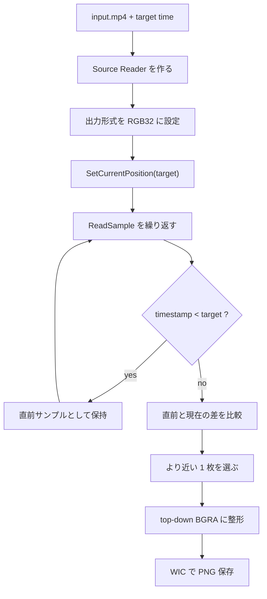

MP4 から「12.3 秒地点の 1 枚」を取りたい、という要件はかなり普通にあります。サムネイル生成、検査ログ、監視映像の代表フレーム、装置ログの証跡などです。

ただ、Media Foundation ではここが少しだけ素直ではありません。`SetCurrentPosition` のあとに `ReadSample` を 1 回呼べば終わりに見えるのですが、実際には key frame、timestamp、stride、画像の上下向き、`RGB32` の 4 バイト目などが絡みます。雑に進めると、時刻が少しズレる、画像が上下逆になる、PNG が妙に透明になる、という地味に嫌な事故が起きます。

Media Foundation の全体像そのものは、以前書いた [Media Foundation とは何か - COM と Windows メディア API の顔が見えてくる理由](https://comcomponent.com/blog/2026/03/09/002-media-foundation-why-it-feels-like-com/) も参考になります。今回はそこから一段降りて、**MP4 から 1 枚抜く** ところだけに絞ります。

この記事では、`IMFSourceReader` を使って、MP4 から **指定時刻に最も近い静止画を 1 枚取り出し、PNG として保存する** ところまでを整理します。コードはネイティブ C++ のデスクトップアプリ想定です。

## 1. まず結論

- MP4 から 1 枚抜くなら、今回は `Media Session` より `Source Reader` のほうが入口として素直です
- `IMFSourceReader::SetCurrentPosition` は exact seek を保証しません。通常は target の少し前、特に key frame 側へ寄るので、そのあと `ReadSample` を進めて目的時刻の前後を比較する必要があります
- `ReadSample` は成功しても `pSample == nullptr` のことがあります。`flags` と `pSample` の両方を見ます
- `MFVideoFormat_RGB32` は保存しやすいですが、その 4 バイト目を alpha と決め打ちすると透明 PNG になり得ます
- 行ごとの `stride` と top-down / bottom-up を吸収してから PNG 保存まで持っていくと、かなり事故りにくくなります

要するに、`seek -> 1 回読む -> 保存` では少し雑で、`seek -> timestamp を見ながら前後比較 -> stride を意識してコピー -> PNG 保存` くらいまでやると安定します。

## 2. 前提

今回は次の前提で進めます。

- 入力はローカルの MP4 ファイル
- 欲しいのは 1 枚の静止画
- 「指定時刻ぴったり」ではなく、「指定時刻に最も近いフレーム」を返す
- 実装は同期モードの `IMFSourceReader`
- 保存形式は WIC を使った PNG
- 外部ライブラリは使わず、Windows 標準 API だけで完結させる
- 途中で解像度が変わらない、一般的な MP4 を前提にする

再生や音声同期までやるなら別の設計もありますが、**1 フレーム取りたい** という用途ならこれがかなり分かりやすいです。

## 3. 処理の流れ

| やること | 使う API | 役割 |
| --- | --- | --- |
| MP4 を開く | `MFCreateSourceReaderFromURL` | ファイルからメディアソースを作る |
| 動画だけ選ぶ | `SetStreamSelection` | 音声を読まないようにする |
| RGB32 に変換する | `SetCurrentMediaType` + `MF_SOURCE_READER_ENABLE_VIDEO_PROCESSING` | 保存しやすい uncompressed frame を得る |
| 指定時刻へ移動する | `SetCurrentPosition` | 100ns 単位で seek する |
| フレームを読む | `ReadSample` | デコード済みサンプルを 1 枚ずつ取得する |
| 直前 / 直後を比較する | sample timestamp | 指定時刻に最も近い 1 枚を決める |
| PNG へ保存する | WIC | 画像ファイルへ書き出す |

今回の判定ルールは次です。

- seek 後に `ReadSample` を進める
- `timestamp < target` の最後のサンプルを保持する
- `timestamp >= target` の最初のサンプルが来たら、直前サンプルと現在サンプルの差を比較する
- より target に近いほうを採用する

これで「target 以降の最初の 1 枚」ではなく、**target に最も近い 1 枚** を取りやすくなります。



## 4. 先に押さえる落とし穴

### 4.1. `SetCurrentPosition` は exact seek ではない

`IMFSourceReader::SetCurrentPosition` は exact seeking を保証しません。動画では通常、指定位置の少し前、特に key frame 側へ寄ります。なので、次のような実装はかなり危ういです。

- `SetCurrentPosition(target)`
- `ReadSample` を 1 回
- その frame を保存

GOP が長い動画では、これでかなり普通にズレます。

### 4.2. `ReadSample` は成功でも `pSample == nullptr` があり得る

`ReadSample` は `S_OK` でも `ppSample` が `NULL` のことがあります。終端なら `MF_SOURCE_READERF_ENDOFSTREAM`、ストリームギャップなら `MF_SOURCE_READERF_STREAMTICK` などの flag が返ります。

なので、`HRESULT` だけ見て `pSample` を即参照するのは危険です。**`HRESULT`, `flags`, `pSample` を 3 点セットで見る** くらいが安全です。

### 4.3. `stride` と上下向きを雑に扱うと画像が崩れる

画像バッファは `width * bytesPerPixel` で一直線に詰まっているとは限りません。行末に padding が入ることもありますし、RGB 系は bottom-up になることもあります。

特に大事なのは次の 2 点です。

- `IMF2DBuffer::Lock2D` は scan line 0 の先頭ポインタと actual stride を返す
- bottom-up 画像では stride が負になることがある

今回は、**最終的に top-down の連続 BGRA バッファ** に詰め直してから PNG に渡す前提で進めます。

### 4.4. `MFVideoFormat_RGB32` の 4 バイト目を alpha と決め打ちしない

`MFVideoFormat_RGB32` は、そのまま PNG に渡せる「きれいな RGBA」ではありません。byte 0, 1, 2 が B, G, R で、byte 3 は alpha かもしれないし ignore かもしれません。

ここを `GUID_WICPixelFormat32bppBGRA` だと思ってそのまま保存すると、4 バイト目に 0 が入っていて画像が透明になることがあります。今回は **保存前に alpha を `0xFF` で埋めて完全不透明にする** 方針にします。

## 5. 実装の流れ

### 5.1. `Source Reader` を同期モードで作る

今回は 1 枚だけ取れればよいので、非同期 callback ではなく同期 `ReadSample` にします。Reader 作成時には次をやります。

- `MF_SOURCE_READER_ENABLE_VIDEO_PROCESSING = TRUE`
- すべての stream をいったん off
- `MF_SOURCE_READER_FIRST_VIDEO_STREAM` だけ on
- 出力 type を `MFMediaType_Video` / `MFVideoFormat_RGB32` に設定

### 5.2. seek のあとで timestamp を見ながら詰める

`SetCurrentPosition` のあと、いきなり保存しません。`ReadSample` で sample を読みながら、target より前の最後の 1 枚と、target をまたいだ最初の 1 枚を比較します。

この一手間で、seek の粗さをかなり吸収できます。

### 5.3. sample から top-down BGRA へ整形する

取り出した sample はそのまま PNG に書かず、いったん top-down の BGRA バッファに詰め直します。

- `ConvertToContiguousBuffer` で 1 本の buffer にする
- helper で actual stride を得る
- 行ごとに top-down buffer へコピーする
- alpha を `0xFF` にする

### 5.4. PNG 保存は WIC に任せる

保存は WIC の `IWICBitmapEncoder` / `IWICBitmapFrameEncode` を使います。Media Foundation で frame を取り、WIC で画像化する、という分担です。

## 6. コード抜粋

まず大事なのは、seek 後の前後比較です。ここで「指定時刻に最も近い 1 枚」を決めます。

```cpp
HRESULT ReadNearestVideoSample(
    IMFSourceReader* pReader,
    LONGLONG targetHns,
    IMFSample** ppSelectedSample,
    LONGLONG* phnsSelected)
{
    if (pReader == nullptr || ppSelectedSample == nullptr || phnsSelected == nullptr)
    {
        return E_POINTER;
    }

    *ppSelectedSample = nullptr;
    *phnsSelected = 0;

    PROPVARIANT var;
    PropVariantInit(&var);
    var.vt = VT_I8;
    var.hVal.QuadPart = targetHns;

    HRESULT hr = pReader->SetCurrentPosition(GUID_NULL, var);
    PropVariantClear(&var);
    if (FAILED(hr))
    {
        return hr;
    }

    IMFSample* pPrevSample = nullptr;
    LONGLONG prevTime = 0;

    for (;;)
    {
        DWORD flags = 0;
        LONGLONG sampleTime = 0;
        IMFSample* pSample = nullptr;

        hr = pReader->ReadSample(
            MF_SOURCE_READER_FIRST_VIDEO_STREAM,
            0,
            nullptr,
            &flags,
            &sampleTime,
            &pSample);

        if (FAILED(hr))
        {
            SafeRelease(&pPrevSample);
            return hr;
        }

        if (flags & MF_SOURCE_READERF_ENDOFSTREAM)
        {
            if (pPrevSample != nullptr)
            {
                *ppSelectedSample = pPrevSample;
                *phnsSelected = prevTime;
                return S_OK;
            }

            return MF_E_END_OF_STREAM;
        }

        if (pSample == nullptr)
        {
            continue;
        }

        if (sampleTime < targetHns)
        {
            SafeRelease(&pPrevSample);
            pPrevSample = pSample;
            prevTime = sampleTime;
            continue;
        }

        if (pPrevSample == nullptr)
        {
            *ppSelectedSample = pSample;
            *phnsSelected = sampleTime;
            return S_OK;
        }

        const LONGLONG prevDelta = targetHns - prevTime;
        const LONGLONG currDelta = sampleTime - targetHns;

        if (prevDelta <= currDelta)
        {
          *ppSelectedSample = pPrevSample;
          *phnsSelected = prevTime;
          SafeRelease(&pSample);
        }
        else
        {
          *ppSelectedSample = pSample;
          *phnsSelected = sampleTime;
          SafeRelease(&pPrevSample);
        }

        return S_OK;
    }
}
```

次に、保存前に stride と上下向きを吸収して top-down BGRA に整えるところです。

```cpp
HRESULT CopySampleToTopDownBgra(
    IMFSample* pSample,
    IMFMediaType* pCurrentType,
    std::vector<BYTE>& outPixels,
    UINT32* pWidth,
    UINT32* pHeight)
{
    if (pSample == nullptr || pCurrentType == nullptr || pWidth == nullptr || pHeight == nullptr)
    {
        return E_POINTER;
    }

    UINT32 width = 0;
    UINT32 height = 0;
    HRESULT hr = MFGetAttributeSize(pCurrentType, MF_MT_FRAME_SIZE, &width, &height);
    if (FAILED(hr))
    {
        return hr;
    }

    LONG stride = 0;
    hr = MFGetAttributeUINT32(
        pCurrentType,
        MF_MT_DEFAULT_STRIDE,
        static_cast<UINT32>(4 * width));
    if (SUCCEEDED(hr))
    {
        stride = static_cast<LONG>(MFGetAttributeUINT32(
            pCurrentType,
            MF_MT_DEFAULT_STRIDE,
            static_cast<UINT32>(4 * width)));
    }
    else
    {
        stride = static_cast<LONG>(4 * width);
    }

    IMFMediaBuffer* pBuffer = nullptr;
    hr = pSample->ConvertToContiguousBuffer(&pBuffer);
    if (FAILED(hr))
    {
        return hr;
    }

    BYTE* pData = nullptr;
    DWORD maxLen = 0;
    DWORD curLen = 0;
    hr = pBuffer->Lock(&pData, &maxLen, &curLen);
    if (FAILED(hr))
    {
        SafeRelease(&pBuffer);
        return hr;
    }

    outPixels.resize(static_cast<size_t>(width) * static_cast<size_t>(height) * 4);

    for (UINT32 y = 0; y < height; ++y)
    {
        const BYTE* pSrc = pData + static_cast<size_t>(y) * static_cast<size_t>(std::abs(stride));
        BYTE* pDst = outPixels.data() + static_cast<size_t>(y) * static_cast<size_t>(width) * 4;

        std::memcpy(pDst, pSrc, static_cast<size_t>(width) * 4);

        for (UINT32 x = 0; x < width; ++x)
        {
            pDst[4 * x + 3] = 0xFF;
        }
    }

    pBuffer->Unlock();
    SafeRelease(&pBuffer);

    *pWidth = width;
    *pHeight = height;
    return S_OK;
}
```

このサンプルで大事なのは次の 3 点です。

1. seek 後の前後比較で、指定時刻により近い 1 枚を選ぶこと
2. `HRESULT` だけでなく `pSample == nullptr` も見ること
3. 保存前に `stride` と alpha を整えておくこと

なお、今回は分かりやすさ優先で `ConvertToContiguousBuffer` を使っています。**1 枚だけ抜く** 用途ならこれで十分実用的です。1 本の動画から大量に連続抽出するなら、`GetBufferByIndex` と `IMF2DBuffer` を直接使ってコピー回数を減らす余地があります。

## 7. ビルド方法

Visual Studio の空の C++ コンソールアプリにこの実装を追加すれば動きます。

- 文字コードは Unicode
- 実行構成は x64 推奨
- Windows 10 / 11 のデスクトップアプリ前提
- `mfplat.lib`, `mfreadwrite.lib`, `mfuuid.lib`, `ole32.lib`, `propsys.lib`, `windowscodecs.lib` をリンクする

実行イメージは次のとおりです。

```text
ExtractFrameFromMp4.exe C:\work\input.mp4 12.345 C:\work\frame.png
```

成功したら、保存先パスと要求時刻 / 実際に採用した frame の timestamp を出すようにしておくと確認しやすいです。

## 8. 実務でのチェックリスト

| 項目 | 見ること | 見落とすと起きやすいこと |
| --- | --- | --- |
| seek 精度 | `SetCurrentPosition` の直後 1 回で決めない | 指定時刻よりかなり前の frame を保存する |
| sample の NULL | `HRESULT`, `flags`, `pSample` を全部見る | 終端や stream tick で null dereference する |
| stride | actual stride と上下向きを吸収する | 画像が崩れる、上下逆になる |
| RGB32 の 4 byte 目 | alpha を `0xFF` にする | 透明 PNG になる |
| 時刻範囲 | `0 <= target < duration` を守る | 終端付近で意図しない挙動になる |
| 連続抽出 | Reader を作り直さず seek を繰り返す | 無駄に遅い |

## 9. まとめ

Media Foundation で MP4 から指定時刻の静止画を取り出すときは、`SetCurrentPosition` と `ReadSample` だけ見ていると少し足りません。実際には、

- seek は exact ではない
- frame は timestamp を見て前後比較したほうがよい
- `ReadSample` 成功でも sample が無いことがある
- `stride` と画像の向きを吸収してから保存する
- `RGB32` の 4 バイト目は alpha と決め打ちしない

このあたりまで押さえておくと、かなり事故りにくくなります。

今回の構成は、**1 枚をちゃんと抜く** ことに絞った最小構成としてかなり持ち込みやすいです。サムネイル生成、監視映像の代表 frame 保存、検査ログの証跡出力あたりでは、特に使いやすいはずです。

## 10. 参考資料

- Microsoft Learn: [Using the Source Reader to Process Media Data](https://learn.microsoft.com/en-us/windows/win32/medfound/processing-media-data-with-the-source-reader)
- Microsoft Learn: [`IMFSourceReader::SetCurrentPosition`](https://learn.microsoft.com/en-us/windows/win32/api/mfreadwrite/nf-mfreadwrite-imfsourcereader-setcurrentposition)
- Microsoft Learn: [`IMFSourceReader::ReadSample`](https://learn.microsoft.com/en-us/windows/win32/api/mfreadwrite/nf-mfreadwrite-imfsourcereader-readsample)
- Microsoft Learn: [`IMFSourceReader::SetCurrentMediaType`](https://learn.microsoft.com/en-us/windows/win32/api/mfreadwrite/nf-mfreadwrite-imfsourcereader-setcurrentmediatype)
- Microsoft Learn: [`IMF2DBuffer`](https://learn.microsoft.com/en-us/windows/win32/api/mfobjects/nn-mfobjects-imf2dbuffer)
- Microsoft Learn: [Uncompressed Video Buffers](https://learn.microsoft.com/en-us/windows/win32/medfound/uncompressed-video-buffers)
- Microsoft Learn: [Image Stride](https://learn.microsoft.com/en-us/windows/win32/medfound/image-stride)
- Microsoft Learn: [MF_MT_FRAME_SIZE attribute](https://learn.microsoft.com/en-us/windows/win32/medfound/mf-mt-frame-size-attribute)
- Microsoft Learn: [Native pixel formats overview (WIC)](https://learn.microsoft.com/en-us/windows/win32/wic/-wic-codec-native-pixel-formats)
- Microsoft Learn: [Uncompressed RGB Video Subtypes](https://learn.microsoft.com/en-us/windows/win32/directshow/uncompressed-rgb-video-subtypes)
