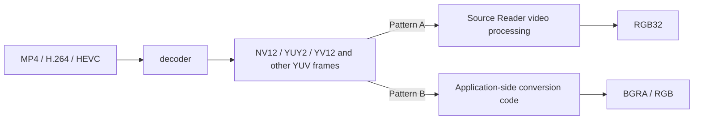

When an application wants to save a frame as PNG, pass an image to WIC or GDI, or display video content in a UI, what it usually wants is an RGB pixel buffer.

But the frames that come out of a Media Foundation decoder are very often **YUV-family formats** such as `NV12` or `YUY2`. If those raw bytes are treated as if they were already RGB pixels, the result is usually a broken image: wrong colors, stripes, or a suspicious green cast.

The earlier article [What Media Foundation Is - Why It Starts to Feel Like COM and Windows Media APIs at the Same Time](https://comcomponent.com/en/blog/2026/03/09/002-media-foundation-why-it-feels-like-com/) covered the broader shape of Media Foundation.  
[How to Extract a Still Image from an MP4 with Media Foundation - A Single .cpp File You Can Paste into a C++ Console App](https://comcomponent.com/en/blog/2026/03/15/000-media-foundation-extract-still-image-from-mp4-at-specific-time/) focused on still-image extraction.  
This article sits in the middle and focuses on **YUV to RGB conversion itself**.

There are two practical patterns:

- **Pattern A**: let `IMFSourceReader` deliver `RGB32` directly
- **Pattern B**: receive `NV12` or `YUY2` and convert to RGB in your own code

The goal here is not to memorize API names. The goal is to make the flow clear enough that you can picture **where YUV appears in Media Foundation and where RGB enters the story**.

## 1. Short version

The practical summary looks like this:

- For **small numbers of extracted frames** or thumbnail generation, enabling `MF_SOURCE_READER_ENABLE_VIDEO_PROCESSING` and requesting `MFVideoFormat_RGB32` is the easiest path
- That automatic conversion is **software processing**, so it is not a great answer for real-time playback or high-throughput conversion
- If you write the conversion yourself, understanding **`NV12` and `YUY2` properly** is the shortest path
- YUV-to-RGB is not just "apply three coefficients." In practice it also involves **subsampling, nominal range, color matrix, and stride**
- In Media Foundation documentation, the word `YUV` often really means **Y'CbCr in practical digital-video terms**
- The most common color bugs come from ignoring **`MF_MT_YUV_MATRIX` and `MF_MT_VIDEO_NOMINAL_RANGE`**, or from assuming stride is always `width * bytesPerPixel`

So the split is simple: **if convenience matters most, ask Source Reader for RGB32**. **If control, scale, or color responsibility matters more, receive YUV and convert it yourself**.

## 2. The picture first

It is easier to start with a picture of where the conversion happens.



If the source file is compressed video such as H.264 or HEVC, the decoder first produces an **uncompressed frame**. That frame is often not RGB. In Windows video pipelines, **YUV formats are the ordinary case**.

So when an application wants RGB, it usually chooses one of two paths:

1. **Let Media Foundation move the frame all the way to RGB32**
2. **Receive YUV and convert to RGB manually**

That choice is the real subject of this article.

## 3. Organizing the YUV/RGB relationship first

### 3.1. "YUV" usually means Y'CbCr in practice

Windows APIs and documentation broadly say `YUV`, but in practical digital-video work, reading `U` as `Cb` and `V` as `Cr` is usually close enough to keep your mental model straight.

Very roughly:

- `Y` carries brightness-like information
- `U` and `V` carry color-difference information
- `RGB` stores red, green, and blue directly per pixel

Human vision is more sensitive to detail in brightness than detail in chroma. That is why video formats often keep `Y` at higher detail and reduce the resolution of `U` and `V`.

### 3.2. 4:4:4, 4:2:2, and 4:2:0 describe how chroma is shared

This is the key idea that makes the formats readable.

| Notation | Meaning | Typical examples |
| --- | --- | --- |
| 4:4:4 | Every pixel has full Y/U/V data | `AYUV`, `I444` |
| 4:2:2 | Two horizontal pixels share chroma | `YUY2`, `UYVY`, `I422` |
| 4:2:0 | A 2x2 block shares chroma | `NV12`, `YV12`, `I420` |

The two formats that appear constantly in practice are worth visualizing immediately.

```text
NV12 (4:2:0, planar)

Y plane
Y Y Y Y
Y Y Y Y
Y Y Y Y
Y Y Y Y

UV plane
U V U V
U V U V
```

In `NV12`, a **2x2 block of pixels shares one U/V pair**.

```text
YUY2 (4:2:2, packed)

bytes:
Y0 U0 Y1 V0   Y2 U2 Y3 V2   ...
```

In `YUY2`, **two horizontal pixels share one U/V pair**.

That already explains why YUV-to-RGB conversion is not a simple one-pixel-to-one-pixel replacement.  
You first have to decide **which U/V values belong to which pixel**.

### 3.3. YUV-to-RGB is both sampling work and color-space work

If you look at [Extended Color Information](https://learn.microsoft.com/en-us/windows/win32/medfound/extended-color-information), a full color pipeline can involve inverse quantization, chroma upsampling, YUV-to-RGB conversion, transfer-function handling, primaries conversion, and output quantization.

For **practical 8-bit SDR application code**, a simpler three-part mental model is enough:

1. **restore chroma sampling**  
   expand 4:2:0 or 4:2:2 chroma so each pixel can use it
2. **restore nominal range**  
   interpret video-range values correctly
3. **apply the matrix**  
   use `BT.601`, `BT.709`, or another correct set of coefficients

In other words, practical YUV-to-RGB code answers two questions:

- **which U/V values belong to this pixel?**
- **which matrix should turn this Y/U/V triplet into RGB?**

### 3.4. Quietly guessing BT.601 versus BT.709 is a color bug waiting to happen

Media Foundation documentation explains `BT.601` and `BT.709` in a reasonable way, but "it is probably 709 because the resolution is larger" is still a risky habit. Color errors do not crash, so they often make it into production quietly.

At minimum, inspect:

- `MF_MT_YUV_MATRIX`
- `MF_MT_VIDEO_NOMINAL_RANGE`

The safer early implementation strategy is to accept only combinations your code explicitly supports.

### 3.5. A good first formula is BT.601 limited-range conversion

A representative 8-bit BT.601 formula looks like this:

```text
C = Y - 16
D = U - 128
E = V - 128

R = clip(1.164383 * C + 1.596027 * E)
G = clip(1.164383 * C - 0.391762 * D - 0.812968 * E)
B = clip(1.164383 * C + 2.017232 * D)
```

`BT.709` changes the coefficients. The important thing is not the memorization of numbers, but understanding the structure:

- `Y` is offset from black at 16
- `U` and `V` are centered around 128

## 4. Pattern A: let Media Foundation convert automatically

### 4.1. Where it fits well

This path is a good match when:

- you want one still frame from MP4
- you need a handful of thumbnails
- you want to hand an RGB image to WIC or GDI
- the workload is offline or tool-like rather than real-time playback

[Source Reader](https://learn.microsoft.com/en-us/windows/win32/medfound/source-reader) supports limited video processing when `MF_SOURCE_READER_ENABLE_VIDEO_PROCESSING` is enabled, and that processing can produce **RGB32 from a YUV decode path**.

Microsoft's own documentation is clear that this is **software processing** and **not optimized for playback**. So it is convenient, but it is not the universal answer.

### 4.2. What produces RGB32

The flow is straightforward:

1. create Source Reader attributes with `MF_SOURCE_READER_ENABLE_VIDEO_PROCESSING = TRUE`
2. select the video stream
3. request `MFMediaType_Video` + `MFVideoFormat_RGB32`
4. call `ReadSample`

That causes the limited video-processing stage behind Source Reader to do the YUV-to-RGB conversion.

### 4.3. Code

The following assumes `CoInitializeEx` and `MFStartup` have already succeeded.

```cpp
#include <windows.h>
#include <mfapi.h>
#include <mfidl.h>
#include <mfreadwrite.h>
#include <mferror.h>
#include <wrl/client.h>

#pragma comment(lib, "mfplat.lib")
#pragma comment(lib, "mfreadwrite.lib")
#pragma comment(lib, "mfuuid.lib")
#pragma comment(lib, "ole32.lib")

using Microsoft::WRL::ComPtr;

HRESULT CreateSourceReaderWithAutoRgb(
    const wchar_t* path,
    IMFSourceReader** ppReader)
{
    if (!path || !ppReader) return E_POINTER;
    *ppReader = nullptr;

    ComPtr<IMFAttributes> attrs;
    HRESULT hr = MFCreateAttributes(&attrs, 2);
    if (FAILED(hr)) return hr;

    hr = attrs->SetUINT32(MF_SOURCE_READER_ENABLE_VIDEO_PROCESSING, TRUE);
    if (FAILED(hr)) return hr;

    hr = MFCreateSourceReaderFromURL(path, attrs.Get(), ppReader);
    if (FAILED(hr)) return hr;

    hr = (*ppReader)->SetStreamSelection(MF_SOURCE_READER_ALL_STREAMS, FALSE);
    if (FAILED(hr)) return hr;

    hr = (*ppReader)->SetStreamSelection(MF_SOURCE_READER_FIRST_VIDEO_STREAM, TRUE);
    if (FAILED(hr)) return hr;

    ComPtr<IMFMediaType> outType;
    hr = MFCreateMediaType(&outType);
    if (FAILED(hr)) return hr;

    hr = outType->SetGUID(MF_MT_MAJOR_TYPE, MFMediaType_Video);
    if (FAILED(hr)) return hr;

    hr = outType->SetGUID(MF_MT_SUBTYPE, MFVideoFormat_RGB32);
    if (FAILED(hr)) return hr;

    hr = (*ppReader)->SetCurrentMediaType(
        MF_SOURCE_READER_FIRST_VIDEO_STREAM,
        nullptr,
        outType.Get());
    if (FAILED(hr)) return hr;

    return S_OK;
}

HRESULT ReadOneRgb32Sample(
    IMFSourceReader* reader,
    IMFSample** ppSample,
    LONGLONG* pTimestamp100ns)
{
    if (!reader || !ppSample) return E_POINTER;
    *ppSample = nullptr;
    if (pTimestamp100ns) *pTimestamp100ns = 0;

    DWORD streamIndex = 0;
    DWORD flags = 0;
    LONGLONG timestamp = 0;

    HRESULT hr = reader->ReadSample(
        MF_SOURCE_READER_FIRST_VIDEO_STREAM,
        0,
        &streamIndex,
        &flags,
        &timestamp,
        ppSample);

    if (FAILED(hr)) return hr;
    if (flags & MF_SOURCE_READERF_ENDOFSTREAM) return MF_E_END_OF_STREAM;
    if (*ppSample == nullptr) return MF_E_INVALID_STREAM_DATA;

    if (pTimestamp100ns) *pTimestamp100ns = timestamp;
    return S_OK;
}
```

After that, `GetCurrentMediaType` can be used to inspect the actual output size and stride.

### 4.4. Why this path is attractive

The strength of this approach is simple: it gets you to a correct-looking image quickly.

- you do not need to write 4:2:0 or 4:2:2 expansion yourself
- a lot of format detail stays hidden
- the output is easier to pass to WIC or GDI
- for a small number of frames, it is often entirely practical

For still-image extraction tools, this is often the calmest entry point.

### 4.5. But it still has traps

This automatic path has some important properties:

| Item | Meaning |
| --- | --- |
| output format | usually `RGB32` |
| implementation | software processing |
| good for | small numbers of frames, thumbnails, offline conversion |
| not ideal for | D3D-centric rendering, high-throughput frame processing |
| awkward with | `MF_SOURCE_READER_D3D_MANAGER`, `MF_READWRITE_DISABLE_CONVERTERS` |

There is one more detail that matters a lot in practice: the fourth byte of `RGB32`.  
Windows `RGB32` is laid out in memory as **Blue / Green / Red / Alpha or Don't Care**. It is not a guarantee of "ready-made ARGB32." If that fourth byte is passed through to a PNG encoder as alpha, the image can become unintentionally transparent. Filling it with `0xFF` before writing is usually the safer move.

## 5. Pattern B: write the conversion yourself

### 5.1. Where manual conversion fits

Manual conversion is a better fit when:

- you need to process many frames and want control over performance
- you want to keep `NV12` on a GPU or SIMD path as long as possible
- you want explicit control over `BT.601`, `BT.709`, or nominal range
- you need outputs other than `RGB32`
- the limited automatic conversion path is not enough

In other words, this path trades convenience for control.

### 5.2. The overall manual flow

The steps are:

1. configure Source Reader to output `NV12` or `YUY2`
2. inspect the actual media type with `GetCurrentMediaType`
3. read `MF_MT_FRAME_SIZE`, `MF_MT_DEFAULT_STRIDE`, `MF_MT_YUV_MATRIX`, and `MF_MT_VIDEO_NOMINAL_RANGE`
4. lock the sample buffer
5. determine which Y/U/V values each pixel should use
6. apply the matrix and write BGRA output

The code in this article intentionally narrows the scope to **8-bit SDR, progressive video, `NV12` or `YUY2`, and limited range**. That is not laziness. It is the safer way to avoid quietly incorrect color.

### 5.3. Request a YUV output type first

The first step is to tell Source Reader to keep the YUV path visible.

```cpp
#include <windows.h>
#include <mfapi.h>
#include <mfidl.h>
#include <mfreadwrite.h>
#include <mferror.h>
#include <wrl/client.h>

using Microsoft::WRL::ComPtr;

HRESULT ConfigureSourceReaderForSubtype(
    IMFSourceReader* reader,
    REFGUID subtype)
{
    if (!reader) return E_POINTER;

    HRESULT hr = reader->SetStreamSelection(MF_SOURCE_READER_ALL_STREAMS, FALSE);
    if (FAILED(hr)) return hr;

    hr = reader->SetStreamSelection(MF_SOURCE_READER_FIRST_VIDEO_STREAM, TRUE);
    if (FAILED(hr)) return hr;

    ComPtr<IMFMediaType> outType;
    hr = MFCreateMediaType(&outType);
    if (FAILED(hr)) return hr;

    hr = outType->SetGUID(MF_MT_MAJOR_TYPE, MFMediaType_Video);
    if (FAILED(hr)) return hr;

    hr = outType->SetGUID(MF_MT_SUBTYPE, subtype);
    if (FAILED(hr)) return hr;

    hr = reader->SetCurrentMediaType(
        MF_SOURCE_READER_FIRST_VIDEO_STREAM,
        nullptr,
        outType.Get());
    if (FAILED(hr)) return hr;

    return S_OK;
}
```

Pass `MFVideoFormat_NV12` or `MFVideoFormat_YUY2` as `subtype`.  
And do not assume the requested subtype is exactly what you will get back. Always confirm the actual type with `GetCurrentMediaType`.

### 5.4. Accept only the color metadata you explicitly support

The code below intentionally accepts only:

- `NV12` or `YUY2`
- `BT.601` or `BT.709`
- `MFNominalRange_16_235`

```cpp
#include <vector>

struct DecodedFrameInfo
{
    GUID subtype = GUID_NULL;
    UINT32 width = 0;
    UINT32 height = 0;
    LONG defaultStride = 0;
    MFVideoTransferMatrix matrix = MFVideoTransferMatrix_Unknown;
    MFNominalRange nominalRange = MFNominalRange_Unknown;
};

HRESULT GetDefaultStride(
    IMFMediaType* pType,
    LONG* plStride)
{
    if (!pType || !plStride) return E_POINTER;

    LONG stride = 0;
    HRESULT hr = pType->GetUINT32(
        MF_MT_DEFAULT_STRIDE,
        reinterpret_cast<UINT32*>(&stride));

    if (FAILED(hr))
    {
        GUID subtype = GUID_NULL;
        UINT32 width = 0;
        UINT32 height = 0;

        hr = pType->GetGUID(MF_MT_SUBTYPE, &subtype);
        if (FAILED(hr)) return hr;

        hr = MFGetAttributeSize(pType, MF_MT_FRAME_SIZE, &width, &height);
        if (FAILED(hr)) return hr;

        hr = MFGetStrideForBitmapInfoHeader(subtype.Data1, width, &stride);
        if (FAILED(hr)) return hr;

        hr = pType->SetUINT32(MF_MT_DEFAULT_STRIDE, static_cast<UINT32>(stride));
        if (FAILED(hr)) return hr;
    }

    *plStride = stride;
    return S_OK;
}

HRESULT GetStrictDecodedFrameInfo(
    IMFMediaType* pType,
    DecodedFrameInfo* pInfo)
{
    if (!pType || !pInfo) return E_POINTER;

    HRESULT hr = pType->GetGUID(MF_MT_SUBTYPE, &pInfo->subtype);
    if (FAILED(hr)) return hr;

    if (pInfo->subtype != MFVideoFormat_NV12 &&
        pInfo->subtype != MFVideoFormat_YUY2)
    {
        return MF_E_INVALIDMEDIATYPE;
    }

    hr = MFGetAttributeSize(pType, MF_MT_FRAME_SIZE, &pInfo->width, &pInfo->height);
    if (FAILED(hr)) return hr;

    hr = GetDefaultStride(pType, &pInfo->defaultStride);
    if (FAILED(hr)) return hr;

    UINT32 value = 0;

    hr = pType->GetUINT32(MF_MT_YUV_MATRIX, &value);
    if (FAILED(hr)) return hr;

    pInfo->matrix = static_cast<MFVideoTransferMatrix>(value);
    if (pInfo->matrix != MFVideoTransferMatrix_BT601 &&
        pInfo->matrix != MFVideoTransferMatrix_BT709)
    {
        return MF_E_INVALIDMEDIATYPE;
    }

    hr = pType->GetUINT32(MF_MT_VIDEO_NOMINAL_RANGE, &value);
    if (FAILED(hr)) return hr;

    pInfo->nominalRange = static_cast<MFNominalRange>(value);
    if (pInfo->nominalRange != MFNominalRange_16_235)
    {
        return MF_E_INVALIDMEDIATYPE;
    }

    return S_OK;
}
```

This is intentionally strict. Media Foundation documentation does describe some fallback interpretations, but silently rounding unknown metadata into a default assumption is one of the easiest ways to ship subtle color errors.

### 5.5. Read buffers using stride, not assumptions

This part matters a lot:

- `MF_MT_DEFAULT_STRIDE` is the **minimum logical stride**
- the actual sample buffer may include **padding**
- if `IMF2DBuffer::Lock2D` is available, prefer it

This helper is a practical adaptation of the [Uncompressed Video Buffers](https://learn.microsoft.com/en-us/windows/win32/medfound/uncompressed-video-buffers) pattern:

```cpp
class BufferLock
{
public:
    explicit BufferLock(IMFMediaBuffer* buffer)
        : m_buffer(buffer),
          m_2dBuffer(nullptr),
          m_locked(false)
    {
        if (m_buffer)
        {
            m_buffer->AddRef();
            m_buffer->QueryInterface(IID_PPV_ARGS(&m_2dBuffer));
        }
    }

    ~BufferLock()
    {
        Unlock();

        if (m_2dBuffer)
        {
            m_2dBuffer->Release();
            m_2dBuffer = nullptr;
        }

        if (m_buffer)
        {
            m_buffer->Release();
            m_buffer = nullptr;
        }
    }

    HRESULT Lock(
        LONG defaultStride,
        DWORD heightInPixels,
        BYTE** ppScanline0,
        LONG* pActualStride)
    {
        if (!m_buffer || !ppScanline0 || !pActualStride) return E_POINTER;
        if (m_locked) return MF_E_INVALIDREQUEST;

        if (m_2dBuffer)
        {
            HRESULT hr = m_2dBuffer->Lock2D(ppScanline0, pActualStride);
            if (FAILED(hr)) return hr;

            m_locked = true;
            return S_OK;
        }

        BYTE* pData = nullptr;
        HRESULT hr = m_buffer->Lock(&pData, nullptr, nullptr);
        if (FAILED(hr)) return hr;

        *pActualStride = defaultStride;
        if (defaultStride < 0)
        {
            *ppScanline0 =
                pData + static_cast<size_t>(-defaultStride) * (heightInPixels - 1);
        }
        else
        {
            *ppScanline0 = pData;
        }

        m_locked = true;
        return S_OK;
    }

    void Unlock()
    {
        if (!m_locked) return;

        if (m_2dBuffer)
        {
            m_2dBuffer->Unlock2D();
        }
        else
        {
            m_buffer->Unlock();
        }

        m_locked = false;
    }

private:
    IMFMediaBuffer* m_buffer;
    IMF2DBuffer* m_2dBuffer;
    bool m_locked;
};
```

The safe rule is simple: trust the pitch returned by the API, not a width-based guess.

### 5.6. Encode the per-pixel formula

The example below handles only limited-range `BT.601` and `BT.709`, and writes **BGRA32** output.

```cpp
inline BYTE ClampToByte(double value)
{
    if (value <= 0.0) return 0;
    if (value >= 255.0) return 255;
    return static_cast<BYTE>(value + 0.5);
}

HRESULT ConvertLimitedYuvPixelToBgra(
    BYTE y,
    BYTE u,
    BYTE v,
    MFVideoTransferMatrix matrix,
    BYTE* dstPixel)
{
    if (!dstPixel) return E_POINTER;

    const double c = static_cast<double>(y) - 16.0;
    const double d = static_cast<double>(u) - 128.0;
    const double e = static_cast<double>(v) - 128.0;

    double r = 0.0;
    double g = 0.0;
    double b = 0.0;

    switch (matrix)
    {
    case MFVideoTransferMatrix_BT601:
        r = 1.164383 * c + 1.596027 * e;
        g = 1.164383 * c - 0.391762 * d - 0.812968 * e;
        b = 1.164383 * c + 2.017232 * d;
        break;

    case MFVideoTransferMatrix_BT709:
        r = 1.164383 * c + 1.792741 * e;
        g = 1.164383 * c - 0.213249 * d - 0.532909 * e;
        b = 1.164383 * c + 2.112402 * d;
        break;

    default:
        return MF_E_INVALIDMEDIATYPE;
    }

    dstPixel[0] = ClampToByte(b);
    dstPixel[1] = ClampToByte(g);
    dstPixel[2] = ClampToByte(r);
    dstPixel[3] = 255;

    return S_OK;
}
```

The structure is straightforward:

- subtract 16 from `Y`
- subtract 128 from `U` and `V`
- apply the matrix
- clamp to byte range
- force alpha to `255`

### 5.7. Convert `NV12` to BGRA32

`NV12` is 4:2:0, so each **2x2 block shares one U/V pair**.

```cpp
HRESULT ConvertNv12ToBgra32(
    IMFMediaBuffer* buffer,
    const DecodedFrameInfo& info,
    std::vector<BYTE>& dstBgra)
{
    if (!buffer) return E_POINTER;
    if (info.subtype != MFVideoFormat_NV12) return MF_E_INVALIDMEDIATYPE;
    if ((info.width & 1u) != 0 || (info.height & 1u) != 0)
    {
        return MF_E_INVALIDMEDIATYPE;
    }

    dstBgra.resize(static_cast<size_t>(info.width) * info.height * 4);

    BufferLock lock(buffer);

    BYTE* scanline0 = nullptr;
    LONG actualStride = 0;
    HRESULT hr = lock.Lock(
        info.defaultStride,
        info.height,
        &scanline0,
        &actualStride);
    if (FAILED(hr)) return hr;

    if (actualStride <= 0)
    {
        lock.Unlock();
        return MF_E_INVALIDMEDIATYPE;
    }

    const BYTE* yPlane = scanline0;
    const BYTE* uvPlane =
        scanline0 + static_cast<size_t>(actualStride) * info.height;

    for (UINT32 y = 0; y < info.height; ++y)
    {
        const BYTE* yRow = yPlane + static_cast<size_t>(actualStride) * y;
        const BYTE* uvRow = uvPlane + static_cast<size_t>(actualStride) * (y / 2);
        BYTE* dstRow =
            dstBgra.data() + static_cast<size_t>(info.width) * 4 * y;

        for (UINT32 x = 0; x < info.width; ++x)
        {
            const BYTE Y = yRow[x];
            const BYTE U = uvRow[(x / 2) * 2 + 0];
            const BYTE V = uvRow[(x / 2) * 2 + 1];

            hr = ConvertLimitedYuvPixelToBgra(
                Y,
                U,
                V,
                info.matrix,
                dstRow + static_cast<size_t>(x) * 4);
            if (FAILED(hr))
            {
                lock.Unlock();
                return hr;
            }
        }
    }

    lock.Unlock();
    return S_OK;
}
```

This uses a nearest-neighbor-style interpretation of chroma sharing. That is often good enough for tooling and many application paths, but higher-quality upsampling is a separate design choice.

### 5.8. Convert `YUY2` to BGRA32

`YUY2` is packed 4:2:2, so two horizontal pixels share one U/V pair.

```cpp
#include <cstddef>

HRESULT ConvertYuy2ToBgra32(
    IMFMediaBuffer* buffer,
    const DecodedFrameInfo& info,
    std::vector<BYTE>& dstBgra)
{
    if (!buffer) return E_POINTER;
    if (info.subtype != MFVideoFormat_YUY2) return MF_E_INVALIDMEDIATYPE;
    if ((info.width & 1u) != 0) return MF_E_INVALIDMEDIATYPE;

    dstBgra.resize(static_cast<size_t>(info.width) * info.height * 4);

    BufferLock lock(buffer);

    BYTE* scanline0 = nullptr;
    LONG actualStride = 0;
    HRESULT hr = lock.Lock(
        info.defaultStride,
        info.height,
        &scanline0,
        &actualStride);
    if (FAILED(hr)) return hr;

    for (UINT32 y = 0; y < info.height; ++y)
    {
        const BYTE* src =
            scanline0 +
            static_cast<ptrdiff_t>(actualStride) * static_cast<ptrdiff_t>(y);

        BYTE* dstRow =
            dstBgra.data() + static_cast<size_t>(info.width) * 4 * y;

        for (UINT32 x = 0; x < info.width; x += 2)
        {
            const BYTE Y0 = src[0];
            const BYTE U  = src[1];
            const BYTE Y1 = src[2];
            const BYTE V  = src[3];

            hr = ConvertLimitedYuvPixelToBgra(
                Y0,
                U,
                V,
                info.matrix,
                dstRow + static_cast<size_t>(x) * 4);
            if (FAILED(hr))
            {
                lock.Unlock();
                return hr;
            }

            hr = ConvertLimitedYuvPixelToBgra(
                Y1,
                U,
                V,
                info.matrix,
                dstRow + static_cast<size_t>(x + 1) * 4);
            if (FAILED(hr))
            {
                lock.Unlock();
                return hr;
            }

            src += 4;
        }
    }

    lock.Unlock();
    return S_OK;
}
```

Because the bytes are laid out as `Y0 U Y1 V`, the shared-chroma pattern is visible directly in the code.

### 5.9. A practical entry point from `IMFSample`

Once the sample is made contiguous, dispatching by subtype keeps the calling side simple.

```cpp
HRESULT ConvertSampleToBgra32(
    IMFSample* sample,
    const DecodedFrameInfo& info,
    std::vector<BYTE>& dstBgra)
{
    if (!sample) return E_POINTER;

    ComPtr<IMFMediaBuffer> buffer;
    HRESULT hr = sample->ConvertToContiguousBuffer(&buffer);
    if (FAILED(hr)) return hr;

    if (info.subtype == MFVideoFormat_NV12)
    {
        return ConvertNv12ToBgra32(buffer.Get(), info, dstBgra);
    }

    if (info.subtype == MFVideoFormat_YUY2)
    {
        return ConvertYuy2ToBgra32(buffer.Get(), info, dstBgra);
    }

    return MF_E_INVALIDMEDIATYPE;
}
```

The surrounding flow then becomes:

- create the reader
- request `NV12` or `YUY2`
- build `DecodedFrameInfo` from `GetCurrentMediaType`
- call `ReadSample`
- call `ConvertSampleToBgra32`

For example:

```cpp
ComPtr<IMFMediaType> currentType;
HRESULT hr = reader->GetCurrentMediaType(
    MF_SOURCE_READER_FIRST_VIDEO_STREAM,
    &currentType);
if (FAILED(hr)) return hr;

DecodedFrameInfo info;
hr = GetStrictDecodedFrameInfo(currentType.Get(), &info);
if (FAILED(hr)) return hr;

DWORD flags = 0;
LONGLONG timestamp = 0;
ComPtr<IMFSample> sample;

hr = reader->ReadSample(
    MF_SOURCE_READER_FIRST_VIDEO_STREAM,
    0,
    nullptr,
    &flags,
    &timestamp,
    &sample);
if (FAILED(hr)) return hr;
if (flags & MF_SOURCE_READERF_ENDOFSTREAM) return MF_E_END_OF_STREAM;
if (!sample) return MF_E_INVALID_STREAM_DATA;

std::vector<BYTE> bgra;
hr = ConvertSampleToBgra32(sample.Get(), info, bgra);
if (FAILED(hr)) return hr;

// bgra can now be treated as top-down 32bpp BGRA
```

### 5.10. Where manual conversion lives architecturally

All of the code above converts **after Source Reader, inside the application**. That is the clearest place to start.

There are more advanced variants too:

- write a custom `MFT`
- use `Video Processor MFT` / XVP
- convert `NV12` to RGB on the GPU with shaders

Those are real options, but they shift the subject from "how to understand YUV-to-RGB in Media Foundation" to "where to place the conversion stage in a larger media pipeline."

## 6. Which path should you choose?

This table usually makes the decision easier:

| Perspective | Auto conversion (`MF_SOURCE_READER_ENABLE_VIDEO_PROCESSING`) | Manual conversion |
| --- | --- | --- |
| implementation speed | ◎ | △ |
| extracting a few stills | ◎ | ○ |
| large batch / real-time workloads | △ | ◎ |
| explicit matrix / range control | △ | ◎ |
| D3D / GPU integration | △ | ○ to ◎ |
| output formats beyond `RGB32` | △ | ◎ |
| learning the underlying model | ○ | ◎ |

As a practical first strategy:

- **if you want something working quickly**, use automatic conversion
- **if you want full control over color and performance**, use manual conversion

It is also very reasonable to use the automatic path first as a correctness baseline, then replace it with a manual path later.

## 7. Common pitfalls in practice

### 7.1. Assuming `RGB32` means fully valid alpha

`RGB32` in memory is `B, G, R, Alpha or Don't Care`.  
If the fourth byte is zero and you hand it directly to a PNG path that treats it as alpha, the image can become transparent. Filling it with `0xFF` is the safer default.

### 7.2. Assuming stride is `width * bytesPerPixel`

This is one of the most common mistakes.  
Real sample buffers may include padding. Always move between rows using the actual stride.

### 7.3. Mixing up `MF_MT_DEFAULT_STRIDE` and actual pitch

`MF_MT_DEFAULT_STRIDE` describes the minimum logical stride for the format.  
The actual pitch of a concrete sample should come from the buffer interface, especially `IMF2DBuffer::Lock2D` when available.

### 7.4. Quietly guessing 601 versus 709

Color bugs are easy to miss because they do not crash.

At minimum, inspect:

- `MF_MT_YUV_MATRIX`
- `MF_MT_VIDEO_NOMINAL_RANGE`

And if a value is outside what your code explicitly supports, failing fast is often better than silently guessing.

### 7.5. Splitting the `NV12` UV plane at `width * height`

The plane offset depends on **actual stride and height**, not simply on `width * height`.  
Treating it as a width-based split is an easy way to corrupt color.

### 7.6. Processing interlaced video as if it were progressive

The manual examples in this article assume progressive video.  
If the source is interlaced and you treat it as a single progressive frame, combing artifacts can appear. That is one reason the automatic video-processing path or Video Processor MFT may be more suitable in some pipelines.

### 7.7. Ignoring chroma-upsampling quality

The `NV12` example here is intentionally simple and readable. It uses the shared chroma values directly for each covered pixel. That is often practical, but if image quality matters more than implementation simplicity, chroma-upsampling quality deserves a real design choice.

## 8. Wrap-up

When you convert YUV to RGB in Media Foundation, a few ideas make the whole topic much easier to reason about:

- after decode, the frame is often `NV12` or `YUY2`, not RGB
- **if convenience wins**, ask Source Reader for `RGB32`
- **if control wins**, receive `NV12` or `YUY2` and convert to BGRA yourself
- in a manual path, understand **sampling, nominal range, matrix, and stride** before worrying about formula details
- if `BT.601`, `BT.709`, `16..235`, `4:2:0`, and `4:2:2` are handled vaguely, the result is often a quietly wrong image

YUV-to-RGB looks unfriendly at first. But once the structure becomes clear,

- `NV12` means one U/V pair per 2x2 block
- `YUY2` means one U/V pair per two horizontal pixels
- the chosen matrix turns those values into RGB

the bytes stop looking mysterious and start looking like a pipeline you can reason about.

## 9. References

### Related KomuraSoft articles

- [What Media Foundation Is - Why It Starts to Feel Like COM and Windows Media APIs at the Same Time](https://comcomponent.com/en/blog/2026/03/09/002-media-foundation-why-it-feels-like-com/)
- [How to Extract a Still Image from an MP4 with Media Foundation - A Single .cpp File You Can Paste into a C++ Console App](https://comcomponent.com/en/blog/2026/03/15/000-media-foundation-extract-still-image-from-mp4-at-specific-time/)

### Microsoft Learn

- [Source Reader](https://learn.microsoft.com/en-us/windows/win32/medfound/source-reader)
- [Using the Source Reader to Process Media Data](https://learn.microsoft.com/en-us/windows/win32/medfound/processing-media-data-with-the-source-reader)
- [MF_SOURCE_READER_ENABLE_VIDEO_PROCESSING attribute](https://learn.microsoft.com/en-us/windows/win32/medfound/mf-source-reader-enable-video-processing)
- [IMFSourceReader::SetCurrentMediaType](https://learn.microsoft.com/en-us/windows/win32/api/mfreadwrite/nf-mfreadwrite-imfsourcereader-setcurrentmediatype)
- [Recommended 8-Bit YUV Formats for Video Rendering](https://learn.microsoft.com/en-us/windows/win32/medfound/recommended-8-bit-yuv-formats-for-video-rendering)
- [Extended Color Information](https://learn.microsoft.com/en-us/windows/win32/medfound/extended-color-information)
- [Uncompressed Video Buffers](https://learn.microsoft.com/en-us/windows/win32/medfound/uncompressed-video-buffers)
- [IMF2DBuffer::Lock2D](https://learn.microsoft.com/en-us/windows/win32/api/mfobjects/nf-mfobjects-imf2dbuffer-lock2d)
- [MF_MT_VIDEO_NOMINAL_RANGE attribute](https://learn.microsoft.com/en-us/windows/win32/medfound/mf-mt-video-nominal-range-attribute)
- [MFVideoTransferMatrix enumeration](https://learn.microsoft.com/en-us/windows/win32/api/mfobjects/ne-mfobjects-mfvideotransfermatrix)
- [Video Processor MFT](https://learn.microsoft.com/en-us/windows/win32/medfound/video-processor-mft)
- [Uncompressed RGB Video Subtypes](https://learn.microsoft.com/en-us/windows/win32/directshow/uncompressed-rgb-video-subtypes)
