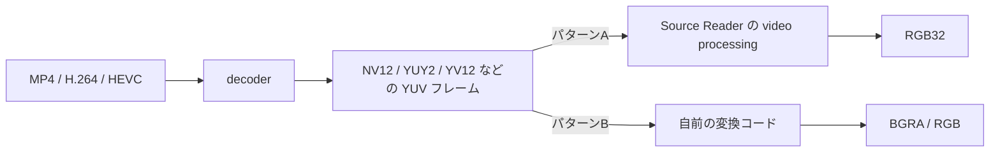

動画からフレームを抜いて PNG に保存したい、WIC や GDI に渡したい、あるいは UI 上へ出したい。そういう場面では、アプリ側は RGB の画素列を欲しがります。

ところが、Media Foundation の decoder から出てくるフレームは、かなり普通に `NV12` や `YUY2` のような **YUV 系フォーマット**です。ここで生のバイト列をそのまま画像だと思って扱うと、色が壊れる、縞になる、妙に緑がかる、という少し悲しい絵になります。

以前書いた [Media Foundation とは何か - COM と Windows メディア API の顔が見えてくる理由](https://comcomponent.com/blog/2026/03/09/002-media-foundation-why-it-feels-like-com/) では全体像を、[Media Foundation で MP4 動画の指定時刻から静止画を取り出す方法 - .cpp にそのまま貼れる 1 ファイル完結版](https://comcomponent.com/blog/2026/03/15/000-media-foundation-extract-still-image-from-mp4-at-specific-time/) では静止画抽出を整理しました。今回はその途中にある **YUV -> RGB 変換そのもの** を扱います。

この記事では、次の 2 パターンを分けて整理します。

- **パターンA**: `IMFSourceReader` に RGB32 まで自動で持っていかせる
- **パターンB**: `NV12` / `YUY2` を受け取り、自分で RGB へ変換する

狙いは API 名を覚えることではありません。**Media Foundation のどこで YUV が出てきて、どこで RGB に変わるのか**、その流れを頭の中で描けるようにすることです。

## 1. まず結論

先に結論だけまとめると、こうです。

- **数枚の静止画抽出やサムネイル生成**なら、`MF_SOURCE_READER_ENABLE_VIDEO_PROCESSING` を有効にして `MFVideoFormat_RGB32` を要求するのがいちばん楽です
- ただしこの自動変換は **software 処理** で、リアルタイム再生向けには最適化されていません
- 自前変換を書くなら、まずは **`NV12` と `YUY2` をきちんと理解する** のが最短です
- YUV -> RGB は「係数 3 本かければ終わり」ではなく、実際には **サブサンプリング、range、matrix、stride** が絡みます
- Media Foundation のドキュメントでは広く `YUV` という言葉を使いますが、デジタル video では実質的に **Y'CbCr** を指していると思って読むと整理しやすいです
- 実務で色を壊しやすいのは、**`MF_MT_YUV_MATRIX` と `MF_MT_VIDEO_NOMINAL_RANGE` を見ないこと**、そして **stride を `width * bytesPerPixel` だと思い込むこと** です

要するに、**楽をしたいなら Source Reader に RGB32 を出させる**。**大量処理や色の制御まで欲しいなら YUV のまま受けて自分で変換する**。この二択です。

## 2. まず絵で見る

最初に、Media Foundation の中で何が起きているかを図で見たほうが話が速いです。



動画ファイルの中身が H.264 や HEVC のような圧縮形式なら、まず decoder がそれを **非圧縮フレーム**へ戻します。この非圧縮フレームが RGB とは限りません。むしろ、Windows の video 系では **YUV 系が普通**です。

なので、アプリが RGB を欲しがるときは、次のどちらかを選びます。

1. **Media Foundation 側に RGB32 まで持っていかせる**
2. **YUV を受けて、自分のコードで RGB にする**

この記事の話は、まさにこの分岐点です。

## 3. YUV と RGB の関係を先に整理する

### 3.1. YUV と言いつつ、実際には Y'CbCr の話

Windows の API 名やドキュメントは広く `YUV` という言葉を使います。ただ、デジタル video の文脈では、`U` は `Cb`、`V` は `Cr` と読んでほぼ問題ありません。

ざっくり言うと、

- `Y` は明るさ寄りの成分
- `U` / `V` は色差成分
- `RGB` は各画素がそのまま Red / Green / Blue を持つ

という関係です。

人間の目は、色の細かさより明るさの細かさに敏感です。なので video では、**Y を細かく、U/V を少し粗く** 持つ設計が効きます。これが YUV 系フォーマットがよく使われる理由です。

### 3.2. 4:4:4 / 4:2:2 / 4:2:0 は「色をどれだけ間引いているか」

ここが YUV を読むときの肝です。

| 表記 | 意味 | 代表例 |
| --- | --- | --- |
| 4:4:4 | 各 pixel が Y/U/V をそれぞれ持つ | `AYUV`, `I444` |
| 4:2:2 | 横方向に 2 pixel で U/V を共有する | `YUY2`, `UYVY`, `I422` |
| 4:2:0 | 2x2 pixel で U/V を共有する | `NV12`, `YV12`, `I420` |

実務でよく出る 2 つだけ、まず形を見ておくとかなり楽です。

```text
NV12 (4:2:0, planar)

Y plane
Y Y Y Y
Y Y Y Y
Y Y Y Y
Y Y Y Y

UV plane
U V U V
U V U V
```

`NV12` では、**2x2 block の 4 画素が 1 組の U/V を共有**します。Y は各 pixel ごとにあります。

```text
YUY2 (4:2:2, packed)

bytes:
Y0 U0 Y1 V0   Y2 U2 Y3 V2   ...
```

`YUY2` では、**横 2 画素が 1 組の U/V を共有**します。`Y0` と `Y1` は別ですが、`U0` と `V0` は共有です。

この時点で見えてくるのは、YUV -> RGB が単純な 1 pixel 1 pixel の置換ではないことです。  
まず **共有されている U/V を、どの pixel にどう割り当てるか** を考える必要があります。

### 3.3. YUV -> RGB は「色空間変換 + サンプリング変換」

Media Foundation の [Extended Color Information](https://learn.microsoft.com/en-us/windows/win32/medfound/extended-color-information) を見ると、厳密な色変換はかなり段階があります。inverse quantization、chroma upsampling、YUV -> RGB、transfer function、primaries 変換、quantization まで出てきます。

ただ、**8-bit SDR の実務コード**として最初に押さえるなら、次の 3 層に分けると理解しやすいです。

1. **サブサンプリングを戻す**  
   4:2:0 や 4:2:2 の U/V を、各 pixel が参照できる形に広げる
2. **range を戻す**  
   video の Y はふつう 16..235、U/V は 16..240 を使うので、そのスケーリングを戻す
3. **matrix をかける**  
   `BT.601` か `BT.709` などの係数で RGB へ変換する

つまり、YUV -> RGB 変換とは実務的には、

- **どの U/V がその pixel の色なのか**
- **その Y/U/V をどの係数で RGB に戻すのか**

を決める処理です。

### 3.4. BT.601 と BT.709 を雑に扱うと、じわっと色がズレる

Media Foundation のドキュメントでは、`BT.601` は SDTV とそれ以下、`BT.709` は SD を超える video で優先される関係として説明されています。

ただ、ここで「解像度が大きいから 709 だろう」と **黙って推測する** のはあまりよくありません。色ずれはクラッシュしないので、気付かないまま運用に乗りやすいからです。

Media Foundation では色空間情報をメディアタイプ属性で持てます。最低でも次の 2 つは見ます。

- `MF_MT_YUV_MATRIX`
- `MF_MT_VIDEO_NOMINAL_RANGE`

この 2 つを見て、**自分のコードが対応している組み合わせだけを明示的に通す** ほうが、あとで静かに事故りにくいです。

### 3.5. まず覚える式は BT.601 の limited range 版

8-bit BT.601 の代表的な式は次です。

```text
C = Y - 16
D = U - 128
E = V - 128

R = clip(1.164383 * C + 1.596027 * E)
G = clip(1.164383 * C - 0.391762 * D - 0.812968 * E)
B = clip(1.164383 * C + 2.017232 * D)
```

`BT.709` では係数が変わります。後でコードでも出します。

ここで大事なのは、「係数の暗記」よりも、**Y は黒レベル 16 を引く、U/V は 128 を中心に見る**、という構造です。

## 4. パターンA: Media Foundation に自動で変換させる

### 4.1. どんなときに向いているか

この方法が向いているのは、たとえば次のような場面です。

- MP4 から静止画を 1 枚抜きたい
- サムネイルを数枚作りたい
- RGB 画像にして WIC へ渡したい
- リアルタイム再生ではなく、バッチやツール用途でよい

[Source Reader](https://learn.microsoft.com/en-us/windows/win32/medfound/source-reader) には、`MF_SOURCE_READER_ENABLE_VIDEO_PROCESSING` を使って **YUV -> RGB32 の limited な video processing** をさせる機能があります。

ただし Microsoft Learn にもある通り、これは **software 処理** で、**playback 向けに最適化されていません**。何百枚も毎秒処理したいなら、ここに寄りかかるのは少し違います。

### 4.2. 何を設定すると RGB32 が出てくるのか

流れはかなり素直です。

1. `MFCreateSourceReaderFromURL` に渡す attributes で `MF_SOURCE_READER_ENABLE_VIDEO_PROCESSING = TRUE`
2. 動画 stream を選ぶ
3. `SetCurrentMediaType` で `MFMediaType_Video` / `MFVideoFormat_RGB32` を要求する
4. `ReadSample` で sample を読む

これだけで、decoder の後ろに入る limited な video processing が **YUV -> RGB32** をやってくれます。

### 4.3. コード

以下のコードは、`CoInitializeEx` と `MFStartup` が済んでいる前提です。最小構成だと、だいたいこんな形です。

```cpp
#include <windows.h>
#include <mfapi.h>
#include <mfidl.h>
#include <mfreadwrite.h>
#include <mferror.h>
#include <wrl/client.h>

#pragma comment(lib, "mfplat.lib")
#pragma comment(lib, "mfreadwrite.lib")
#pragma comment(lib, "mfuuid.lib")
#pragma comment(lib, "ole32.lib")

using Microsoft::WRL::ComPtr;

HRESULT CreateSourceReaderWithAutoRgb(
    const wchar_t* path,
    IMFSourceReader** ppReader)
{
    if (!path || !ppReader) return E_POINTER;
    *ppReader = nullptr;

    ComPtr<IMFAttributes> attrs;
    HRESULT hr = MFCreateAttributes(&attrs, 2);
    if (FAILED(hr)) return hr;

    hr = attrs->SetUINT32(MF_SOURCE_READER_ENABLE_VIDEO_PROCESSING, TRUE);
    if (FAILED(hr)) return hr;

    hr = MFCreateSourceReaderFromURL(path, attrs.Get(), ppReader);
    if (FAILED(hr)) return hr;

    hr = (*ppReader)->SetStreamSelection(MF_SOURCE_READER_ALL_STREAMS, FALSE);
    if (FAILED(hr)) return hr;

    hr = (*ppReader)->SetStreamSelection(MF_SOURCE_READER_FIRST_VIDEO_STREAM, TRUE);
    if (FAILED(hr)) return hr;

    ComPtr<IMFMediaType> outType;
    hr = MFCreateMediaType(&outType);
    if (FAILED(hr)) return hr;

    hr = outType->SetGUID(MF_MT_MAJOR_TYPE, MFMediaType_Video);
    if (FAILED(hr)) return hr;

    hr = outType->SetGUID(MF_MT_SUBTYPE, MFVideoFormat_RGB32);
    if (FAILED(hr)) return hr;

    hr = (*ppReader)->SetCurrentMediaType(
        MF_SOURCE_READER_FIRST_VIDEO_STREAM,
        nullptr,
        outType.Get());
    if (FAILED(hr)) return hr;

    return S_OK;
}

HRESULT ReadOneRgb32Sample(
    IMFSourceReader* reader,
    IMFSample** ppSample,
    LONGLONG* pTimestamp100ns)
{
    if (!reader || !ppSample) return E_POINTER;
    *ppSample = nullptr;
    if (pTimestamp100ns) *pTimestamp100ns = 0;

    DWORD streamIndex = 0;
    DWORD flags = 0;
    LONGLONG timestamp = 0;

    HRESULT hr = reader->ReadSample(
        MF_SOURCE_READER_FIRST_VIDEO_STREAM,
        0,
        &streamIndex,
        &flags,
        &timestamp,
        ppSample);

    if (FAILED(hr)) return hr;
    if (flags & MF_SOURCE_READERF_ENDOFSTREAM) return MF_E_END_OF_STREAM;
    if (*ppSample == nullptr) return MF_E_INVALID_STREAM_DATA;

    if (pTimestamp100ns) *pTimestamp100ns = timestamp;
    return S_OK;
}
```

このあと `GetCurrentMediaType` を呼べば、実際の出力 size や stride を確認できます。

### 4.4. この方法の強み

この方法の良さは、とにかく **早く正しい絵に近づける** ことです。

- 4:2:0 / 4:2:2 の展開を自分で書かなくてよい
- matrix / deinterlace の面倒をかなり隠せる
- WIC や GDI に渡しやすい
- 数フレーム処理なら十分に実用的

静止画抽出系のツールでは、まずここから入るのがかなり自然です。

### 4.5. ただし落とし穴もある

この自動変換には、次の性質があります。

| 項目 | 内容 |
| --- | --- |
| 変換先 | 基本は `RGB32` |
| 実装 | software 処理 |
| 向いている用途 | 少数 frame、サムネイル、オフライン処理 |
| 向いていない用途 | D3D ベースの real-time rendering、大量 frame 処理 |
| 相性の悪い属性 | `MF_SOURCE_READER_D3D_MANAGER`、`MF_READWRITE_DISABLE_CONVERTERS` |

そしてもう 1 つ大事なのが、`RGB32` の 4 byte 目の扱いです。  
Windows の `RGB32` は、メモリ上では **Blue / Green / Red / Alpha or Don't Care** の並びです。`ARGB32` ではありません。WIC へ `32bppBGRA` として渡すなら、**4 byte 目を `0xFF` で埋めて不透明にする** ほうが安全です。

ここは前回の静止画抽出記事でも踏みやすい点として触れました。

## 5. パターンB: 自分で変換処理を書く

### 5.1. どんなときに向いているか

自前変換が向いているのは、たとえばこんなケースです。

- 大量 frame を処理するので、変換を自分で最適化したい
- `NV12` のまま GPU や SIMD へ流したい
- `BT.601` / `BT.709` / range を明示的に扱いたい
- `RGB32` 以外の出力フォーマットを作りたい
- Source Reader の limited な自動変換では足りない

要するに、**処理量や色の責任を自分で持つ代わりに、自由度を取りに行く** パターンです。

### 5.2. 自前変換の全体フロー

手順は次の通りです。

1. Source Reader の出力を `NV12` か `YUY2` にする
2. `GetCurrentMediaType` で実際の subtype と属性を取る
3. `MF_MT_FRAME_SIZE`、`MF_MT_DEFAULT_STRIDE`、`MF_MT_YUV_MATRIX`、`MF_MT_VIDEO_NOMINAL_RANGE` を確認する
4. sample から buffer を取り出して lock する
5. 各 pixel が参照する Y/U/V を求める
6. matrix をかけて BGRA へ書く

この記事のコードは、**8-bit SDR / progressive / `NV12` or `YUY2` / limited range** に絞ります。  
ここで前提を絞るのは手抜きではなく、むしろ大事です。YUV 変換は「とりあえず全部受ける」実装にすると、静かに色を壊しやすいからです。

### 5.3. まずは出力 media type を明示する

まず、Source Reader に「YUV をそのまま出してほしい」と伝えます。ここも `CoInitializeEx` / `MFStartup` 済みを前提にします。

```cpp
#include <windows.h>
#include <mfapi.h>
#include <mfidl.h>
#include <mfreadwrite.h>
#include <mferror.h>
#include <wrl/client.h>

using Microsoft::WRL::ComPtr;

HRESULT ConfigureSourceReaderForSubtype(
    IMFSourceReader* reader,
    REFGUID subtype)
{
    if (!reader) return E_POINTER;

    HRESULT hr = reader->SetStreamSelection(MF_SOURCE_READER_ALL_STREAMS, FALSE);
    if (FAILED(hr)) return hr;

    hr = reader->SetStreamSelection(MF_SOURCE_READER_FIRST_VIDEO_STREAM, TRUE);
    if (FAILED(hr)) return hr;

    ComPtr<IMFMediaType> outType;
    hr = MFCreateMediaType(&outType);
    if (FAILED(hr)) return hr;

    hr = outType->SetGUID(MF_MT_MAJOR_TYPE, MFMediaType_Video);
    if (FAILED(hr)) return hr;

    hr = outType->SetGUID(MF_MT_SUBTYPE, subtype);
    if (FAILED(hr)) return hr;

    hr = reader->SetCurrentMediaType(
        MF_SOURCE_READER_FIRST_VIDEO_STREAM,
        nullptr,
        outType.Get());
    if (FAILED(hr)) return hr;

    return S_OK;
}
```

ここで `subtype` には `MFVideoFormat_NV12` か `MFVideoFormat_YUY2` を渡します。

注意したいのは、**要求した subtype がそのまま通るとは限らない** ことです。実際に何が出てくるかは、`GetCurrentMediaType` で確認します。

### 5.4. 変換前に、対応している色情報だけを受け入れる

自前変換では、まずメディアタイプから最低限の情報を取ります。  
この記事のサンプルでは、**`NV12` / `YUY2` だけを受け入れ**、かつ **matrix は `BT.601` か `BT.709`、range は `MFNominalRange_16_235` だけ**を通します。

```cpp
#include <vector>

struct DecodedFrameInfo
{
    GUID subtype = GUID_NULL;
    UINT32 width = 0;
    UINT32 height = 0;
    LONG defaultStride = 0;
    MFVideoTransferMatrix matrix = MFVideoTransferMatrix_Unknown;
    MFNominalRange nominalRange = MFNominalRange_Unknown;
};

HRESULT GetDefaultStride(
    IMFMediaType* pType,
    LONG* plStride)
{
    if (!pType || !plStride) return E_POINTER;

    LONG stride = 0;
    HRESULT hr = pType->GetUINT32(
        MF_MT_DEFAULT_STRIDE,
        reinterpret_cast<UINT32*>(&stride));

    if (FAILED(hr))
    {
        GUID subtype = GUID_NULL;
        UINT32 width = 0;
        UINT32 height = 0;

        hr = pType->GetGUID(MF_MT_SUBTYPE, &subtype);
        if (FAILED(hr)) return hr;

        hr = MFGetAttributeSize(pType, MF_MT_FRAME_SIZE, &width, &height);
        if (FAILED(hr)) return hr;

        hr = MFGetStrideForBitmapInfoHeader(subtype.Data1, width, &stride);
        if (FAILED(hr)) return hr;

        hr = pType->SetUINT32(MF_MT_DEFAULT_STRIDE, static_cast<UINT32>(stride));
        if (FAILED(hr)) return hr;
    }

    *plStride = stride;
    return S_OK;
}

HRESULT GetStrictDecodedFrameInfo(
    IMFMediaType* pType,
    DecodedFrameInfo* pInfo)
{
    if (!pType || !pInfo) return E_POINTER;

    HRESULT hr = pType->GetGUID(MF_MT_SUBTYPE, &pInfo->subtype);
    if (FAILED(hr)) return hr;

    if (pInfo->subtype != MFVideoFormat_NV12 &&
        pInfo->subtype != MFVideoFormat_YUY2)
    {
        return MF_E_INVALIDMEDIATYPE;
    }

    hr = MFGetAttributeSize(pType, MF_MT_FRAME_SIZE, &pInfo->width, &pInfo->height);
    if (FAILED(hr)) return hr;

    hr = GetDefaultStride(pType, &pInfo->defaultStride);
    if (FAILED(hr)) return hr;

    UINT32 value = 0;

    hr = pType->GetUINT32(MF_MT_YUV_MATRIX, &value);
    if (FAILED(hr)) return hr;

    pInfo->matrix = static_cast<MFVideoTransferMatrix>(value);
    if (pInfo->matrix != MFVideoTransferMatrix_BT601 &&
        pInfo->matrix != MFVideoTransferMatrix_BT709)
    {
        return MF_E_INVALIDMEDIATYPE;
    }

    hr = pType->GetUINT32(MF_MT_VIDEO_NOMINAL_RANGE, &value);
    if (FAILED(hr)) return hr;

    pInfo->nominalRange = static_cast<MFNominalRange>(value);
    if (pInfo->nominalRange != MFNominalRange_16_235)
    {
        return MF_E_INVALIDMEDIATYPE;
    }

    return S_OK;
}
```

ここではあえて **strict** にしています。  
Media Foundation の enum ドキュメントには「`Unknown` は `BT.709` として扱う」といった記述もありますが、実務ではここを黙って丸めると、色ずれが気付きにくくなります。少なくとも最初の実装では、**対応していない組み合わせはエラーにする** ほうが安全です。

カメラや JPEG 系では full-range を持つ経路を別に扱いたくなることがあります。ここではそれを黙って兼用せず、**このコードが受け付ける前提を明示的に狭める** 方針にしています。

### 5.5. buffer は stride を信じて読む

ここもかなり大事です。

- `MF_MT_DEFAULT_STRIDE` は **最小 stride**
- 実際の sample buffer は **padding を含む actual stride** を持つことがある
- `IMF2DBuffer::Lock2D` が使えるなら、それを優先する

Microsoft Learn の [Uncompressed Video Buffers](https://learn.microsoft.com/en-us/windows/win32/medfound/uncompressed-video-buffers) にある helper パターンを、そのまま使いやすくすると次のようになります。

```cpp
class BufferLock
{
public:
    explicit BufferLock(IMFMediaBuffer* buffer)
        : m_buffer(buffer),
          m_2dBuffer(nullptr),
          m_locked(false)
    {
        if (m_buffer)
        {
            m_buffer->AddRef();
            m_buffer->QueryInterface(IID_PPV_ARGS(&m_2dBuffer));
        }
    }

    ~BufferLock()
    {
        Unlock();

        if (m_2dBuffer)
        {
            m_2dBuffer->Release();
            m_2dBuffer = nullptr;
        }

        if (m_buffer)
        {
            m_buffer->Release();
            m_buffer = nullptr;
        }
    }

    HRESULT Lock(
        LONG defaultStride,
        DWORD heightInPixels,
        BYTE** ppScanline0,
        LONG* pActualStride)
    {
        if (!m_buffer || !ppScanline0 || !pActualStride) return E_POINTER;
        if (m_locked) return MF_E_INVALIDREQUEST;

        if (m_2dBuffer)
        {
            HRESULT hr = m_2dBuffer->Lock2D(ppScanline0, pActualStride);
            if (FAILED(hr)) return hr;

            m_locked = true;
            return S_OK;
        }

        BYTE* pData = nullptr;
        HRESULT hr = m_buffer->Lock(&pData, nullptr, nullptr);
        if (FAILED(hr)) return hr;

        *pActualStride = defaultStride;
        if (defaultStride < 0)
        {
            *ppScanline0 =
                pData + static_cast<size_t>(-defaultStride) * (heightInPixels - 1);
        }
        else
        {
            *ppScanline0 = pData;
        }

        m_locked = true;
        return S_OK;
    }

    void Unlock()
    {
        if (!m_locked) return;

        if (m_2dBuffer)
        {
            m_2dBuffer->Unlock2D();
        }
        else
        {
            m_buffer->Unlock();
        }

        m_locked = false;
    }

private:
    IMFMediaBuffer* m_buffer;
    IMF2DBuffer* m_2dBuffer;
    bool m_locked;
};
```

YUV の推奨 surface 定義では top-left / positive stride ですが、実際の buffer access は **API が返してきた pitch をそのまま使う** ほうが安全です。ここで `width` ベースに決め打ちすると、あとで静かに壊れます。

### 5.6. 1 pixel の変換式をコードにする

ここでは `BT.601` と `BT.709` の limited range だけを扱います。出力は WIC や GDI に渡しやすい **BGRA32** にします。

```cpp
inline BYTE ClampToByte(double value)
{
    if (value <= 0.0) return 0;
    if (value >= 255.0) return 255;
    return static_cast<BYTE>(value + 0.5);
}

HRESULT ConvertLimitedYuvPixelToBgra(
    BYTE y,
    BYTE u,
    BYTE v,
    MFVideoTransferMatrix matrix,
    BYTE* dstPixel)
{
    if (!dstPixel) return E_POINTER;

    const double c = static_cast<double>(y) - 16.0;
    const double d = static_cast<double>(u) - 128.0;
    const double e = static_cast<double>(v) - 128.0;

    double r = 0.0;
    double g = 0.0;
    double b = 0.0;

    switch (matrix)
    {
    case MFVideoTransferMatrix_BT601:
        r = 1.164383 * c + 1.596027 * e;
        g = 1.164383 * c - 0.391762 * d - 0.812968 * e;
        b = 1.164383 * c + 2.017232 * d;
        break;

    case MFVideoTransferMatrix_BT709:
        r = 1.164383 * c + 1.792741 * e;
        g = 1.164383 * c - 0.213249 * d - 0.532909 * e;
        b = 1.164383 * c + 2.112402 * d;
        break;

    default:
        return MF_E_INVALIDMEDIATYPE;
    }

    dstPixel[0] = ClampToByte(b);
    dstPixel[1] = ClampToByte(g);
    dstPixel[2] = ClampToByte(r);
    dstPixel[3] = 255;

    return S_OK;
}
```

ここでやっていることは単純です。

- `Y` から 16 を引く
- `U` / `V` から 128 を引く
- matrix ごとの係数をかける
- 結果を 0..255 に clip する
- BGRA の 4 byte 目は `255` にする

### 5.7. `NV12` を BGRA32 へ変換する

`NV12` は 4:2:0 なので、**2x2 block の 4 pixel が同じ U/V を共有**します。  
最小実装としては、その shared chroma をそのまま 4 pixel に使うのがいちばん分かりやすいです。

```cpp
HRESULT ConvertNv12ToBgra32(
    IMFMediaBuffer* buffer,
    const DecodedFrameInfo& info,
    std::vector<BYTE>& dstBgra)
{
    if (!buffer) return E_POINTER;
    if (info.subtype != MFVideoFormat_NV12) return MF_E_INVALIDMEDIATYPE;
    if ((info.width & 1u) != 0 || (info.height & 1u) != 0)
    {
        return MF_E_INVALIDMEDIATYPE;
    }

    dstBgra.resize(static_cast<size_t>(info.width) * info.height * 4);

    BufferLock lock(buffer);

    BYTE* scanline0 = nullptr;
    LONG actualStride = 0;
    HRESULT hr = lock.Lock(
        info.defaultStride,
        info.height,
        &scanline0,
        &actualStride);
    if (FAILED(hr)) return hr;

    if (actualStride <= 0)
    {
        lock.Unlock();
        return MF_E_INVALIDMEDIATYPE;
    }

    const BYTE* yPlane = scanline0;
    const BYTE* uvPlane =
        scanline0 + static_cast<size_t>(actualStride) * info.height;

    for (UINT32 y = 0; y < info.height; ++y)
    {
        const BYTE* yRow = yPlane + static_cast<size_t>(actualStride) * y;
        const BYTE* uvRow = uvPlane + static_cast<size_t>(actualStride) * (y / 2);
        BYTE* dstRow =
            dstBgra.data() + static_cast<size_t>(info.width) * 4 * y;

        for (UINT32 x = 0; x < info.width; ++x)
        {
            const BYTE Y = yRow[x];
            const BYTE U = uvRow[(x / 2) * 2 + 0];
            const BYTE V = uvRow[(x / 2) * 2 + 1];

            hr = ConvertLimitedYuvPixelToBgra(
                Y,
                U,
                V,
                info.matrix,
                dstRow + static_cast<size_t>(x) * 4);
            if (FAILED(hr))
            {
                lock.Unlock();
                return hr;
            }
        }
    }

    lock.Unlock();
    return S_OK;
}
```

このコードは、chroma upsampling を **nearest-neighbor 的に解釈**しています。  
見た目は十分実用的なことが多いですが、最高画質を狙うなら、Microsoft Learn の YUV 記事にあるように **4:2:0 -> 4:2:2 -> 4:4:4 の upconversion** を先に行う設計のほうが理屈としてはきれいです。

### 5.8. `YUY2` を BGRA32 へ変換する

`YUY2` は packed な 4:2:2 です。  
2 pixel で 1 組の U/V を共有するだけなので、`NV12` より読むのは少し楽です。

```cpp
#include <cstddef>

HRESULT ConvertYuy2ToBgra32(
    IMFMediaBuffer* buffer,
    const DecodedFrameInfo& info,
    std::vector<BYTE>& dstBgra)
{
    if (!buffer) return E_POINTER;
    if (info.subtype != MFVideoFormat_YUY2) return MF_E_INVALIDMEDIATYPE;
    if ((info.width & 1u) != 0) return MF_E_INVALIDMEDIATYPE;

    dstBgra.resize(static_cast<size_t>(info.width) * info.height * 4);

    BufferLock lock(buffer);

    BYTE* scanline0 = nullptr;
    LONG actualStride = 0;
    HRESULT hr = lock.Lock(
        info.defaultStride,
        info.height,
        &scanline0,
        &actualStride);
    if (FAILED(hr)) return hr;

    for (UINT32 y = 0; y < info.height; ++y)
    {
        const BYTE* src =
            scanline0 +
            static_cast<ptrdiff_t>(actualStride) * static_cast<ptrdiff_t>(y);

        BYTE* dstRow =
            dstBgra.data() + static_cast<size_t>(info.width) * 4 * y;

        for (UINT32 x = 0; x < info.width; x += 2)
        {
            const BYTE Y0 = src[0];
            const BYTE U  = src[1];
            const BYTE Y1 = src[2];
            const BYTE V  = src[3];

            hr = ConvertLimitedYuvPixelToBgra(
                Y0,
                U,
                V,
                info.matrix,
                dstRow + static_cast<size_t>(x) * 4);
            if (FAILED(hr))
            {
                lock.Unlock();
                return hr;
            }

            hr = ConvertLimitedYuvPixelToBgra(
                Y1,
                U,
                V,
                info.matrix,
                dstRow + static_cast<size_t>(x + 1) * 4);
            if (FAILED(hr))
            {
                lock.Unlock();
                return hr;
            }

            src += 4;
        }
    }

    lock.Unlock();
    return S_OK;
}
```

`YUY2` は bytes が `Y0 U Y1 V` で並ぶので、「2 pixel ごとに U/V を使い回す」という構造がそのまま見えます。  
この分、`NV12` より mental model が作りやすいです。

### 5.9. sample から呼ぶときの入口

最後に、`IMFSample` から連続 buffer を取り出して、subtype ごとに分岐すれば使いやすくなります。

```cpp
HRESULT ConvertSampleToBgra32(
    IMFSample* sample,
    const DecodedFrameInfo& info,
    std::vector<BYTE>& dstBgra)
{
    if (!sample) return E_POINTER;

    ComPtr<IMFMediaBuffer> buffer;
    HRESULT hr = sample->ConvertToContiguousBuffer(&buffer);
    if (FAILED(hr)) return hr;

    if (info.subtype == MFVideoFormat_NV12)
    {
        return ConvertNv12ToBgra32(buffer.Get(), info, dstBgra);
    }

    if (info.subtype == MFVideoFormat_YUY2)
    {
        return ConvertYuy2ToBgra32(buffer.Get(), info, dstBgra);
    }

    return MF_E_INVALIDMEDIATYPE;
}
```

これで、前段は

- reader を作る
- `NV12` か `YUY2` を要求する
- `GetCurrentMediaType` から `DecodedFrameInfo` を作る
- `ReadSample`
- `ConvertSampleToBgra32`

という流れにできます。

実際の呼び出し側は、たとえば次のようになります。

```cpp
ComPtr<IMFMediaType> currentType;
HRESULT hr = reader->GetCurrentMediaType(
    MF_SOURCE_READER_FIRST_VIDEO_STREAM,
    &currentType);
if (FAILED(hr)) return hr;

DecodedFrameInfo info;
hr = GetStrictDecodedFrameInfo(currentType.Get(), &info);
if (FAILED(hr)) return hr;

DWORD flags = 0;
LONGLONG timestamp = 0;
ComPtr<IMFSample> sample;

hr = reader->ReadSample(
    MF_SOURCE_READER_FIRST_VIDEO_STREAM,
    0,
    nullptr,
    &flags,
    &timestamp,
    &sample);
if (FAILED(hr)) return hr;
if (flags & MF_SOURCE_READERF_ENDOFSTREAM) return MF_E_END_OF_STREAM;
if (!sample) return MF_E_INVALID_STREAM_DATA;

std::vector<BYTE> bgra;
hr = ConvertSampleToBgra32(sample.Get(), info, bgra);
if (FAILED(hr)) return hr;

// bgra は top-down / 32bpp BGRA として扱える
```

### 5.10. 「自前変換を書く」ときの置き場所

ここまでのコードは、**Source Reader のあとでアプリ側が変換する** 形です。これがいちばん分かりやすいです。

ただ、Media Foundation のパイプラインの中へ差し込みたいなら、別の設計もあります。

- 独自の `MFT` を書く
- `Video Processor MFT` / XVP を使う
- GPU 側で `NV12` -> RGB shader を書く

このあたりまで行くとテーマが少し変わるので、今回はアプリ側コードに絞りました。  
ただ、「Media Foundation に任せる」と「全部アプリでやる」の間に **Video Processor MFT** という中間地点がある、ということは知っておくと便利です。

## 6. どちらを選ぶべきか

迷ったときは、次の表でかなり整理できます。

| 観点 | 自動変換 (`MF_SOURCE_READER_ENABLE_VIDEO_PROCESSING`) | 自前変換 |
| --- | --- | --- |
| 実装の速さ | ◎ | △ |
| 数枚の静止画抽出 | ◎ | ○ |
| 大量 frame / real-time | △ | ◎ |
| matrix / range を明示制御したい | △ | ◎ |
| GPU / D3D と組みたい | △ | ○〜◎ |
| `RGB32` 以外の出力が欲しい | △ | ◎ |
| 原理の理解 | ○ | ◎ |

最初の 1 本としては、こう考えると楽です。

- **まず動かしたい** -> 自動変換
- **色や性能の責任を持ちたい** -> 自前変換

実務では、「まず自動変換で正しい絵を確認し、そのあと manual path に置き換える」という順番もかなり有効です。最初から全部を背負うと、どこで絵が壊れたのか分かりにくくなるからです。

## 7. 実務で踏みやすい落とし穴

### 7.1. `RGB32` を alpha 付き RGBA だと思い込む

`RGB32` はメモリ上では `B, G, R, Alpha or Don't Care` です。  
そのまま `BGRA` として PNG にすると、4 byte 目が 0 で透明になっていることがあります。保存前に `0xFF` を入れるほうが安全です。

### 7.2. `width * bytesPerPixel` で stride を決め打ちする

かなりありがちな事故です。  
実際の sample buffer には padding が入ることがあるので、**row 間の移動は actual stride を使う** のが原則です。

### 7.3. `MF_MT_DEFAULT_STRIDE` と actual pitch を混同する

`MF_MT_DEFAULT_STRIDE` は「その format を連続メモリで表したときの最小 stride」です。  
sample buffer の actual pitch は `IMF2DBuffer::Lock2D` が返す値を優先します。

### 7.4. color metadata を見ずに 601 / 709 を黙って推測する

色の事故は目に見えにくいです。クラッシュもしません。だからやっかいです。

- `MF_MT_YUV_MATRIX`
- `MF_MT_VIDEO_NOMINAL_RANGE`

は、少なくとも見ましょう。  
そして、**自分のコードが対応していない値はエラーにする** くらいの気持ちでちょうどいいです。

### 7.5. `NV12` の UV plane を `width * height` で切ってしまう

plane offset は、**実際の stride と height** で決まります。`width * height` ではありません。  
ここを雑にやると、色がずれたり、画像が壊れたりします。

### 7.6. interlaced video を progressive 前提で処理する

この記事の manual sample は progressive 前提です。interlaced をそのまま 1 field として読めば、櫛状ノイズが出ることがあります。  
deinterlace が必要なら、Source Reader の自動 video processing や Video Processor MFT を視野に入れたほうが素直です。

### 7.7. 4:2:0 の chroma upsampling 品質を無視する

この記事の `NV12` 変換は、分かりやすさ優先で **shared chroma をそのまま各 pixel に使う** 形です。用途によっては十分ですが、画質優先なら、YUV の推奨フォーマット資料にある upconversion の考え方まで追ったほうがよいです。

## 8. まとめ

Media Foundation で YUV から RGB へ変換するときは、まず次の整理を持っておくとかなり迷いにくくなります。

- decoder の後ろでは、RGB ではなく `NV12` や `YUY2` が普通に出る
- **楽をしたいなら** `MF_SOURCE_READER_ENABLE_VIDEO_PROCESSING` で `RGB32` を要求する
- **制御したいなら** `NV12` / `YUY2` を受けて自分で BGRA へ変換する
- manual path では、式より前に **sampling / range / matrix / stride** を押さえる
- `BT.601` / `BT.709`、`16..235`、`4:2:0` / `4:2:2` を曖昧にすると、色ずれや壊れた絵になる

YUV -> RGB は、最初は少し取っつきにくいです。  
でも一度、

- `NV12` は 2x2 で U/V を共有
- `YUY2` は横 2 pixel で U/V を共有
- その U/V と Y に matrix をかける

という像が頭に入ると、かなり素直になります。宇宙色の謎バイト列が、ちゃんと意味のある画素に見えてきます。

## 9. 参考資料

### 合同会社小村ソフト の関連記事

- [Media Foundation とは何か - COM と Windows メディア API の顔が見えてくる理由](https://comcomponent.com/blog/2026/03/09/002-media-foundation-why-it-feels-like-com/)
- [Media Foundation で MP4 動画の指定時刻から静止画を取り出す方法 - .cpp にそのまま貼れる 1 ファイル完結版](https://comcomponent.com/blog/2026/03/15/000-media-foundation-extract-still-image-from-mp4-at-specific-time/)

### Microsoft Learn

- [Source Reader](https://learn.microsoft.com/en-us/windows/win32/medfound/source-reader)
- [Using the Source Reader to Process Media Data](https://learn.microsoft.com/en-us/windows/win32/medfound/processing-media-data-with-the-source-reader)
- [MF_SOURCE_READER_ENABLE_VIDEO_PROCESSING attribute](https://learn.microsoft.com/en-us/windows/win32/medfound/mf-source-reader-enable-video-processing)
- [IMFSourceReader::SetCurrentMediaType](https://learn.microsoft.com/en-us/windows/win32/api/mfreadwrite/nf-mfreadwrite-imfsourcereader-setcurrentmediatype)
- [Recommended 8-Bit YUV Formats for Video Rendering](https://learn.microsoft.com/en-us/windows/win32/medfound/recommended-8-bit-yuv-formats-for-video-rendering)
- [Extended Color Information](https://learn.microsoft.com/en-us/windows/win32/medfound/extended-color-information)
- [Uncompressed Video Buffers](https://learn.microsoft.com/en-us/windows/win32/medfound/uncompressed-video-buffers)
- [IMF2DBuffer::Lock2D](https://learn.microsoft.com/en-us/windows/win32/api/mfobjects/nf-mfobjects-imf2dbuffer-lock2d)
- [MF_MT_VIDEO_NOMINAL_RANGE attribute](https://learn.microsoft.com/en-us/windows/win32/medfound/mf-mt-video-nominal-range-attribute)
- [MFVideoTransferMatrix enumeration](https://learn.microsoft.com/en-us/windows/win32/api/mfobjects/ne-mfobjects-mfvideotransfermatrix)
- [Video Processor MFT](https://learn.microsoft.com/en-us/windows/win32/medfound/video-processor-mft)
- [Uncompressed RGB Video Subtypes](https://learn.microsoft.com/en-us/windows/win32/directshow/uncompressed-rgb-video-subtypes)
