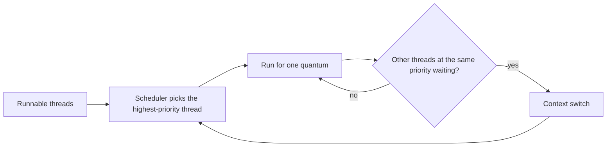
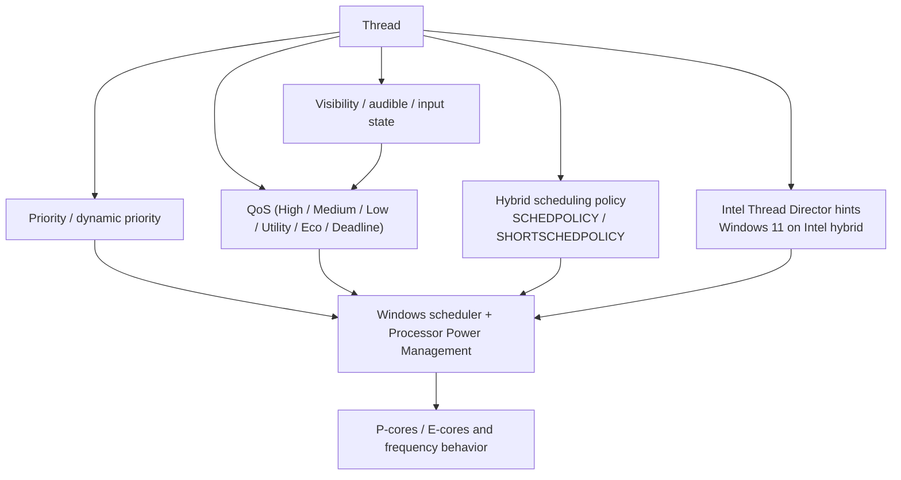

People have been repeating versions of this story on Windows for a long time:

"If I move the app out of the foreground, the audio starts crackling."

"Changing Processor scheduling to Background services made it stable."

That is especially common in audio, video, measurement, streaming, and always-on processing scenarios where the continuous work matters more than the UI itself.

But this setting is not a magic performance switch.  
It does not directly raise CPU clocks, it does not turn an ordinary application into a Windows service, and it does not pin work to P-cores. What it mainly changes is **how CPU time is distributed between foreground work and background work**.

This article connects the pieces:

- what the setting actually changes
- how `Programs` and `Background services` differ
- why the setting can matter for audio or continuous pipelines
- how quantum length and foreground boosts fit into the story
- why P-core / E-core systems add another layer on top

## 1. The short version

The practical summary is this:

- The setting changes the **distribution of CPU time**, not the raw horsepower of the CPU.
- `Programs` tends to favor the foreground application more strongly.
- `Background services` makes the foreground-versus-background split more even.
- That can help workloads where a background or side-car process has real timing deadlines.
- On modern P-core / E-core systems, core placement is influenced much more directly by QoS, power policy, hybrid scheduling, and Intel Thread Director.
- So changing to `Background services` does **not** mean "background work goes to P-cores" or "services go to E-cores."
- If your real problem is DPC / ISR latency, USB power saving, driver behavior, thermal throttling, or EcoQoS, this setting alone will not fix it.

In one sentence:

**This is not a CPU frequency setting. It is a scheduling-policy setting.**

## 2. What this setting is actually changing

The old `Processor scheduling` option is one of Windows' long-lived scheduling policy settings.  
Historically it is tied to `Win32PrioritySeparation`, which is why the setting has been around in one form or another for a long time.

The basic scheduler picture is:

- Windows picks the highest-priority runnable thread
- threads at the same priority level take turns
- that turn is bounded by a **quantum** or time slice

What `Processor scheduling` mainly affects is:

- how quantum time is distributed
- how strongly the foreground application is favored

And one important clarification:

choosing `Background services` does **not** turn your application into a Windows service.  
The word "services" in this setting is about CPU distribution policy, not about the application type itself.

## 3. What changes between `Programs` and `Background services`

A practical way to think about the difference is:

| Aspect | `Programs` | `Background services` |
| --- | --- | --- |
| Main bias | better interactive feel for the foreground app | more even treatment between foreground and background work |
| Foreground preference | stronger | weaker |
| Under CPU pressure | UI often feels better | continuous background work is less likely to get squeezed out |
| Common fit | interactive desktop usage | services, capture, encoding, continuous processing |
| Common side effect | background timing work may lose deadlines more easily | foreground UI can feel a bit less snappy in some cases |

Client Windows is naturally biased toward making the foreground app feel good.  
That is why `Programs` is the normal fit for ordinary desktop use.

But the balance changes in cases like:

- audio pipelines continuously filling buffers
- capture or analysis work running in worker threads or helper processes
- a foreground browser or IDE while a background pipeline still needs to hit deadlines
- service-like or resident workloads where the UI is not the main event

In those cases, reducing the foreground bias can make the system more stable overall.

## 4. Why it can help with audio or other continuous work

Audio is the easiest example to reason about.

Audio processing does not only need a good average.  
It needs the buffer to be ready **by the deadline** over and over again. A low average CPU load can still produce audible glitches if the important thread misses the wrong instant.

Imagine a situation like this:

- a browser, DAW UI, or some other front-end application is in the foreground
- a background thread or helper process keeps feeding audio buffers
- that audio path is not using extremely high priority, and its MMCSS / QoS usage is not ideal
- the CPU is moderately busy

With `Programs`, the foreground side can hold the CPU longer and more consistently.  
That can leave the background audio path in a state where the average looks fine, but the timing still slips often enough to underrun.

With `Background services`, the background work may get back onto the CPU more predictably, which reduces missed deadlines.

So when the setting helps, what is improving is not "raw speed."  
It is more like:

- the foreground bias is reduced
- the background workload gets fairer scheduling opportunities
- deadline misses become less frequent

## 5. The mechanism: quantum length and foreground preference

There is a straightforward reason this can happen.

### 5.1 Longer quanta make peers wait longer

If several threads are competing at similar priority levels, a thread that receives longer uninterrupted execution time naturally makes the others wait longer.

When the system favors the foreground more strongly, the foreground side can hold onto execution longer.  
That makes it easier for background work at similar priority to hear "not now" at exactly the wrong moment.

That is why this matters most to workloads that need to run a little bit, regularly, on time:

- audio
- video
- periodic sampling
- polling
- monitoring

### 5.2 Windows already does several kinds of foreground favoring

Windows pays attention to the foreground in multiple ways:

- process-level foreground preference
- preference for threads associated with the active window
- dynamic priority boosts after I/O completion

So simply taking an app out of the foreground already changes the practical scheduling picture.  
`Background services` is easier to understand if you think of it as reducing the **CPU-time skew** between foreground and background work.

### 5.3 "It keeps the CPU from slacking off" is only half-right

That phrase makes intuitive sense because the background work may indeed be left behind less often.  
But technically, the setting is not mainly about:

- idle states
- CPU frequency
- turbo boost
- core parking
- P-core pinning

It is mainly about **who runs when, and for how long**.

## 6. What changes on P-core / E-core CPUs

This is where confusion becomes much more common.

Choosing `Background services` does **not** mean Windows suddenly makes a simple decision like:

- background work -> E-cores
- foreground work -> P-cores

On modern Windows, especially Windows 11 on hybrid CPUs, the story is much more layered.

### 6.1 Two similar-sounding systems are not the same thing

There are two different layers here:

1. **The old `Processor scheduling` option with `Background services`**
   - classic foreground / background CPU-time distribution
   - quantum and foreground-boost territory

2. **Modern QoS categories such as Utility, Low, or Eco**
   - more directly involved in power / performance intent
   - much more relevant to P-core / E-core placement

Those are not the same mechanism.

### 6.2 On Windows 11, QoS and visibility matter a lot

On modern Windows, priority is not the whole picture. QoS matters too, and on heterogeneous CPUs that matters directly to which class of core the thread prefers.

In broad terms, Windows 11 behaves something like this:

| State / class | QoS flavor | Likely P-core / E-core tendency |
| --- | --- | --- |
| focused foreground app | High | performance-oriented |
| visible but not focused app | Medium | mixed |
| minimized or fully hidden app | Low | often more efficient-core friendly on battery |
| background services | Utility | often more efficient-core friendly on battery |
| explicit EcoQoS work | Eco | efficient-core leaning |
| multimedia thread with deadline treatment | Deadline | performance-oriented |

One big practical implication is that **minimizing an app can change its scheduling behavior** in ways that have little to do with the old `Processor scheduling` switch.

So on a hybrid laptop it is very normal to see a chain like:

- the app leaves the foreground
- then it gets minimized
- QoS drops
- efficient-core bias increases
- timing gets worse

That is a different layer from the old `Background services` option.

### 6.3 Thread Director and hybrid scheduling add another layer

On Intel hybrid CPUs, Intel Thread Director provides scheduling hints to the OS.  
Windows 11 uses those hints much more effectively than older Windows versions.

Windows also has heterogeneous scheduling policy settings such as:

- `SchedulingPolicy`
- `ShortSchedulingPolicy`
- `ShortThreadRuntimeThreshold`

Those work together with QoS and processor power management to shape where work lands and how it scales.

The full picture is closer to this:

The old `Processor scheduling` option still matters.  
It just no longer explains the whole story on its own.

## 7. When this helps, and when it does not

The fastest way to stay sane is to separate the cases where this setting is a good lead from the cases where it is not.

### 7.1 Cases where it can genuinely help

It is a reasonable lever when:

- moving focus away from the app makes only the background pipeline unstable
- overall CPU utilization is not saturated, but periodic deadlines still slip
- the critical work lives in a legacy app, helper process, or worker thread that is not using MMCSS / QoS well
- the real priority is background stability, not foreground UI feel

In those cases, the problem may really be:

**foreground favoritism is too strong for the workload you care about.**

### 7.2 Cases where it is weak or simply the wrong layer

This setting is not the whole answer if the real issue is:

- high DPC / ISR latency
- USB controller or audio-driver problems
- USB selective suspend or device power management
- thermal throttling
- battery saver, power throttling, or EcoQoS effects
- a buffer that is simply too small
- an app already using MMCSS / Deadline correctly, with the real problem somewhere else

On Windows 11 hybrid systems, if the behavior changes mainly when the app is minimized, hidden, or unplugged from AC, QoS and power policy are often the better place to look first.

## 8. A practical way to evaluate it

If you want to test this in a sane order, the following sequence works well:

1. **Fix the conditions**
   - AC or battery
   - power mode
   - buffer size
   - foreground / visible / minimized state

2. **Compare `Programs` and `Background services` under the same conditions**
   - record dropouts, glitches, or timing misses instead of relying only on feel

3. **On Windows 11 hybrid CPUs, check the QoS side too**
   - does it only get worse when minimized?
   - does audible playback change the behavior?
   - does it only happen on battery?

4. **For audio or video, inspect MMCSS usage**
   - is the important thread actually telling Windows that deadline behavior matters?

5. **If it still is not clear, move into DPC / ISR / USB / driver investigation**
   - at that point the story may no longer be mainly about scheduler policy

In practice, average CPU utilization is often less important than one question:

**Did the work hit its deadline?**

That is the real heart of these cases.

## 9. Wrap-up

If you compress the whole topic into one summary, it looks like this:

- the setting changes how CPU time is divided between foreground and background work
- `Programs` tends to make the foreground app feel better
- `Background services` can help continuous background work avoid being squeezed out
- that is why it can help with audio, video, capture, monitoring, and resident workloads
- but on P-core / E-core CPUs, actual core placement is also strongly influenced by QoS, power policy, hybrid scheduling, and Thread Director
- so on current Windows systems, this setting is often relevant, but rarely the entire explanation by itself

In short:

**This is a work-distribution knob, not a horsepower knob.**

It makes sense when the real problem is foreground favoritism.  
It makes much less sense when the real problem lives in QoS, drivers, power behavior, or interrupt latency.

## 10. References

- [Sawady: バックグラウンドサービスを優先する設定（CPUをサボらせない）](https://note.com/sawady1815/n/n4960ba9b3fb0)
- [Microsoft Learn: Win32_OperatingSystem class](https://learn.microsoft.com/en-us/windows/win32/cimwin32prov/win32-operatingsystem)
- [Microsoft Learn: Priority Boosts](https://learn.microsoft.com/en-us/windows/win32/procthread/priority-boosts)
- [Microsoft Learn: Window Features](https://learn.microsoft.com/en-us/windows/win32/winmsg/window-features)
- [Microsoft Learn: Quality of Service](https://learn.microsoft.com/en-us/windows/win32/procthread/quality-of-service)
- [Microsoft Learn: SetThreadInformation function](https://learn.microsoft.com/en-us/windows/win32/api/processthreadsapi/nf-processthreadsapi-setthreadinformation)
- [Microsoft Learn: SetProcessInformation function](https://learn.microsoft.com/en-us/windows/win32/api/processthreadsapi/nf-processthreadsapi-setprocessinformation)
- [Microsoft Learn: Multimedia Class Scheduler Service](https://learn.microsoft.com/en-us/windows/win32/procthread/multimedia-class-scheduler-service)
- [Microsoft Learn: Processor power management options overview](https://learn.microsoft.com/en-us/windows-hardware/customize/power-settings/configure-processor-power-management-options)
- [Microsoft Learn: SchedulingPolicy](https://learn.microsoft.com/en-us/windows-hardware/customize/power-settings/configuration-for-hetero-power-scheduling-schedulingpolicy)
- [Microsoft Learn: ShortSchedulingPolicy](https://learn.microsoft.com/en-us/windows-hardware/customize/power-settings/configuration-for-hetero-power-scheduling-shortschedulingpolicy)
- [Microsoft Learn: ShortThreadRuntimeThreshold](https://learn.microsoft.com/en-us/windows-hardware/customize/power-settings/configuration-for-hetero-power-scheduling-shortthreadruntimethreshold)
- [Intel Support: Is Windows 10 Task Scheduler Optimized for 12th Generation Intel Core Processors?](https://www.intel.com/content/www/us/en/support/articles/000091284/processors.html)
- [Intel White Paper: Intel performance hybrid architecture & software optimizations, Part Two](https://cdrdv2-public.intel.com/685865/211112_Hybrid_WP_2_Developing_v1.2.pdf)
